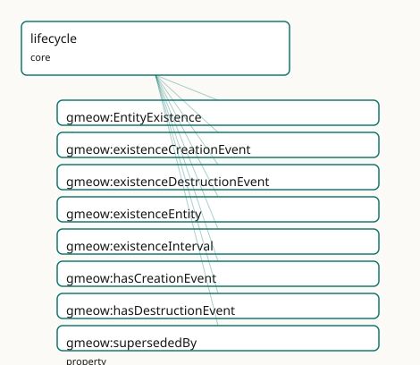

<!-- GENERATED by gmeow ontology-docs. DO NOT EDIT. -->

# GMEOW Lifecycle Module

- **IRI:** <https://blackcatinformatics.ca/gmeow/slices/lifecycle>
- **Tier:** core
- **[`Group`](../reference/classes/gmeow-Group.md):** core

## What This Slice Covers

This slice owns 8 terms and contributes 8 mapping or projection rows. Use it when its terms match the native fact you want to preserve; use the linkage tables to see how those facts leave GMEOW for consumer vocabularies.

## Dependencies

- [`gmeow:slices/coreference`](coreference.md)
- [`gmeow:slices/events`](events.md)
- [`gmeow:slices/kernel`](kernel.md)
- [`gmeow:slices/temporal`](temporal.md)

## Consumers

- Birth/death and existence events for persons and places across the corpus.

## Local Map



## Examples

### Dissolved Org

- **Source:** [`slices/core/lifecycle/examples/dissolved-org.ttl`](https://github.com/Blackcat-Informatics/gmeow-ontology/blob/main/slices/core/lifecycle/examples/dissolved-org.ttl)
- **GMEOW terms:** [`gmeow:Event`](../reference/classes/gmeow-Event.md), [`gmeow:Instant`](../reference/classes/gmeow-Instant.md), [`gmeow:Organization`](../reference/classes/gmeow-Organization.md), [`gmeow:TimeInterval`](../reference/classes/gmeow-TimeInterval.md), [`gmeow:displayable`](../reference/properties/gmeow-displayable.md), [`gmeow:eventTemporalFrame`](../reference/properties/gmeow-eventTemporalFrame.md), [`gmeow:eventTime`](../reference/properties/gmeow-eventTime.md), [`gmeow:eventType`](../reference/properties/gmeow-eventType.md), [`gmeow:eventTypeCreation`](../reference/individuals/gmeow-eventTypeCreation.md), [`gmeow:eventTypeDestruction`](../reference/individuals/gmeow-eventTypeDestruction.md)
- **External prefixes:** `xsd`

```turtle
# SPDX-FileCopyrightText: 2026 Blackcat Informatics® Inc. <paudley@blackcatinformatics.ca>
# SPDX-License-Identifier: CC-BY-4.0
#
# Worked example: existence over time, where deletion does not exist. A
# company is founded, then dissolved — but it STAYS in the graph, marked no
# longer extant, because the past is data (Principle 10: destruction is an ontic
# fact, suppression is a display contract, deletion does not exist). The creation
# and destruction events are ordinary gmeow:Events carrying value-typed
# eventTypes (a single occurrence can be both eventTypeDissolution AND
# eventTypeDestruction — co-equal values, never a subclass tower, P9). The
# existence interval bounds the lifespan, and supersededBy points at the
# successor that carried on the work.
@prefix gmeow: <https://blackcatinformatics.ca/gmeow/> .
@prefix ex:    <https://blackcatinformatics.ca/gmeow/examples/lifecycle/> .
@prefix rdfs:  <http://www.w3.org/2000/01/rdf-schema#> .
@prefix xsd:   <http://www.w3.org/2001/XMLSchema#> .

# --- The dissolved company: still here, with its full lifecycle attached.
#     Superseded AND no longer extant, so gmeow:displayable false suppresses it
#     from default display — the record is retained, never deleted (P10).
ex:meridian a gmeow:Organization ;
    gmeow:name "Meridian Systems Ltd."@en ;
    gmeow:hasCreationEvent ex:founding ;
    gmeow:hasDestructionEvent ex:dissolution ;
    gmeow:existenceInterval ex:meridianLife ;
    gmeow:supersededBy ex:apex ;
    gmeow:displayable false .

# --- Creation: a founding event, value-typed both Founding-as-Creation.
ex:founding a gmeow:Event ;
    rdfs:label "incorporation of Meridian Systems"@en ;
    gmeow:eventType gmeow:eventTypeCreation ;
    gmeow:eventTime "2010-04-01T00:00:00Z"^^xsd:dateTime ;
    gmeow:eventTemporalFrame gmeow:temporalFrameUTCGregorian .

# --- Destruction: ONE occurrence carrying two co-equal eventType values.
ex:dissolution a gmeow:Event ;
    rdfs:label "dissolution of Meridian Systems"@en ;
    gmeow:eventType gmeow:eventTypeDissolution , gmeow:eventTypeDestruction ;
    gmeow:eventTime "2024-11-30T00:00:00Z"^^xsd:dateTime ;
    gmeow:eventTemporalFrame gmeow:temporalFrameUTCGregorian .

# --- The existence interval (the lifespan), bounded by framed instants.
ex:meridianLife a gmeow:TimeInterval ;
    gmeow:hasStartInstant ex:lifeBegin ;
    gmeow:hasEndInstant ex:lifeEnd ;
    gmeow:hasTemporalFrame gmeow:temporalFrameUTCGregorian .

ex:lifeBegin a gmeow:Instant ;
    gmeow:instantValue "2010-04-01T00:00:00Z"^^xsd:dateTime ;
    gmeow:inTemporalFrame gmeow:temporalFrameUTCGregorian .

ex:lifeEnd a gmeow:Instant ;
    gmeow:instantValue "2024-11-30T00:00:00Z"^^xsd:dateTime ;
    gmeow:inTemporalFrame gmeow:temporalFrameUTCGregorian .

# --- The successor, still extant, that superseded Meridian.
ex:apex a gmeow:Organization ;
    gmeow:name "Apex Systems Inc."@en ;
    gmeow:hasCreationEvent ex:apexFounding .

ex:apexFounding a gmeow:Event ;
    rdfs:label "incorporation of Apex Systems"@en ;
    gmeow:eventType gmeow:eventTypeCreation ;
    gmeow:eventTime "2024-12-01T00:00:00Z"^^xsd:dateTime ;
    gmeow:eventTemporalFrame gmeow:temporalFrameUTCGregorian .
```

## Terms

### Classes

| Term | Label | Definition |
|---|---|---|
| [`gmeow:EntityExistence`](../reference/classes/gmeow-EntityExistence.md) | Entity Existence | The reified, time-scoped fact that an entity existed over an interval — a [gufo:Situation](http://purl.org/nemo/gufo#Situation) that carries its period via [`gmeow:duringInterval`](../reference/properties/gmeow-duringInterval.md) (inherited from TimeS... |

### Properties

| Term | Label | Definition |
|---|---|---|
| [`gmeow:existenceCreationEvent`](../reference/properties/gmeow-existenceCreationEvent.md) | existence creation event | The creation event associated with this existence record. Optional: an EntityExistence may record only an interval when the creation event is unknown. |
| [`gmeow:existenceDestructionEvent`](../reference/properties/gmeow-existenceDestructionEvent.md) | existence destruction event | The destruction event associated with this existence record. Optional: an EntityExistence for a still-extant entity has no destruction event. |
| [`gmeow:existenceEntity`](../reference/properties/gmeow-existenceEntity.md) | existence entity | The entity whose existence is recorded by this EntityExistence. Functional: an EntityExistence concerns exactly one entity (constitutive of the situation's ide... |
| [`gmeow:existenceInterval`](../reference/properties/gmeow-existenceInterval.md) | existence interval | The time interval over which an entity exists. Open-ended (no end instant) when the entity is still extant. Non-functional: in a multi-source merge, different... |
| [`gmeow:hasCreationEvent`](../reference/properties/gmeow-hasCreationEvent.md) | has creation event | Links an entity to the event that brought it into existence — the general form of birth (person), founding (organization), minting (currency), or realization (... |
| [`gmeow:hasDestructionEvent`](../reference/properties/gmeow-hasDestructionEvent.md) | has destruction event | Links an entity to the event that ended its existence — the general form of death (person), dissolution (organization), destruction (place), or retirement (fra... |
| [`gmeow:supersededBy`](../reference/properties/gmeow-supersededBy.md) | superseded by | Links an entity to the entity that replaced it — Constantinople supersededBy Istanbul, the Soviet Union supersededBy the Russian Federation, a deprecated softw... |

## Linkages

- **Rows:** 8
- **Projection profiles:** `dcterms`, `oai_dc`, `schema-org`
- **External vocabularies:** `dc`, `dcterms`, `prov`, `schema`, `wdt`

| Source | Kind | Profile | Predicate/Relation | Target | Evidence |
|---|---|---|---|---|---|
| [`gmeow:hasCreationEvent`](../reference/properties/gmeow-hasCreationEvent.md) | equivalence | `-` | [skos:closeMatch](http://www.w3.org/2004/02/skos/core#closeMatch) | [prov:wasGeneratedBy](http://www.w3.org/ns/prov#wasGeneratedBy) | `gmeow-lifecycle.sssom.tsv`; `gmeow:eqLifecycle001`; confidence 0.9 |
| [`gmeow:hasDestructionEvent`](../reference/properties/gmeow-hasDestructionEvent.md) | equivalence | `-` | [skos:closeMatch](http://www.w3.org/2004/02/skos/core#closeMatch) | [prov:wasInvalidatedBy](http://www.w3.org/ns/prov#wasInvalidatedBy) | `gmeow-lifecycle.sssom.tsv`; `gmeow:eqLifecycle002`; confidence 0.9 |
| [`gmeow:supersededBy`](../reference/properties/gmeow-supersededBy.md) | equivalence | `-` | [skos:closeMatch](http://www.w3.org/2004/02/skos/core#closeMatch) | [dcterms:isReplacedBy](http://purl.org/dc/terms/isReplacedBy) | `gmeow-dublin-core.sssom.tsv`; `gmeow:eqDcTerms020`; confidence 0.85 |
| [`gmeow:supersededBy`](../reference/properties/gmeow-supersededBy.md) | equivalence | `-` | [skos:closeMatch](http://www.w3.org/2004/02/skos/core#closeMatch) | [wdt:P1366](https://www.wikidata.org/wiki/Property:P1366) | `gmeow-lifecycle.sssom.tsv`; `gmeow:eqLifecycle004`; confidence 0.9 |
| [`gmeow:hasCreationEvent`](../reference/properties/gmeow-hasCreationEvent.md) | projection | `schema-org` | projects to / <= | [schema:foundingDate](https://schema.org/foundingDate) | `gmeow:mapSchemaFoundingDate`; confidence 0.9; lossy: the creation event's place, participants, and standpoint are dropped; only the instant survives as [schema:foundingDate](https://schema.org/foundingDate) |
| [`gmeow:hasDestructionEvent`](../reference/properties/gmeow-hasDestructionEvent.md) | projection | `schema-org` | projects to / <= | [schema:dissolutionDate](https://schema.org/dissolutionDate) | `gmeow:mapSchemaDissolutionDate`; confidence 0.9; lossy: the destruction event's place, participants, and standpoint are dropped; only the instant survives as [schema:dissolutionDate](https://schema.org/dissolutionDate) |
| [`gmeow:supersededBy`](../reference/properties/gmeow-supersededBy.md) | projection | `dcterms` | projects to / = | [dcterms:isReplacedBy](http://purl.org/dc/terms/isReplacedBy) | `gmeow:mapDctermsIsReplacedBy`; confidence 0.85 |
| [`gmeow:supersededBy`](../reference/properties/gmeow-supersededBy.md) | projection | `oai_dc` | projects to / <= | [dc:relation](http://purl.org/dc/elements/1.1/relation) | `gmeow:mapOaiDcIsReplacedBy`; confidence 0.7; lossy: all relation refinements collapse to [dc:relation](http://purl.org/dc/elements/1.1/relation) |

## Guide

<!-- SPDX-FileCopyrightText: 2026 Blackcat Informatics® Inc. <paudley@blackcatinformatics.ca> -->
<!-- SPDX-License-Identifier: CC-BY-4.0 -->

# Lifecycle — existence over time, for anything

> **Slice:** `https://blackcatinformatics.ca/gmeow/slices/lifecycle` · **tier: core**
> Birth, founding, minting, death, dissolution, retirement — one facility for the existence of every entity.

Universal time-bounded existence facility: ontic existence-over-time for any [`gmeow:Entity`](../reference/classes/gmeow-Entity.md), distinct from suppression (a display contract). Every entity may carry creation and destruction events, an existence interval, and supersession links. Revised forward, never deleted ([Principle 10](https://github.com/Blackcat-Informatics/gmeow-ontology/blob/main/CONSTITUTION.md#principle-10)). Reuses the events module ([`gmeow:Event`](../reference/classes/gmeow-Event.md) + [`EventType`](../reference/classes/gmeow-EventType.md) value vocabulary), the temporal module ([`TimeInterval`](../reference/classes/gmeow-TimeInterval.md) / [`TimeScopedRelation`](../reference/classes/gmeow-TimeScopedRelation.md) / [`validFrom`](../reference/properties/gmeow-validFrom.md) / [`validUntil`](../reference/properties/gmeow-validUntil.md)), and the standpoint module ([`accordingTo`](../reference/properties/gmeow-accordingTo.md) / contested claims). Flat-first, reify on demand.

The slice draws one line hard: **destruction is an ontic fact; suppression is a display
contract; deletion does not exist.** A dissolved organization, a demolished place, a
retired reference frame — all remain in the graph, marked as no longer extant, because
the past is data ([Principle 10](https://github.com/Blackcat-Informatics/gmeow-ontology/blob/main/CONSTITUTION.md#principle-10)). And because the model is event-typed by value
([Principle 9](https://github.com/Blackcat-Informatics/gmeow-ontology/blob/main/CONSTITUTION.md#principle-9)), no per-kind machinery is minted: a person's birth event is the same
[`gmeow:Event`](../reference/classes/gmeow-Event.md) carrying both [`gmeow:eventTypeBirth`](../reference/individuals/gmeow-eventTypeBirth.md) and [`gmeow:eventTypeCreation`](../reference/individuals/gmeow-eventTypeCreation.md) —
co-equal values on one occurrence, never a subclass tower.

Flat-first governs the shape: the three direct hooks below cover the 80 % case; the
reified [`gmeow:EntityExistence`](../reference/classes/gmeow-EntityExistence.md) is the promotion target when the existence claim itself
needs identity — contested bounds, attached evidence, standpoint indexing.

## The flat hooks (the 80 % case)

### [`gmeow:hasCreationEvent`](../reference/properties/gmeow-hasCreationEvent.md)

Links any entity to the event that brought it into existence — the general form of
birth (person), founding (organization), minting (currency), or realization (reference
frame). Non-functional: competing standpoint-indexed creation claims coexist, none
privileged. The event side carries [`gmeow:eventTypeCreation`](../reference/individuals/gmeow-eventTypeCreation.md) (events slice), alongside
any more specific value such as [`gmeow:eventTypeBirth`](../reference/individuals/gmeow-eventTypeBirth.md).

### [`gmeow:hasDestructionEvent`](../reference/properties/gmeow-hasDestructionEvent.md)

The mirror: the event that ended the entity's existence — death, dissolution,
destruction, retirement. Non-functional for the same standpoint reasons. Destruction is
ontic; it never implies [`gmeow:displayable`](../reference/properties/gmeow-displayable.md) false, and [`gmeow:displayable`](../reference/properties/gmeow-displayable.md) false never
implies destruction.

### [`gmeow:existenceInterval`](../reference/properties/gmeow-existenceInterval.md)

The entity's span of existence as a [`gmeow:TimeInterval`](../reference/classes/gmeow-TimeInterval.md) (temporal slice) — open-ended
(no end instant) while the entity is extant. Non-functional: in a multi-source merge,
different sources give different bounds, and those claims coexist as standpoint-indexed
statements. The interval carries its frame per [Principle 11](https://github.com/Blackcat-Informatics/gmeow-ontology/blob/main/CONSTITUTION.md#principle-11).

### [`gmeow:supersededBy`](../reference/properties/gmeow-supersededBy.md)

Links an entity to the entity that replaced it — Constantinople [`supersededBy`](../reference/properties/gmeow-supersededBy.md)
Istanbul, a deprecated release [`supersededBy`](../reference/properties/gmeow-supersededBy.md) its successor. The declared inverse of
the coreference slice's [`gmeow:supersedes`](../reference/properties/gmeow-supersedes.md); directional, never symmetric. The
superseded entity is retained ([Principle 10](https://github.com/Blackcat-Informatics/gmeow-ontology/blob/main/CONSTITUTION.md#principle-10)) and may carry [`gmeow:displayable`](../reference/properties/gmeow-displayable.md) false;
the replacement itself may be recorded as an event typed
[`gmeow:eventTypeSupersession`](../reference/individuals/gmeow-eventTypeSupersession.md) when it needs a date or participants.

## The reified form (promote on demand)

### [`gmeow:EntityExistence`](../reference/classes/gmeow-EntityExistence.md)

The time-scoped fact that an entity existed over an interval — a [gufo:Situation](http://purl.org/nemo/gufo#Situation)
specializing [`gmeow:TimeScopedRelation`](../reference/classes/gmeow-TimeScopedRelation.md), carrying its period via
[`gmeow:duringInterval`](../reference/properties/gmeow-duringInterval.md). Promote here when the existence claim is *contested* (two
sources disagree on when a place ceased), when evidence must attach to the claim
itself, or when standpoint indexing is needed. Open-world EL axioms require some
[`gmeow:existenceEntity`](../reference/properties/gmeow-existenceEntity.md); the closed-world "exactly one" is SHACL's
(`EntityExistenceHasEntityShape`).

### [`gmeow:existenceEntity`](../reference/properties/gmeow-existenceEntity.md)

The functional post: exactly one entity per existence record — constitutive of the
situation's identity.

### [`gmeow:existenceCreationEvent`](../reference/properties/gmeow-existenceCreationEvent.md) · [`gmeow:existenceDestructionEvent`](../reference/properties/gmeow-existenceDestructionEvent.md)

Optional event hooks on the reified record: an [`EntityExistence`](../reference/classes/gmeow-EntityExistence.md) may record only an
interval when the creation event is unknown, and a still-extant entity's record simply
has no destruction event. Absence of an end is a statement about the world, not a gap
in the data.

## Solver layer & alignment

Existence *consistency* — creation precedes destruction, the interval brackets both,
participation does not outlive the participant — is gate and solver work (Principle
12): the slice asserts the claims; verification queries and the temporal solver check
their coherence on the reasoned graph. No external lifecycle vocabulary is imported;
the facility is expressed entirely through the events, temporal, and standpoint
machinery it reuses, with bridges riding those slices' alignments ([Principle 5](https://github.com/Blackcat-Informatics/gmeow-ontology/blob/main/CONSTITUTION.md#principle-5)).

## Dependencies

Depends on `kernel`, `coreference` (`supersedes`), `events` ([`Event`](../reference/classes/gmeow-Event.md) + the
creation/destruction/supersession type values), and `temporal` ([`TimeInterval`](../reference/classes/gmeow-TimeInterval.md),
[`TimeScopedRelation`](../reference/classes/gmeow-TimeScopedRelation.md), the statement clocks). Consumed by birth/death and existence
claims for persons, places, organizations, and artifacts across the corpus.
