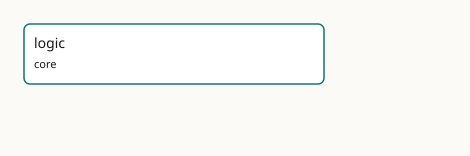

<!-- GENERATED by gmeow ontology-docs. DO NOT EDIT. -->

# GMEOW Logic

- **IRI:** <https://blackcatinformatics.ca/gmeow/slices/logic>
- **Tier:** core
- **[`Group`](../reference/classes/gmeow-Group.md):** core

## What This Slice Covers

This slice owns 0 terms and contributes 0 mapping or projection rows. Use it when its terms match the native fact you want to preserve; use the linkage tables to see how those facts leave GMEOW for consumer vocabularies.

## Consumers

- The reasoning layer and every projection consumer: the native [`logic:`](https://blackcatinformatics.ca/logic/) solver is the reasoning authority, and OWL/Datalog/SHACL/Prolog/N3 reasoners consume generated views of it ([Principle 17](https://github.com/Blackcat-Informatics/gmeow-ontology/blob/main/CONSTITUTION.md#principle-17)). Foundational by [Principle 15](https://github.com/Blackcat-Informatics/gmeow-ontology/blob/main/CONSTITUTION.md#principle-15): it serves every consumer by construction. The foundation vocabulary is now minted; the solver and generators are deferred to later rungs of the logic roadmap.

## Design Documents

This slice includes slice-local design notes. They are authored beside the slice and rendered into the docs as part of the same deterministic documentation bundle.

| Document | Source |
|---|---|
| [Logic Conformance](logic/design/LOGIC-CONFORMANCE.md) | [`slices/core/logic/design/LOGIC-CONFORMANCE.md`](https://github.com/Blackcat-Informatics/gmeow-ontology/blob/main/slices/core/logic/design/LOGIC-CONFORMANCE.md) |
| [Logic Migration](logic/design/LOGIC-MIGRATION.md) | [`slices/core/logic/design/LOGIC-MIGRATION.md`](https://github.com/Blackcat-Informatics/gmeow-ontology/blob/main/slices/core/logic/design/LOGIC-MIGRATION.md) |
| [Logic References](logic/design/LOGIC-REFERENCES.md) | [`slices/core/logic/design/LOGIC-REFERENCES.md`](https://github.com/Blackcat-Informatics/gmeow-ontology/blob/main/slices/core/logic/design/LOGIC-REFERENCES.md) |
| [Logic Runtime](logic/design/LOGIC-RUNTIME.md) | [`slices/core/logic/design/LOGIC-RUNTIME.md`](https://github.com/Blackcat-Informatics/gmeow-ontology/blob/main/slices/core/logic/design/LOGIC-RUNTIME.md) |
| [Logic Semantics](logic/design/LOGIC-SEMANTICS.md) | [`slices/core/logic/design/LOGIC-SEMANTICS.md`](https://github.com/Blackcat-Informatics/gmeow-ontology/blob/main/slices/core/logic/design/LOGIC-SEMANTICS.md) |
| [Logic](logic/design/LOGIC.md) | [`slices/core/logic/design/LOGIC.md`](https://github.com/Blackcat-Informatics/gmeow-ontology/blob/main/slices/core/logic/design/LOGIC.md) |

## Local Map



## Examples

### Projection Loss Ledger

- **Source:** [`slices/core/logic/examples/projection-loss-ledger.ttl`](https://github.com/Blackcat-Informatics/gmeow-ontology/blob/main/slices/core/logic/examples/projection-loss-ledger.ttl)
- **GMEOW terms:** [`gmeow:InformationObject`](../reference/classes/gmeow-InformationObject.md)
- **External prefixes:** `logic`, `xsd`

```turtle
# SPDX-FileCopyrightText: 2026 Blackcat Informatics® Inc. <paudley@blackcatinformatics.ca>
# SPDX-License-Identifier: CC-BY-4.0
#
# Worked example — the logic: foundation surface in use: a rule set declares the
# SEMANTIC PROFILE that governs its reading, a derivation rides the four
# normatively-DISTINCT quantitative axes, and a projection records its
# PRESERVATION POLARITY in the loss ledger (Principle 17).
#
# The shape of the example mirrors the logic doctrine: "sound" is meaningless
# until the profile is named, so every rule set declares one; and a lossy
# projection must say what it GUARANTEES about answers, not only what it omits —
# so each projection carries a logic:preservationKind alongside its complexity
# class. The four axes (probability, confidence, weight, evidenceStrength) are
# carried on the SAME derivation to show they are independent numbers, never
# interchangeable. No Expression-typed value is asserted, so no P11 frame is
# required.

@prefix gmeow: <https://blackcatinformatics.ca/gmeow/> .
@prefix logic: <https://blackcatinformatics.ca/logic/> .
@prefix ex:    <https://blackcatinformatics.ca/gmeow/examples/logic/> .
@prefix rdfs:  <http://www.w3.org/2000/01/rdf-schema#> .
@prefix xsd:   <http://www.w3.org/2001/XMLSchema#> .

# --- A rule set MUST declare the semantic profile that governs it; a rule set
#     with no declared profile is rejected by the compiler. This one is
#     positive (negation-free), so it rides the monotonic Horn least-model
#     semantics (logic:PositiveHornProfile) — the base case against which the
#     richer profiles add cost.  No logic:RuleSet class is minted (the
#     vocabulary is foundation-only); the rule set is modelled as a
#     gmeow:InformationObject and linked to the REAL declared profile individual
#     via rdfs:seeAlso, which is sufficient to make the pedagogical connection
#     without inventing new vocabulary.
ex:mortalityRuleSet a gmeow:InformationObject ;
    rdfs:label "the mortality rule set is read under positive Horn semantics"@en ;
    rdfs:seeAlso logic:PositiveHornProfile .

# --- A single derivation carrying all FOUR quantitative axes at once, to make
#     plain that they are distinct and not interchangeable: a calibrated
#     probability is not an asserter's confidence, a solver ranking weight, or
#     an evidential warrant. A confidence is NOT read as a probability absent an
#     explicit mapping (the named failure mode this surface guards against).
ex:derivation-socratesMortal a gmeow:InformationObject ;
    rdfs:label "derived: Socrates is mortal"@en ;
    logic:probability "0.99"^^xsd:decimal ;       # calibrated, only under the probabilistic profile
    logic:confidence "0.9"^^xsd:decimal ;         # the asserter's epistemic confidence
    logic:weight "1.0"^^xsd:decimal ;             # a solver ranking preference
    logic:evidenceStrength "0.8"^^xsd:decimal .   # provenance-derived evidential warrant

# --- The loss ledger: a projection of the canonical logic: model down to an
#     OWL-EL view records BOTH a complexity class AND a preservation polarity.
#     Overclaiming preservation is a red build, exactly like dropping a fact
#     silently — so the projection honestly declares a SOUND UNDER-APPROXIMATION:
#     anything it entails is canonically valid, but it may miss canonical answers.
ex:elProjectionReport a gmeow:InformationObject ;
    rdfs:label "OWL-EL projection of the mortality rule set"@en ;
    logic:preservationKind logic:SoundUnderApproximation ;
    logic:complexityClass "EL → PTIME" .

# --- A bridge view (e.g. a BFO/DOLCE alignment) constrains but does not reason:
#     the honest label is validation-only — it can flag ill-formedness without
#     computing canonical consequences, never claiming exact preservation.
ex:bridgeViewReport a gmeow:InformationObject ;
    rdfs:label "upper-ontology bridge view of the foundation sorts"@en ;
    logic:preservationKind logic:ValidationOnly ;
    logic:complexityClass "structural validation only" .
```

## Guide

<!-- SPDX-FileCopyrightText: 2026 Blackcat Informatics® Inc. <paudley@blackcatinformatics.ca> -->
<!-- SPDX-License-Identifier: CC-BY-4.0 -->

# Logic — the [`logic:`](https://blackcatinformatics.ca/logic/) reasoning layer

> **Slice:** `https://blackcatinformatics.ca/gmeow/slices/logic` · **tier: core**
> The maximally expressive, RDF 1.2-native logic in which GMEOW's model is authored, and of which
> every prior formalism (OWL, RDFS, SHACL, Datalog, Prolog, N3, SPARQL, and the gUFO/BFO/DOLCE upper
> ontologies) is a *generated lossy projection* — Constitution **[Principle 17](https://github.com/Blackcat-Informatics/gmeow-ontology/blob/main/CONSTITUTION.md#principle-17)**.

This slice is the home of **GMEOW Logic ([`logic:`](https://blackcatinformatics.ca/logic/))**. The [`logic:`](https://blackcatinformatics.ca/logic/) namespace is registered and the
**foundation vocabulary is now minted**: the UFO⁺ sorts
(`Kind`/`SubKind`/`Phase`/[`Role`](../reference/classes/gmeow-Role.md)/`Category`/`Mixin`/`RoleMixin`/`PhaseMixin`/`Relator`/[`Event`](../reference/classes/gmeow-Event.md)/`Situation`),
the foundation relations (`rigidlyAppliesTo`/`suppliesIdentity`/`mediates`), the semantic profiles
(`PositiveHornProfile`, `StratifiedNAFProfile`, `WellFoundedProfile`, `StableModelProfile`,
`ProceduralPrologProfile`, `ProbabilisticProfile`), the world/modal terms
(`World`/`accessibleFrom`/`counterfactualOf`), the quantitative axes
(`probability`/`confidence`/`weight`/`evidenceStrength`), and the preservation-polarity vocabulary
(`PreservationKind`/`preservationKind`/`complexityClass` and their named individuals) are all declared
as **bare standalone terms that add no axioms to the reasoned core**. The rules, solver, generators,
runtime, and full conformance corpus remain deferred to later rungs of the logic roadmap.

## The design set

The design is split by genre into five documents under [`design/`](./design/), so it can be
implemented against rather than only read:

| Document | Genre | Contents |
|---|---|---|
| [`design/LOGIC.md`](./design/LOGIC.md) | manifesto | vision, doctrine, lineage, target architecture |
| [`design/LOGIC-SEMANTICS.md`](./design/LOGIC-SEMANTICS.md) | formal semantics | the unified core, triple-term/assertion rules, semantic profiles, modality, worlds, decidability |
| [`design/LOGIC-RUNTIME.md`](./design/LOGIC-RUNTIME.md) | runtime | solver architecture, the Nemo–Prolog seam, graph versioning, generated artifacts, CLI |
| [`design/LOGIC-MIGRATION.md`](./design/LOGIC-MIGRATION.md) | rollout | the MVP ladder, adapter phases, gates, deprecations, the design risk register |
| [`design/LOGIC-CONFORMANCE.md`](./design/LOGIC-CONFORMANCE.md) | contract | the conformance corpus and the loss-ledger preservation contract |
| [`design/LOGIC-REFERENCES.md`](./design/LOGIC-REFERENCES.md) | appendix | external standards, theory, and engines cited — staged for the `metadata/references.ttl` ledger |

## What it commits to

- **The logic is canonical; OWL is a projection of it, not its ceiling.** [`logic:`](https://blackcatinformatics.ca/logic/) is RDF 1.2-native
 and Turing-complete by intent; decidability is a property of a *projection* or a declared *profile*,
 never a cap on what the canonical model may say.
- **The foundation is authored in [`logic:`](https://blackcatinformatics.ca/logic/) (UFO⁺).** [gUFO](../external/ontologies.md#target-gufo) is its primary generated down-projection;
 BFO, DOLCE, and [SUMO](../external/ontologies.md#target-sumo) are generated bridge views, not truth-preserving projections. The OntoUML
 discipline that lives in external lint becomes actual axioms, with the lints retained as
 projection-conformance tests.
- **Verified by construction.** A slow, correct Python oracle and a fast Rust core (oxigraph + Nemo +
 an embedded Prolog, bound by PyO3/wasm — the GTS model) must pass one shared, language-neutral
 conformance corpus identically ([Principle 7](https://github.com/Blackcat-Informatics/gmeow-ontology/blob/main/CONSTITUTION.md#principle-7)).

## Status

Foundation vocabulary minted; implementation deferred. The [`logic:`](https://blackcatinformatics.ca/logic/) namespace and the foundational
surface — 37 bare term declarations — have landed. The reasoned core is unchanged because the minted
terms carry no axioms. The solver, generators, runtime, full conformance corpus, and the matching
enforcement gates in [`governance/constitution.ttl`](../../../governance/constitution.ttl) land in
later rungs of the logic roadmap. Until then, [Principle 17](https://github.com/Blackcat-Informatics/gmeow-ontology/blob/main/CONSTITUTION.md#principle-17) is enforced by design-review practice and
surfaces as a warning, never silently.

## Terms

The foundation surface is authored in the [`logic:`](https://blackcatinformatics.ca/logic/) namespace
(`https://blackcatinformatics.ca/logic/`), **standalone by design**: [`logic:`](https://blackcatinformatics.ca/logic/) is
the canonical ground and `gmeow:` (with [gUFO](../external/ontologies.md#target-gufo), OWL, SHACL, …) is a generated lossy
projection of it ([Principle 17](https://github.com/Blackcat-Informatics/gmeow-ontology/blob/main/CONSTITUTION.md#principle-17)), so the foundation terms carry no `gmeow:`
parentage. The [`logic:`](https://blackcatinformatics.ca/logic/) UFO⁺ sorts
(`Kind`/`SubKind`/`Phase`/[`Role`](../reference/classes/gmeow-Role.md)/`Category`/`Mixin`/`RoleMixin`/`PhaseMixin`/`Relator`/[`Event`](../reference/classes/gmeow-Event.md)/`Situation`),
the foundation relations (`rigidlyAppliesTo`/`suppliesIdentity`/`mediates`), the
semantic profiles, the world/modal terms
(`World`/`accessibleFrom`/`counterfactualOf`), the four quantitative axes
(`probability`/`confidence`/`weight`/`evidenceStrength`), and the
preservation-polarity vocabulary (`PreservationKind` and its individuals) are all
documented term-by-term in [`module.ttl`](./module.ttl) and the design set above.

### [`gmeow:sharpens`](../reference/properties/gmeow-sharpens.md)

The one `gmeow:`-side seam the foundation names: [`logic:accessibleFrom`](https://blackcatinformatics.ca/logic/accessibleFrom) (the
Kripke accessibility relation between worlds) generalizes the standpoint
sharpening poset asserted on the `gmeow:` side via [`gmeow:sharpens`](../reference/properties/gmeow-sharpens.md). The
specialization is declared on the `gmeow:` side, never minted as an axiom in this
module, so the [`logic:`](https://blackcatinformatics.ca/logic/) foundation stays standalone ([Principle 17](https://github.com/Blackcat-Informatics/gmeow-ontology/blob/main/CONSTITUTION.md#principle-17)).
