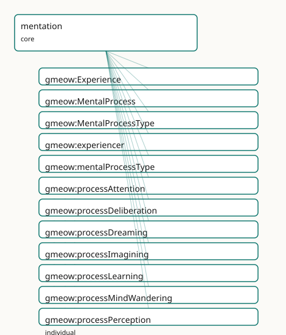

<!-- GENERATED by gmeow ontology-docs. DO NOT EDIT. -->

# GMEOW Mentation Module

- **IRI:** <https://blackcatinformatics.ca/gmeow/slices/mentation>
- **Tier:** core
- **[`Group`](../reference/classes/gmeow-Group.md):** core

## What This Slice Covers

This slice owns 17 terms and contributes 1 mapping or projection rows. Use it when its terms match the native fact you want to preserve; use the linkage tables to see how those facts leave GMEOW for consumer vocabularies.

## Dependencies

- [`gmeow:slices/events`](events.md)
- [`gmeow:slices/kernel`](kernel.md)
- [`gmeow:slices/observations`](observations.md)
- [`gmeow:slices/temporal`](temporal.md)

## Consumers

- The agent-memory timeline — a unified, queryable record of an agent's mental life as it unfolds; the single occurrent substrate that inference, learning, imagination, and dreaming specialise or compose over.

## Local Map



## Examples

### Mental Timeline

- **Source:** [`slices/core/mentation/examples/mental-timeline.ttl`](https://github.com/Blackcat-Informatics/gmeow-ontology/blob/main/slices/core/mentation/examples/mental-timeline.ttl)
- **GMEOW terms:** [`gmeow:Agent`](../reference/classes/gmeow-Agent.md), [`gmeow:CognitiveState`](../reference/classes/gmeow-CognitiveState.md), [`gmeow:Event`](../reference/classes/gmeow-Event.md), [`gmeow:Experience`](../reference/classes/gmeow-Experience.md), [`gmeow:MentalMoment`](../reference/classes/gmeow-MentalMoment.md), [`gmeow:MentalProcess`](../reference/classes/gmeow-MentalProcess.md), [`gmeow:eventTemporalFrame`](../reference/properties/gmeow-eventTemporalFrame.md), [`gmeow:eventTime`](../reference/properties/gmeow-eventTime.md), [`gmeow:experiencer`](../reference/properties/gmeow-experiencer.md), [`gmeow:mentalProcessType`](../reference/properties/gmeow-mentalProcessType.md)
- **External prefixes:** `gufo`, `xsd`

```turtle
# SPDX-FileCopyrightText: 2026 Blackcat Informatics® Inc. <paudley@blackcatinformatics.ca>
# SPDX-License-Identifier: CC-BY-4.0
#
# Worked example — a small mental timeline for one agent.
#
# Three mental occurrents illustrate the mentation slice's core idioms:
#   1. A gmeow:MentalProcess of type processPerception — Ada notices morning light.
#      Carries a temporal frame the same way gmeow:Event takes one (events idiom,
#      gmeow:eventTime + gmeow:eventTemporalFrame), and MANIFESTS a perceptual
#      capacity via gmeow:realizesMentalMoment (ontological participation bridge).
#   2. A gmeow:MentalProcess of type processReasoning — Ada works through a proof.
#      gmeow:producesMentalMoment points at ex:beliefQEDholds — the reasoning CREATES
#      a new belief that did not exist beforehand (a gmeow:MentalMoment).
#   3. A gmeow:Experience (the phenomenal subset of MentalProcess) of type
#      processDreaming — Ada's dream last night. gmeow:Experience is used because
#      there is something it is like to undergo a dream (the qualia-bearing subset).
#
# All three are borne by exactly one experiencer (gmeow:experiencer is functional);
# gmeow:mentalProcessType is non-functional, so a process can carry multiple types.

@prefix gmeow: <https://blackcatinformatics.ca/gmeow/> .
@prefix ex:    <https://blackcatinformatics.ca/gmeow/examples/mentation/> .
@prefix rdfs:  <http://www.w3.org/2000/01/rdf-schema#> .
@prefix xsd:   <http://www.w3.org/2001/XMLSchema#> .

# --------------------------------------------------------------------------- #
# Agent
# --------------------------------------------------------------------------- #

ex:ada a gmeow:Agent ;
    gmeow:name "Ada"@en .

# --------------------------------------------------------------------------- #
# 1. Morning perception — a MentalProcess of type processPerception
# --------------------------------------------------------------------------- #

ex:morningPerception a gmeow:MentalProcess ;
    rdfs:label "Ada's morning perception of daylight"@en ;
    gmeow:experiencer ex:ada ;                            # functional: one process, one experiencer
    gmeow:mentalProcessType gmeow:processPerception ;     # value-vocab slot, not a subclass
    gmeow:eventTime "2026-06-15T07:12:00Z"^^xsd:dateTime ; # temporal frame — same idiom as events/wedding.ttl
    gmeow:eventTemporalFrame gmeow:temporalFrameUTCGregorian ;
    gmeow:realizesMentalMoment ex:perceivedMorningLight .  # ontological participation: manifests the perceptual capacity

# The bridge target: a gmeow:MentalMoment (the intrinsic perceptual mode). Its
# bearer is the process's gmeow:experiencer (ex:ada); like the cognition idiom
# (ex:adaPythonKnowing a gmeow:CognitiveState) the mode is typed without asserting
# inherence — gufo:inheresIn is an alignment target, not an asserted axiom (P5).
ex:perceivedMorningLight a gmeow:MentalMoment ;
    rdfs:label "Ada's perceptual state: morning light perceived"@en .

# --------------------------------------------------------------------------- #
# 2. Proving a theorem — a MentalProcess of type processReasoning
# --------------------------------------------------------------------------- #

ex:solvingTheProof a gmeow:MentalProcess ;
    rdfs:label "Ada's reasoning through the proof of QED"@en ;
    gmeow:experiencer ex:ada ;
    gmeow:mentalProcessType gmeow:processReasoning ;      # an inference episode unfolding in time
    gmeow:eventTime "2026-06-15T09:30:00Z"^^xsd:dateTime ;
    gmeow:eventTemporalFrame gmeow:temporalFrameUTCGregorian ;
    gmeow:producesMentalMoment ex:beliefQEDholds .         # creation: reasoning brings this NEW belief into being

# The bridge target: a fresh belief not held beforehand — a gmeow:MentalMoment
# (the endurant doxastic mode). Its bearer is the experiencer (ex:ada); typed
# without asserting inherence, per the P5 alignment-target convention.
ex:beliefQEDholds a gmeow:MentalMoment ;
    rdfs:label "belief: the proof concludes (QED)"@en .

# --------------------------------------------------------------------------- #
# 3. Last night's dream — a gmeow:Experience (the phenomenal subset)
# --------------------------------------------------------------------------- #

ex:lastNightsDream a gmeow:Experience ;                   # qualia-bearing: there is something it is like
    rdfs:label "Ada's dream last night"@en ;
    gmeow:experiencer ex:ada ;
    gmeow:mentalProcessType gmeow:processDreaming ;       # offline, sleep-bound imagined content
    gmeow:eventTime "2026-06-15T03:00:00Z"^^xsd:dateTime ;
    gmeow:eventTemporalFrame gmeow:temporalFrameUTCGregorian .
    # No bridge property: a dream need not produce or update a belief state;
    # all three bridge properties are non-functional so their absence is valid.
```

## Terms

### Classes

| Term | Label | Definition |
|---|---|---|
| [`gmeow:Experience`](../reference/classes/gmeow-Experience.md) | Experience | The phenomenally-conscious, qualia-bearing subset of [`gmeow:MentalProcess`](../reference/classes/gmeow-MentalProcess.md) — a mental occurrence there is something it is like to undergo: a perception-as-experi... |
| [`gmeow:MentalProcess`](../reference/classes/gmeow-MentalProcess.md) | Mental Process | A mental occurrence that unfolds in time — the perdurant (occurrent) counterpart of the endurant [`gmeow:MentalMoment`](../reference/classes/gmeow-MentalMoment.md): a perceiving, a reasoning, an imagining, a... |
| [`gmeow:MentalProcessType`](../reference/classes/gmeow-MentalProcessType.md) | Mental Process Type | The kind of a mental process — a closed-but-open value vocabulary (individuals, never subclasses; the [`gmeow:EventType`](../reference/classes/gmeow-EventType.md) idiom): [`gmeow:processPerception`](../reference/individuals/gmeow-processPerception.md), gmeow:pr... |

### Properties

| Term | Label | Definition |
|---|---|---|
| [`gmeow:experiencer`](../reference/properties/gmeow-experiencer.md) | experiencer | The agent whose mental process this is — the one undergoing the perceiving, reasoning, or dreaming. Functional: one process, one experiencer (a mental occurren... |
| [`gmeow:mentalProcessType`](../reference/properties/gmeow-mentalProcessType.md) | mental process type | The kind of a mental process — a [`gmeow:MentalProcessType`](../reference/classes/gmeow-MentalProcessType.md) value ([`gmeow:processPerception`](../reference/individuals/gmeow-processPerception.md), [`gmeow:processReasoning`](../reference/individuals/gmeow-processReasoning.md), [`gmeow:processDreaming`](../reference/individuals/gmeow-processDreaming.md), …). NOT functional: a s... |
| [`gmeow:producesMentalMoment`](../reference/properties/gmeow-producesMentalMoment.md) | produces mental moment | Creation: relates a mental process to a NEW [`gmeow:MentalMoment`](../reference/classes/gmeow-MentalMoment.md) it brings into being — the process is the causal origin of a fresh belief, knowledge-state, or p... |
| [`gmeow:realizesMentalMoment`](../reference/properties/gmeow-realizesMentalMoment.md) | realizes mental moment | Ontological participation: relates a mental process to a [`gmeow:MentalMoment`](../reference/classes/gmeow-MentalMoment.md) it MANIFESTS — the process expresses or makes-present an already-potential capacity... |
| [`gmeow:updatesMentalTenure`](../reference/properties/gmeow-updatesMentalTenure.md) | updates mental tenure | Diachronic transition: relates a mental process to a [`gmeow:TimeScopedRelation`](../reference/classes/gmeow-TimeScopedRelation.md) (a held, time-scoped state or tenure) that the process CHANGES — the process revi... |

### Individuals

| Term | Label | Definition |
|---|---|---|
| [`gmeow:processAttention`](../reference/individuals/gmeow-processAttention.md) | attention | An episode of selective attention — focusing cognitive resources on a subject, sensation, or task while backgrounding the rest. |
| [`gmeow:processDeliberation`](../reference/individuals/gmeow-processDeliberation.md) | deliberation | A deliberation episode — practical weighing of options, reasons, or consequences toward a choice or intention. |
| [`gmeow:processDreaming`](../reference/individuals/gmeow-processDreaming.md) | dreaming | A dreaming episode — an offline, typically sleep-bound [`gmeow:Experience`](../reference/classes/gmeow-Experience.md) of imagined content; composed into the dreaming extension with awareness mode an... |
| [`gmeow:processImagining`](../reference/individuals/gmeow-processImagining.md) | imagining | An episode of imagining — entertaining quasi-perceptual or suppositional content as-if, decoupled from current perception and from belief (the imagination slic... |
| [`gmeow:processLearning`](../reference/individuals/gmeow-processLearning.md) | learning | A learning episode — the occurrent that transitions an agent's knowledge or skill state (acquisition, being-taught, consolidation, transfer, unlearning). The o... |
| [`gmeow:processMindWandering`](../reference/individuals/gmeow-processMindWandering.md) | mind-wandering | A mind-wandering episode — undirected, stimulus-independent thought that drifts without a task goal (daydreaming, spontaneous reverie). |
| [`gmeow:processPerception`](../reference/individuals/gmeow-processPerception.md) | perception | A perceptual episode — sensing and registering the environment (or an internal state) as it occurs. The occurrent that typically realizes a perceptual observat... |
| [`gmeow:processReasoning`](../reference/individuals/gmeow-processReasoning.md) | reasoning | A reasoning episode — inference as it unfolds in time, drawing a conclusion from premises. The occurrent face of a [`gmeow:InferenceProcess`](../reference/classes/gmeow-InferenceProcess.md) (inference slice). |
| [`gmeow:processRecollection`](../reference/individuals/gmeow-processRecollection.md) | recollection | A recollection episode — retrieving a stored memory into present awareness (the act, not the stored content). Forgetting is modelled as suppression elsewhere,... |

## Linkages

- **Rows:** 1
- **Projection profiles:** -
- **External vocabularies:** `bfo`

| Source | Kind | Profile | Predicate/Relation | Target | Evidence |
|---|---|---|---|---|---|
| [`gmeow:MentalProcess`](../reference/classes/gmeow-MentalProcess.md) | equivalence | `-` | [skos:relatedMatch](http://www.w3.org/2004/02/skos/core#relatedMatch) | [bfo:BFO_0000015](http://purl.obolibrary.org/obo/BFO_0000015) | `gmeow-mentation.sssom.tsv`; `gmeow:eqMentation001`; confidence 0.5 |

## Guide

<!-- SPDX-FileCopyrightText: 2026 Blackcat Informatics® Inc. <paudley@blackcatinformatics.ca> -->
<!-- SPDX-License-Identifier: CC-BY-4.0 -->

# mentation

> **Slice:** `https://blackcatinformatics.ca/gmeow/slices/mentation` · **tier: core**

The occurrent (perdurant) half of mind — mental processes and experiences that unfold in time:
perceiving, reasoning, imagining, remembering, dreaming. The companion to the endurant mental-moment
stack (belief, knowledge, desire, emotion) in the cognition / epistemics family. Where the endurant
slices model the *states* an agent is in, this slice models the *events* that produce or update them.

In [gUFO](../external/ontologies.md#target-gufo)'s ontological split, *endurants* are continuants that persist through time (modes, qualities,
states — [`gmeow:MentalMoment`](../reference/classes/gmeow-MentalMoment.md) and its subclasses), while *perdurants* (occurrents) are processes and
experiences that have temporal parts and unfold by happening. GMEOW's endurant mental side is rich;
this slice completes the picture with the perdurant umbrella so the full arc — from process to
resulting state — can be queried as a single timeline.

## Classes

### [`gmeow:MentalProcess`](../reference/classes/gmeow-MentalProcess.md)

A mental occurrence that unfolds in time — the perdurant (occurrent) counterpart of the endurant
[`gmeow:MentalMoment`](../reference/classes/gmeow-MentalMoment.md): a perceiving, a reasoning, an imagining, a remembering, a dreaming. The
kernel-level umbrella under which every mental event lives, so an agent's mental life can be queried
as a single occurrent stream. A [`gmeow:Event`](../reference/classes/gmeow-Event.md) borne by exactly one agent ([`gmeow:experiencer`](../reference/properties/gmeow-experiencer.md)); the
kind of process is a [`gmeow:mentalProcessType`](../reference/properties/gmeow-mentalProcessType.md) value, never a subclass ([Principle 9](https://github.com/Blackcat-Informatics/gmeow-ontology/blob/main/CONSTITUTION.md#principle-9)).
[`gmeow:InferenceProcess`](../reference/classes/gmeow-InferenceProcess.md) (inference slice) and [`gmeow:LearningEvent`](../reference/classes/gmeow-LearningEvent.md) (learning slice) reparent
under it from their own slices.

**Stereotype:** [`owl:Class, gufo:EventType`](http://www.w3.org/2002/07/owl#Class, gufo:EventType) · ⊑ [`gmeow:Event`](../reference/classes/gmeow-Event.md)

### [`gmeow:Experience`](../reference/classes/gmeow-Experience.md)

The phenomenally-conscious, qualia-bearing subset of [`gmeow:MentalProcess`](../reference/classes/gmeow-MentalProcess.md) — a mental occurrence
there is something it is like to undergo: a perception-as-experienced, a felt emotion-episode, a
dream. Distinguished from sub-personal mental processing that carries no first-person character. The
one genuine subclass in this slice; finer kinds remain [`gmeow:mentalProcessType`](../reference/properties/gmeow-mentalProcessType.md) values.

**Stereotype:** [`owl:Class, gufo:EventType`](http://www.w3.org/2002/07/owl#Class, gufo:EventType) · ⊑ [`gmeow:MentalProcess`](../reference/classes/gmeow-MentalProcess.md)

### [`gmeow:MentalProcessType`](../reference/classes/gmeow-MentalProcessType.md)

The kind of a mental process — a closed-but-open value vocabulary (individuals, never subclasses;
the [`gmeow:EventType`](../reference/classes/gmeow-EventType.md) idiom): [`gmeow:processPerception`](../reference/individuals/gmeow-processPerception.md), [`gmeow:processAttention`](../reference/individuals/gmeow-processAttention.md),
[`gmeow:processReasoning`](../reference/individuals/gmeow-processReasoning.md), [`gmeow:processImagining`](../reference/individuals/gmeow-processImagining.md), [`gmeow:processDeliberation`](../reference/individuals/gmeow-processDeliberation.md),
[`gmeow:processRecollection`](../reference/individuals/gmeow-processRecollection.md), [`gmeow:processMindWandering`](../reference/individuals/gmeow-processMindWandering.md), [`gmeow:processDreaming`](../reference/individuals/gmeow-processDreaming.md). New kinds are
minted as individuals, never as subclasses of [`gmeow:MentalProcess`](../reference/classes/gmeow-MentalProcess.md) ([Principle 9](https://github.com/Blackcat-Informatics/gmeow-ontology/blob/main/CONSTITUTION.md#principle-9): no overtyping).

**Stereotype:** [`owl:Class, gufo:AbstractIndividualType`](http://www.w3.org/2002/07/owl#Class, gufo:AbstractIndividualType) · ⊑ [`gufo:QualityValue`](../external/terms.md#gufo-qualityvalue)

## Properties

### [`gmeow:experiencer`](../reference/properties/gmeow-experiencer.md)

The agent whose mental process this is — the one undergoing the perceiving, reasoning, or dreaming.
Functional: one process, one experiencer (a mental occurrent inheres in exactly one agent; two agents
reasoning about the same thing are two processes).

**Domain:** [`gmeow:MentalProcess`](../reference/classes/gmeow-MentalProcess.md) · **Range:** [`gmeow:Agent`](../reference/classes/gmeow-Agent.md) · **Functional**

### [`gmeow:mentalProcessType`](../reference/properties/gmeow-mentalProcessType.md)

The kind of a mental process — a [`gmeow:MentalProcessType`](../reference/classes/gmeow-MentalProcessType.md) value ([`gmeow:processPerception`](../reference/individuals/gmeow-processPerception.md),
[`gmeow:processReasoning`](../reference/individuals/gmeow-processReasoning.md), [`gmeow:processDreaming`](../reference/individuals/gmeow-processDreaming.md), …). NOT functional: a single occurrence may
carry several type values (a reverie that is both imagining and mind-wandering). Mirrors
[`gmeow:eventType`](../reference/properties/gmeow-eventType.md).

**Domain:** [`gmeow:MentalProcess`](../reference/classes/gmeow-MentalProcess.md) · **Range:** [`gmeow:MentalProcessType`](../reference/classes/gmeow-MentalProcessType.md) · **Non-functional**

### [`gmeow:realizesMentalMoment`](../reference/properties/gmeow-realizesMentalMoment.md)

Ontological participation: relates a mental process to a [`gmeow:MentalMoment`](../reference/classes/gmeow-MentalMoment.md) it **manifests** —
the process expresses or makes-present an already-potential capacity, state, or mode rather than
creating a fresh one. Use for perceptions that bring a latent perceptual faculty into actuation, or
processes that express an existing disposition. NOT functional — one process may manifest several
moments.

**Domain:** [`gmeow:MentalProcess`](../reference/classes/gmeow-MentalProcess.md) · **Range:** [`gmeow:MentalMoment`](../reference/classes/gmeow-MentalMoment.md) · **Non-functional**

### [`gmeow:producesMentalMoment`](../reference/properties/gmeow-producesMentalMoment.md)

Creation: relates a mental process to a NEW [`gmeow:MentalMoment`](../reference/classes/gmeow-MentalMoment.md) it **brings into being** — the
process is the causal origin of a fresh belief, knowledge-state, or perceptual claim that did not
exist beforehand. Use for reasoning that settles a fresh belief, an abductive inference that
produces a hypothesis, or a perception that generates a new claim. NOT functional — one process may
produce several moments.

**Domain:** [`gmeow:MentalProcess`](../reference/classes/gmeow-MentalProcess.md) · **Range:** [`gmeow:MentalMoment`](../reference/classes/gmeow-MentalMoment.md) · **Non-functional**

### [`gmeow:updatesMentalTenure`](../reference/properties/gmeow-updatesMentalTenure.md)

Diachronic transition: relates a mental process to a [`gmeow:TimeScopedRelation`](../reference/classes/gmeow-TimeScopedRelation.md) (a held, time-scoped
state or tenure) that the process **changes** — the process revises, extends, or closes a belief
tenure, a knowledge tenure, or any other time-scoped mental holding. Use for deliberations that
update a belief tenure, learning episodes that revise a knowledge tenure, or recollections that
reopen a suppressed tenure. NOT functional — one process may update several tenures.

**Domain:** [`gmeow:MentalProcess`](../reference/classes/gmeow-MentalProcess.md) · **Range:** [`gmeow:TimeScopedRelation`](../reference/classes/gmeow-TimeScopedRelation.md) · **Non-functional**

## Value individuals — [`gmeow:MentalProcessType`](../reference/classes/gmeow-MentalProcessType.md)

### [`gmeow:processPerception`](../reference/individuals/gmeow-processPerception.md)

A perceptual episode — sensing and registering the environment (or an internal state) as it occurs.
The occurrent that typically realizes a perceptual observation or claim.

### [`gmeow:processAttention`](../reference/individuals/gmeow-processAttention.md)

An episode of selective attention — focusing cognitive resources on a subject, sensation, or task
while backgrounding the rest.

### [`gmeow:processReasoning`](../reference/individuals/gmeow-processReasoning.md)

A reasoning episode — inference as it unfolds in time, drawing a conclusion from premises. The
occurrent face of a [`gmeow:InferenceProcess`](../reference/classes/gmeow-InferenceProcess.md) (inference slice).

### [`gmeow:processImagining`](../reference/individuals/gmeow-processImagining.md)

An episode of imagining — entertaining quasi-perceptual or suppositional content as-if, decoupled
from current perception and from belief (the imagination slice's faculty in action).

### [`gmeow:processDeliberation`](../reference/individuals/gmeow-processDeliberation.md)

A deliberation episode — practical weighing of options, reasons, or consequences toward a choice or
intention.

### [`gmeow:processRecollection`](../reference/individuals/gmeow-processRecollection.md)

A recollection episode — retrieving a stored memory into present awareness (the act, not the stored
content). Forgetting is modelled as suppression elsewhere, not as a process here.

### [`gmeow:processMindWandering`](../reference/individuals/gmeow-processMindWandering.md)

A mind-wandering episode — undirected, stimulus-independent thought that drifts without a task goal
(daydreaming, spontaneous reverie).

### [`gmeow:processDreaming`](../reference/individuals/gmeow-processDreaming.md)

A dreaming episode — an offline, typically sleep-bound [`gmeow:Experience`](../reference/classes/gmeow-Experience.md) of imagined content;
composed into the dreaming extension with awareness mode and content-origin.

## Doctrine highlights

- **Occurrent umbrella** — [`gmeow:MentalProcess`](../reference/classes/gmeow-MentalProcess.md) ⊑ [`gmeow:Event`](../reference/classes/gmeow-Event.md) is the single home for every mental
 occurrence; one SPARQL query returns an agent's whole mental timeline.
- **Value-vocab, not taxonomy** ([Principle 9](https://github.com/Blackcat-Informatics/gmeow-ontology/blob/main/CONSTITUTION.md#principle-9)) — the kind of a process is a [`gmeow:mentalProcessType`](../reference/properties/gmeow-mentalProcessType.md)
 value (a [`gmeow:MentalProcessType`](../reference/classes/gmeow-MentalProcessType.md) individual), never a subclass of [`gmeow:MentalProcess`](../reference/classes/gmeow-MentalProcess.md). The one
 genuine subclass is [`gmeow:Experience`](../reference/classes/gmeow-Experience.md) — the phenomenally-conscious subset.
- **Three precise bridges** — [`gmeow:realizesMentalMoment`](../reference/properties/gmeow-realizesMentalMoment.md) (manifest an existing capacity/state),
 [`gmeow:producesMentalMoment`](../reference/properties/gmeow-producesMentalMoment.md) (create a new moment), [`gmeow:updatesMentalTenure`](../reference/properties/gmeow-updatesMentalTenure.md) (change a held
 time-scoped tenure). All three are non-functional; the first two range over [`gmeow:MentalMoment`](../reference/classes/gmeow-MentalMoment.md),
 the third over [`gmeow:TimeScopedRelation`](../reference/classes/gmeow-TimeScopedRelation.md). Renamed from the design's `realizes` to avoid colliding
 with the WEMI [`gmeow:realizes`](../reference/properties/gmeow-realizes.md) ([`Expression`](../reference/classes/gmeow-Expression.md) → [`Work`](../reference/classes/gmeow-Work.md)) — [Principle 4](https://github.com/Blackcat-Informatics/gmeow-ontology/blob/main/CONSTITUTION.md#principle-4).
- **Reparenting hooks stay open** — [`gmeow:InferenceProcess`](../reference/classes/gmeow-InferenceProcess.md) and [`gmeow:LearningEvent`](../reference/classes/gmeow-LearningEvent.md) declare
 [`rdfs:subClassOf gmeow:MentalProcess`](http://www.w3.org/2000/01/rdf-schema#subClassOf gmeow:MentalProcess) from their own slices, never pre-declared here.

## Dependencies

Depends on `kernel` ([`gmeow:Agent`](../reference/classes/gmeow-Agent.md), [`gmeow:Event`](../reference/classes/gmeow-Event.md) via `events`), `events` (the event spine and
[`gufo:EventType`](../external/terms.md#gufo-eventtype) stereotype), `temporal`, and `observations`.
