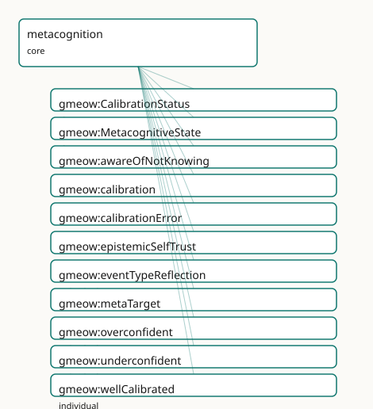

<!-- GENERATED by gmeow ontology-docs. DO NOT EDIT. -->

# GMEOW Metacognition Module

- **IRI:** <https://blackcatinformatics.ca/gmeow/slices/metacognition>
- **Tier:** core
- **[`Group`](../reference/classes/gmeow-Group.md):** core

## What This Slice Covers

This slice owns 11 terms and contributes 0 mapping or projection rows. Use it when its terms match the native fact you want to preserve; use the linkage tables to see how those facts leave GMEOW for consumer vocabularies.

## Dependencies

- [`gmeow:slices/cognition`](cognition.md)
- [`gmeow:slices/epistemics`](epistemics.md)
- [`gmeow:slices/events`](events.md)
- [`gmeow:slices/kernel`](kernel.md)
- [`gmeow:slices/observations`](observations.md)
- [`gmeow:slices/standpoint`](standpoint.md)

## Consumers

- AI-memory calibration and trustworthiness ([Principle 15](https://github.com/Blackcat-Informatics/gmeow-ontology/blob/main/CONSTITUTION.md#principle-15)) — flagging 'I might be wrong', surfacing known-unknowns as inquiries (the inquiry-slice [`gmeow:evokes`](../reference/properties/gmeow-evokes.md) bridge), recording the boundary of the agent's knowledge, and defeating one's own inference on reflection; the headline trustworthy-agent demo that separates a calibrated agent from a confabulating one.

## Local Map



## Examples

### Dunning Kruger

- **Source:** [`slices/core/metacognition/examples/dunning-kruger.ttl`](https://github.com/Blackcat-Informatics/gmeow-ontology/blob/main/slices/core/metacognition/examples/dunning-kruger.ttl)
- **GMEOW terms:** [`gmeow:KnowledgeProficiency`](../reference/classes/gmeow-KnowledgeProficiency.md), [`gmeow:MetacognitiveState`](../reference/classes/gmeow-MetacognitiveState.md), [`gmeow:Person`](../reference/classes/gmeow-Person.md), [`gmeow:StandpointClaim`](../reference/classes/gmeow-StandpointClaim.md), [`gmeow:accordingTo`](../reference/properties/gmeow-accordingTo.md), [`gmeow:calibration`](../reference/properties/gmeow-calibration.md), [`gmeow:calibrationError`](../reference/properties/gmeow-calibrationError.md), [`gmeow:claimModality`](../reference/properties/gmeow-claimModality.md), [`gmeow:knowledgeMastered`](../reference/individuals/gmeow-knowledgeMastered.md), [`gmeow:knowledgeProficiencyAgent`](../reference/properties/gmeow-knowledgeProficiencyAgent.md)
- **External prefixes:** `wd`

```turtle
# SPDX-FileCopyrightText: 2026 Blackcat Informatics® Inc. <paudley@blackcatinformatics.ca>
# SPDX-License-Identifier: CC-BY-4.0
#
# Worked example — Dunning–Kruger as a MODELLED metacognitive miscalibration, the
# second-order companion to the cognition slice's dunning-kruger.ttl. Where that
# example records two coexisting first-order gmeow:KnowledgeProficiency claims at
# divergent depths (Principle 9), this one turns the reflexive lens on Sam's OWN
# self-assessment: a gmeow:MetacognitiveState whose gmeow:metaTarget is Sam's
# self-attributed mastery, carrying gmeow:calibration gmeow:overconfident. The
# numeric Brier-style gap rides gmeow:calibrationError — a SOLVER-LAYER annotation
# (Principle 12), invisible to the reasoner. The calibration is itself a
# vantage-indexed claim (Principle 9): the assessor judges Sam overconfident; GMEOW
# records the judgement, it does not adjudicate a global verdict.
@prefix gmeow: <https://blackcatinformatics.ca/gmeow/> .
@prefix ex:    <https://blackcatinformatics.ca/gmeow/examples/metacognition/> .
@prefix wd:    <http://www.wikidata.org/entity/> .

ex:sam      a gmeow:Person ; gmeow:name "Sam"@en .
ex:assessor a gmeow:Person ; gmeow:name "External Assessor"@en .

# --- First-order: Sam, by Sam's own lights, has MASTERED quantum computing
#     (reusing the cognition slice's gmeow:KnowledgeProficiency by reference).
ex:samQuantumSelf a gmeow:KnowledgeProficiency ;
    gmeow:knowledgeProficiencyAgent   ex:sam ;
    gmeow:knowledgeProficiencySubject wd:Q192995 ;        # quantum computing
    gmeow:knowledgeProficiencyLevel   gmeow:knowledgeMastered ;
    gmeow:knowledgeProficiencyScale   gmeow:scaleKnowledgeDepth ;
    gmeow:accordingTo                 ex:sam .            # self-attributed vantage

# --- Second-order: Sam's metacognitive state reflecting on that self-assessment.
#     metaTarget is the reflexivity edge onto Sam's own first-order proficiency
#     (the same-agent ownership is a SHACL concern, not an OWL axiom); calibration
#     reads the direction of the confidence/accuracy gap.
ex:samSelfRegard a gmeow:MetacognitiveState ;
    gmeow:metaTarget  ex:samQuantumSelf ;
    gmeow:calibration gmeow:overconfident .

# --- The calibration is a vantage-indexed claim (Principle 9): the assessor,
#     observing Sam's self-regard against a knows-about assessment, judges it
#     overconfident and records the Brier-style magnitude as a solver-layer
#     annotation on the claim (computed-not-asserted, Principle 12).
ex:samCalibrationClaim a gmeow:StandpointClaim ;
    gmeow:vantage           ex:assessor ;
    gmeow:observedFeature   ex:samSelfRegard ;
    gmeow:observationMethod gmeow:methodExpertJudgement ;
    gmeow:claimModality     gmeow:probable ;
    gmeow:calibrationError  0.62 .
```

### Known Unknown

- **Source:** [`slices/core/metacognition/examples/known-unknown.ttl`](https://github.com/Blackcat-Informatics/gmeow-ontology/blob/main/slices/core/metacognition/examples/known-unknown.ttl)
- **GMEOW terms:** [`gmeow:Agent`](../reference/classes/gmeow-Agent.md), [`gmeow:Entity`](../reference/classes/gmeow-Entity.md), [`gmeow:Question`](../reference/classes/gmeow-Question.md), [`gmeow:awareOfNotKnowing`](../reference/properties/gmeow-awareOfNotKnowing.md), [`gmeow:evokes`](../reference/properties/gmeow-evokes.md), [`gmeow:motivates`](../reference/properties/gmeow-motivates.md), [`gmeow:questionType`](../reference/properties/gmeow-questionType.md), [`gmeow:seeksToKnow`](../reference/properties/gmeow-seeksToKnow.md), [`gmeow:typeHow`](../reference/individuals/gmeow-typeHow.md)

```turtle
# SPDX-FileCopyrightText: 2026 Blackcat Informatics® Inc. <paudley@blackcatinformatics.ca>
# SPDX-License-Identifier: CC-BY-4.0
#
# Worked example — a KNOWN-UNKNOWN that mints an inquiry, with NO new bridge term.
# Lillith recognises the boundary of her own knowledge (gmeow:awareOfNotKnowing),
# the second-order complement of the cognition knowledge spectrum. The recognised
# gap motivates a question by REUSING inquiry's open-domain gmeow:evokes (the
# not-known subject evokes the question) and the inquiry spine (gmeow:seeksToKnow)
# — there is no gmeow:motivates term (Principle 6), and the bridge to the inquiry
# slice is documented routing, not an entailment. This is the trustworthy-agent
# move: surfacing what it does not know as an open inquiry rather than confabulating.
@prefix gmeow: <https://blackcatinformatics.ca/gmeow/> .
@prefix ex:    <https://blackcatinformatics.ca/gmeow/examples/metacognition/> .
@prefix rdfs:  <http://www.w3.org/2000/01/rdf-schema#> .

ex:lillith   a gmeow:Agent .
ex:protocolX a gmeow:Entity ; rdfs:label "protocol X"@en .

# --- Known-unknown: Lillith is aware that she does NOT know protocol X — a
#     recognised gap (second-order), not the open-world silence of an unasserted
#     triple. The boundary of her knowledge, recorded for a trustworthy memory.
ex:lillith gmeow:awareOfNotKnowing ex:protocolX .

# --- The gap evokes a question (reusing inquiry's open-domain gmeow:evokes — the
#     not-known subject sits legally in its subject position, so no new motivates
#     term is minted), which Lillith then holds open and seeks to know.
ex:protocolX gmeow:evokes ex:howDoesProtocolXWork .

ex:howDoesProtocolXWork a gmeow:Question ;
    gmeow:questionType gmeow:typeHow ;
    rdfs:label "how does protocol X work?"@en .

ex:lillith gmeow:seeksToKnow ex:howDoesProtocolXWork .   # the inquiry spine, reused
```

### Reflection Revision

- **Source:** [`slices/core/metacognition/examples/reflection-revision.ttl`](https://github.com/Blackcat-Informatics/gmeow-ontology/blob/main/slices/core/metacognition/examples/reflection-revision.ttl)
- **GMEOW terms:** [`gmeow:Agent`](../reference/classes/gmeow-Agent.md), [`gmeow:Event`](../reference/classes/gmeow-Event.md), [`gmeow:InferenceCommitment`](../reference/classes/gmeow-InferenceCommitment.md), [`gmeow:InferenceTenure`](../reference/classes/gmeow-InferenceTenure.md), [`gmeow:MetacognitiveState`](../reference/classes/gmeow-MetacognitiveState.md), [`gmeow:StandpointClaim`](../reference/classes/gmeow-StandpointClaim.md), [`gmeow:TimeInterval`](../reference/classes/gmeow-TimeInterval.md), [`gmeow:claimModality`](../reference/properties/gmeow-claimModality.md), [`gmeow:conclusion`](../reference/properties/gmeow-conclusion.md), [`gmeow:defeaterKind`](../reference/properties/gmeow-defeaterKind.md)
- **External prefixes:** `xsd`

```turtle
# SPDX-FileCopyrightText: 2026 Blackcat Informatics® Inc. <paudley@blackcatinformatics.ca>
# SPDX-License-Identifier: CC-BY-4.0
#
# Worked example — REFLECTION defeating one's own inference, belief revision as
# SUPPRESSION (Principle 10). The metacognition layer over the inference slice's
# belief-revision pattern: Lillith inductively concluded "the server is down" from
# "the ping timed out". On REFLECTION (a gmeow:Event typed gmeow:eventTypeReflection,
# tied to the reflexive layer by a gmeow:MetacognitiveState whose gmeow:metaTarget
# is her OWN gmeow:InferenceCommitment) she surfaces an UNDERCUTTING defeater — a
# firewall rule blocked the ping, removing the warrant. Revision does NOT delete:
# the conclusion-claim is set gmeow:displayable false, the gmeow:InferenceTenure is
# closed, and the gmeow:InferenceCommitment is retained as audit. The defeater is
# installed via the inference slice's gmeow:hasDefeater (reused by reference); the
# reflection → revision link is a documented bridge, never an axiom.
@prefix gmeow: <https://blackcatinformatics.ca/gmeow/> .
@prefix ex:    <https://blackcatinformatics.ca/gmeow/examples/metacognition/> .
@prefix rdfs:  <http://www.w3.org/2000/01/rdf-schema#> .
@prefix xsd:   <http://www.w3.org/2001/XMLSchema#> .

ex:lillith a gmeow:Agent ; gmeow:name "Lillith"@en .

ex:propPingTimedOut rdfs:label "the ping timed out"@en .
ex:propServerDown   rdfs:label "the server is down"@en .
ex:propFirewall     rdfs:label "a firewall rule blocks ping"@en .

# --- The original premise and conclusion (the prior inference Lillith held).
ex:premPingTimedOut a gmeow:StandpointClaim ;
    gmeow:vantage ex:lillith ;
    gmeow:observedFeature ex:propPingTimedOut ;
    gmeow:observationMethod gmeow:methodDirectObservation ;
    gmeow:claimModality gmeow:unequivocal .

# The conclusion — now SUPPRESSED on reflection, but retained.
ex:conclServerDown a gmeow:StandpointClaim ;
    rdfs:label "Concluded (then retracted): the server is down"@en ;
    gmeow:vantage ex:lillith ;
    gmeow:observedFeature ex:propServerDown ;
    gmeow:observationMethod gmeow:methodExpertJudgement ;
    gmeow:claimModality gmeow:probable ;
    gmeow:inferenceMode gmeow:modeInduction ;
    gmeow:inferredFrom ex:premPingTimedOut ;
    gmeow:displayable false .                     # Principle 10: suppressed by the fired defeater

# --- The reflection act: Lillith reviews her OWN reasoning (the metacognition
#     layer). The event carries the gmeow:eventTypeReflection value; a
#     gmeow:MetacognitiveState ties the review to the reflexive layer, its
#     gmeow:metaTarget pointing at her own inference commitment.
ex:lillithReview a gmeow:Event ;
    gmeow:eventType gmeow:eventTypeReflection .

ex:lillithReflectsOnInf1 a gmeow:MetacognitiveState ;
    gmeow:metaTarget ex:revisedCommitment .

# --- The defeater the reflection surfaces (undercutting: removes the warrant,
#     does not assert the negation).
ex:defeaterFirewall a gmeow:StandpointClaim ;
    rdfs:label "Defeater: a firewall rule blocked the ping"@en ;
    gmeow:vantage ex:lillith ;
    gmeow:observedFeature ex:propFirewall ;
    gmeow:observationMethod gmeow:methodDirectObservation ;
    gmeow:claimModality gmeow:unequivocal ;
    gmeow:defeaterKind gmeow:defeaterUndercutting .

# --- The reified argument, retained as audit; the reflection installs the
#     defeater on Lillith's own commitment via the inference slice's hasDefeater.
ex:revisedCommitment a gmeow:InferenceCommitment ;
    rdfs:label "Inductive argument: ping-timeout therefore server-down (defeated on reflection)"@en ;
    gmeow:inferenceModeOf gmeow:modeInduction ;
    gmeow:premise ex:premPingTimedOut ;
    gmeow:conclusion ex:conclServerDown ;
    gmeow:hasDefeater ex:defeaterFirewall .

# --- The tenure — opened then closed (never deleted, Principle 10).
ex:serverDownTenure a gmeow:InferenceTenure ;
    rdfs:label "The held interval of the 'server is down' conclusion"@en ;
    gmeow:tenureOf ex:revisedCommitment ;
    gmeow:duringInterval ex:tenureInterval .

ex:tenureInterval a gmeow:TimeInterval ;
    gmeow:startedAtTime "2026-06-16T09:00:00Z"^^xsd:dateTime ;
    gmeow:endedAtTime   "2026-06-16T09:12:00Z"^^xsd:dateTime .  # closed when the defeater fired
```

## Terms

### Classes

| Term | Label | Definition |
|---|---|---|
| [`gmeow:CalibrationStatus`](../reference/classes/gmeow-CalibrationStatus.md) | Calibration Status | The qualitative fit between an agent's avowed confidence and its actual accuracy — a closed value vocabulary: [`gmeow:wellCalibrated`](../reference/individuals/gmeow-wellCalibrated.md) (confidence tracks accuracy)... |
| [`gmeow:MetacognitiveState`](../reference/classes/gmeow-MetacognitiveState.md) | Metacognitive State | An agent's intrinsic SECOND-ORDER mental moment — a state whose subject is one of the agent's OWN first-order mental moments or claims (a belief about a belief... |

### Properties

| Term | Label | Definition |
|---|---|---|
| [`gmeow:awareOfNotKnowing`](../reference/properties/gmeow-awareOfNotKnowing.md) | aware of not knowing | A known-unknown: an agent is aware that it does NOT know a subject — the second-order recognition of a gap in its own knowledge, the explicit boundary of what... |
| [`gmeow:calibration`](../reference/properties/gmeow-calibration.md) | calibration | Assigns a qualitative [`gmeow:CalibrationStatus`](../reference/classes/gmeow-CalibrationStatus.md) (wellCalibrated / overconfident / underconfident) to a [`gmeow:MetacognitiveState`](../reference/classes/gmeow-MetacognitiveState.md) — the direction of the gap betwee... |
| [`gmeow:calibrationError`](../reference/properties/gmeow-calibrationError.md) | calibration error | A SOLVER-LAYER numeric measure of miscalibration ([Principle 12](https://github.com/Blackcat-Informatics/gmeow-ontology/blob/main/CONSTITUTION.md#principle-12)) — a Brier-style score in the closed interval [0,1] attached to the statement asserting a metaco... |
| [`gmeow:epistemicSelfTrust`](../reference/properties/gmeow-epistemicSelfTrust.md) | epistemic self-trust | The reliability an agent accords to one of its OWN epistemic faculties or sources — feeling-of-knowing: how far the agent trusts its own memory, perception, or... |
| [`gmeow:metaTarget`](../reference/properties/gmeow-metaTarget.md) | meta target | The reflexivity edge: relates a [`gmeow:MetacognitiveState`](../reference/classes/gmeow-MetacognitiveState.md) to the first-order mental moment or claim it reflects upon. The RANGE is left intentionally open — the... |

### Individuals

| Term | Label | Definition |
|---|---|---|
| [`gmeow:eventTypeReflection`](../reference/individuals/gmeow-eventTypeReflection.md) | reflection | An event of an agent reviewing its OWN reasoning — re-examining a prior inference, belief, or self-assessment. A value individual of [`gmeow:EventType`](../reference/classes/gmeow-EventType.md) (the event... |
| [`gmeow:overconfident`](../reference/individuals/gmeow-overconfident.md) | overconfident | Confidence exceeds accuracy: the agent is more sure than it should be — the Dunning–Kruger pole, characteristically overconfidence at low competence. The confa... |
| [`gmeow:underconfident`](../reference/individuals/gmeow-underconfident.md) | underconfident | Accuracy exceeds confidence: the agent is less sure than it should be — the impostor pole, where knowledge is held but distrusted. The opposite failure to over... |
| [`gmeow:wellCalibrated`](../reference/individuals/gmeow-wellCalibrated.md) | well calibrated | Confidence tracks accuracy: the agent's avowed confidence matches how often it is right — the target calibration of a trustworthy agent. The midpoint of the ov... |

## Guide

<!-- SPDX-FileCopyrightText: 2026 Blackcat Informatics® Inc. <paudley@blackcatinformatics.ca> -->
<!-- SPDX-License-Identifier: CC-BY-4.0 -->

# Metacognition

> **Slice:** `https://blackcatinformatics.ca/gmeow/slices/metacognition` · **tier: core**

Second-order epistemics — the reflexive turn. The whole epistemic stack is **first-order**: an agent
*believes* a proposition (`epistemics`), *knows about* a subject (`cognition`), *claims* a feature
from a vantage (`standpoint`). Metacognition is the turn whose **subject is one of the agent's own
first-order states or claims**, plus **calibration** — the fit between avowed confidence and
accuracy. For a trustworthy AI memory this is decisive: "how sure am I that I'm right, and do I know
where my knowledge stops" is exactly what separates a calibrated agent from a confabulating one
([Principle 15](https://github.com/Blackcat-Informatics/gmeow-ontology/blob/main/CONSTITUTION.md#principle-15)). The slice mints almost no new machinery — a metacognitive judgement **is** a
[`gmeow:StandpointClaim`](../reference/classes/gmeow-StandpointClaim.md) whose [`gmeow:observedFeature`](../reference/properties/gmeow-observedFeature.md) is one of the agent's own claims / mental
moments and whose [`gmeow:vantage`](../reference/properties/gmeow-vantage.md) is that same agent.

## Reflexivity by reuse, not new machinery

[`gmeow:MetacognitiveState`](../reference/classes/gmeow-MetacognitiveState.md) ([`gufo:Kind ⊑ gmeow:MentalMoment`](http://purl.org/nemo/gufo#Kind ⊑ gmeow:MentalMoment)) is the endurant second-order mode, and
[`gmeow:metaTarget`](../reference/properties/gmeow-metaTarget.md) is the **reflexivity edge** to the first-order state it reflects upon. It is the
co-equal **sibling** of the first-order mental modes, gathered under [`gmeow:MentalMoment`](../reference/classes/gmeow-MentalMoment.md) (kernel) so
an agent's whole mental life is one queryable family:

| Mode | Slice | Stands toward |
|---|---|---|
| [`gmeow:CognitiveState`](../reference/classes/gmeow-CognitiveState.md) | `cognition` | a subject the agent knows (objectual, first-order) |
| [`gmeow:IntentionalMode`](../reference/classes/gmeow-IntentionalMode.md) | `teleology` | a state of affairs the agent aims at (conative, first-order) |
| doxastic states | `epistemics` | a proposition the agent holds (first-order) |
| **[`gmeow:MetacognitiveState`](../reference/classes/gmeow-MetacognitiveState.md)** | **`metacognition`** | **one of the agent's own first-order states / claims (reflexive, second-order)** |

These are **documented siblings, not subsumed**: there is deliberately **no** [`rdfs:subClassOf`](http://www.w3.org/2000/01/rdf-schema#subClassOf)
making [`gmeow:MetacognitiveState`](../reference/classes/gmeow-MetacognitiveState.md) a kind of [`gmeow:CognitiveState`](../reference/classes/gmeow-CognitiveState.md). "Thinking about thinking is a kind
of thinking" would erase the reflexive-vs-first-order distinction — exactly as [`gmeow:Question`](../reference/classes/gmeow-Question.md) is not
a [`gmeow:Proposition`](../reference/classes/gmeow-Proposition.md). The siblinghood lives in prose and the `tests/test_metacognition.py`
no-subsumption guard, never in an axiom.

### [`gmeow:MetacognitiveState`](../reference/classes/gmeow-MetacognitiveState.md) · [`gmeow:metaTarget`](../reference/properties/gmeow-metaTarget.md)

[`gmeow:MetacognitiveState`](../reference/classes/gmeow-MetacognitiveState.md) types an agent's second-order mental moment, inhering in exactly one agent.
[`gmeow:metaTarget`](../reference/properties/gmeow-metaTarget.md) (domain [`gmeow:MetacognitiveState`](../reference/classes/gmeow-MetacognitiveState.md), **open range**, non-functional) points at the
first-order [`gmeow:MentalMoment`](../reference/classes/gmeow-MentalMoment.md), [`gmeow:StandpointClaim`](../reference/classes/gmeow-StandpointClaim.md), or [`gmeow:InferenceCommitment`](../reference/classes/gmeow-InferenceCommitment.md) it reflects
upon. The reflexivity is **conceptual** (the target is the agent's *own* state), never OWL
reflexivity: [`gmeow:metaTarget`](../reference/properties/gmeow-metaTarget.md) is deliberately **not** [`owl:ReflexiveProperty`](http://www.w3.org/2002/07/owl#ReflexiveProperty) (which leaves EL and
is semantically false — the metastate and its target are distinct individuals). Same-agent ownership
is a SHACL concern, not a reasoned axiom ([Principle 12](https://github.com/Blackcat-Informatics/gmeow-ontology/blob/main/CONSTITUTION.md#principle-12)).

## Calibration

[`gmeow:calibration`](../reference/properties/gmeow-calibration.md) (domain [`gmeow:MetacognitiveState`](../reference/classes/gmeow-MetacognitiveState.md), range [`gmeow:CalibrationStatus`](../reference/classes/gmeow-CalibrationStatus.md)) assigns the
qualitative direction of the confidence/accuracy gap. [`gmeow:CalibrationStatus`](../reference/classes/gmeow-CalibrationStatus.md) is a closed value
vocabulary ([`gufo:AbstractIndividualType ⊑ gufo:QualityValue`](http://purl.org/nemo/gufo#AbstractIndividualType ⊑ gufo:QualityValue)), its members **individuals, never
subclasses**:

| Value | Reading |
|---|---|
| [`gmeow:wellCalibrated`](../reference/individuals/gmeow-wellCalibrated.md) | confidence tracks accuracy — the target of a trustworthy agent |
| [`gmeow:overconfident`](../reference/individuals/gmeow-overconfident.md) | confidence exceeds accuracy — the **Dunning–Kruger** pole, the confabulation risk |
| [`gmeow:underconfident`](../reference/individuals/gmeow-underconfident.md) | accuracy exceeds confidence — the impostor pole |

The **numeric magnitude** of the gap is [`gmeow:calibrationError`](../reference/properties/gmeow-calibrationError.md) — a Brier-style score in `[0,1]`,
**solver-layer** ([Principle 12](https://github.com/Blackcat-Informatics/gmeow-ontology/blob/main/CONSTITUTION.md#principle-12)). It is an [`owl:AnnotationProperty`](http://www.w3.org/2002/07/owl#AnnotationProperty) by design, exactly like
[`gmeow:confidence`](../reference/properties/gmeow-confidence.md): **invisible to the reasoner**, computed externally, and never a materialised
axiom. Modelling it as an [`owl:DatatypeProperty`](http://www.w3.org/2002/07/owl#DatatypeProperty) with a domain would make it a reasoned ABox edge and
risk the reasoner touching it — the guard `test_calibration_error_is_a_solver_layer_annotation` pins
it as annotation-only.

Dunning–Kruger is **overconfidence at low competence** — the cognition slice's coexisting-claims
fixture, now *modelled*. The [`dunning-kruger.ttl`](examples/dunning-kruger.ttl) example turns the
reflexive lens on Sam's own self-assessment: a [`gmeow:MetacognitiveState`](../reference/classes/gmeow-MetacognitiveState.md) whose [`gmeow:metaTarget`](../reference/properties/gmeow-metaTarget.md) is
Sam's self-attributed [`gmeow:KnowledgeProficiency`](../reference/classes/gmeow-KnowledgeProficiency.md), carrying [`gmeow:calibration`](../reference/properties/gmeow-calibration.md) [`gmeow:overconfident`](../reference/individuals/gmeow-overconfident.md),
with the assessor's [`gmeow:calibrationError`](../reference/properties/gmeow-calibrationError.md) riding the calibration claim. The calibration is itself a
vantage-indexed claim ([Principle 9](https://github.com/Blackcat-Informatics/gmeow-ontology/blob/main/CONSTITUTION.md#principle-9)); GMEOW records the judgement, it does not adjudicate a verdict.

### [`gmeow:CalibrationStatus`](../reference/classes/gmeow-CalibrationStatus.md) · [`gmeow:calibration`](../reference/properties/gmeow-calibration.md) · [`gmeow:calibrationError`](../reference/properties/gmeow-calibrationError.md)

The closed status vocabulary, the property that assigns it (non-functional — a self-assessment and an
external assessment coexist), and the solver-layer Brier-style magnitude annotation. The qualitative
direction and the numeric gap are kept distinct: [`gmeow:calibration`](../reference/properties/gmeow-calibration.md) reasons (an EL range axiom over a
closed vocab); [`gmeow:calibrationError`](../reference/properties/gmeow-calibrationError.md) does not (an annotation the reasoner never sees).

## Known-unknowns

[`gmeow:awareOfNotKnowing`](../reference/properties/gmeow-awareOfNotKnowing.md) (domain [`gmeow:Agent`](../reference/classes/gmeow-Agent.md), **open range**, non-functional) records the
**boundary** of an agent's knowledge — a *recognised* gap (second-order), not the open-world silence
of an unasserted triple. It is the reflexive complement of the cognition knowledge spectrum: where
[`gmeow:isAwareOf`](../reference/properties/gmeow-isAwareOf.md) … [`gmeow:hasMastered`](../reference/properties/gmeow-hasMastered.md) record what an agent knows, this records a recognised edge of
that knowledge.

A known-unknown **[`motivates`](../reference/properties/gmeow-motivates.md) a question by reference** — with **no new bridge term**. The recognised
gap mints a [`gmeow:Question`](../reference/classes/gmeow-Question.md) by **reusing inquiry's open-domain [`gmeow:evokes`](../reference/properties/gmeow-evokes.md)** (the not-known subject
sits legally in `evokes`'s subject position) and the inquiry spine ([`gmeow:seeksToKnow`](../reference/properties/gmeow-seeksToKnow.md)); there is no
[`gmeow:motivates`](../reference/properties/gmeow-motivates.md) partner ([Principle 6](https://github.com/Blackcat-Informatics/gmeow-ontology/blob/main/CONSTITUTION.md#principle-6)), and the bridge is documented routing, not an entailment. The
[`known-unknown.ttl`](examples/known-unknown.ttl) example shows the trustworthy-agent move: surfacing
what it does not know as an open inquiry rather than confabulating an answer.

### [`gmeow:awareOfNotKnowing`](../reference/properties/gmeow-awareOfNotKnowing.md)

The known-unknown edge. Flat (no [`rdfs:subPropertyOf`](http://www.w3.org/2000/01/rdf-schema#subPropertyOf)), open range, domain [`gmeow:Agent`](../reference/classes/gmeow-Agent.md) — the cheap
surface a trustworthy memory reads to surface its blind spots. The inquiry bridge reuses
[`gmeow:evokes`](../reference/properties/gmeow-evokes.md); this slice asserts no [`owl:subPropertyOf`](http://www.w3.org/2002/07/owl#subPropertyOf) into the inquiry slice.

## Epistemic self-trust

[`gmeow:epistemicSelfTrust`](../reference/properties/gmeow-epistemicSelfTrust.md) (domain [`gmeow:Agent`](../reference/classes/gmeow-Agent.md), **open range**, non-functional) is feeling-of-knowing
— the reliability an agent accords to one of its **own** epistemic faculties or sources (its memory,
perception, reasoning). It is the flat 80% surface; its **rich, graded form is a
[`gmeow:StandpointClaim`](../reference/classes/gmeow-StandpointClaim.md)** whose [`gmeow:vantage`](../reference/properties/gmeow-vantage.md) is the agent and whose [`gmeow:observedFeature`](../reference/properties/gmeow-observedFeature.md) is the
agent's own faculty, carrying [`gmeow:trustLevel`](../reference/properties/gmeow-trustLevel.md) **by reference to the `trust` slice** — self-trust is
trust-about-oneself, the [`gmeow:trustor`](../reference/properties/gmeow-trustor.md) and [`gmeow:trustee`](../reference/properties/gmeow-trustee.md) coinciding. The trust machinery is
**reused, not re-minted** ([Principle 6](https://github.com/Blackcat-Informatics/gmeow-ontology/blob/main/CONSTITUTION.md#principle-6)); this slice asserts no triples into the trust slice.

### [`gmeow:epistemicSelfTrust`](../reference/properties/gmeow-epistemicSelfTrust.md)

The self-trust edge. Use it for reliance on one's *own* faculty; trust in an external agent or source
is the trust slice's [`gmeow:TrustAssertion`](../reference/classes/gmeow-TrustAssertion.md) directly. Promote to the standpoint-claim idiom carrying
[`gmeow:trustLevel`](../reference/properties/gmeow-trustLevel.md) when the degree, scale, or vantage of self-trust is itself the fact.

## Reflection & belief revision

[`gmeow:eventTypeReflection`](../reference/individuals/gmeow-eventTypeReflection.md) (a [`gmeow:EventType`](../reference/classes/gmeow-EventType.md), the [`gmeow:eventTypeDeception`](../reference/individuals/gmeow-eventTypeDeception.md) pattern) types an
event of an agent **reviewing its own reasoning**. A reflection may install a [`gmeow:hasDefeater`](../reference/properties/gmeow-hasDefeater.md) on
one of the agent's own [`gmeow:InferenceCommitment`](../reference/classes/gmeow-InferenceCommitment.md) individuals (the `inference` slice), triggering
**belief revision as suppression** ([Principle 10](https://github.com/Blackcat-Informatics/gmeow-ontology/blob/main/CONSTITUTION.md#principle-10)): the defeated conclusion-claim is set
[`gmeow:displayable`](../reference/properties/gmeow-displayable.md) false and the prior inference is **retained as audit**, never deleted. The
[`reflection-revision.ttl`](examples/reflection-revision.ttl) example walks it: Lillith reflects on
her own abductive inference, surfaces an undercutting defeater (a firewall blocked the ping), installs
it via [`gmeow:hasDefeater`](../reference/properties/gmeow-hasDefeater.md), and suppresses the defeated conclusion — the reflection → revision link is
a documented bridge, never an axiom.

The boundary with the `mentation` slice is documented ([Principle 4](https://github.com/Blackcat-Informatics/gmeow-ontology/blob/main/CONSTITUTION.md#principle-4)): [`gmeow:eventTypeReflection`](../reference/individuals/gmeow-eventTypeReflection.md) types
the reviewable occurrent *kind*; a reflection that unfolds as a reasoning *process* is a
[`gmeow:MentalProcess`](../reference/classes/gmeow-MentalProcess.md) — one canonical source per fact, never both for the same individual.

### [`gmeow:eventTypeReflection`](../reference/individuals/gmeow-eventTypeReflection.md)

The reflection-act value individual. Type a reflection [`gmeow:Event`](../reference/classes/gmeow-Event.md) with it; record revision by
installing [`gmeow:hasDefeater`](../reference/properties/gmeow-hasDefeater.md) on the agent's own inference and suppressing the defeated conclusion
with [`gmeow:displayable`](../reference/properties/gmeow-displayable.md) false.

## Alignments (`mappings/equivalences.ttl`)

The slice's alignments are **deliberately prose-only**: its grounding literatures —
**Nelson & Narens'** metamemory model, **Flavell's** metacognition, and the **Brier-score**
calibration tradition — have no stable external IRI vocabulary to map to, so the mapping set carries
the scholarly grounding in its comment and seeds **no** `gmeow:TermEquivalence` rows (the same
intentional non-mapping the inquiry slice applies to its question-type vocabulary). The reused
first-order quantities and the cross-slice bridges carry their alignments in their home slices.

## Dependencies

| Slice | Why |
|---|---|
| `kernel` | [`gmeow:MentalMoment`](../reference/classes/gmeow-MentalMoment.md) (the mode genus) and [`gmeow:Agent`](../reference/classes/gmeow-Agent.md) (the known-unknown / self-trust domain) |
| `epistemics` | the first-order doxastic states and credence that metacognition assesses — referenced, the reflexive [`gmeow:metaTarget`](../reference/properties/gmeow-metaTarget.md) points at them |
| `standpoint` | [`gmeow:StandpointClaim`](../reference/classes/gmeow-StandpointClaim.md) — a metacognitive judgement *is* a standpoint claim over the agent's own state ([`gmeow:vantage`](../reference/properties/gmeow-vantage.md) = the agent) |
| `observations` | the Observation spine the metacognitive claim rides ([`gmeow:vantage`](../reference/properties/gmeow-vantage.md), [`gmeow:observedFeature`](../reference/properties/gmeow-observedFeature.md)) |
| `cognition` | [`gmeow:CognitiveState`](../reference/classes/gmeow-CognitiveState.md) (the first-order sibling) and [`gmeow:KnowledgeProficiency`](../reference/classes/gmeow-KnowledgeProficiency.md) (the Dunning–Kruger [`gmeow:metaTarget`](../reference/properties/gmeow-metaTarget.md)) |

Bridges to `inquiry` ([`gmeow:evokes`](../reference/properties/gmeow-evokes.md)), `inference` ([`gmeow:hasDefeater`](../reference/properties/gmeow-hasDefeater.md), [`gmeow:InferenceCommitment`](../reference/classes/gmeow-InferenceCommitment.md)),
and `trust` ([`gmeow:trustLevel`](../reference/properties/gmeow-trustLevel.md)) are **reused by reference** and documented, not declared as
dependencies — the slice asserts no axioms into them ([Principle 9](https://github.com/Blackcat-Informatics/gmeow-ontology/blob/main/CONSTITUTION.md#principle-9)).

## Verified by construction

`tests/test_metacognition.py` pins the load-bearing shape of the slice:

- **Reflexive mode, one [gUFO](../external/ontologies.md#target-gufo) metaclass** — [`gmeow:MetacognitiveState`](../reference/classes/gmeow-MetacognitiveState.md) is a `[gufo:Kind](../external/terms.md#gufo-kind) ⊑
 [`gmeow:MentalMoment`](../reference/classes/gmeow-MentalMoment.md)` carrying exactly one [gUFO](../external/ontologies.md#target-gufo) metaclass.
- **Sibling no-subsumption guard** — no [`rdfs:subClassOf`](http://www.w3.org/2000/01/rdf-schema#subClassOf) to [`gmeow:CognitiveState`](../reference/classes/gmeow-CognitiveState.md) /
 [`gmeow:IntentionalMode`](../reference/classes/gmeow-IntentionalMode.md) / [`gmeow:StandpointClaim`](../reference/classes/gmeow-StandpointClaim.md).
- **[`gmeow:metaTarget`](../reference/properties/gmeow-metaTarget.md) open & characteristic-free** — domain [`gmeow:MetacognitiveState`](../reference/classes/gmeow-MetacognitiveState.md), no
 [`rdfs:range`](http://www.w3.org/2000/01/rdf-schema#range), no [`rdfs:subPropertyOf`](http://www.w3.org/2000/01/rdf-schema#subPropertyOf), and **none** of Reflexive / Irreflexive / Transitive /
 Symmetric / Functional.
- **Calibration value vocab** — [`gmeow:CalibrationStatus`](../reference/classes/gmeow-CalibrationStatus.md) is `[gufo:AbstractIndividualType](../external/terms.md#gufo-abstractindividualtype) ⊑
 [gufo:QualityValue](../external/terms.md#gufo-qualityvalue)`; the three statuses are individuals, never subclasses; `[`gmeow:calibration`](../reference/properties/gmeow-calibration.md)` ranges
 over the closed vocab.
- **Solver-layer guard** — [`gmeow:calibrationError`](../reference/properties/gmeow-calibrationError.md) is an [`owl:AnnotationProperty`](http://www.w3.org/2002/07/owl#AnnotationProperty), **not** an
 [`owl:DatatypeProperty`](http://www.w3.org/2002/07/owl#DatatypeProperty) / [`owl:ObjectProperty`](http://www.w3.org/2002/07/owl#ObjectProperty), with no domain / range.
- **Flat, open-range [`Agent`](../reference/classes/gmeow-Agent.md) edges** — [`gmeow:awareOfNotKnowing`](../reference/properties/gmeow-awareOfNotKnowing.md) and [`gmeow:epistemicSelfTrust`](../reference/properties/gmeow-epistemicSelfTrust.md) are
 object properties with domain [`gmeow:Agent`](../reference/classes/gmeow-Agent.md), no [`rdfs:range`](http://www.w3.org/2000/01/rdf-schema#range), no [`rdfs:subPropertyOf`](http://www.w3.org/2000/01/rdf-schema#subPropertyOf).
- **Reflection [`EventType`](../reference/classes/gmeow-EventType.md)** — [`gmeow:eventTypeReflection`](../reference/individuals/gmeow-eventTypeReflection.md) is an individual of [`gmeow:EventType`](../reference/classes/gmeow-EventType.md).
- **No truth / status bit** — none of `isCalibrated` / `isReflected` / `isTrue` appears in any triple
 position; no locally-declared property carries an [`xsd:boolean`](http://www.w3.org/2001/XMLSchema#boolean) range.
- **Bridges documented, not axiomatised** ([Principle 9](https://github.com/Blackcat-Informatics/gmeow-ontology/blob/main/CONSTITUTION.md#principle-9)) — no [`rdfs:subPropertyOf`](http://www.w3.org/2000/01/rdf-schema#subPropertyOf) from
 [`gmeow:awareOfNotKnowing`](../reference/properties/gmeow-awareOfNotKnowing.md) into [`gmeow:evokes`](../reference/properties/gmeow-evokes.md) or from [`gmeow:epistemicSelfTrust`](../reference/properties/gmeow-epistemicSelfTrust.md) into the trust
 properties.
- **[`Annotation`](../reference/classes/gmeow-Annotation.md) completeness** ([Principle 8](https://github.com/Blackcat-Informatics/gmeow-ontology/blob/main/CONSTITUTION.md#principle-8)) — all 11 locally-declared terms carry an [`rdfs:label`](http://www.w3.org/2000/01/rdf-schema#label), a
 [`skos:definition`](http://www.w3.org/2004/02/skos/core#definition), and [`rdfs:isDefinedBy`](http://www.w3.org/2000/01/rdf-schema#isDefinedBy) the metacognition slice IRI.
