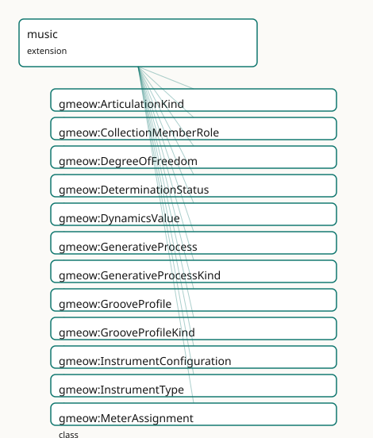

<!-- GENERATED by gmeow ontology-docs. DO NOT EDIT. -->

# GMEOW Music — frame-relative content, lossy notation projections

- **IRI:** <https://blackcatinformatics.ca/gmeow/slices/music>
- **Tier:** extension
- **[`Group`](../reference/classes/gmeow-Group.md):** extensions

## What This Slice Covers

This slice owns 649 terms and contributes 45 mapping or projection rows. Use it when its terms match the native fact you want to preserve; use the linkage tables to see how those facts leave GMEOW for consumer vocabularies.

## Dependencies

- [`gmeow:slices/creative-works`](creative-works.md)
- [`gmeow:slices/documents`](documents.md)
- [`gmeow:slices/events`](events.md)
- [`gmeow:slices/kernel`](kernel.md)
- [`gmeow:slices/language`](language.md)
- [`gmeow:slices/notation`](notation.md)
- [`gmeow:slices/observations`](observations.md)
- [`gmeow:slices/places`](places.md)
- [`gmeow:slices/provenance`](provenance.md)
- [`gmeow:slices/standpoint`](standpoint.md)
- [`gmeow:slices/temporal`](temporal.md)
- [`gmeow:slices/versions`](versions.md)

## Consumers

- The GTS music-package single-file format, the MCP analysis-claims surface, and the 19-case stress corpus that closes the music design.

## Local Map



## Examples

### Score As Lossy Projection

- **Source:** [`slices/extensions/music/examples/score-as-lossy-projection.ttl`](https://github.com/Blackcat-Informatics/gmeow-ontology/blob/main/slices/extensions/music/examples/score-as-lossy-projection.ttl)
- **GMEOW terms:** [`gmeow:DegreeOfFreedom`](../reference/classes/gmeow-DegreeOfFreedom.md), [`gmeow:Expression`](../reference/classes/gmeow-Expression.md), [`gmeow:MusicalWork`](../reference/classes/gmeow-MusicalWork.md), [`gmeow:ScoreEdition`](../reference/classes/gmeow-ScoreEdition.md), [`gmeow:determinacyCrisp`](../reference/individuals/gmeow-determinacyCrisp.md), [`gmeow:determinationDelegatedPerformer`](../reference/individuals/gmeow-determinationDelegatedPerformer.md), [`gmeow:dofParameter`](../reference/properties/gmeow-dofParameter.md), [`gmeow:dofStatus`](../reference/properties/gmeow-dofStatus.md), [`gmeow:dofWork`](../reference/properties/gmeow-dofWork.md), [`gmeow:embodies`](../reference/properties/gmeow-embodies.md)

```turtle
# SPDX-FileCopyrightText: 2026 Blackcat Informatics® Inc. <paudley@blackcatinformatics.ca>
# SPDX-License-Identifier: CC-BY-4.0
#
# Worked example: the score is NOT the work — it is one lossy projection of it
# (, , P12). The slice's thesis is "frame-relative musical content; every
# notation is a lossy projection." Here a MusicalWork sits at the head of the WEMI
# spine. A printed gmeow:ScoreEdition (a Manifestation) embodies a notated
# Expression — but the notation FIXES only some musical parameters and DELEGATES
# others to the performer (gmeow:DegreeOfFreedom with determinationDelegatedPerformer).
# Two performed Expressions realize the very same work and agree on everything the
# score fixes (pitch, duration over the 12-EDO gmeow:tuningSystem12EDO frame) yet
# legitimately diverge on timbre and dynamics — the parameters the page never
# carried. That divergence is the proof of loss: the score under-determines the
# work, and the missing information lives in the performance, not the paper.
@prefix gmeow: <https://blackcatinformatics.ca/gmeow/> .
@prefix ex:    <https://blackcatinformatics.ca/gmeow/examples/music/> .
@prefix rdfs:  <http://www.w3.org/2000/01/rdf-schema#> .

# --- WORK: the abstract piece, determinate in what it fixes.
ex:nocturne a gmeow:MusicalWork ;
    rdfs:label          "Nocturne in E♭ (worked example)"@en ;
    gmeow:hasDeterminacy gmeow:determinacyCrisp .

# --- EXPRESSION (notated): what the page actually encodes, framed by 12-EDO.
ex:notatedExpression a gmeow:Expression ;
    rdfs:label            "engraved notation of the Nocturne"@en ;
    gmeow:realizes        ex:nocturne ;
    gmeow:realizationMode gmeow:realizationModeNotated ;
    gmeow:hasReferenceFrame gmeow:tuningSystem12EDO .

# --- MANIFESTATION: the printed score — a lossy projection of the work.
ex:printedScore a gmeow:ScoreEdition ;
    rdfs:label                 "First printed edition"@en ;
    gmeow:embodies             ex:notatedExpression ;
    gmeow:hasManifestationFormat gmeow:formatPrintedScore .

# --- WHAT THE SCORE DROPS: parameters the notation delegates to the performer.
ex:dofTimbre a gmeow:DegreeOfFreedom ;
    rdfs:label        "timbre left to the performer"@en ;
    gmeow:dofWork     ex:nocturne ;
    gmeow:dofParameter gmeow:musicalParameterTimbre ;
    gmeow:dofStatus   gmeow:determinationDelegatedPerformer .

ex:dofDynamics a gmeow:DegreeOfFreedom ;
    rdfs:label        "fine dynamics left to the performer"@en ;
    gmeow:dofWork     ex:nocturne ;
    gmeow:dofParameter gmeow:musicalParameterDynamics ;
    gmeow:dofStatus   gmeow:determinationDelegatedPerformer .

# --- TWO PERFORMANCES: same work, same fixed pitches/durations, divergent where
#     the score is silent — the loss made concrete (neither is privileged, P9).
ex:performanceRubinstein a gmeow:Expression ;
    rdfs:label            "a warm, rubato-rich performance"@en ;
    gmeow:realizes        ex:nocturne ;
    gmeow:realizationMode gmeow:realizationModePerformed ;
    gmeow:hasReferenceFrame gmeow:tuningSystem12EDO ;
    gmeow:wasDerivedFrom  ex:notatedExpression .

ex:performanceGould a gmeow:Expression ;
    rdfs:label            "a stark, metronomic performance"@en ;
    gmeow:realizes        ex:nocturne ;
    gmeow:realizationMode gmeow:realizationModePerformed ;
    gmeow:hasReferenceFrame gmeow:tuningSystem12EDO ;
    gmeow:wasDerivedFrom  ex:notatedExpression .
```

## Terms

### Classes

| Term | Label | Definition |
|---|---|---|
| [`gmeow:AnalysisProperty`](../reference/classes/gmeow-AnalysisProperty.md) | Analysis Property | An open value vocabulary of analytical dimensions. Never subclassed ([Principle 9](https://github.com/Blackcat-Informatics/gmeow-ontology/blob/main/CONSTITUTION.md#principle-9)). |
| [`gmeow:ArticulationKind`](../reference/classes/gmeow-ArticulationKind.md) | Articulation Kind | An articulation or attack quality applied to a ToneEvent — staccato, legato, tenuto, accent, marcato, pizzicato, harmonic, etc. A value vocabulary of individua... |
| [`gmeow:CollectionMemberRole`](../reference/classes/gmeow-CollectionMemberRole.md) | Collection Member Role | The role of a pitch within a collection — tonic/finalis, vādī, samvādī, ghammāz, ascent-only, descent-only, ornamental, or generic member. A value vocabulary o... |
| [`gmeow:DegreeOfFreedom`](../reference/classes/gmeow-DegreeOfFreedom.md) | Degree of Freedom | A reified relator that positively declares how a musical work or expression determines one musical parameter. Indeterminacy is not an absence; it is a declarat... |
| [`gmeow:DeterminationStatus`](../reference/classes/gmeow-DeterminationStatus.md) | Determination Status | The status of a musical parameter within a DegreeOfFreedom relator — fixed, constrained, free, or delegated to performer/environment/process. An open value voc... |
| [`gmeow:DynamicsValue`](../reference/classes/gmeow-DynamicsValue.md) | Dynamics Value | A symbolic dynamic level for a ToneEvent — ppp, pp, p, mp, mf, f, ff, fff. A value vocabulary of individuals; measured decibel values are frame-relative Observ... |
| [`gmeow:FormFunction`](../reference/classes/gmeow-FormFunction.md) | Form Function | An open value vocabulary of formal functions. Never subclassed ([Principle 9](https://github.com/Blackcat-Informatics/gmeow-ontology/blob/main/CONSTITUTION.md#principle-9)). |
| [`gmeow:GenerativeProcess`](../reference/classes/gmeow-GenerativeProcess.md) | Generative Process | A process that is itself musical content — phasing, stochastic distribution, verbal score, algorithmic rule set. The rule text is human-readable data; formal e... |
| [`gmeow:GenerativeProcessKind`](../reference/classes/gmeow-GenerativeProcessKind.md) | Generative Process Kind | The kind of a generative process — phasing, stochastic, verbal score, rule-based, algorithmic. An open value vocabulary of individuals; never subclassed (Princ... |
| [`gmeow:GrooveProfile`](../reference/classes/gmeow-GrooveProfile.md) | Groove Profile | A systematic, repeatable deviation from a strict metric grid — swing ratio, per-grid-position offsets, or a measured microtiming profile. Groove is content, no... |
| [`gmeow:GrooveProfileKind`](../reference/classes/gmeow-GrooveProfileKind.md) | Groove Profile Kind | The kind of a GrooveProfile — swing ratio, per-grid-position offsets, or a measured profile. A value vocabulary of individuals; never subclassed. |
| [`gmeow:HarmonicFunction`](../reference/classes/gmeow-HarmonicFunction.md) | Harmonic Function | An open value vocabulary of harmonic functions. Never subclassed ([Principle 9](https://github.com/Blackcat-Informatics/gmeow-ontology/blob/main/CONSTITUTION.md#principle-9)). |
| [`gmeow:InstrumentConfiguration`](../reference/classes/gmeow-InstrumentConfiguration.md) | Instrument Configuration | A configured instrument setup — a relator binding an instrument item or type, one or more modifications, a tuning frame, and an interval. The prepared-piano /... |
| [`gmeow:InstrumentModification`](../reference/classes/gmeow-InstrumentModification.md) | Instrument Modification | A modification applied to an instrument in an InstrumentConfiguration — prepared, scordatura, capo, mute, electrified, extended range, etc. An open value vocab... |
| [`gmeow:InstrumentType`](../reference/classes/gmeow-InstrumentType.md) | Instrument Type | The kind of a musical instrument — piano, violin, drum kit, voice, etc. An open value vocabulary of individuals; never subclassed ([Principle 9](https://github.com/Blackcat-Informatics/gmeow-ontology/blob/main/CONSTITUTION.md#principle-9)). Each individua... |
| [`gmeow:MeterAssignment`](../reference/classes/gmeow-MeterAssignment.md) | Meter Assignment | A reified relator binding a carrier (e.g. a voice), a MetricStructure, and a MusicalTimeSpan. Consecutive assignments model bar-by-bar changes; concurrent assi... |
| [`gmeow:MetricGroup`](../reference/classes/gmeow-MetricGroup.md) | Metric Group | One ordered group within a MetricStructure, carrying a rational length and an optional accent weight. Additive meters are sequences of MetricGroups. |
| [`gmeow:MetricModulation`](../reference/classes/gmeow-MetricModulation.md) | Metric Modulation | A reified relator declaring a transition from one MusicalTimeFrame to another via a pivot equivalence expressed as a rational pair (e.g. 3/8 = 1/4). The pivot... |
| [`gmeow:MetricStructure`](../reference/classes/gmeow-MetricStructure.md) | Metric Structure | A recurring grouping cycle that defines a meter — an ordered set of MetricGroups with rational lengths and optional accent weights. Covers additive meters (2+2... |
| [`gmeow:MusicAnalysisClaim`](../reference/classes/gmeow-MusicAnalysisClaim.md) | Music Analysis Claim | A reified musical-analytical observation: {analysisTarget × analysisProperty × analysisResult × analyst-vantage × theory-frame}. Inherits confidence, displayab... |
| [`gmeow:MusicalParameter`](../reference/classes/gmeow-MusicalParameter.md) | Musical Parameter | A dimension of musical content whose degree of determination a work or expression declares. An open value vocabulary of individuals; never subclassed (Principl... |
| [`gmeow:MusicalSegment`](../reference/classes/gmeow-MusicalSegment.md) | Musical Segment | A structural part of a musical work or expression — a graph node carrying musical content at any granularity. Modelled as a [gufo:SubKind](../external/terms.md#gufo-subkind) inheriting identity fr... |
| [`gmeow:MusicalTimeFrame`](../reference/classes/gmeow-MusicalTimeFrame.md) | Musical Time Frame | A reference frame for musical time — a one-dimensional rational-position axis relative to which durations, spans, tempi, and mappings are expressed. Per-voice... |
| [`gmeow:MusicalTimeSpan`](../reference/classes/gmeow-MusicalTimeSpan.md) | Musical Time Span | A frame-relative span of musical time, delimited by a rational start position and a rational duration in an explicit MusicalTimeFrame. The musical-time analogu... |
| [`gmeow:NeoRiemannianOperation`](../reference/classes/gmeow-NeoRiemannianOperation.md) | Neo-Riemannian Operation | An open value vocabulary of Neo-Riemannian operations. Never subclassed ([Principle 9](https://github.com/Blackcat-Informatics/gmeow-ontology/blob/main/CONSTITUTION.md#principle-9)). |
| [`gmeow:OrnamentProfile`](../reference/classes/gmeow-OrnamentProfile.md) | Ornament Profile | A named convention for ornamentation — a gamaka family, a baroque agrément, a jazz turn — bound to segments or voices. Completes the raga/maqam model by separa... |
| [`gmeow:OrnamentProfileKind`](../reference/classes/gmeow-OrnamentProfileKind.md) | Ornament Profile Kind | The kind of ornament profile — gamaka family, baroque agrément, raga ornament, jazz turn, etc. An open value vocabulary of individuals; never subclassed (Princ... |
| [`gmeow:PerformanceDecision`](../reference/classes/gmeow-PerformanceDecision.md) | Performance Decision | A reified relator recording one documented traversal of a mobile form during a performance — the performance event, the traversal constraint, and the chosen se... |
| [`gmeow:PerformanceParticipation`](../reference/classes/gmeow-PerformanceParticipation.md) | Performance Participation | A reified participation in a musical event — a performance, recording session, take, overdub, rehearsal, or transmission. Adds music-specific details (instrume... |
| [`gmeow:PitchAnchor`](../reference/classes/gmeow-PitchAnchor.md) | Pitch Anchor | A binding between one degree of a TuningSystem and a physical frequency in an explicit acoustic frame (e.g., A440 vs Baroque A415). Hz is never asserted direct... |
| [`gmeow:PitchCollection`](../reference/classes/gmeow-PitchCollection.md) | Pitch Collection | A set or multiset of PitchValues derived from a source (a spectrum, a tuning system, an analysis, or a projection). A projection of canonical frame-relative co... |
| [`gmeow:PitchCollectionKind`](../reference/classes/gmeow-PitchCollectionKind.md) | Pitch Collection Kind | The kind of a pitch collection, drawn from an open value vocabulary of individuals (scale, mode, maqam, jins, raga, thaat, pathet, mode of limited transpositio... |
| [`gmeow:PitchCollectionMembership`](../reference/classes/gmeow-PitchCollectionMembership.md) | Pitch Collection Membership | A reified relator binding a pitch collection, a member pitch value, the role that pitch plays, and an optional context/standpoint. The canonical way to assert... |
| [`gmeow:PitchExpression`](../reference/classes/gmeow-PitchExpression.md) | Pitch Expression | A common superclass for pitch-related quantities that are expressed relative to a TuningSystem. PitchValue and PitchInterval are its subkinds; using a named cl... |
| [`gmeow:PitchInterval`](../reference/classes/gmeow-PitchInterval.md) | Pitch Interval | A frame-relative directed interval between two pitch values, expressed as an exact ratio or in cents. Intervals are not subclasses of PitchValue; they are a di... |
| [`gmeow:PitchSpelling`](../reference/classes/gmeow-PitchSpelling.md) | Pitch Spelling | A reified relator binding a frame-relative pitch value, a pitch spelling system, and a spelled name string. Note names (C♯4, sargam Ga, Johnston +7) are projec... |
| [`gmeow:PitchSpellingSystem`](../reference/classes/gmeow-PitchSpellingSystem.md) | Pitch Spelling System | A named system for spelling frame-relative pitches as note names or symbols — e.g. Common Music Notation staff letters, sargam solfege, Johnston accidentals. A... |
| [`gmeow:PitchTrajectory`](../reference/classes/gmeow-PitchTrajectory.md) | Pitch Trajectory | Continuous pitch as content — an ordered set of control points (musical-time × PitchValue) plus an interpolation kind. Models glissandi, gamaka ornaments, UPIC... |
| [`gmeow:PitchTrajectoryControlPoint`](../reference/classes/gmeow-PitchTrajectoryControlPoint.md) | Pitch Trajectory Control Point | One ordered (musical-time, PitchValue) pair belonging to a PitchTrajectory. |
| [`gmeow:PitchTrajectoryInterpolationKind`](../reference/classes/gmeow-PitchTrajectoryInterpolationKind.md) | Pitch Trajectory Interpolation Kind | The interpolation mode of a PitchTrajectory — linear in cents, exponential, or stochastic-by-reference. A value vocabulary of individuals; never subclassed (Pr... |
| [`gmeow:PitchValue`](../reference/classes/gmeow-PitchValue.md) | Pitch Value | A frame-relative musical pitch — an exact rational ratio or a cents offset expressed relative to an explicit TuningSystem. Pitch letters (C4, F#) are projectio... |
| [`gmeow:PlayingTechnique`](../reference/classes/gmeow-PlayingTechnique.md) | Playing Technique | A technique used to play or activate a musical instrument — arco, pizzicato, prepared piano, etc. An open value vocabulary of individuals; never subclassed (Pr... |
| [`gmeow:SchenkerLevel`](../reference/classes/gmeow-SchenkerLevel.md) | Schenker Level | An open value vocabulary of Schenkerian structural levels. Never subclassed ([Principle 9](https://github.com/Blackcat-Informatics/gmeow-ontology/blob/main/CONSTITUTION.md#principle-9)). |
| [`gmeow:SegmentKind`](../reference/classes/gmeow-SegmentKind.md) | Segment Kind | The granularity or functional role of a MusicalSegment, drawn from an open value vocabulary of individuals. Never subclassed ([Principle 9](https://github.com/Blackcat-Informatics/gmeow-ontology/blob/main/CONSTITUTION.md#principle-9)). |
| [`gmeow:SegmentTransformation`](../reference/classes/gmeow-SegmentTransformation.md) | Segment Transformation | A reified relator binding a source MusicalSegment, a target MusicalSegment, a transformation type, and an optional parameter. The AI-analysis backbone: asserti... |
| [`gmeow:SetClassLabel`](../reference/classes/gmeow-SetClassLabel.md) | Set Class Label | An open value vocabulary of pitch-class set labels (Forte names and successors). Never subclassed ([Principle 9](https://github.com/Blackcat-Informatics/gmeow-ontology/blob/main/CONSTITUTION.md#principle-9)). |
| [`gmeow:Spectrum`](../reference/classes/gmeow-Spectrum.md) | Spectrum | A first-class information object representing a partial list or recording-region spectrum. Spectra are the source material from which pitch collections may be... |
| [`gmeow:TempoMap`](../reference/classes/gmeow-TempoMap.md) | Tempo Map | A TimeMapping from a musical-time frame to a clock-time frame, expressed piecewise as constant, linear ramp, curve, or measured segments. Tempo is a frame mapp... |
| [`gmeow:TempoMapKind`](../reference/classes/gmeow-TempoMapKind.md) | Tempo Map Kind | The curve shape of a TempoMap or segment — constant, linear ramp, curve, or measured. A value vocabulary of individuals; never subclassed. |
| [`gmeow:TempoMapSegment`](../reference/classes/gmeow-TempoMapSegment.md) | Tempo Map Segment | One piece of a piecewise TempoMap — a span together with a tempo-map kind (constant, linear ramp, curve, measured) and the segment-level ratio or expression da... |
| [`gmeow:TimbreDescriptor`](../reference/classes/gmeow-TimbreDescriptor.md) | Timbre Descriptor | A perceived timbre quality applied to a ToneEvent — bright, dark, breathy, gritty, hollow, etc. A value vocabulary of individuals; never subclassed (Principle... |
| [`gmeow:TimeMapping`](../reference/classes/gmeow-TimeMapping.md) | Time Mapping | A declared mapping between two musical time frames or spans. Tuplets, tempo canons, and tempo maps are kinds of TimeMapping; their arithmetic is solver-evaluat... |
| [`gmeow:TimeMappingKind`](../reference/classes/gmeow-TimeMappingKind.md) | Time Mapping Kind | The kind of a TimeMapping — tuplet, tempo canon, tempo map, or unsynchronized ad-lib span. A value vocabulary of individuals; never subclassed. |
| [`gmeow:ToneEvent`](../reference/classes/gmeow-ToneEvent.md) | Tone Event | The one structural subkind of MusicalSegment — an atomic sounding unit with pitch content (a PitchValue, a PitchTrajectory, or unpitched), a duration via segme... |
| [`gmeow:TransformationType`](../reference/classes/gmeow-TransformationType.md) | Transformation Type | The kind of segment transformation — transposition, inversion, retrograde, augmentation, diminution, phase shift, reaccentuation, octave displacement, timbre r... |
| [`gmeow:TraversalConstraint`](../reference/classes/gmeow-TraversalConstraint.md) | Traversal Constraint | Mobile form as data: a set of fragments, allowed-successor links (mayFollow), selection rules, and termination rules interpreted by a solver. Graph reachabilit... |
| [`gmeow:TuningSystem`](../reference/classes/gmeow-TuningSystem.md) | Tuning System | A reference frame for musical pitch values — a named system that defines how pitch degrees, frequency ratios, or cents are interpreted. 12-EDO is one TuningSys... |
| [`gmeow:TuningSystemKind`](../reference/classes/gmeow-TuningSystemKind.md) | Tuning System Kind | The kind of a tuning system, drawn from an open value vocabulary of individuals (equal division, just intonation, well temperament, instrument-relative, etc.).... |
| [`gmeow:Voice`](../reference/classes/gmeow-Voice.md) | Voice | A continuity strand binding MusicalSegments together; may host its own MusicalTimeFrame, TuningSystem, and MetricStructure. The carrier for polymeter, tempo ca... |

### Properties

| Term | Label | Definition |
|---|---|---|
| [`gmeow:analysisFrame`](../reference/properties/gmeow-analysisFrame.md) | analysis frame | The music-theory reference frame in which the analysis result is expressed — orthogonal to the analyst vantage ([Principle 11](https://github.com/Blackcat-Informatics/gmeow-ontology/blob/main/CONSTITUTION.md#principle-11)). |
| [`gmeow:analysisProperty`](../reference/properties/gmeow-analysisProperty.md) | analysis property | The analytical dimension being asserted — key, harmony label, meter, form function, motif identity, mode, tuning identification, groove, schema, etc. Functiona... |
| [`gmeow:analysisResult`](../reference/properties/gmeow-analysisResult.md) | analysis result | The result of the analysis — a harmonic function, pitch collection, metric structure, form-function value, set-class label, or other music-theory value. Functi... |
| [`gmeow:analysisTarget`](../reference/properties/gmeow-analysisTarget.md) | analysis target | The musical entity being analysed — a MusicalSegment, Expression, Recording, time-region, or other music-theory object. Functional per claim: one target per an... |
| [`gmeow:anchorDegree`](../reference/properties/gmeow-anchorDegree.md) | anchor degree | The tuning-system degree that this anchor binds to a frequency (e.g., MIDI note 69 for A440 in 12-EDO). |
| [`gmeow:anchorFrequency`](../reference/properties/gmeow-anchorFrequency.md) | anchor frequency | The physical frequency in Hz assigned to the anchor degree by this PitchAnchor. |
| [`gmeow:appliesToSegment`](../reference/properties/gmeow-appliesToSegment.md) | applies to segment | A MusicalSegment to which this ornament profile applies. |
| [`gmeow:appliesToTimeFrame`](../reference/properties/gmeow-appliesToTimeFrame.md) | applies to time frame | The MusicalTimeFrame to which this GrooveProfile applies. |
| [`gmeow:appliesToVoice`](../reference/properties/gmeow-appliesToVoice.md) | applies to voice | A Voice to which this ornament profile applies. |
| [`gmeow:assignedMeter`](../reference/properties/gmeow-assignedMeter.md) | assigned meter | The MetricStructure assigned to the carrier over the assignment span. |
| [`gmeow:assignmentSpan`](../reference/properties/gmeow-assignmentSpan.md) | assignment span | The MusicalTimeSpan over which the meter assignment holds. |
| [`gmeow:centsFromOrigin`](../reference/properties/gmeow-centsFromOrigin.md) | cents from origin | A convenience measure of a pitch or interval in cents, generated from the exact ratio by fnRatioToCents. Not canonical; the ratio pair is canonical (Principle... |
| [`gmeow:collectionKind`](../reference/properties/gmeow-collectionKind.md) | collection kind | The kind of pitch collection (scale, mode, maqam, raga, pitch-class set, etc.). Functional: a PitchCollection is of exactly one kind; hybrid or contested categ... |
| [`gmeow:collectionPartOrder`](../reference/properties/gmeow-collectionPartOrder.md) | collection part order | The zero-based position of this pitch collection as a part of a larger collection (e.g. the order of a jins within a maqam). Scoped to the primary parent; if a... |
| [`gmeow:configurationInstrumentType`](../reference/properties/gmeow-configurationInstrumentType.md) | configuration instrument type | The kind of instrument this configuration applies to, when no specific item is named (e.g. drop-D electric guitar). Functional per relator. |
| [`gmeow:configurationInterval`](../reference/properties/gmeow-configurationInterval.md) | configuration interval | The interval that describes this configuration (e.g. the whole-step drop for drop-D). Functional per relator; optional because some modifications (prepared pia... |
| [`gmeow:configurationModification`](../reference/properties/gmeow-configurationModification.md) | configuration modification | A modification applied in this configuration — prepared, scordatura, capo, mute, electrified, extended range, etc. Non-functional so that compound modification... |
| [`gmeow:configurationOf`](../reference/properties/gmeow-configurationOf.md) | configuration of | The specific instrument item this configuration applies to — a PhysicalObject (e.g. a 1959 Les Paul), an InformationObject (e.g. a synth plugin), or any other... |
| [`gmeow:configurationTuningFrame`](../reference/properties/gmeow-configurationTuningFrame.md) | configuration tuning frame | The tuning frame relative to which this configuration is expressed ([Principle 11](https://github.com/Blackcat-Informatics/gmeow-ontology/blob/main/CONSTITUTION.md#principle-11)). Functional per relator. |
| [`gmeow:constraintAppliesTo`](../reference/properties/gmeow-constraintAppliesTo.md) | constraint applies to | The work, expression, or performance to which this TraversalConstraint applies. |
| [`gmeow:constraintFunction`](../reference/properties/gmeow-constraintFunction.md) | constraint function | An optional FnO function reference that interprets the selection and termination rules ([Principle 12](https://github.com/Blackcat-Informatics/gmeow-ontology/blob/main/CONSTITUTION.md#principle-12)). |
| [`gmeow:constraintText`](../reference/properties/gmeow-constraintText.md) | constraint text | Human-readable selection and termination rules for the mobile form. Language-tagged; at most one value per language ([Principle 9](https://github.com/Blackcat-Informatics/gmeow-ontology/blob/main/CONSTITUTION.md#principle-9)). |
| [`gmeow:controlPointOfTrajectory`](../reference/properties/gmeow-controlPointOfTrajectory.md) | control point of trajectory | The PitchTrajectory to which this control point belongs. Functional: a control point belongs to exactly one trajectory. |
| [`gmeow:controlPointOrder`](../reference/properties/gmeow-controlPointOrder.md) | control point order | The zero-based order of this control point within its PitchTrajectory. |
| [`gmeow:controlPointPitch`](../reference/properties/gmeow-controlPointPitch.md) | control point pitch | The frame-relative PitchValue of this control point. |
| [`gmeow:controlPointTimeFrame`](../reference/properties/gmeow-controlPointTimeFrame.md) | control point time frame | The MusicalTimeFrame in which the control point's time position is expressed. |
| [`gmeow:controlPointTimePositionDenominator`](../reference/properties/gmeow-controlPointTimePositionDenominator.md) | control point time position denominator | The denominator of the rational time position of this control point in its MusicalTimeFrame. Always positive. |
| [`gmeow:controlPointTimePositionNumerator`](../reference/properties/gmeow-controlPointTimePositionNumerator.md) | control point time position numerator | The numerator of the rational time position of this control point in its MusicalTimeFrame. |
| [`gmeow:decisionConstraint`](../reference/properties/gmeow-decisionConstraint.md) | decision constraint | The TraversalConstraint whose rules this PerformanceDecision satisfies. |
| [`gmeow:decisionPerformance`](../reference/properties/gmeow-decisionPerformance.md) | decision performance | The performance event in which this traversal decision was made. |
| [`gmeow:decisionSequence`](../reference/properties/gmeow-decisionSequence.md) | decision sequence | A human-readable record of the chosen fragment traversal order for one performance. |
| [`gmeow:degreeCount`](../reference/properties/gmeow-degreeCount.md) | degree count | The number of pitch degrees available within one period of the tuning system (e.g., 12 for 12-EDO, 13 for Bohlen-Pierce). |
| [`gmeow:derivedFromSpectrum`](../reference/properties/gmeow-derivedFromSpectrum.md) | derived from spectrum | Relates a PitchCollection to the Spectrum it was derived from. The actual derivation is performed by fnSpectrumToPitchCollection ([Principle 12](https://github.com/Blackcat-Informatics/gmeow-ontology/blob/main/CONSTITUTION.md#principle-12)). |
| [`gmeow:dividedIntervalDenominator`](../reference/properties/gmeow-dividedIntervalDenominator.md) | divided interval denominator | The denominator of the interval that an equal-division tuning divides (e.g., 1 for the octave 2/1). |
| [`gmeow:dividedIntervalNumerator`](../reference/properties/gmeow-dividedIntervalNumerator.md) | divided interval numerator | The numerator of the interval that an equal-division tuning divides (e.g., 2 for the octave 2/1; 3 for the Bohlen-Pierce tritave 3/1). |
| [`gmeow:divisionCount`](../reference/properties/gmeow-divisionCount.md) | division count | For equal-division tunings, the number of equal divisions of the period (e.g., 12 for 12-EDO, 19 for 19-EDO). |
| [`gmeow:dofConstraintFunction`](../reference/properties/gmeow-dofConstraintFunction.md) | degree-of-freedom constraint function | An optional FnO function reference that evaluates or validates the constraint text ([Principle 12](https://github.com/Blackcat-Informatics/gmeow-ontology/blob/main/CONSTITUTION.md#principle-12)). |
| [`gmeow:dofConstraintText`](../reference/properties/gmeow-dofConstraintText.md) | degree-of-freedom constraint text | A human-readable statement of the constraint, boundary, or delegation contract for this parameter. Language-tagged; at most one value per language ([Principle 9](https://github.com/Blackcat-Informatics/gmeow-ontology/blob/main/CONSTITUTION.md#principle-9)... |
| [`gmeow:dofExpression`](../reference/properties/gmeow-dofExpression.md) | degree-of-freedom expression | The Expression whose parameter determination this DegreeOfFreedom declares. Exactly one of dofWork or dofExpression is required per relator; SHACL enforces the... |
| [`gmeow:dofParameter`](../reference/properties/gmeow-dofParameter.md) | degree-of-freedom parameter | The musical parameter whose determination status is declared (pitch, duration, order, tempo, dynamics, timbre, instrumentation, performer count, sound content,... |
| [`gmeow:dofStatus`](../reference/properties/gmeow-dofStatus.md) | degree-of-freedom status | The determination status of the parameter in this DegreeOfFreedom relator. |
| [`gmeow:dofWork`](../reference/properties/gmeow-dofWork.md) | degree-of-freedom work | The Work whose parameter determination this DegreeOfFreedom declares. Exactly one of dofWork or dofExpression is required per relator; SHACL enforces the XOR (... |
| [`gmeow:grooveGridUnit`](../reference/properties/gmeow-grooveGridUnit.md) | groove grid unit | The metric grid unit to which the groove profile applies, expressed as a human-readable fraction (e.g. "1/16"). |
| [`gmeow:grooveKind`](../reference/properties/gmeow-grooveKind.md) | groove kind | The kind of groove profile (swing ratio, position offsets, measured). |
| [`gmeow:grooveProfileData`](../reference/properties/gmeow-grooveProfileData.md) | groove profile data | Solver-interpreted data for the groove profile (e.g. a JSON literal of per-grid-position offsets or a swing ratio). |
| [`gmeow:groupAccentWeight`](../reference/properties/gmeow-groupAccentWeight.md) | group accent weight | An optional accent weight for a MetricGroup, relative to the other groups in the same MetricStructure. |
| [`gmeow:groupLengthDenominator`](../reference/properties/gmeow-groupLengthDenominator.md) | group length denominator | The denominator of the rational length of a MetricGroup. Always positive. |
| [`gmeow:groupLengthNumerator`](../reference/properties/gmeow-groupLengthNumerator.md) | group length numerator | The numerator of the rational length of a MetricGroup. |
| [`gmeow:hasMetricGroup`](../reference/properties/gmeow-hasMetricGroup.md) | has metric group | Relates a MetricStructure to one of its ordered MetricGroups. Non-functional: a structure typically has many groups. |
| [`gmeow:hasMusicalTimeFrame`](../reference/properties/gmeow-hasMusicalTimeFrame.md) | has musical time frame | Relates a MusicalTimeSpan to the MusicalTimeFrame in which its start and duration are expressed. Non-functional globally so that coexisting frames may be asser... |
| [`gmeow:hasTempoMapSegment`](../reference/properties/gmeow-hasTempoMapSegment.md) | has tempo map segment | Links a TempoMap to one of its piecewise segments. |
| [`gmeow:hasTuningFrame`](../reference/properties/gmeow-hasTuningFrame.md) | has tuning frame | The tuning system relative to which this pitch value or interval is expressed. Non-functional globally so that higher-level musical entities may carry multiple... |
| [`gmeow:hasVoice`](../reference/properties/gmeow-hasVoice.md) | has voice | Relates a musical work, expression, or segment to one of its voices. Non-functional: a work may have many voices, and a voice may participate in many works. |
| [`gmeow:hsNumber`](../reference/properties/gmeow-hsNumber.md) | Hornbostel–Sachs number | The Hornbostel–Sachs classification number for this instrument type, as a literal string (e.g. "314.122-4-8" for piano). Optional; carried as a literal because... |
| [`gmeow:interpolationKind`](../reference/properties/gmeow-interpolationKind.md) | interpolation kind | The interpolation mode between control points (linearCents, exponential, stochasticByReference). |
| [`gmeow:mapRatioDenominator`](../reference/properties/gmeow-mapRatioDenominator.md) | map ratio denominator | The denominator of the rational ratio carried by a TimeMapping (e.g. 2 for a 3:2 tuplet). Always positive. |
| [`gmeow:mapRatioNumerator`](../reference/properties/gmeow-mapRatioNumerator.md) | map ratio numerator | The numerator of the rational ratio carried by a TimeMapping (e.g. 3 for a 3:2 tuplet). |
| [`gmeow:mapsFrame`](../reference/properties/gmeow-mapsFrame.md) | maps frame | The source ReferenceFrame that a TimeMapping maps from. |
| [`gmeow:mapsFromSpan`](../reference/properties/gmeow-mapsFromSpan.md) | maps from span | An optional source MusicalTimeSpan when the mapping is scoped to a specific span rather than the whole frame. |
| [`gmeow:mapsToFrame`](../reference/properties/gmeow-mapsToFrame.md) | maps to frame | The target ReferenceFrame that a TimeMapping maps to. |
| [`gmeow:mapsToSpan`](../reference/properties/gmeow-mapsToSpan.md) | maps to span | An optional target MusicalTimeSpan when the mapping is scoped to a specific span rather than the whole frame. |
| [`gmeow:mayFollow`](../reference/properties/gmeow-mayFollow.md) | may follow | A directed allowed-successor link between mobile-form fragments. The fragment graph is data interpreted by fnTraverseMobileForm; no transitive, symmetric, or c... |
| [`gmeow:membershipCollection`](../reference/properties/gmeow-membershipCollection.md) | membership collection | The pitch collection that this membership relator belongs to. Functional per relator: one collection per membership. |
| [`gmeow:membershipContext`](../reference/properties/gmeow-membershipContext.md) | membership context | An optional context or standpoint that scopes this membership — e.g. an ascent/descent passage, a theoretical tradition, or an analytical framework. Non-functi... |
| [`gmeow:membershipDegreeIndex`](../reference/properties/gmeow-membershipDegreeIndex.md) | membership degree index | The zero-based degree index of the member pitch within the collection, when the collection has a conventional ordering (e.g. scale degree 0 = tonic/finalis). O... |
| [`gmeow:membershipPitch`](../reference/properties/gmeow-membershipPitch.md) | membership pitch | The pitch value that is a member of the collection in this membership. Functional per relator: one pitch per membership. |
| [`gmeow:membershipRole`](../reference/properties/gmeow-membershipRole.md) | membership role | The role the pitch plays in this collection (tonic/finalis, vādī, samvādī, ghammāz, ascent-only, descent-only, ornamental, or generic member). Functional per r... |
| [`gmeow:meterCarrier`](../reference/properties/gmeow-meterCarrier.md) | meter carrier | The entity (voice, performer, or part) that carries the assigned meter. |
| [`gmeow:metricGroupOrder`](../reference/properties/gmeow-metricGroupOrder.md) | metric group order | The zero-based position of this MetricGroup within its MetricStructure. |
| [`gmeow:metricStructureOf`](../reference/properties/gmeow-metricStructureOf.md) | metric structure of | The entity (a work, section, or voice) whose metric cycle this MetricStructure defines. |
| [`gmeow:modulationFromFrame`](../reference/properties/gmeow-modulationFromFrame.md) | modulation from frame | The source MusicalTimeFrame of a MetricModulation. |
| [`gmeow:modulationToFrame`](../reference/properties/gmeow-modulationToFrame.md) | modulation to frame | The target MusicalTimeFrame of a MetricModulation. |
| [`gmeow:ornamentDescription`](../reference/properties/gmeow-ornamentDescription.md) | ornament description | A human-readable description of the ornament convention and its execution. Language-tagged; at most one value per language ([Principle 9](https://github.com/Blackcat-Informatics/gmeow-ontology/blob/main/CONSTITUTION.md#principle-9)). |
| [`gmeow:ornamentProfileKind`](../reference/properties/gmeow-ornamentProfileKind.md) | ornament profile kind | The kind of ornament profile (gamaka family, baroque agrément, etc.). |
| [`gmeow:ornamentReferenceFrame`](../reference/properties/gmeow-ornamentReferenceFrame.md) | ornament reference frame | The tuning system relative to which the ornament profile's pitch gestures are expressed ([Principle 11](https://github.com/Blackcat-Informatics/gmeow-ontology/blob/main/CONSTITUTION.md#principle-11)). |
| [`gmeow:participationConfiguration`](../reference/properties/gmeow-participationConfiguration.md) | participation configuration | The instrument configuration used in this participation. Functional per relator. Range elaborated in instruments and configurations. |
| [`gmeow:participationInstrument`](../reference/properties/gmeow-participationInstrument.md) | participation instrument | The kind of instrument involved in this performance participation. One instrument type per PerformanceParticipation is recommended; mint one participation per... |
| [`gmeow:participationInstrumentItem`](../reference/properties/gmeow-participationInstrumentItem.md) | participation instrument item | The specific instrument item used in this participation — the particular 1959 Les Paul (a PhysicalObject), a synth plugin (an InformationObject), the named dru... |
| [`gmeow:participationPart`](../reference/properties/gmeow-participationPart.md) | participation part | The musical part or role the participant performed — e.g. bass line, lead vocal, first violin. Range intentionally open (the tenurePosition precedent) so a par... |
| [`gmeow:participationTechnique`](../reference/properties/gmeow-participationTechnique.md) | participation technique | The playing technique used in this participation. Functional per relator. |
| [`gmeow:performanceOf`](../reference/properties/gmeow-performanceOf.md) | performance of | Relates a musical performance event to the creative work it performs — typically an Expression interpreting a known version, or a Work directly for an improvis... |
| [`gmeow:pitchAnchorOf`](../reference/properties/gmeow-pitchAnchorOf.md) | pitch anchor of | The TuningSystem that this PitchAnchor belongs to. Functional: an anchor is defined for exactly one TuningSystem. |
| [`gmeow:pitchDegree`](../reference/properties/gmeow-pitchDegree.md) | pitch degree | An optional tuning-system degree index associated with this pitch value (e.g., degree 0 = origin, degree 7 = fifth in 12-EDO). |
| [`gmeow:pivotSourceValue`](../reference/properties/gmeow-pivotSourceValue.md) | pivot source value | The source side of a metric-modulation pivot equivalence, expressed as a human-readable rational string (e.g. "3/8"). |
| [`gmeow:pivotTargetValue`](../reference/properties/gmeow-pivotTargetValue.md) | pivot target value | The target side of a metric-modulation pivot equivalence, expressed as a human-readable rational string (e.g. "1/4"). |
| [`gmeow:primeLimit`](../reference/properties/gmeow-primeLimit.md) | prime limit | For just-intonation tunings, the largest prime factor allowed in interval ratios (e.g., 5-limit, 7-limit, 11-limit). |
| [`gmeow:processFunction`](../reference/properties/gmeow-processFunction.md) | process function | An FnO function reference that realizes the process, e.g. fnRealizePhasing or fnRealizeStochasticProcess ([Principle 12](https://github.com/Blackcat-Informatics/gmeow-ontology/blob/main/CONSTITUTION.md#principle-12)). |
| [`gmeow:processKind`](../reference/properties/gmeow-processKind.md) | process kind | The kind of generative process (phasing, stochastic, verbal score, rule-based, algorithmic). |
| [`gmeow:processParameter`](../reference/properties/gmeow-processParameter.md) | process parameter | An input parameter to the generative process — a PitchInterval, TimeMapping, distribution description, or other entity. Non-functional: a process may have many... |
| [`gmeow:processRuleText`](../reference/properties/gmeow-processRuleText.md) | process rule text | A human-readable statement of the generative rule (e.g. 'two voices begin in unison; one accelerates by one beat every X measures until re-aligned'). Language-... |
| [`gmeow:ratioDenominator`](../reference/properties/gmeow-ratioDenominator.md) | ratio denominator | The denominator of an exact pitch or interval ratio. Always a positive integer. |
| [`gmeow:ratioNumerator`](../reference/properties/gmeow-ratioNumerator.md) | ratio numerator | The numerator of an exact pitch or interval ratio. Never a float; paired with ratioDenominator for the canonical rational form. |
| [`gmeow:segmentKind`](../reference/properties/gmeow-segmentKind.md) | segment kind | The granularity or functional role of this MusicalSegment (riff, motif, phrase, section, talea, color,...). Functional: a segment is of exactly one kind; cont... |
| [`gmeow:segmentMapRatioDenominator`](../reference/properties/gmeow-segmentMapRatioDenominator.md) | segment map ratio denominator | The denominator of the segment-level constant mapping ratio; must be a positive integer. |
| [`gmeow:segmentMapRatioNumerator`](../reference/properties/gmeow-segmentMapRatioNumerator.md) | segment map ratio numerator | The numerator of the segment-level constant mapping ratio (musical units per clock unit or vice versa). |
| [`gmeow:segmentSpan`](../reference/properties/gmeow-segmentSpan.md) | segment span | The MusicalTimeSpan over which this segment applies — a TempoMapSegment or a MusicalSegment. The domain is deliberately left open so the same property serves b... |
| [`gmeow:segmentTempoMapKind`](../reference/properties/gmeow-segmentTempoMapKind.md) | segment tempo map kind | The curve kind of this TempoMapSegment (constant, linear ramp, curve, measured). |
| [`gmeow:spelledName`](../reference/properties/gmeow-spelledName.md) | spelled name | The note-name string produced by this spelling, e.g. "C♯4", "Ga", "+7". Functional per relator: one spelled name per spelling. |
| [`gmeow:spellingPitch`](../reference/properties/gmeow-spellingPitch.md) | spelling pitch | The frame-relative pitch value that this spelling names. Functional per relator: one pitch per spelling. |
| [`gmeow:spellingSystem`](../reference/properties/gmeow-spellingSystem.md) | spelling system | The pitch spelling system in which the name is expressed (e.g. CMN staff, sargam, Johnston). Functional per relator: one system per spelling. |
| [`gmeow:tempoMapSegmentOf`](../reference/properties/gmeow-tempoMapSegmentOf.md) | tempo map segment of | The TempoMap that this segment belongs to. Functional per segment: one parent TempoMap. |
| [`gmeow:tempoRatioApprox`](../reference/properties/gmeow-tempoRatioApprox.md) | tempo ratio approximation | A generated decimal approximation of an irrational tempo ratio, produced from tempoRatioExpression by the solver. A lossy projection, not the canonical value. |
| [`gmeow:tempoRatioExpression`](../reference/properties/gmeow-tempoRatioExpression.md) | tempo ratio expression | A canonical symbolic expression for an irrational tempo ratio (e.g. "sqrt(2)/2"), stored as a literal and never reasoner-parsed. The generated decimal approxim... |
| [`gmeow:timbreObservationResult`](../reference/properties/gmeow-timbreObservationResult.md) | timbre observation result | The timbre descriptor assigned to an observed ToneEvent by this Observation. Semantically plays the [`gmeow:observationResult`](../reference/properties/gmeow-observationResult.md) role, but it is NOT declared [rdfs:s...](http://www.w3.org/2000/01/rdf-schema#s...) |
| [`gmeow:timeDurationDenominator`](../reference/properties/gmeow-timeDurationDenominator.md) | time duration denominator | The denominator of the rational duration of a MusicalTimeSpan in its frame. Always positive. |
| [`gmeow:timeDurationNumerator`](../reference/properties/gmeow-timeDurationNumerator.md) | time duration numerator | The numerator of the rational duration of a MusicalTimeSpan in its frame. |
| [`gmeow:timeMappingKind`](../reference/properties/gmeow-timeMappingKind.md) | time mapping kind | The kind of a TimeMapping (tuplet, tempo canon, metric modulation, groove, etc.). Functional: a TimeMapping is of exactly one kind. |
| [`gmeow:timeStartDenominator`](../reference/properties/gmeow-timeStartDenominator.md) | time start denominator | The denominator of the rational start position of a MusicalTimeSpan in its frame. Always positive. |
| [`gmeow:timeStartNumerator`](../reference/properties/gmeow-timeStartNumerator.md) | time start numerator | The numerator of the rational start position of a MusicalTimeSpan in its frame. |
| [`gmeow:toneEventArticulation`](../reference/properties/gmeow-toneEventArticulation.md) | tone event articulation | The articulation or attack quality applied to this ToneEvent. |
| [`gmeow:toneEventDynamics`](../reference/properties/gmeow-toneEventDynamics.md) | tone event dynamics | The symbolic dynamic level of this ToneEvent (ppp... fff). Measured decibel observations use the observation layer, not this shortcut. |
| [`gmeow:toneEventIsUnpitched`](../reference/properties/gmeow-toneEventIsUnpitched.md) | tone event is unpitched | True when this ToneEvent has no definite pitch (e.g. percussion, noise). Mutually exclusive with toneEventPitchValue and toneEventPitchTrajectory. |
| [`gmeow:toneEventPitchTrajectory`](../reference/properties/gmeow-toneEventPitchTrajectory.md) | tone event pitch trajectory | A continuous pitch trajectory sounded by this ToneEvent. Mutually exclusive with toneEventPitchValue and toneEventIsUnpitched. |
| [`gmeow:toneEventPitchValue`](../reference/properties/gmeow-toneEventPitchValue.md) | tone event pitch value | A frame-relative pitch value sounded by this ToneEvent. Mutually exclusive with toneEventPitchTrajectory and toneEventIsUnpitched; SHACL enforces at most one p... |
| [`gmeow:toneEventTimbre`](../reference/properties/gmeow-toneEventTimbre.md) | tone event timbre | A timbre descriptor applied to this ToneEvent. This shortcut asserts one descriptor without provenance context; contested or attributed descriptors are modelle... |
| [`gmeow:trajectoryControlPoint`](../reference/properties/gmeow-trajectoryControlPoint.md) | trajectory control point | Relates a PitchTrajectory to one of its ordered control points. Non-functional: a trajectory has many control points. |
| [`gmeow:transformationParameter`](../reference/properties/gmeow-transformationParameter.md) | transformation parameter | An optional parameter qualifying the transformation — e.g. a PitchInterval for transposition, a MetricStructure for reaccentuation, or another entity. The exac... |
| [`gmeow:transformationSource`](../reference/properties/gmeow-transformationSource.md) | transformation source | The source MusicalSegment of this transformation. |
| [`gmeow:transformationTarget`](../reference/properties/gmeow-transformationTarget.md) | transformation target | The target MusicalSegment produced by this transformation. |
| [`gmeow:transformationType`](../reference/properties/gmeow-transformationType.md) | transformation type | The kind of transformation relating source and target (transposition, inversion, retrograde,...). |
| [`gmeow:tuningAnchor`](../reference/properties/gmeow-tuningAnchor.md) | tuning anchor | Relates a TuningSystem to one of its PitchAnchors (e.g., A440 vs A415). Non-functional: a TuningSystem may be anchored differently in different performances or... |
| [`gmeow:tuningKind`](../reference/properties/gmeow-tuningKind.md) | tuning kind | The kind of tuning system (equal division, just intonation, well temperament, etc.). Functional: a TuningSystem is of exactly one kind; hybrid systems are mode... |
| [`gmeow:voiceMetricStructure`](../reference/properties/gmeow-voiceMetricStructure.md) | voice metric structure | The MetricStructure hosted by this Voice. Functional per closed-world shape; coexisting meters are statement-layer claims. |
| [`gmeow:voiceOf`](../reference/properties/gmeow-voiceOf.md) | voice of | The work, expression, or segment that this voice belongs to. Non-functional: voices may be reused across structures. |
| [`gmeow:voiceTimeFrame`](../reference/properties/gmeow-voiceTimeFrame.md) | voice time frame | The MusicalTimeFrame hosted by this Voice. Functional per closed-world shape; coexisting frames are statement-layer claims ([Principle 11](https://github.com/Blackcat-Informatics/gmeow-ontology/blob/main/CONSTITUTION.md#principle-11)). |
| [`gmeow:voiceTuningFrame`](../reference/properties/gmeow-voiceTuningFrame.md) | voice tuning frame | The TuningSystem hosted by this Voice. Functional per closed-world shape; coexisting tunings are statement-layer claims ([Principle 11](https://github.com/Blackcat-Informatics/gmeow-ontology/blob/main/CONSTITUTION.md#principle-11)). |

### Individuals

| Term | Label | Definition |
|---|---|---|
| [`gmeow:analysisPropertyFormFunction`](../reference/individuals/gmeow-analysisPropertyFormFunction.md) | form function | The formal function of a segment. |
| [`gmeow:analysisPropertyGroove`](../reference/individuals/gmeow-analysisPropertyGroove.md) | groove | A groove or rhythmic feel classification. |
| [`gmeow:analysisPropertyHarmonyLabel`](../reference/individuals/gmeow-analysisPropertyHarmonyLabel.md) | harmony label | A chord or harmonic-function label. |
| [`gmeow:analysisPropertyKey`](../reference/individuals/gmeow-analysisPropertyKey.md) | key | The tonal key of a passage or segment. |
| [`gmeow:analysisPropertyMeter`](../reference/individuals/gmeow-analysisPropertyMeter.md) | meter | The meter or metric structure of a span. |
| [`gmeow:analysisPropertyMode`](../reference/individuals/gmeow-analysisPropertyMode.md) | mode | A mode, raga, maqam, or pathet identity. |
| [`gmeow:analysisPropertyMotifIdentity`](../reference/individuals/gmeow-analysisPropertyMotifIdentity.md) | motif identity | The identity of a motif or theme. |
| [`gmeow:analysisPropertySchema`](../reference/individuals/gmeow-analysisPropertySchema.md) | schema | A harmonic or melodic schema label. |
| [`gmeow:analysisPropertySegment`](../reference/individuals/gmeow-analysisPropertySegment.md) | segment | A structural or timed segment boundary or label, aligned to JAMS-style segment annotations. |
| [`gmeow:analysisPropertyTuningIdentification`](../reference/individuals/gmeow-analysisPropertyTuningIdentification.md) | tuning identification | Identification of the tuning system in use. |
| [`gmeow:articulationAccent`](../reference/individuals/gmeow-articulationAccent.md) | accent | An emphasis on a particular tone event. |
| [`gmeow:articulationHarmonic`](../reference/individuals/gmeow-articulationHarmonic.md) | harmonic | A string harmonic articulation. |
| [`gmeow:articulationLegato`](../reference/individuals/gmeow-articulationLegato.md) | legato | A smooth, connected articulation. |
| [`gmeow:articulationMarcato`](../reference/individuals/gmeow-articulationMarcato.md) | marcato | A strongly accented articulation. |
| [`gmeow:articulationPizzicato`](../reference/individuals/gmeow-articulationPizzicato.md) | pizzicato | A plucked-string articulation. |
| [`gmeow:articulationStaccato`](../reference/individuals/gmeow-articulationStaccato.md) | staccato | A short, detached articulation. |
| [`gmeow:articulationTenuto`](../reference/individuals/gmeow-articulationTenuto.md) | tenuto | An articulation indicating a note is held for its full value. |
| [`gmeow:axisMusicAnalysis`](../reference/individuals/gmeow-axisMusicAnalysis.md) | music analysis axis | The single abstract axis of a music-analysis reference frame; specific analytical dimensions are interpreted by the frame's theory, not asserted as coordinates... |
| [`gmeow:collectionMemberRoleAscentOnly`](../reference/individuals/gmeow-collectionMemberRoleAscentOnly.md) | ascent only | A pitch used only in the ascending form of a collection, as in many ragas. |
| [`gmeow:collectionMemberRoleDescentOnly`](../reference/individuals/gmeow-collectionMemberRoleDescentOnly.md) | descent only | A pitch used only in the descending form of a collection, as in many ragas. |
| [`gmeow:collectionMemberRoleGhammaz`](../reference/individuals/gmeow-collectionMemberRoleGhammaz.md) | ghammāz | The pivot or ghammāz pitch of a jins, often used to modulate to the next jins in a maqam. |
| [`gmeow:collectionMemberRoleMember`](../reference/individuals/gmeow-collectionMemberRoleMember.md) | member | A generic collection member with no further specialised role. |
| [`gmeow:collectionMemberRoleOrnamental`](../reference/individuals/gmeow-collectionMemberRoleOrnamental.md) | ornamental | A pitch used primarily as an ornament or grace tone around a structural pitch. |
| [`gmeow:collectionMemberRoleSamvadi`](../reference/individuals/gmeow-collectionMemberRoleSamvadi.md) | samvādī | The second-most important pitch in a raga, often in a consonant relationship with the vādī. |
| [`gmeow:collectionMemberRoleTonicFinalis`](../reference/individuals/gmeow-collectionMemberRoleTonicFinalis.md) | tonic / finalis | The central pitch of a collection — its tonic or finalis. |
| [`gmeow:collectionMemberRoleVadi`](../reference/individuals/gmeow-collectionMemberRoleVadi.md) | vādī | The most prominent or sonant pitch in a raga, second only to the tonic in importance. |
| [`gmeow:determinationConstrained`](../reference/individuals/gmeow-determinationConstrained.md) | constrained | The parameter is bounded or shaped by a constraint, but not fully fixed. |
| [`gmeow:determinationDelegatedEnvironment`](../reference/individuals/gmeow-determinationDelegatedEnvironment.md) | delegated to environment | The parameter is delegated to the ambient environment — e.g. ambient sound as content in Cage 4′33″. |
| [`gmeow:determinationDelegatedPerformer`](../reference/individuals/gmeow-determinationDelegatedPerformer.md) | delegated to performer | The parameter is delegated to performer choice within the performance. |
| [`gmeow:determinationDelegatedProcess`](../reference/individuals/gmeow-determinationDelegatedProcess.md) | delegated to process | The parameter is delegated to a generative or algorithmic process. |
| [`gmeow:determinationFixed`](../reference/individuals/gmeow-determinationFixed.md) | fixed | The parameter is fully determined by the work or expression. |
| [`gmeow:determinationFree`](../reference/individuals/gmeow-determinationFree.md) | free | The parameter is left entirely to the performer or environment. |
| [`gmeow:dofFourThirtyThreeDuration`](../reference/individuals/gmeow-dofFourThirtyThreeDuration.md) | 4′33″ duration constrained | The total duration of 4′33″ is constrained to three movements whose sum is canonically 4 minutes 33 seconds. |
| [`gmeow:dofFourThirtyThreeInstrumentation`](../reference/individuals/gmeow-dofFourThirtyThreeInstrumentation.md) | 4′33″ instrumentation free | The instrumentation of 4′33″ is free — any instrument or combination may be used. |
| [`gmeow:dofFourThirtyThreeSoundContent`](../reference/individuals/gmeow-dofFourThirtyThreeSoundContent.md) | 4′33″ sound content delegated to environment | The sound content of 4′33″ is delegated to the ambient environment; the work is not silent, but its sounding content is not specified by the composer. |
| [`gmeow:dofFourThirtyThreeTacet`](../reference/individuals/gmeow-dofFourThirtyThreeTacet.md) | 4′33″ tacet fixed | The performers of 4′33″ are explicitly silent throughout; tacet is fixed. |
| [`gmeow:dofGraphicScoreDuration`](../reference/individuals/gmeow-dofGraphicScoreDuration.md) | graphic score duration delegated to performer | Duration is delegated to performer interpretation in the graphic score fixture. |
| [`gmeow:dofGraphicScoreOrder`](../reference/individuals/gmeow-dofGraphicScoreOrder.md) | graphic score order delegated to performer | Order is delegated to performer interpretation in the graphic score fixture. |
| [`gmeow:dofGraphicScorePitch`](../reference/individuals/gmeow-dofGraphicScorePitch.md) | graphic score pitch delegated to performer | Pitch is delegated to performer interpretation in the graphic score fixture. |
| [`gmeow:dynamicsF`](../reference/individuals/gmeow-dynamicsF.md) | forte | Loud. |
| [`gmeow:dynamicsFf`](../reference/individuals/gmeow-dynamicsFf.md) | fortissimo | Very loud. |
| [`gmeow:dynamicsFff`](../reference/individuals/gmeow-dynamicsFff.md) | fortississimo | Extremely loud. |
| [`gmeow:dynamicsMf`](../reference/individuals/gmeow-dynamicsMf.md) | mezzo-forte | Moderately loud. |
| [`gmeow:dynamicsMp`](../reference/individuals/gmeow-dynamicsMp.md) | mezzo-piano | Moderately soft. |
| [`gmeow:dynamicsP`](../reference/individuals/gmeow-dynamicsP.md) | piano | Soft. |
| [`gmeow:dynamicsPp`](../reference/individuals/gmeow-dynamicsPp.md) | pianissimo | Very soft. |
| [`gmeow:dynamicsPpp`](../reference/individuals/gmeow-dynamicsPpp.md) | pianississimo | Extremely soft. |
| [`gmeow:fixture1959LesPaul`](../reference/individuals/gmeow-fixture1959LesPaul.md) | 1959 Les Paul fixture | A placeholder physical instrument item used to test the participationInstrumentItem Entity range (instruments and configurations). |
| [`gmeow:fixture1959LesPaulConfiguration`](../reference/individuals/gmeow-fixture1959LesPaulConfiguration.md) | 1959 Les Paul stage configuration | An item-level configuration fixture binding the 1959 Les Paul instrument item to an electrified modification and the 12-EDO tuning frame (instruments and confi... |
| [`gmeow:fixtureAnalystA`](../reference/individuals/gmeow-fixtureAnalystA.md) | fixture analyst A | A placeholder analyst used in the MusicAnalysisClaim fixture. |
| [`gmeow:fixtureDropDGuitarConfiguration`](../reference/individuals/gmeow-fixtureDropDGuitarConfiguration.md) | drop-D electric guitar configuration | A drop-D guitar configuration fixture: electric guitar + scordatura modification + tablature-relative drop-D frame + major-second-down interval. |
| [`gmeow:fixtureFourThirtyThreeWork`](../reference/individuals/gmeow-fixtureFourThirtyThreeWork.md) | 4′33″ | John Cage's 4′33″ as a fixture: a fully specified work whose content is the ambient sound delegated by positive assertion. |
| [`gmeow:fixtureGraphicScoreExpression`](../reference/individuals/gmeow-fixtureGraphicScoreExpression.md) | graphic score expression | The Expression realized by the canonical visual graphic score. |
| [`gmeow:fixtureGraphicScoreTranscription`](../reference/individuals/gmeow-fixtureGraphicScoreTranscription.md) | graphic score CMN transcription | A symbolic CMN transcription of the graphic score, explicitly a standpointed interpretation derived from the visual Manifestation. |
| [`gmeow:fixtureGraphicScoreVisual`](../reference/individuals/gmeow-fixtureGraphicScoreVisual.md) | graphic score visual manifestation | The canonical visual Manifestation of the graphic score fixture. |
| [`gmeow:fixtureGraphicScoreWork`](../reference/individuals/gmeow-fixtureGraphicScoreWork.md) | graphic score work fixture | A worked fixture demonstrating the graphic-score doctrine: the visual Manifestation is canonical; symbolic transcriptions are derived interpretations. |
| [`gmeow:fixtureHumanListener`](../reference/individuals/gmeow-fixtureHumanListener.md) | human listener fixture | A human listener vantage for the timbre fixture. |
| [`gmeow:fixtureHumanTimbreObservation`](../reference/individuals/gmeow-fixtureHumanTimbreObservation.md) | human timbre observation fixture | A human listener attributes a bright timbre to the fixture tone event; co-equal with the MIR observation. |
| [`gmeow:fixtureKiranaGharanaStandpoint`](../reference/individuals/gmeow-fixtureKiranaGharanaStandpoint.md) | Kirana gharana standpoint fixture | A placeholder standpoint/agent representing the Kirana gharana tradition. |
| [`gmeow:fixtureKiranaLearnerParticipation`](../reference/individuals/gmeow-fixtureKiranaLearnerParticipation.md) | Kirana transmission learner participation | The learner participant in the Kirana transmission fixture. |
| [`gmeow:fixtureKiranaTransmissionEvent`](../reference/individuals/gmeow-fixtureKiranaTransmissionEvent.md) | Kirana gharana transmission event fixture | An oral-tradition teaching event in which Raga Yaman is transmitted from teacher to learner. |
| [`gmeow:fixtureKiranaTransmitterParticipation`](../reference/individuals/gmeow-fixtureKiranaTransmitterParticipation.md) | Kirana transmission transmitter participation | The teacher participant in the Kirana transmission fixture. |
| [`gmeow:fixtureKlavierstuckConstraint`](../reference/individuals/gmeow-fixtureKlavierstuckConstraint.md) | Klavierstück XI traversal constraint | The mobile-form constraint for the Klavierstück XI fixture: choose any fragment that has not been played too often, respecting the mayFollow graph, and stop wh... |
| [`gmeow:fixtureKlavierstuckDecisionOne`](../reference/individuals/gmeow-fixtureKlavierstuckDecisionOne.md) | Klavierstück XI decision 1 | Documented traversal A → C → B → D for the Klavierstück XI fixture. |
| [`gmeow:fixtureKlavierstuckDecisionTwo`](../reference/individuals/gmeow-fixtureKlavierstuckDecisionTwo.md) | Klavierstück XI decision 2 | Documented traversal B → D → A → C for the Klavierstück XI fixture. |
| [`gmeow:fixtureKlavierstuckFragmentA`](../reference/individuals/gmeow-fixtureKlavierstuckFragmentA.md) | Klavierstück XI fragment A | A mobile-form fragment in the Klavierstück XI fixture. |
| [`gmeow:fixtureKlavierstuckFragmentB`](../reference/individuals/gmeow-fixtureKlavierstuckFragmentB.md) | Klavierstück XI fragment B | A mobile-form fragment in the Klavierstück XI fixture. |
| [`gmeow:fixtureKlavierstuckFragmentC`](../reference/individuals/gmeow-fixtureKlavierstuckFragmentC.md) | Klavierstück XI fragment C | A mobile-form fragment in the Klavierstück XI fixture. |
| [`gmeow:fixtureKlavierstuckFragmentD`](../reference/individuals/gmeow-fixtureKlavierstuckFragmentD.md) | Klavierstück XI fragment D | A mobile-form fragment in the Klavierstück XI fixture. |
| [`gmeow:fixtureKlavierstuckPerformanceOne`](../reference/individuals/gmeow-fixtureKlavierstuckPerformanceOne.md) | Klavierstück XI performance traversal 1 | A documented performance of Klavierstück XI with traversal A → C → B → D. |
| [`gmeow:fixtureKlavierstuckPerformanceTwo`](../reference/individuals/gmeow-fixtureKlavierstuckPerformanceTwo.md) | Klavierstück XI performance traversal 2 | A documented performance of Klavierstück XI with traversal B → D → A → C. |
| [`gmeow:fixtureKlavierstuckXIWork`](../reference/individuals/gmeow-fixtureKlavierstuckXIWork.md) | Klavierstück XI | Stockhausen's Klavierstück XI as a mobile-form fixture: fragments plus a traversal constraint. |
| [`gmeow:fixtureMIRAgent`](../reference/individuals/gmeow-fixtureMIRAgent.md) | MIR extractor fixture | A machine listening / MIR extractor vantage for the timbre fixture. |
| [`gmeow:fixtureMIRTimbreObservation`](../reference/individuals/gmeow-fixtureMIRTimbreObservation.md) | MIR timbre observation fixture | A machine extractor attributes a gritty timbre to the fixture tone event; co-equal with the human observation. |
| [`gmeow:fixtureMathRockWork`](../reference/individuals/gmeow-fixtureMathRockWork.md) | fixture math-rock work | A placeholder musical work used to demonstrate contested genre attribution (music analysis standpoints). |
| [`gmeow:fixtureOralRagaYamanWork`](../reference/individuals/gmeow-fixtureOralRagaYamanWork.md) | Raga Yaman — oral tradition work fixture | A placeholder MusicalWork for Raga Yaman as an oral tradition, minted retrospectively and declared vague in ontic determinacy ([Principle 9](https://github.com/Blackcat-Informatics/gmeow-ontology/blob/main/CONSTITUTION.md#principle-9)). |
| [`gmeow:fixturePreparedPianoConfiguration`](../reference/individuals/gmeow-fixturePreparedPianoConfiguration.md) | Cage prepared piano configuration | A prepared-piano configuration fixture: piano + prepared modification over the 12-EDO frame, no interval (timbre change, not tuning change). |
| [`gmeow:fixtureRagaYamanContestedMembership`](../reference/individuals/gmeow-fixtureRagaYamanContestedMembership.md) | Raga Yaman contested membership (suppressed) | A rival scholar's contested membership claim, retained but suppressed from display. |
| [`gmeow:fixtureRagaYamanImprovised1975`](../reference/individuals/gmeow-fixtureRagaYamanImprovised1975.md) | Raga Yaman improvised expression, 1975 | An improvised Expression of Raga Yaman from 1975. |
| [`gmeow:fixtureRagaYamanKiranaMembership1960`](../reference/individuals/gmeow-fixtureRagaYamanKiranaMembership1960.md) | Raga Yaman 1960 Kirana gharana membership | Kirana gharana standpoint asserting the 1960 performance belongs to the Raga Yaman lineage. |
| [`gmeow:fixtureRagaYamanKiranaMembership1975`](../reference/individuals/gmeow-fixtureRagaYamanKiranaMembership1975.md) | Raga Yaman 1975 Kirana gharana membership | Kirana gharana standpoint asserting the 1975 improvisation belongs to the Raga Yaman lineage. |
| [`gmeow:fixtureRagaYamanKiranaMembership1980`](../reference/individuals/gmeow-fixtureRagaYamanKiranaMembership1980.md) | Raga Yaman 1980 Kirana gharana membership | Kirana gharana standpoint asserting the 1980 performance belongs to the Raga Yaman lineage. |
| [`gmeow:fixtureRagaYamanKiranaSet`](../reference/individuals/gmeow-fixtureRagaYamanKiranaSet.md) | Raga Yaman as performed in the Kirana gharana | A VersionSet representing the Raga Yaman tune family / performance lineage in the Kirana gharana. |
| [`gmeow:fixtureRagaYamanOralExpression`](../reference/individuals/gmeow-fixtureRagaYamanOralExpression.md) | Raga Yaman oral expression | An oral-tradition Expression of Raga Yaman with no required notated form. |
| [`gmeow:fixtureRagaYamanPerformed1960`](../reference/individuals/gmeow-fixtureRagaYamanPerformed1960.md) | Raga Yaman performed expression, 1960 | A performed Expression of Raga Yaman from 1960. |
| [`gmeow:fixtureRagaYamanPerformed1980`](../reference/individuals/gmeow-fixtureRagaYamanPerformed1980.md) | Raga Yaman performed expression, 1980 | A performed Expression of Raga Yaman from 1980. |
| [`gmeow:fixtureReichPhasingExpression`](../reference/individuals/gmeow-fixtureReichPhasingExpression.md) | Reich-style phasing realization | One realization of the Reich-style phasing process, linked by provenance. |
| [`gmeow:fixtureReichPhasingProcess`](../reference/individuals/gmeow-fixtureReichPhasingProcess.md) | Reich-style phasing process | A generative process fixture: two voices begin in unison; one accelerates slightly until it has shifted by one beat, then locks. |
| [`gmeow:fixtureReichPhasingWork`](../reference/individuals/gmeow-fixtureReichPhasingWork.md) | Reich-style phasing work | A worked musical work fixture whose identity is the phasing process itself. |
| [`gmeow:fixtureRivalScholarStandpoint`](../reference/individuals/gmeow-fixtureRivalScholarStandpoint.md) | rival scholar standpoint fixture | A placeholder standpoint/agent representing a rival scholar's contested claim. |
| [`gmeow:fixtureRomanNumeralClaim`](../reference/individuals/gmeow-fixtureRomanNumeralClaim.md) | fixture Roman-numeral dominant claim | A sample MusicAnalysisClaim asserting a dominant-function harmony in Roman-numeral frame (music analysis standpoints). |
| [`gmeow:fixtureSessionBassist`](../reference/individuals/gmeow-fixtureSessionBassist.md) | fixture session bassist | A placeholder agent representing the bassist in the session fixture. |
| [`gmeow:fixtureSessionComposite`](../reference/individuals/gmeow-fixtureSessionComposite.md) | fixture composite recording | Composite recording derived from the take recordings and the overdub recording in the session fixture. |
| [`gmeow:fixtureSessionDrummer`](../reference/individuals/gmeow-fixtureSessionDrummer.md) | fixture session drummer | A placeholder agent representing the drummer in the session fixture. |
| [`gmeow:fixtureSessionEvent`](../reference/individuals/gmeow-fixtureSessionEvent.md) | fixture recording session event | The parent recording session event for the take/overdub fixture. |
| [`gmeow:fixtureSessionExpression`](../reference/individuals/gmeow-fixtureSessionExpression.md) | session expression fixture | The Expression realized by the session work; embodied in every take, overdub, and the composite recording. |
| [`gmeow:fixtureSessionOverdubEvent`](../reference/individuals/gmeow-fixtureSessionOverdubEvent.md) | fixture overdub event | An overdub event recorded after take 3 in the session fixture. |
| [`gmeow:fixtureSessionOverdubRecording`](../reference/individuals/gmeow-fixtureSessionOverdubRecording.md) | fixture overdub recording | Recording captured by the overdub event in the session fixture. |
| [`gmeow:fixtureSessionTake1Event`](../reference/individuals/gmeow-fixtureSessionTake1Event.md) | fixture take 1 event | First take event in the session fixture. |
| [`gmeow:fixtureSessionTake1Recording`](../reference/individuals/gmeow-fixtureSessionTake1Recording.md) | fixture take 1 recording | Recording captured by take 1 in the session fixture. |
| [`gmeow:fixtureSessionTake2Event`](../reference/individuals/gmeow-fixtureSessionTake2Event.md) | fixture take 2 event | Second take event in the session fixture. |
| [`gmeow:fixtureSessionTake2Recording`](../reference/individuals/gmeow-fixtureSessionTake2Recording.md) | fixture take 2 recording | Recording captured by take 2 in the session fixture. |
| [`gmeow:fixtureSessionTake3Event`](../reference/individuals/gmeow-fixtureSessionTake3Event.md) | fixture take 3 event | Third take event in the session fixture; the target of the who-played-what competency query. |
| [`gmeow:fixtureSessionTake3Recording`](../reference/individuals/gmeow-fixtureSessionTake3Recording.md) | fixture take 3 recording | Recording captured by take 3 in the session fixture. |
| [`gmeow:fixtureSessionWork`](../reference/individuals/gmeow-fixtureSessionWork.md) | session work fixture | A worked fixture demonstrating the session → takes → overdub → composite recording pattern. |
| [`gmeow:fixtureStructureGlissPointC4`](../reference/individuals/gmeow-fixtureStructureGlissPointC4.md) | glissando start C4 | The start control point of the fixture glissando. |
| [`gmeow:fixtureStructureGlissPointG4`](../reference/individuals/gmeow-fixtureStructureGlissPointG4.md) | glissando end G4 | The end control point of the fixture glissando. |
| [`gmeow:fixtureStructureGlissando`](../reference/individuals/gmeow-fixtureStructureGlissando.md) | fixture glissando trajectory | A two-point glissando from C4 to G4 in 12-EDO (stress case 6). |
| [`gmeow:fixtureStructureReaccentuation`](../reference/individuals/gmeow-fixtureStructureReaccentuation.md) | riff A transposed → riff A re-accented | A reaccentuation transformation linking the transposed riff to the re-accented riff. |
| [`gmeow:fixtureStructureRiffA`](../reference/individuals/gmeow-fixtureStructureRiffA.md) | riff A | A worked riff fixture used to demonstrate the SegmentTransformation chain (stress case 16). |
| [`gmeow:fixtureStructureRiffAReaccented`](../reference/individuals/gmeow-fixtureStructureRiffAReaccented.md) | riff A re-accented | The transposed riff A′ with re-distributed accents. |
| [`gmeow:fixtureStructureRiffATransposed`](../reference/individuals/gmeow-fixtureStructureRiffATransposed.md) | riff A transposed | Riff A transposed up a minor third. |
| [`gmeow:fixtureStructureToneEventC4`](../reference/individuals/gmeow-fixtureStructureToneEventC4.md) | fixture tone event C4 | A simple quarter-note C4 tone event in 12-EDO, used as a structural fixture. |
| [`gmeow:fixtureStructureTransposition`](../reference/individuals/gmeow-fixtureStructureTransposition.md) | riff A → riff A transposed | A transposition transformation linking riff A to its minor-third transposition. |
| [`gmeow:fixtureStructureVoiceBass`](../reference/individuals/gmeow-fixtureStructureVoiceBass.md) | bass voice | A worked bass voice hosting the riff transformation chain. |
| [`gmeow:fixtureStructureWork`](../reference/individuals/gmeow-fixtureStructureWork.md) | fixture structure work | A worked musical work fixture that owns the structure-graph fixtures. |
| [`gmeow:fixtureTake3BassParticipation`](../reference/individuals/gmeow-fixtureTake3BassParticipation.md) | fixture take 3 bass participation | The bassist's participation on take 3 — the who-played-what-on-take-3 answer. |
| [`gmeow:fixtureTake3DrumParticipation`](../reference/individuals/gmeow-fixtureTake3DrumParticipation.md) | fixture take 3 drum participation | The drummer's participation on take 3 in the session fixture. |
| [`gmeow:fixtureTimbreToneEvent`](../reference/individuals/gmeow-fixtureTimbreToneEvent.md) | fixture timbre tone event | A worked tone-event fixture for the timbre / sensory bridge. |
| [`gmeow:fixtureXenakisStochasticProcess`](../reference/individuals/gmeow-fixtureXenakisStochasticProcess.md) | Xenakis-style stochastic process | A generative process fixture governed by a probability distribution over pitch and time. |
| [`gmeow:fixtureYamanOrnamentProfile`](../reference/individuals/gmeow-fixtureYamanOrnamentProfile.md) | Raga Yaman ornament profile | A gamaka ornament profile associated with Raga Yaman: meend between Ni and Sa, andolan on Ga. |
| [`gmeow:fixtureYamanVoice`](../reference/individuals/gmeow-fixtureYamanVoice.md) | Raga Yaman demo voice | A dedicated Voice carrier for the Raga Yaman ornament-profile fixture, isolated from the riff/transformation demo voices. |
| [`gmeow:formFunctionAlap`](../reference/individuals/gmeow-formFunctionAlap.md) | ālāp | An unmetered introductory section in Hindustani music. |
| [`gmeow:formFunctionBridge`](../reference/individuals/gmeow-formFunctionBridge.md) | bridge | Bridge section. |
| [`gmeow:formFunctionChorus`](../reference/individuals/gmeow-formFunctionChorus.md) | chorus | Chorus section. |
| [`gmeow:formFunctionDevelopment`](../reference/individuals/gmeow-formFunctionDevelopment.md) | development | Sonata development. |
| [`gmeow:formFunctionDrop`](../reference/individuals/gmeow-formFunctionDrop.md) | drop | A drop or breakdown section, common in electronic and dance music. |
| [`gmeow:formFunctionExposition`](../reference/individuals/gmeow-formFunctionExposition.md) | exposition | Sonata exposition. |
| [`gmeow:formFunctionGat`](../reference/individuals/gmeow-formFunctionGat.md) | gat | A composed, metric section in Hindustani music. |
| [`gmeow:formFunctionIntro`](../reference/individuals/gmeow-formFunctionIntro.md) | intro | Introduction. |
| [`gmeow:formFunctionOutro`](../reference/individuals/gmeow-formFunctionOutro.md) | outro | Outro or closing section. |
| [`gmeow:formFunctionRecapitulation`](../reference/individuals/gmeow-formFunctionRecapitulation.md) | recapitulation | Sonata recapitulation. |
| [`gmeow:formFunctionRiff`](../reference/individuals/gmeow-formFunctionRiff.md) | riff | A riff-based section. |
| [`gmeow:formFunctionVerse`](../reference/individuals/gmeow-formFunctionVerse.md) | verse | Verse section. |
| [`gmeow:frameKindAnalytical`](../reference/individuals/gmeow-frameKindAnalytical.md) | analytical | A conceptual frame whose coordinates are analytical categories (chord labels, scale degrees, formal functions) rather than physical quantities. |
| [`gmeow:frameRealmMusicAnalysis`](../reference/individuals/gmeow-frameRealmMusicAnalysis.md) | music analysis | The frame realm for analytical theory frames — Roman-numeral, Schenkerian, pc-set, maqam, raga, transformational, corpus-statistical, AI-model, etc. |
| [`gmeow:generativeProcessKindAlgorithmic`](../reference/individuals/gmeow-generativeProcessKindAlgorithmic.md) | algorithmic | A process realized by an algorithm or computer program. |
| [`gmeow:generativeProcessKindPhasing`](../reference/individuals/gmeow-generativeProcessKindPhasing.md) | phasing | A process in which two or more voices begin in unison and one gradually shifts in tempo or phase, as in Steve Reich (stress case 19). |
| [`gmeow:generativeProcessKindRuleBased`](../reference/individuals/gmeow-generativeProcessKindRuleBased.md) | rule-based | A process defined by an explicit set of transformational rules. |
| [`gmeow:generativeProcessKindStochastic`](../reference/individuals/gmeow-generativeProcessKindStochastic.md) | stochastic | A process governed by probability distributions, as in Iannis Xenakis (stress case 6). |
| [`gmeow:generativeProcessKindVerbalScore`](../reference/individuals/gmeow-generativeProcessKindVerbalScore.md) | verbal score | A process described by verbal instructions rather than traditional notation. |
| [`gmeow:genreBlues`](../reference/individuals/gmeow-genreBlues.md) | blues | The blues music genre. |
| [`gmeow:genreClassical`](../reference/individuals/gmeow-genreClassical.md) | classical | The classical music genre. |
| [`gmeow:genreDisco`](../reference/individuals/gmeow-genreDisco.md) | disco | A dance music genre derived from funk and soul. |
| [`gmeow:genreElectronic`](../reference/individuals/gmeow-genreElectronic.md) | electronic | The electronic music genre. |
| [`gmeow:genreFunk`](../reference/individuals/gmeow-genreFunk.md) | funk | The funk music genre. |
| [`gmeow:genreFusion`](../reference/individuals/gmeow-genreFusion.md) | fusion | A genre blending jazz improvisation with rock/funk rhythms. |
| [`gmeow:genreHipHop`](../reference/individuals/gmeow-genreHipHop.md) | hip hop | A culture and music genre built on rapping, DJing, and beat-making. |
| [`gmeow:genreJazz`](../reference/individuals/gmeow-genreJazz.md) | jazz | The jazz music genre. |
| [`gmeow:genreMathRock`](../reference/individuals/gmeow-genreMathRock.md) | math rock | A rhythmically complex, indie/post-rock offshoot. |
| [`gmeow:genrePostRock`](../reference/individuals/gmeow-genrePostRock.md) | post-rock | A rock-derived genre using rock instrumentation outside conventional rock structures. |
| [`gmeow:genreProgressiveRock`](../reference/individuals/gmeow-genreProgressiveRock.md) | progressive rock | A rock genre emphasizing extended forms and harmonic experimentation. |
| [`gmeow:genreRock`](../reference/individuals/gmeow-genreRock.md) | rock | The rock music genre. |
| [`gmeow:genreSoul`](../reference/individuals/gmeow-genreSoul.md) | soul | The soul music genre. |
| [`gmeow:grooveProfileKindMeasured`](../reference/individuals/gmeow-grooveProfileKindMeasured.md) | measured groove | A groove profile derived from measured microtiming observations. |
| [`gmeow:grooveProfileKindPositionOffsets`](../reference/individuals/gmeow-grooveProfileKindPositionOffsets.md) | position offsets | A groove profile expressed as per-grid-position time offsets. |
| [`gmeow:grooveProfileKindSwingRatio`](../reference/individuals/gmeow-grooveProfileKindSwingRatio.md) | swing ratio | A groove profile expressed as a swing ratio (e.g. 2:1 triplet feel). |
| [`gmeow:grooveProfileSwing`](../reference/individuals/gmeow-grooveProfileSwing.md) | swing groove profile | A simple swing-ratio groove profile on a 1/16 grid, illustrating systematic microtiming as content (stress case 17). |
| [`gmeow:harmonicFunctionDominant`](../reference/individuals/gmeow-harmonicFunctionDominant.md) | dominant | Dominant function. |
| [`gmeow:harmonicFunctionGermanSixth`](../reference/individuals/gmeow-harmonicFunctionGermanSixth.md) | German sixth | The German augmented-sixth chord as a harmonic-function label. |
| [`gmeow:harmonicFunctionLeadingTone`](../reference/individuals/gmeow-harmonicFunctionLeadingTone.md) | leading-tone | Leading-tone function. |
| [`gmeow:harmonicFunctionMediant`](../reference/individuals/gmeow-harmonicFunctionMediant.md) | mediant | Mediant function. |
| [`gmeow:harmonicFunctionSubdominant`](../reference/individuals/gmeow-harmonicFunctionSubdominant.md) | subdominant | Subdominant function. |
| [`gmeow:harmonicFunctionSubmediant`](../reference/individuals/gmeow-harmonicFunctionSubmediant.md) | submediant | Submediant function. |
| [`gmeow:harmonicFunctionSupertonic`](../reference/individuals/gmeow-harmonicFunctionSupertonic.md) | supertonic | Supertonic function. |
| [`gmeow:harmonicFunctionTonic`](../reference/individuals/gmeow-harmonicFunctionTonic.md) | tonic | Tonic function. |
| [`gmeow:instrumentModificationCapo`](../reference/individuals/gmeow-instrumentModificationCapo.md) | capo | A capo is placed on a stringed instrument, raising the open-string pitch. |
| [`gmeow:instrumentModificationElectrified`](../reference/individuals/gmeow-instrumentModificationElectrified.md) | electrified | The instrument is augmented with electronic pickups, amplification, or signal processing. |
| [`gmeow:instrumentModificationExtendedRange`](../reference/individuals/gmeow-instrumentModificationExtendedRange.md) | extended range | The instrument has additional strings, keys, or sounding elements beyond its conventional range. |
| [`gmeow:instrumentModificationMute`](../reference/individuals/gmeow-instrumentModificationMute.md) | mute | A mute is applied to alter the timbre or volume of the instrument. |
| [`gmeow:instrumentModificationPrepared`](../reference/individuals/gmeow-instrumentModificationPrepared.md) | prepared | The instrument is prepared — objects are inserted on or between sounding elements to alter timbre (e.g. Cage prepared piano). |
| [`gmeow:instrumentModificationScordatura`](../reference/individuals/gmeow-instrumentModificationScordatura.md) | scordatura | The instrument is tuned away from its standard tuning (e.g. drop-D guitar, solo violin scordatura). |
| [`gmeow:instrumentTypeAdaptedGuitar`](../reference/individuals/gmeow-instrumentTypeAdaptedGuitar.md) | adapted guitar | A guitar adapted for a non-standard tuning or playing technique, as in Harry Partch's instrumentarium. No direct MIMO entry exists. |
| [`gmeow:instrumentTypeDoubleBass`](../reference/individuals/gmeow-instrumentTypeDoubleBass.md) | double bass | The largest and lowest-pitched bowed string instrument in the modern symphony orchestra. |
| [`gmeow:instrumentTypeDrumKit`](../reference/individuals/gmeow-instrumentTypeDrumKit.md) | drum kit | A collection of drums, cymbals, and other percussion instruments played by a single drummer. |
| [`gmeow:instrumentTypeElectricGuitar`](../reference/individuals/gmeow-instrumentTypeElectricGuitar.md) | electric guitar | A guitar that uses one or more pickups to convert string vibration into electrical signals. |
| [`gmeow:instrumentTypeGamelan`](../reference/individuals/gmeow-instrumentTypeGamelan.md) | gamelan | An ensemble of percussion instruments from Indonesia, treated here as a single instrument-type for performance-credit purposes. |
| [`gmeow:instrumentTypeModularSynth`](../reference/individuals/gmeow-instrumentTypeModularSynth.md) | modular synthesizer | A synthesizer composed of separate modules connected by patch cables, often voltage-controlled. |
| [`gmeow:instrumentTypePiano`](../reference/individuals/gmeow-instrumentTypePiano.md) | piano | A keyboard instrument in which strings are struck by hammers. |
| [`gmeow:instrumentTypeSitar`](../reference/individuals/gmeow-instrumentTypeSitar.md) | sitar | A plucked stringed instrument used in Hindustani classical music. |
| [`gmeow:instrumentTypeTabla`](../reference/individuals/gmeow-instrumentTypeTabla.md) | tabla | A pair of twin hand drums used in Hindustani classical music. |
| [`gmeow:instrumentTypeTurntables`](../reference/individuals/gmeow-instrumentTypeTurntables.md) | turntables | A pair of phonograph turntables used as a musical instrument, especially in DJing and turntablism. No direct MIMO entry exists. |
| [`gmeow:instrumentTypeViolin`](../reference/individuals/gmeow-instrumentTypeViolin.md) | violin | A bowed string instrument with four strings tuned in fifths. |
| [`gmeow:instrumentTypeVoice`](../reference/individuals/gmeow-instrumentTypeVoice.md) | voice | The human voice as a musical instrument. No MIMO exactMatch exists for the voice as instrument; aligned where possible by reference ([Principle 5](https://github.com/Blackcat-Informatics/gmeow-ontology/blob/main/CONSTITUTION.md#principle-5)). |
| [`gmeow:interpolationExponential`](../reference/individuals/gmeow-interpolationExponential.md) | exponential | Exponential interpolation between control points. |
| [`gmeow:interpolationLinearCents`](../reference/individuals/gmeow-interpolationLinearCents.md) | linear cents | Linear interpolation on a logarithmic cents scale between control points. |
| [`gmeow:interpolationStochasticByReference`](../reference/individuals/gmeow-interpolationStochasticByReference.md) | stochastic by reference | Interpolation governed by a stochastic process referenced by an FnO function or external solver ([Principle 12](https://github.com/Blackcat-Informatics/gmeow-ontology/blob/main/CONSTITUTION.md#principle-12)). |
| [`gmeow:lossDropsDynamics`](../reference/individuals/gmeow-lossDropsDynamics.md) | loss: drops dynamics | Dynamic markings (loudness, accent, articulation) are not encoded in the notation. |
| [`gmeow:lossDropsInstrumentation`](../reference/individuals/gmeow-lossDropsInstrumentation.md) | loss: drops instrumentation | The specific instrument set or instrumentation is not encoded in the notation. |
| [`gmeow:lossDropsMicrotiming`](../reference/individuals/gmeow-lossDropsMicrotiming.md) | loss: drops microtiming | Systematic timing deviations (swing, groove, Dilla feel) are not encoded as explicit frame-relative offsets. |
| [`gmeow:lossDropsPerformerCount`](../reference/individuals/gmeow-lossDropsPerformerCount.md) | loss: drops performer count | The number of performers or voices is not explicitly encoded in the notation. |
| [`gmeow:lossDropsSpatialSoundContext`](../reference/individuals/gmeow-lossDropsSpatialSoundContext.md) | loss: drops spatial/sound context | The environmental sound content or spatial location of musical events is not encoded in the notation. |
| [`gmeow:lossDropsSpectralDerivation`](../reference/individuals/gmeow-lossDropsSpectralDerivation.md) | loss: drops spectral derivation | The spectral source of pitch collections is discarded; only a subset of derived pitches is encoded. |
| [`gmeow:lossDropsTacet`](../reference/individuals/gmeow-lossDropsTacet.md) | loss: drops tacet | The explicit instruction that a part is silent (tacet) is not separately encoded in the notation. |
| [`gmeow:lossDropsTimbre`](../reference/individuals/gmeow-lossDropsTimbre.md) | loss: drops timbre | Timbre, playing technique, and instrument-specific tone colour are not encoded in the symbolic content. |
| [`gmeow:lossDropsTraversalConstraints`](../reference/individuals/gmeow-lossDropsTraversalConstraints.md) | loss: drops traversal constraints | Mobile-form traversal rules are not representable; only one realized sequence can be encoded. |
| [`gmeow:lossDropsTuningFrame`](../reference/individuals/gmeow-lossDropsTuningFrame.md) | loss: drops tuning frame | The explicit TuningSystem reference is lost; only local accidental symbols or pitch-class numbers remain. |
| [`gmeow:lossQuantizesPitchTo12Edo`](../reference/individuals/gmeow-lossQuantizesPitchTo12Edo.md) | loss: quantizes pitch to 12-EDO | The notation can only represent 12-equal-division-of-the-octave pitch classes; other tuning frames are approximated or unrepresentable. |
| [`gmeow:lossQuantizesTimeToRationalGrid`](../reference/individuals/gmeow-lossQuantizesTimeToRationalGrid.md) | loss: quantizes time to a rational grid | The notation represents time as a hierarchy of rational note values under a single meter and tempo; continuous tempo maps and irrational ratios are approximate... |
| [`gmeow:lossSymbolizesContinuousTrajectory`](../reference/individuals/gmeow-lossSymbolizesContinuousTrajectory.md) | loss: symbolizes continuous trajectory | Continuous pitch trajectories (glissandi, portamenti, UPIC shapes) are reduced to discrete note symbols or graphic approximations. |
| [`gmeow:membershipMessiaenASharp`](../reference/individuals/gmeow-membershipMessiaenASharp.md) | Messiaen ASharp membership | Membership of pitchValue12EDOASharp4 in pitchCollectionMessiaenMode1. |
| [`gmeow:membershipMessiaenC`](../reference/individuals/gmeow-membershipMessiaenC.md) | Messiaen C membership | Membership of pitchValue12EDOOrigin in pitchCollectionMessiaenMode1. |
| [`gmeow:membershipMessiaenD`](../reference/individuals/gmeow-membershipMessiaenD.md) | Messiaen D membership | Membership of pitchValue12EDOD4 in pitchCollectionMessiaenMode1. |
| [`gmeow:membershipMessiaenE`](../reference/individuals/gmeow-membershipMessiaenE.md) | Messiaen E membership | Membership of pitchValue12EDOE4 in pitchCollectionMessiaenMode1. |
| [`gmeow:membershipMessiaenFSharp`](../reference/individuals/gmeow-membershipMessiaenFSharp.md) | Messiaen FSharp membership | Membership of pitchValue12EDOFSharp4 in pitchCollectionMessiaenMode1. |
| [`gmeow:membershipMessiaenGSharp`](../reference/individuals/gmeow-membershipMessiaenGSharp.md) | Messiaen GSharp membership | Membership of pitchValue12EDOGSharp4 in pitchCollectionMessiaenMode1. |
| [`gmeow:membershipPCSet0`](../reference/individuals/gmeow-membershipPCSet0.md) | PCSet 0 membership | Membership of pitchValue12EDOOrigin in pitchCollectionPCSet027. |
| [`gmeow:membershipPCSet2`](../reference/individuals/gmeow-membershipPCSet2.md) | PCSet 2 membership | Membership of pitchValue12EDOD4 in pitchCollectionPCSet027. |
| [`gmeow:membershipPCSet7`](../reference/individuals/gmeow-membershipPCSet7.md) | PCSet 7 membership | Membership of pitchValue12EDOFifth in pitchCollectionPCSet027. |
| [`gmeow:membershipRastA`](../reference/individuals/gmeow-membershipRastA.md) | Rast A membership | Membership of pitchValue24EDOA4 in pitchCollectionRastMaqam. |
| [`gmeow:membershipRastBHalfFlat`](../reference/individuals/gmeow-membershipRastBHalfFlat.md) | Rast BHalf Flat membership | Membership of pitchValue24EDOBHalfFlat4 in pitchCollectionRastMaqam. |
| [`gmeow:membershipRastC`](../reference/individuals/gmeow-membershipRastC.md) | Rast C membership | Membership of pitchValue24EDOC4 in pitchCollectionRastMaqam. |
| [`gmeow:membershipRastD`](../reference/individuals/gmeow-membershipRastD.md) | Rast D membership | Membership of pitchValue24EDOD4 in pitchCollectionRastMaqam. |
| [`gmeow:membershipRastEHalfFlat`](../reference/individuals/gmeow-membershipRastEHalfFlat.md) | Rast EHalf Flat membership | Membership of pitchValue24EDOEHalfFlat4 in pitchCollectionRastMaqam. |
| [`gmeow:membershipRastF`](../reference/individuals/gmeow-membershipRastF.md) | Rast F membership | Membership of pitchValue24EDOF4 in pitchCollectionRastMaqam. |
| [`gmeow:membershipRastG`](../reference/individuals/gmeow-membershipRastG.md) | Rast G membership | Membership of pitchValue24EDOG4 in pitchCollectionRastMaqam. |
| [`gmeow:membershipRastHighC`](../reference/individuals/gmeow-membershipRastHighC.md) | Rast High C membership | Membership of pitchValue24EDOC5 in pitchCollectionRastMaqam. |
| [`gmeow:membershipRastJinsCD`](../reference/individuals/gmeow-membershipRastJinsCD.md) | Rast Jins CD membership | Membership of pitchValue24EDOD4 in pitchCollectionRastJinsC. |
| [`gmeow:membershipRastJinsCEHalfFlat`](../reference/individuals/gmeow-membershipRastJinsCEHalfFlat.md) | Rast Jins CEHalf Flat membership | Membership of pitchValue24EDOEHalfFlat4 in pitchCollectionRastJinsC. |
| [`gmeow:membershipRastJinsCF`](../reference/individuals/gmeow-membershipRastJinsCF.md) | Rast Jins CF membership | Membership of pitchValue24EDOF4 in pitchCollectionRastJinsC. |
| [`gmeow:membershipRastJinsCTonic`](../reference/individuals/gmeow-membershipRastJinsCTonic.md) | Rast Jins CTonic membership | Membership of pitchValue24EDOC4 in pitchCollectionRastJinsC. |
| [`gmeow:membershipRastThirdArabic`](../reference/individuals/gmeow-membershipRastThirdArabic.md) | Rast third per Arabic theory | The third degree of Rast is E half-flat, according to Arabic maqam theory. |
| [`gmeow:membershipRastThirdTurkish`](../reference/individuals/gmeow-membershipRastThirdTurkish.md) | Rast third per Turkish theory | The third degree of Rast is E natural, according to Turkish makam theory. |
| [`gmeow:membershipWustaJinsGA`](../reference/individuals/gmeow-membershipWustaJinsGA.md) | Wusta Jins GA membership | Membership of pitchValue24EDOA4 in pitchCollectionWustaJinsG. |
| [`gmeow:membershipWustaJinsGBHalfFlat`](../reference/individuals/gmeow-membershipWustaJinsGBHalfFlat.md) | Wusta Jins GBHalf Flat membership | Membership of pitchValue24EDOBHalfFlat4 in pitchCollectionWustaJinsG. |
| [`gmeow:membershipWustaJinsGC`](../reference/individuals/gmeow-membershipWustaJinsGC.md) | Wusta Jins GC membership | Membership of pitchValue24EDOC5 in pitchCollectionWustaJinsG. |
| [`gmeow:membershipWustaJinsGTonic`](../reference/individuals/gmeow-membershipWustaJinsGTonic.md) | Wusta Jins GTonic membership | Membership of pitchValue24EDOG4 in pitchCollectionWustaJinsG. |
| [`gmeow:membershipYamanA`](../reference/individuals/gmeow-membershipYamanA.md) | Yaman A membership | Membership of pitchValue12EDOA4 in pitchCollectionYamanRaga. |
| [`gmeow:membershipYamanB`](../reference/individuals/gmeow-membershipYamanB.md) | Yaman B membership | Membership of pitchValue12EDOB4 in pitchCollectionYamanRaga. |
| [`gmeow:membershipYamanC`](../reference/individuals/gmeow-membershipYamanC.md) | Yaman C membership | Membership of pitchValue12EDOOrigin in pitchCollectionYamanRaga. |
| [`gmeow:membershipYamanD`](../reference/individuals/gmeow-membershipYamanD.md) | Yaman D membership | Membership of pitchValue12EDOD4 in pitchCollectionYamanRaga. |
| [`gmeow:membershipYamanE`](../reference/individuals/gmeow-membershipYamanE.md) | Yaman E membership | Membership of pitchValue12EDOE4 in pitchCollectionYamanRaga. |
| [`gmeow:membershipYamanFSharp`](../reference/individuals/gmeow-membershipYamanFSharp.md) | Yaman FSharp membership | Membership of pitchValue12EDOFSharp4 in pitchCollectionYamanRaga. |
| [`gmeow:membershipYamanG`](../reference/individuals/gmeow-membershipYamanG.md) | Yaman G membership | Membership of pitchValue12EDOFifth in pitchCollectionYamanRaga. |
| [`gmeow:meterAssignment44`](../reference/individuals/gmeow-meterAssignment44.md) | 4/4 meter assignment | The third bar of the 5/8->7/8->4/4 sequence. |
| [`gmeow:meterAssignment58`](../reference/individuals/gmeow-meterAssignment58.md) | 5/8 meter assignment | The first bar of the 5/8->7/8->4/4 sequence. |
| [`gmeow:meterAssignment78`](../reference/individuals/gmeow-meterAssignment78.md) | 7/8 meter assignment | The second bar of the 5/8->7/8->4/4 sequence. |
| [`gmeow:meterAssignmentDrums44`](../reference/individuals/gmeow-meterAssignmentDrums44.md) | drums 4/4 polymeter assignment | The drums voice carrying 4/4 in the polymeter fixture; concurrent with guitar 7/8 over the same TempoMap. |
| [`gmeow:meterAssignmentGuitar78`](../reference/individuals/gmeow-meterAssignmentGuitar78.md) | guitar 7/8 polymeter assignment | The guitar voice carrying 7/8 in the polymeter fixture; concurrent with drums 4/4 over the same TempoMap. |
| [`gmeow:metricGroup44`](../reference/individuals/gmeow-metricGroup44.md) | 4/4 group | The single 4/4 group of metricStructure44. |
| [`gmeow:metricGroup58`](../reference/individuals/gmeow-metricGroup58.md) | 5/8 group | The single 5/8 group of metricStructure58. |
| [`gmeow:metricGroup78Three`](../reference/individuals/gmeow-metricGroup78Three.md) | 7/8 3/8 group | The final 3/8 group of the additive 7/8 meter. |
| [`gmeow:metricGroup78Two1`](../reference/individuals/gmeow-metricGroup78Two1.md) | 7/8 first 2/8 group | The first 2/8 group of the additive 7/8 meter. |
| [`gmeow:metricGroup78Two2`](../reference/individuals/gmeow-metricGroup78Two2.md) | 7/8 second 2/8 group | The second 2/8 group of the additive 7/8 meter. |
| [`gmeow:metricLogarithmic`](../reference/individuals/gmeow-metricLogarithmic.md) | logarithmic (cents) | A logarithmic metric in which distances are measured in cents or similar log-frequency units; interval size is additive under composition. |
| [`gmeow:metricModulationCarter`](../reference/individuals/gmeow-metricModulationCarter.md) | Carter metric modulation | A metric modulation pivot equivalence: 3/8 in the source frame equals 1/4 in the target frame, as in Carter or Don Caballero (stress case 15). |
| [`gmeow:metricStructure44`](../reference/individuals/gmeow-metricStructure44.md) | 4/4 metric structure | A simple 4/4 metric structure as one group of four quarter-note beats. |
| [`gmeow:metricStructure58`](../reference/individuals/gmeow-metricStructure58.md) | 5/8 metric structure | A simple 5/8 metric structure as one group of five eighth-note beats. |
| [`gmeow:metricStructure78`](../reference/individuals/gmeow-metricStructure78.md) | 7/8 metric structure (2+2+3) | An additive 7/8 metric structure grouped as 2+2+3 (aksak-style). |
| [`gmeow:musicalParameterDuration`](../reference/individuals/gmeow-musicalParameterDuration.md) | duration | The duration parameter of a musical work or expression. |
| [`gmeow:musicalParameterDynamics`](../reference/individuals/gmeow-musicalParameterDynamics.md) | dynamics | The dynamics parameter of a musical work or expression. |
| [`gmeow:musicalParameterInstrumentation`](../reference/individuals/gmeow-musicalParameterInstrumentation.md) | instrumentation | The instrumentation parameter of a musical work or expression. |
| [`gmeow:musicalParameterLocation`](../reference/individuals/gmeow-musicalParameterLocation.md) | location | The spatial or environmental-location parameter of a musical work or expression. |
| [`gmeow:musicalParameterOrder`](../reference/individuals/gmeow-musicalParameterOrder.md) | order | The ordering or sequence parameter of musical material. |
| [`gmeow:musicalParameterPerformerCount`](../reference/individuals/gmeow-musicalParameterPerformerCount.md) | performer count | The number-of-performers parameter of a musical work or expression. |
| [`gmeow:musicalParameterPitch`](../reference/individuals/gmeow-musicalParameterPitch.md) | pitch | The pitch parameter of a musical work or expression. |
| [`gmeow:musicalParameterSoundContent`](../reference/individuals/gmeow-musicalParameterSoundContent.md) | sound content | The sound-content parameter of a musical work or expression — what, if anything, is sounded. |
| [`gmeow:musicalParameterTacet`](../reference/individuals/gmeow-musicalParameterTacet.md) | tacet | The tacet parameter — whether performers are explicitly silent. Used by the Cage 4′33″ fixture. |
| [`gmeow:musicalParameterTempo`](../reference/individuals/gmeow-musicalParameterTempo.md) | tempo | The tempo parameter of a musical work or expression. |
| [`gmeow:musicalParameterTimbre`](../reference/individuals/gmeow-musicalParameterTimbre.md) | timbre | The timbre parameter of a musical work or expression. |
| [`gmeow:musicalTimeFrameCommon`](../reference/individuals/gmeow-musicalTimeFrameCommon.md) | common musical time frame | A generic one-dimensional rational musical-time frame used by the worked fixtures. |
| [`gmeow:musicalTimeFrameVoiceDrums`](../reference/individuals/gmeow-musicalTimeFrameVoiceDrums.md) | drums voice musical time frame | A per-voice musical-time frame hosted by the drums voice placeholder ([Principle 11](https://github.com/Blackcat-Informatics/gmeow-ontology/blob/main/CONSTITUTION.md#principle-11)). |
| [`gmeow:musicalTimeFrameVoiceGuitar`](../reference/individuals/gmeow-musicalTimeFrameVoiceGuitar.md) | guitar voice musical time frame | A per-voice musical-time frame hosted by the guitar voice placeholder ([Principle 11](https://github.com/Blackcat-Informatics/gmeow-ontology/blob/main/CONSTITUTION.md#principle-11)). |
| [`gmeow:musicalTimeSpanBarOne`](../reference/individuals/gmeow-musicalTimeSpanBarOne.md) | bar one span | The first bar of the meter-sequence fixture (5/8 = 2.5 quarter-note beats). |
| [`gmeow:musicalTimeSpanBarThree`](../reference/individuals/gmeow-musicalTimeSpanBarThree.md) | bar three span | The third bar of the meter-sequence fixture (4/4 = 4 quarter-note beats). |
| [`gmeow:musicalTimeSpanBarTwo`](../reference/individuals/gmeow-musicalTimeSpanBarTwo.md) | bar two span | The second bar of the meter-sequence fixture (7/8 = 3.5 quarter-note beats). |
| [`gmeow:musicalTimeSpanWholeSection`](../reference/individuals/gmeow-musicalTimeSpanWholeSection.md) | whole section span | A MusicalTimeSpan covering the whole worked section, from 0 to 10 quarter-note beats. |
| [`gmeow:neoRiemannianL`](../reference/individuals/gmeow-neoRiemannianL.md) | leading-tone exchange (L) | Leading-tone exchange. |
| [`gmeow:neoRiemannianN`](../reference/individuals/gmeow-neoRiemannianN.md) | Nebenverwandt (N) | Nebenverwandt operation. |
| [`gmeow:neoRiemannianP`](../reference/individuals/gmeow-neoRiemannianP.md) | parallel (P) | Parallel operation. |
| [`gmeow:neoRiemannianR`](../reference/individuals/gmeow-neoRiemannianR.md) | relative (R) | Relative operation. |
| [`gmeow:neoRiemannianS`](../reference/individuals/gmeow-neoRiemannianS.md) | slide (S) | Slide operation. |
| [`gmeow:notationABC`](../reference/individuals/gmeow-notationABC.md) | ABC notation | A text-based music notation format popular in folk music and LLM-native interchange. Monophonic-biased and nonstandard for microtones. |
| [`gmeow:notationByzantineNeume`](../reference/individuals/gmeow-notationByzantineNeume.md) | Byzantine neumatic notation | The neumatic notation system of Byzantine chant, encoding melodic formulae and mode. |
| [`gmeow:notationCMNStaff`](../reference/individuals/gmeow-notationCMNStaff.md) | Common Music Notation (staff) | The Western five-line staff notation of letter names, accidentals, and octave numbers. A symbolic music notation; 12-EDO by default, with ad-hoc microtonal ext... |
| [`gmeow:notationGraphic`](../reference/individuals/gmeow-notationGraphic.md) | Graphic notation | A visual, non-symbolic notation system where the score image itself is the canonical instruction (e.g. Cardew Treatise, Stockhausen Klavierstück XI). |
| [`gmeow:notationHEJI`](../reference/individuals/gmeow-notationHEJI.md) | Helmholtz-Ellis JI Pitch Notation | A just-intonation staff notation using symbols for prime-number comma alterations above or below a note. |
| [`gmeow:notationJianpu`](../reference/individuals/gmeow-notationJianpu.md) | Jianpu | A numbered musical notation system widely used in Chinese-language music practice. |
| [`gmeow:notationJohnstonJI`](../reference/individuals/gmeow-notationJohnstonJI.md) | Ben Johnston just-intonation notation | A staff notation for just intonation using accidentals to indicate prime-limit comma alterations (e.g. +7, -5). |
| [`gmeow:notationKern`](../reference/individuals/gmeow-notationKern.md) | Humdrum **kern | The Humdrum **kern symbolic music representation. 12-TET letter-pitch bias; designed for musicology pipelines. |
| [`gmeow:notationKlavarskribo`](../reference/individuals/gmeow-notationKlavarskribo.md) | Klavarskribo | A vertical-staff keyboard notation system that represents notes as black and white bars. |
| [`gmeow:notationLilyPond`](../reference/individuals/gmeow-notationLilyPond.md) | LilyPond | The LilyPond text-based engraving format. Program-not-data: executable layout macros are lost when read as pure symbolic data. |
| [`gmeow:notationMEI`](../reference/individuals/gmeow-notationMEI.md) | MEI | The Music Encoding Initiative XML format. Richer than MusicXML for CMN, mensural, neumes, and tablature; still lossy for tuning frames, JI lattices, and mobile... |
| [`gmeow:notationMIDI`](../reference/individuals/gmeow-notationMIDI.md) | MIDI | The Musical Instrument Digital Interface protocol and file format. A lossy encoding of symbolic musical content: no notation semantics, enharmonic distinction,... |
| [`gmeow:notationMensural`](../reference/individuals/gmeow-notationMensural.md) | Mensural notation | Medieval and Renaissance mensural notation with its own time semantics (proportions, coloration, perfection). |
| [`gmeow:notationMusicXML`](../reference/individuals/gmeow-notationMusicXML.md) | MusicXML | The W3C MusicXML 4.0 symbolic music interchange format. Lossy: microtones via bare decimal alter, polymeter via implementation-dependent hacks, no mobile-form... |
| [`gmeow:notationSCL`](../reference/individuals/gmeow-notationSCL.md) | Scala.scl | The Scala tuning file format (.scl). Carries a pitch-class list but loses comma/prime-limit theory and keyboard mapping (.kbm) context. |
| [`gmeow:notationSagittal`](../reference/individuals/gmeow-notationSagittal.md) | Sagittal notation | A microtonal notation system using arrow-like accidentals for arbitrary equal divisions and just intonation. |
| [`gmeow:notationSargam`](../reference/individuals/gmeow-notationSargam.md) | Sargam | The solfege-based pitch notation used in Hindustani and Carnatic music (Sa, Re, Ga, Ma, Pa, Dha, Ni). |
| [`gmeow:notationTablature`](../reference/individuals/gmeow-notationTablature.md) | Tablature | A notation system that represents finger/fret/string positions on a specific instrument rather than abstract pitch. |
| [`gmeow:ornamentProfileKindBaroqueAgrement`](../reference/individuals/gmeow-ornamentProfileKindBaroqueAgrement.md) | baroque agrément | A French Baroque ornament sign and its realization convention. |
| [`gmeow:ornamentProfileKindGamaka`](../reference/individuals/gmeow-ornamentProfileKindGamaka.md) | gamaka | A gamaka ornament family, used in South Asian raga performance (stress case 12). |
| [`gmeow:ornamentProfileKindGraceNote`](../reference/individuals/gmeow-ornamentProfileKindGraceNote.md) | grace note | A short unaccented note preceding a principal note. |
| [`gmeow:ornamentProfileKindJazzTurn`](../reference/individuals/gmeow-ornamentProfileKindJazzTurn.md) | jazz turn | A jazz turn or ornament convention. |
| [`gmeow:ornamentProfileKindMordent`](../reference/individuals/gmeow-ornamentProfileKindMordent.md) | mordent | A rapid alternation between a pitch and its neighbor. |
| [`gmeow:pitchAnchorA415`](../reference/individuals/gmeow-pitchAnchorA415.md) | A415 Baroque anchor | A historical Baroque pitch anchor: 12-EDO degree 69 = 415 Hz. The same lattice as A440, but a different anchor ([Principle 11](https://github.com/Blackcat-Informatics/gmeow-ontology/blob/main/CONSTITUTION.md#principle-11)). |
| [`gmeow:pitchAnchorA440`](../reference/individuals/gmeow-pitchAnchorA440.md) | A440 anchor | The modern concert-pitch anchor: 12-EDO degree 69 = 440 Hz. |
| [`gmeow:pitchCollectionExample`](../reference/individuals/gmeow-pitchCollectionExample.md) | example pitch collection | A placeholder pitch collection derived from spectrumExample, to be replaced by corpus-derived collections. |
| [`gmeow:pitchCollectionKindJins`](../reference/individuals/gmeow-pitchCollectionKindJins.md) | jins | A small melodic unit (typically 4-5 notes) that functions as a building block of a maqam. |
| [`gmeow:pitchCollectionKindMaqam`](../reference/individuals/gmeow-pitchCollectionKindMaqam.md) | maqam | An Arabic/Turkish pitch collection composed of ordered ajnas (sub-collections) and associated with melodic pathways. |
| [`gmeow:pitchCollectionKindMode`](../reference/individuals/gmeow-pitchCollectionKindMode.md) | mode | A pitch collection extracted from a scale by choosing a different finalis/tonic, without altering the interval sequence. |
| [`gmeow:pitchCollectionKindModeOfLimitedTransposition`](../reference/individuals/gmeow-pitchCollectionKindModeOfLimitedTransposition.md) | mode of limited transposition | A pitch collection with fewer than twelve distinct transpositions under octave equivalence, as defined by Olivier Messiaen (stress case 10). |
| [`gmeow:pitchCollectionKindPCSet`](../reference/individuals/gmeow-pitchCollectionKindPCSet.md) | pitch-class set | A set of pitch classes under octave equivalence, the basic object of pitch-class set theory. |
| [`gmeow:pitchCollectionKindPathet`](../reference/individuals/gmeow-pitchCollectionKindPathet.md) | pathet | A Javanese modal category associating a pitch collection with a melodic contour and a cadential pitch. |
| [`gmeow:pitchCollectionKindRaga`](../reference/individuals/gmeow-pitchCollectionKindRaga.md) | raga | A South Asian pitch collection with characteristic member roles, ascending/descending conventions, and associated ornament profiles; explicitly more than a sca... |
| [`gmeow:pitchCollectionKindRowSeries`](../reference/individuals/gmeow-pitchCollectionKindRowSeries.md) | row or series | An ordered series of pitch classes, as in twelve-tone technique. |
| [`gmeow:pitchCollectionKindScale`](../reference/individuals/gmeow-pitchCollectionKindScale.md) | scale | A conventional ordered pitch collection, usually spanning one period of the tuning system (e.g. an octave). |
| [`gmeow:pitchCollectionKindSpectrumCollection`](../reference/individuals/gmeow-pitchCollectionKindSpectrumCollection.md) | spectrum collection | A pitch collection derived from a spectrum by a solver (fnSpectrumToPitchCollection), as in spectralism (stress case 7). |
| [`gmeow:pitchCollectionKindThaat`](../reference/individuals/gmeow-pitchCollectionKindThaat.md) | thaat | A Hindustani parent scale classification from which ragas are derived. |
| [`gmeow:pitchCollectionMessiaenMode1`](../reference/individuals/gmeow-pitchCollectionMessiaenMode1.md) | Messiaen mode of limited transposition 1 | Messiaen's first mode of limited transposition: the whole-tone collection C-D-E-F♯-G♯-A♯ in 12-EDO (stress case 10). |
| [`gmeow:pitchCollectionPCSet027`](../reference/individuals/gmeow-pitchCollectionPCSet027.md) | pitch-class set [0,2,7] | A simple pitch-class set exemplar: {C,D,G} under octave equivalence in 12-EDO. |
| [`gmeow:pitchCollectionRastJinsC`](../reference/individuals/gmeow-pitchCollectionRastJinsC.md) | Rast jins on C | The lower Rast jins (C-D-E half-flat-F) within Rast maqam. |
| [`gmeow:pitchCollectionRastJinsHighC`](../reference/individuals/gmeow-pitchCollectionRastJinsHighC.md) | Rast jins on high C | The upper Rast jins (C-D-E half-flat-F) within Rast maqam. |
| [`gmeow:pitchCollectionRastMaqam`](../reference/individuals/gmeow-pitchCollectionRastMaqam.md) | Rast maqam on C | The Arabic Rast maqam on C, composed of ordered ajnas (Rast on C, Wusta on G, Rast on high C), as a maqam seed (stress case 12). |
| [`gmeow:pitchCollectionWustaJinsG`](../reference/individuals/gmeow-pitchCollectionWustaJinsG.md) | Wusta jins on G | The Wusta jins (G-A-B half-flat-C) within Rast maqam. |
| [`gmeow:pitchCollectionYamanRaga`](../reference/individuals/gmeow-pitchCollectionYamanRaga.md) | Raga Yaman | A simplified Hindustani Raga Yaman (Kalyan) seed in 12-EDO, illustrating vādī, samvādī, and member roles. |
| [`gmeow:pitchIntervalMajorSecondDown`](../reference/individuals/gmeow-pitchIntervalMajorSecondDown.md) | major second down | A descending major second, the interval by which a standard guitar low E is dropped to D in drop-D tuning. |
| [`gmeow:pitchIntervalPerfectFifth`](../reference/individuals/gmeow-pitchIntervalPerfectFifth.md) | perfect fifth | The just-intonation perfect fifth, ratio 3/2. |
| [`gmeow:pitchIntervalSeptimalComma`](../reference/individuals/gmeow-pitchIntervalSeptimalComma.md) | septimal comma | The small interval 64/63 between a just-intonation dominant seventh and a harmonic seventh. |
| [`gmeow:pitchIntervalSyntonicComma`](../reference/individuals/gmeow-pitchIntervalSyntonicComma.md) | syntonic comma | The interval 81/80 between a Pythagorean major third and a just-intonation major third. |
| [`gmeow:pitchSpellingCSharp4CMN`](../reference/individuals/gmeow-pitchSpellingCSharp4CMN.md) | C♯4 in CMN | The CMN spelling "C♯4" for the 12-EDO pitch value at degree 1. |
| [`gmeow:pitchSpellingDFlat4CMN`](../reference/individuals/gmeow-pitchSpellingDFlat4CMN.md) | D♭4 in CMN | The CMN spelling "D♭4" for the same 12-EDO pitch value as C♯4; an enharmonic peer ([Principle 9](https://github.com/Blackcat-Informatics/gmeow-ontology/blob/main/CONSTITUTION.md#principle-9)). |
| [`gmeow:pitchSpellingGaSargam`](../reference/individuals/gmeow-pitchSpellingGaSargam.md) | Ga in sargam | The sargam spelling "Ga" for the pitch E in Raga Yaman. |
| [`gmeow:pitchSpellingPlus7Johnston`](../reference/individuals/gmeow-pitchSpellingPlus7Johnston.md) | +7 in Johnston accidentals | The Johnston accidental spelling "+7" for the harmonic seventh ratio 7/4. |
| [`gmeow:pitchSpellingSystemCMN`](../reference/individuals/gmeow-pitchSpellingSystemCMN.md) | Common Music Notation staff | The Western staff notation system of letter names, accidentals, and octave numbers (e.g. C♯4). |
| [`gmeow:pitchSpellingSystemFixedDo`](../reference/individuals/gmeow-pitchSpellingSystemFixedDo.md) | fixed-do solfège | A solfege system in which do, re, mi are fixed to absolute pitch classes. |
| [`gmeow:pitchSpellingSystemHelmholtz`](../reference/individuals/gmeow-pitchSpellingSystemHelmholtz.md) | Helmholtz pitch notation | The Helmholtz system of octave-distinguished letter names (e.g. c′). |
| [`gmeow:pitchSpellingSystemJohnston`](../reference/individuals/gmeow-pitchSpellingSystemJohnston.md) | Ben Johnston accidentals | The just-intonation accidental notation developed by Ben Johnston (e.g. +7 for a 7-limit comma alteration). |
| [`gmeow:pitchSpellingSystemMovableDo`](../reference/individuals/gmeow-pitchSpellingSystemMovableDo.md) | movable-do solfège | A solfege system in which do is relative to the local tonic of a collection. |
| [`gmeow:pitchSpellingSystemSargam`](../reference/individuals/gmeow-pitchSpellingSystemSargam.md) | sargam | The South Asian solfege spelling system Sa-Re-Ga-Ma-Pa-Dha-Ni. |
| [`gmeow:pitchValue12EDOA4`](../reference/individuals/gmeow-pitchValue12EDOA4.md) | 12-EDO A4 | The 12-EDO pitch value A4, nine semitones above C4. |
| [`gmeow:pitchValue12EDOASharp4`](../reference/individuals/gmeow-pitchValue12EDOASharp4.md) | 12-EDO A♯4 / B♭4 | The 12-EDO pitch value A♯4, ten semitones above C4. |
| [`gmeow:pitchValue12EDOB4`](../reference/individuals/gmeow-pitchValue12EDOB4.md) | 12-EDO B4 | The 12-EDO pitch value B4, eleven semitones above C4. |
| [`gmeow:pitchValue12EDOC5`](../reference/individuals/gmeow-pitchValue12EDOC5.md) | 12-EDO C5 | The 12-EDO pitch value C5, one octave above C4. |
| [`gmeow:pitchValue12EDOCSharp4`](../reference/individuals/gmeow-pitchValue12EDOCSharp4.md) | 12-EDO C♯4 / D♭4 | The 12-EDO pitch class one semitone above C4, enharmonically equivalent to D♭4. |
| [`gmeow:pitchValue12EDOD4`](../reference/individuals/gmeow-pitchValue12EDOD4.md) | 12-EDO D4 | The 12-EDO pitch value D4, two semitones above C4. |
| [`gmeow:pitchValue12EDOE4`](../reference/individuals/gmeow-pitchValue12EDOE4.md) | 12-EDO E4 | The 12-EDO pitch value E4, four semitones above C4. |
| [`gmeow:pitchValue12EDOF4`](../reference/individuals/gmeow-pitchValue12EDOF4.md) | 12-EDO F4 | The 12-EDO pitch value F4, five semitones above C4. |
| [`gmeow:pitchValue12EDOFSharp4`](../reference/individuals/gmeow-pitchValue12EDOFSharp4.md) | 12-EDO F♯4 | The 12-EDO pitch value F♯4, six semitones above C4. |
| [`gmeow:pitchValue12EDOFifth`](../reference/individuals/gmeow-pitchValue12EDOFifth.md) | 12-EDO fifth (G) | The tempered fifth in 12-EDO, approximating 3/2. |
| [`gmeow:pitchValue12EDOGSharp4`](../reference/individuals/gmeow-pitchValue12EDOGSharp4.md) | 12-EDO G♯4 / A♭4 | The 12-EDO pitch value G♯4, eight semitones above C4. |
| [`gmeow:pitchValue12EDOOrigin`](../reference/individuals/gmeow-pitchValue12EDOOrigin.md) | 12-EDO origin (C) | The origin degree of 12-EDO, ratio 1/1. |
| [`gmeow:pitchValue24EDOA4`](../reference/individuals/gmeow-pitchValue24EDOA4.md) | 24-EDO A4 | The 24-EDO pitch value A4 (900 cents). |
| [`gmeow:pitchValue24EDOBHalfFlat4`](../reference/individuals/gmeow-pitchValue24EDOBHalfFlat4.md) | 24-EDO B half-flat 4 | The 24-EDO pitch value B half-flat 4 (1050 cents), the characteristic seventh of Rast. |
| [`gmeow:pitchValue24EDOC4`](../reference/individuals/gmeow-pitchValue24EDOC4.md) | 24-EDO C4 | The origin C4 in 24-EDO (0 cents). |
| [`gmeow:pitchValue24EDOC5`](../reference/individuals/gmeow-pitchValue24EDOC5.md) | 24-EDO C5 | The 24-EDO pitch value C5 (1200 cents). |
| [`gmeow:pitchValue24EDOD4`](../reference/individuals/gmeow-pitchValue24EDOD4.md) | 24-EDO D4 | The 24-EDO pitch value D4 (200 cents). |
| [`gmeow:pitchValue24EDOE4`](../reference/individuals/gmeow-pitchValue24EDOE4.md) | 24-EDO E4 | The 24-EDO pitch value E4 (400 cents), the Turkish-natural third sometimes contested with E half-flat in Rast. |
| [`gmeow:pitchValue24EDOEHalfFlat4`](../reference/individuals/gmeow-pitchValue24EDOEHalfFlat4.md) | 24-EDO E half-flat 4 | The 24-EDO pitch value E half-flat 4 (350 cents), the characteristic third of Rast. |
| [`gmeow:pitchValue24EDOF4`](../reference/individuals/gmeow-pitchValue24EDOF4.md) | 24-EDO F4 | The 24-EDO pitch value F4 (500 cents). |
| [`gmeow:pitchValue24EDOG4`](../reference/individuals/gmeow-pitchValue24EDOG4.md) | 24-EDO G4 | The 24-EDO pitch value G4 (700 cents). |
| [`gmeow:pitchValueC4Fixture`](../reference/individuals/gmeow-pitchValueC4Fixture.md) | C4 fixture pitch value | A 12-EDO C4 pitch value for the structural fixture, expressed in cents from the origin. |
| [`gmeow:pitchValueG4Fixture`](../reference/individuals/gmeow-pitchValueG4Fixture.md) | G4 fixture pitch value | A 12-EDO G4 pitch value for the structural fixture, expressed in cents from the origin. |
| [`gmeow:pitchValueJI7Over4`](../reference/individuals/gmeow-pitchValueJI7Over4.md) | just-intonation 7/4 | The harmonic seventh, ratio 7/4, used as the canonical pitch for the Johnston +7 spelling example. |
| [`gmeow:playingTechniqueArco`](../reference/individuals/gmeow-playingTechniqueArco.md) | arco | Playing a bowed string instrument with the bow. |
| [`gmeow:playingTechniqueBentNote`](../reference/individuals/gmeow-playingTechniqueBentNote.md) | bent note | A continuous pitch inflection from one pitch to another, common in blues, jazz, and many world-music traditions. |
| [`gmeow:playingTechniqueColLegno`](../reference/individuals/gmeow-playingTechniqueColLegno.md) | col legno | Striking the strings with the wood of the bow rather than the hair. |
| [`gmeow:playingTechniqueGrowl`](../reference/individuals/gmeow-playingTechniqueGrowl.md) | growl | A brass or woodwind timbre produced by growling or fluttering the vocal cords while playing. |
| [`gmeow:playingTechniqueHarmonics`](../reference/individuals/gmeow-playingTechniqueHarmonics.md) | harmonics | A technique that emphasizes upper partials of a string or air column to produce flute-like overtones. |
| [`gmeow:playingTechniqueKonnakol`](../reference/individuals/gmeow-playingTechniqueKonnakol.md) | konnakol | Vocal syllables used to articulate and teach rhythmic patterns in South Indian music. |
| [`gmeow:playingTechniqueMultiphonics`](../reference/individuals/gmeow-playingTechniqueMultiphonics.md) | multiphonics | Producing two or more simultaneous pitches on a monophonic instrument, common in wind and string extended techniques. |
| [`gmeow:playingTechniquePizzicato`](../reference/individuals/gmeow-playingTechniquePizzicato.md) | pizzicato | Plucking the strings of a bowed string instrument rather than bowing them. |
| [`gmeow:playingTechniquePreparedPiano`](../reference/individuals/gmeow-playingTechniquePreparedPiano.md) | prepared piano | A piano whose sound is altered by placing objects on or between the strings. |
| [`gmeow:playingTechniqueSlap`](../reference/individuals/gmeow-playingTechniqueSlap.md) | slap | A percussive string-playing technique in which the string is struck against the fingerboard. |
| [`gmeow:playingTechniqueTapping`](../reference/individuals/gmeow-playingTechniqueTapping.md) | tapping | Producing notes by tapping the fingerboard or strings, often on guitar or electric bass. |
| [`gmeow:polymeterPattern`](../reference/individuals/gmeow-polymeterPattern.md) | polymeter pattern | The realisation of polymeter as concurrent MeterAssignments on different carriers within one shared MusicalTimeFrame (stress case 14). |
| [`gmeow:profileABC`](../reference/individuals/gmeow-profileABC.md) | ABC notation projection profile | Projection profile for ABC notation. Lossy: monophonic bias, nonstandard microtone extensions. |
| [`gmeow:profileByzantineNeume`](../reference/individuals/gmeow-profileByzantineNeume.md) | Byzantine neume projection profile | Projection profile for Byzantine neumatic notation. |
| [`gmeow:profileCMNStaff`](../reference/individuals/gmeow-profileCMNStaff.md) | Common Music Notation staff projection profile | Projection profile for Western staff notation: represents 12-EDO pitch, rational metric time, order, tempo, dynamics, instrumentation, and performer count; los... |
| [`gmeow:profileGraphic`](../reference/individuals/gmeow-profileGraphic.md) | Graphic notation projection profile | Projection profile for graphic scores: the visual Manifestation is canonical in the image direction; symbolic transcriptions are standpointed interpretations r... |
| [`gmeow:profileHEJI`](../reference/individuals/gmeow-profileHEJI.md) | HEJI projection profile | Projection profile for Helmholtz-Ellis JI Pitch Notation. |
| [`gmeow:profileJianpu`](../reference/individuals/gmeow-profileJianpu.md) | Jianpu projection profile | Projection profile for Jianpu numbered notation. |
| [`gmeow:profileJohnstonJI`](../reference/individuals/gmeow-profileJohnstonJI.md) | Johnston JI notation projection profile | Projection profile for Ben Johnston just-intonation staff notation. Preserves JI tuning frame up to the declared prime limit. |
| [`gmeow:profileKern`](../reference/individuals/gmeow-profileKern.md) | Humdrum **kern projection profile | Projection profile for **kern. Lossy: 12-TET letter pitch, no tuning-frame declaration. |
| [`gmeow:profileKlavarskribo`](../reference/individuals/gmeow-profileKlavarskribo.md) | Klavarskribo projection profile | Projection profile for Klavarskribo vertical keyboard notation. |
| [`gmeow:profileLilyPond`](../reference/individuals/gmeow-profileLilyPond.md) | LilyPond projection profile | Projection profile for LilyPond. Program-not-data: executable layout macros are lost when read back as data. |
| [`gmeow:profileMEI`](../reference/individuals/gmeow-profileMEI.md) | MEI projection profile | Projection profile for MEI. Lossy: att.tuning limited to named temperaments, JI lattices → cents approximations, mobile form via editorial markup only. |
| [`gmeow:profileMIDI`](../reference/individuals/gmeow-profileMIDI.md) | MIDI projection profile | Projection profile for MIDI. Lossy: no notation semantics, enharmonics, rests, tuplet structure, or work identity; per-note pitch 7.9 in MIDI 2.0 can carry mic... |
| [`gmeow:profileMensural`](../reference/individuals/gmeow-profileMensural.md) | Mensural notation projection profile | Projection profile for mensural notation: carries its own time semantics (proportions, coloration). A CMN transcription of ars subtilior is a lossy, standpoint... |
| [`gmeow:profileMusicXML`](../reference/individuals/gmeow-profileMusicXML.md) | MusicXML projection profile | Projection profile for MusicXML. Lossy: microtones via bare decimal alter, nested tuplets unreliable across implementations, polymeter via hacks, no mobile for... |
| [`gmeow:profileSCL`](../reference/individuals/gmeow-profileSCL.md) | Scala.scl projection profile | Projection profile for Scala.scl tuning files. Carries a pitch-class list but loses comma/prime-limit theory and keyboard mapping context. |
| [`gmeow:profileSagittal`](../reference/individuals/gmeow-profileSagittal.md) | Sagittal notation projection profile | Projection profile for Sagittal microtonal notation. Represents arbitrary EDO and JI pitch classes; time and other parameters are outside its scope. |
| [`gmeow:profileSargam`](../reference/individuals/gmeow-profileSargam.md) | Sargam projection profile | Projection profile for Sargam solfege notation. |
| [`gmeow:profileTablature`](../reference/individuals/gmeow-profileTablature.md) | Tablature projection profile | Projection profile for tablature: represents instrument-specific finger positions, not abstract pitch; tuning-frame dependent. |
| [`gmeow:schenkerLevelBackground`](../reference/individuals/gmeow-schenkerLevelBackground.md) | background | Background (Urlinie) level. |
| [`gmeow:schenkerLevelForeground`](../reference/individuals/gmeow-schenkerLevelForeground.md) | foreground | Foreground (surface) level. |
| [`gmeow:schenkerLevelMiddleground`](../reference/individuals/gmeow-schenkerLevelMiddleground.md) | middleground | Middleground level. |
| [`gmeow:segmentKindCell`](../reference/individuals/gmeow-segmentKindCell.md) | cell | A small, compact unit of musical material, often the basis for serial or process works. |
| [`gmeow:segmentKindColor`](../reference/individuals/gmeow-segmentKindColor.md) | color | A recurring pitch pattern in isorhythmic music; paired with talea (stress case 9). |
| [`gmeow:segmentKindDrone`](../reference/individuals/gmeow-segmentKindDrone.md) | drone | A sustained or repeated tone or cluster. |
| [`gmeow:segmentKindFragment`](../reference/individuals/gmeow-segmentKindFragment.md) | fragment | A mobile or unordered fragment, as in Stockhausen's Klavierstück XI (stress case 4). |
| [`gmeow:segmentKindLoop`](../reference/individuals/gmeow-segmentKindLoop.md) | loop | A repeating segment, often in electronic or sampled music. |
| [`gmeow:segmentKindMotif`](../reference/individuals/gmeow-segmentKindMotif.md) | motif | A short, characteristic musical idea. |
| [`gmeow:segmentKindPhrase`](../reference/individuals/gmeow-segmentKindPhrase.md) | phrase | A coherent musical phrase or breath unit. |
| [`gmeow:segmentKindRiff`](../reference/individuals/gmeow-segmentKindRiff.md) | riff | A repeated, often rhythmic-melodic figure (stress case 16). |
| [`gmeow:segmentKindSection`](../reference/individuals/gmeow-segmentKindSection.md) | section | A large formal section of a work (verse, chorus, exposition, development). |
| [`gmeow:segmentKindTalea`](../reference/individuals/gmeow-segmentKindTalea.md) | talea | A recurring rhythmic pattern in isorhythmic or mensural music; paired with color (stress case 9). |
| [`gmeow:segmentKindToneEventContainer`](../reference/individuals/gmeow-segmentKindToneEventContainer.md) | tone-event container | A MusicalSegment whose immediate children are ToneEvents. |
| [`gmeow:spectrumExample`](../reference/individuals/gmeow-spectrumExample.md) | example spectrum | A placeholder spectrum individual for the spectral-derivation stress case (stress case 7). A concrete corpus will replace this with analysed partial lists. |
| [`gmeow:standpointArabicTheory`](../reference/individuals/gmeow-standpointArabicTheory.md) | Arabic maqam theory | A standpoint representing mainstream Arabic maqam theory. |
| [`gmeow:standpointTranscriberA`](../reference/individuals/gmeow-standpointTranscriberA.md) | transcriber A | A transcriber standpoint used in the graphic-score fixture. |
| [`gmeow:standpointTurkishTheory`](../reference/individuals/gmeow-standpointTurkishTheory.md) | Turkish makam theory | A standpoint representing Turkish makam theory, which may disagree with Arabic theory about the exact size of the Rast third. |
| [`gmeow:tempoMapCommon`](../reference/individuals/gmeow-tempoMapCommon.md) | common constant tempo map | A simple constant TempoMap used by the meter fixtures: one quarter-note beat in musicalTimeFrameCommon maps to one half-second in TAI (e.g. quarter = 120). The... |
| [`gmeow:tempoMapKindConstant`](../reference/individuals/gmeow-tempoMapKindConstant.md) | constant tempo | A TempoMap or segment with a constant mapping ratio. |
| [`gmeow:tempoMapKindCurve`](../reference/individuals/gmeow-tempoMapKindCurve.md) | curved tempo | A TempoMap segment with a non-linear tempo curve. |
| [`gmeow:tempoMapKindLinearRamp`](../reference/individuals/gmeow-tempoMapKindLinearRamp.md) | linear ramp | A TempoMap segment with a linear acceleration or deceleration. |
| [`gmeow:tempoMapKindMeasured`](../reference/individuals/gmeow-tempoMapKindMeasured.md) | measured tempo | A TempoMap segment derived from measured performance data. |
| [`gmeow:tempoMapSegmentCommon`](../reference/individuals/gmeow-tempoMapSegmentCommon.md) | common tempo map segment | The single constant segment of tempoMapCommon: one quarter-note beat maps to one half-second. |
| [`gmeow:theoryFrameAIModel`](../reference/individuals/gmeow-theoryFrameAIModel.md) | AI-model analysis frame | A reference frame whose analytical categories are produced by a machine-learning model. |
| [`gmeow:theoryFrameCorpusStatistical`](../reference/individuals/gmeow-theoryFrameCorpusStatistical.md) | corpus-statistical analysis frame | A reference frame whose analytical categories are derived from corpus statistics. |
| [`gmeow:theoryFrameMaqamTheory`](../reference/individuals/gmeow-theoryFrameMaqamTheory.md) | maqam-theory frame | A reference frame for Arabic/Turkish maqam analysis. |
| [`gmeow:theoryFramePathet`](../reference/individuals/gmeow-theoryFramePathet.md) | pathet frame | A reference frame for Javanese/Indonesian pathet analysis. |
| [`gmeow:theoryFramePitchClassSet`](../reference/individuals/gmeow-theoryFramePitchClassSet.md) | pitch-class-set analysis frame | A reference frame for atonal analysis using pitch-class sets and Forte labels. |
| [`gmeow:theoryFrameRagaGrammar`](../reference/individuals/gmeow-theoryFrameRagaGrammar.md) | raga-grammar frame | A reference frame for Hindustani raga analysis. |
| [`gmeow:theoryFrameRomanNumeral`](../reference/individuals/gmeow-theoryFrameRomanNumeral.md) | Roman-numeral analysis frame | A reference frame for harmonic analysis expressed as Roman numerals. |
| [`gmeow:theoryFrameSchenkerian`](../reference/individuals/gmeow-theoryFrameSchenkerian.md) | Schenkerian analysis frame | A reference frame for Schenkerian reduction and voice-leading analysis. |
| [`gmeow:theoryFrameTransformational`](../reference/individuals/gmeow-theoryFrameTransformational.md) | transformational analysis frame | A reference frame for transformational and voice-leading-space analysis. |
| [`gmeow:timbreDescriptorBreathy`](../reference/individuals/gmeow-timbreDescriptorBreathy.md) | breathy | A breathy timbre — audible noise-like aspiration mixed with the tone. |
| [`gmeow:timbreDescriptorBright`](../reference/individuals/gmeow-timbreDescriptorBright.md) | bright | A bright timbre — emphasis on high-frequency energy. |
| [`gmeow:timbreDescriptorDark`](../reference/individuals/gmeow-timbreDescriptorDark.md) | dark | A dark timbre — emphasis on low-frequency energy, muted highs. |
| [`gmeow:timbreDescriptorGritty`](../reference/individuals/gmeow-timbreDescriptorGritty.md) | gritty | A gritty timbre — rough, distorted, or noisy texture. |
| [`gmeow:timbreDescriptorHollow`](../reference/individuals/gmeow-timbreDescriptorHollow.md) | hollow | A hollow timbre — a scooped-out or filtered quality with weak midrange. |
| [`gmeow:timeMappingKindSyncUnsynchronized`](../reference/individuals/gmeow-timeMappingKindSyncUnsynchronized.md) | unsynchronized ad-lib | A TimeMapping that marks an unsynchronized ad-lib span bounded by shared clock-time cue anchors, as in Lutoslawski aleatoric counterpoint (stress case 11). |
| [`gmeow:timeMappingKindTempoCanon`](../reference/individuals/gmeow-timeMappingKindTempoCanon.md) | tempo canon | A TimeMapping between two voice time frames in a tempo canon (e.g. Nancarrow's sqrt(2):2). |
| [`gmeow:timeMappingKindTempoMap`](../reference/individuals/gmeow-timeMappingKindTempoMap.md) | tempo map | A TimeMapping kind for musical-time to clock-time tempo mappings. |
| [`gmeow:timeMappingKindTuplet`](../reference/individuals/gmeow-timeMappingKindTuplet.md) | tuplet | A TimeMapping that expresses a tuplet — a rational grouping ratio such as 3:2 or 5:4. |
| [`gmeow:timeMappingSqrt2Canon`](../reference/individuals/gmeow-timeMappingSqrt2Canon.md) | sqrt(2):2 tempo canon mapping | A tempo-canon mapping with an irrational sqrt(2)/2 ratio, as in Nancarrow (stress case 2). The canonical value is the symbolic literal; the decimal is a genera... |
| [`gmeow:timeMappingTuplet32`](../reference/individuals/gmeow-timeMappingTuplet32.md) | 3:2 tuplet mapping | An outer 3:2 tuplet TimeMapping used for the nested tuplet fixture. |
| [`gmeow:timeMappingTuplet54`](../reference/individuals/gmeow-timeMappingTuplet54.md) | 5:4 tuplet mapping | An inner 5:4 tuplet TimeMapping nested inside the 3:2 tuplet fixture. |
| [`gmeow:transformAugmentation`](../reference/individuals/gmeow-transformAugmentation.md) | augmentation | Proportional lengthening of durations. |
| [`gmeow:transformDiminution`](../reference/individuals/gmeow-transformDiminution.md) | diminution | Proportional shortening of durations. |
| [`gmeow:transformInversion`](../reference/individuals/gmeow-transformInversion.md) | inversion | Reflection of intervals around a fixed axis. |
| [`gmeow:transformOctaveDisplacement`](../reference/individuals/gmeow-transformOctaveDisplacement.md) | octave displacement | Relocation of pitches by one or more octaves. |
| [`gmeow:transformOrnamentation`](../reference/individuals/gmeow-transformOrnamentation.md) | ornamentation | Addition of ornamental material to a source segment. |
| [`gmeow:transformPhaseShift`](../reference/individuals/gmeow-transformPhaseShift.md) | phase shift | Displacement of a repeating pattern in time, as in Reich-style phasing (stress case 19). |
| [`gmeow:transformQuotation`](../reference/individuals/gmeow-transformQuotation.md) | quotation | Inclusion of a source segment as material within a target segment. |
| [`gmeow:transformReaccentuation`](../reference/individuals/gmeow-transformReaccentuation.md) | reaccentuation | Re-distribution of metric or dynamic accents. |
| [`gmeow:transformReduction`](../reference/individuals/gmeow-transformReduction.md) | reduction | Analytical reduction of a segment to a simpler underlying structure. |
| [`gmeow:transformRetrograde`](../reference/individuals/gmeow-transformRetrograde.md) | retrograde | Reversal of the order of elements; source = target when the segment is internally palindromic (stress case 10). |
| [`gmeow:transformSpectralCompression`](../reference/individuals/gmeow-transformSpectralCompression.md) | spectral compression | Rescaling of the spectral envelope of a segment (stress case 7). |
| [`gmeow:transformTimbreReorchestration`](../reference/individuals/gmeow-transformTimbreReorchestration.md) | timbre reorchestration | Reassignment of a segment to different timbral resources. |
| [`gmeow:transformTransposition`](../reference/individuals/gmeow-transformTransposition.md) | transposition | Translation of all pitches by a fixed interval. |
| [`gmeow:tuningSystem12EDO`](../reference/individuals/gmeow-tuningSystem12EDO.md) | 12-tone equal temperament | The Western common-practice equal division of the octave into 12 semitones. One TuningSystem among many ([Principle 9](https://github.com/Blackcat-Informatics/gmeow-ontology/blob/main/CONSTITUTION.md#principle-9)). |
| [`gmeow:tuningSystem19EDO`](../reference/individuals/gmeow-tuningSystem19EDO.md) | 19-tone equal temperament | Equal division of the octave into 19 parts, a common microtonal equal temperament. |
| [`gmeow:tuningSystem24EDO`](../reference/individuals/gmeow-tuningSystem24EDO.md) | 24-tone equal temperament | Quarter-tone equal division of the octave into 24 parts. |
| [`gmeow:tuningSystem31EDO`](../reference/individuals/gmeow-tuningSystem31EDO.md) | 31-tone equal temperament | Equal division of the octave into 31 parts, a closer approximation to meantone and just intonation. |
| [`gmeow:tuningSystemBohlenPierce`](../reference/individuals/gmeow-tuningSystemBohlenPierce.md) | Bohlen-Pierce | An equal division of the tritave (3/1) into 13 steps, a non-octave tuning system. |
| [`gmeow:tuningSystemGuitarDropD`](../reference/individuals/gmeow-tuningSystemGuitarDropD.md) | guitar drop-D tablature frame | A tablature-relative tuning frame for a six-string guitar whose lowest string is tuned down a major second to D, used by the drop-D configuration fixture (inst... |
| [`gmeow:tuningSystemJustIntonation`](../reference/individuals/gmeow-tuningSystemJustIntonation.md) | just intonation lattice | A generic just-intonation reference frame: pitch values are integer ratios within a prime limit, relative to a chosen origin. |
| [`gmeow:tuningSystemKindAdaptive`](../reference/individuals/gmeow-tuningSystemKindAdaptive.md) | adaptive | A tuning system that changes in response to context, performance, or algorithmic process (e.g., dynamic just intonation, live retuning). |
| [`gmeow:tuningSystemKindEqualDivision`](../reference/individuals/gmeow-tuningSystemKindEqualDivision.md) | equal division | A tuning system that divides a fixed interval (usually the octave) into a number of equal parts (e.g., 12-EDO, 19-EDO, 31-EDO). |
| [`gmeow:tuningSystemKindInstrumentRelative`](../reference/individuals/gmeow-tuningSystemKindInstrumentRelative.md) | instrument-relative | A tuning system defined relative to a specific physical instrument or instrument set (e.g., gamelan slendro/pelog). Requires a host ([Principle 11](https://github.com/Blackcat-Informatics/gmeow-ontology/blob/main/CONSTITUTION.md#principle-11)). |
| [`gmeow:tuningSystemKindJustIntonation`](../reference/individuals/gmeow-tuningSystemKindJustIntonation.md) | just intonation | A tuning system built from integer ratios and a chosen prime limit (e.g., 5-limit, 7-limit, Partch-43). |
| [`gmeow:tuningSystemKindSpectralDerived`](../reference/individuals/gmeow-tuningSystemKindSpectralDerived.md) | spectral-derived | A tuning system derived from the spectral analysis of a sound or recording (stress case 7). |
| [`gmeow:tuningSystemKindTablatureRelative`](../reference/individuals/gmeow-tuningSystemKindTablatureRelative.md) | tablature-relative | A tuning system defined relative to a tablature or string/fret configuration rather than to absolute pitch (e.g., alternate guitar tunings, drop-D). |
| [`gmeow:tuningSystemKindUnpitched`](../reference/individuals/gmeow-tuningSystemKindUnpitched.md) | unpitched | A pseudo-tuning for unpitched or indefinite-pitch sounds (e.g., percussion, noise). |
| [`gmeow:tuningSystemKindWellTemperament`](../reference/individuals/gmeow-tuningSystemKindWellTemperament.md) | well temperament | A historical temperament in which all keys are usable but each has a distinct character (e.g., quarter-comma meantone, Werckmeister). |
| [`gmeow:tuningSystemPartch43`](../reference/individuals/gmeow-tuningSystemPartch43.md) | Partch 43-tone just intonation | Harry Partch's 43-tone monophonic just-intonation system, a stress case for large JI tunings (stress case 5). |
| [`gmeow:tuningSystemPelog`](../reference/individuals/gmeow-tuningSystemPelog.md) | pelog | A Javanese gamelan heptatonic tuning system; like slendro, it is hosted by the instrument set that realises it ([Principle 11](https://github.com/Blackcat-Informatics/gmeow-ontology/blob/main/CONSTITUTION.md#principle-11)). |
| [`gmeow:tuningSystemPythagorean`](../reference/individuals/gmeow-tuningSystemPythagorean.md) | Pythagorean tuning | A just-intonation-based system built from pure 3/2 fifths (2,3-limit). |
| [`gmeow:tuningSystemQuarterCommaMeantone`](../reference/individuals/gmeow-tuningSystemQuarterCommaMeantone.md) | quarter-comma meantone | A Renaissance/Baroque well temperament in which major thirds are pure and fifths are narrowed by a quarter of a syntonic comma. |
| [`gmeow:tuningSystemSlendro`](../reference/individuals/gmeow-tuningSystemSlendro.md) | slendro | A Javanese gamelan pentatonic tuning system; its exact intervals vary by instrument set and are defined relative to the host gamelan ([Principle 11](https://github.com/Blackcat-Informatics/gmeow-ontology/blob/main/CONSTITUTION.md#principle-11)). |
| [`gmeow:voiceDrumsPlaceholder`](../reference/individuals/gmeow-voiceDrumsPlaceholder.md) | drums voice placeholder | A drums voice for the polymeter fixture. |
| [`gmeow:voiceGuitarPlaceholder`](../reference/individuals/gmeow-voiceGuitarPlaceholder.md) | guitar voice placeholder | A guitar voice for the polymeter fixture. |

## Linkages

- **Rows:** 45
- **Projection profiles:** `jams`
- **External vocabularies:** `afo`, `chord`, `jams`, `mimo`, `mo`, `prov`, `wd`

| Source | Kind | Profile | Predicate/Relation | Target | Evidence |
|---|---|---|---|---|---|
| [`gmeow:DegreeOfFreedom`](../reference/classes/gmeow-DegreeOfFreedom.md) | equivalence | `-` | [skos:closeMatch](http://www.w3.org/2004/02/skos/core#closeMatch) | [wd:Q623715](https://www.wikidata.org/wiki/Q623715) | `gmeow-music.sssom.tsv`; `gmeow:eqMu017`; confidence 0.8 |
| [`gmeow:InstrumentType`](../reference/classes/gmeow-InstrumentType.md) | equivalence | `-` | [skos:closeMatch](http://www.w3.org/2004/02/skos/core#closeMatch) | [wd:Q26836418](https://www.wikidata.org/wiki/Q26836418) | `gmeow-music.sssom.tsv`; `gmeow:eqMu027`; confidence 0.85 |
| [`gmeow:InstrumentType`](../reference/classes/gmeow-InstrumentType.md) | equivalence | `-` | [skos:closeMatch](http://www.w3.org/2004/02/skos/core#closeMatch) | [wd:Q34379](https://www.wikidata.org/wiki/Q34379) | `gmeow-music.sssom.tsv`; `gmeow:eqMu025`; confidence 0.9 |
| [`gmeow:MetricStructure`](../reference/classes/gmeow-MetricStructure.md) | equivalence | `-` | [skos:closeMatch](http://www.w3.org/2004/02/skos/core#closeMatch) | [wd:Q155234](https://www.wikidata.org/wiki/Q155234) | `gmeow-music.sssom.tsv`; `gmeow:eqMu013`; confidence 0.85 |
| [`gmeow:PerformanceParticipation`](../reference/classes/gmeow-PerformanceParticipation.md) | equivalence | `-` | [skos:closeMatch](http://www.w3.org/2004/02/skos/core#closeMatch) | [prov:Association](http://www.w3.org/ns/prov#Association) | `gmeow-music.sssom.tsv`; `gmeow:eqMu022`; confidence 0.8 |
| [`gmeow:PitchCollection`](../reference/classes/gmeow-PitchCollection.md) | equivalence | `-` | [skos:closeMatch](http://www.w3.org/2004/02/skos/core#closeMatch) | [chord:Chord](http://purl.org/ontology/chord/Chord) | `gmeow-music.sssom.tsv`; `gmeow:eqMuNot010`; confidence 0.7 |
| [`gmeow:PitchCollection`](../reference/classes/gmeow-PitchCollection.md) | equivalence | `-` | [skos:closeMatch](http://www.w3.org/2004/02/skos/core#closeMatch) | [wd:Q179651](https://www.wikidata.org/wiki/Q179651) | `gmeow-music.sssom.tsv`; `gmeow:eqMu007`; confidence 0.9 |
| [`gmeow:PitchSpellingSystem`](../reference/classes/gmeow-PitchSpellingSystem.md) | equivalence | `-` | [skos:closeMatch](http://www.w3.org/2004/02/skos/core#closeMatch) | [wd:Q233861](https://www.wikidata.org/wiki/Q233861) | `gmeow-music.sssom.tsv`; `gmeow:eqMu012`; confidence 0.9 |
| [`gmeow:PitchValue`](../reference/classes/gmeow-PitchValue.md) | equivalence | `-` | [skos:closeMatch](http://www.w3.org/2004/02/skos/core#closeMatch) | [wd:Q1760309](https://www.wikidata.org/wiki/Q1760309) | `gmeow-music.sssom.tsv`; `gmeow:eqMu009`; confidence 0.85 |
| [`gmeow:TempoMap`](../reference/classes/gmeow-TempoMap.md) | equivalence | `-` | [skos:closeMatch](http://www.w3.org/2004/02/skos/core#closeMatch) | [wd:Q189214](https://www.wikidata.org/wiki/Q189214) | `gmeow-music.sssom.tsv`; `gmeow:eqMu014`; confidence 0.85 |
| [`gmeow:TimbreDescriptor`](../reference/classes/gmeow-TimbreDescriptor.md) | equivalence | `-` | [skos:closeMatch](http://www.w3.org/2004/02/skos/core#closeMatch) | [afo:AudioFeature](https://w3id.org/afo/onto/1.1#AudioFeature) | `gmeow-music.sssom.tsv`; `gmeow:eqMu039`; confidence 0.8 |
| [`gmeow:TuningSystem`](../reference/classes/gmeow-TuningSystem.md) | equivalence | `-` | [skos:closeMatch](http://www.w3.org/2004/02/skos/core#closeMatch) | [wd:Q723441](https://www.wikidata.org/wiki/Q723441) | `gmeow-music.sssom.tsv`; `gmeow:eqMu001`; confidence 0.9 |
| [`gmeow:determinationDelegatedPerformer`](../reference/individuals/gmeow-determinationDelegatedPerformer.md) | equivalence | `-` | [skos:closeMatch](http://www.w3.org/2004/02/skos/core#closeMatch) | [wd:Q1049625](https://www.wikidata.org/wiki/Q1049625) | `gmeow-music.sssom.tsv`; `gmeow:eqMu018`; confidence 0.8 |
| [`gmeow:hsNumber`](../reference/properties/gmeow-hsNumber.md) | equivalence | `-` | [skos:closeMatch](http://www.w3.org/2004/02/skos/core#closeMatch) | [wd:P1762](https://www.wikidata.org/wiki/Property:P1762) | `gmeow-music.sssom.tsv`; `gmeow:eqMu026`; confidence 0.85 |
| [`gmeow:instrumentTypeDrumKit`](../reference/individuals/gmeow-instrumentTypeDrumKit.md) | equivalence | `-` | [skos:closeMatch](http://www.w3.org/2004/02/skos/core#closeMatch) | mimo:2493 | `gmeow-music.sssom.tsv`; `gmeow:eqMu030`; confidence 0.85 |
| [`gmeow:instrumentTypeElectricGuitar`](../reference/individuals/gmeow-instrumentTypeElectricGuitar.md) | equivalence | `-` | [skos:exactMatch](http://www.w3.org/2004/02/skos/core#exactMatch) | mimo:3236 | `gmeow-music.sssom.tsv`; `gmeow:eqMu029`; confidence 0.95 |
| [`gmeow:instrumentTypeGamelan`](../reference/individuals/gmeow-instrumentTypeGamelan.md) | equivalence | `-` | [skos:exactMatch](http://www.w3.org/2004/02/skos/core#exactMatch) | mimo:2805 | `gmeow-music.sssom.tsv`; `gmeow:eqMu034`; confidence 0.9 |
| [`gmeow:instrumentTypeGamelan`](../reference/individuals/gmeow-instrumentTypeGamelan.md) | equivalence | `-` | [skos:closeMatch](http://www.w3.org/2004/02/skos/core#closeMatch) | [wd:Q194492](https://www.wikidata.org/wiki/Q194492) | `gmeow-music.sssom.tsv`; `gmeow:eqMu036`; confidence 0.8 |
| [`gmeow:instrumentTypeModularSynth`](../reference/individuals/gmeow-instrumentTypeModularSynth.md) | equivalence | `-` | [skos:closeMatch](http://www.w3.org/2004/02/skos/core#closeMatch) | mimo:2321 | `gmeow-music.sssom.tsv`; `gmeow:eqMu033`; confidence 0.85 |
| [`gmeow:instrumentTypePiano`](../reference/individuals/gmeow-instrumentTypePiano.md) | equivalence | `-` | [skos:exactMatch](http://www.w3.org/2004/02/skos/core#exactMatch) | mimo:2299 | `gmeow-music.sssom.tsv`; `gmeow:eqMu028`; confidence 0.95 |
| [`gmeow:instrumentTypeSitar`](../reference/individuals/gmeow-instrumentTypeSitar.md) | equivalence | `-` | [skos:exactMatch](http://www.w3.org/2004/02/skos/core#exactMatch) | mimo:3456 | `gmeow-music.sssom.tsv`; `gmeow:eqMu031`; confidence 0.95 |
| [`gmeow:instrumentTypeTabla`](../reference/individuals/gmeow-instrumentTypeTabla.md) | equivalence | `-` | [skos:exactMatch](http://www.w3.org/2004/02/skos/core#exactMatch) | mimo:2899 | `gmeow-music.sssom.tsv`; `gmeow:eqMu032`; confidence 0.95 |
| [`gmeow:notationABC`](../reference/individuals/gmeow-notationABC.md) | equivalence | `-` | [skos:exactMatch](http://www.w3.org/2004/02/skos/core#exactMatch) | [wd:Q287895](https://www.wikidata.org/wiki/Q287895) | `gmeow-music.sssom.tsv`; `gmeow:eqMuNot004`; confidence 0.95 |
| [`gmeow:notationCMNStaff`](../reference/individuals/gmeow-notationCMNStaff.md) | equivalence | `-` | [skos:closeMatch](http://www.w3.org/2004/02/skos/core#closeMatch) | [wd:Q233861](https://www.wikidata.org/wiki/Q233861) | `gmeow-music.sssom.tsv`; `gmeow:eqMuNot001`; confidence 0.85 |
|... |... |... |... |... | 21 more rows |

## Guide

# GMEOW Music Slice

Frame-relative musical content; every notation is a lossy projection.

This slice is the first full-scale [Principle 16](https://github.com/Blackcat-Informatics/gmeow-ontology/blob/main/CONSTITUTION.md#principle-16) extension. It scaffolds the
five-layer music model described in the music design:

1. **Pitch** — [`TuningSystem`](../reference/classes/gmeow-TuningSystem.md) as a [`ReferenceFrame`](../reference/classes/gmeow-ReferenceFrame.md); exact rational [`PitchValue`](../reference/classes/gmeow-PitchValue.md);
 [`PitchCollection`](../reference/classes/gmeow-PitchCollection.md) and [`PitchSpelling`](../reference/classes/gmeow-PitchSpelling.md) as projections.
2. **Time** — [`MusicalTimeFrame`](../reference/classes/gmeow-MusicalTimeFrame.md); [`TimeMapping`](../reference/classes/gmeow-TimeMapping.md) and [`TempoMap`](../reference/classes/gmeow-TempoMap.md); [`MetricStructure`](../reference/classes/gmeow-MetricStructure.md),
 [`MeterAssignment`](../reference/classes/gmeow-MeterAssignment.md), [`MetricModulation`](../reference/classes/gmeow-MetricModulation.md); [`GrooveProfile`](../reference/classes/gmeow-GrooveProfile.md).
3. **Structure** — [`MusicalSegment`](../reference/classes/gmeow-MusicalSegment.md) graph; [`ToneEvent`](../reference/classes/gmeow-ToneEvent.md); [`Voice`](../reference/classes/gmeow-Voice.md); [`SegmentTransformation`](../reference/classes/gmeow-SegmentTransformation.md).
4. **Performance** — [`DegreeOfFreedom`](../reference/classes/gmeow-DegreeOfFreedom.md); [`TraversalConstraint`](../reference/classes/gmeow-TraversalConstraint.md); [`PerformanceDecision`](../reference/classes/gmeow-PerformanceDecision.md);
 [`GenerativeProcess`](../reference/classes/gmeow-GenerativeProcess.md); [`OrnamentProfile`](../reference/classes/gmeow-OrnamentProfile.md).
5. **Analysis** — [`MusicAnalysisClaim`](../reference/classes/gmeow-MusicAnalysisClaim.md) as standpoint-indexed observations against
 explicit theory frames.

The structural foundation issue (music universal terms) lands only the extension scaffold and the
universal core touch-points ([`MusicalWork`](../reference/classes/gmeow-MusicalWork.md), [`Recording`](../reference/classes/gmeow-Recording.md), [`ScoreEdition`](../reference/classes/gmeow-ScoreEdition.md),
[`CreativeDerivation`](../reference/classes/gmeow-CreativeDerivation.md), [`Genre`](../reference/classes/gmeow-Genre.md), [`RealizationMode`](../reference/classes/gmeow-RealizationMode.md), and the role/format seeds) in
`slices/core/creative-works/module.ttl`. Child issues fill the layers above.

## Pitch collections and spelling (pitch collections and spelling)

Pitch collections ([`gmeow:PitchCollection`](../reference/classes/gmeow-PitchCollection.md)) are categorised by a single
[`gmeow:PitchCollectionKind`](../reference/classes/gmeow-PitchCollectionKind.md) value — scale, mode, maqam, jins, raga, thaat,
pathet, mode of limited transposition, pitch-class set, row/series, or spectrum
collection — rather than by subclassing ([Principle 9](https://github.com/Blackcat-Informatics/gmeow-ontology/blob/main/CONSTITUTION.md#principle-9)).

[`Membership`](../reference/classes/gmeow-Membership.md) is a reified relator ([`gmeow:PitchCollectionMembership`](../reference/classes/gmeow-PitchCollectionMembership.md)) binding a
collection, a [`PitchValue`](../reference/classes/gmeow-PitchValue.md), a [`CollectionMemberRole`](../reference/classes/gmeow-CollectionMemberRole.md), and an optional context.
Contested memberships — e.g. the size of the Rast third — coexist as relators
carrying distinct [`gmeow:accordingTo`](../reference/properties/gmeow-accordingTo.md) annotations.

A maqam is composed of ordered ajnas via the universal [`gmeow:hasPart`](../reference/properties/gmeow-hasPart.md) plus a
local [`gmeow:collectionPartOrder`](../reference/properties/gmeow-collectionPartOrder.md) property on each jins. A raga is a collection
plus member roles such as `vādī` and `samvādī`.

Pitch spellings ([`gmeow:PitchSpelling`](../reference/classes/gmeow-PitchSpelling.md)) are relators binding a [`PitchValue`](../reference/classes/gmeow-PitchValue.md), a
[`PitchSpellingSystem`](../reference/classes/gmeow-PitchSpellingSystem.md), and a spelled name string. [`Note`](../reference/classes/gmeow-Note.md) names (C♯4, sargam Ga,
Johnston +7) are projections of frame-relative pitch, not canonical values;
enharmonic ambiguity is modelled as two co-equal spellings of the same pitch.

Seed fixtures: Rast maqam (ordered ajnas in 24-EDO), Raga Yaman (member roles in
12-EDO), Messiaen's whole-tone mode of limited transposition, the pitch-class
set `[0,2,7]`, and co-equal C♯4 / D♭4 spellings.

## Musical time (musical time)

A [`gmeow:MusicalTimeFrame`](../reference/classes/gmeow-MusicalTimeFrame.md) is the time-layer analogue of [`TuningSystem`](../reference/classes/gmeow-TuningSystem.md): a
reference frame that anchors musical events and defines what it means for one
instant or span to precede, contain, or align with another. A
[`gmeow:MusicalTimeSpan`](../reference/classes/gmeow-MusicalTimeSpan.md) is a concrete interval within that frame, described by a
rational start position and a rational duration.

[`gmeow:TimeMapping`](../reference/classes/gmeow-TimeMapping.md) relates two [`ReferenceFrame`](../reference/classes/gmeow-ReferenceFrame.md)s — typically a musical frame
(measure, beat, tatum) and another musical or clock-time frame. Each mapping
carries a [`gmeow:timeMappingKind`](../reference/properties/gmeow-timeMappingKind.md) from the value vocabulary: tuplet, tempo
canon, tempo map, or unsynchronized ad-lib. It references a solving function
from the FnO catalogue for any arithmetic that the ontology does not assert as
triples ([Principle 12](https://github.com/Blackcat-Informatics/gmeow-ontology/blob/main/CONSTITUTION.md#principle-12)). A [`gmeow:TempoMap`](../reference/classes/gmeow-TempoMap.md) is a time-ordered piece-wise mapping
composed of [`TempoMapSegment`](../reference/classes/gmeow-TempoMapSegment.md)s; each segment carries its own ratio data, and
segments may abut or overlap when multiple tempi coexist (metric modulation,
metric polyphony).

[`gmeow:MetricStructure`](../reference/classes/gmeow-MetricStructure.md) groups [`gmeow:MetricGroup`](../reference/classes/gmeow-MetricGroup.md)s. A [`MetricGroup`](../reference/classes/gmeow-MetricGroup.md) is a
regular pulse layer (e.g. quarter-note beat, eighth-note subdivision) and is
instantiated by [`gmeow:MeterAssignment`](../reference/classes/gmeow-MeterAssignment.md)s that bind a meter signature to a span.
[`gmeow:MetricModulation`](../reference/classes/gmeow-MetricModulation.md) records a deliberate equivalence between two pulse
durations across a boundary, making tempo changes derivable rather than
mysterious. [`gmeow:GrooveProfile`](../reference/classes/gmeow-GrooveProfile.md) captures expressive timing and dynamics
(e.g. swing ratio, lay-back) relative to a metric reference; it is a standpoint-
relative projection, not a literal tempo-map override.

The layer distinguishes **polymeter** from **polyrhythm** without inventing new
primitives. In polymeter, concurrent [`MeterAssignment`](../reference/classes/gmeow-MeterAssignment.md)s on different carriers
coexist over one shared tempo context. In polyrhythm, concurrent [`TimeMapping`](../reference/classes/gmeow-TimeMapping.md)
ratios over one span encode differing pulse relations that periodically align.
Both coexist within a [`MusicalTimeFrame`](../reference/classes/gmeow-MusicalTimeFrame.md).

Seed fixtures: a 5/8 → 7/8 → 4/4 sequence, 7/8-over-4/4 polymeter, nested 5:4
and 3:2 tuplets, a √2:2 mensuration canon, a swing groove, and a Carter-style
metric modulation.

## Structure graph (structure graph)

A [`gmeow:MusicalSegment`](../reference/classes/gmeow-MusicalSegment.md) is the single structural node for musical content at
any granularity: riff, motif, phrase, section, fragment, talea, color, drone,
loop, or tone-event container. Granularity is a [`gmeow:segmentKind`](../reference/properties/gmeow-segmentKind.md) value —
there are no subclasses per granularity ([Principle 9](https://github.com/Blackcat-Informatics/gmeow-ontology/blob/main/CONSTITUTION.md#principle-9)). Containment rides the
universal [`gmeow:hasPart`](../reference/properties/gmeow-hasPart.md) / [`gmeow:partOf`](../reference/properties/gmeow-partOf.md) spine; placement in musical time is
declared with [`gmeow:segmentSpan`](../reference/properties/gmeow-segmentSpan.md) pointing to a [`MusicalTimeSpan`](../reference/classes/gmeow-MusicalTimeSpan.md).

[`gmeow:ToneEvent`](../reference/classes/gmeow-ToneEvent.md) is the one structural subkind of [`MusicalSegment`](../reference/classes/gmeow-MusicalSegment.md) — an atomic
sounding unit. Its pitch content is exactly one of a [`PitchValue`](../reference/classes/gmeow-PitchValue.md), a
[`PitchTrajectory`](../reference/classes/gmeow-PitchTrajectory.md), or the unpitched flag. Dynamics and articulation are symbolic
value shortcuts; measured dB and timbre analysis are standpointed Observations
or M11 sensory claims.

[`gmeow:PitchTrajectory`](../reference/classes/gmeow-PitchTrajectory.md) models continuous pitch: glissandi, gamaka, UPIC curves.
It owns ordered [`PitchTrajectoryControlPoint`](../reference/classes/gmeow-PitchTrajectoryControlPoint.md)s, each carrying a
[`PitchValue`](../reference/classes/gmeow-PitchValue.md) and a rational position inside a [`MusicalTimeFrame`](../reference/classes/gmeow-MusicalTimeFrame.md), plus an
[`interpolationKind`](../reference/properties/gmeow-interpolationKind.md). The actual curve evaluation is solver work ([Principle 12](https://github.com/Blackcat-Informatics/gmeow-ontology/blob/main/CONSTITUTION.md#principle-12)).

[`gmeow:Voice`](../reference/classes/gmeow-Voice.md) is a continuity strand that binds segments and may host its own
[`MusicalTimeFrame`](../reference/classes/gmeow-MusicalTimeFrame.md), [`TuningSystem`](../reference/classes/gmeow-TuningSystem.md), and [`MetricStructure`](../reference/classes/gmeow-MetricStructure.md). It is the carrier for
polymeter, tempo canons, and per-voice frames.

[`gmeow:SegmentTransformation`](../reference/classes/gmeow-SegmentTransformation.md) is a relator `{source × target × type × parameter}`
and the AI-analysis backbone. A transformation may be asserted by composer text
or by an analysis standpoint through the statement layer (Principles 2, 9, 14).

**Note-level scale doctrine.** Bulk [`ToneEvent`](../reference/classes/gmeow-ToneEvent.md) data for real pieces (millions
of events) lives in GTS `music-package` bundles, not the reasoned core. The
ontology gates the TBox and seed fixtures; package bundles carry the instance
payload (Principles 8, 12, 13).

Seed fixtures: riff A → transposed riff A′ → re-accented riff A″ transformation
chain; a C4 [`ToneEvent`](../reference/classes/gmeow-ToneEvent.md); a two-point C4→G4 glissando trajectory; and a bass
[`Voice`](../reference/classes/gmeow-Voice.md).

## Performance: form, process, and indeterminacy (performance constraints)

### [`gmeow:DegreeOfFreedom`](../reference/classes/gmeow-DegreeOfFreedom.md)

A [`gmeow:DegreeOfFreedom`](../reference/classes/gmeow-DegreeOfFreedom.md) is a relator that positively declares how one parameter
of a [`MusicalWork`](../reference/classes/gmeow-MusicalWork.md) or [`Expression`](../reference/classes/gmeow-Expression.md) is determined: fixed, constrained, free, or
delegated to performer, environment, or process. Indeterminacy is not an absence;
it is a declared status (Principles 9, 11, 12). Cage's 4′33″ is fully specified
by a set of such cells: duration constrained, tacet fixed, sound content
delegated to the environment, instrumentation free.

### [`gmeow:TraversalConstraint`](../reference/classes/gmeow-TraversalConstraint.md)

A [`gmeow:TraversalConstraint`](../reference/classes/gmeow-TraversalConstraint.md) is mobile form as data: fragments, allowed
successor links ([`gmeow:mayFollow`](../reference/properties/gmeow-mayFollow.md)), selection rules, and termination rules.
Graph reachability and termination are solver work; no transitive or chain axiom
is ever asserted over [`gmeow:mayFollow`](../reference/properties/gmeow-mayFollow.md) ([Principle 12](https://github.com/Blackcat-Informatics/gmeow-ontology/blob/main/CONSTITUTION.md#principle-12)). Stockhausen's
*Klavierstück XI* is the seed fixture.

### [`gmeow:PerformanceDecision`](../reference/classes/gmeow-PerformanceDecision.md)

A [`gmeow:PerformanceDecision`](../reference/classes/gmeow-PerformanceDecision.md) records one documented traversal of a mobile form
during a performance. Competing traversals of the same work coexist as distinct
relators ([Principle 9](https://github.com/Blackcat-Informatics/gmeow-ontology/blob/main/CONSTITUTION.md#principle-9)).

### [`gmeow:GenerativeProcess`](../reference/classes/gmeow-GenerativeProcess.md)

A [`gmeow:GenerativeProcess`](../reference/classes/gmeow-GenerativeProcess.md) is musical content that is itself a process —
phasing, stochastic distribution, verbal score, rule set, or algorithm. The
human-readable rule text is canonical; formal realization is delegated to a
solver referenced by [`gmeow:processFunction`](../reference/properties/gmeow-processFunction.md) ([Principle 12](https://github.com/Blackcat-Informatics/gmeow-ontology/blob/main/CONSTITUTION.md#principle-12)). Seed fixtures:
Reich-style phasing and Xenakis-style stochastic processes.

### [`gmeow:OrnamentProfile`](../reference/classes/gmeow-OrnamentProfile.md)

A [`gmeow:OrnamentProfile`](../reference/classes/gmeow-OrnamentProfile.md) is a named convention for ornamentation — a gamaka
family, baroque agrément, jazz turn — bound to a [`MusicalSegment`](../reference/classes/gmeow-MusicalSegment.md) or [`Voice`](../reference/classes/gmeow-Voice.md). It
separates structural pitch membership from expressive execution, completing the
raga/maqam model (Principles 9, 11). Seed fixture: Raga Yaman gamaka profile.

### [`gmeow:mayFollow`](../reference/properties/gmeow-mayFollow.md)

[`gmeow:mayFollow`](../reference/properties/gmeow-mayFollow.md) is a directed allowed-successor link between mobile-form
fragments. It is plain data; reachability is computed by
`gmeow:fnTraverseMobileForm`, never reasoned by the DL engine.

## Performance: events and participation (performance events and participation)

### Event types and the no-subclass doctrine

There is **no `gmeow:MusicalPerformance` class**. A performance is an ordinary
[`gmeow:Event`](../reference/classes/gmeow-Event.md) whose [`gmeow:eventType`](../reference/properties/gmeow-eventType.md) carries one or more musical values:
`musicalPerformance`, `concert`, `recordingSession`, `take`, `overdub`,
`rehearsal`, `jamSession`, `soundcheck`, `DJSet`, and `transmission` (the oral-
tradition teaching event used by M10). Live vs studio is not a type split; it is
[`eventType`](../reference/properties/gmeow-eventType.md) × [`eventLocation`](../reference/properties/gmeow-eventLocation.md) (Principles 6, 9, 11).

### [`gmeow:performanceOf`](../reference/properties/gmeow-performanceOf.md)

[`gmeow:performanceOf`](../reference/properties/gmeow-performanceOf.md) links an event to the [`CreativeWork`](../reference/classes/gmeow-CreativeWork.md) it performs — usually
an [`Expression`](../reference/classes/gmeow-Expression.md) interpreting a known version, or a [`Work`](../reference/classes/gmeow-Work.md) directly for an
improvised or oral rendition with no fixed mediating [`Expression`](../reference/classes/gmeow-Expression.md). It is
non-functional: a medley performs several works, and a work is performed by many
events.

### [`gmeow:PerformanceParticipation`](../reference/classes/gmeow-PerformanceParticipation.md)

[`gmeow:PerformanceParticipation`](../reference/classes/gmeow-PerformanceParticipation.md) is a [`gufo:SubKind`](../external/terms.md#gufo-subkind) of the core
[`gmeow:Participation`](../reference/classes/gmeow-Participation.md) relator. It adds music-specific attributes to the universal
participation pattern:

- [`participationInstrument`](../reference/properties/gmeow-participationInstrument.md) — the kind of instrument ([`InstrumentType`](../reference/classes/gmeow-InstrumentType.md)).
- [`participationInstrumentItem`](../reference/properties/gmeow-participationInstrumentItem.md) — the specific physical instrument item.
- [`participationConfiguration`](../reference/properties/gmeow-participationConfiguration.md) — the configured instrument setup ([`InstrumentConfiguration`](../reference/classes/gmeow-InstrumentConfiguration.md), stub for instruments and configurations).
- [`participationPart`](../reference/properties/gmeow-participationPart.md) — the musical part performed (open range).
- [`participationTechnique`](../reference/properties/gmeow-participationTechnique.md) — the playing technique ([`PlayingTechnique`](../reference/classes/gmeow-PlayingTechnique.md)).

Playing bass on take 3 is event involvement modelled as one
[`PerformanceParticipation`](../reference/classes/gmeow-PerformanceParticipation.md), not a third relator ([Principle 4](https://github.com/Blackcat-Informatics/gmeow-ontology/blob/main/CONSTITUTION.md#principle-4)). The SHACL shape
advises ≤1 instrument per participation — mint one participation per instrument.

### Credit derivation

A [`Contribution`](../reference/classes/gmeow-Contribution.md) on the resulting [`Recording`](../reference/classes/gmeow-Recording.md) is derived from the
[`PerformanceParticipation`](../reference/classes/gmeow-PerformanceParticipation.md) cells by a documented FnO projection rule
(`gmeow:fnParticipationToContribution`), never an OWL property chain (Principle
12). Full cataloguing of the rule lands with the projection toolchain (projection toolchain).

### Session micro-fixture

[`fixtureSessionEvent`](../reference/individuals/gmeow-fixtureSessionEvent.md) → 3 take events ([`fixtureSessionTake1Event`](../reference/individuals/gmeow-fixtureSessionTake1Event.md) …
[`fixtureSessionTake3Event`](../reference/individuals/gmeow-fixtureSessionTake3Event.md)) → an overdub event → a composite [`Recording`](../reference/classes/gmeow-Recording.md). Each
take event generates a [`Recording`](../reference/classes/gmeow-Recording.md); the composite [`wasDerivedFrom`](../reference/properties/gmeow-wasDerivedFrom.md) the take
recordings. The fixture demonstrates the “who played what on take 3” competency
query via [`PerformanceParticipation`](../reference/classes/gmeow-PerformanceParticipation.md).

## Instruments & configurations (instruments and configurations)

### Three levels, no subclass tree

GMEOW models instruments at three levels and refuses both a physical-only assumption and a flat string:

1. **[`gmeow:InstrumentType`](../reference/classes/gmeow-InstrumentType.md)** — an open value vocabulary ([`gufo:QualityValue`](../external/terms.md#gufo-qualityvalue) individuals): piano, violin, drum kit, voice, sitar, tabla, modular synthesizer, turntables, adapted guitar, gamelan, etc. Each seed optionally carries a [`gmeow:hsNumber`](../reference/properties/gmeow-hsNumber.md) Hornbostel–Sachs literal and a [`skos:exactMatch`](http://www.w3.org/2004/02/skos/core#exactMatch) to the MIMO vocabulary ([Principle 5](https://github.com/Blackcat-Informatics/gmeow-ontology/blob/main/CONSTITUTION.md#principle-5)).
2. **Specific instrument items** — no new class. A 1959 Les Paul is a [`gmeow:PhysicalObject`](../reference/classes/gmeow-PhysicalObject.md); a synth plugin is a [`gmeow:InformationObject`](../reference/classes/gmeow-InformationObject.md). [`gmeow:participationInstrumentItem`](../reference/properties/gmeow-participationInstrumentItem.md) ranges over [`gmeow:Entity`](../reference/classes/gmeow-Entity.md) so any item-kind can be named.
3. **[`gmeow:InstrumentConfiguration`](../reference/classes/gmeow-InstrumentConfiguration.md)** — a [`gufo:Relator`](../external/terms.md#gufo-relator) binding an instrument item or type, one or more [`InstrumentModification`](../reference/classes/gmeow-InstrumentModification.md) values, a [`TuningSystem`](../reference/classes/gmeow-TuningSystem.md), and an optional [`PitchInterval`](../reference/classes/gmeow-PitchInterval.md).

### [`InstrumentModification`](../reference/classes/gmeow-InstrumentModification.md)

An open value vocabulary: `prepared`, `scordatura`, `capo`, `mute`, `electrified`, `extendedRange`. Multiple modifications may coexist on one configuration (e.g. muted + electrified).

### [`PlayingTechnique`](../reference/classes/gmeow-PlayingTechnique.md)

Another open value vocabulary carried on [`PerformanceParticipation`](../reference/classes/gmeow-PerformanceParticipation.md): arco, pizzicato, col legno, prepared piano, multiphonics, tapping, slap, growl, konnakol, bent note, harmonics.

### Micro-fixtures

- **Cage prepared piano**: piano + prepared + 12-EDO frame, no interval (timbre change, not tuning change).
- **Drop-D electric guitar**: electric guitar + scordatura + a `tablatureRelative` drop-D frame + a major-second-down interval.

## Analysis Standpoints & Genre Doctrine

### [`gmeow:MusicAnalysisClaim`](../reference/classes/gmeow-MusicAnalysisClaim.md)

A [`gmeow:MusicAnalysisClaim`](../reference/classes/gmeow-MusicAnalysisClaim.md) is a [`gufo:SubKind`](../external/terms.md#gufo-subkind) of the universal
[`gmeow:Observation`](../reference/classes/gmeow-Observation.md) relator. It bundles `{[`analysisTarget`](../reference/properties/gmeow-analysisTarget.md), [`analysisProperty`](../reference/properties/gmeow-analysisProperty.md),
[`analysisResult`](../reference/properties/gmeow-analysisResult.md), analyst-vantage, theory-frame}` and inherits confidence and
displayable from [`Observation`](../reference/classes/gmeow-Observation.md); determinacy comes from the theory frame itself
(Principles 9, 11, 14). The theory frame is a first-class [`gmeow:ReferenceFrame`](../reference/classes/gmeow-ReferenceFrame.md)
individual (Roman-numeral, Schenkerian, pc-set, maqam-theory, raga-grammar,
pathet, transformational, corpus-statistical, AI-model); it is orthogonal to
the analyst vantage: two analysts in the same frame can disagree, while one
analyst working in two frames is not disagreeing with herself.

### Open value vocabularies

[`AnalysisProperty`](../reference/classes/gmeow-AnalysisProperty.md), [`FormFunction`](../reference/classes/gmeow-FormFunction.md), [`HarmonicFunction`](../reference/classes/gmeow-HarmonicFunction.md),
[`NeoRiemannianOperation`](../reference/classes/gmeow-NeoRiemannianOperation.md), [`SetClassLabel`](../reference/classes/gmeow-SetClassLabel.md), and [`SchenkerLevel`](../reference/classes/gmeow-SchenkerLevel.md) are open value
vocabularies of individuals ([Principle 9](https://github.com/Blackcat-Informatics/gmeow-ontology/blob/main/CONSTITUTION.md#principle-9)). They carry no subclasses; new
analytical terms are added as new individuals.

### Genre doctrine

[`gmeow:Genre`](../reference/classes/gmeow-Genre.md) is defined in `slices/core/creative-works/module.ttl`
The music slice seeds common genres and records lineage with
[`gmeow:wasDerivedFrom`](../reference/properties/gmeow-wasDerivedFrom.md) — fusion genres and scene splits are derivation links,
not a subclass taxonomy. A genre may be refuted from a standpoint
([`standpointModality`](../reference/properties/gmeow-standpointModality.md) [`gmeow:refuted`](../reference/individuals/gmeow-refuted.md)) while asserted from another; both claims
coexist and neither is privileged (Principles 9, 10).

### External alignment

The music extension slice bridges [`gmeow:Genre`](../reference/classes/gmeow-Genre.md) to the MusicBrainz genre
namespace and the Discogs style namespace by reference only ([Principle 5](https://github.com/Blackcat-Informatics/gmeow-ontology/blob/main/CONSTITUTION.md#principle-5)). The
Wikidata [Q188451](https://www.wikidata.org/wiki/Q188451) bridge for [`gmeow:Genre`](../reference/classes/gmeow-Genre.md) already lives in the core
`slices/core/creative-works/mappings/equivalences.ttl`; the music slice keeps
those additional music-specific external dependencies out of core
([Principle 16](https://github.com/Blackcat-Informatics/gmeow-ontology/blob/main/CONSTITUTION.md#principle-16)).

## Timbre and sensory bridge

A [`gmeow:TimbreDescriptor`](../reference/classes/gmeow-TimbreDescriptor.md) is an open value vocabulary of perceived timbre
qualities (bright, dark, breathy, gritty, hollow,...). It is a
[`gufo:QualityValue`](../external/terms.md#gufo-qualityvalue), not a subclass tree ([Principle 9](https://github.com/Blackcat-Informatics/gmeow-ontology/blob/main/CONSTITUTION.md#principle-9)).

### [`gmeow:TimbreDescriptor`](../reference/classes/gmeow-TimbreDescriptor.md)

The [`gmeow:toneEventTimbre`](../reference/properties/gmeow-toneEventTimbre.md) shortcut assigns a single descriptor to a
[`ToneEvent`](../reference/classes/gmeow-ToneEvent.md). Where provenance or contest matters, use reified
[`gmeow:Observation`](../reference/classes/gmeow-Observation.md)s:

- [`gmeow:observedFeature`](../reference/properties/gmeow-observedFeature.md) → the [`ToneEvent`](../reference/classes/gmeow-ToneEvent.md).
- [`gmeow:vantage`](../reference/properties/gmeow-vantage.md) → the listener or MIR extractor ([`gmeow:Agent`](../reference/classes/gmeow-Agent.md)).
- [`gmeow:observationMethod`](../reference/properties/gmeow-observationMethod.md) / [`gmeow:observationType`](../reference/properties/gmeow-observationType.md) → direct observation vs.
 computational model.
- [`gmeow:timbreObservationResult`](../reference/properties/gmeow-timbreObservationResult.md) → the [`TimbreDescriptor`](../reference/classes/gmeow-TimbreDescriptor.md).

### [`gmeow:timbreObservationResult`](../reference/properties/gmeow-timbreObservationResult.md)

This property plays the [`gmeow:observationResult`](../reference/properties/gmeow-observationResult.md) role but is **not** declared
[`rdfs:subPropertyOf`](http://www.w3.org/2000/01/rdf-schema#subPropertyOf) [`gmeow:observationResult`](../reference/properties/gmeow-observationResult.md), because [`TimbreDescriptor`](../reference/classes/gmeow-TimbreDescriptor.md) is a
[`gufo:QualityValue`](../external/terms.md#gufo-qualityvalue) and therefore disjoint from [`gmeow:Entity`](../reference/classes/gmeow-Entity.md), the range of
[`observationResult`](../reference/properties/gmeow-observationResult.md) (the [`claimModality`](../reference/properties/gmeow-claimModality.md) / `conditionVerdict` precedent).

Low-level spectral vectors, MFCCs, and embedding arrays live outside the graph
and are referenced by identifier ([Principle 12](https://github.com/Blackcat-Informatics/gmeow-ontology/blob/main/CONSTITUTION.md#principle-12)).

## Notation projection layer

Every musical notation is a **directional, lossy projection** of frame-relative canonical content. The canonical object is a graph of [`MusicalSegment`](../reference/classes/gmeow-MusicalSegment.md)s carrying [`PitchValue`](../reference/classes/gmeow-PitchValue.md)s in explicit [`TuningSystem`](../reference/classes/gmeow-TuningSystem.md)s and durations in explicit [`MusicalTimeFrame`](../reference/classes/gmeow-MusicalTimeFrame.md)s. A staff score, a MIDI file, a MusicXML export, and a LilyPond engraving are all renders of that content — none is the work itself (Principles 4, 11, 12).

The generic projection framework ([`NotationProjectionProfile`](../reference/classes/gmeow-NotationProjectionProfile.md), [`ProjectionLoss`](../reference/classes/gmeow-ProjectionLoss.md),
and their properties) lives in the core **`slices/core/notation/`** slice. The
music slice provides the music-domain [`NotationSystem`](../reference/classes/gmeow-NotationSystem.md) individuals, the
[`MusicalParameter`](../reference/classes/gmeow-MusicalParameter.md)-specific losses, and the per-system profiles below.

### [`gmeow:NotationProjectionProfile`](../reference/classes/gmeow-NotationProjectionProfile.md)

A [`gmeow:NotationProjectionProfile`](../reference/classes/gmeow-NotationProjectionProfile.md) is a [`gmeow:Profile`](../reference/classes/gmeow-Profile.md) (closed descriptor schema + open values) attached to one [`gmeow:NotationSystem`](../reference/classes/gmeow-NotationSystem.md). It declares:

- [`gmeow:representableParameter`](../reference/properties/gmeow-representableParameter.md) — which [`MusicalParameter`](../reference/classes/gmeow-MusicalParameter.md)s the notation can carry without loss.
- [`gmeow:declaredLoss`](../reference/properties/gmeow-declaredLoss.md) — which [`ProjectionLoss`](../reference/classes/gmeow-ProjectionLoss.md) values explain every parameter the notation drops or approximates.
- [`gmeow:projectionFunction`](../reference/properties/gmeow-projectionFunction.md) — the FnO function reference that performs the render.

The completeness gate requires that **every [`MusicalParameter`](../reference/classes/gmeow-MusicalParameter.md) is either representable or accounted for by a declared loss** in every profile. This is enforced by `slices/extensions/music/tests/test_music_notation_projection.py`.

### [`gmeow:ProjectionLoss`](../reference/classes/gmeow-ProjectionLoss.md)

An open value vocabulary of information-loss kinds. Each value maps via [`gmeow:accountsForParameter`](../reference/properties/gmeow-accountsForParameter.md) to the [`MusicalParameter`](../reference/classes/gmeow-MusicalParameter.md)(s) it explains:

| Loss | Parameter(s) accounted for |
|---|---|
| [`lossQuantizesPitchTo12Edo`](../reference/individuals/gmeow-lossQuantizesPitchTo12Edo.md) | pitch |
| [`lossQuantizesTimeToRationalGrid`](../reference/individuals/gmeow-lossQuantizesTimeToRationalGrid.md) | duration, tempo, order |
| [`lossDropsMicrotiming`](../reference/individuals/gmeow-lossDropsMicrotiming.md) | tempo, duration |
| [`lossDropsTimbre`](../reference/individuals/gmeow-lossDropsTimbre.md) | timbre |
| [`lossDropsDynamics`](../reference/individuals/gmeow-lossDropsDynamics.md) | dynamics |
| [`lossDropsTraversalConstraints`](../reference/individuals/gmeow-lossDropsTraversalConstraints.md) | order |
| [`lossDropsSpectralDerivation`](../reference/individuals/gmeow-lossDropsSpectralDerivation.md) | pitch |
| [`lossDropsTuningFrame`](../reference/individuals/gmeow-lossDropsTuningFrame.md) | pitch |
| [`lossSymbolizesContinuousTrajectory`](../reference/individuals/gmeow-lossSymbolizesContinuousTrajectory.md) | pitch |
| [`lossDropsInstrumentation`](../reference/individuals/gmeow-lossDropsInstrumentation.md) | instrumentation |
| [`lossDropsPerformerCount`](../reference/individuals/gmeow-lossDropsPerformerCount.md) | performer count |
| [`lossDropsSpatialSoundContext`](../reference/individuals/gmeow-lossDropsSpatialSoundContext.md) | sound content, location |
| [`lossDropsTacet`](../reference/individuals/gmeow-lossDropsTacet.md) | tacet |

### Notation systems

The music slice seeds music-domain [`gmeow:NotationSystem`](../reference/classes/gmeow-NotationSystem.md) individuals, classified by [`gmeow:notationSystemKind`](../reference/properties/gmeow-notationSystemKind.md):

- Symbolic notations: [`notationCMNStaff`](../reference/individuals/gmeow-notationCMNStaff.md), [`notationMensural`](../reference/individuals/gmeow-notationMensural.md), [`notationTablature`](../reference/individuals/gmeow-notationTablature.md), [`notationGraphic`](../reference/individuals/gmeow-notationGraphic.md), [`notationSargam`](../reference/individuals/gmeow-notationSargam.md), [`notationJianpu`](../reference/individuals/gmeow-notationJianpu.md), [`notationKlavarskribo`](../reference/individuals/gmeow-notationKlavarskribo.md), [`notationJohnstonJI`](../reference/individuals/gmeow-notationJohnstonJI.md), [`notationSagittal`](../reference/individuals/gmeow-notationSagittal.md), [`notationHEJI`](../reference/individuals/gmeow-notationHEJI.md), [`notationByzantineNeume`](../reference/individuals/gmeow-notationByzantineNeume.md).
- Encoding formats: [`notationMIDI`](../reference/individuals/gmeow-notationMIDI.md), [`notationMusicXML`](../reference/individuals/gmeow-notationMusicXML.md), [`notationMEI`](../reference/individuals/gmeow-notationMEI.md), [`notationABC`](../reference/individuals/gmeow-notationABC.md), [`notationKern`](../reference/individuals/gmeow-notationKern.md), [`notationLilyPond`](../reference/individuals/gmeow-notationLilyPond.md), [`notationSCL`](../reference/individuals/gmeow-notationSCL.md).

SMuFL glyph codepoints are recorded on notation systems where applicable (e.g. Sagittal, HEJI).

### Stress-case honesty

- **Mensural honesty**: [`profileMensural`](../reference/individuals/gmeow-profileMensural.md) does *not* declare [`lossQuantizesTimeToRationalGrid`](../reference/individuals/gmeow-lossQuantizesTimeToRationalGrid.md); mensural notation carries its own proportion/coloration semantics. A CMN transcription of ars subtilior is a lossy, standpointed projection.
- **Graphic honesty**: [`profileGraphic`](../reference/individuals/gmeow-profileGraphic.md) declares near-total symbolic loss; only `soundContent` and `location` are representable. Symbolic "transcriptions" of a graphic score are standpointed interpretations running the arrow backwards.

### External alignment

The notation projection layer aligns by reference to:

- **Music Ontology** ([`mo:`](http://purl.org/ontology/mo/)) — [`MusicalWork`](../reference/classes/gmeow-MusicalWork.md) closeMatch.
- **Polifonia PON** — primary linkage hub for work/expression metadata and JAMS segment annotations.
- **LRMoo 1.0** — [`Work`](../reference/classes/gmeow-Work.md)/Expression/Performance via the crmarchaeo EDOAL pattern, *not* FRBRoo.
- **Wikidata** — QID anchors for notation systems and MBID PIDs for MusicBrainz references.
- **MusicBrainz** — by MBID only (P434/P435/P436/P4404); no schema absorption.
- **OMRAS2 chord ontology** — chord-symbol `closeMatch` (Harte grammar is 12-TET only).
- **schema.org** — `MusicComposition`, `MusicRecording`, `MusicAlbum` lossy projections (WEMI spine collapses).
- **MEI, MusicXML, MIDI, ABC, Humdrum \*\*kern, LilyPond, Scala.scl** — one projection profile and one FnO function per format.

Every projection mapping row carries a mandatory `gmeow:lossyDrop` note.

## Consumer

- The **GTS `music-package`** single-file format.
- The **MCP analysis-claims** recall/revise surface.
- The **19-case stress corpus** that closes the music design.
