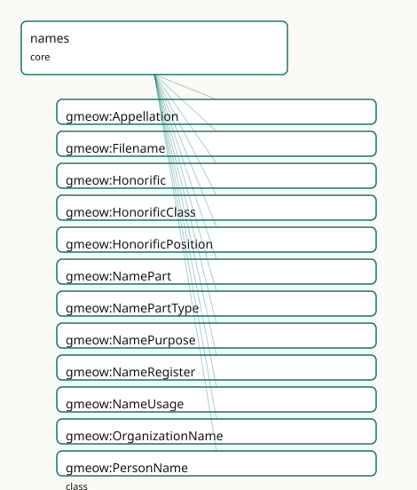

<!-- GENERATED by gmeow ontology-docs. DO NOT EDIT. -->

# GMEOW Names Module

- **IRI:** <https://blackcatinformatics.ca/gmeow/slices/names>
- **Tier:** core
- **[`Group`](../reference/classes/gmeow-Group.md):** core

## What This Slice Covers

This slice owns 154 terms and contributes 230 mapping or projection rows. Use it when its terms match the native fact you want to preserve; use the linkage tables to see how those facts leave GMEOW for consumer vocabularies.

## Dependencies

- [`gmeow:slices/agreements`](agreements.md)
- [`gmeow:slices/contacts`](contacts.md)
- [`gmeow:slices/entities`](entities.md)
- [`gmeow:slices/events`](events.md)
- [`gmeow:slices/kernel`](kernel.md)
- [`gmeow:slices/language`](language.md)
- [`gmeow:slices/observations`](observations.md)
- [`gmeow:slices/places`](places.md)
- [`gmeow:slices/temporal`](temporal.md)

## Consumers

- Every named entity across the ontology (P9 anti-colonial, co-equal naming); the mail corpus and contact graph; FOAF / schema.org / Wikidata name exports (via [`gmeow:hasName`](../reference/properties/gmeow-hasName.md)); gazetteer and place-naming projections; display-safety / deadname-suppression projections ([`gmeow:displayable`](../reference/properties/gmeow-displayable.md) false); and persona-expression register reuse (norms slice) through the [`gmeow:Register`](../reference/classes/gmeow-Register.md) umbrella.

## Local Map



## Examples

### Person Names

- **Source:** [`slices/core/names/examples/person-names.ttl`](https://github.com/Blackcat-Informatics/gmeow-ontology/blob/main/slices/core/names/examples/person-names.ttl)
- **GMEOW terms:** [`gmeow:NamePart`](../reference/classes/gmeow-NamePart.md), [`gmeow:NameUsage`](../reference/classes/gmeow-NameUsage.md), [`gmeow:Person`](../reference/classes/gmeow-Person.md), [`gmeow:PersonName`](../reference/classes/gmeow-PersonName.md), [`gmeow:displayable`](../reference/properties/gmeow-displayable.md), [`gmeow:fullName`](../reference/properties/gmeow-fullName.md), [`gmeow:hasName`](../reference/properties/gmeow-hasName.md), [`gmeow:hasNamePart`](../reference/properties/gmeow-hasNamePart.md), [`gmeow:hasPronounSet`](../reference/properties/gmeow-hasPronounSet.md), [`gmeow:namePartGiven`](../reference/individuals/gmeow-namePartGiven.md)

```turtle
# SPDX-FileCopyrightText: 2026 Blackcat Informatics® Inc. <paudley@blackcatinformatics.ca>
# SPDX-License-Identifier: CC-BY-4.0
#
# Worked example: names as reified, perspectival appellations. One person
# carries several PersonNames at once — a chosen legal name decomposed into
# parts, a superseded deadname kept but flagged non-displayable (P10:
# suppression, never deletion), and a Han-script form. A NameUsage relator
# records that close friends call them "Rob" in a familiar register — a usage is
# always SOMEONE's, never a global "preferred name" (P9). Pronouns ride the
# person, not any one name.
@prefix gmeow: <https://blackcatinformatics.ca/gmeow/> .
@prefix ex:    <https://blackcatinformatics.ca/gmeow/examples/names/> .
@prefix rdfs:  <http://www.w3.org/2000/01/rdf-schema#> .

ex:robin a gmeow:Person ;
    gmeow:hasName ex:nameChosen , ex:nameDead , ex:nameHan , ex:nickRob ;
    gmeow:hasPronounSet gmeow:pronounTheyThem .

# --- The chosen legal name, decomposed into ordered parts (displayable).
ex:nameChosen a gmeow:PersonName ;
    gmeow:fullName "Robin Avery Chen"@en ;
    gmeow:namePurpose gmeow:namePurposeChosen ;
    gmeow:displayable true ;
    gmeow:hasNamePart ex:partGiven , ex:partMiddle , ex:partSurname .

ex:partGiven a gmeow:NamePart ;
    gmeow:namePartType gmeow:namePartGiven ; gmeow:partText "Robin" ; gmeow:partOrder 0 .
ex:partMiddle a gmeow:NamePart ;
    gmeow:namePartType gmeow:namePartMiddle ; gmeow:partText "Avery" ; gmeow:partOrder 1 .
ex:partSurname a gmeow:NamePart ;
    gmeow:namePartType gmeow:namePartSurname ; gmeow:partText "Chen" ; gmeow:partOrder 2 .

# --- The superseded deadname: RETAINED (the record stays auditable) but
#     displayable false, so no projection ever surfaces it (P10).
ex:nameDead a gmeow:PersonName ;
    gmeow:fullName "Jordan Chen"@en ;
    gmeow:namePurpose gmeow:namePurposeDeadname ;
    gmeow:displayable false .

# --- A Han-script form, co-equal with the Latin one — no privileged "main" name.
ex:nameHan a gmeow:PersonName ;
    gmeow:fullName "陳"@und ;
    gmeow:namePurpose gmeow:namePurposeLegal ;
    gmeow:displayable true .

# --- A perspectival NameUsage: among close friends, in a familiar register, this
#     person is called "Rob". The nickname is its own Appellation.
ex:nickRob a gmeow:PersonName ;
    gmeow:fullName "Rob"@en ;
    gmeow:namePurpose gmeow:namePurposeNickname ;
    gmeow:displayable true .

ex:usageRobFriends a gmeow:NameUsage ;
    gmeow:usageNamed ex:robin ;
    gmeow:usageAppellation ex:nickRob ;
    gmeow:usageRegister gmeow:registerIntimate .
```

## Terms

### Classes

| Term | Label | Definition |
|---|---|---|
| [`gmeow:Appellation`](../reference/classes/gmeow-Appellation.md) | Appellation | A name as an information object borne by an entity — a person's name, a filename, a place name, an organization name. It carries the surface form (gmeow:fullNa... |
| [`gmeow:Filename`](../reference/classes/gmeow-Filename.md) | Filename | An appellation borne by a digital file — a stem and an extension. The extension CLAIMS a content type ([`gmeow:claimedMediaType`](../reference/properties/gmeow-claimedMediaType.md)) which may disagree with the type... |
| [`gmeow:Honorific`](../reference/classes/gmeow-Honorific.md) | Honorific | A title or form of address (Mr, Mx, Dr, -san, Sri, Sayyid, …). A value, not a subclass. Each carries a [`gmeow:honorificPosition`](../reference/properties/gmeow-honorificPosition.md) (prefix/suffix) and, where appli... |
| [`gmeow:HonorificClass`](../reference/classes/gmeow-HonorificClass.md) | Honorific Class | The domain of an honorific (academic, clerical, noble, military, judicial, social). |
| [`gmeow:HonorificPosition`](../reference/classes/gmeow-HonorificPosition.md) | Honorific Position | Whether an honorific is rendered before (prefix) or after (suffix) the name. |
| [`gmeow:NamePart`](../reference/classes/gmeow-NamePart.md) | Name Part | A reified component of a structured appellation — a given name, a surname, a patronymic, a nobiliary particle, an Arabic nisba, a filename extension. Its kind... |
| [`gmeow:NamePartType`](../reference/classes/gmeow-NamePartType.md) | Name Part Type | The kind of a name part (given, surname, patronymic, particle, Arabic nisba, filename extension, …). A value, not a NamePart subclass: naming systems worldwide... |
| [`gmeow:NamePurpose`](../reference/classes/gmeow-NamePurpose.md) | Name Purpose | The purpose/kind of a whole appellation (legal, birth, chosen, professional, deadname, …). A value, not a PersonName subclass; a person may simultaneously bear... |
| [`gmeow:NameRegister`](../reference/classes/gmeow-NameRegister.md) | Name Register | The social register of a name-usage (formal, intimate, professional, casual) — the naming specialization of the [`gmeow:Register`](../reference/classes/gmeow-Register.md) umbrella: a name register IS a r... |
| [`gmeow:NameUsage`](../reference/classes/gmeow-NameUsage.md) | Name Usage | A reified, context-dependent use of an appellation — an observation in the universal claim stack (observation-spine bridge): a named entity (observedFeature) i... |
| [`gmeow:OrganizationName`](../reference/classes/gmeow-OrganizationName.md) | Organization Name | An appellation borne by an organization — a legal name, a trading / 'doing-business-as' name, or a former name. |
| [`gmeow:PersonName`](../reference/classes/gmeow-PersonName.md) | Person Name | A structured, typed name borne by a person — birth name, married name, chosen name, alias, religious name — with ordered, typed name parts, an optional honorif... |
| [`gmeow:PlaceName`](../reference/classes/gmeow-PlaceName.md) | Place Name | An appellation (toponym) borne by a geographic place via [`gmeow:hasPlaceName`](../reference/properties/gmeow-hasPlaceName.md) — possibly endonym/exonym ([`gmeow:namePurpose`](../reference/properties/gmeow-namePurpose.md)), multilingual, or historical (held ov... |
| [`gmeow:PlaceNaming`](../reference/classes/gmeow-PlaceNaming.md) | Place Naming | A DEFINED specialization of [`gmeow:NameUsage`](../reference/classes/gmeow-NameUsage.md) whose named entity is a [`gmeow:Place`](../reference/classes/gmeow-Place.md) — a time/audience/register-scoped use of a toponym. Defined, NOT asserted: any... |
| [`gmeow:PronounSet`](../reference/classes/gmeow-PronounSet.md) | Pronoun Set | A set of third-person pronouns a person goes by, in the five English forms (subject, object, possessive determiner, possessive pronoun, reflexive). Sex/gender... |
| [`gmeow:Register`](../reference/classes/gmeow-Register.md) | Register | A social or expressive register — the formality, intimacy, or audience-posture of an expression act (the register/persona design). The OPEN umbrella vocabulary... |

### Properties

| Term | Label | Definition |
|---|---|---|
| [`gmeow:claimedMediaType`](../reference/properties/gmeow-claimedMediaType.md) | claimed media type | The MIME media type CLAIMED by a filename's extension (e.g. ".pdf" → "application/pdf"). A claim by the name, which may disagree with [`gmeow:detectedMediaType`](../reference/properties/gmeow-detectedMediaType.md).... |
| [`gmeow:conferredByEvent`](../reference/properties/gmeow-conferredByEvent.md) | conferred by event | The life event that conferred or changed an appellation — a [`gmeow:LifeEvent`](../reference/classes/gmeow-LifeEvent.md) carrying a [`gmeow:eventType`](../reference/properties/gmeow-eventType.md) such as [`gmeow:eventTypeChristening`](../reference/individuals/gmeow-eventTypeChristening.md), gmeow:eventTypeNameC... |
| [`gmeow:detectedMediaType`](../reference/properties/gmeow-detectedMediaType.md) | detected media type | The MIME media type DETECTED from the bytes/magic of an information object (the observed type). May disagree with a filename's [`gmeow:claimedMediaType`](../reference/properties/gmeow-claimedMediaType.md) — a misma... |
| [`gmeow:displayable`](../reference/properties/gmeow-displayable.md) | displayable | Whether a name or identity facet may be shown in interfaces and reports. The ONLY display control in the model — across naming ([`gmeow:Appellation`](../reference/classes/gmeow-Appellation.md)) and identity... |
| [`gmeow:fullName`](../reference/properties/gmeow-fullName.md) | full name | The complete surface form of an appellation as a single string, in the natural order of its culture (language-/script-tag the literal, e.g. "山田太郎"@ja, "Yamada... |
| [`gmeow:hasAgreementName`](../reference/properties/gmeow-hasAgreementName.md) | has agreement name | Relates an agreement to a structured [`gmeow:AgreementName`](../reference/classes/gmeow-AgreementName.md) it bears; the agreement-scoped specialization of [`gmeow:hasAppellation`](../reference/properties/gmeow-hasAppellation.md). Non-functional — an agreement m... |
| [`gmeow:hasAppellation`](../reference/properties/gmeow-hasAppellation.md) | has appellation | Relates an entity to an appellation (name-object) it bears. The universal name-bearing property; [`gmeow:hasName`](../reference/properties/gmeow-hasName.md) is the person-scoped specialization. Non-functio... |
| [`gmeow:hasName`](../reference/properties/gmeow-hasName.md) | has name | Relates a person to a structured, typed PersonName they bear; the person-scoped specialization of [`gmeow:hasAppellation`](../reference/properties/gmeow-hasAppellation.md). Non-functional — a person bears many co... |
| [`gmeow:hasNamePart`](../reference/properties/gmeow-hasNamePart.md) | has name part | Relates an appellation to one of its reified, typed parts. Non-functional — a name has many parts. A specialized information-object component relation under th... |
| [`gmeow:hasOrganizationName`](../reference/properties/gmeow-hasOrganizationName.md) | has organization name | Relates an organization to a structured [`gmeow:OrganizationName`](../reference/classes/gmeow-OrganizationName.md) it bears; the organization-scoped specialization of [`gmeow:hasAppellation`](../reference/properties/gmeow-hasAppellation.md), mirroring gmeow:hasNam... |
| [`gmeow:hasPlaceName`](../reference/properties/gmeow-hasPlaceName.md) | has place name | Relates a geographic [`gmeow:Place`](../reference/classes/gmeow-Place.md) to a structured [`gmeow:PlaceName`](../reference/classes/gmeow-PlaceName.md) (toponym) it bears; the place-scoped specialization of [`gmeow:hasAppellation`](../reference/properties/gmeow-hasAppellation.md), mirroring gmeow:h... |
| [`gmeow:hasPronounSet`](../reference/properties/gmeow-hasPronounSet.md) | has pronoun set | Relates a person to a pronoun set they go by. Non-functional and contextual (scope a context-specific set with gmeow:validFrom/validUntil on the statement, or... |
| [`gmeow:honorific`](../reference/properties/gmeow-honorific.md) | honorific | An honorific/title of address for a person (a [`gmeow:Honorific`](../reference/classes/gmeow-Honorific.md) value). Non-functional and contextual. A form of ADDRESS, sex/gender-independent — MUST NOT be in... |
| [`gmeow:honorificClass`](../reference/properties/gmeow-honorificClass.md) | honorific class | The domain/class of an honorific (academic, clerical, noble, military, judicial, social). |
| [`gmeow:honorificPosition`](../reference/properties/gmeow-honorificPosition.md) | honorific position | Whether an honorific is rendered before (prefix) or after (suffix) the name. |
| [`gmeow:nameLanguage`](../reference/properties/gmeow-nameLanguage.md) | name language | The first-class [`gmeow:Language`](../reference/classes/gmeow-Language.md) an appellation's surface form is in. Language is ALWAYS a first-class [`gmeow:Language`](../reference/classes/gmeow-Language.md) (registry-INDEPENDENT, self-minted IRI) — n... |
| [`gmeow:namePartType`](../reference/properties/gmeow-namePartType.md) | name part type | The kind of a name part (a [`gmeow:NamePartType`](../reference/classes/gmeow-NamePartType.md) value). Functional: a single part has one kind — a part that is both a surname and a patronymic is modelled as tw... |
| [`gmeow:namePurpose`](../reference/properties/gmeow-namePurpose.md) | name purpose | The intrinsic kind/purpose(s) of an appellation (legal, birth, chosen, professional, deadname, …) — a [`gmeow:NamePurpose`](../reference/classes/gmeow-NamePurpose.md) value. Non-functional: a name may be bo... |
| [`gmeow:nameScript`](../reference/properties/gmeow-nameScript.md) | name script | The ISO 15924 script code of an appellation (e.g. "Hani", "Arab", "Latn"). Available explicitly for indexing alongside a BCP-47 script subtag on the literal. |
| [`gmeow:partExpansion`](../reference/properties/gmeow-partExpansion.md) | part expansion | The expanded form of an abbreviated part — e.g. the full word a South-Indian (Tamil) initial stands for. |
| [`gmeow:partOrder`](../reference/properties/gmeow-partOrder.md) | part order | The 0-based position of a part within its appellation's surface order, as actually written in its culture. Records observed order WITHOUT implying a given-befo... |
| [`gmeow:partText`](../reference/properties/gmeow-partText.md) | part text | The string value of a name part. Language-/script-tag the literal where applicable. |
| [`gmeow:pronounObject`](../reference/properties/gmeow-pronounObject.md) | pronoun object | The object (accusative) form of a pronoun set, e.g. "her", "them", "xem". |
| [`gmeow:pronounPossessive`](../reference/properties/gmeow-pronounPossessive.md) | pronoun possessive | The possessive pronoun form of a pronoun set, e.g. "hers", "theirs", "xyrs". |
| [`gmeow:pronounPossessiveDeterminer`](../reference/properties/gmeow-pronounPossessiveDeterminer.md) | pronoun possessive determiner | The possessive determiner form of a pronoun set, e.g. "her", "their", "xyr". |
| [`gmeow:pronounReflexive`](../reference/properties/gmeow-pronounReflexive.md) | pronoun reflexive | The reflexive form of a pronoun set, e.g. "herself", "themself", "xemself". |
| [`gmeow:pronounSubject`](../reference/properties/gmeow-pronounSubject.md) | pronoun subject | The subject (nominative) form of a pronoun set, e.g. "she", "they", "xe". |
| [`gmeow:romanization`](../reference/properties/gmeow-romanization.md) | romanization | A Latin-script transliteration of THIS SAME appellation in another script (e.g. "Yamada Tarō" for "山田太郎"; pinyin for a Chinese name). Strictly a transliteratio... |
| [`gmeow:usageAppellation`](../reference/properties/gmeow-usageAppellation.md) | usage appellation | The appellation used to call the named entity in a name-usage. |
| [`gmeow:usageAudience`](../reference/properties/gmeow-usageAudience.md) | usage audience | The audience or scope in which the appellation is used — an Agent, a Group/Family, or a locale community. Range is [`gmeow:Entity`](../reference/classes/gmeow-Entity.md) to admit all of them. Non-funct... |
| [`gmeow:usageAuthority`](../reference/properties/gmeow-usageAuthority.md) | usage authority | The naming / toponymic authority behind a name-usage — the [`gmeow:Agent`](../reference/classes/gmeow-Agent.md) (a national mapping agency, a standards body, an indigenous community, or a self-asserti... |
| [`gmeow:usageInterval`](../reference/properties/gmeow-usageInterval.md) | usage interval | The time interval over which a name-usage held. (A relator carries its period this way — matching contacts' relationshipInterval — rather than via duringInterv... |
| [`gmeow:usageNamed`](../reference/properties/gmeow-usageNamed.md) | usage named | The entity that is called by the appellation in a name-usage. |
| [`gmeow:usageNamer`](../reference/properties/gmeow-usageNamer.md) | usage namer | An agent who uses the appellation for the named entity — the speaker/perspective holder. Non-functional: a usage may be shared by an audience of agents. |
| [`gmeow:usageRegister`](../reference/properties/gmeow-usageRegister.md) | usage register | The social register of a name-usage (formal, intimate, professional, casual) — a [`gmeow:NameRegister`](../reference/classes/gmeow-NameRegister.md) value individual. |
| [`gmeow:usageRelationshipScope`](../reference/properties/gmeow-usageRelationshipScope.md) | usage relationship scope | The interpersonal relationship that scopes a name-usage (e.g. the aunt-niece tie within which 'Aunt Genny' is used) — reuses the contacts relator. A sharper al... |

### Individuals

| Term | Label | Definition |
|---|---|---|
| [`gmeow:honorificClassAcademic`](../reference/individuals/gmeow-honorificClassAcademic.md) | academic | The academic honorific class — a broad social or institutional domain from which honorifics are drawn. |
| [`gmeow:honorificClassClerical`](../reference/individuals/gmeow-honorificClassClerical.md) | clerical | The clerical honorific class — a broad social or institutional domain from which honorifics are drawn. |
| [`gmeow:honorificClassJudicial`](../reference/individuals/gmeow-honorificClassJudicial.md) | judicial | The judicial honorific class — a broad social or institutional domain from which honorifics are drawn. |
| [`gmeow:honorificClassMilitary`](../reference/individuals/gmeow-honorificClassMilitary.md) | military | The military honorific class — a broad social or institutional domain from which honorifics are drawn. |
| [`gmeow:honorificClassNoble`](../reference/individuals/gmeow-honorificClassNoble.md) | noble | The noble honorific class — a broad social or institutional domain from which honorifics are drawn. |
| [`gmeow:honorificClassSocial`](../reference/individuals/gmeow-honorificClassSocial.md) | social | The social honorific class — a broad social or institutional domain from which honorifics are drawn. |
| [`gmeow:honorificDame`](../reference/individuals/gmeow-honorificDame.md) | Dame | The dame honorific — a term of respect, rank, or courtesy used when addressing or naming a person. |
| [`gmeow:honorificDr`](../reference/individuals/gmeow-honorificDr.md) | Dr | The dr honorific — a term of respect, rank, or courtesy used when addressing or naming a person. |
| [`gmeow:honorificHon`](../reference/individuals/gmeow-honorificHon.md) | Hon | The hon honorific — a term of respect, rank, or courtesy used when addressing or naming a person. |
| [`gmeow:honorificLady`](../reference/individuals/gmeow-honorificLady.md) | Lady | The lady honorific — a term of respect, rank, or courtesy used when addressing or naming a person. |
| [`gmeow:honorificLord`](../reference/individuals/gmeow-honorificLord.md) | Lord | The lord honorific — a term of respect, rank, or courtesy used when addressing or naming a person. |
| [`gmeow:honorificMr`](../reference/individuals/gmeow-honorificMr.md) | Mr | The mr honorific — a term of respect, rank, or courtesy used when addressing or naming a person. |
| [`gmeow:honorificMrs`](../reference/individuals/gmeow-honorificMrs.md) | Mrs | The mrs honorific — a term of respect, rank, or courtesy used when addressing or naming a person. |
| [`gmeow:honorificMs`](../reference/individuals/gmeow-honorificMs.md) | Ms | The ms honorific — a term of respect, rank, or courtesy used when addressing or naming a person. |
| [`gmeow:honorificMx`](../reference/individuals/gmeow-honorificMx.md) | Mx | The mx honorific — a term of respect, rank, or courtesy used when addressing or naming a person. |
| [`gmeow:honorificPositionPrefix`](../reference/individuals/gmeow-honorificPositionPrefix.md) | prefix | The prefix honorific position — a position in a name string where an honorific appears. |
| [`gmeow:honorificPositionSuffix`](../reference/individuals/gmeow-honorificPositionSuffix.md) | suffix | The suffix honorific position — a position in a name string where an honorific appears. |
| [`gmeow:honorificProf`](../reference/individuals/gmeow-honorificProf.md) | Prof | The prof honorific — a term of respect, rank, or courtesy used when addressing or naming a person. |
| [`gmeow:honorificRev`](../reference/individuals/gmeow-honorificRev.md) | Rev | The rev honorific — a term of respect, rank, or courtesy used when addressing or naming a person. |
| [`gmeow:honorificSama`](../reference/individuals/gmeow-honorificSama.md) | -sama | The sama honorific — a term of respect, rank, or courtesy used when addressing or naming a person. |
| [`gmeow:honorificSan`](../reference/individuals/gmeow-honorificSan.md) | -san | The san honorific — a term of respect, rank, or courtesy used when addressing or naming a person. |
| [`gmeow:honorificSayyid`](../reference/individuals/gmeow-honorificSayyid.md) | Sayyid | The sayyid honorific — a term of respect, rank, or courtesy used when addressing or naming a person. |
| [`gmeow:honorificSir`](../reference/individuals/gmeow-honorificSir.md) | Sir | The sir honorific — a term of respect, rank, or courtesy used when addressing or naming a person. |
| [`gmeow:honorificSmt`](../reference/individuals/gmeow-honorificSmt.md) | Smt (Srimati) | The smt honorific — a term of respect, rank, or courtesy used when addressing or naming a person. |
| [`gmeow:honorificSri`](../reference/individuals/gmeow-honorificSri.md) | Sri | The sri honorific — a term of respect, rank, or courtesy used when addressing or naming a person. |
| [`gmeow:namePartAgnomen`](../reference/individuals/gmeow-namePartAgnomen.md) | agnomen (Roman earned epithet) | The agnomen name part type — a kind of component that can appear in a personal or organizational appellation. |
| [`gmeow:namePartBirthOrderName`](../reference/individuals/gmeow-namePartBirthOrderName.md) | birth-order / day name | The birth order name name part type — a kind of component that can appear in a personal or organizational appellation. |
| [`gmeow:namePartBirthSurname`](../reference/individuals/gmeow-namePartBirthSurname.md) | birth surname / maiden name | The birth surname name part type — a kind of component that can appear in a personal or organizational appellation. |
| [`gmeow:namePartClanName`](../reference/individuals/gmeow-namePartClanName.md) | clan / lineage name | The clan name name part type — a kind of component that can appear in a personal or organizational appellation. |
| [`gmeow:namePartCognomen`](../reference/individuals/gmeow-namePartCognomen.md) | cognomen (Roman family branch) | The cognomen name part type — a kind of component that can appear in a personal or organizational appellation. |
| [`gmeow:namePartCourtesyName`](../reference/individuals/gmeow-namePartCourtesyName.md) | courtesy / art name | The courtesy name name part type — a kind of component that can appear in a personal or organizational appellation. |
| [`gmeow:namePartExtension`](../reference/individuals/gmeow-namePartExtension.md) | filename extension | The extension name part type — a kind of component that can appear in a personal or organizational appellation. |
| [`gmeow:namePartGenerationName`](../reference/individuals/gmeow-namePartGenerationName.md) | generation name (East-Asian lineage marker) | The generation name name part type — a kind of component that can appear in a personal or organizational appellation. |
| [`gmeow:namePartGenerationalOrdinal`](../reference/individuals/gmeow-namePartGenerationalOrdinal.md) | generational ordinal (III / 'the Third') | The generational ordinal name part type — a kind of component that can appear in a personal or organizational appellation. |
| [`gmeow:namePartGenerationalSuffix`](../reference/individuals/gmeow-namePartGenerationalSuffix.md) | generational suffix (Jr / Sr) | The generational suffix name part type — a kind of component that can appear in a personal or organizational appellation. |
| [`gmeow:namePartGiven`](../reference/individuals/gmeow-namePartGiven.md) | given name | The given name part type — a kind of component that can appear in a personal or organizational appellation. |
| [`gmeow:namePartHonorificPrefix`](../reference/individuals/gmeow-namePartHonorificPrefix.md) | honorific prefix | The honorific prefix name part type — a kind of component that can appear in a personal or organizational appellation. |
| [`gmeow:namePartHonorificSuffix`](../reference/individuals/gmeow-namePartHonorificSuffix.md) | honorific suffix | The honorific suffix name part type — a kind of component that can appear in a personal or organizational appellation. |
| [`gmeow:namePartHouseName`](../reference/individuals/gmeow-namePartHouseName.md) | house / estate name | The house name name part type — a kind of component that can appear in a personal or organizational appellation. |
| [`gmeow:namePartInitial`](../reference/individuals/gmeow-namePartInitial.md) | expandable initial | The initial name part type — a kind of component that can appear in a personal or organizational appellation. |
| [`gmeow:namePartIsm`](../reference/individuals/gmeow-namePartIsm.md) | ism (Arabic personal name) | The ism name part type — a kind of component that can appear in a personal or organizational appellation. |
| [`gmeow:namePartKunya`](../reference/individuals/gmeow-namePartKunya.md) | kunya (Arabic teknonym) | The kunya name part type — a kind of component that can appear in a personal or organizational appellation. |
| [`gmeow:namePartLaqab`](../reference/individuals/gmeow-namePartLaqab.md) | laqab (Arabic epithet) | The laqab name part type — a kind of component that can appear in a personal or organizational appellation. |
| [`gmeow:namePartMaternalSurname`](../reference/individuals/gmeow-namePartMaternalSurname.md) | maternal surname | The maternal surname name part type — a kind of component that can appear in a personal or organizational appellation. |
| [`gmeow:namePartMatronymic`](../reference/individuals/gmeow-namePartMatronymic.md) | matronymic | The matronymic name part type — a kind of component that can appear in a personal or organizational appellation. |
| [`gmeow:namePartMiddle`](../reference/individuals/gmeow-namePartMiddle.md) | middle / additional name | The middle name part type — a kind of component that can appear in a personal or organizational appellation. |
| [`gmeow:namePartMononym`](../reference/individuals/gmeow-namePartMononym.md) | mononym | The mononym name part type — a kind of component that can appear in a personal or organizational appellation. |
| [`gmeow:namePartNasab`](../reference/individuals/gmeow-namePartNasab.md) | nasab (Arabic patronymic lineage) | The nasab name part type — a kind of component that can appear in a personal or organizational appellation. |
| [`gmeow:namePartNickname`](../reference/individuals/gmeow-namePartNickname.md) | nickname / hypocorism | The nickname name part type — a kind of component that can appear in a personal or organizational appellation. |
| [`gmeow:namePartNisba`](../reference/individuals/gmeow-namePartNisba.md) | nisba (Arabic origin / affiliation name) | The nisba name part type — a kind of component that can appear in a personal or organizational appellation. |
| [`gmeow:namePartNomen`](../reference/individuals/gmeow-namePartNomen.md) | nomen (Roman gens / clan name) | The nomen name part type — a kind of component that can appear in a personal or organizational appellation. |
| [`gmeow:namePartParticle`](../reference/individuals/gmeow-namePartParticle.md) | nobiliary / nominal particle | The particle name part type — a kind of component that can appear in a personal or organizational appellation. |
| [`gmeow:namePartPaternalSurname`](../reference/individuals/gmeow-namePartPaternalSurname.md) | paternal surname | The paternal surname name part type — a kind of component that can appear in a personal or organizational appellation. |
| [`gmeow:namePartPatronymic`](../reference/individuals/gmeow-namePartPatronymic.md) | patronymic | The patronymic name part type — a kind of component that can appear in a personal or organizational appellation. |
| [`gmeow:namePartPraenomen`](../reference/individuals/gmeow-namePartPraenomen.md) | praenomen (Roman personal name) | The praenomen name part type — a kind of component that can appear in a personal or organizational appellation. |
| [`gmeow:namePartReligiousName`](../reference/individuals/gmeow-namePartReligiousName.md) | religious / regnal name | The religious name name part type — a kind of component that can appear in a personal or organizational appellation. |
| [`gmeow:namePartStem`](../reference/individuals/gmeow-namePartStem.md) | filename stem | The stem name part type — a kind of component that can appear in a personal or organizational appellation. |
| [`gmeow:namePartSurname`](../reference/individuals/gmeow-namePartSurname.md) | surname / family name | The surname name part type — a kind of component that can appear in a personal or organizational appellation. |
| [`gmeow:namePartTeknonym`](../reference/individuals/gmeow-namePartTeknonym.md) | teknonym (parent-of name) | The teknonym name part type — a kind of component that can appear in a personal or organizational appellation. |
| [`gmeow:namePurposeBirth`](../reference/individuals/gmeow-namePurposeBirth.md) | birth name | The birth name purpose — a role that a particular appellation plays in the life of its bearer. |
| [`gmeow:namePurposeCeremonial`](../reference/individuals/gmeow-namePurposeCeremonial.md) | ceremonial name | The ceremonial name purpose — a role that a particular appellation plays in the life of its bearer. |
| [`gmeow:namePurposeChosen`](../reference/individuals/gmeow-namePurposeChosen.md) | chosen / self-identified name | The chosen name purpose — a role that a particular appellation plays in the life of its bearer. |
| [`gmeow:namePurposeDeadname`](../reference/individuals/gmeow-namePurposeDeadname.md) | deadname (historical, do-not-display) | The deadname name purpose — a role that a particular appellation plays in the life of its bearer. |
| [`gmeow:namePurposeEndonym`](../reference/individuals/gmeow-namePurposeEndonym.md) | endonym (name used by a place's own inhabitants / a language's own speakers) | The endonym name purpose — a role that a particular appellation plays in the life of its bearer. |
| [`gmeow:namePurposeExonym`](../reference/individuals/gmeow-namePurposeExonym.md) | exonym (name used by outsiders / in another language) | The exonym name purpose — a role that a particular appellation plays in the life of its bearer. |
| [`gmeow:namePurposeGlossonym`](../reference/individuals/gmeow-namePurposeGlossonym.md) | glossonym (name of a language) | The glossonym name purpose — a role that a particular appellation plays in the life of its bearer. |
| [`gmeow:namePurposeLegal`](../reference/individuals/gmeow-namePurposeLegal.md) | legal name | The legal name purpose — a role that a particular appellation plays in the life of its bearer. |
| [`gmeow:namePurposeNickname`](../reference/individuals/gmeow-namePurposeNickname.md) | nickname / familiar name | The nickname name purpose — a role that a particular appellation plays in the life of its bearer. |
| [`gmeow:namePurposeOnlineHandle`](../reference/individuals/gmeow-namePurposeOnlineHandle.md) | online handle / username | The online handle name purpose — a role that a particular appellation plays in the life of its bearer. |
| [`gmeow:namePurposePenStage`](../reference/individuals/gmeow-namePurposePenStage.md) | pen / stage name | The pen stage name purpose — a role that a particular appellation plays in the life of its bearer. |
| [`gmeow:namePurposeProfessional`](../reference/individuals/gmeow-namePurposeProfessional.md) | professional name | The professional name purpose — a role that a particular appellation plays in the life of its bearer. |
| [`gmeow:namePurposeRegnal`](../reference/individuals/gmeow-namePurposeRegnal.md) | regnal name | The regnal name purpose — a role that a particular appellation plays in the life of its bearer. |
| [`gmeow:namePurposeReligious`](../reference/individuals/gmeow-namePurposeReligious.md) | religious name | The religious name purpose — a role that a particular appellation plays in the life of its bearer. |
| [`gmeow:namePurposeSuperseded`](../reference/individuals/gmeow-namePurposeSuperseded.md) | superseded / former name | The superseded name purpose — a role that a particular appellation plays in the life of its bearer. |
| [`gmeow:pronounAeAer`](../reference/individuals/gmeow-pronounAeAer.md) | ae/aer | The ae/aer pronoun set — a third-person pronoun paradigm used to refer to an entity in discourse. |
| [`gmeow:pronounAny`](../reference/individuals/gmeow-pronounAny.md) | any pronouns | A non-specifying pronoun stance indicating that any third-person pronoun set is acceptable when referring to the entity. |
| [`gmeow:pronounAsk`](../reference/individuals/gmeow-pronounAsk.md) | ask me | A non-specifying pronoun stance indicating that the speaker or writer should ask the entity which pronouns to use. |
| [`gmeow:pronounCoCos`](../reference/individuals/gmeow-pronounCoCos.md) | co/cos | The co/cos pronoun set — a third-person pronoun paradigm used to refer to an entity in discourse. |
| [`gmeow:pronounEEm`](../reference/individuals/gmeow-pronounEEm.md) | e/em (Spivak) | The e/em pronoun set — a third-person pronoun paradigm used to refer to an entity in discourse. |
| [`gmeow:pronounEyEm`](../reference/individuals/gmeow-pronounEyEm.md) | ey/em (Elverson) | The ey/em pronoun set — a third-person pronoun paradigm used to refer to an entity in discourse. |
| [`gmeow:pronounFaeFaer`](../reference/individuals/gmeow-pronounFaeFaer.md) | fae/faer | The fae/faer pronoun set — a third-person pronoun paradigm used to refer to an entity in discourse. |
| [`gmeow:pronounHeHim`](../reference/individuals/gmeow-pronounHeHim.md) | he/him | The he/him pronoun set — a third-person pronoun paradigm used to refer to an entity in discourse. |
| [`gmeow:pronounHuHum`](../reference/individuals/gmeow-pronounHuHum.md) | hu/hum | The hu/hum pronoun set — a third-person pronoun paradigm used to refer to an entity in discourse. |
| [`gmeow:pronounItIts`](../reference/individuals/gmeow-pronounItIts.md) | it/its | The it/its pronoun set — a third-person pronoun paradigm used to refer to an entity in discourse. |
| [`gmeow:pronounKiKin`](../reference/individuals/gmeow-pronounKiKin.md) | ki/kin | The ki/kin pronoun set — a third-person pronoun paradigm used to refer to an entity in discourse. |
| [`gmeow:pronounNameOnly`](../reference/individuals/gmeow-pronounNameOnly.md) | use my name (no pronouns) | A non-specifying pronoun stance indicating that the entity prefers no third-person pronouns and requests that their name be used in place of any pronoun. |
| [`gmeow:pronounNeNem`](../reference/individuals/gmeow-pronounNeNem.md) | ne/nem | The ne/nem pronoun set — a third-person pronoun paradigm used to refer to an entity in discourse. |
| [`gmeow:pronounOneOne`](../reference/individuals/gmeow-pronounOneOne.md) | one/one (generic) | The one/one pronoun set — a third-person pronoun paradigm used to refer to an entity in discourse. |
| [`gmeow:pronounPerPer`](../reference/individuals/gmeow-pronounPerPer.md) | per/per | The per/per pronoun set — a third-person pronoun paradigm used to refer to an entity in discourse. |
| [`gmeow:pronounSheHer`](../reference/individuals/gmeow-pronounSheHer.md) | she/her | The she/her pronoun set — a third-person pronoun paradigm used to refer to an entity in discourse. |
| [`gmeow:pronounTheyThem`](../reference/individuals/gmeow-pronounTheyThem.md) | they/them (singular) | The they/them pronoun set — a third-person pronoun paradigm used to refer to an entity in discourse. |
| [`gmeow:pronounThonThon`](../reference/individuals/gmeow-pronounThonThon.md) | thon/thon | The thon/thon pronoun set — a third-person pronoun paradigm used to refer to an entity in discourse. |
| [`gmeow:pronounVeVer`](../reference/individuals/gmeow-pronounVeVer.md) | ve/ver | The ve/ver pronoun set — a third-person pronoun paradigm used to refer to an entity in discourse. |
| [`gmeow:pronounViVir`](../reference/individuals/gmeow-pronounViVir.md) | vi/vir | The vi/vir pronoun set — a third-person pronoun paradigm used to refer to an entity in discourse. |
| [`gmeow:pronounXeXem`](../reference/individuals/gmeow-pronounXeXem.md) | xe/xem | The xe/xem pronoun set — a third-person pronoun paradigm used to refer to an entity in discourse. |
| [`gmeow:pronounZeHir`](../reference/individuals/gmeow-pronounZeHir.md) | ze/hir | The ze/hir pronoun set — a third-person pronoun paradigm used to refer to an entity in discourse. |
| [`gmeow:pronounZeZir`](../reference/individuals/gmeow-pronounZeZir.md) | ze/zir | The ze/zir pronoun set — a third-person pronoun paradigm used to refer to an entity in discourse. |
| [`gmeow:pronounZheZher`](../reference/individuals/gmeow-pronounZheZher.md) | zhe/zher | The zhe/zher pronoun set — a third-person pronoun paradigm used to refer to an entity in discourse. |
| [`gmeow:registerCasual`](../reference/individuals/gmeow-registerCasual.md) | casual | The casual name register — a level of formality or social distance at which a name is used. |
| [`gmeow:registerFormal`](../reference/individuals/gmeow-registerFormal.md) | formal | The formal name register — a level of formality or social distance at which a name is used. |
| [`gmeow:registerIntimate`](../reference/individuals/gmeow-registerIntimate.md) | intimate / familial | The intimate name register — a level of formality or social distance at which a name is used. |
| [`gmeow:registerProfessional`](../reference/individuals/gmeow-registerProfessional.md) | professional | The professional name register — a level of formality or social distance at which a name is used. |

## Linkages

- **Rows:** 230
- **Projection profiles:** `activitystreams`, `codemeta`, `dcterms`, `doap`, `foaf`, `geosparql`, `ical`, `iiif`, `mailmap`, `markdown`, `oai_dc`, `ontolex`, `qb`, `schema-org`, `skos`, `sosa`, `vcard`, `web-annotation`
- **External vocabularies:** `as`, `codemeta`, `crm`, `dc`, `dcterms`, `doap`, `foaf`, `geo`, `gn`, `gx`, `gxv`, `ical`, `iiif`, `lime`, `oa`, `ontolex`, `pleiades`, `qb`, `rdf`, `schema`, `skos`, `sosa`, `vcard`, `vcardx`, `wd`, `wdt`

| Source | Kind | Profile | Predicate/Relation | Target | Evidence |
|---|---|---|---|---|---|
| [`gmeow:Appellation`](../reference/classes/gmeow-Appellation.md) | equivalence | `-` | [rdfs:subClassOf](http://www.w3.org/2000/01/rdf-schema#subClassOf) | [ontolex:LexicalEntry](http://www.w3.org/ns/lemon/ontolex#LexicalEntry) | `gmeow-names.sssom.tsv`; `gmeow:eqNames042`; confidence 0.9 |
| [`gmeow:NameUsage`](../reference/classes/gmeow-NameUsage.md) | equivalence | `-` | [skos:closeMatch](http://www.w3.org/2004/02/skos/core#closeMatch) | [sosa:Observation](http://www.w3.org/ns/sosa/Observation) | `gmeow-observations.sssom.tsv`; `gmeow:eqObs021`; confidence 0.85 |
| [`gmeow:PersonName`](../reference/classes/gmeow-PersonName.md) | equivalence | `-` | [skos:closeMatch](http://www.w3.org/2004/02/skos/core#closeMatch) | [gx:Name](http://gedcomx.org/Name) | `gmeow-names.sssom.tsv`; `gmeow:eqNames005`; confidence 0.8 |
| [`gmeow:PersonName`](../reference/classes/gmeow-PersonName.md) | equivalence | `-` | [skos:closeMatch](http://www.w3.org/2004/02/skos/core#closeMatch) | [gxv:Name](http://gedcomx.org/v1/Name) | `gmeow-genealogy.sssom.tsv`; `gmeow:eqGenealogy050`; confidence 0.9 |
| [`gmeow:PlaceName`](../reference/classes/gmeow-PlaceName.md) | equivalence | `-` | [skos:closeMatch](http://www.w3.org/2004/02/skos/core#closeMatch) | [crm:E48_Place_Name](http://www.cidoc-crm.org/cidoc-crm/E48_Place_Name) | `gmeow-names.sssom.tsv`; `gmeow:eqNames034`; confidence 0.85 |
| [`gmeow:PlaceNaming`](../reference/classes/gmeow-PlaceNaming.md) | equivalence | `-` | [skos:closeMatch](http://www.w3.org/2004/02/skos/core#closeMatch) | [crm:E41_Appellation](http://www.cidoc-crm.org/cidoc-crm/E41_Appellation) | `gmeow-places.sssom.tsv`; `gmeow:eqPlaces070`; confidence 0.8 |
| [`gmeow:PronounSet`](../reference/classes/gmeow-PronounSet.md) | equivalence | `-` | [skos:broadMatch](http://www.w3.org/2004/02/skos/core#broadMatch) | [wd:Q36224](https://www.wikidata.org/wiki/Q36224) | `gmeow-names.sssom.tsv`; `gmeow:eqNames033`; confidence 0.5 |
| [`gmeow:PronounSet`](../reference/classes/gmeow-PronounSet.md) | equivalence | `-` | [skos:closeMatch](http://www.w3.org/2004/02/skos/core#closeMatch) | [wd:Q65067284](https://www.wikidata.org/wiki/Q65067284) | `gmeow-names.sssom.tsv`; `gmeow:eqNames031`; confidence 0.9 |
| [`gmeow:fullName`](../reference/properties/gmeow-fullName.md) | equivalence | `-` | [skos:closeMatch](http://www.w3.org/2004/02/skos/core#closeMatch) | [foaf:name](http://xmlns.com/foaf/0.1/name) | `gmeow-names.sssom.tsv`; `gmeow:eqNames003`; confidence 0.8 |
| [`gmeow:fullName`](../reference/properties/gmeow-fullName.md) | equivalence | `-` | [skos:closeMatch](http://www.w3.org/2004/02/skos/core#closeMatch) | [ontolex:writtenRep](http://www.w3.org/ns/lemon/ontolex#writtenRep) | `gmeow-names.sssom.tsv`; `gmeow:eqNames044`; confidence 0.85 |
| [`gmeow:fullName`](../reference/properties/gmeow-fullName.md) | equivalence | `-` | [skos:closeMatch](http://www.w3.org/2004/02/skos/core#closeMatch) | [schema:name](https://schema.org/name) | `gmeow-names.sssom.tsv`; `gmeow:eqNames001`; confidence 0.8 |
| [`gmeow:fullName`](../reference/properties/gmeow-fullName.md) | equivalence | `-` | [skos:closeMatch](http://www.w3.org/2004/02/skos/core#closeMatch) | [vcard:fn](http://www.w3.org/2006/vcard/ns#fn) | `gmeow-names.sssom.tsv`; `gmeow:eqNames002`; confidence 0.9 |
| [`gmeow:fullName`](../reference/properties/gmeow-fullName.md) | equivalence | `-` | [skos:closeMatch](http://www.w3.org/2004/02/skos/core#closeMatch) | [wdt:P1559](https://www.wikidata.org/wiki/Property:P1559) | `gmeow-names.sssom.tsv`; `gmeow:eqNames004`; confidence 0.7 |
| [`gmeow:hasAgreementName`](../reference/properties/gmeow-hasAgreementName.md) | equivalence | `-` | [skos:broadMatch](http://www.w3.org/2004/02/skos/core#broadMatch) | [schema:name](https://schema.org/name) | `gmeow-names.sssom.tsv`; `gmeow:eqNames054`; confidence 0.6 |
| [`gmeow:hasNamePart`](../reference/properties/gmeow-hasNamePart.md) | equivalence | `-` | [skos:closeMatch](http://www.w3.org/2004/02/skos/core#closeMatch) | [gx:nameForm](http://gedcomx.org/nameForm) | `gmeow-names.sssom.tsv`; `gmeow:eqNames006`; confidence 0.6 |
| [`gmeow:hasOrganizationName`](../reference/properties/gmeow-hasOrganizationName.md) | equivalence | `-` | [skos:broadMatch](http://www.w3.org/2004/02/skos/core#broadMatch) | [foaf:name](http://xmlns.com/foaf/0.1/name) | `gmeow-names.sssom.tsv`; `gmeow:eqNames047`; confidence 0.6 |
| [`gmeow:hasOrganizationName`](../reference/properties/gmeow-hasOrganizationName.md) | equivalence | `-` | [skos:broadMatch](http://www.w3.org/2004/02/skos/core#broadMatch) | [schema:name](https://schema.org/name) | `gmeow-names.sssom.tsv`; `gmeow:eqNames045`; confidence 0.6 |
| [`gmeow:hasOrganizationName`](../reference/properties/gmeow-hasOrganizationName.md) | equivalence | `-` | [skos:broadMatch](http://www.w3.org/2004/02/skos/core#broadMatch) | [vcard:organization-name](http://www.w3.org/2006/vcard/ns#organization-name) | `gmeow-names.sssom.tsv`; `gmeow:eqNames046`; confidence 0.7 |
| [`gmeow:hasPlaceName`](../reference/properties/gmeow-hasPlaceName.md) | equivalence | `-` | [skos:broadMatch](http://www.w3.org/2004/02/skos/core#broadMatch) | [gn:name](http://www.geonames.org/ontology#name) | `gmeow-names.sssom.tsv`; `gmeow:eqNames035`; confidence 0.6 |
| [`gmeow:hasPlaceName`](../reference/properties/gmeow-hasPlaceName.md) | equivalence | `-` | [skos:closeMatch](http://www.w3.org/2004/02/skos/core#closeMatch) | [pleiades:Name](http://pleiades.stoa.org/places/vocab#Name) | `gmeow-places.sssom.tsv`; `gmeow:eqPlaces073`; confidence 0.8 |
| [`gmeow:hasPlaceName`](../reference/properties/gmeow-hasPlaceName.md) | equivalence | `-` | [skos:broadMatch](http://www.w3.org/2004/02/skos/core#broadMatch) | [schema:name](https://schema.org/name) | `gmeow-names.sssom.tsv`; `gmeow:eqNames036`; confidence 0.5 |
| [`gmeow:hasPronounSet`](../reference/properties/gmeow-hasPronounSet.md) | equivalence | `-` | [skos:closeMatch](http://www.w3.org/2004/02/skos/core#closeMatch) | [wdt:P6553](https://www.wikidata.org/wiki/Property:P6553) | `gmeow-names.sssom.tsv`; `gmeow:eqNames032`; confidence 0.85 |
| [`gmeow:honorific`](../reference/properties/gmeow-honorific.md) | equivalence | `-` | [skos:closeMatch](http://www.w3.org/2004/02/skos/core#closeMatch) | [schema:honorificPrefix](https://schema.org/honorificPrefix) | `gmeow-names.sssom.tsv`; `gmeow:eqNames027`; confidence 0.7 |
| [`gmeow:honorific`](../reference/properties/gmeow-honorific.md) | equivalence | `-` | [skos:closeMatch](http://www.w3.org/2004/02/skos/core#closeMatch) | [wdt:P511](https://www.wikidata.org/wiki/Property:P511) | `gmeow-names.sssom.tsv`; `gmeow:eqNames028`; confidence 0.8 |
|... |... |... |... |... | 206 more rows |

## Guide

<!-- SPDX-FileCopyrightText: 2026 Blackcat Informatics® Inc. <paudley@blackcatinformatics.ca> -->
<!-- SPDX-License-Identifier: CC-BY-4.0 -->

# Names — modelling & interoperability guide

Most data models treat a name as an *attribute of a thing*:
`person.familyName = "Smith"`. That single assumption fails the moment a name
**changes** (marriage, divorce, transition), is **context-dependent** (Aunt Genny
to family, Mrs Smith to students), carries **facets** (pronouns, honorifics), or
belongs to a **non-person** that can *lie about itself* (a `.pdf` that isn't a
PDF). GMEOW therefore models a name as a **reified, time-bounded, context-scoped,
source-attributed relationship** — never a bare property.

This guide is longer than most because the model is deliberately **non-standard**.
That non-standardness is the point: standard name models encode assumptions that
are, at best, parochial and, at worst, harmful.

## The reframe

| Real-world fact | What a flat `familyName` cannot express | GMEOW axis |
|---|---|---|
| Karen Anne Alpha → Karen Beta → Charles Alpha | a name is not stable | **time** |
| Aunt Genny vs Mrs Smith | a name is not universal | **context / audience** |
| names travel with pronouns & titles | a name is not just a string | **facets** |
| `invoice.pdf` is actually a ZIP | names aren't only for people, and can be wrong | **scope + claim-vs-reality** |
| Patrick Colm Audley **and** 欧德理 | a person has co-equal names in different scripts | **co-equality** |

Two classes carry the whole model:

- **[`gmeow:Appellation`](../reference/classes/gmeow-Appellation.md)** *(an [`InformationObject`](../reference/classes/gmeow-InformationObject.md))* — the name **as an object**:
 its surface form ([`gmeow:fullName`](../reference/properties/gmeow-fullName.md)), its structured parts ([`gmeow:hasNamePart`](../reference/properties/gmeow-hasNamePart.md)),
 its language/script, its purpose. Subclasses: [`gmeow:PersonName`](../reference/classes/gmeow-PersonName.md),
 [`gmeow:Filename`](../reference/classes/gmeow-Filename.md), [`gmeow:PlaceName`](../reference/classes/gmeow-PlaceName.md), [`gmeow:OrganizationName`](../reference/classes/gmeow-OrganizationName.md).
- **[`gmeow:NameUsage`](../reference/classes/gmeow-NameUsage.md)** *(a [`gufo:Relator`](../external/terms.md#gufo-relator))* — the **use** of an appellation in
 context: who is named, by/among whom, in what register, over what period. This
 is the same reification idiom as [`gmeow:Certification`](../reference/classes/gmeow-Certification.md) and
 [`gmeow:InterpersonalRelationship`](../reference/classes/gmeow-InterpersonalRelationship.md).

The appellation is the noun; the usage is the relator that situates it.

## Governing tenet: co-equality of names (anti-colonial naming)

The schema's **shape** can enact colonial hierarchy. A single canonical `name`
slot plus a bag of `alternateName`s declares "one identity is the truth, the rest
are deviations." GMEOW structurally refuses this.

> The project owner is **Patrick Colm Audley** *and* **欧德理**. These are
> **co-equal full names** of one person. 欧德理 is not an `alternateName`, not a
> romanization of "Audley", not a footnote — it is a name, family-first (姓 欧 →
> 名 德理), chosen and meaningful in its own right.

Binding rules, enforced by `tests/test_names.py`:

1. **No primary name.** There is deliberately **no `preferredForDisplay`,
 `primaryName`, or `canonicalName` term.** A person bears many co-equal
 [`gmeow:PersonName`](../reference/classes/gmeow-PersonName.md)s via [`gmeow:hasName`](../reference/properties/gmeow-hasName.md).
2. **No derivation arrow between co-equal names.** Even where one name arose from
 sound-mapping another, origin ≠ subordination. [`gmeow:romanization`](../reference/properties/gmeow-romanization.md) relates a
 name only to a transliteration of *itself* — it never bridges two names.
3. **Display selection is locale-relative and symmetric.** Match the name's
 [`gmeow:nameLanguage`](../reference/properties/gmeow-nameLanguage.md) / [`gmeow:nameScript`](../reference/properties/gmeow-nameScript.md) to the audience's locale. For a
 Sinophone audience 欧德理 is shown and "Patrick" is fallback; for an Anglophone
 audience, the reverse. Neither is *the* name.
4. **Self-assertion is top authority.** A name the named person asserts
 ([`gmeow:wasAttributedTo`](../reference/properties/gmeow-wasAttributedTo.md) the person) outranks registry/import assertions and
 must not be silently overwritten — the same root as deadname suppression.
5. **No imposed structure.** No required given+family split; mononyms and
 non-Western part systems are first-class; [`gmeow:partOrder`](../reference/properties/gmeow-partOrder.md) is descriptive,
 never normative.

```turtle
@prefix gmeow: <https://blackcatinformatics.ca/gmeow/> .
@prefix ex:    <https://example.org/names/> .

# --- Languages ---
ex:langEn a gmeow:Language ; gmeow:languageTag "en" ; gmeow:languageCode "en" .
ex:langZh a gmeow:Language ; gmeow:languageTag "und" ; gmeow:languageCode "zh" .

# --- Person and Names ---
ex:patrick a gmeow:Person ; gmeow:hasName ex:nameLatin , ex:nameHan .   # co-equal

ex:nameLatin a gmeow:PersonName ;
    gmeow:fullName "Patrick Colm Audley"@en ;
    gmeow:nameLanguage ex:langEn ;
    gmeow:namePurpose gmeow:namePurposeLegal ;
    gmeow:wasAttributedTo ex:patrick .

ex:nameHan a gmeow:PersonName ;
    gmeow:fullName "欧德理"@und ;
    gmeow:nameLanguage ex:langZh ;
    gmeow:nameScript "Hans" ;
    gmeow:romanization "Ōu Délǐ"@und ;  # romanization of THIS name only
    gmeow:namePurpose gmeow:namePurposeChosen ;
    gmeow:wasAttributedTo ex:patrick .
```

> **Multilingualism is a separate, forthcoming building block.** This module is
> *multilingual-ready* (co-equal names, per-name language/script, locale-relative
> display) but the full locale-resolution machinery is deferred.

## Structured parts — a multi-cultural value vocabulary

A [`gmeow:NamePart`](../reference/classes/gmeow-NamePart.md) is a reified, typed, optionally-ordered component. Its kind is
the **value** [`gmeow:namePartType`](../reference/properties/gmeow-namePartType.md) (open vocabulary, never a subclass — the
[`placeType`](../reference/properties/gmeow-placeType.md) idiom). [`gmeow:partOrder`](../reference/properties/gmeow-partOrder.md) records *observed* order and never implies a
given-before-family default.

| Naming system | Parts ([`namePartType`](../reference/properties/gmeow-namePartType.md) value) | Example |
|---|---|---|
| Anglo | [`namePartGiven`](../reference/individuals/gmeow-namePartGiven.md), [`namePartMiddle`](../reference/individuals/gmeow-namePartMiddle.md), [`namePartSurname`](../reference/individuals/gmeow-namePartSurname.md) | Mary Lucille Smith |
| East-Asian (family-first) | [`namePartSurname`](../reference/individuals/gmeow-namePartSurname.md) (order 0), [`namePartGiven`](../reference/individuals/gmeow-namePartGiven.md) (order 1) | 欧 德理 / 山田 太郎 |
| Spanish double surname | [`namePartGiven`](../reference/individuals/gmeow-namePartGiven.md), [`namePartPaternalSurname`](../reference/individuals/gmeow-namePartPaternalSurname.md), [`namePartMaternalSurname`](../reference/individuals/gmeow-namePartMaternalSurname.md) | José **García** **Pérez** |
| Arabic | [`namePartIsm`](../reference/individuals/gmeow-namePartIsm.md), [`namePartKunya`](../reference/individuals/gmeow-namePartKunya.md), [`namePartNasab`](../reference/individuals/gmeow-namePartNasab.md), [`namePartLaqab`](../reference/individuals/gmeow-namePartLaqab.md), [`namePartNisba`](../reference/individuals/gmeow-namePartNisba.md) | Muhammad **ibn Musa** **al-Khwarizmi** |
| Icelandic / Slavic | [`namePartPatronymic`](../reference/individuals/gmeow-namePartPatronymic.md) / [`namePartMatronymic`](../reference/individuals/gmeow-namePartMatronymic.md) | Sigríður **Jónsdóttir** |
| South-Indian (Tamil) | [`namePartInitial`](../reference/individuals/gmeow-namePartInitial.md) + [`gmeow:partExpansion`](../reference/properties/gmeow-partExpansion.md) | **R.** Kannan |
| Mononym | [`namePartMononym`](../reference/individuals/gmeow-namePartMononym.md) (no surname) | Plato, Sukarno |
| Regnal / religious | [`namePartReligiousName`](../reference/individuals/gmeow-namePartReligiousName.md) | Pope **Francis** |
| East-Asian courtesy / pen name | [`namePartCourtesyName`](../reference/individuals/gmeow-namePartCourtesyName.md) | zi / hao; "Mark Twain" |
| Nobiliary particle | [`namePartParticle`](../reference/individuals/gmeow-namePartParticle.md) | **von**, **de**, **van**, **al-**, **bin** |
| Generational suffix | [`namePartGenerationalSuffix`](../reference/individuals/gmeow-namePartGenerationalSuffix.md) | Jr., **Sr.** |
| Generational ordinal | [`namePartGenerationalOrdinal`](../reference/individuals/gmeow-namePartGenerationalOrdinal.md) (distinct from the suffix) | Charles Beaumont Sr. **III** / "the Third" |
| East-Asian generation name | [`namePartGenerationName`](../reference/individuals/gmeow-namePartGenerationName.md) | 林**文**豪 (文 shared by same-generation kin) |
| Clan / lineage name | [`namePartClanName`](../reference/individuals/gmeow-namePartClanName.md) | Korean **김해** (Gimhae) bon-gwan; Mongolian *ovog* |
| Birth-order / day name | [`namePartBirthOrderName`](../reference/individuals/gmeow-namePartBirthOrderName.md) | Balinese **Wayan**; Akan **Kofi** (Friday-born) |
| Teknonym (parent-of) | [`namePartTeknonym`](../reference/individuals/gmeow-namePartTeknonym.md) | Indonesian **Ibu Sari** (mother of Sari) |
| House / estate name | [`namePartHouseName`](../reference/individuals/gmeow-namePartHouseName.md) | Germanic **Müllers** Hans (*Hofname*) |
| Roman *nomina* | [`namePartPraenomen`](../reference/individuals/gmeow-namePartPraenomen.md) / [`namePartNomen`](../reference/individuals/gmeow-namePartNomen.md) / [`namePartCognomen`](../reference/individuals/gmeow-namePartCognomen.md) / [`namePartAgnomen`](../reference/individuals/gmeow-namePartAgnomen.md) | **Publius Cornelius Scipio Africanus** |
| Filename | [`namePartStem`](../reference/individuals/gmeow-namePartStem.md), [`namePartExtension`](../reference/individuals/gmeow-namePartExtension.md) | `invoice` + `pdf` |

The authoritative display string is always [`gmeow:fullName`](../reference/properties/gmeow-fullName.md) (in the name's natural
order). **Parts are for matching and decomposition, not for reassembling order** —
this is the core W3C *Personal names around the world* lesson.

## Context: the [`NameUsage`](../reference/classes/gmeow-NameUsage.md) relator (Aunt Genny)

"Mrs Smith to students, Aunt Genny to family" is one person, one era, two names —
distinguished by **who is using the name and in what register**. A [`NameUsage`](../reference/classes/gmeow-NameUsage.md)
binds the parts:

```turtle
ex:genny a gmeow:Person ; gmeow:hasName ex:gennyMrs , ex:gennyAunt .
ex:gennyMrs  a gmeow:PersonName ; gmeow:fullName "Mrs Smith"@en .
ex:gennyAunt a gmeow:PersonName ; gmeow:fullName "Aunt Genny"@en .

ex:usageStudents a gmeow:NameUsage ;          # formal, toward an audience
    gmeow:usageNamed ex:genny ; gmeow:usageAppellation ex:gennyMrs ;
    gmeow:usageRegister gmeow:registerFormal ; gmeow:usageAudience ex:students .

ex:usageFamily a gmeow:NameUsage ;            # intimate, scoped to a relationship
    gmeow:usageNamed ex:genny ; gmeow:usageAppellation ex:gennyAunt ;
    gmeow:usageRegister gmeow:registerIntimate ;
    gmeow:usageRelationshipScope ex:auntNieceTie .
```

[`usageNamer`](../reference/properties/gmeow-usageNamer.md)/[`usageAudience`](../reference/properties/gmeow-usageAudience.md) are non-functional and **perspectival** — a usage is
*somebody's*, never a global fact, so the model never derives a "true" name.

## Temporal change & inclusive transition

Names change; former names may be deadnames. Model each life-stage name as its own
co-equal [`PersonName`](../reference/classes/gmeow-PersonName.md), link the cause to the events module's event spine
([`gmeow:conferredByEvent`](../reference/properties/gmeow-conferredByEvent.md) → a [`gmeow:LifeEvent`](../reference/classes/gmeow-LifeEvent.md) with [`gmeow:eventType`](../reference/properties/gmeow-eventType.md)
[`gmeow:eventTypeNameChange`](../reference/individuals/gmeow-eventTypeNameChange.md) / [`gmeow:eventTypeMarriage`](../reference/individuals/gmeow-eventTypeMarriage.md)), and use the
**only** display control — [`gmeow:displayable`](../reference/properties/gmeow-displayable.md) — to suppress a deadname:

```turtle
ex:alex a gmeow:Person ; gmeow:hasName ex:alexChosen , ex:alexFormer .
ex:alexChosen a gmeow:PersonName ;
    gmeow:fullName "Alex Rivera"@en ; gmeow:namePurpose gmeow:namePurposeChosen ;
    gmeow:displayable true ; gmeow:wasAttributedTo ex:alex .
ex:alexFormer a gmeow:PersonName ;
    gmeow:namePurpose gmeow:namePurposeDeadname ;
    gmeow:displayable false ;                      # consumers MUST honour this
    gmeow:conferredByEvent ex:alexNameChange .
```

There is no priority ranking — `displayable false` is a hard suppression, and the
chosen name surfaces by locale match. The `DeadnameSuppressionShape`
(`shapes/gmeow-shapes.ttl`) warns when a superseded/deadname omits the flag.

## Pronouns & honorifics — facets, independent of sex

Pronouns and honorifics are **first-class, contextual, temporal, and sex/gender
independent** — there is **no** axiom tying [`gmeow:hasPronounSet`](../reference/properties/gmeow-hasPronounSet.md) or
[`gmeow:honorific`](../reference/properties/gmeow-honorific.md) to `gmeow:sex`, and `test_names.py` enforces that nothing ever
infers one from the other.

```turtle
ex:alex gmeow:hasPronounSet ex:faeSet ; gmeow:honorific gmeow:honorificMx .

# Known sets are value individuals (she/her, they/them, xe/xem, ze/hir, …); any
# other set is expressed by filling the five English forms.
ex:faeSet a gmeow:PronounSet ;
    gmeow:pronounSubject "fae" ; gmeow:pronounObject "faer" ;
    gmeow:pronounPossessiveDeterminer "faer" ; gmeow:pronounPossessive "faers" ;
    gmeow:pronounReflexive "faerself" .
```

The seeded [`gmeow:PronounSet`](../reference/classes/gmeow-PronounSet.md) anchors are a **maximal, source-cited inventory** of 21
stably-declinable English sets (she/her, he/him, they/them, it/its; Spivak ey/em and
Elverson e/em; ze/hir, ze/zir, xe/xem, fae/faer, ae/aer, ve/ver, vi/vir, per/per, ne/nem,
thon, co/cos, hu/hum, ki/kin, zhe/zher, generic one) — declensions **verified against the
[pronouns.page](https://en.pronouns.page) structured database** — plus three non-specifying
values that carry no forms by design: [`pronounAny`](../reference/individuals/gmeow-pronounAny.md), [`pronounAsk`](../reference/individuals/gmeow-pronounAsk.md), and the explicit
**[`pronounNameOnly`](../reference/individuals/gmeow-pronounNameOnly.md)** ("use my name (no pronouns)") nounself stance. The anchors are not a
fence: mint a fresh [`PronounSet`](../reference/classes/gmeow-PronounSet.md) filling the five forms for anything unseeded. The full
inventory and sourcing live in [`identity-mapping.md`](./identity-mapping.md#pronoun-set-inventory-the-address-axis).

**Linkage & projection.** [`gmeow:PronounSet`](../reference/classes/gmeow-PronounSet.md) / [`gmeow:hasPronounSet`](../reference/properties/gmeow-hasPronounSet.md) `closeMatch` Wikidata's
*personal pronoun set* [`wd:Q65067284`](https://www.wikidata.org/wiki/Q65067284) / *personal pronoun* [`wdt:P6553`](https://www.wikidata.org/wiki/Property:P6553) (verified live; Wikidata's
2025 RfC calls for full-declension sets, aligning with GMEOW's five-form English model). The
projection layer renders a set's **full five-form declension** as one slash-joined string
(`"she/her/her/hers/herself"`) for the **vCard 4 PRONOUNS** property (RFC 9554) via
`fnPronounSetToText`, emitted on the [`vcardx:pronouns`](https://blackcatinformatics.ca/vcard-ext/pronouns) extension term (the W3C vCard RDF ontology
has no pronoun predicate). PRONOUNS is free text, so the declension is carried **losslessly** —
no compact `"she/her"` flatten; only period/standpoint and the non-specifying values are dropped.

Honorifics carry [`gmeow:honorificPosition`](../reference/properties/gmeow-honorificPosition.md) (prefix `Dr Smith` vs suffix
`Tanaka-san`) and [`gmeow:honorificClass`](../reference/properties/gmeow-honorificClass.md); gender-neutral (`Mx`) and non-Western
(`-san`, `Sri`, `Sayyid`) honorifics are first-class.

## Filenames: claim vs reality

A filename's extension **claims** a content type; the bytes **detect** one. GMEOW
records both as coexisting claims — never a contradiction (no disjointness, no
[`owl:differentFrom`](http://www.w3.org/2002/07/owl#differentFrom), so benign aliasing like `pdf`/`x-pdf` can't make the graph
inconsistent):

```turtle
ex:invoiceFile a gmeow:Filename ;
    gmeow:fullName "invoice.pdf" ;
    gmeow:claimedMediaType "application/pdf" ;     # from the ".pdf" extension
    gmeow:detectedMediaType "application/zip" .    # from the magic bytes
```

A consumer flags the lie by string-comparing the two; the reasoner stays silent.
Attach [`gmeow:confidence`](../reference/properties/gmeow-confidence.md) / [`gmeow:wasDerivedFrom`](../reference/properties/gmeow-wasDerivedFrom.md) to weight the detector over the
extension.

## Interoperability

Term alignments live in `mappings/gmeow-names.sssom.tsv` (schema.org, vCard 4,
GEDCOM X, FOAF, Wikidata). There are **no flat given/family name properties** in
the canonical model — a name component is always a typed [`gmeow:NamePart`](../reference/classes/gmeow-NamePart.md), and a
"First Last" rendering for vCard / schema.org / FOAF is produced by **downcasting**
that structured model in the projection layer (`gmeow project`), never stored.

In the table below, a `namePart…` token is a **[`gmeow:NamePartType`](../reference/classes/gmeow-NamePartType.md) value** carried
by [`gmeow:namePartType`](../reference/properties/gmeow-namePartType.md) on a [`gmeow:NamePart`](../reference/classes/gmeow-NamePart.md) resource — *not* a predicate:

| vCard | GMEOW (structured [`gmeow:NamePart`](../reference/classes/gmeow-NamePart.md)) | downcast to |
|---|---|---|
| `FN` | [`gmeow:fullName`](../reference/properties/gmeow-fullName.md) | [`vcard:fn`](http://www.w3.org/2006/vcard/ns#fn) / [`schema:name`](https://schema.org/name) |
| `N` given-name | [`gmeow:namePartType`](../reference/properties/gmeow-namePartType.md) [`gmeow:namePartGiven`](../reference/individuals/gmeow-namePartGiven.md) | [`vcard:given-name`](http://www.w3.org/2006/vcard/ns#given-name) / [`schema:givenName`](https://schema.org/givenName) |
| `N` family-name | [`gmeow:namePartType`](../reference/properties/gmeow-namePartType.md) [`gmeow:namePartSurname`](../reference/individuals/gmeow-namePartSurname.md) | [`vcard:family-name`](http://www.w3.org/2006/vcard/ns#family-name) / [`schema:familyName`](https://schema.org/familyName) |
| `N` additional-name | [`gmeow:namePartType`](../reference/properties/gmeow-namePartType.md) [`gmeow:namePartMiddle`](../reference/individuals/gmeow-namePartMiddle.md) | [`vcard:additional-name`](http://www.w3.org/2006/vcard/ns#additional-name) |
| `N` honorific-prefix | [`gmeow:namePartType`](../reference/properties/gmeow-namePartType.md) [`gmeow:namePartHonorificPrefix`](../reference/individuals/gmeow-namePartHonorificPrefix.md) (+ [`gmeow:honorific`](../reference/properties/gmeow-honorific.md)) | [`vcard:honorific-prefix`](http://www.w3.org/2006/vcard/ns#honorific-prefix) |
| `N` honorific-suffix | [`gmeow:namePartType`](../reference/properties/gmeow-namePartType.md) [`gmeow:namePartHonorificSuffix`](../reference/individuals/gmeow-namePartHonorificSuffix.md) | [`vcard:honorific-suffix`](http://www.w3.org/2006/vcard/ns#honorific-suffix) |
| `NICKNAME` | [`gmeow:namePartType`](../reference/properties/gmeow-namePartType.md) [`gmeow:namePartNickname`](../reference/individuals/gmeow-namePartNickname.md) | [`vcard:nickname`](http://www.w3.org/2006/vcard/ns#nickname) |

The only flat name term retained is [`gmeow:name`](../reference/properties/gmeow-name.md) — the simple [`rdfs:label`](http://www.w3.org/2000/01/rdf-schema#label) tier for
entities that don't need the full naming apparatus (it carries no precedence over
an entity's other names).

## Place naming — [`hasPlaceName`](../reference/properties/gmeow-hasPlaceName.md), [`PlaceNaming`](../reference/classes/gmeow-PlaceNaming.md), endonym/exonym (place-naming design)

A place's names are not a flat literal. A [`gmeow:Place`](../reference/classes/gmeow-Place.md) bears co-equal
[`gmeow:PlaceName`](../reference/classes/gmeow-PlaceName.md) toponyms via **[`gmeow:hasPlaceName`](../reference/properties/gmeow-hasPlaceName.md)** (the place-scoped
specialization of [`gmeow:hasAppellation`](../reference/properties/gmeow-hasAppellation.md), mirroring [`gmeow:hasName`](../reference/properties/gmeow-hasName.md) for persons) —
the structured replacement for the **retired** flat `gmeow:alternateName` literal
([Principle 6](https://github.com/Blackcat-Informatics/gmeow-ontology/blob/main/CONSTITUTION.md#principle-6), greenfield). Each [`PlaceName`](../reference/classes/gmeow-PlaceName.md) carries its own first-class
[`gmeow:nameLanguage`](../reference/properties/gmeow-nameLanguage.md) (a [`gmeow:Language`](../reference/classes/gmeow-Language.md), never a bare tag) and an optional
[`gmeow:namePurpose`](../reference/properties/gmeow-namePurpose.md) of **[`namePurposeEndonym`](../reference/individuals/gmeow-namePurposeEndonym.md)** (the name a place's own inhabitants
use) or **[`namePurposeExonym`](../reference/individuals/gmeow-namePurposeExonym.md)** (the name outsiders use) — co-equal, never a
preferred-vs-alternate pair. So *München* (endonym, German) and *Munich* (exonym,
English) are co-equal names of one place; a superseded historical name sets
[`gmeow:displayable`](../reference/properties/gmeow-displayable.md) false, never deleted ([Principle 10](https://github.com/Blackcat-Informatics/gmeow-ontology/blob/main/CONSTITUTION.md#principle-10)).

The time/audience/authority-scoped *use* of a toponym reuses the existing
[`gmeow:NameUsage`](../reference/classes/gmeow-NameUsage.md) relator: **[`gmeow:PlaceNaming`](../reference/classes/gmeow-PlaceNaming.md) is a DEFINED class**,
≡ [`gmeow:NameUsage`](../reference/classes/gmeow-NameUsage.md) ⊓ ∃[`gmeow:usageNamed`](../reference/properties/gmeow-usageNamed.md).[`gmeow:Place`](../reference/classes/gmeow-Place.md) — the first [`owl:equivalentClass`](http://www.w3.org/2002/07/owl#equivalentClass)
in GMEOW. A name-usage that names a [`Place`](../reference/classes/gmeow-Place.md) is *classified* as a [`PlaceNaming`](../reference/classes/gmeow-PlaceNaming.md) by the
reasoner (entailed, authored nowhere — see the `place-namings` competency query and
the entailment test), so no parallel place-naming relator is minted. Such a usage may
carry **[`gmeow:usageAuthority`](../reference/properties/gmeow-usageAuthority.md)** (the toponymic / naming authority — a national
mapping agency, a standards body, an indigenous community), which is non-functional so
joint or competing authorities coexist with no privileged claimant ([Principle 9](https://github.com/Blackcat-Informatics/gmeow-ontology/blob/main/CONSTITUTION.md#principle-9)).

| GMEOW | External alignment |
|---|---|
| [`gmeow:PlaceName`](../reference/classes/gmeow-PlaceName.md) | [`crm:E48_Place_Name`](http://www.cidoc-crm.org/cidoc-crm/E48_Place_Name) ([CIDOC-CRM](../external/ontologies.md#target-crm)) |
| [`gmeow:hasPlaceName`](../reference/properties/gmeow-hasPlaceName.md) | [`gn:name`](http://www.geonames.org/ontology#name), [`schema:name`](https://schema.org/name) (broad, downcast) |
| [`gmeow:nameLanguage`](../reference/properties/gmeow-nameLanguage.md) | [`dcterms:language`](http://purl.org/dc/terms/language), [`schema:inLanguage`](https://schema.org/inLanguage), [`wdt:P407`](https://www.wikidata.org/wiki/Property:P407) |
| [`gmeow:namePurposeEndonym`](../reference/individuals/gmeow-namePurposeEndonym.md) | [`wd:Q1266782`](https://www.wikidata.org/wiki/Q1266782) (endonym) |
| [`gmeow:namePurposeExonym`](../reference/individuals/gmeow-namePurposeExonym.md) | [`wd:Q81639`](https://www.wikidata.org/wiki/Q81639) (exonym) |

**Projection (schema.org).** `fnSelectEndonym` emits the displayable endonym as
[`schema:name`](https://schema.org/name) (a projection *frame* choice, not a canonical primary), and
`fnSelectExonym` emits exonyms as [`schema:alternateName`](https://schema.org/alternateName); historical/superseded and
competing-standpoint names are dropped (documented lossy drops).

## Cross-cutting multilingual labels — Organization, CreativeWork, Agreement, Software (multilingual-label design)

The [`Appellation`](../reference/classes/gmeow-Appellation.md) pattern is not limited to persons and places. Every realm that bears names gets the same multilingual, anti-colonial machinery:

| Realm | Bearer property | Appellation subclass | Flat fallback |
|---|---|---|---|
| **Person** | [`gmeow:hasName`](../reference/properties/gmeow-hasName.md) | [`gmeow:PersonName`](../reference/classes/gmeow-PersonName.md) | — |
| **Place** | [`gmeow:hasPlaceName`](../reference/properties/gmeow-hasPlaceName.md) | [`gmeow:PlaceName`](../reference/classes/gmeow-PlaceName.md) | — (replaces `alternateName`) |
| **Organization** | [`gmeow:hasOrganizationName`](../reference/properties/gmeow-hasOrganizationName.md) | [`gmeow:OrganizationName`](../reference/classes/gmeow-OrganizationName.md) | [`gmeow:name`](../reference/properties/gmeow-name.md) |
| **CreativeWork** | [`gmeow:hasTitle`](../reference/properties/gmeow-hasTitle.md) | [`gmeow:CreativeWorkTitle`](../reference/classes/gmeow-CreativeWorkTitle.md) | [`gmeow:title`](../reference/properties/gmeow-title.md) |
| **Agreement** | [`gmeow:hasAgreementName`](../reference/properties/gmeow-hasAgreementName.md) | [`gmeow:AgreementName`](../reference/classes/gmeow-AgreementName.md) | — |
| **SoftwareProject** | [`gmeow:hasSoftwareName`](../reference/properties/gmeow-hasSoftwareName.md) | [`gmeow:SoftwareName`](../reference/classes/gmeow-SoftwareName.md) | [`gmeow:name`](../reference/properties/gmeow-name.md) |

Each bearer property is a `subPropertyOf` [`gmeow:hasAppellation`](../reference/properties/gmeow-hasAppellation.md), so the full multilingual stack applies: [`gmeow:nameLanguage`](../reference/properties/gmeow-nameLanguage.md) → first-class [`gmeow:Language`](../reference/classes/gmeow-Language.md), [`gmeow:nameScript`](../reference/properties/gmeow-nameScript.md), [`gmeow:romanization`](../reference/properties/gmeow-romanization.md) + [`gmeow:transliterationScheme`](../reference/properties/gmeow-transliterationScheme.md), [`gmeow:displayable`](../reference/properties/gmeow-displayable.md), and [`gmeow:namePurpose`](../reference/properties/gmeow-namePurpose.md). Co-equal multilingual names are **separate [`Appellation`](../reference/classes/gmeow-Appellation.md) instances** — an organization's English legal name and its French exonym are peers, not primary-vs-alternate.

The flat fallbacks ([`gmeow:name`](../reference/properties/gmeow-name.md), [`gmeow:title`](../reference/properties/gmeow-title.md)) remain for the 80 % case where multilingual depth is not needed, following the "flat-first, reify-on-demand" pattern.

## Terms

The anchors below index the slice's declared terms; the prose above is the full doctrine.

### [`gmeow:Appellation`](../reference/classes/gmeow-Appellation.md) · [`gmeow:PersonName`](../reference/classes/gmeow-PersonName.md) · [`gmeow:PlaceName`](../reference/classes/gmeow-PlaceName.md) · [`gmeow:OrganizationName`](../reference/classes/gmeow-OrganizationName.md) · [`gmeow:Filename`](../reference/classes/gmeow-Filename.md) · [`gmeow:NamePart`](../reference/classes/gmeow-NamePart.md) · [`gmeow:PronounSet`](../reference/classes/gmeow-PronounSet.md)

[`gmeow:Appellation`](../reference/classes/gmeow-Appellation.md) is the name **as an information object** — the bearer of the surface form and the structured parts, with multiple appellations on one entity strictly **co-equal** (none canonical or primary). [`gmeow:PersonName`](../reference/classes/gmeow-PersonName.md), [`gmeow:PlaceName`](../reference/classes/gmeow-PlaceName.md), [`gmeow:OrganizationName`](../reference/classes/gmeow-OrganizationName.md), and [`gmeow:Filename`](../reference/classes/gmeow-Filename.md) are structural subkinds for person, place, organization, and digital-file bearers; [`gmeow:NamePart`](../reference/classes/gmeow-NamePart.md) is a reified, typed component of an appellation; [`gmeow:PronounSet`](../reference/classes/gmeow-PronounSet.md) is a sex/gender-independent set of third-person pronoun forms.

### [`gmeow:NameUsage`](../reference/classes/gmeow-NameUsage.md) · [`gmeow:usageNamed`](../reference/properties/gmeow-usageNamed.md) · [`gmeow:usageAppellation`](../reference/properties/gmeow-usageAppellation.md) · [`gmeow:usageNamer`](../reference/properties/gmeow-usageNamer.md) · [`gmeow:usageAudience`](../reference/properties/gmeow-usageAudience.md) · [`gmeow:usageRelationshipScope`](../reference/properties/gmeow-usageRelationshipScope.md) · [`gmeow:usageRegister`](../reference/properties/gmeow-usageRegister.md) · [`gmeow:usageInterval`](../reference/properties/gmeow-usageInterval.md) · [`gmeow:usageAuthority`](../reference/properties/gmeow-usageAuthority.md)

[`gmeow:NameUsage`](../reference/classes/gmeow-NameUsage.md) is the [`gufo:Relator`](../external/terms.md#gufo-relator) situating the **use** of an appellation in context — who is named ([`gmeow:usageNamed`](../reference/properties/gmeow-usageNamed.md)), by which appellation ([`gmeow:usageAppellation`](../reference/properties/gmeow-usageAppellation.md)), by whom ([`gmeow:usageNamer`](../reference/properties/gmeow-usageNamer.md)), toward what audience ([`gmeow:usageAudience`](../reference/properties/gmeow-usageAudience.md)) or within which standing tie ([`gmeow:usageRelationshipScope`](../reference/properties/gmeow-usageRelationshipScope.md)), in what register ([`gmeow:usageRegister`](../reference/properties/gmeow-usageRegister.md)), over what period ([`gmeow:usageInterval`](../reference/properties/gmeow-usageInterval.md)), and on whose authority ([`gmeow:usageAuthority`](../reference/properties/gmeow-usageAuthority.md)). A usage is always *somebody's*, never a global fact, so it never derives a preferred or canonical name; the audience (who the name is used toward) is orthogonal to the authority (who asserts the usage).

### [`gmeow:PlaceNaming`](../reference/classes/gmeow-PlaceNaming.md)

A **defined** specialization of [`gmeow:NameUsage`](../reference/classes/gmeow-NameUsage.md) whose named entity is a [`gmeow:Place`](../reference/classes/gmeow-Place.md) — ≡ [`gmeow:NameUsage`](../reference/classes/gmeow-NameUsage.md) ⊓ ∃[`gmeow:usageNamed`](../reference/properties/gmeow-usageNamed.md).[`gmeow:Place`](../reference/classes/gmeow-Place.md), the first [`owl:equivalentClass`](http://www.w3.org/2002/07/owl#equivalentClass) in GMEOW. Any name-usage that names a place is *inferred* to be a [`gmeow:PlaceNaming`](../reference/classes/gmeow-PlaceNaming.md), so place naming reuses the relator rather than minting a parallel one; competing and historical toponyms coexist as co-equal place namings with no primary.

### [`gmeow:hasAppellation`](../reference/properties/gmeow-hasAppellation.md) · [`gmeow:hasName`](../reference/properties/gmeow-hasName.md) · [`gmeow:hasPlaceName`](../reference/properties/gmeow-hasPlaceName.md) · [`gmeow:hasOrganizationName`](../reference/properties/gmeow-hasOrganizationName.md) · [`gmeow:hasAgreementName`](../reference/properties/gmeow-hasAgreementName.md) · [`gmeow:hasNamePart`](../reference/properties/gmeow-hasNamePart.md)

[`gmeow:hasAppellation`](../reference/properties/gmeow-hasAppellation.md) is the universal name-bearing property; [`gmeow:hasName`](../reference/properties/gmeow-hasName.md), [`gmeow:hasPlaceName`](../reference/properties/gmeow-hasPlaceName.md), [`gmeow:hasOrganizationName`](../reference/properties/gmeow-hasOrganizationName.md), and [`gmeow:hasAgreementName`](../reference/properties/gmeow-hasAgreementName.md) are its person-, place-, organization-, and agreement-scoped specializations. All are non-functional — an entity bears many **co-equal** names, none primary ([Principle 9](https://github.com/Blackcat-Informatics/gmeow-ontology/blob/main/CONSTITUTION.md#principle-9)). [`gmeow:hasNamePart`](../reference/properties/gmeow-hasNamePart.md) (under the universal [`gmeow:hasPart`](../reference/properties/gmeow-hasPart.md) spine) attaches the reified, typed components of an appellation.

### [`gmeow:namePartType`](../reference/properties/gmeow-namePartType.md) · [`gmeow:NamePartType`](../reference/classes/gmeow-NamePartType.md) · [`gmeow:partText`](../reference/properties/gmeow-partText.md) · [`gmeow:partOrder`](../reference/properties/gmeow-partOrder.md) · [`gmeow:partExpansion`](../reference/properties/gmeow-partExpansion.md)

A [`gmeow:NamePart`](../reference/classes/gmeow-NamePart.md)'s kind is the **value** [`gmeow:namePartType`](../reference/properties/gmeow-namePartType.md) (a [`gmeow:NamePartType`](../reference/classes/gmeow-NamePartType.md) from the open, multi-cultural vocabulary — given, surname, patronymic, Arabic nisba, filename extension, …), never a subclass. [`gmeow:partText`](../reference/properties/gmeow-partText.md) carries its language-/script-tagged string, [`gmeow:partOrder`](../reference/properties/gmeow-partOrder.md) records the *observed* 0-based surface position **without** implying a given-before-family default, and [`gmeow:partExpansion`](../reference/properties/gmeow-partExpansion.md) carries the full word an abbreviated initial stands for. Parts are for matching and decomposition, not for reassembling display order — [`gmeow:fullName`](../reference/properties/gmeow-fullName.md) is authoritative for that.

### [`gmeow:fullName`](../reference/properties/gmeow-fullName.md) · [`gmeow:nameLanguage`](../reference/properties/gmeow-nameLanguage.md) · [`gmeow:nameScript`](../reference/properties/gmeow-nameScript.md) · [`gmeow:romanization`](../reference/properties/gmeow-romanization.md) · [`gmeow:namePurpose`](../reference/properties/gmeow-namePurpose.md) · [`gmeow:NamePurpose`](../reference/classes/gmeow-NamePurpose.md) · [`gmeow:displayable`](../reference/properties/gmeow-displayable.md) · [`gmeow:conferredByEvent`](../reference/properties/gmeow-conferredByEvent.md)

[`gmeow:fullName`](../reference/properties/gmeow-fullName.md) is the complete surface form in the culture's natural order, authoritative for display. [`gmeow:nameLanguage`](../reference/properties/gmeow-nameLanguage.md) is the appellation's single first-class [`gmeow:Language`](../reference/classes/gmeow-Language.md) (functional — co-equal multilingual names are separate appellations, never one multi-tagged name), [`gmeow:nameScript`](../reference/properties/gmeow-nameScript.md) its ISO 15924 script, and [`gmeow:romanization`](../reference/properties/gmeow-romanization.md) a Latin transliteration of *this same* name that never bridges two co-equal names. [`gmeow:namePurpose`](../reference/properties/gmeow-namePurpose.md) tags the intrinsic kind(s) of a name (a [`gmeow:NamePurpose`](../reference/classes/gmeow-NamePurpose.md) value — legal, chosen, deadname, endonym/exonym, …); [`gmeow:displayable`](../reference/properties/gmeow-displayable.md) is the **only** display control — there is deliberately no preferred/primary marker, so a superseded name or deadname sets it `false` and consumers MUST honour that. [`gmeow:conferredByEvent`](../reference/properties/gmeow-conferredByEvent.md) is the seam to the events spine, linking an appellation to the [`gmeow:LifeEvent`](../reference/classes/gmeow-LifeEvent.md) that conferred or changed it.

### [`gmeow:claimedMediaType`](../reference/properties/gmeow-claimedMediaType.md) · [`gmeow:detectedMediaType`](../reference/properties/gmeow-detectedMediaType.md)

A filename's extension **claims** a content type ([`gmeow:claimedMediaType`](../reference/properties/gmeow-claimedMediaType.md)); the bytes **detect** one ([`gmeow:detectedMediaType`](../reference/properties/gmeow-detectedMediaType.md)). Both are non-functional and may disagree — the mismatch is recorded as coexisting confidence-weighted claims, never reasoned into an OWL contradiction.

### [`gmeow:hasPronounSet`](../reference/properties/gmeow-hasPronounSet.md) · [`gmeow:pronounSubject`](../reference/properties/gmeow-pronounSubject.md) · [`gmeow:pronounObject`](../reference/properties/gmeow-pronounObject.md) · [`gmeow:pronounPossessiveDeterminer`](../reference/properties/gmeow-pronounPossessiveDeterminer.md) · [`gmeow:pronounPossessive`](../reference/properties/gmeow-pronounPossessive.md) · [`gmeow:pronounReflexive`](../reference/properties/gmeow-pronounReflexive.md)

[`gmeow:hasPronounSet`](../reference/properties/gmeow-hasPronounSet.md) relates a person to a [`gmeow:PronounSet`](../reference/classes/gmeow-PronounSet.md) they go by — a form of **address**, non-functional and contextual, that MUST NOT be inferred from (nor imply) gender identity, expression, sex assigned at birth, or orientation. A custom set is defined by filling the five English forms: [`gmeow:pronounSubject`](../reference/properties/gmeow-pronounSubject.md), [`gmeow:pronounObject`](../reference/properties/gmeow-pronounObject.md), [`gmeow:pronounPossessiveDeterminer`](../reference/properties/gmeow-pronounPossessiveDeterminer.md), [`gmeow:pronounPossessive`](../reference/properties/gmeow-pronounPossessive.md), and [`gmeow:pronounReflexive`](../reference/properties/gmeow-pronounReflexive.md).

### [`gmeow:honorific`](../reference/properties/gmeow-honorific.md) · [`gmeow:Honorific`](../reference/classes/gmeow-Honorific.md) · [`gmeow:honorificPosition`](../reference/properties/gmeow-honorificPosition.md) · [`gmeow:HonorificPosition`](../reference/classes/gmeow-HonorificPosition.md) · [`gmeow:honorificClass`](../reference/properties/gmeow-honorificClass.md) · [`gmeow:HonorificClass`](../reference/classes/gmeow-HonorificClass.md)

[`gmeow:honorific`](../reference/properties/gmeow-honorific.md) records an honorific or title of address (a [`gmeow:Honorific`](../reference/classes/gmeow-Honorific.md) value) — like pronouns, a sex/gender-independent, non-functional form of address. Each honorific carries [`gmeow:honorificPosition`](../reference/properties/gmeow-honorificPosition.md) (a [`gmeow:HonorificPosition`](../reference/classes/gmeow-HonorificPosition.md): rendered as prefix `Dr Smith` or suffix `Tanaka-san`) and [`gmeow:honorificClass`](../reference/properties/gmeow-honorificClass.md) (a [`gmeow:HonorificClass`](../reference/classes/gmeow-HonorificClass.md): academic, clerical, noble, military, judicial, social).

### [`gmeow:usageRegister`](../reference/properties/gmeow-usageRegister.md) · [`gmeow:NameRegister`](../reference/classes/gmeow-NameRegister.md) · [`gmeow:Register`](../reference/classes/gmeow-Register.md)

A name-usage's social register is the value [`gmeow:usageRegister`](../reference/properties/gmeow-usageRegister.md) (a [`gmeow:NameRegister`](../reference/classes/gmeow-NameRegister.md) — formal, intimate, professional, casual — itself a [`gmeow:Register`](../reference/classes/gmeow-Register.md)); register is a fact of the *use*, not of the name, distinct from the intrinsic [`gmeow:namePurpose`](../reference/properties/gmeow-namePurpose.md).

## What's deliberately non-standard (and why)

| GMEOW choice | The "standard" alternative | Why we reject it |
|---|---|---|
| A name is a reified [`Appellation`](../reference/classes/gmeow-Appellation.md) + [`NameUsage`](../reference/classes/gmeow-NameUsage.md) relator | `familyName` datatype property | Flat properties can't carry time, context, audience, or evidence |
| No `preferredForDisplay` / primary name | one canonical name + alternates | A primary-name slot encodes colonial hierarchy between co-equal names |
| Display selection is locale-relative | a single "display name" | A global display name silently re-centers one language/script |
| Pronouns/honorifics independent of sex | derive pronoun from gender | Conflates distinct facets; erases self-identification |
| [`partOrder`](../reference/properties/gmeow-partOrder.md) descriptive, surname optional | given + family, in that order | Parochial; breaks for the majority of the world's naming systems |
| Claimed vs detected media type coexist | trust the extension | The name can lie; the model should record disagreement, not hide it |
