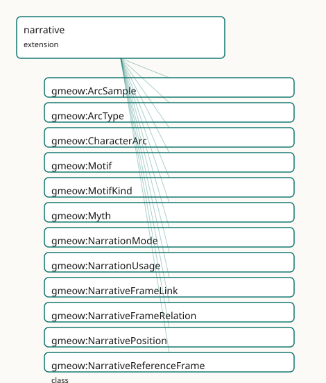

<!-- GENERATED by gmeow ontology-docs. DO NOT EDIT. Source hash: c99d8d50c0344040. -->

# GMEOW Narrative Module

- **IRI:** <https://blackcatinformatics.ca/gmeow/slices/narrative>
- **Tier:** extension
- **[`Group`](../reference/classes/gmeow-Group.md):** extensions

## What This Slice Covers

This slice owns 91 terms and contributes 6 mapping or projection rows. Use it when its terms match the native fact you want to preserve; use the linkage tables to see how those facts leave GMEOW for consumer vocabularies.

## Dependencies

- [`gmeow:slices/documents`](documents.md)
- [`gmeow:slices/events`](events.md)
- [`gmeow:slices/kernel`](kernel.md)
- [`gmeow:slices/observations`](observations.md)
- [`gmeow:slices/places`](places.md)
- [`gmeow:slices/provenance`](provenance.md)

## Consumers

- Narrative frames and myth tellings for the deception slice's worked examples and creative works. The narrative interior (arc samples ⊑ [`Observation`](../reference/classes/gmeow-Observation.md) over positions, scoped roles, motifs riding the seam) serves the lbox foundation-docs importer (EPIC: 16,445 arc samples, 779 role links, 16,002 tags / 669 concepts) ahead of the consumer child.

## Local Map

## Terms

### Classes

| Term | Label | Definition |
|---|---|---|
| [`gmeow:ArcSample`](../reference/classes/gmeow-ArcSample.md) | Arc Sample | One reading of a character's state at a narrative position — an observation: vantage = the analyzing model or critic, subject = the frame-scoped character, pos... |
| [`gmeow:ArcType`](../reference/classes/gmeow-ArcType.md) | Arc Type | The interpretive type of a character arc — a VALUE vocabulary (individuals, never subclasses). Coming-of-age, redemption, and fall are examples; the set is ope... |
| [`gmeow:CharacterArc`](../reference/classes/gmeow-CharacterArc.md) | Character Arc | A first-class interpretive/structural information object describing a character's trajectory through a narrative — a standpoint-scoped analysis, never canonica... |
| [`gmeow:Motif`](../reference/classes/gmeow-Motif.md) | Motif | An identity-bearing recurring narrative unit — a theme, leitmotif, symbol, running gag, tale type, or trope ('Melisande's Game', 'the Cassiline vow'). NOT a fo... |
| [`gmeow:MotifKind`](../reference/classes/gmeow-MotifKind.md) | Motif Kind | What sort of recurring unit a motif is — an OPEN value vocabulary: theme, leitmotif, symbol, running gag, tale type, trope. Never a tree ([Principle 9](https://github.com/Blackcat-Informatics/gmeow-ontology/blob/main/CONSTITUTION.md#principle-9)). |
| [`gmeow:Myth`](../reference/classes/gmeow-Myth.md) | Myth | A socially-sustained narrative whose currency is independent of its truth-value — a founding myth, an urban legend, a propaganda narrative, or a debunked claim... |
| [`gmeow:NarrationMode`](../reference/classes/gmeow-NarrationMode.md) | Narration Mode | HOW a segment carries its content — an OPEN value vocabulary (individuals, never subclasses) seeded with the diegetic-level ladder: narrated (direct), mentione... |
| [`gmeow:NarrationUsage`](../reference/classes/gmeow-NarrationUsage.md) | Narration Usage | The reified seam link — segment × narrated subject × mode, for when HOW the text carries the content matters: flashback, dream, hypothetical, unreliable narrat... |
| [`gmeow:NarrativeFrameLink`](../reference/classes/gmeow-NarrativeFrameLink.md) | Narrative Frame Link | A reified relator that binds a source narrative frame, a target narrative frame, and the relation type between them into a single node. The canonical form when... |
| [`gmeow:NarrativeFrameRelation`](../reference/classes/gmeow-NarrativeFrameRelation.md) | Narrative Frame Relation | The relationship of one narrative frame to another — a value vocabulary (individuals, never subclasses) spanning canon, alternate continuity, expanded universe... |
| [`gmeow:NarrativePosition`](../reference/classes/gmeow-NarrativePosition.md) | Narrative Position | A frame-relative position in a narrative — the narrative analogue of SpatialCoordinates. Carries its frame (mandatory: a position without a frame is the bare-i... |
| [`gmeow:NarrativeReferenceFrame`](../reference/classes/gmeow-NarrativeReferenceFrame.md) | Narrative Reference Frame | A canon, continuity, or narrative realm that serves as a reference frame for in-universe facts (locations, dates, events) and functionally as the standpoint un... |
| [`gmeow:NarrativeRole`](../reference/classes/gmeow-NarrativeRole.md) | Narrative Role | A character's narratological function — an OPEN value vocabulary (protagonist, antagonist, mentor, foil, narrator, confidant, love interest, trickster, …), Pro... |
| [`gmeow:NarrativeScope`](../reference/classes/gmeow-NarrativeScope.md) | Narrative Scope | The umbrella category of things a narrative role can be relative to — a creative work (protagonist of the trilogy), a narrative reference frame (protagonist of... |
| [`gmeow:NarrativeTimeAxis`](../reference/classes/gmeow-NarrativeTimeAxis.md) | Narrative Time Axis | The axis kind of a narrative time frame — a value vocabulary (individuals, never subclasses) of exactly two members: discourse time (syuzhet, the order of tell... |
| [`gmeow:NarrativeTimeFrame`](../reference/classes/gmeow-NarrativeTimeFrame.md) | Narrative Time Frame | A coordinate system for narrative position — the reference frame in which 'where in the story' is expressed. Exactly one axis kind per frame: discourse time (t... |
| [`gmeow:RoleInNarrative`](../reference/classes/gmeow-RoleInNarrative.md) | Role In Narrative | The reified, interpretive fact that a character bears a narratological role RELATIVE TO A SCOPE — protagonist of the trilogy, of one book, of one chapter are d... |

### Properties

| Term | Label | Definition |
|---|---|---|
| [`gmeow:affectedConsumerSurface`](../reference/properties/gmeow-affectedConsumerSurface.md) | affected consumer surface | The projection consumer surfaces that a myth tends to leak into — e.g. Wikipedia, public site, agent memory — so that a correction can be scoped to the surface... |
| [`gmeow:arcEvidence`](../reference/properties/gmeow-arcEvidence.md) | arc evidence | The creative works or content segments that provide evidence for this arc interpretation. Non-functional: an arc may be evidenced by many segments or works. |
| [`gmeow:arcFrame`](../reference/properties/gmeow-arcFrame.md) | arc frame | The narrative reference frame within which this arc is interpreted. Functional: one frame per CharacterArc; cross-continuity arcs are separate instances linked... |
| [`gmeow:arcSample`](../reference/properties/gmeow-arcSample.md) | arc sample | Attaches a sample to its integrating CharacterArc (⊑ [`gmeow:hasPart`](../reference/properties/gmeow-hasPart.md) — samples are parts of the arc's analysis). Purely ADDITIVE to the existing CharacterArc: ar... |
| [`gmeow:arcSubject`](../reference/properties/gmeow-arcSubject.md) | arc subject | The entity whose arc is described — a person, organization, or other narrative entity. Functional: one subject per CharacterArc. |
| [`gmeow:arcType`](../reference/properties/gmeow-arcType.md) | arc type | The interpretive type of this character arc — a value from the open [`gmeow:ArcType`](../reference/classes/gmeow-ArcType.md) vocabulary. Functional: one type per CharacterArc. |
| [`gmeow:atNarrativePosition`](../reference/properties/gmeow-atNarrativePosition.md) | at narrative position | Anchors a thing — a content segment, a diegetic event, an arc sample, a motif occurrence — to a narrative position. Domain-free: the narration seam, arc... |
| [`gmeow:contributesToFrame`](../reference/properties/gmeow-contributesToFrame.md) | contributes to frame | Relates a creative work or content segment to the narrative reference frame it contributes claims to. Broader than [`gmeow:sourceFor`](../reference/properties/gmeow-sourceFor.md): a segment may contribute to... |
| [`gmeow:developmentSignalEvent`](../reference/properties/gmeow-developmentSignalEvent.md) | development signal (event) | A diegetic event the analyzer cited for this reading — an ordinary [`gmeow:Event`](../reference/classes/gmeow-Event.md) claims-scoped accordingTo its narrative frame (existing doctrine), typically als... |
| [`gmeow:developmentSignalText`](../reference/properties/gmeow-developmentSignalText.md) | development signal (text) | Prose evidence the analyzer cited for this reading. NOT functional and range-open (localizable prose, the convention). |
| [`gmeow:discourseTimeOf`](../reference/properties/gmeow-discourseTimeOf.md) | discourse time of | Anchors a discourse-time frame to the creative work (expression or manifestation tier) whose telling order it coordinatizes. Functional: one frame, one telling... |
| [`gmeow:hasMythTelling`](../reference/properties/gmeow-hasMythTelling.md) | has myth telling | Relates a myth to its concrete tellings or expressions — a BookRelease, Article, MediaObject, social post, or other CreativeWork. Non-functional: co-equal tell... |
| [`gmeow:hasNarrativeFrameRelation`](../reference/properties/gmeow-hasNarrativeFrameRelation.md) | has narrative frame relation | The relationship(s) this narrative frame bears to another frame — canon, alternate continuity, expanded universe, fanon, crossover, adaptation. Non-functional:... |
| [`gmeow:hasNarrativeRole`](../reference/properties/gmeow-hasNarrativeRole.md) | has narrative role | Flat 80% shortcut: the character bears this role in their single obvious work. Domain intentionally open (frame-scoped characters are ordinary entities). Promo... |
| [`gmeow:motifKind`](../reference/properties/gmeow-motifKind.md) | motif kind | The motif's kind(s). NOT functional — readings coexist ([Principle 9](https://github.com/Blackcat-Informatics/gmeow-ontology/blob/main/CONSTITUTION.md#principle-9)). Open vocabulary (sh:nodeKind sh:IRI). |
| [`gmeow:motifOccursIn`](../reference/properties/gmeow-motifOccursIn.md) | motif occurs in | An occurrence of the motif in a carrying segment — the narration seam reused (⊑ [`gmeow:narratedIn`](../reference/properties/gmeow-narratedIn.md)), inheriting the efficiency discipline: flat by default,... |
| [`gmeow:mythFrame`](../reference/properties/gmeow-mythFrame.md) | myth frame | The narrative reference frame under which in-myth claims hold true. Functional: one frame per Myth. In-myth claims are scoped accordingTo this frame. |
| [`gmeow:narratedIn`](../reference/properties/gmeow-narratedIn.md) | narrated in | Flat 80% seam link, content-side orientation: the diegetic entity or event appears in the segment. The projection-friendly direction — Wikidata P1441 'present... |
| [`gmeow:narrates`](../reference/properties/gmeow-narrates.md) | narrates | Flat 80% seam link: the segment shows, narrates, or mentions the diegetic entity, event, or situation. Range intentionally open (entities, events, situations,... |
| [`gmeow:narrationLink`](../reference/properties/gmeow-narrationLink.md) | narration link | The abstract ancestor of the narration seam — any link between carrying text (an InformationObject side: segment, document, panel) and diegetic content (an ent... |
| [`gmeow:narrationMode`](../reference/properties/gmeow-narrationMode.md) | narration mode | The mode(s) of this narration usage. At least one (SHACL): if you reified, you had a reason. NOT functional: a flashback can also be a dream; coexisting critic... |
| [`gmeow:narrationSegment`](../reference/properties/gmeow-narrationSegment.md) | narration segment | The carrying segment. Functional and mandatory (SHACL). |
| [`gmeow:narrationSubject`](../reference/properties/gmeow-narrationSubject.md) | narration subject | The narrated diegetic entity, event, or situation. Range intentionally open (the narrates convention). Functional and mandatory (SHACL): one relator per (segme... |
| [`gmeow:narrativeFrameLinkRelation`](../reference/properties/gmeow-narrativeFrameLinkRelation.md) | narrative frame link relation | The relation type (canon, adaptation, crossover, etc.) that holds between the source and target frames in this link. Functional per relator: one relation type... |
| [`gmeow:narrativeFrameLinkSource`](../reference/properties/gmeow-narrativeFrameLinkSource.md) | narrative frame link source | The source narrative reference frame in a link. Functional per relator: one source per NarrativeFrameLink. |
| [`gmeow:narrativeFrameLinkTarget`](../reference/properties/gmeow-narrativeFrameLinkTarget.md) | narrative frame link target | The target narrative reference frame in a link. Functional per relator: one target per NarrativeFrameLink. |
| [`gmeow:narrativeRoleBearer`](../reference/properties/gmeow-narrativeRoleBearer.md) | narrative role bearer | The frame-scoped character bearing the role. Functional and mandatory (SHACL). |
| [`gmeow:narrativeRoleScope`](../reference/properties/gmeow-narrativeRoleScope.md) | narrative role scope | What the role is relative to — a CreativeWork, a NarrativeReferenceFrame, or a ContentSegment (grafted under NarrativeScope below). Functional and mandatory (S... |
| [`gmeow:narrativeRoleValue`](../reference/properties/gmeow-narrativeRoleValue.md) | narrative role value | The role borne. Functional: one relator, one role — a character who is both mentor and foil within one scope bears two relators. Open vocabulary (sh:nodeKind s... |
| [`gmeow:narrativeTimeAxis`](../reference/properties/gmeow-narrativeTimeAxis.md) | narrative time axis | The axis kind of this narrative time frame — discourse time or story time. Functional: a frame measures exactly one axis; a work and its fabula are two frames,... |
| [`gmeow:positionFrame`](../reference/properties/gmeow-positionFrame.md) | position frame | The narrative time frame in which this position is expressed. Functional and mandatory (SHACL): every narrative position names its frame. |
| [`gmeow:positionLabel`](../reference/properties/gmeow-positionLabel.md) | position label | A human-oriented label for this position — a chapter title ('Thirty-Three'), a named story moment ('the Longest Night'). Non-functional: co-equal labels coexis... |
| [`gmeow:positionOrdinal`](../reference/properties/gmeow-positionOrdinal.md) | position ordinal | The ordinal coordinate of this position within its frame — a chapter index, scene number, or fabula sequence number. Functional within one position; ordering s... |
| [`gmeow:propagatesFrom`](../reference/properties/gmeow-propagatesFrom.md) | propagates from | The propagation edge linking one myth telling to the telling it was derived from — reusing the [PROV-O](../external/ontologies.md#target-prov) lineage spine so myth-spread is not a parallel graph (Pri... |
| [`gmeow:recurringRisk`](../reference/properties/gmeow-recurringRisk.md) | recurring risk | A flag indicating that this myth or false claim is a repeat offender — agents and generated reports re-introduce it, so audit tooling can prioritise active cor... |
| [`gmeow:relatesToFrame`](../reference/properties/gmeow-relatesToFrame.md) | relates to frame | Relates a narrative reference frame to another narrative reference frame with which it stands in a relationship (the nature of which is given by gmeow:hasNarra... |
| [`gmeow:samplePosition`](../reference/properties/gmeow-samplePosition.md) | sample position | WHERE in the narrative this sample reads — a frame-carried NarrativePosition, never a bare index. Functional and mandatory (SHACL): a sample without a p... |
| [`gmeow:sampleState`](../reference/properties/gmeow-sampleState.md) | sample state | The read state, by IRI — an affect-slice EmotionType when that slice is loaded, an EmotionML category IRI, or another tradition's term (range intentionally ope... |
| [`gmeow:sampleSubject`](../reference/properties/gmeow-sampleSubject.md) | sample subject | The frame-scoped character (or other diegetic entity) this sample reads (⊑ observedFeature, the bridge idiom). Range intentionally open. Functional: one sa... |
| [`gmeow:sourceFor`](../reference/properties/gmeow-sourceFor.md) | source for | Relates a creative work (a BookRelease, SerialInstallment, film, game, or other out-of-universe artifact) to the narrative reference frame it contributes to, w... |
| [`gmeow:storyTimeOf`](../reference/properties/gmeow-storyTimeOf.md) | story time of | Anchors a story-time frame to the narrative reference frame (canon, continuity) whose in-universe chronology it coordinatizes. Functional: one anchoring per fr... |

### Individuals

| Term | Label | Definition |
|---|---|---|
| [`gmeow:arcTypeComingOfAge`](../reference/individuals/gmeow-arcTypeComingOfAge.md) | coming-of-age | A transition from childhood to maturity. |
| [`gmeow:arcTypeCorruption`](../reference/individuals/gmeow-arcTypeCorruption.md) | corruption | A moral or ethical degradation. |
| [`gmeow:arcTypeFall`](../reference/individuals/gmeow-arcTypeFall.md) | fall | A decline from a state of grace, power, or virtue. |
| [`gmeow:arcTypeQuest`](../reference/individuals/gmeow-arcTypeQuest.md) | quest | A journey toward a goal that transforms the protagonist. |
| [`gmeow:arcTypeRecovery`](../reference/individuals/gmeow-arcTypeRecovery.md) | recovery | A return to health, wholeness, or stability after loss. |
| [`gmeow:arcTypeRedemption`](../reference/individuals/gmeow-arcTypeRedemption.md) | redemption | A moral recovery or atonement for past failings. |
| [`gmeow:axisDiscourseTime`](../reference/individuals/gmeow-axisDiscourseTime.md) | discourse time (syuzhet) | The discourse-time axis — narrative position in the order of telling: chapter indices, scene ordinals, page positions. Owned by the telling work or expression;... |
| [`gmeow:axisStoryTime`](../reference/individuals/gmeow-axisStoryTime.md) | story time (fabula) | The story-time axis — narrative position in the order of happening in-universe: the fabula. Owned by a narrative reference frame; a continuity may reorder stor... |
| [`gmeow:motifKindLeitmotif`](../reference/individuals/gmeow-motifKindLeitmotif.md) | leitmotif | The leitmotif kind — a recurring associated figure (the musical sense lands with the music extension's analysis layer). |
| [`gmeow:motifKindRunningGag`](../reference/individuals/gmeow-motifKindRunningGag.md) | running gag | The running-gag motif kind. |
| [`gmeow:motifKindSymbol`](../reference/individuals/gmeow-motifKindSymbol.md) | symbol | The symbol motif kind — a recurring object or image standing for something. |
| [`gmeow:motifKindTaleType`](../reference/individuals/gmeow-motifKindTaleType.md) | tale type | The tale-type motif kind — an ATU-style whole-story pattern. |
| [`gmeow:motifKindTheme`](../reference/individuals/gmeow-motifKindTheme.md) | theme | The theme motif kind — a recurring idea or argument. |
| [`gmeow:motifKindTrope`](../reference/individuals/gmeow-motifKindTrope.md) | trope | The trope motif kind — a recognized convention (DBTropes anchors at alignment time). |
| [`gmeow:narrationDirect`](../reference/individuals/gmeow-narrationDirect.md) | narrated | The segment narrates the content directly, in the story's main register. |
| [`gmeow:narrationDream`](../reference/individuals/gmeow-narrationDream.md) | dream | The segment frames the content as a character's dream or vision — diegesis one level down. |
| [`gmeow:narrationFlashback`](../reference/individuals/gmeow-narrationFlashback.md) | flashback | The segment narrates content from earlier in story time than its discourse position — the two-axes disagreement made a mode. |
| [`gmeow:narrationHypothetical`](../reference/individuals/gmeow-narrationHypothetical.md) | hypothetical | The segment frames the content as possibility, counterfactual, or speculation within the story. |
| [`gmeow:narrationMentioned`](../reference/individuals/gmeow-narrationMentioned.md) | mentioned | The segment references the content without narrating it (reported, recalled, alluded to). |
| [`gmeow:narrationUnreliable`](../reference/individuals/gmeow-narrationUnreliable.md) | unreliable | The narrator's credibility for this content is in question — the seam's boundary with the deception module: narrator-level held ≠ projected, asserted by... |
| [`gmeow:relationAdaptationOf`](../reference/individuals/gmeow-relationAdaptationOf.md) | adaptation of | A narrative frame that adapts another frame into a different medium or format. |
| [`gmeow:relationAlternateContinuity`](../reference/individuals/gmeow-relationAlternateContinuity.md) | alternate continuity | A divergent continuity that is not the primary canon but is officially recognised (e.g. Marvel Ultimate, Star Wars Legends). |
| [`gmeow:relationCanon`](../reference/individuals/gmeow-relationCanon.md) | canon | The authoritative, settled continuity of a narrative frame. |
| [`gmeow:relationCrossover`](../reference/individuals/gmeow-relationCrossover.md) | crossover | A narrative frame that blends characters or settings from two or more distinct continuities. |
| [`gmeow:relationExpandedUniverse`](../reference/individuals/gmeow-relationExpandedUniverse.md) | expanded universe | Officially licensed material that extends the canon but is not part of the core continuity. |
| [`gmeow:relationFanon`](../reference/individuals/gmeow-relationFanon.md) | fanon | Community-generated continuity not officially recognised by the rights-holder. |
| [`gmeow:roleAntagonist`](../reference/individuals/gmeow-roleAntagonist.md) | antagonist | The antagonist role — opposed to a protagonist within the scope. |
| [`gmeow:roleConfidant`](../reference/individuals/gmeow-roleConfidant.md) | confidant | The confidant role. |
| [`gmeow:roleFoil`](../reference/individuals/gmeow-roleFoil.md) | foil | The foil role — a contrast figure for another character. |
| [`gmeow:roleLoveInterest`](../reference/individuals/gmeow-roleLoveInterest.md) | love interest | The love-interest role. |
| [`gmeow:roleMentor`](../reference/individuals/gmeow-roleMentor.md) | mentor | The mentor role. |
| [`gmeow:roleProtagonist`](../reference/individuals/gmeow-roleProtagonist.md) | protagonist | The protagonist role — a scope's central agent. Ensemble works carry several coexisting protagonist claims; no primary exists ([Principle 9](https://github.com/Blackcat-Informatics/gmeow-ontology/blob/main/CONSTITUTION.md#principle-9)). |
| [`gmeow:roleTrickster`](../reference/individuals/gmeow-roleTrickster.md) | trickster | The trickster role. |

## Linkages

- **Rows:** 6
- **Projection profiles:** -
- **External vocabularies:** `schema`, `wd`

| Source | Kind | Profile | Predicate/Relation | Target | Evidence |
|---|---|---|---|---|---|
| [`gmeow:Myth`](../reference/classes/gmeow-Myth.md) | equivalence | `-` | [skos:closeMatch](http://www.w3.org/2004/02/skos/core#closeMatch) | [wd:Q12827256](https://www.wikidata.org/wiki/Q12827256) | `gmeow-narrative.sssom.tsv`; `gmeow:eqNarrative011`; confidence 0.85 |
| [`gmeow:Myth`](../reference/classes/gmeow-Myth.md) | equivalence | `-` | [skos:closeMatch](http://www.w3.org/2004/02/skos/core#closeMatch) | [wd:Q159535](https://www.wikidata.org/wiki/Q159535) | `gmeow-narrative.sssom.tsv`; `gmeow:eqNarrative013`; confidence 0.75 |
| [`gmeow:Myth`](../reference/classes/gmeow-Myth.md) | equivalence | `-` | [skos:closeMatch](http://www.w3.org/2004/02/skos/core#closeMatch) | [wd:Q189349](https://www.wikidata.org/wiki/Q189349) | `gmeow-narrative.sssom.tsv`; `gmeow:eqNarrative012`; confidence 0.8 |
| [`gmeow:NarrativeReferenceFrame`](../reference/classes/gmeow-NarrativeReferenceFrame.md) | equivalence | `-` | [skos:closeMatch](http://www.w3.org/2004/02/skos/core#closeMatch) | [wd:Q15706943](https://www.wikidata.org/wiki/Q15706943) | `gmeow-narrative.sssom.tsv`; `gmeow:eqNarrative004`; confidence 0.8 |
| [`gmeow:NarrativeReferenceFrame`](../reference/classes/gmeow-NarrativeReferenceFrame.md) | equivalence | `-` | [skos:closeMatch](http://www.w3.org/2004/02/skos/core#closeMatch) | [wd:Q1774138](https://www.wikidata.org/wiki/Q1774138) | `gmeow-narrative.sssom.tsv`; `gmeow:eqNarrative003`; confidence 0.8 |
| [`gmeow:hasMythTelling`](../reference/properties/gmeow-hasMythTelling.md) | equivalence | `-` | [skos:relatedMatch](http://www.w3.org/2004/02/skos/core#relatedMatch) | [schema:CreativeWork](https://schema.org/CreativeWork) | `gmeow-narrative.sssom.tsv`; `gmeow:eqNarrative014`; confidence 0.7 |

## Guide

<!-- SPDX-FileCopyrightText: 2026 Blackcat Informatics® Inc. <paudley@blackcatinformatics.ca> -->
<!-- SPDX-License-Identifier: CC-BY-4.0 -->

# Narrative — canon as a reference frame, the text as a projection of the story

> **Slice:** `https://blackcatinformatics.ca/gmeow/slices/narrative` · **tier: extension**
> In-universe facts hold *[`accordingTo`](../reference/properties/gmeow-accordingTo.md)* a frame; the chapter sequence is the syuzhet projection of frame-relative story content.

A narrative is two things GMEOW keeps rigorously apart. A **canon** is a coordinate system:
locations, dates, and events inside the Harry Potter world, Earth-616, or the Star Wars
Legends split are positioned relative to a [`gmeow:NarrativeReferenceFrame`](../reference/classes/gmeow-NarrativeReferenceFrame.md), which is a
[`gmeow:ReferenceFrame`](../reference/classes/gmeow-ReferenceFrame.md) (the Location-as-reference-frame epic) living in the
[`gmeow:frameRealmNarrative`](../reference/individuals/gmeow-frameRealmNarrative.md) defined by the places slice. The frame *functionally serves* as
the standpoint under which in-universe claims hold true, without subclassing
[`gmeow:Standpoint`](../reference/classes/gmeow-Standpoint.md) — [gUFO](../external/ontologies.md#target-gufo)'s MixIden enforces exactly-one-Kind inheritance, so the frame
*is* the canon and [`gmeow:accordingTo`](../reference/properties/gmeow-accordingTo.md) does the standpoint work. Competing continuities are
separate frames that may sharpen one another; **no single canon wins** ([Principle 9](https://github.com/Blackcat-Informatics/gmeow-ontology/blob/main/CONSTITUTION.md#principle-9)), variants
are linked by [`gmeow:counterpartOf`](../reference/properties/gmeow-counterpartOf.md) and never merged ([Principle 5](https://github.com/Blackcat-Informatics/gmeow-ontology/blob/main/CONSTITUTION.md#principle-5)), and a retcon is a
frame-scoped claim revision preserved by [`gmeow:supersedes`](../reference/properties/gmeow-supersedes.md) + [`gmeow:displayable`](../reference/properties/gmeow-displayable.md) false
([Principle 10](https://github.com/Blackcat-Informatics/gmeow-ontology/blob/main/CONSTITUTION.md#principle-10)), never a deletion.

The second thing is the **text**, and the load-bearing doctrine of this slice is that **the
text is not the story**. A [`gmeow:CreativeWork`](../reference/classes/gmeow-CreativeWork.md) ([`BookRelease`](../reference/classes/gmeow-BookRelease.md), [`SerialInstallment`](../reference/classes/gmeow-SerialInstallment.md)) is an
out-of-universe, rights-bearing artifact that *sources, witnesses, or revises* a frame — it
is never the canon itself. Story content is frame-relative; the chapter sequence is a
*syuzhet projection* of it; the narration seam relates the two without confusing them; and
every interpretive reading — what the protagonist is, what a character felt in chapter 31,
whether a string is a motif — is a vantage-indexed claim coexisting with its rivals
([Principle 9](https://github.com/Blackcat-Informatics/gmeow-ontology/blob/main/CONSTITUTION.md#principle-9)). The sections below build that stance from frame to seam to interior.

## Frames, sourcing, and myth

### [`gmeow:NarrativeReferenceFrame`](../reference/classes/gmeow-NarrativeReferenceFrame.md)

The canon, continuity, or narrative realm — a [`gmeow:ReferenceFrame`](../reference/classes/gmeow-ReferenceFrame.md) SubKind that
coordinatizes in-universe locations, dates, and events and serves as the standpoint for
in-universe claims. Ordinary GMEOW entities ([`Person`](../reference/classes/gmeow-Person.md), [`Place`](../reference/classes/gmeow-Place.md), [`Event`](../reference/classes/gmeow-Event.md)) carry claims
[`gmeow:accordingTo`](../reference/properties/gmeow-accordingTo.md) it; cross-continuity variants link by [`gmeow:counterpartOf`](../reference/properties/gmeow-counterpartOf.md).

### [`gmeow:sourceFor`](../reference/properties/gmeow-sourceFor.md) · [`gmeow:NarrativeFrameLink`](../reference/classes/gmeow-NarrativeFrameLink.md)

[`gmeow:sourceFor`](../reference/properties/gmeow-sourceFor.md) (⊑ [`gmeow:contributesToFrame`](../reference/properties/gmeow-contributesToFrame.md)) relates a creative work to the frame it
sources, witnesses, or revises — the out-of-universe → in-universe edge. Frame-to-frame
relations (canon, alternate continuity, expanded universe, fanon, crossover, adaptation —
the open [`gmeow:NarrativeFrameRelation`](../reference/classes/gmeow-NarrativeFrameRelation.md) vocabulary) ride the flat shortcuts
[`gmeow:hasNarrativeFrameRelation`](../reference/properties/gmeow-hasNarrativeFrameRelation.md) / [`gmeow:relatesToFrame`](../reference/properties/gmeow-relatesToFrame.md); promote to the reified
[`gmeow:NarrativeFrameLink`](../reference/classes/gmeow-NarrativeFrameLink.md) (source × target × relation) when provenance, confidence, or scope
must be a node.

### [`gmeow:Myth`](../reference/classes/gmeow-Myth.md)

A socially-sustained narrative whose currency is independent of its truth-value — a founding
myth, an urban legend, a debunked claim that persists (Deception EPIC).
GMEOW asserts no truth verdict ([Principle 1](https://github.com/Blackcat-Informatics/gmeow-ontology/blob/main/CONSTITUTION.md#principle-1)); in-myth claims are scoped [`gmeow:accordingTo`](../reference/properties/gmeow-accordingTo.md)
the [`gmeow:mythFrame`](../reference/properties/gmeow-mythFrame.md). Tellings attach via [`gmeow:hasMythTelling`](../reference/properties/gmeow-hasMythTelling.md), spread along
[`gmeow:propagatesFrom`](../reference/properties/gmeow-propagatesFrom.md) (⊑ [`prov:wasDerivedFrom`](http://www.w3.org/ns/prov#wasDerivedFrom), reusing the lineage spine — [Principle 4](https://github.com/Blackcat-Informatics/gmeow-ontology/blob/main/CONSTITUTION.md#principle-4)),
and the propagating agent bears [`gmeow:roleDupe`](../reference/individuals/gmeow-roleDupe.md) or [`gmeow:roleDeceiver`](../reference/individuals/gmeow-roleDeceiver.md) (the deception
bridge).

## Narrative time (EPIC)

**The text is not the story: the chapter sequence is the syuzhet projection
of frame-relative story content.** Two kinds of [`NarrativeTimeFrame`](../reference/classes/gmeow-NarrativeTimeFrame.md) (each a
[`ReferenceFrame`](../reference/classes/gmeow-ReferenceFrame.md) under [`frameRealmNarrative`](../reference/individuals/gmeow-frameRealmNarrative.md)) coordinatize narrative
position:

- **discourse time** ([`axisDiscourseTime`](../reference/individuals/gmeow-axisDiscourseTime.md), syuzhet) — the order of telling;
 owned by the telling work via [`discourseTimeOf`](../reference/properties/gmeow-discourseTimeOf.md) (a re-segmented edition is
 a different frame);
- **story time** ([`axisStoryTime`](../reference/individuals/gmeow-axisStoryTime.md), fabula) — the order of happening
 in-universe; owned by a [`NarrativeReferenceFrame`](../reference/classes/gmeow-NarrativeReferenceFrame.md) via [`storyTimeOf`](../reference/properties/gmeow-storyTimeOf.md)
 (a continuity can reorder it — a retcon is a frame-scoped remapping,
 preserved by suppression).

### [`gmeow:NarrativePosition`](../reference/classes/gmeow-NarrativePosition.md)

[`NarrativePosition`](../reference/classes/gmeow-NarrativePosition.md) is the narrative analogue of [`SpatialCoordinates`](../reference/classes/gmeow-SpatialCoordinates.md):
frame (mandatory — no bare chapter indices), ordinal, label, or both.
[`atNarrativePosition`](../reference/properties/gmeow-atNarrativePosition.md) is the single domain-free anchor that the depiction
seam, arc samples, and motif occurrences all reuse —
deliberately non-functional, because one diegetic event holding positions in
*both* frames whose orders disagree **is** the flashback, queryable instead
of contradictory ([Principle 9](https://github.com/Blackcat-Informatics/gmeow-ontology/blob/main/CONSTITUTION.md#principle-9)).

In-universe Allen relations are claims [`accordingTo`](../reference/properties/gmeow-accordingTo.md) the narrative frame via
the statement layer, never global facts. Position comparison, ordering, and
discourse↔story reconciliation are solver-layer ([Principle 12](https://github.com/Blackcat-Informatics/gmeow-ontology/blob/main/CONSTITUTION.md#principle-12)). A reified
discourse↔story mapping construct is deliberately deferred to coordinate
with the music extension's [`TimeMapping`](../reference/classes/gmeow-TimeMapping.md) — one frame-mapping idiom in
the repo, not two.

## The narration seam (EPIC)

NOnt's reference function between text and story — neither mereology nor
participation: "chapter 31 *narrates* event E; character C is *narrated in*
segment S."

### [`gmeow:narrates`](../reference/properties/gmeow-narrates.md) · [`gmeow:narratedIn`](../reference/properties/gmeow-narratedIn.md)

- **Flat by default**: `narrates` (segment → diegetic content) and
 [`narratedIn`](../reference/properties/gmeow-narratedIn.md) (content → segment; Wikidata **P1441**'s edge — SSSOM row
 deferred to the alignment window), both ⊑ [`narrationLink`](../reference/properties/gmeow-narrationLink.md) (domain- and
 range-free ancestor for media-specific seams: panel, shot, verse).
 **No [`owl:inverseOf`](http://www.w3.org/2002/07/owl#inverseOf)** between the orientations — EL-clean; query both
 (the [`connectsTo`](../reference/properties/gmeow-connectsTo.md) convention).

### [`gmeow:NarrationUsage`](../reference/classes/gmeow-NarrationUsage.md) · [`gmeow:NarrationMode`](../reference/classes/gmeow-NarrationMode.md)

- **Reify with a reason**: [`NarrationUsage`](../reference/classes/gmeow-NarrationUsage.md) (the [`NameUsage`](../reference/classes/gmeow-NameUsage.md)/DepictionUsage
 idiom) = segment × subject × mode(s), SHACL-required mode — the modeless
 case is the flat shortcut. It pairs with the flat `narrates` via
 [`gmeow:pairsWith`](../reference/properties/gmeow-pairsWith.md). [`NarrationMode`](../reference/classes/gmeow-NarrationMode.md) is open: direct, mentioned,
 flashback (the two-axes disagreement as a mode), dream, hypothetical,
 unreliable (the boundary — narrator-level held ≠ projected;
 documented bridge, no axiom coupling).
- **Naming note**: [`gmeow:depicts`](../reference/properties/gmeow-depicts.md) belongs to the image spine
 ([`MediaObject`](../reference/classes/gmeow-MediaObject.md) → [`Entity`](../reference/classes/gmeow-Entity.md), ⊑ [`isAbout`](../reference/properties/gmeow-isAbout.md), documents module) and [`isAbout`](../reference/properties/gmeow-isAbout.md)'s
 [`Entity`](../reference/classes/gmeow-Entity.md) range cannot carry diegetic *events* (occurrents) — hence the
 separate, range-free narration family.
- **The efficiency doctrine, codified**: the foundation corpus carries
 38,413 character-segment links + 23,962 narrated events + 12,354
 appearances. Budget arithmetic: flat ≈ 1 quad/link; reified ≈ 6–8
 statements/link; full reification ≈ 1.5–2M statements for one corpus.
 Flat is the default; **silent full reification is a defect, not
 thoroughness**. The consumer child gates the flat/reified split
 against a declared budget.

Diegetic events stay ordinary [`gmeow:Event`](../reference/classes/gmeow-Event.md)s claims-scoped [`accordingTo`](../reference/properties/gmeow-accordingTo.md)
their frame; the events module's [`Participation`](../reference/classes/gmeow-Participation.md) machinery is reused untouched
for who-did-what *in* the story.

## The narrative interior (EPIC)

### [`gmeow:ArcSample`](../reference/classes/gmeow-ArcSample.md)

- **Arc samples ** — the music [`PitchTrajectory`](../reference/classes/gmeow-PitchTrajectory.md) move: an arc is
 sampled control points in a frame, not prose. [`ArcSample`](../reference/classes/gmeow-ArcSample.md) ⊑ [`Observation`](../reference/classes/gmeow-Observation.md)
 reads {subject × [`NarrativePosition`](../reference/classes/gmeow-NarrativePosition.md) × state-by-IRI × vantage};
 the state is a *soft* cross-slice reference (affect [`EmotionType`](../reference/classes/gmeow-EmotionType.md) when
 loaded, EmotionML category otherwise — IRI, never dependency, P16).
 The existing [`CharacterArc`](../reference/classes/gmeow-CharacterArc.md) is the integrating whole
 ([`arcSample`](../reference/properties/gmeow-arcSample.md) ⊑ [`hasPart`](../reference/properties/gmeow-hasPart.md), purely additive); two analyzers disagreeing at
 one position are two coexisting cells, surfaced — never resolved — by
 `narrative-arc-trajectory.rq` (the syuzhet-CSV primitive).

### [`gmeow:RoleInNarrative`](../reference/classes/gmeow-RoleInNarrative.md) · [`gmeow:hasNarrativeRole`](../reference/properties/gmeow-hasNarrativeRole.md)

- **Roles ** — a narratological role is a *function relative to a
 scope*, never a property of the character: [`RoleInNarrative`](../reference/classes/gmeow-RoleInNarrative.md) =
 bearer × [`NarrativeScope`](../reference/classes/gmeow-NarrativeScope.md) (named umbrella grafted over [`CreativeWork`](../reference/classes/gmeow-CreativeWork.md) /
 [`ContentSegment`](../reference/classes/gmeow-ContentSegment.md) / [`NarrativeReferenceFrame`](../reference/classes/gmeow-NarrativeReferenceFrame.md), extension-side — the
 [`Rule`](../reference/classes/gmeow-Rule.md) ⊑ [`Norm`](../reference/classes/gmeow-Norm.md) direction) × open [`NarrativeRole`](../reference/classes/gmeow-NarrativeRole.md) value. The flat shortcut
 [`hasNarrativeRole`](../reference/properties/gmeow-hasNarrativeRole.md) pairs with the relator via [`gmeow:pairsWith`](../reference/properties/gmeow-pairsWith.md).
 Protagonist of the trilogy, of one book, of one chapter are different
 claims; ensemble works carry coexisting protagonist relators and **no
 `primaryProtagonist` exists or ever will** (P9). Character-as-exemplar
 composes from the rubrics facility's [`exemplarSubject`](../reference/properties/gmeow-exemplarSubject.md) with zero new
 machinery.

### [`gmeow:Motif`](../reference/classes/gmeow-Motif.md) · [`gmeow:motifOccursIn`](../reference/properties/gmeow-motifOccursIn.md)

- **Motifs ** — thematic tags with *identity*: [`Motif`](../reference/classes/gmeow-Motif.md) ⊑ [`SocialObject`](../reference/classes/gmeow-SocialObject.md)
 with aliases (names module), an open [`MotifKind`](../reference/classes/gmeow-MotifKind.md), and occurrences riding
 the narration seam ([`motifOccursIn`](../reference/properties/gmeow-motifOccursIn.md) ⊑ [`narratedIn`](../reference/properties/gmeow-narratedIn.md), pairing with
 [`NarrationUsage`](../reference/classes/gmeow-NarrationUsage.md) via [`gmeow:pairsWith`](../reference/properties/gmeow-pairsWith.md) and inheriting the
 flat-by-default efficiency discipline). Cross-work identity goes through
 [`counterpartOf`](../reference/properties/gmeow-counterpartOf.md) or a registry anchor (Thompson [`Motif`](../reference/classes/gmeow-Motif.md) Index / ATU /
 DBTropes — alignment window), never string equality. **[`Tag`](../reference/classes/gmeow-Tag.md) vs [`Motif`](../reference/classes/gmeow-Motif.md)
 boundary**: tags are uncurated labels (tags module); promote to [`Motif`](../reference/classes/gmeow-Motif.md)
 when recurrence and identity emerge — the promotion is an [`Activity`](../reference/classes/gmeow-Activity.md) with
 provenance, and the corpus heuristic (concepts → always; thematic_tags →
 on recurrence + curator confirmation) gates in the consumer child.

## Solver layer & deferred alignment

Position comparison, discourse↔story reconciliation, arc-trajectory CSVs, and motif
recurrence analysis are all solver-layer ([Principle 12](https://github.com/Blackcat-Informatics/gmeow-ontology/blob/main/CONSTITUTION.md#principle-12)); the slice carries the frames,
positions, and seams those queries read. Alignment is by reference — Wikidata P1441 for the
narration seam, the Thompson [`Motif`](../reference/classes/gmeow-Motif.md) Index / ATU / DBTropes for motifs — with SSSOM rows and
the reified discourse↔story [`TimeMapping`](../reference/classes/gmeow-TimeMapping.md) (shared with the music extension) both
deferred to the alignment window so the repo grows one frame-mapping idiom, not two. No axiom
here references a deception-slice or norms-slice IRI: the unreliable-narration boundary and
the [`NarrativeScope`](../reference/classes/gmeow-NarrativeScope.md) graft are documented bridges and extension-side grafts (P16), never
core edits.

## Dependencies

Depends on `kernel`, `documents` ([`CreativeWork`](../reference/classes/gmeow-CreativeWork.md), [`ContentSegment`](../reference/classes/gmeow-ContentSegment.md), the image spine), `places`
([`ReferenceFrame`](../reference/classes/gmeow-ReferenceFrame.md) and [`gmeow:frameRealmNarrative`](../reference/individuals/gmeow-frameRealmNarrative.md)), `provenance` (the propagation spine),
`observations` ([`ArcSample`](../reference/classes/gmeow-ArcSample.md) ⊑ [`Observation`](../reference/classes/gmeow-Observation.md)), and `events` (diegetic events and [`Participation`](../reference/classes/gmeow-Participation.md)).
Consumed by the deception slice's worked examples and by the lbox foundation-docs importer
(EPIC: 16,445 arc samples, 779 role links, 16,002 tags / 669 concepts) ahead of the
consumer child.
