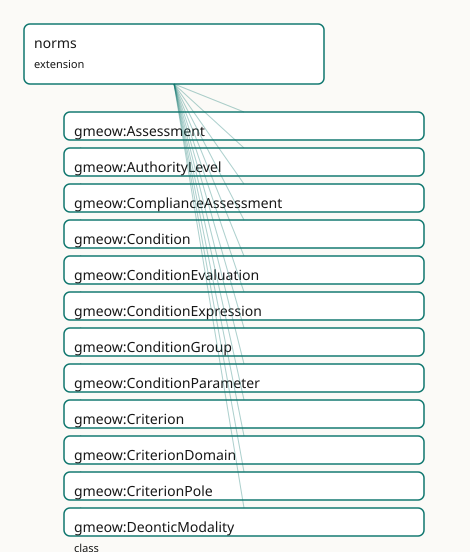

<!-- GENERATED by gmeow ontology-docs. DO NOT EDIT. -->

# GMEOW Norms Module

- **IRI:** <https://blackcatinformatics.ca/gmeow/slices/norms>
- **Tier:** extension
- **[`Group`](../reference/classes/gmeow-Group.md):** extensions

## What This Slice Covers

This slice owns 114 terms and contributes 5 mapping or projection rows. Use it when its terms match the native fact you want to preserve; use the linkage tables to see how those facts leave GMEOW for consumer vocabularies.

## Dependencies

- [`gmeow:slices/citations`](citations.md)
- [`gmeow:slices/documents`](documents.md)
- [`gmeow:slices/events`](events.md)
- [`gmeow:slices/kernel`](kernel.md)
- [`gmeow:slices/names`](names.md)
- [`gmeow:slices/observations`](observations.md)
- [`gmeow:slices/rights`](rights.md)
- [`gmeow:slices/standpoint`](standpoint.md)
- [`gmeow:slices/teleology`](teleology.md)
- [`gmeow:slices/temporal`](temporal.md)

## Consumers

- The lbox principia importer (EPIC: 4-tier authority hierarchy, special-directive triggers, paradigm precedence) and policy import/export (ODRL round-trip; OPA/Rego, Cedar, XACML down-projection — deferred to the compiler-arc window with the alignment set). The rubrics facility lives in this slice ([`Rubric`](../reference/classes/gmeow-Rubric.md) ⊑ [`Norm`](../reference/classes/gmeow-Norm.md); the P16 DAG rule bars extension→extension dependencies): consumers are the lm-eval-harness task projection, the principia RLAIF axes/score-anchor import, and LLM-judge score ingestion as vantage-indexed Assessments. The registers & personas facility also lives here ([`expressesNorm`](../reference/properties/gmeow-expressesNorm.md) → [`Norm`](../reference/classes/gmeow-Norm.md), [`activatedIn`](../reference/properties/gmeow-activatedIn.md) → [`Condition`](../reference/classes/gmeow-Condition.md); same P16 DAG rationale): consumers are system-prompt assembly ([`Persona`](../reference/classes/gmeow-Persona.md) × Norms × [`StyleGuide`](../reference/classes/gmeow-StyleGuide.md) — the projection that replaces principia.yaml's Jinja2 role, deferred to the compiler-arc window with the alignment set) and the principia persona_modes/paradigm-activation import.

## Local Map

## Terms

### Classes

| Term | Label | Definition |
|---|---|---|
| [`gmeow:Assessment`](../reference/classes/gmeow-Assessment.md) | Assessment | An observation that scores a target against a criterion (or whole rubric) — vantage = the judge, human or model: an LLM judge is just a vantage, and two models... |
| [`gmeow:AuthorityLevel`](../reference/classes/gmeow-AuthorityLevel.md) | Authority Level | The claimed authority grade of a norm within its issuing system — an ordered value vocabulary (absolute ≻ high ≻ medium ≻ conditional), the kernel GranularityL... |
| [`gmeow:ComplianceAssessment`](../reference/classes/gmeow-ComplianceAssessment.md) | Compliance Assessment | An observation that an event complied with or violated a norm — vantage = the assessor. The reified form of [`gmeow:violates`](../reference/properties/gmeow-violates.md) / [`gmeow:complies`](../reference/properties/gmeow-complies.md), for when who-judge... |
| [`gmeow:Condition`](../reference/classes/gmeow-Condition.md) | Condition | A describable circumstance — the trigger of a conditional norm, the activation context of a persona, the antecedent of a causal link. The canonic... |
| [`gmeow:ConditionEvaluation`](../reference/classes/gmeow-ConditionEvaluation.md) | Condition Evaluation | An observation that a condition held, did not hold, or could not be determined at some moment — vantage = the evaluator (an agent, a solver run, a model). The... |
| [`gmeow:ConditionExpression`](../reference/classes/gmeow-ConditionExpression.md) | Condition Expression | A machine formalization of a condition in a named expression language. STORED, NEVER EXECUTED: no CI step, test, or tool may evaluate a ConditionExpression aga... |
| [`gmeow:ConditionGroup`](../reference/classes/gmeow-ConditionGroup.md) | Condition Group | A composite condition — all-of, any-of, or none-of its members (arbitrary and/or/not trees by nesting groups). Requires an operator and at least two members (S... |
| [`gmeow:ConditionParameter`](../reference/classes/gmeow-ConditionParameter.md) | Condition Parameter | A named binding that instantiates a condition template — 'threshold = 0.8', 'jurisdiction = Canada'. Lets one Condition serve many norms with different binding... |
| [`gmeow:Criterion`](../reference/classes/gmeow-Criterion.md) | Criterion | One evaluative axis of a rubric — what is being judged, with NAMED poles: a reward pole and a penalty pole that are small information objects with their own la... |
| [`gmeow:CriterionDomain`](../reference/classes/gmeow-CriterionDomain.md) | Criterion Domain | The subject domain of a criterion — an OPEN value vocabulary (relational, factual, aesthetic, safety, stylistic, …). Open: evaluation traditions disagree about... |
| [`gmeow:CriterionPole`](../reference/classes/gmeow-CriterionPole.md) | Criterion Pole | A NAMED extreme of a criterion — a small information object carrying its own label and definition. Poles are content, not numbers: 'Power from the Bottom' name... |
| [`gmeow:DeonticModality`](../reference/classes/gmeow-DeonticModality.md) | Deontic Modality | The deontic force of a norm — an OPEN value vocabulary (individuals, never subclasses) seeded with obligation (must), prohibition (must not), permission (may),... |
| [`gmeow:EvaluationVerdict`](../reference/classes/gmeow-EvaluationVerdict.md) | Evaluation Verdict | The outcome of a condition evaluation — held, not held, or undetermined. A closed three-member value vocabulary. Semantically the observationResult of a Condit... |
| [`gmeow:Exemplar`](../reference/classes/gmeow-Exemplar.md) | Exemplar | A citation act that holds something up as an example — positively, negatively, or as a cautionary boundary case. Pins into the cited work via the citation Sele... |
| [`gmeow:ExemplarPolarity`](../reference/classes/gmeow-ExemplarPolarity.md) | Exemplar Polarity | The direction of an exemplar — a CLOSED three-member value vocabulary: positive (emulate this), negative (avoid this), cautionary (a boundary case that LOOKS p... |
| [`gmeow:ExpressionLanguage`](../reference/classes/gmeow-ExpressionLanguage.md) | Expression Language | The language of a condition expression — an OPEN value vocabulary seeded with the policy-engine and query languages GMEOW projects to: prose, SPARQL ASK, CEL,... |
| [`gmeow:GroupOperator`](../reference/classes/gmeow-GroupOperator.md) | Group Operator | The combination operator of a condition group — a closed three-member value vocabulary: all (conjunction), any (disjunction), none (negated disjunction). |
| [`gmeow:Norm`](../reference/classes/gmeow-Norm.md) | Norm | A prescription existing by social convention — an obligation, prohibition, permission, or recommendation issued by an agent or standpoint over some conduct. A... |
| [`gmeow:NormativeSystem`](../reference/classes/gmeow-NormativeSystem.md) | Normative System | A body of norms with a shared identity — a constitution, a legal code, a code of conduct, a principia document, a rubric set. Member norms attach via gmeow:par... |
| [`gmeow:Persona`](../reference/classes/gmeow-Persona.md) | Persona | A reified expression policy of one agent — the relator binding {bearer} × {register(s)} × {expressed norms} × {activation context}. PRIMARY and PRIVATE are two... |
| [`gmeow:PrecedenceTenure`](../reference/classes/gmeow-PrecedenceTenure.md) | Precedence Tenure | The reified, time-scoped fact that one norm took precedence over another within a normative system over an interval — 'Tier 2 overrode X until v3.5' made sayab... |
| [`gmeow:Rubric`](../reference/classes/gmeow-Rubric.md) | Rubric | A norm for judging — a reified evaluation framework whose criteria, poles, scales, and anchors are first-class content. Being a Norm, a rubric names its issuer... |
| [`gmeow:ScoreAnchor`](../reference/classes/gmeow-ScoreAnchor.md) | Score Anchor | A pinned score range with its meaning and exemplars — 'range 0.8–1.0 means the text embodies the covenant, as in THIS passage'. Anchors are the rubric's calibr... |
| [`gmeow:ScoreScale`](../reference/classes/gmeow-ScoreScale.md) | Score Scale | A numeric scale for assessments — minimum, maximum, optional step. Scale arithmetic (normalization, conversion between scales) is solver work ([Principle 12](https://github.com/Blackcat-Informatics/gmeow-ontology/blob/main/CONSTITUTION.md#principle-12)). |
| [`gmeow:StyleGuide`](../reference/classes/gmeow-StyleGuide.md) | Style Guide | The voice payload of a persona or register — prose whose REGISTER IS THE CONTENT. The prose-voice doctrine (EPIC gap analysis): voice documents attach byt... |

### Properties

| Term | Label | Definition |
|---|---|---|
| [`gmeow:activatedIn`](../reference/properties/gmeow-activatedIn.md) | activated in | The context that activates this persona — a [`gmeow:Condition`](../reference/classes/gmeow-Condition.md) (the norms machinery: prose-canonical, optionally formalized, evaluated only as vantage-indexed Con... |
| [`gmeow:anchorExemplar`](../reference/properties/gmeow-anchorExemplar.md) | anchor exemplar | An exemplar pinned to this anchor's range. NOT functional: several exemplars may calibrate one range. |
| [`gmeow:anchorMeaning`](../reference/properties/gmeow-anchorMeaning.md) | anchor meaning | What scores in this range MEAN — the calibration prose. NOT functional and range-open (review): localizable prose may carry one meaning per language ta... |
| [`gmeow:anchorRangeMax`](../reference/properties/gmeow-anchorRangeMax.md) | anchor range maximum | The anchored range's upper bound. Functional. |
| [`gmeow:anchorRangeMin`](../reference/properties/gmeow-anchorRangeMin.md) | anchor range minimum | The anchored range's lower bound. Functional; must not exceed the upper bound (SHACL). |
| [`gmeow:assessedEvent`](../reference/properties/gmeow-assessedEvent.md) | assessed event | The event whose compliance is assessed (⊑ observedFeature). Functional. |
| [`gmeow:assessedNorm`](../reference/properties/gmeow-assessedNorm.md) | assessed norm | The norm against which the event is assessed. Functional: one assessment, one norm. |
| [`gmeow:assessmentCriterion`](../reference/properties/gmeow-assessmentCriterion.md) | assessment criterion | The criterion applied. Functional: a 21-axis scoring pass is 21 Assessments (zeros included — a zero is a score, not an absence). Plays the observationMethod r... |
| [`gmeow:assessmentRubric`](../reference/properties/gmeow-assessmentRubric.md) | assessment rubric | The rubric under which this assessment was made — version-pinning context for the score. Functional. Plays the observationMethod role without the subproperty a... |
| [`gmeow:assessmentScoreValue`](../reference/properties/gmeow-assessmentScoreValue.md) | assessment score value | The numeric score, on the scale the criterion or rubric declares. Functional and mandatory (SHACL). A datatype twin of observationResult (which is entity-value... |
| [`gmeow:assessmentTarget`](../reference/properties/gmeow-assessmentTarget.md) | assessment target | What is being scored — a work, an expression, a content segment, a chunk (⊑ observedFeature, the bridge idiom). Range intentionally open. Functional: one a... |
| [`gmeow:complianceVerdict`](../reference/properties/gmeow-complianceVerdict.md) | compliance verdict | The assessor's verdict, reusing the EvaluationVerdict vocabulary: held = compliant, not held = violative, undetermined = undetermined. Functional and mandatory... |
| [`gmeow:complies`](../reference/properties/gmeow-complies.md) | complies with | Flat shortcut: the event complies with the norm — according to whoever asserts it. The positive twin of [`gmeow:violates`](../reference/properties/gmeow-violates.md); same promotion path, same never-entaile... |
| [`gmeow:conditionParameter`](../reference/properties/gmeow-conditionParameter.md) | condition parameter | A parameter binding of this condition. NOT functional. |
| [`gmeow:conditionText`](../reference/properties/gmeow-conditionText.md) | condition text | The natural-language statement of the condition — the canonical form, always present (SHACL). Formalizations approximate the prose, not the other way around. |
| [`gmeow:criterionDomain`](../reference/properties/gmeow-criterionDomain.md) | criterion domain | The subject domain(s) of this criterion. NOT functional: a criterion may span domains, and classifications coexist ([Principle 9](https://github.com/Blackcat-Informatics/gmeow-ontology/blob/main/CONSTITUTION.md#principle-9)). |
| [`gmeow:deonticModality`](../reference/properties/gmeow-deonticModality.md) | deontic modality | The deontic force of this norm. Functional: one norm, one force — a rule that both permits and obliges is two norms. A norm carrying a modality must also carry... |
| [`gmeow:evaluatedCondition`](../reference/properties/gmeow-evaluatedCondition.md) | evaluated condition | The condition this evaluation reports on (⊑ observedFeature — the bridge idiom). Functional: one evaluation, one condition; group members get their own eva... |
| [`gmeow:evaluationVerdict`](../reference/properties/gmeow-evaluationVerdict.md) | evaluation verdict | The verdict of this evaluation. Functional and mandatory (SHACL). The claimModality pattern: equivalent in role to observationResult, separate in axiom because... |
| [`gmeow:exemplarPolarity`](../reference/properties/gmeow-exemplarPolarity.md) | exemplar polarity | The exemplar's direction. Functional and mandatory (SHACL): an exemplar that cannot say whether to emulate or avoid is just a citation. |
| [`gmeow:exemplarRationale`](../reference/properties/gmeow-exemplarRationale.md) | exemplar rationale | Why this is an exemplar — the judgement prose. NOT functional and range-open (review): localizable, one rationale per language tag; whose judgement it... |
| [`gmeow:exemplarRedirect`](../reference/properties/gmeow-exemplarRedirect.md) | redirects to | For cautionary exemplars: the criterion this passage ACTUALLY evidences — 'clinical trust frameworks belong to polymath competence, not the covenant'. NOT func... |
| [`gmeow:exemplarSubject`](../reference/properties/gmeow-exemplarSubject.md) | exemplar subject | The entity whose pattern the exemplar evidences — a frame-scoped character whose conduct across the cited work is the example (EPIC: 823 such links in the... |
| [`gmeow:expressesNorm`](../reference/properties/gmeow-expressesNorm.md) | expresses norm | A norm this persona expresses — the 'same principia, different registers' invariant made queryable: whether all personas of one agent express the same authorit... |
| [`gmeow:expressionLanguage`](../reference/properties/gmeow-expressionLanguage.md) | expression language | The language of this expression. Functional and mandatory (SHACL). |
| [`gmeow:expressionText`](../reference/properties/gmeow-expressionText.md) | expression text | The expression source, verbatim, in the named language. Functional and mandatory (SHACL). |
| [`gmeow:formalizedAs`](../reference/properties/gmeow-formalizedAs.md) | formalized as | Attaches a machine formalization to a condition. NOT functional: one condition, several formalizations (one per engine), each a separate equivalence claim with... |
| [`gmeow:groupMember`](../reference/properties/gmeow-groupMember.md) | group member | A member condition of this group. At least two (SHACL); nest groups for arbitrary trees. |
| [`gmeow:groupOperator`](../reference/properties/gmeow-groupOperator.md) | group operator | The combination operator of this group. Functional and mandatory (SHACL). |
| [`gmeow:hasAuthorityLevel`](../reference/properties/gmeow-hasAuthorityLevel.md) | has authority level | The authority grade an issuing system claims for this norm. NOT functional: in a multi-source merge, sources may grade the same norm differently, and those cla... |
| [`gmeow:hasCriterion`](../reference/properties/gmeow-hasCriterion.md) | has criterion | Relates a rubric to one of its evaluative axes (⊑ [`gmeow:hasPart`](../reference/properties/gmeow-hasPart.md) — criteria are parts of the framework). NOT functional: rubrics are multi-axis by design. |
| [`gmeow:hasScoreAnchor`](../reference/properties/gmeow-hasScoreAnchor.md) | has score anchor | Relates a criterion to one of its calibration anchors. NOT functional: high / medium / low anchors coexist. |
| [`gmeow:normBearer`](../reference/properties/gmeow-normBearer.md) | norm bearer | An agent the norm binds. NOT functional: a norm may bind several named bearers. ABSENT means the norm binds everyone in its issuer's scope — the gmeow:ruleAssi... |
| [`gmeow:normCondition`](../reference/properties/gmeow-normCondition.md) | norm condition | The condition under which this norm applies. NOT functional: several conditions on one norm are an implicit conjunction; use a [`gmeow:ConditionGroup`](../reference/classes/gmeow-ConditionGroup.md) when the co... |
| [`gmeow:normIssuer`](../reference/properties/gmeow-normIssuer.md) | norm issuer | The agent or standpoint according to which this norm holds — the constitutional keystone: there is no ought, only ought-according-to. DOMAIN-FREE on purpose: g... |
| [`gmeow:overrides`](../reference/properties/gmeow-overrides.md) | overrides | Pairwise defeasible precedence: when both norms apply, the subject prevails over the object — according to whoever asserts this claim (statement-layer indexed... |
| [`gmeow:parameterEntity`](../reference/properties/gmeow-parameterEntity.md) | parameter entity | The bound entity for IRI-valued bindings. Range intentionally open. A parameter carries exactly one of parameterValue / parameterEntity (SHACL). |
| [`gmeow:parameterName`](../reference/properties/gmeow-parameterName.md) | parameter name | The parameter's name as used in the condition text or expressions. Functional and mandatory (SHACL). |
| [`gmeow:parameterValue`](../reference/properties/gmeow-parameterValue.md) | parameter value | The bound literal value. Use [`gmeow:parameterEntity`](../reference/properties/gmeow-parameterEntity.md) for IRI-valued bindings; a parameter carries exactly one of the two (SHACL). |
| [`gmeow:penaltyPole`](../reference/properties/gmeow-penaltyPole.md) | penalty pole | The named pole this criterion penalizes. Functional and mandatory (SHACL — no poles is no axis); must differ from the reward pole (SHACL). |
| [`gmeow:personaBearer`](../reference/properties/gmeow-personaBearer.md) | persona bearer | The agent whose expression policy this persona is. Functional and mandatory (SHACL): one persona, one bearer; an agent bears many co-equal personas. |
| [`gmeow:personaRegister`](../reference/properties/gmeow-personaRegister.md) | persona register | A register this persona expresses in — drawn from the names-core [`gmeow:Register`](../reference/classes/gmeow-Register.md) spine (a name register IS a register; persona and address registers share one v... |
| [`gmeow:precedenceHigher`](../reference/properties/gmeow-precedenceHigher.md) | precedence higher | The norm that prevails during this tenure. Functional. |
| [`gmeow:precedenceLower`](../reference/properties/gmeow-precedenceLower.md) | precedence lower | The norm that yields during this tenure. Functional, and distinct from precedenceHigher (SHACL). |
| [`gmeow:precedenceScope`](../reference/properties/gmeow-precedenceScope.md) | precedence scope | The normative system within which this precedence holds. Functional and mandatory (SHACL): precedence is always scoped — a system orders its own norms; it cann... |
| [`gmeow:prescribedConduct`](../reference/properties/gmeow-prescribedConduct.md) | prescribed conduct | The conduct the norm is about — an event type, a goal, a situation, or a rights action (via the graft). The range is intentionally open (the tenure... |
| [`gmeow:rewardPole`](../reference/properties/gmeow-rewardPole.md) | reward pole | The named pole this criterion rewards. Functional and mandatory (SHACL — no poles is no axis); must differ from the penalty pole (SHACL). |
| [`gmeow:scaleMax`](../reference/properties/gmeow-scaleMax.md) | scale maximum | The scale's maximum value. Functional and mandatory; must exceed the minimum (SHACL). |
| [`gmeow:scaleMin`](../reference/properties/gmeow-scaleMin.md) | scale minimum | The scale's minimum value. Functional and mandatory; must be below the maximum (SHACL). |
| [`gmeow:scaleStep`](../reference/properties/gmeow-scaleStep.md) | scale step | The scale's granularity step, when discrete. Optional; absent means continuous. |
| [`gmeow:strongerThan`](../reference/properties/gmeow-strongerThan.md) | stronger than | Orders authority levels: the subject level carries more claimed authority than the object level. Transitive ON LEVELS ONLY (the [`gmeow:coarserThan`](../reference/properties/gmeow-coarserThan.md) pattern) — no... |
| [`gmeow:styleGuideFor`](../reference/properties/gmeow-styleGuideFor.md) | style guide for | What this guide voices — a [`gmeow:Persona`](../reference/classes/gmeow-Persona.md) or a [`gmeow:Register`](../reference/classes/gmeow-Register.md) value. Range intentionally open across the two. NOT functional (one guide may voice a persona and... |
| [`gmeow:systemIssuer`](../reference/properties/gmeow-systemIssuer.md) | system issuer | The agent or standpoint that issues a normative system as a whole. ⊑ normIssuer: issuing the system is issuing its stance. Member norms may still carry their o... |
| [`gmeow:usesScale`](../reference/properties/gmeow-usesScale.md) | uses scale | The score scale a rubric or criterion uses. Domain-free (rubric-level default, criterion-level override — the holder is whatever points here); functional: one... |
| [`gmeow:violates`](../reference/properties/gmeow-violates.md) | violates | Flat shortcut: the event violates the norm — according to whoever asserts it (statement-layer indexed). Promote to a [`gmeow:ComplianceAssessment`](../reference/classes/gmeow-ComplianceAssessment.md) when the assess... |

### Individuals

| Term | Label | Definition |
|---|---|---|
| [`gmeow:authorityAbsolute`](../reference/individuals/gmeow-authorityAbsolute.md) | absolute | The absolute authority level — the issuing system claims this norm overrides all others it issues. |
| [`gmeow:authorityConditional`](../reference/individuals/gmeow-authorityConditional.md) | conditional | The conditional authority level — authority contingent on an activation condition. |
| [`gmeow:authorityHigh`](../reference/individuals/gmeow-authorityHigh.md) | high | The high authority level. |
| [`gmeow:authorityMedium`](../reference/individuals/gmeow-authorityMedium.md) | medium | The medium authority level. |
| [`gmeow:criterionDomainAesthetic`](../reference/individuals/gmeow-criterionDomainAesthetic.md) | aesthetic | The criterion evaluates aesthetic or expressive qualities. |
| [`gmeow:criterionDomainFactual`](../reference/individuals/gmeow-criterionDomainFactual.md) | factual | The criterion evaluates factual accuracy or groundedness. |
| [`gmeow:criterionDomainRelational`](../reference/individuals/gmeow-criterionDomainRelational.md) | relational | The criterion evaluates relational or interpersonal qualities. |
| [`gmeow:criterionDomainSafety`](../reference/individuals/gmeow-criterionDomainSafety.md) | safety | The criterion evaluates safety properties or harm avoidance. |
| [`gmeow:criterionDomainStylistic`](../reference/individuals/gmeow-criterionDomainStylistic.md) | stylistic | The criterion evaluates style, register, or voice. |
| [`gmeow:deonticObligation`](../reference/individuals/gmeow-deonticObligation.md) | obligation (must) | The obligation modality — the issuer requires the conduct. |
| [`gmeow:deonticPermission`](../reference/individuals/gmeow-deonticPermission.md) | permission (may) | The permission modality — the issuer allows the conduct. |
| [`gmeow:deonticProhibition`](../reference/individuals/gmeow-deonticProhibition.md) | prohibition (must not) | The prohibition modality — the issuer forbids the conduct. |
| [`gmeow:deonticRecommendation`](../reference/individuals/gmeow-deonticRecommendation.md) | recommendation (should) | The recommendation modality — the issuer advises the conduct without requiring it. |
| [`gmeow:exprLangCedar`](../reference/individuals/gmeow-exprLangCedar.md) | Cedar | The Cedar authorization policy language. |
| [`gmeow:exprLangCel`](../reference/individuals/gmeow-exprLangCel.md) | CEL | Common Expression Language. |
| [`gmeow:exprLangProse`](../reference/individuals/gmeow-exprLangProse.md) | prose | Natural-language restatement (a translation, not a formalization). |
| [`gmeow:exprLangRego`](../reference/individuals/gmeow-exprLangRego.md) | Rego (OPA) | Open Policy Agent's Rego policy language. |
| [`gmeow:exprLangShacl`](../reference/individuals/gmeow-exprLangShacl.md) | SHACL | A SHACL shapes graph used as a condition formalization. Carried as data like every other expression — never loaded into the validation harness ([Principle 12](https://github.com/Blackcat-Informatics/gmeow-ontology/blob/main/CONSTITUTION.md#principle-12)). |
| [`gmeow:exprLangSparqlAsk`](../reference/individuals/gmeow-exprLangSparqlAsk.md) | SPARQL ASK | A SPARQL ASK query. |
| [`gmeow:exprLangXacml`](../reference/individuals/gmeow-exprLangXacml.md) | XACML | OASIS XACML policy XML. |
| [`gmeow:operatorAll`](../reference/individuals/gmeow-operatorAll.md) | all of (and) | The conjunction operator — the group holds when every member holds. |
| [`gmeow:operatorAny`](../reference/individuals/gmeow-operatorAny.md) | any of (or) | The disjunction operator — the group holds when at least one member holds. |
| [`gmeow:operatorNone`](../reference/individuals/gmeow-operatorNone.md) | none of (not) | The negation operator — the group holds when no member holds. |
| [`gmeow:polarityCautionary`](../reference/individuals/gmeow-polarityCautionary.md) | cautionary | A boundary case — superficially like the reward pole but warning or redirecting (the anti-pattern with a correct-criterion redirect). |
| [`gmeow:polarityNegative`](../reference/individuals/gmeow-polarityNegative.md) | negative | An exemplar to avoid. |
| [`gmeow:polarityPositive`](../reference/individuals/gmeow-polarityPositive.md) | positive | An exemplar to emulate. |
| [`gmeow:registerBrandVoice`](../reference/individuals/gmeow-registerBrandVoice.md) | brand voice | The brand-voice register — an organization's curated public expression identity. |
| [`gmeow:registerCeremonial`](../reference/individuals/gmeow-registerCeremonial.md) | ceremonial | The ceremonial register — ritual, liturgical, or protocol-bound expression. |
| [`gmeow:registerClinical`](../reference/individuals/gmeow-registerClinical.md) | clinical | The clinical register — professional, affect-controlled expression (bedside manner, counsel). |
| [`gmeow:registerPrivate`](../reference/individuals/gmeow-registerPrivate.md) | private | The private register — expression within a trusted inner scope. |
| [`gmeow:registerPublic`](../reference/individuals/gmeow-registerPublic.md) | public | The public register — expression toward an undifferentiated or hostile audience. |
| [`gmeow:verdictHeld`](../reference/individuals/gmeow-verdictHeld.md) | held | The evaluator found the condition to hold. |
| [`gmeow:verdictNotHeld`](../reference/individuals/gmeow-verdictNotHeld.md) | not held | The evaluator found the condition not to hold. |
| [`gmeow:verdictUndetermined`](../reference/individuals/gmeow-verdictUndetermined.md) | undetermined | The evaluator could not determine whether the condition held. |

## Linkages

- **Rows:** 5
- **Projection profiles:** `schema-org`
- **External vocabularies:** `rdf`, `schema`

| Source | Kind | Profile | Predicate/Relation | Target | Evidence |
|---|---|---|---|---|---|
| [`gmeow:assessmentScoreValue`](../reference/properties/gmeow-assessmentScoreValue.md) | equivalence | `-` | [skos:closeMatch](http://www.w3.org/2004/02/skos/core#closeMatch) | [schema:ratingValue](https://schema.org/ratingValue) | `gmeow-norms.sssom.tsv`; `gmeow:eqNorms002`; confidence 0.85 |
| [`gmeow:assessmentTarget`](../reference/properties/gmeow-assessmentTarget.md) | equivalence | `-` | [skos:closeMatch](http://www.w3.org/2004/02/skos/core#closeMatch) | [schema:itemReviewed](https://schema.org/itemReviewed) | `gmeow-norms.sssom.tsv`; `gmeow:eqNorms001`; confidence 0.85 |
| [`gmeow:Assessment`](../reference/classes/gmeow-Assessment.md) | projection | `schema-org` | projects to / <= | [rdf:type](http://www.w3.org/1999/02/22-rdf-syntax-ns#type), [schema:ClaimReview](https://schema.org/ClaimReview), [schema:Rating](https://schema.org/Rating), [schema:author](https://schema.org/author), [schema:itemReviewed](https://schema.org/itemReviewed), [schema:ratingValue](https://schema.org/ratingValue), [schema:reviewRating](https://schema.org/reviewRating) | `gmeow:mapSchemaClaimReview`; confidence 0.85; lossy: the criterion/rubric structure and scale metadata collapse to a bare ratingValue; each review stays authored by its vantage — N competing assessments emit N coexisting ClaimReviews, never one aggregated rating (P9) |
| [`gmeow:assessmentScoreValue`](../reference/properties/gmeow-assessmentScoreValue.md) | projection | `schema-org` | projects to / <= | [rdf:type](http://www.w3.org/1999/02/22-rdf-syntax-ns#type), [schema:ClaimReview](https://schema.org/ClaimReview), [schema:Rating](https://schema.org/Rating), [schema:author](https://schema.org/author), [schema:itemReviewed](https://schema.org/itemReviewed), [schema:ratingValue](https://schema.org/ratingValue), [schema:reviewRating](https://schema.org/reviewRating) | `gmeow:mapSchemaClaimReview`; confidence 0.85; lossy: the criterion/rubric structure and scale metadata collapse to a bare ratingValue; each review stays authored by its vantage — N competing assessments emit N coexisting ClaimReviews, never one aggregated rating (P9) |
| [`gmeow:assessmentTarget`](../reference/properties/gmeow-assessmentTarget.md) | projection | `schema-org` | projects to / <= | [rdf:type](http://www.w3.org/1999/02/22-rdf-syntax-ns#type), [schema:ClaimReview](https://schema.org/ClaimReview), [schema:Rating](https://schema.org/Rating), [schema:author](https://schema.org/author), [schema:itemReviewed](https://schema.org/itemReviewed), [schema:ratingValue](https://schema.org/ratingValue), [schema:reviewRating](https://schema.org/reviewRating) | `gmeow:mapSchemaClaimReview`; confidence 0.85; lossy: the criterion/rubric structure and scale metadata collapse to a bare ratingValue; each review stays authored by its vantage — N competing assessments emit N coexisting ClaimReviews, never one aggregated rating (P9) |

## Guide

<!-- SPDX-FileCopyrightText: 2026 Blackcat Informatics® Inc. <paudley@blackcatinformatics.ca> -->
<!-- SPDX-License-Identifier: CC-BY-4.0 -->

# norms

> **Slice:** `https://blackcatinformatics.ca/gmeow/slices/norms` · **tier: extension**

Generalized deontics with indexed authority plus the rights graft
 — the constitutional keystone of the normative stack (EPIC).

**Grounding note:** [`Norm`](../reference/classes/gmeow-Norm.md) is a [`gufo:Category`](../external/terms.md#gufo-category) at [`Entity`](../reference/classes/gmeow-Entity.md) level (the
[`IntentionalMoment`](../reference/classes/gmeow-IntentionalMoment.md) precedent), not a Kind under [`SocialObject`](../reference/classes/gmeow-SocialObject.md) — the graft
places [`Rule`](../reference/classes/gmeow-Rule.md) ⊑ [`gufo:Relator`](../external/terms.md#gufo-relator) beneath it, plain norms are object-like, and
[`gufo:Object ⟂ gufo:Aspect`](http://purl.org/nemo/gufo#Object ⟂ gufo:Aspect) forbids committing the umbrella to either realm;
a Kind would stack identities under the rights trio (the MixIden gate caught
exactly this during development). The social-convention reading lives on the
concrete classes: [`NormativeSystem`](../reference/classes/gmeow-NormativeSystem.md) ⊑ [`SocialObject`](../reference/classes/gmeow-SocialObject.md), the trio `⊑ Relator`.

## There is no ought, only ought-according-to

Every modality-bearing [`Norm`](../reference/classes/gmeow-Norm.md) names its [`normIssuer`](../reference/properties/gmeow-normIssuer.md) (SHACL-enforced — an
anonymous ought is the deontic analogue of a global truth axiom). Issuers are
agents or standpoints; [`normIssuer`](../reference/properties/gmeow-normIssuer.md) ⊑ [`accordingTo`](../reference/properties/gmeow-accordingTo.md) is **documented, not
axiomatised** ([`accordingTo`](../reference/properties/gmeow-accordingTo.md) is an AnnotationProperty — the `vantage`
precedent). Two contradictory normative systems coexist without
inconsistency: GMEOW records what each prescribes and never adjudicates.
This is the deception module's held/projected move, applied to oughts.

## Precedence is data, not semantics

- [`AuthorityLevel`](../reference/classes/gmeow-AuthorityLevel.md) — ordered vocab (absolute ≻ high ≻ medium ≻ conditional),
 the kernel [`GranularityLevel`](../reference/classes/gmeow-GranularityLevel.md) pattern; [`strongerThan`](../reference/properties/gmeow-strongerThan.md) is transitive **on
 levels only**.
- `overrides` — pairwise, **deliberately not transitive**, SHACL-irreflexive.
 Lex-superior chains, specificity, and cycle handling are solver work over
 recorded pairs (P12).
- [`PrecedenceTenure`](../reference/classes/gmeow-PrecedenceTenure.md) — the [`StandpointTenure`](../reference/classes/gmeow-StandpointTenure.md) idiom: higher × lower × scope
 (a [`NormativeSystem`](../reference/classes/gmeow-NormativeSystem.md), mandatory — precedence is always scoped) ×
 [`duringInterval`](../reference/properties/gmeow-duringInterval.md). "Tier 2 overrode X until v3.5," withdrawable by
 suppression only (P10).

## Conditions: stored, composed, formalized, evaluated — never executed

[`Condition`](../reference/classes/gmeow-Condition.md) is prose-canonical ([`conditionText`](../reference/properties/gmeow-conditionText.md) mandatory). Composition via
[`ConditionGroup`](../reference/classes/gmeow-ConditionGroup.md) (all/any/none, ≥2 members, nest for trees). Formalizations
([`ConditionExpression`](../reference/classes/gmeow-ConditionExpression.md) + [`expressionLanguage`](../reference/properties/gmeow-expressionLanguage.md): prose, SPARQL ASK, CEL, Rego,
Cedar, XACML, SHACL) attach via [`formalizedAs`](../reference/properties/gmeow-formalizedAs.md), and **each formalization is
a claim of equivalence to the prose** — challengeable, confidence-bearing.
Parameters ([`ConditionParameter`](../reference/classes/gmeow-ConditionParameter.md)) let one condition template serve many
norms.

**The [Principle 12](https://github.com/Blackcat-Informatics/gmeow-ontology/blob/main/CONSTITUTION.md#principle-12) boundary, operationally:** no CI step, test, or tool may
evaluate a [`ConditionExpression`](../reference/classes/gmeow-ConditionExpression.md) against the graph as part of validation —
including SHACL-language expressions, which are carried as data and never
loaded into the harness. Whether a condition held is a
[`ConditionEvaluation`](../reference/classes/gmeow-ConditionEvaluation.md) ⊑ [`Observation`](../reference/classes/gmeow-Observation.md) (vantage = the evaluator; verdict vocab
held / not-held / undetermined via the [`claimModality`](../reference/properties/gmeow-claimModality.md) axiom pattern). Two
evaluators disagreeing are two coexisting cells.

Compliance follows the same shape: flat `violates`/`complies` shortcuts,
promoted to [`ComplianceAssessment`](../reference/classes/gmeow-ComplianceAssessment.md) ⊑ [`Observation`](../reference/classes/gmeow-Observation.md) when the assessor matters.
Violation is always somebody's judgement; it is never entailed.

## The rights graft — zero core churn

Asserted in this module, never in core: [`Rule`](../reference/classes/gmeow-Rule.md) ⊑ [`Norm`](../reference/classes/gmeow-Norm.md),
[`ruleAssignee`](../reference/properties/gmeow-ruleAssignee.md) ⊑ [`normBearer`](../reference/properties/gmeow-normBearer.md), [`ruleAction`](../reference/properties/gmeow-ruleAction.md) ⊑ [`prescribedConduct`](../reference/properties/gmeow-prescribedConduct.md), plus SHACL
modality invariants (a [`Permission`](../reference/classes/gmeow-Permission.md) carrying a [`deonticModality`](../reference/properties/gmeow-deonticModality.md) other than
[`deonticPermission`](../reference/individuals/gmeow-deonticPermission.md) is a violation — likewise [`Prohibition`](../reference/classes/gmeow-Prohibition.md)/Duty; carrying
none is fine, the subkind fixes the effective modality). The trio stays a
**rigid subkind partition** under the open modality axis — not an inferior
duplicate (each subkind has a fixed modality; the axis carries the open
remainder: recommendation, supererogation, …). [`prescribedConduct`](../reference/properties/gmeow-prescribedConduct.md)'s range
is intentionally open (the [`tenurePosition`](../reference/properties/gmeow-tenurePosition.md) precedent) precisely so the
graft needs no dual-typing of the [`RightsAction`](../reference/classes/gmeow-RightsAction.md) vocabulary and the
generated schema surface keeps a clean named domain.

The blast-radius survey's ~150 mechanical sites and 5 class-dependent
conflicts (core disjointness axiom, shape targets, ODRL projection
templates, competency query, grounding tests) are this slice's
**do-not-touch list**: with the extension absent, core rights is
byte-identical and behaves exactly as before.

## Deferred to the compiler-arc window

Alignments (ODRL 2.2 via EDOAL — [`odrl:Constraint ↔ Condition`](http://www.w3.org/ns/odrl/2/Constraint ↔ Condition) is
structural; LegalRuleML `<Override>` — the only target where precedence
survives round-trip; LKIF-Core, DPV, [SUMO](../external/ontologies.md#target-sumo) normative attributes, UFO-L) and
projections (ODRL JSON-LD, OPA/Rego, Cedar, XACML, LegalRuleML XML, each
with declared-loss manifests — enforcement flattens the issuer index, said
loudly). Target list fixed in; the `wip-aboutness-349` mapping-set
precedent applies.

## The rubrics facility

A rubric **is** a norm for judging: [`Rubric`](../reference/classes/gmeow-Rubric.md) ⊑ [`Norm`](../reference/classes/gmeow-Norm.md), so [`normIssuer`](../reference/properties/gmeow-normIssuer.md) (no
anonymous evaluation standards), `overrides`, [`AuthorityLevel`](../reference/classes/gmeow-AuthorityLevel.md), and
[`PrecedenceTenure`](../reference/classes/gmeow-PrecedenceTenure.md) arrive free. It lives in this slice because the P16 DAG
rule bars extension→extension dependencies — one slice carries the deontic
family.

- **Content reified, application solver-layer** (P12): [`Criterion`](../reference/classes/gmeow-Criterion.md) with
 *named* poles ([`CriterionPole`](../reference/classes/gmeow-CriterionPole.md) — "Power from the Bottom" vs "Passive
 Victimhood"), [`ScoreScale`](../reference/classes/gmeow-ScoreScale.md) (min/max/step; arithmetic is solver work),
 [`ScoreAnchor`](../reference/classes/gmeow-ScoreAnchor.md) (range × meaning × exemplars; interpolation is solver work).
- **[`Exemplar`](../reference/classes/gmeow-Exemplar.md) ⊑ [`CitationAct`](../reference/classes/gmeow-CitationAct.md)** — CiTO alignment free; pins by [`Selector`](../reference/classes/gmeow-Selector.md) span
 AND/OR [`exemplarSubject`](../reference/properties/gmeow-exemplarSubject.md) (the entity-pattern case: a character's conduct
 across a whole work — EPIC 's 823 corpus links; at least one pin,
 SHACL). Closed polarity trichotomy (positive / negative / cautionary) with
 [`exemplarRedirect`](../reference/properties/gmeow-exemplarRedirect.md) for the anti-pattern's correct-criterion correction.
 The kernel aboutness axis carries the **phase-gate**: a span that
 *describes* trust is source material; one that *enacts* it is embodiment —
 same selector, different [`hasAboutness`](../reference/properties/gmeow-hasAboutness.md), different anchored range.
- **[`Assessment`](../reference/classes/gmeow-Assessment.md) ⊑ [`Observation`](../reference/classes/gmeow-Observation.md)** — the judge is a vantage; an LLM judge is
 just a vantage, and two models disagreeing are two coexisting cells, no
 winner (P9). [`assessmentCriterion`](../reference/properties/gmeow-assessmentCriterion.md)/[`assessmentRubric`](../reference/properties/gmeow-assessmentRubric.md) play the
 [`observationMethod`](../reference/properties/gmeow-observationMethod.md) role **without** the subproperty axiom (functional
 QualityValue range vs [`Entity`](../reference/classes/gmeow-Entity.md) values — the [`claimModality`](../reference/properties/gmeow-claimModality.md) pattern);
 [`assessmentScoreValue`](../reference/properties/gmeow-assessmentScoreValue.md) is the datatype twin of [`observationResult`](../reference/properties/gmeow-observationResult.md).
 Zeros are scores, never absences. Scoring-density guidance by target
 granularity reuses kernel [`hasGranularity`](../reference/properties/gmeow-hasGranularity.md).
- **Deferred to the compiler-arc window**: EARL (EDOAL — Assertion ↔
 [`Assessment`](../reference/classes/gmeow-Assessment.md) is structural), DQV, schema.org `Rating`/[`Review`](../reference/classes/gmeow-Review.md), 1EdTech
 CASE, and the lm-eval task-YAML projection; judge outputs ingest back as
 vantage-indexed Assessments. Target list fixed in.

## The registers & personas facility

Same agent, same norms, different expression by context — and
register-switching is **not** deception (the held/projected divergence is
's territory; documented boundary, no axiom coupling).

- **Grounding decision (deviation from the sketch, recorded):**
 [`Persona`](../reference/classes/gmeow-Persona.md) is a **relator** (the [`NameUsage`](../reference/classes/gmeow-NameUsage.md) idiom), not a [`gufo:Role`](../external/terms.md#gufo-role) class —
 roles classify, they don't reify, and a persona needs its own identity for
 registers, style guides, activation conditions, and suppressible tenure.
 The DUL [`Role`](../reference/classes/gmeow-Role.md)/Description/Situation grounding maps onto relator + [`Condition`](../reference/classes/gmeow-Condition.md).
- **The register spine lives in names core**: [`gmeow:Register`](../reference/classes/gmeow-Register.md) (open
 umbrella) with [`NameRegister`](../reference/classes/gmeow-NameRegister.md) ⊑ [`Register`](../reference/classes/gmeow-Register.md) — address and expression draw
 from one vocabulary, and the dependency direction requires the umbrella
 below its consumers. This facility mints the persona-facing seeds
 (public, private, ceremonial, clinical, brand voice).
- **[`Expression`](../reference/classes/gmeow-Expression.md) machinery**: [`personaBearer`](../reference/properties/gmeow-personaBearer.md) (one agent, many co-equal
 personas — no `primaryPersona`, ever), [`personaRegister`](../reference/properties/gmeow-personaRegister.md) (≥1, open vocab),
 [`activatedIn`](../reference/properties/gmeow-activatedIn.md) (→ [`Condition`](../reference/classes/gmeow-Condition.md) or situation type; blend-vs-compete is solver
 work over recorded precedence), [`expressesNorm`](../reference/properties/gmeow-expressesNorm.md) (→ [`Norm`](../reference/classes/gmeow-Norm.md)). [`Persona`](../reference/classes/gmeow-Persona.md)
 precedence needs **no new machinery**: `overrides`/[`PrecedenceTenure`](../reference/classes/gmeow-PrecedenceTenure.md) on
 the activation norms.
- **The same-norms invariant is a query, not a shape**
 (`registers-norm-divergence.rq`): divergence is legal (P9) — the query
 makes it visible. Test-proven in both directions.
- **The voice payload is byte-perfect**: [`StyleGuide`](../reference/classes/gmeow-StyleGuide.md) + [`exemplifiedBy`](../reference/properties/gmeow-exemplifiedBy.md) →
 content-digested [`Document`](../reference/classes/gmeow-Document.md)s carrying [`hasAboutness`](../reference/properties/gmeow-hasAboutness.md) [`aboutnessEnacts`](../reference/individuals/gmeow-aboutnessEnacts.md) —
 the document does not describe the voice, it *is* the voice; an
 undigested exemplar is a SHACL violation (silent drift).
- **Deferred to the compiler-arc window**: system-prompt assembly
 ([`Persona`](../reference/classes/gmeow-Persona.md) × Norms × [`StyleGuide`](../reference/classes/gmeow-StyleGuide.md) — the projection that replaces
 principia.yaml's Jinja2 role), AI character-card JSON, LexInfo/OLiA/DUL
 alignment rows. Target list fixed in.
