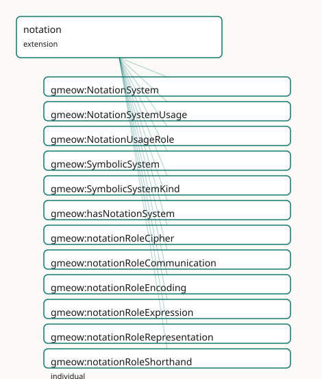

<!-- GENERATED by gmeow ontology-docs. DO NOT EDIT. -->

# GMEOW Notation and Symbolic Systems Module

- **IRI:** <https://blackcatinformatics.ca/gmeow/slices/notation>
- **Tier:** core
- **[`Group`](../reference/classes/gmeow-Group.md):** core

## What This Slice Covers

This slice owns 42 terms and contributes 7 mapping or projection rows. Use it when its terms match the native fact you want to preserve; use the linkage tables to see how those facts leave GMEOW for consumer vocabularies.

## Dependencies

- [`gmeow:slices/kernel`](kernel.md)
- [`gmeow:slices/language`](language.md)
- [`gmeow:slices/observations`](observations.md)
- [`gmeow:slices/profiles`](profiles.md)
- [`gmeow:slices/temporal`](temporal.md)

## Consumers

- Symbolic/notation systems for the language family and the music slice's lossy notation projections.

## Local Map



## Examples

### Notation Systems

- **Source:** [`slices/core/notation/examples/notation-systems.ttl`](https://github.com/Blackcat-Informatics/gmeow-ontology/blob/main/slices/core/notation/examples/notation-systems.ttl)
- **GMEOW terms:** [`gmeow:NotationSystem`](../reference/classes/gmeow-NotationSystem.md), [`gmeow:WritingSystem`](../reference/classes/gmeow-WritingSystem.md), [`gmeow:langEnglish`](../reference/individuals/gmeow-langEnglish.md), [`gmeow:notationSystemFor`](../reference/properties/gmeow-notationSystemFor.md), [`gmeow:notationSystemKind`](../reference/properties/gmeow-notationSystemKind.md), [`gmeow:symbolicKindEncoding`](../reference/individuals/gmeow-symbolicKindEncoding.md), [`gmeow:symbolicKindMusical`](../reference/individuals/gmeow-symbolicKindMusical.md), [`gmeow:symbolicKindTranscription`](../reference/individuals/gmeow-symbolicKindTranscription.md), [`gmeow:writingSystemAsNotation`](../reference/properties/gmeow-writingSystemAsNotation.md)

```turtle
# SPDX-FileCopyrightText: 2026 Blackcat Informatics® Inc. <paudley@blackcatinformatics.ca>
# SPDX-License-Identifier: CC-BY-4.0
#
# Worked example: notation systems, one machinery for every symbol set . A
# gmeow:NotationSystem is classified by an open gmeow:notationSystemKind
# (musical / mathematical / transcription / encoding / stenographic …), so staff
# notation, IPA, Morse and a math syntax are the SAME kind of object — a symbolic
# system for representing something. A transcription notation declares which
# language it transcribes (gmeow:notationSystemFor); a script is itself a notation
# system, reached from the writing system via gmeow:writingSystemAsNotation.
@prefix gmeow: <https://blackcatinformatics.ca/gmeow/> .
@prefix ex:    <https://blackcatinformatics.ca/gmeow/examples/notation/> .
@prefix rdfs:  <http://www.w3.org/2000/01/rdf-schema#> .

# --- Western staff notation: a musical symbolic system, not tied to a language.
ex:staffNotation a gmeow:NotationSystem ;
    rdfs:label              "Western staff notation"@en ;
    gmeow:notationSystemKind gmeow:symbolicKindMusical .

# --- The IPA: a transcription system FOR a language (here English).
ex:ipa a gmeow:NotationSystem ;
    rdfs:label               "International Phonetic Alphabet"@en ;
    gmeow:notationSystemFor  gmeow:langEnglish ;
    gmeow:notationSystemKind gmeow:symbolicKindTranscription .

# --- A script IS a notation system: the Latin writing system, viewed as the
#     encoding notation it provides.
ex:latin a gmeow:WritingSystem ;
    rdfs:label                  "Latin script"@en ;
    gmeow:writingSystemAsNotation ex:latinNotation .

ex:latinNotation a gmeow:NotationSystem ;
    rdfs:label               "Latin-script encoding"@en ;
    gmeow:notationSystemKind gmeow:symbolicKindEncoding .
```

## Terms

### Classes

| Term | Label | Definition |
|---|---|---|
| [`gmeow:NotationProjectionProfile`](../reference/classes/gmeow-NotationProjectionProfile.md) | Notation Projection Profile | A closed descriptor schema for the lossy projection from frame-relative content to one notation system. Declares representable parameters, incurred losses, and... |
| [`gmeow:NotationSystem`](../reference/classes/gmeow-NotationSystem.md) | Notation System | A structured symbolic system with defined rules for representing information in a specific domain — mathematical notation, musical notation, stenography, phone... |
| [`gmeow:NotationSystemUsage`](../reference/classes/gmeow-NotationSystemUsage.md) | Notation System Usage | A reified, role- and period-scoped use of a notation system by an entity — an observation in the universal claim stack (observation-spine bridge): the [gufo:Rel...](http://purl.org/nemo/gufo#Rel...) |
| [`gmeow:NotationUsageRole`](../reference/classes/gmeow-NotationUsageRole.md) | Notation Usage Role | The role a notation system plays in a specific usage — a value, never an Entity subclass. Open-ended: new analytical frameworks may introduce further roles wit... |
| [`gmeow:ProjectionFunction`](../reference/classes/gmeow-ProjectionFunction.md) | Projection Function | An FnO function that renders canonical frame-relative content to a notation system ([Principle 12](https://github.com/Blackcat-Informatics/gmeow-ontology/blob/main/CONSTITUTION.md#principle-12)). |
| [`gmeow:ProjectionLoss`](../reference/classes/gmeow-ProjectionLoss.md) | Projection Loss | A kind of information loss incurred when canonical content is projected to a notation system. An open value vocabulary of individuals; never subclassed (Princi... |
| [`gmeow:SymbolicSystem`](../reference/classes/gmeow-SymbolicSystem.md) | Symbolic System | A system of symbols, signs, or conventions used for communication, representation, or expression. Broad umbrella covering notation systems, gesture systems, em... |
| [`gmeow:SymbolicSystemKind`](../reference/classes/gmeow-SymbolicSystemKind.md) | Symbolic System Kind | The domain or kind of a symbolic or notation system — a value, never an Entity subclass. The seed list is an anchor, not a fence; new domains may introduce fur... |

### Properties

| Term | Label | Definition |
|---|---|---|
| [`gmeow:accountsForParameter`](../reference/properties/gmeow-accountsForParameter.md) | accounts for parameter | The parameter whose omission or approximation is explained by this ProjectionLoss. Used by completeness gates to ensure every parameter is representable or acc... |
| [`gmeow:declaredLoss`](../reference/properties/gmeow-declaredLoss.md) | declared loss | A loss that this notation system incurs when rendering canonical frame-relative content (e.g. quantization to 12-EDO, dropping microtiming). |
| [`gmeow:hasNotationProjectionProfile`](../reference/properties/gmeow-hasNotationProjectionProfile.md) | has notation projection profile | Links a notation system to its GMEOW projection profile. Non-functional: a future notation system may have co-existing profiles for different consumer contexts. |
| [`gmeow:hasNotationSystem`](../reference/properties/gmeow-hasNotationSystem.md) | has notation system | A notation system used by a language — e.g. IPA for phonetic transcription, a stenographic system for shorthand. NON-FUNCTIONAL: a language may use many notati... |
| [`gmeow:notationSystemFor`](../reference/properties/gmeow-notationSystemFor.md) | notation system for | The language(s) a notation system is used for or parasitic on. NON-FUNCTIONAL: a notation may serve multiple languages (e.g. IPA), and domain-specific notation... |
| [`gmeow:notationSystemKind`](../reference/properties/gmeow-notationSystemKind.md) | notation system kind | The kind(s) of a notation system ([`gmeow:SymbolicSystemKind`](../reference/classes/gmeow-SymbolicSystemKind.md) values). Subproperty of symbolicSystemKind for convenience; non-functional. |
| [`gmeow:notationSystemOf`](../reference/properties/gmeow-notationSystemOf.md) | notation system of | The notation system that this projection profile describes. Functional: one notation system per projection profile. |
| [`gmeow:notationUsageInterval`](../reference/properties/gmeow-notationUsageInterval.md) | notation usage interval | The time interval over which the notation usage is asserted to hold. Functional per relator: one interval per NotationSystemUsage. |
| [`gmeow:notationUsageNotationSystem`](../reference/properties/gmeow-notationUsageNotationSystem.md) | notation usage notation system | The notation system being used. Functional per relator: one notation system per NotationSystemUsage. |
| [`gmeow:notationUsageRole`](../reference/properties/gmeow-notationUsageRole.md) | notation usage role | The role the notation plays in this usage — transcription, encoding, representation, communication, expression, shorthand, cipher. Functional per relator: one... |
| [`gmeow:notationUsageTarget`](../reference/properties/gmeow-notationUsageTarget.md) | notation usage target | The entity that uses the notation system — a language, lexical form, expression, work, or information object. Functional per relator: one target per NotationSy... |
| [`gmeow:projectableExpression`](../reference/properties/gmeow-projectableExpression.md) | projectable expression | A solver-bound input property: the entity being projected through a NotationProjectionProfile. Used by FnO projection functions to declare their input type; no... |
| [`gmeow:projectionFunction`](../reference/properties/gmeow-projectionFunction.md) | projection function | An FnO function reference that renders canonical content to this notation system ([Principle 12](https://github.com/Blackcat-Informatics/gmeow-ontology/blob/main/CONSTITUTION.md#principle-12)). |
| [`gmeow:representableParameter`](../reference/properties/gmeow-representableParameter.md) | representable parameter | A parameter that this notation system can represent without loss (e.g. pitch in a 12-EDO-aware staff notation). Range is kept open in the core framework; domai... |
| [`gmeow:smuflCodepoint`](../reference/properties/gmeow-smuflCodepoint.md) | SMuFL codepoint | A Unicode codepoint reference in the Standard Music Font Layout (SMuFL) specification that identifies a glyph used by this notation system. Multiple codepoints... |
| [`gmeow:symbolicSystemKind`](../reference/properties/gmeow-symbolicSystemKind.md) | symbolic system kind | The kind(s) of a symbolic system ([`gmeow:SymbolicSystemKind`](../reference/classes/gmeow-SymbolicSystemKind.md) values). Non-functional — a system may serve multiple domains simultaneously. |
| [`gmeow:writingSystemAsNotation`](../reference/properties/gmeow-writingSystemAsNotation.md) | writing system as notation | When a writing system is also a notation system — e.g. Braille as a tactile notation, or a bespoke conlang script that doubles as a featural notation. NON-FUNC... |

### Individuals

| Term | Label | Definition |
|---|---|---|
| [`gmeow:notationRoleCipher`](../reference/individuals/gmeow-notationRoleCipher.md) | cipher | Using a notation to conceal or encrypt information. |
| [`gmeow:notationRoleCommunication`](../reference/individuals/gmeow-notationRoleCommunication.md) | communication | Using a notation as a medium of communication between agents. |
| [`gmeow:notationRoleEncoding`](../reference/individuals/gmeow-notationRoleEncoding.md) | encoding | Using a notation to map information into a different representation or signal system. |
| [`gmeow:notationRoleExpression`](../reference/individuals/gmeow-notationRoleExpression.md) | expression | Using a notation for artistic, emotional, or creative expression. |
| [`gmeow:notationRoleRepresentation`](../reference/individuals/gmeow-notationRoleRepresentation.md) | representation | Using a notation to represent domain-specific objects, relations, or structures. |
| [`gmeow:notationRoleShorthand`](../reference/individuals/gmeow-notationRoleShorthand.md) | shorthand | Using a notation for abbreviated or rapid recording of language or information. |
| [`gmeow:notationRoleTranscription`](../reference/individuals/gmeow-notationRoleTranscription.md) | transcription | Using a notation to record spoken or signed language in a structured form. |
| [`gmeow:symbolicKindCommunicationConvention`](../reference/individuals/gmeow-symbolicKindCommunicationConvention.md) | communication convention | A broad social or cultural convention for communication that does not rise to the level of a full language or notation system. |
| [`gmeow:symbolicKindCryptographic`](../reference/individuals/gmeow-symbolicKindCryptographic.md) | cryptographic | A transform scheme for concealing or securing information through encryption or encoding. |
| [`gmeow:symbolicKindEmoji`](../reference/individuals/gmeow-symbolicKindEmoji.md) | emoji | A convention-based system of pictographic symbols used in digital communication. |
| [`gmeow:symbolicKindEncoding`](../reference/individuals/gmeow-symbolicKindEncoding.md) | encoding | A scheme for mapping information from one representation to another. |
| [`gmeow:symbolicKindGesture`](../reference/individuals/gmeow-symbolicKindGesture.md) | gesture | A system of physical gestures or movements used for communication or expression. |
| [`gmeow:symbolicKindMathematical`](../reference/individuals/gmeow-symbolicKindMathematical.md) | mathematical | A notation system for representing mathematical objects, relations, and proofs. |
| [`gmeow:symbolicKindMusical`](../reference/individuals/gmeow-symbolicKindMusical.md) | musical | A notation system for representing musical structure, performance, or sound. |
| [`gmeow:symbolicKindPlatformConvention`](../reference/individuals/gmeow-symbolicKindPlatformConvention.md) | platform convention | A symbol or communication convention specific to a platform, community, or digital environment. |
| [`gmeow:symbolicKindStenographic`](../reference/individuals/gmeow-symbolicKindStenographic.md) | stenographic | A shorthand notation system for rapid recording of spoken language. |
| [`gmeow:symbolicKindTranscription`](../reference/individuals/gmeow-symbolicKindTranscription.md) | transcription | A notation system for recording spoken or signed language in a structured visual form. |

## Linkages

- **Rows:** 7
- **Projection profiles:** -
- **External vocabularies:** `schema`, `wd`

| Source | Kind | Profile | Predicate/Relation | Target | Evidence |
|---|---|---|---|---|---|
| [`gmeow:NotationSystem`](../reference/classes/gmeow-NotationSystem.md) | equivalence | `-` | [skos:relatedMatch](http://www.w3.org/2004/02/skos/core#relatedMatch) | [wd:Q2001982](https://www.wikidata.org/wiki/Q2001982) | `gmeow-notation.sssom.tsv`; `gmeow:eqNotation003`; confidence 0.6 |
| [`gmeow:SymbolicSystem`](../reference/classes/gmeow-SymbolicSystem.md) | equivalence | `-` | [skos:relatedMatch](http://www.w3.org/2004/02/skos/core#relatedMatch) | [schema:DefinedTermSet](https://schema.org/DefinedTermSet) | `gmeow-notation.sssom.tsv`; `gmeow:eqNotation001`; confidence 0.5 |
| [`gmeow:SymbolicSystem`](../reference/classes/gmeow-SymbolicSystem.md) | equivalence | `-` | [skos:relatedMatch](http://www.w3.org/2004/02/skos/core#relatedMatch) | [wd:Q80071](https://www.wikidata.org/wiki/Q80071) | `gmeow-notation.sssom.tsv`; `gmeow:eqNotation002`; confidence 0.5 |
| [`gmeow:symbolicKindCryptographic`](../reference/individuals/gmeow-symbolicKindCryptographic.md) | equivalence | `-` | [skos:closeMatch](http://www.w3.org/2004/02/skos/core#closeMatch) | [wd:Q8789](https://www.wikidata.org/wiki/Q8789) | `gmeow-notation.sssom.tsv`; `gmeow:eqNotation008`; confidence 0.7 |
| [`gmeow:symbolicKindMathematical`](../reference/individuals/gmeow-symbolicKindMathematical.md) | equivalence | `-` | [skos:closeMatch](http://www.w3.org/2004/02/skos/core#closeMatch) | [wd:Q1140046](https://www.wikidata.org/wiki/Q1140046) | `gmeow-notation.sssom.tsv`; `gmeow:eqNotation005`; confidence 0.8 |
| [`gmeow:symbolicKindMusical`](../reference/individuals/gmeow-symbolicKindMusical.md) | equivalence | `-` | [skos:closeMatch](http://www.w3.org/2004/02/skos/core#closeMatch) | [wd:Q233861](https://www.wikidata.org/wiki/Q233861) | `gmeow-notation.sssom.tsv`; `gmeow:eqNotation006`; confidence 0.8 |
| [`gmeow:symbolicKindStenographic`](../reference/individuals/gmeow-symbolicKindStenographic.md) | equivalence | `-` | [skos:closeMatch](http://www.w3.org/2004/02/skos/core#closeMatch) | [wd:Q181066](https://www.wikidata.org/wiki/Q181066) | `gmeow-notation.sssom.tsv`; `gmeow:eqNotation007`; confidence 0.8 |

## Guide

<!-- SPDX-FileCopyrightText: 2026 Blackcat Informatics® Inc. <paudley@blackcatinformatics.ca> -->
<!-- SPDX-License-Identifier: CC-BY-4.0 -->

# Notation and Symbolic Systems — modelling & interoperability guide

Most vocabularies conflate symbol systems with languages: a musical score is
"in English", mathematical notation is "a language", emoji are "characters in
a language". GMEOW rejects this collapse. A symbol system is **not** a language
by default; it becomes one only through a **standpointed claim** ([Principle 9](https://github.com/Blackcat-Informatics/gmeow-ontology/blob/main/CONSTITUTION.md#principle-9)).

## Governing tenet: neutral symbolic systems

A **[`gmeow:SymbolicSystem`](../reference/classes/gmeow-SymbolicSystem.md)** is a first-class [`InformationObject`](../reference/classes/gmeow-InformationObject.md) — a system of
symbols, signs, or conventions used for communication, representation, or
expression. It sits alongside [`Language`](../reference/classes/gmeow-Language.md) and [`WritingSystem`](../reference/classes/gmeow-WritingSystem.md) as a sibling under
[`InformationObject`](../reference/classes/gmeow-InformationObject.md), not as a subclass of either.

A **[`gmeow:NotationSystem`](../reference/classes/gmeow-NotationSystem.md)** is a structured symbolic system with defined rules
for representing information in a specific domain. It is a SubKind of
[`SymbolicSystem`](../reference/classes/gmeow-SymbolicSystem.md).

**Why the sibling approach?** Making [`WritingSystem`](../reference/classes/gmeow-WritingSystem.md) a subclass of
[`NotationSystem`](../reference/classes/gmeow-NotationSystem.md) would force all writing systems to carry notation-specific
properties (domain, encoding scheme) and all notation systems to carry
writing-system properties (ISO 15924 code, text direction). The sibling
approach keeps each class minimal and lets explicit bridging properties
([`hasNotationSystem`](../reference/properties/gmeow-hasNotationSystem.md), [`writingSystemAsNotation`](../reference/properties/gmeow-writingSystemAsNotation.md)) do the linking.

## The boundary: language vs notation vs symbolic system

| Criterion | [`Language`](../reference/classes/gmeow-Language.md) | [`NotationSystem`](../reference/classes/gmeow-NotationSystem.md) | [`SymbolicSystem`](../reference/classes/gmeow-SymbolicSystem.md) |
|---|---|---|---|
| Generative syntax/semantics | **Yes** (independent) | **No** (parasitic or domain-bound) | **No** (convention-based) |
| Parseable serialization | Often | Sometimes (as encoding) | Rarely |
| Human native speakers | May have | Never | Never |
| Domain specificity | General communication | Specific domain (math, music, crypto) | Any convention |
| Structured rules | Grammar | Representation rules | Social/platform conventions |

## Decision table

| System | GMEOW classification | Rationale |
|---|---|---|
| **IPA** | [`NotationSystem`](../reference/classes/gmeow-NotationSystem.md) (transcription) | Phonetic representation of spoken language; parasitic, not generative |
| **Morse code** | [`NotationSystem`](../reference/classes/gmeow-NotationSystem.md) (encoding) | Signal encoding of text; no independent syntax/semantics |
| **Stenography** | [`NotationSystem`](../reference/classes/gmeow-NotationSystem.md) (shorthand) | Speed-writing system for a specific language |
| **Cipher systems** | [`NotationSystem`](../reference/classes/gmeow-NotationSystem.md) (cryptographic) | Transform scheme; not a language unless standpointed |
| **Emoji conventions** | [`SymbolicSystem`](../reference/classes/gmeow-SymbolicSystem.md) (communication) | Convention-based symbols without generative syntax |
| **Mathematical notation** | [`NotationSystem`](../reference/classes/gmeow-NotationSystem.md) (mathematical) | Domain-specific representational rules |
| **TeX / LaTeX** | [`FormalLanguage`](../reference/classes/gmeow-FormalLanguage.md) | Grammar-defined with parseable syntax and semantics |
| **MathML** | [`FormalLanguage`](../reference/classes/gmeow-FormalLanguage.md) | XML grammar with defined semantics |
| **MusicXML / MEI** | [`FormalLanguage`](../reference/classes/gmeow-FormalLanguage.md) **or** [`NotationSystem`](../reference/classes/gmeow-NotationSystem.md) | Grammar-defined encoding; also musical notation — **co-modelable via standpoint** |
| **MIDI** | [`FormalLanguage`](../reference/classes/gmeow-FormalLanguage.md) **or** [`NotationSystem`](../reference/classes/gmeow-NotationSystem.md) | Protocol with defined structure; also encoding — **co-modelable via standpoint** |
| **ABC notation** | [`FormalLanguage`](../reference/classes/gmeow-FormalLanguage.md) **or** [`NotationSystem`](../reference/classes/gmeow-NotationSystem.md) | Text-based music notation with grammar — **co-modelable via standpoint** |
| **LilyPond** | [`FormalLanguage`](../reference/classes/gmeow-FormalLanguage.md) **or** [`NotationSystem`](../reference/classes/gmeow-NotationSystem.md) | Programming language for music engraving; also music notation — **co-modelable via standpoint** |

### Boundary rules

1. **Stenography is usually a notation system for an existing language.** It has
 no independent generative syntax; it encodes an existing language in
 abbreviated form.

2. **Cryptographic ciphers / encodings are not languages by default.** They are
 transform schemes. A standpoint may claim a cipher as a language (e.g. a
 conlang built on cipher principles), but the default classification is
 [`NotationSystem`](../reference/classes/gmeow-NotationSystem.md).

3. **IPA and Morse code are notation / transcription / encoding systems, not
 natural languages.** They lack independent syntax and semantics.

4. **TeX, MathML, OpenMath, MusicXML, MEI, MIDI, LilyPond, and ABC notation may
 be [`FormalLanguage`](../reference/classes/gmeow-FormalLanguage.md) instances when treated as grammar-defined encodings.**
 They have parseable syntax and defined semantics. They may ALSO be modeled as
 [`NotationSystem`](../reference/classes/gmeow-NotationSystem.md) via co-modeling — a single entity can carry both
 classifications from different standpoints ([Principle 9](https://github.com/Blackcat-Informatics/gmeow-ontology/blob/main/CONSTITUTION.md#principle-9)).

5. **Emoji, gesture, meme, and platform conventions are notation or
 communication conventions unless modeled as full languages by a standpointed
 claim.** They lack generative syntax and are convention-based.

## Usage pattern: NotationSystemUsage

The reified relator [`NotationSystemUsage`](../reference/classes/gmeow-NotationSystemUsage.md) binds an entity to a notation system
with a role and interval, mirroring [`WritingSystemUsage`](../reference/classes/gmeow-WritingSystemUsage.md):

```turtle
@prefix gmeow: <https://blackcatinformatics.ca/gmeow/> .
@prefix ex:    <https://example.org/notation/> .

ex:english a gmeow:Language .

ex:ipa a gmeow:NotationSystem ;
    gmeow:notationSystemKind gmeow:symbolicKindTranscription .

ex:englishUsesIpa a gmeow:NotationSystemUsage ;
    gmeow:notationUsageTarget ex:english ;
    gmeow:notationUsageNotationSystem ex:ipa ;
    gmeow:notationUsageRole gmeow:notationRoleTranscription ;
    gmeow:notationUsageInterval ex:ipaUsageInterval .
```

A musical work using staff notation:

```turtle
ex:beethoven9 a gmeow:CreativeWork .

ex:staffNotation a gmeow:NotationSystem ;
    gmeow:notationSystemKind gmeow:symbolicKindMusical .

ex:beethoven9UsesStaff a gmeow:NotationSystemUsage ;
    gmeow:notationUsageTarget ex:beethoven9 ;
    gmeow:notationUsageNotationSystem ex:staffNotation ;
    gmeow:notationUsageRole gmeow:notationRoleRepresentation ;
    gmeow:notationUsageInterval ex:staffUsageInterval .
```

## Co-modeling: when a system is both language and notation

A system may be classified as both a [`FormalLanguage`](../reference/classes/gmeow-FormalLanguage.md) and a [`NotationSystem`](../reference/classes/gmeow-NotationSystem.md)
from different standpoints. GMEOW handles this through co-equal,
standpoint-indexed claims ([Principle 9](https://github.com/Blackcat-Informatics/gmeow-ontology/blob/main/CONSTITUTION.md#principle-9)), not subclass overlap:

```turtle
ex:musicxml a gmeow:InformationObject .

# Standpoint A: MusicXML is a formal language (grammar-defined XML)
ex:claimA a gmeow:StandpointClaim ;
    gmeow:vantage ex:softwareEngineer ;
    gmeow:observedFeature ex:musicxml ;
    gmeow:observationResult gmeow:originFormal .

# Standpoint B: MusicXML is a musical notation system
ex:claimB a gmeow:StandpointClaim ;
    gmeow:vantage ex:musicLibrarian ;
    gmeow:observedFeature ex:musicxml ;
    gmeow:observationResult gmeow:symbolicKindMusical .
```

## Projections and lossy drops

| Target vocabulary | What maps | What's dropped |
|---|---|---|
| **SKOS** | [`SymbolicSystem`](../reference/classes/gmeow-SymbolicSystem.md) → [`skos:ConceptScheme`](http://www.w3.org/2004/02/skos/core#ConceptScheme); [`NotationSystem`](../reference/classes/gmeow-NotationSystem.md) → [`skos:ConceptScheme`](http://www.w3.org/2004/02/skos/core#ConceptScheme) | Domain specificity, usage roles, temporal scope |
| **schema.org** | [`SymbolicSystem`](../reference/classes/gmeow-SymbolicSystem.md) → [`schema:DefinedTermSet`](https://schema.org/DefinedTermSet) | Structured rules, reified usage |
| **MathML / OpenMath** | [`NotationSystem`](../reference/classes/gmeow-NotationSystem.md) (mathematical) → math element container | Notation metadata, standpoint, temporal scope |
| **MusicXML / MEI** | [`NotationSystem`](../reference/classes/gmeow-NotationSystem.md) (musical) → score container | Usage relator, confidence, standpoint |
| **MIDI** | [`NotationSystem`](../reference/classes/gmeow-NotationSystem.md) (musical) → track/sequence | Human-readable notation semantics |

## Projection framework: NotationProjectionProfile

A **[`gmeow:NotationProjectionProfile`](../reference/classes/gmeow-NotationProjectionProfile.md)** is a [`gmeow:Profile`](../reference/classes/gmeow-Profile.md) (from the core
profiles slice) that describes how a [`NotationSystem`](../reference/classes/gmeow-NotationSystem.md) projects canonical,
frame-relative content. It is deliberately not the canonical content itself;
it is a machine-readable, honest declaration of what survives the projection
and what is lost (Principles 4, 11, 12).

Every profile states:

* **[`gmeow:notationSystemOf`](../reference/properties/gmeow-notationSystemOf.md)** — exactly one [`NotationSystem`](../reference/classes/gmeow-NotationSystem.md) being described.
* **[`gmeow:representableParameter`](../reference/properties/gmeow-representableParameter.md)** — parameters the notation can carry
 without loss (range is open in core; domain slices constrain it, e.g. to
 [`MusicalParameter`](../reference/classes/gmeow-MusicalParameter.md) in the music extension).
* **[`gmeow:declaredLoss`](../reference/properties/gmeow-declaredLoss.md)** — [`ProjectionLoss`](../reference/classes/gmeow-ProjectionLoss.md) individuals that explain what
 the notation drops or approximates.
* **[`gmeow:projectionFunction`](../reference/properties/gmeow-projectionFunction.md)** — an FnO function reference that performs the
 render.

A **[`gmeow:ProjectionLoss`](../reference/classes/gmeow-ProjectionLoss.md)** is an abstract individual type (value vocabulary;
never subclassed). Each loss may **[`gmeow:accountsForParameter`](../reference/properties/gmeow-accountsForParameter.md)** one or more
parameters so that completeness gates can prove every parameter is either
represented or explicitly accounted for.

The core framework intentionally stays domain-agnostic. The music extension
provides the concrete [`MusicalParameter`](../reference/classes/gmeow-MusicalParameter.md) vocabulary, music-domain
[`NotationSystem`](../reference/classes/gmeow-NotationSystem.md) individuals, and per-system projection profiles.

## Terms

### [`gmeow:SymbolicSystem`](../reference/classes/gmeow-SymbolicSystem.md) · [`gmeow:NotationSystem`](../reference/classes/gmeow-NotationSystem.md) · [`gmeow:SymbolicSystemKind`](../reference/classes/gmeow-SymbolicSystemKind.md) · [`gmeow:symbolicSystemKind`](../reference/properties/gmeow-symbolicSystemKind.md) · [`gmeow:notationSystemKind`](../reference/properties/gmeow-notationSystemKind.md)

A [`SymbolicSystem`](../reference/classes/gmeow-SymbolicSystem.md) is a first-class [`InformationObject`](../reference/classes/gmeow-InformationObject.md) — a convention-based
system of symbols — sitting alongside [`Language`](../reference/classes/gmeow-Language.md) and [`WritingSystem`](../reference/classes/gmeow-WritingSystem.md) as a
sibling, never a subclass. A [`NotationSystem`](../reference/classes/gmeow-NotationSystem.md) is a structured `SubKind` of it
with defined representation rules in a specific domain. [`SymbolicSystemKind`](../reference/classes/gmeow-SymbolicSystemKind.md)
values classify each via [`symbolicSystemKind`](../reference/properties/gmeow-symbolicSystemKind.md) / [`notationSystemKind`](../reference/properties/gmeow-notationSystemKind.md)
(transcription, encoding, musical, mathematical, …).

### [`gmeow:hasNotationSystem`](../reference/properties/gmeow-hasNotationSystem.md) · [`gmeow:notationSystemFor`](../reference/properties/gmeow-notationSystemFor.md) · [`gmeow:writingSystemAsNotation`](../reference/properties/gmeow-writingSystemAsNotation.md)

The explicit bridging properties that do the linking the sibling design keeps
out of the class hierarchy: relating an entity to a notation system it uses, its
inverse, and the bridge that views a [`WritingSystem`](../reference/classes/gmeow-WritingSystem.md) as a [`NotationSystem`](../reference/classes/gmeow-NotationSystem.md).

### [`gmeow:NotationSystemUsage`](../reference/classes/gmeow-NotationSystemUsage.md) · [`gmeow:NotationUsageRole`](../reference/classes/gmeow-NotationUsageRole.md) · [`gmeow:notationUsageTarget`](../reference/properties/gmeow-notationUsageTarget.md) · [`gmeow:notationUsageNotationSystem`](../reference/properties/gmeow-notationUsageNotationSystem.md) · [`gmeow:notationUsageRole`](../reference/properties/gmeow-notationUsageRole.md) · [`gmeow:notationUsageInterval`](../reference/properties/gmeow-notationUsageInterval.md)

The reified relator binding an entity to a notation system with a role and an
interval, mirroring [`WritingSystemUsage`](../reference/classes/gmeow-WritingSystemUsage.md): [`notationUsageTarget`](../reference/properties/gmeow-notationUsageTarget.md) the entity,
[`notationUsageNotationSystem`](../reference/properties/gmeow-notationUsageNotationSystem.md) the system, [`notationUsageRole`](../reference/properties/gmeow-notationUsageRole.md) a [`NotationUsageRole`](../reference/classes/gmeow-NotationUsageRole.md)
value (transcription, representation, …), and [`notationUsageInterval`](../reference/properties/gmeow-notationUsageInterval.md) the span it
held.

### [`gmeow:NotationProjectionProfile`](../reference/classes/gmeow-NotationProjectionProfile.md) · [`gmeow:hasNotationProjectionProfile`](../reference/properties/gmeow-hasNotationProjectionProfile.md) · [`gmeow:notationSystemOf`](../reference/properties/gmeow-notationSystemOf.md) · [`gmeow:representableParameter`](../reference/properties/gmeow-representableParameter.md) · [`gmeow:projectableExpression`](../reference/properties/gmeow-projectableExpression.md)

A [`Profile`](../reference/classes/gmeow-Profile.md) (from the core profiles slice) declaring how a [`NotationSystem`](../reference/classes/gmeow-NotationSystem.md)
projects canonical, frame-relative content — honestly, not the canonical content
itself. [`notationSystemOf`](../reference/properties/gmeow-notationSystemOf.md) names the one system described,
[`representableParameter`](../reference/properties/gmeow-representableParameter.md) the parameters it carries without loss, and
[`projectableExpression`](../reference/properties/gmeow-projectableExpression.md) the expressions it can render; [`hasNotationProjectionProfile`](../reference/properties/gmeow-hasNotationProjectionProfile.md)
attaches it.

### [`gmeow:ProjectionLoss`](../reference/classes/gmeow-ProjectionLoss.md) · [`gmeow:declaredLoss`](../reference/properties/gmeow-declaredLoss.md) · [`gmeow:accountsForParameter`](../reference/properties/gmeow-accountsForParameter.md) · [`gmeow:ProjectionFunction`](../reference/classes/gmeow-ProjectionFunction.md) · [`gmeow:projectionFunction`](../reference/properties/gmeow-projectionFunction.md)

A [`ProjectionLoss`](../reference/classes/gmeow-ProjectionLoss.md) is an abstract value individual (never subclassed) explaining
what a notation drops or approximates; [`declaredLoss`](../reference/properties/gmeow-declaredLoss.md) lists them on a profile and
[`accountsForParameter`](../reference/properties/gmeow-accountsForParameter.md) ties each to the parameters it covers so completeness gates
can prove every parameter is represented or accounted for. A [`ProjectionFunction`](../reference/classes/gmeow-ProjectionFunction.md)
referenced by [`projectionFunction`](../reference/properties/gmeow-projectionFunction.md) is the FnO function that performs the render.

### [`gmeow:smuflCodepoint`](../reference/properties/gmeow-smuflCodepoint.md)

A Unicode codepoint reference in the Standard Music Font Layout (SMuFL)
specification identifying a glyph used by a [`NotationSystem`](../reference/classes/gmeow-NotationSystem.md); multiple codepoints
may be asserted as multiple triples.
