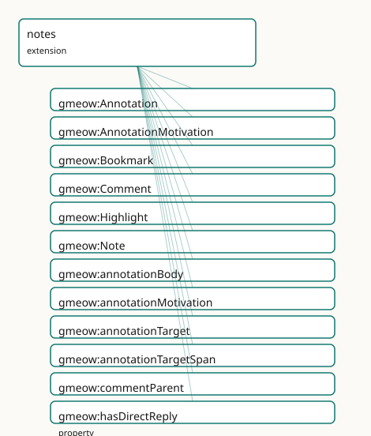

<!-- GENERATED by gmeow ontology-docs. DO NOT EDIT. -->

# GMEOW Notes & Annotation Module

- **IRI:** <https://blackcatinformatics.ca/gmeow/slices/notes>
- **Tier:** extension
- **[`Group`](../reference/classes/gmeow-Group.md):** extensions

## What This Slice Covers

This slice owns 31 terms and contributes 39 mapping or projection rows. Use it when its terms match the native fact you want to preserve; use the linkage tables to see how those facts leave GMEOW for consumer vocabularies.

## Dependencies

- [`gmeow:slices/evidence`](evidence.md)
- [`gmeow:slices/kernel`](kernel.md)

## Consumers

- PKM annotations (annotation target span) over core evidence spans; Web [`Annotation`](../reference/classes/gmeow-Annotation.md) projection.

## Local Map



## Examples

### Annotations And Notes

- **Source:** [`slices/extensions/notes/examples/annotations-and-notes.ttl`](https://github.com/Blackcat-Informatics/gmeow-ontology/blob/main/slices/extensions/notes/examples/annotations-and-notes.ttl)
- **GMEOW terms:** [`gmeow:Annotation`](../reference/classes/gmeow-Annotation.md), [`gmeow:Comment`](../reference/classes/gmeow-Comment.md), [`gmeow:CreativeWork`](../reference/classes/gmeow-CreativeWork.md), [`gmeow:Highlight`](../reference/classes/gmeow-Highlight.md), [`gmeow:Note`](../reference/classes/gmeow-Note.md), [`gmeow:Person`](../reference/classes/gmeow-Person.md), [`gmeow:Selector`](../reference/classes/gmeow-Selector.md), [`gmeow:annotationMotivation`](../reference/properties/gmeow-annotationMotivation.md), [`gmeow:annotationTarget`](../reference/properties/gmeow-annotationTarget.md), [`gmeow:annotationTargetSpan`](../reference/properties/gmeow-annotationTargetSpan.md)
- **External prefixes:** `xsd`

```turtle
# SPDX-FileCopyrightText: 2026 Blackcat Informatics® Inc. <paudley@blackcatinformatics.ca>
# SPDX-License-Identifier: CC-BY-4.0
#
# Worked example: notes and annotations. A gmeow:Note is a first-class
# information object — authored, timestamped, and linked to other notes by
# gmeow:hasWikilink and to entities by gmeow:mentions (the Zettelkasten / linked-
# note pattern). A gmeow:Highlight is the W3C-Web-Annotation shape for pure
# highlighting: a gmeow:annotationTarget, a precise gmeow:annotationTargetSpan
# (a text-quote Selector), and a gmeow:annotationMotivation — but NO body (a
# highlight just marks a span; for an annotation that says something, a body-
# bearing gmeow:Annotation subclass is used). A gmeow:Comment is a Note that
# threads under a parent.
@prefix gmeow: <https://blackcatinformatics.ca/gmeow/> .
@prefix ex:    <https://blackcatinformatics.ca/gmeow/examples/notes/> .
@prefix xsd:   <http://www.w3.org/2001/XMLSchema#> .

ex:dana a gmeow:Person ; gmeow:name "Dana Reyes"@en .
ex:paper a gmeow:CreativeWork ; gmeow:title "A Survey of Transformer Architectures"@en .

# --- A linked note: authored, mentions an entity, wikilinks to another note.
ex:note1 a gmeow:Note ;
    gmeow:noteAuthor    ex:dana ;
    gmeow:noteContent   "Transformers replaced RNNs for most NLP tasks by 2020." ;
    gmeow:noteCreatedAt "2026-06-10T08:00:00Z"^^xsd:dateTime ;
    gmeow:hasWikilink   ex:note2 ;
    gmeow:mentions      ex:paper .

ex:note2 a gmeow:Note ;
    gmeow:noteAuthor  ex:dana ;
    gmeow:noteContent "The attention mechanism is the core idea." .

# --- A highlight on the paper: it pins WHICH span via annotationTargetSpan (a
#     Selector) and is motivated by highlighting — a pure target+span binding,
#     no body (that is the Highlight contract).
ex:highlight a gmeow:Highlight ;
    gmeow:annotationTarget     ex:paper ;
    gmeow:annotationTargetSpan ex:span ;
    gmeow:annotationMotivation gmeow:motivationHighlighting .

ex:span a gmeow:Selector ;
    gmeow:selectorTextQuote "the attention mechanism scales quadratically with sequence length" .

# --- A comment threading under the paper (a Comment IS a Note).
ex:comment a gmeow:Comment ;
    gmeow:noteAuthor    ex:dana ;
    gmeow:noteContent   "Does this hold for very long sequences?" ;
    gmeow:commentParent ex:paper .
```

## Terms

### Classes

| Term | Label | Definition |
|---|---|---|
| [`gmeow:Annotation`](../reference/classes/gmeow-Annotation.md) | Annotation | A reified binding of a body to a target with a motivation — the W3C Web Annotation idiom expressed as a [gufo:Relator.](http://purl.org/nemo/gufo#Relator.) Mediates annotationBody (the note or lite... |
| [`gmeow:AnnotationMotivation`](../reference/classes/gmeow-AnnotationMotivation.md) | Annotation Motivation | The purpose for which an annotation is created — a VALUE vocabulary (individuals, never subclasses) aligned to the W3C Web Annotation motivation set. Co-equal:... |
| [`gmeow:Bookmark`](../reference/classes/gmeow-Bookmark.md) | Bookmark | An annotation that records a target resource for later retrieval, motivated by bookmarking. Typically has no body and no selector (the target entity itself is... |
| [`gmeow:Comment`](../reference/classes/gmeow-Comment.md) | Comment | A note that replies to an annotation or another comment — a threaded discussion node. Every Comment has exactly one commentParent (the annotation or comment be... |
| [`gmeow:Highlight`](../reference/classes/gmeow-Highlight.md) | Highlight | An annotation that marks an anchored span within a target and carries no body — a pure target+selector binding motivated by highlighting. |
| [`gmeow:Note`](../reference/classes/gmeow-Note.md) | Note | A piece of content in a personal or collective knowledge graph — an annotation body, a Zettelkasten card, a comment, or a standalone thought. Grounded as an in... |

### Properties

| Term | Label | Definition |
|---|---|---|
| [`gmeow:annotationBody`](../reference/properties/gmeow-annotationBody.md) | annotation body | The note that serves as the body of an annotation — the content being attached. Functional per relator: one body per Annotation. Optional: a highlight or bookm... |
| [`gmeow:annotationMotivation`](../reference/properties/gmeow-annotationMotivation.md) | annotation motivation | The motivation of an annotation — the purpose for which the body is attached to the target. Functional per relator: one motivation per Annotation. An open valu... |
| [`gmeow:annotationTarget`](../reference/properties/gmeow-annotationTarget.md) | annotation target | The entity that is annotated — the target of the annotation. Functional per relator: one target per Annotation. |
| [`gmeow:annotationTargetSpan`](../reference/properties/gmeow-annotationTargetSpan.md) | annotation target span | An optional anchored span within the annotation target — a text quote, position, or fragment selector. Non-functional: an annotation may reference multiple spa... |
| [`gmeow:commentParent`](../reference/properties/gmeow-commentParent.md) | comment parent | The annotation or comment that this comment replies to. Every Comment has exactly one commentParent. The range is [`gmeow:Entity`](../reference/classes/gmeow-Entity.md) (encompassing Annotation and Com... |
| [`gmeow:hasDirectReply`](../reference/properties/gmeow-hasDirectReply.md) | has direct reply | Relates an annotation or comment to its immediate reply comment. Non-transitive inverse of commentParent. HasReply is the transitive superproperty that reaches... |
| [`gmeow:hasReply`](../reference/properties/gmeow-hasReply.md) | has reply | Relates an annotation or comment to a reply comment. Transitive: the full reply tree is reachable. Superproperty of hasDirectReply. Intentionally kept free of... |
| [`gmeow:hasWikilink`](../reference/properties/gmeow-hasWikilink.md) | has wikilink | A directed wikilink edge projected from mentions or relatedNote for Markdown / PKM round-trip. Not asserted in the canonical graph; materialized by the markdow... |
| [`gmeow:mentionedIn`](../reference/properties/gmeow-mentionedIn.md) | mentioned in | The inverse of mentions: an entity is mentioned in a note — the backlink view. Materialized by projection or inference, never hand-maintained. |
| [`gmeow:mentions`](../reference/properties/gmeow-mentions.md) | mentions | A note mentions another entity (typically another note or a resource) — the source of a directed backlink edge. Non-functional: a note may mention many entitie... |
| [`gmeow:noteAuthor`](../reference/properties/gmeow-noteAuthor.md) | note author | The agent who authored a note — the flat 80% shortcut. Non-functional: a note may have multiple co-authors. Promote to a reified [`gmeow:Participation`](../reference/classes/gmeow-Participation.md) or [prov:wa...](http://www.w3.org/ns/prov#wa...) |
| [`gmeow:noteContent`](../reference/properties/gmeow-noteContent.md) | note content | The textual or markdown content of a note. The flat 80% case; promote to a structured CreativeWork or a reified annotation when provenance, versioning, or mult... |
| [`gmeow:noteCreatedAt`](../reference/properties/gmeow-noteCreatedAt.md) | note created at | The creation timestamp of a note — a lightweight four-clock shortcut. The heavy case uses a reified [`gmeow:Participation`](../reference/classes/gmeow-Participation.md) or [prov:wasAttributedTo](http://www.w3.org/ns/prov#wasAttributedTo) with full tempo... |
| [`gmeow:noteModifiedAt`](../reference/properties/gmeow-noteModifiedAt.md) | note modified at | The last-modification timestamp of a note — a lightweight four-clock shortcut. |
| [`gmeow:relatedNote`](../reference/properties/gmeow-relatedNote.md) | related note | An undirected associative link between two notes — the semantic sibling of relatedTag, applied to the note graph. Symmetric. Optional: the note graph stays fla... |

### Individuals

| Term | Label | Definition |
|---|---|---|
| [`gmeow:motivationAssessing`](../reference/individuals/gmeow-motivationAssessing.md) | assessing | The annotation assesses or evaluates the target. |
| [`gmeow:motivationBookmarking`](../reference/individuals/gmeow-motivationBookmarking.md) | bookmarking | The annotation bookmarks the target for later retrieval. |
| [`gmeow:motivationCommenting`](../reference/individuals/gmeow-motivationCommenting.md) | commenting | The annotation comments on the target. |
| [`gmeow:motivationDescribing`](../reference/individuals/gmeow-motivationDescribing.md) | describing | The annotation describes the target. |
| [`gmeow:motivationHighlighting`](../reference/individuals/gmeow-motivationHighlighting.md) | highlighting | The annotation highlights a span within the target. |
| [`gmeow:motivationLinking`](../reference/individuals/gmeow-motivationLinking.md) | linking | The annotation links the target to another resource. |
| [`gmeow:motivationModerating`](../reference/individuals/gmeow-motivationModerating.md) | moderating | The annotation moderates or curates the target. |
| [`gmeow:motivationQuestioning`](../reference/individuals/gmeow-motivationQuestioning.md) | questioning | The annotation poses a question about the target. |
| [`gmeow:motivationReplying`](../reference/individuals/gmeow-motivationReplying.md) | replying | The annotation replies to another annotation or comment. |
| [`gmeow:motivationTagging`](../reference/individuals/gmeow-motivationTagging.md) | tagging | The annotation tags the target with a label or topic. |

## Linkages

- **Rows:** 39
- **Projection profiles:** `activitystreams`, `markdown`, `schema-org`, `web-annotation`
- **External vocabularies:** `as`, `dcterms`, `foaf`, `oa`, `rdf`, `schema`, `sioc`

| Source | Kind | Profile | Predicate/Relation | Target | Evidence |
|---|---|---|---|---|---|
| [`gmeow:Annotation`](../reference/classes/gmeow-Annotation.md) | equivalence | `-` | [skos:closeMatch](http://www.w3.org/2004/02/skos/core#closeMatch) | [oa:Annotation](http://www.w3.org/ns/oa#Annotation) | `gmeow-notes.sssom.tsv`; `gmeow:eqNotes001`; confidence 0.85 |
| [`gmeow:Comment`](../reference/classes/gmeow-Comment.md) | equivalence | `-` | [skos:closeMatch](http://www.w3.org/2004/02/skos/core#closeMatch) | [schema:Comment](https://schema.org/Comment) | `gmeow-notes.sssom.tsv`; `gmeow:eqNotes007`; confidence 0.85 |
| [`gmeow:Comment`](../reference/classes/gmeow-Comment.md) | equivalence | `-` | [skos:closeMatch](http://www.w3.org/2004/02/skos/core#closeMatch) | [sioc:Post](http://rdfs.org/sioc/ns#Post) | `gmeow-notes.sssom.tsv`; `gmeow:eqNotes010`; confidence 0.8 |
| [`gmeow:Note`](../reference/classes/gmeow-Note.md) | equivalence | `-` | [skos:closeMatch](http://www.w3.org/2004/02/skos/core#closeMatch) | [as:Note](https://www.w3.org/ns/activitystreams#Note) | `gmeow-notes.sssom.tsv`; `gmeow:eqNotes009`; confidence 0.8 |
| [`gmeow:Note`](../reference/classes/gmeow-Note.md) | equivalence | `-` | [skos:closeMatch](http://www.w3.org/2004/02/skos/core#closeMatch) | [schema:NoteDigitalDocument](https://schema.org/NoteDigitalDocument) | `gmeow-notes.sssom.tsv`; `gmeow:eqNotes006`; confidence 0.85 |
| [`gmeow:annotationBody`](../reference/properties/gmeow-annotationBody.md) | equivalence | `-` | [skos:closeMatch](http://www.w3.org/2004/02/skos/core#closeMatch) | [oa:hasBody](http://www.w3.org/ns/oa#hasBody) | `gmeow-notes.sssom.tsv`; `gmeow:eqNotes002`; confidence 0.9 |
| [`gmeow:annotationMotivation`](../reference/properties/gmeow-annotationMotivation.md) | equivalence | `-` | [skos:closeMatch](http://www.w3.org/2004/02/skos/core#closeMatch) | [oa:motivatedBy](http://www.w3.org/ns/oa#motivatedBy) | `gmeow-notes.sssom.tsv`; `gmeow:eqNotes004`; confidence 0.95 |
| [`gmeow:annotationTarget`](../reference/properties/gmeow-annotationTarget.md) | equivalence | `-` | [skos:closeMatch](http://www.w3.org/2004/02/skos/core#closeMatch) | [oa:hasTarget](http://www.w3.org/ns/oa#hasTarget) | `gmeow-notes.sssom.tsv`; `gmeow:eqNotes003`; confidence 0.95 |
| [`gmeow:commentParent`](../reference/properties/gmeow-commentParent.md) | equivalence | `-` | [skos:closeMatch](http://www.w3.org/2004/02/skos/core#closeMatch) | [schema:parentItem](https://schema.org/parentItem) | `gmeow-notes.sssom.tsv`; `gmeow:eqNotes008b`; confidence 0.8 |
| [`gmeow:commentParent`](../reference/properties/gmeow-commentParent.md) | equivalence | `-` | [skos:closeMatch](http://www.w3.org/2004/02/skos/core#closeMatch) | [sioc:reply_of](http://rdfs.org/sioc/ns#reply_of) | `gmeow-notes.sssom.tsv`; `gmeow:eqNotes011`; confidence 0.85 |
| [`gmeow:hasReply`](../reference/properties/gmeow-hasReply.md) | equivalence | `-` | [skos:closeMatch](http://www.w3.org/2004/02/skos/core#closeMatch) | [sioc:has_reply](http://rdfs.org/sioc/ns#has_reply) | `gmeow-notes.sssom.tsv`; `gmeow:eqNotes012`; confidence 0.85 |
| [`gmeow:mentions`](../reference/properties/gmeow-mentions.md) | equivalence | `-` | [skos:closeMatch](http://www.w3.org/2004/02/skos/core#closeMatch) | [schema:mentions](https://schema.org/mentions) | `gmeow-notes.sssom.tsv`; `gmeow:eqNotes008`; confidence 0.9 |
| [`gmeow:noteAuthor`](../reference/properties/gmeow-noteAuthor.md) | equivalence | `-` | [skos:closeMatch](http://www.w3.org/2004/02/skos/core#closeMatch) | [dcterms:creator](http://purl.org/dc/terms/creator) | `gmeow-notes.sssom.tsv`; `gmeow:eqNotes005`; confidence 0.8 |
| [`gmeow:noteAuthor`](../reference/properties/gmeow-noteAuthor.md) | equivalence | `-` | [skos:closeMatch](http://www.w3.org/2004/02/skos/core#closeMatch) | [foaf:maker](http://xmlns.com/foaf/0.1/maker) | `gmeow-notes.sssom.tsv`; `gmeow:eqNotes013`; confidence 0.75 |
| [`gmeow:noteContent`](../reference/properties/gmeow-noteContent.md) | equivalence | `-` | [skos:closeMatch](http://www.w3.org/2004/02/skos/core#closeMatch) | [as:content](https://www.w3.org/ns/activitystreams#content) | `gmeow-notes.sssom.tsv`; `gmeow:eqNotes009a`; confidence 0.85 |
| [`gmeow:noteContent`](../reference/properties/gmeow-noteContent.md) | equivalence | `-` | [skos:closeMatch](http://www.w3.org/2004/02/skos/core#closeMatch) | [schema:text](https://schema.org/text) | `gmeow-notes.sssom.tsv`; `gmeow:eqNotes008a`; confidence 0.85 |
| [`gmeow:Annotation`](../reference/classes/gmeow-Annotation.md) | projection | `web-annotation` | projects to / <= | [oa:Annotation](http://www.w3.org/ns/oa#Annotation), [oa:hasBody](http://www.w3.org/ns/oa#hasBody), [oa:hasTarget](http://www.w3.org/ns/oa#hasTarget), [oa:motivatedBy](http://www.w3.org/ns/oa#motivatedBy), [rdf:type](http://www.w3.org/1999/02/22-rdf-syntax-ns#type) | `gmeow:mapOaAnnotation`; confidence 0.85; lossy: provenance, confidence, temporal scope, standpoint, suppression dropped; body may be absent (highlights/bookmarks) |
| [`gmeow:Bookmark`](../reference/classes/gmeow-Bookmark.md) | projection | `web-annotation` | projects to / <= | [oa:Annotation](http://www.w3.org/ns/oa#Annotation), [oa:bookmarking](http://www.w3.org/ns/oa#bookmarking), [oa:hasTarget](http://www.w3.org/ns/oa#hasTarget), [oa:motivatedBy](http://www.w3.org/ns/oa#motivatedBy), [rdf:type](http://www.w3.org/1999/02/22-rdf-syntax-ns#type) | `gmeow:mapOaBookmark`; confidence 0.85; lossy: body and selector absent by design; provenance/confidence/standpoint dropped |
| [`gmeow:Comment`](../reference/classes/gmeow-Comment.md) | projection | `web-annotation` | projects to / <= | [oa:Annotation](http://www.w3.org/ns/oa#Annotation), [oa:hasBody](http://www.w3.org/ns/oa#hasBody), [oa:hasTarget](http://www.w3.org/ns/oa#hasTarget), [oa:motivatedBy](http://www.w3.org/ns/oa#motivatedBy), [oa:replying](http://www.w3.org/ns/oa#replying), [rdf:type](http://www.w3.org/1999/02/22-rdf-syntax-ns#type) | `gmeow:mapOaComment`; confidence 0.8; lossy: thread depth, reply tree, standpoint, confidence, temporal scope dropped; only direct parent-target survives |
| [`gmeow:Highlight`](../reference/classes/gmeow-Highlight.md) | projection | `web-annotation` | projects to / <= | [oa:Annotation](http://www.w3.org/ns/oa#Annotation), [oa:SpecificResource](http://www.w3.org/ns/oa#SpecificResource), [oa:hasSelector](http://www.w3.org/ns/oa#hasSelector), [oa:hasSource](http://www.w3.org/ns/oa#hasSource), [oa:hasTarget](http://www.w3.org/ns/oa#hasTarget), [oa:highlighting](http://www.w3.org/ns/oa#highlighting), [oa:motivatedBy](http://www.w3.org/ns/oa#motivatedBy), [rdf:type](http://www.w3.org/1999/02/22-rdf-syntax-ns#type) | `gmeow:mapOaHighlight`; confidence 0.85; lossy: body absent by design; selector precision (prefix/suffix) dropped if not projected; provenance/confidence/standpoint dropped |
| [`gmeow:Note`](../reference/classes/gmeow-Note.md) | projection | `activitystreams` | projects to / <= | [as:Note](https://www.w3.org/ns/activitystreams#Note), [as:attributedTo](https://www.w3.org/ns/activitystreams#attributedTo), [as:content](https://www.w3.org/ns/activitystreams#content), [rdf:type](http://www.w3.org/1999/02/22-rdf-syntax-ns#type) | `gmeow:mapAsNote`; confidence 0.8; lossy: standpoint, confidence, temporal scope, suppression state, aboutness, tagging, backlinks dropped |
| [`gmeow:Note`](../reference/classes/gmeow-Note.md) | projection | `markdown` | projects to / <= | [`gmeow:hasWikilink`](../reference/properties/gmeow-hasWikilink.md) | `gmeow:mapMarkdownMentions`; confidence 0.9; lossy: mentions → directed wikilink edge only |
| [`gmeow:Note`](../reference/classes/gmeow-Note.md) | projection | `markdown` | projects to / <= | [`gmeow:hasWikilink`](../reference/properties/gmeow-hasWikilink.md) | `gmeow:mapMarkdownRelatedNote`; confidence 0.9; lossy: relatedNote → bidirectional wikilink edges materialized; standpoint, confidence, temporal scope, suppression, aboutness, tagging dropped |
| [`gmeow:Note`](../reference/classes/gmeow-Note.md) | projection | `schema-org` | projects to / <= | [rdf:type](http://www.w3.org/1999/02/22-rdf-syntax-ns#type), [schema:NoteDigitalDocument](https://schema.org/NoteDigitalDocument), [schema:author](https://schema.org/author), [schema:parentItem](https://schema.org/parentItem), [schema:text](https://schema.org/text) | `gmeow:mapSchemaNote`; confidence 0.85; lossy: standpoint, confidence, temporal scope, suppression state, aboutness, tagging dropped; Comment-specific typing collapsed to [schema:NoteDigitalDocument](https://schema.org/NoteDigitalDocument) (rdflib UNION limit) |
|... |... |... |... |... | 15 more rows |

## Guide

<!-- SPDX-FileCopyrightText: 2026 Blackcat Informatics® Inc. <paudley@blackcatinformatics.ca> -->
<!-- SPDX-License-Identifier: CC-BY-4.0 -->

# Notes & Annotation — alignment & projection reference

The first-class annotation and personal-knowledge-management layer. A person's digital
existence includes their *notes* — annotations, highlights, bookmarks, comments, and the
linked web of thought (Zettelkasten / PKM). This slice unifies scattered GMEOW pieces
(documents, sources, [`EvidenceSpan`](../reference/classes/gmeow-EvidenceSpan.md), aboutness, standpoint) into a coherent annotation layer
that **reuses, never duplicates** existing constructs.

Everything here is **authored once** in `mapping-dsl/` and generated by
`gmeow compile-mappings` ([Principle 4](https://github.com/Blackcat-Informatics/gmeow-ontology/blob/main/CONSTITUTION.md#principle-4)); nothing in `mappings/`, `projections/`, or
`queries/projections/` is hand-edited.

## Core design

1. **A [`Note`](../reference/classes/gmeow-Note.md) is content; an [`Annotation`](../reference/classes/gmeow-Annotation.md) binds it to a target** (the W3C Web [`Annotation`](../reference/classes/gmeow-Annotation.md) idiom:
 Body / Target / Motivation). A highlight = target + selector, no body; a bookmark =
 `motivatedBy bookmarking`; a comment = a [`Note`](../reference/classes/gmeow-Note.md) replying to a target.
2. **One selector model, reused.** The annotation target's selector **is** the
 [`EvidenceSpan`](../reference/classes/gmeow-EvidenceSpan.md) / [`Selector`](../reference/classes/gmeow-Selector.md) (text quote, text position, page, locator). [`Selector`](../reference/classes/gmeow-Selector.md) is a
 subclass of [`EvidenceSpan`](../reference/classes/gmeow-EvidenceSpan.md); no second selector model is minted.
3. **Aboutness is a [`Tagging`](../reference/classes/gmeow-Tagging.md), not a string.** A note's topic reuses [`isAbout`](../reference/properties/gmeow-isAbout.md) / [`Tagging`](../reference/classes/gmeow-Tagging.md)
 from the tags building block.
4. **Backlinks are first-class and bidirectional** (the RDF gap): `mentions` / [`mentionedIn`](../reference/properties/gmeow-mentionedIn.md)
 (inverse), [`relatedNote`](../reference/properties/gmeow-relatedNote.md) (symmetric) — kept out of OWL cardinality for DL regularity.
5. **Perspectival + suppressible:** notes are [`accordingTo`](../reference/properties/gmeow-accordingTo.md)-indexed; a retracted note sets
 `displayable false`, never deleted ([Principle 10](https://github.com/Blackcat-Informatics/gmeow-ontology/blob/main/CONSTITUTION.md#principle-10)).

## Terms at a glance

| Term | Kind | Role |
|---|---|---|
| [`gmeow:Note`](../reference/classes/gmeow-Note.md) | class ([`gufo:Kind ⊑ InformationObject`](http://purl.org/nemo/gufo#Kind ⊑ InformationObject)) | The content layer — a note, card, or thought |
| [`gmeow:Annotation`](../reference/classes/gmeow-Annotation.md) | class ([`gufo:Kind ⊑ Relator`](http://purl.org/nemo/gufo#Kind ⊑ Relator)) | Reified binding of body → target with motivation |
| [`gmeow:Highlight`](../reference/classes/gmeow-Highlight.md) | class ([`gufo:SubKind ⊑ Annotation`](http://purl.org/nemo/gufo#SubKind ⊑ Annotation)) | Target + selector, no body |
| [`gmeow:Bookmark`](../reference/classes/gmeow-Bookmark.md) | class ([`gufo:SubKind ⊑ Annotation`](http://purl.org/nemo/gufo#SubKind ⊑ Annotation)) | Target only, motivated by bookmarking |
| [`gmeow:Comment`](../reference/classes/gmeow-Comment.md) | class ([`gufo:SubKind ⊑ Note`](http://purl.org/nemo/gufo#SubKind ⊑ Note)) | A reply note; threaded via [`commentParent`](../reference/properties/gmeow-commentParent.md) / [`hasReply`](../reference/properties/gmeow-hasReply.md) |
| [`gmeow:EvidenceSpan`](../reference/classes/gmeow-EvidenceSpan.md) | class ([`gufo:Kind ⊑ InformationObject`](http://purl.org/nemo/gufo#Kind ⊑ InformationObject)) | Generalized anchored target span |
| [`gmeow:Selector`](../reference/classes/gmeow-Selector.md) | class ([`gufo:Kind ⊑ EvidenceSpan`](http://purl.org/nemo/gufo#Kind ⊑ EvidenceSpan)) | Citation-specific pinpoint (page, quote, position, locator) |
| [`gmeow:mentions`](../reference/properties/gmeow-mentions.md) | object property | A note mentions another entity (directed backlink source) |
| [`gmeow:mentionedIn`](../reference/properties/gmeow-mentionedIn.md) | object property (`inverseOf mentions`) | The backlink view |
| [`gmeow:relatedNote`](../reference/properties/gmeow-relatedNote.md) | object property (`SymmetricProperty`) | Undirected associative link between notes |
| [`gmeow:AnnotationMotivation`](../reference/classes/gmeow-AnnotationMotivation.md) | value vocabulary (individuals) | describing, commenting, highlighting, bookmarking, tagging, linking, questioning, replying, assessing, moderating |

## SSSOM alignments (`mapping-dsl/equivalences/notes.ttl`)

All by reference ([Principle 5](https://github.com/Blackcat-Informatics/gmeow-ontology/blob/main/CONSTITUTION.md#principle-5)) — GMEOW never imports an external axiom. Compiled to
`mappings/gmeow-notes.sssom.tsv`.

| GMEOW | Predicate | Target | Note |
|---|---|---|---|
| [`gmeow:Annotation`](../reference/classes/gmeow-Annotation.md) | [`skos:closeMatch`](http://www.w3.org/2004/02/skos/core#closeMatch) | [`oa:Annotation`](http://www.w3.org/ns/oa#Annotation) | GMEOW Annotation is a relator with provenance; [oa:Annotation](http://www.w3.org/ns/oa#Annotation) is flatter |
| [`gmeow:annotationBody`](../reference/properties/gmeow-annotationBody.md) | [`skos:closeMatch`](http://www.w3.org/2004/02/skos/core#closeMatch) | [`oa:hasBody`](http://www.w3.org/ns/oa#hasBody) | The note body; [oa:hasBody](http://www.w3.org/ns/oa#hasBody) may also be textual/SpecificResource |
| [`gmeow:annotationTarget`](../reference/properties/gmeow-annotationTarget.md) | [`skos:closeMatch`](http://www.w3.org/2004/02/skos/core#closeMatch) | [`oa:hasTarget`](http://www.w3.org/ns/oa#hasTarget) | The annotated entity |
| [`gmeow:annotationMotivation`](../reference/properties/gmeow-annotationMotivation.md) | [`skos:closeMatch`](http://www.w3.org/2004/02/skos/core#closeMatch) | [`oa:motivatedBy`](http://www.w3.org/ns/oa#motivatedBy) | The annotation purpose |
| [`gmeow:noteAuthor`](../reference/properties/gmeow-noteAuthor.md) | [`skos:closeMatch`](http://www.w3.org/2004/02/skos/core#closeMatch) | [`dcterms:creator`](http://purl.org/dc/terms/creator) / [`foaf:maker`](http://xmlns.com/foaf/0.1/maker) | Flat authorship shortcut |
| [`gmeow:Note`](../reference/classes/gmeow-Note.md) | [`skos:closeMatch`](http://www.w3.org/2004/02/skos/core#closeMatch) | [`schema:NoteDigitalDocument`](https://schema.org/NoteDigitalDocument) / [`as:Note`](https://www.w3.org/ns/activitystreams#Note) | GMEOW carries full provenance; targets are flat |
| [`gmeow:Comment`](../reference/classes/gmeow-Comment.md) | [`skos:closeMatch`](http://www.w3.org/2004/02/skos/core#closeMatch) | [`schema:Comment`](https://schema.org/Comment) / [`sioc:Post`](http://rdfs.org/sioc/ns#Post) | Threaded reply note vs flat comment type |
| [`gmeow:mentions`](../reference/properties/gmeow-mentions.md) | [`skos:closeMatch`](http://www.w3.org/2004/02/skos/core#closeMatch) | [`schema:mentions`](https://schema.org/mentions) | Directed mention edge |
| [`gmeow:commentParent`](../reference/properties/gmeow-commentParent.md) | [`skos:closeMatch`](http://www.w3.org/2004/02/skos/core#closeMatch) | [`sioc:reply_of`](http://rdfs.org/sioc/ns#reply_of) / [`schema:parentItem`](https://schema.org/parentItem) | Parent of a reply |
| [`gmeow:hasReply`](../reference/properties/gmeow-hasReply.md) | [`skos:closeMatch`](http://www.w3.org/2004/02/skos/core#closeMatch) | [`sioc:has_reply`](http://rdfs.org/sioc/ns#has_reply) | Direct reply link (transitive in GMEOW) |
| [`gmeow:noteContent`](../reference/properties/gmeow-noteContent.md) | [`skos:closeMatch`](http://www.w3.org/2004/02/skos/core#closeMatch) | [`schema:text`](https://schema.org/text) / [`as:content`](https://www.w3.org/ns/activitystreams#content) | The note text |

## Projections — the four-artifact stack

### W3C Web Annotation → `queries/projections/web-annotation.rq`

Re-expresses GMEOW [`Annotation`](../reference/classes/gmeow-Annotation.md) / [`Highlight`](../reference/classes/gmeow-Highlight.md) / [`Bookmark`](../reference/classes/gmeow-Bookmark.md) / [`Comment`](../reference/classes/gmeow-Comment.md) as [`oa:Annotation`](http://www.w3.org/ns/oa#Annotation).
[`Standpoint`](../reference/classes/gmeow-Standpoint.md), provenance, confidence, temporal scope, and suppression state are
dropped; the projection is intentionally flat (no [`dcterms:creator`](http://purl.org/dc/terms/creator) emitted).

| Branch | CONSTRUCT | Lossy drop |
|---|---|---|
| Annotation | [`oa:hasBody`](http://www.w3.org/ns/oa#hasBody), [`oa:hasTarget`](http://www.w3.org/ns/oa#hasTarget), [`oa:motivatedBy`](http://www.w3.org/ns/oa#motivatedBy) | provenance, confidence, temporal scope, standpoint |
| Highlight | [`oa:hasTarget`](http://www.w3.org/ns/oa#hasTarget) → [`oa:SpecificResource`](http://www.w3.org/ns/oa#SpecificResource) + [`oa:hasSelector`](http://www.w3.org/ns/oa#hasSelector) | body absent by design; selector precision dropped if not projected |
| Bookmark | [`oa:hasTarget`](http://www.w3.org/ns/oa#hasTarget), [`oa:motivatedBy oa:bookmarking`](http://www.w3.org/ns/oa#motivatedBy oa:bookmarking) | body and selector absent by design |
| Comment | [`oa:hasBody`](http://www.w3.org/ns/oa#hasBody), [`oa:hasTarget`](http://www.w3.org/ns/oa#hasTarget) (parent), [`oa:motivatedBy oa:replying`](http://www.w3.org/ns/oa#motivatedBy oa:replying) | thread depth, reply tree, standpoint, confidence, temporal scope |

### schema.org → `queries/projections/schema-org.rq`

Re-expresses [`Note`](../reference/classes/gmeow-Note.md) → [`schema:NoteDigitalDocument`](https://schema.org/NoteDigitalDocument) (Comments included by subsumption).

| Source | Target | Lossy drop |
|---|---|---|
| [`gmeow:Note`](../reference/classes/gmeow-Note.md) | [`schema:NoteDigitalDocument`](https://schema.org/NoteDigitalDocument) | standpoint, confidence, temporal scope, suppression, aboutness, tagging |
| [`gmeow:Comment`](../reference/classes/gmeow-Comment.md) | [`schema:NoteDigitalDocument`](https://schema.org/NoteDigitalDocument) (+ [`schema:parentItem`](https://schema.org/parentItem) when [`commentParent`](../reference/properties/gmeow-commentParent.md) present) | same + reply tree depth + Comment-specific type (collapsed to avoid rdflib UNION-depth limit) |

### ActivityStreams → `queries/projections/activitystreams.rq`

Re-expresses [`Note`](../reference/classes/gmeow-Note.md) → [`as:Note`](https://www.w3.org/ns/activitystreams#Note) for fediverse / decentralized syndication.

| Source | Target | Lossy drop |
|---|---|---|
| [`gmeow:Note`](../reference/classes/gmeow-Note.md) | [`as:Note`](https://www.w3.org/ns/activitystreams#Note) | standpoint, confidence, temporal scope, suppression, aboutness, tagging, backlinks |

### Markdown / `[[wikilink]]` → `queries/projections/markdown.rq`

The GMEOW-native bridge to Obsidian / Logseq PKM interop. Projects `mentions` and
[`relatedNote`](../reference/properties/gmeow-relatedNote.md) to a flat [`gmeow:hasWikilink`](../reference/properties/gmeow-hasWikilink.md) graph.

> ⚠️ **Brutally lossy.** This projection drops **ALL metadata**: standpoint,
> confidence, temporal scope, suppression state, aboutness, tagging. Only the directed
> (`mentions`) and undirected ([`relatedNote`](../reference/properties/gmeow-relatedNote.md)) wikilink edges survive. The round-trip
> from RDF → Markdown → RDF cannot recover the rich annotation layer; it is a
> deliberate downcast for human PKM consumption ([Principle 4](https://github.com/Blackcat-Informatics/gmeow-ontology/blob/main/CONSTITUTION.md#principle-4)).

## PKM round-trip guide

**Obsidian / Logseq conventions.** A note file is a Markdown document. Wikilinks are
[[[`Note`](../reference/classes/gmeow-Note.md) Title]] or [[[`Note`](../reference/classes/gmeow-Note.md) Title|Display Text]]. GMEOW projects a note's
[`rdfs:label`](http://www.w3.org/2000/01/rdf-schema#label) or [`noteContent`](../reference/properties/gmeow-noteContent.md) first line as the file title, and its `mentions` /
[`relatedNote`](../reference/properties/gmeow-relatedNote.md) edges as wikilinks in the markdown body. On re-ingest, the markdown
parser mints [`gmeow:Note`](../reference/classes/gmeow-Note.md) individuals and [`gmeow:mentions`](../reference/properties/gmeow-mentions.md) edges; the original
provenance, standpoint, and confidence are **not recoverable** and must be re-asserted
by the ingestion pipeline if needed.

## Term reference

### [`gmeow:Note`](../reference/classes/gmeow-Note.md) · [`gmeow:noteContent`](../reference/properties/gmeow-noteContent.md) · [`gmeow:noteAuthor`](../reference/properties/gmeow-noteAuthor.md) · [`gmeow:noteCreatedAt`](../reference/properties/gmeow-noteCreatedAt.md) · [`gmeow:noteModifiedAt`](../reference/properties/gmeow-noteModifiedAt.md)

The content layer — an annotation body, Zettelkasten card, comment, or standalone
thought, grounded as an [`InformationObject`](../reference/classes/gmeow-InformationObject.md). [`noteContent`](../reference/properties/gmeow-noteContent.md) carries the flat 80%-case
text/markdown; [`noteAuthor`](../reference/properties/gmeow-noteAuthor.md) (non-functional) the flat authorship shortcut, promotable
to a reified [`Participation`](../reference/classes/gmeow-Participation.md) when the act needs period, confidence, or standpoint (P9);
[`noteCreatedAt`](../reference/properties/gmeow-noteCreatedAt.md)/[`noteModifiedAt`](../reference/properties/gmeow-noteModifiedAt.md) are lightweight four-clock timestamps.

### [`gmeow:Annotation`](../reference/classes/gmeow-Annotation.md) · [`gmeow:annotationBody`](../reference/properties/gmeow-annotationBody.md) · [`gmeow:annotationTarget`](../reference/properties/gmeow-annotationTarget.md) · [`gmeow:annotationTargetSpan`](../reference/properties/gmeow-annotationTargetSpan.md) · [`gmeow:annotationMotivation`](../reference/properties/gmeow-annotationMotivation.md)

A reified binding of a body to a target with a motivation — the W3C Web [`Annotation`](../reference/classes/gmeow-Annotation.md)
idiom as a [`gufo:Relator`](../external/terms.md#gufo-relator). [`annotationBody`](../reference/properties/gmeow-annotationBody.md) (functional, optional — highlights and
bookmarks have none) names the note; [`annotationTarget`](../reference/properties/gmeow-annotationTarget.md) (functional) the annotated
entity; [`annotationTargetSpan`](../reference/properties/gmeow-annotationTargetSpan.md) (non-functional) reuses [`EvidenceSpan`](../reference/classes/gmeow-EvidenceSpan.md), no second
selector model minted; [`annotationMotivation`](../reference/properties/gmeow-annotationMotivation.md) (functional) the purpose, no value
privileged.

### [`gmeow:Highlight`](../reference/classes/gmeow-Highlight.md) · [`gmeow:Bookmark`](../reference/classes/gmeow-Bookmark.md)

Specialized annotations: a [`Highlight`](../reference/classes/gmeow-Highlight.md) marks an anchored span and carries no body (a
pure target+selector binding motivated by highlighting); a [`Bookmark`](../reference/classes/gmeow-Bookmark.md) records a target
resource for later retrieval, typically with no body or selector.

### [`gmeow:Comment`](../reference/classes/gmeow-Comment.md) · [`gmeow:commentParent`](../reference/properties/gmeow-commentParent.md) · [`gmeow:hasReply`](../reference/properties/gmeow-hasReply.md) · [`gmeow:hasDirectReply`](../reference/properties/gmeow-hasDirectReply.md)

A [`Note`](../reference/classes/gmeow-Note.md) that replies to an annotation or another comment — a threaded discussion node.
[`commentParent`](../reference/properties/gmeow-commentParent.md) names the one thing replied to (range [`Entity`](../reference/classes/gmeow-Entity.md), so any annotatable
entity may be a parent); [`hasDirectReply`](../reference/properties/gmeow-hasDirectReply.md) (inverse of [`commentParent`](../reference/properties/gmeow-commentParent.md)) is the immediate
reply, and its transitive superproperty [`hasReply`](../reference/properties/gmeow-hasReply.md) reaches the full reply tree, kept
free of OWL cardinality for DL regularity.

### [`gmeow:mentions`](../reference/properties/gmeow-mentions.md) · [`gmeow:mentionedIn`](../reference/properties/gmeow-mentionedIn.md) · [`gmeow:relatedNote`](../reference/properties/gmeow-relatedNote.md) · [`gmeow:hasWikilink`](../reference/properties/gmeow-hasWikilink.md)

The first-class bidirectional backlink graph (the RDF/PKM gap). `mentions` is the
directed edge from a note to an entity; [`mentionedIn`](../reference/properties/gmeow-mentionedIn.md) (its inverse) the backlink view,
materialized never hand-maintained; [`relatedNote`](../reference/properties/gmeow-relatedNote.md) (symmetric) an undirected associative
link; [`hasWikilink`](../reference/properties/gmeow-hasWikilink.md) a Markdown/PKM round-trip edge projected from the others, not
asserted canonically.

### [`gmeow:AnnotationMotivation`](../reference/classes/gmeow-AnnotationMotivation.md)

The purpose for which an annotation is created — a VALUE vocabulary (individuals, never
subclasses) aligned to the W3C Web [`Annotation`](../reference/classes/gmeow-Annotation.md) motivation set: describing, commenting,
highlighting, bookmarking, tagging, linking, questioning, replying, assessing,
moderating. Co-equal and open: no motivation is primary or default.

## Verified by construction

- `gmeow compile-mappings --check` — no drift between `mapping-dsl/` and generated artifacts.
- `tests/test_notes.py` — structural, SHACL, projection-parse, and orthogonality guards.
- ELK / HermiT (`make reason`) — the backlink graph (inverse + symmetric, no cardinality)
 stays OWL 2 DL regular.
