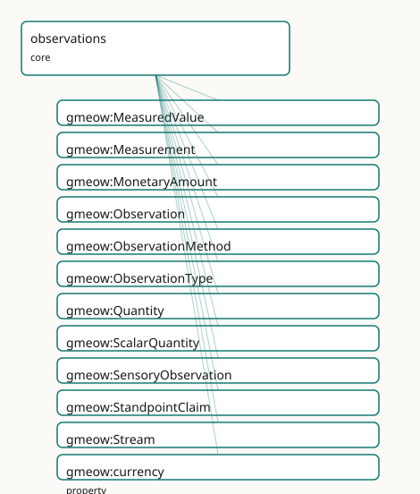

<!-- GENERATED by gmeow ontology-docs. DO NOT EDIT. -->

# GMEOW Observations Module

- **IRI:** <https://blackcatinformatics.ca/gmeow/slices/observations>
- **Tier:** core
- **[`Group`](../reference/classes/gmeow-Group.md):** core

## What This Slice Covers

This slice owns 47 terms and contributes 104 mapping or projection rows. Use it when its terms match the native fact you want to preserve; use the linkage tables to see how those facts leave GMEOW for consumer vocabularies.

## Dependencies

- [`gmeow:slices/entities`](entities.md)
- [`gmeow:slices/events`](events.md)
- [`gmeow:slices/kernel`](kernel.md)
- [`gmeow:slices/names`](names.md)
- [`gmeow:slices/places`](places.md)
- [`gmeow:slices/temporal`](temporal.md)

## Consumers

- The unified observation stance: every measured, claimed, or sensed value in any slice; the claim layer.

## Local Map



## Examples

### Temperature Reading

- **Source:** [`slices/core/observations/examples/temperature-reading.ttl`](https://github.com/Blackcat-Informatics/gmeow-ontology/blob/main/slices/core/observations/examples/temperature-reading.ttl)
- **GMEOW terms:** [`gmeow:Measurement`](../reference/classes/gmeow-Measurement.md), [`gmeow:Place`](../reference/classes/gmeow-Place.md), [`gmeow:ScalarQuantity`](../reference/classes/gmeow-ScalarQuantity.md), [`gmeow:SoftwareAgent`](../reference/classes/gmeow-SoftwareAgent.md), [`gmeow:hasUnit`](../reference/properties/gmeow-hasUnit.md), [`gmeow:methodInstrumentalReading`](../reference/individuals/gmeow-methodInstrumentalReading.md), [`gmeow:name`](../reference/properties/gmeow-name.md), [`gmeow:observationMethod`](../reference/properties/gmeow-observationMethod.md), [`gmeow:observationResult`](../reference/properties/gmeow-observationResult.md), [`gmeow:observedFeature`](../reference/properties/gmeow-observedFeature.md)
- **External prefixes:** `xsd`

```turtle
# SPDX-FileCopyrightText: 2026 Blackcat Informatics® Inc. <paudley@blackcatinformatics.ca>
# SPDX-License-Identifier: CC-BY-4.0
#
# Worked example: a measurement is a reified Observation (, P11). A
# gmeow:Measurement records WHAT was observed (gmeow:observedFeature), HOW
# (gmeow:observationMethod), and from WHERE (gmeow:vantage — the sensor). Its
# result is NOT a bare number on the observation: the scalar lives in an
# entity-valued gmeow:ScalarQuantity wrapper that bundles the value with its UNIT
# and uncertainty, so a temperature is never asserted free-floating (P11 — every
# value carries its frame). The unit is aligned to QUDT by reference (P5).
@prefix gmeow: <https://blackcatinformatics.ca/gmeow/> .
@prefix ex:    <https://blackcatinformatics.ca/gmeow/examples/observations/> .
@prefix xsd:   <http://www.w3.org/2001/XMLSchema#> .

ex:sensor a gmeow:SoftwareAgent ; gmeow:name "Rack temperature sensor 7"@en .
ex:room   a gmeow:Place ; gmeow:name "Server room A"@en .

# --- The measurement: observed feature, method, vantage, and an entity result.
ex:reading a gmeow:Measurement ;
    gmeow:observedFeature   ex:room ;
    gmeow:observationMethod gmeow:methodInstrumentalReading ;
    gmeow:vantage           ex:sensor ;
    gmeow:observationResult ex:temp .

# --- The result wrapper: value + unit + uncertainty, not a bare literal.
ex:temp a gmeow:ScalarQuantity ;
    gmeow:quantityValue       "22.5"^^xsd:decimal ;
    gmeow:quantityUncertainty "0.1"^^xsd:decimal ;
    gmeow:hasUnit             <http://qudt.org/vocab/unit/DEG_C> .
```

## Terms

### Classes

| Term | Label | Definition |
|---|---|---|
| [`gmeow:MeasuredValue`](../reference/classes/gmeow-MeasuredValue.md) | Measured Value | An alias for [`gmeow:Quantity`](../reference/classes/gmeow-Quantity.md) — the measured-value perspective on the same value×unit/frame×determinacy×provenance bundle. Equivalent to [`gmeow:Quantity`](../reference/classes/gmeow-Quantity.md) and... |
| [`gmeow:Measurement`](../reference/classes/gmeow-Measurement.md) | Measurement | An observation that assigns a quantitative or qualitative value to a feature of interest, typically carrying a unit, uncertainty, and determinacy model. The pa... |
| [`gmeow:MonetaryAmount`](../reference/classes/gmeow-MonetaryAmount.md) | Monetary Amount | A quantity of money expressed as a decimal value in an explicit currency reference frame. The canonical superset of [schema:MonetaryAmount](https://schema.org/MonetaryAmount) and [FIBO](../external/ontologies.md#target-fibo-fnd-pas-ps) fibo-fnd-acc... |
| [`gmeow:Observation`](../reference/classes/gmeow-Observation.md) | Observation | A reified act of observing, measuring, or asserting a feature of interest — the universal claim construct unifying spatial measurement, temporal dating, sensor... |
| [`gmeow:ObservationMethod`](../reference/classes/gmeow-ObservationMethod.md) | Observation Method | The method or protocol by which an observation was made — a value vocabulary (individuals, never subclasses). Generalizes [`gmeow:DatingMethod`](../reference/classes/gmeow-DatingMethod.md) (temporal module)... |
| [`gmeow:ObservationType`](../reference/classes/gmeow-ObservationType.md) | Observation Type | The kind of observation being made — a value vocabulary (individuals, never subclasses). Distinguishes measurement, sensory reading, standpoint claim, derived... |
| [`gmeow:Quantity`](../reference/classes/gmeow-Quantity.md) | Quantity | A universal scalar numeric value bundled with unit/frame, determinacy, and provenance — the synthesis of FRAME-GEN + DET-GEN + OBS. Equivalent to gmeow:S... |
| [`gmeow:ScalarQuantity`](../reference/classes/gmeow-ScalarQuantity.md) | Scalar Quantity | A scalar numeric value with a unit, determinacy model, and granularity — the entity-valued wrapper for literal observation results (temperatures, distances, co... |
| [`gmeow:SensoryObservation`](../reference/classes/gmeow-SensoryObservation.md) | Sensory Observation | An observation produced by a sensor or sensory apparatus reading a physical property of the environment. Specialises Observation with sensor-specific propertie... |
| [`gmeow:StandpointClaim`](../reference/classes/gmeow-StandpointClaim.md) | Standpoint Claim | An observation made from a specific standpoint or frame — an assertion, denial, or qualified position that a proposition holds. Realises the standpoint side of... |
| [`gmeow:Stream`](../reference/classes/gmeow-Stream.md) | Stream | A time-ordered sequence of observations or samples produced by a sensor or platform over a time interval. The ordering of samples is implicit via their individ... |

### Properties

| Term | Label | Definition |
|---|---|---|
| [`gmeow:currency`](../reference/properties/gmeow-currency.md) | currency | The currency reference frame in which this monetary amount is expressed. Functional: a MonetaryAmount is in exactly one currency frame. A subproperty of gmeow:... |
| [`gmeow:facetSubject`](../reference/properties/gmeow-facetSubject.md) | facet subject | The person an identity facet (gender identity, gender expression, sexual/romantic orientation) is about — the observedFeature of the claim. Domain is gmeow:Obs... |
| [`gmeow:facetVantage`](../reference/properties/gmeow-facetVantage.md) | facet vantage | The agent asserting an identity facet — the vantage of the claim. When [`gmeow:selfAsserted`](../reference/properties/gmeow-selfAsserted.md) is true, the facetVantage is the person themselves ([Principle 9](https://github.com/Blackcat-Informatics/gmeow-ontology/blob/main/CONSTITUTION.md#principle-9): self... |
| [`gmeow:hasStream`](../reference/properties/gmeow-hasStream.md) | has stream | Links an entity to a stream of observations or samples about it. Non-functional: an entity may have multiple co-existing streams from different platforms or se... |
| [`gmeow:isResultOf`](../reference/properties/gmeow-isResultOf.md) | is result of | Relates an entity (typically an observation result such as a quantity, coordinate set, or quality value) back to the Observation that produced it — the explici... |
| [`gmeow:monetaryValue`](../reference/properties/gmeow-monetaryValue.md) | monetary value | The numeric value of a monetary amount as an [xsd:decimal.](http://www.w3.org/2001/XMLSchema#decimal.) Functional: a MonetaryAmount has exactly one numeric value. |
| [`gmeow:observationEvent`](../reference/properties/gmeow-observationEvent.md) | observation event | The event during which the observation was made — a survey, a census, an excavation, a clinical trial. Links an observation to the temporal occurrence that pro... |
| [`gmeow:observationMethod`](../reference/properties/gmeow-observationMethod.md) | observation method | The method or protocol used to produce the observation. Functional: one method per observation (compound protocols are modelled as a single fused method indivi... |
| [`gmeow:observationResult`](../reference/properties/gmeow-observationResult.md) | observation result | The entity-valued result of an observation — a coordinate set, an instant, a quality value, a quantity, or another entity. For literal scalar readings (e.g. 22... |
| [`gmeow:observationType`](../reference/properties/gmeow-observationType.md) | observation type | The kind(s) of observation being made — measurement, sensory reading, standpoint claim, derived inference, etc. Non-functional: an observation may be both a me... |
| [`gmeow:observedFeature`](../reference/properties/gmeow-observedFeature.md) | observed feature | The individual whose property or state is being observed — the feature of interest. The range is intentionally open ([owl:Thing](http://www.w3.org/2002/07/owl#Thing)) because anything can be observe... |
| [`gmeow:quantityUncertainty`](../reference/properties/gmeow-quantityUncertainty.md) | quantity uncertainty | The uncertainty (e.g. ±1 sigma) of a scalar quantity, in the same unit as the quantity value. |
| [`gmeow:quantityValue`](../reference/properties/gmeow-quantityValue.md) | quantity value | The numeric value of a scalar quantity. |
| [`gmeow:streamInterval`](../reference/properties/gmeow-streamInterval.md) | stream interval | The time interval over which the stream was produced. Functional: the interval is constitutive of the stream's identity. |
| [`gmeow:streamOf`](../reference/properties/gmeow-streamOf.md) | stream of | The entity whose observations the stream contains — the moving feature, device, or thing being tracked. Functional: a stream belongs to exactly one entity. |
| [`gmeow:streamPlatform`](../reference/properties/gmeow-streamPlatform.md) | stream platform | The platform hosting the sensor(s) producing this stream — a vehicle, vessel, aircraft, buoy, or fixed station. Non-functional: a stream may migrate across pla... |
| [`gmeow:streamSample`](../reference/properties/gmeow-streamSample.md) | stream sample | Links a stream to an individual observation, location state, or other entity composing it. Non-functional: a stream typically has many samples, and multiple sa... |
| [`gmeow:streamSensor`](../reference/properties/gmeow-streamSensor.md) | stream sensor | The specific sensor or agent producing the stream. Non-functional: multiple sensors may contribute to one stream, and competing sensor claims coexist (Principl... |
| [`gmeow:vantage`](../reference/properties/gmeow-vantage.md) | vantage | The agent or standpoint from which the observation is made — the reified-object-property counterpart of [`gmeow:accordingTo`](../reference/properties/gmeow-accordingTo.md). Semantically, [`gmeow:vantage`](../reference/properties/gmeow-vantage.md) ⊑ gmeow:... |

### Individuals

| Term | Label | Definition |
|---|---|---|
| [`gmeow:methodComputationalModel`](../reference/individuals/gmeow-methodComputationalModel.md) | computational model | Observation derived from a computational or mathematical model. |
| [`gmeow:methodDirectObservation`](../reference/individuals/gmeow-methodDirectObservation.md) | direct observation | Observation by unaided human perception. |
| [`gmeow:methodExpertJudgement`](../reference/individuals/gmeow-methodExpertJudgement.md) | expert judgement | Observation based on expert assessment or consensus. |
| [`gmeow:methodInstrumentalReading`](../reference/individuals/gmeow-methodInstrumentalReading.md) | instrumental reading | Observation by a calibrated instrument or sensor. |
| [`gmeow:methodRemoteSensing`](../reference/individuals/gmeow-methodRemoteSensing.md) | remote sensing | Observation from a distance, typically satellite or aerial imagery. |
| [`gmeow:methodStreaming`](../reference/individuals/gmeow-methodStreaming.md) | streaming | Collection via a continuous or periodic streaming protocol. |
| [`gmeow:methodSurvey`](../reference/individuals/gmeow-methodSurvey.md) | survey | A systematic survey or census procedure. |
| [`gmeow:observationTypeDerived`](../reference/individuals/gmeow-observationTypeDerived.md) | derived inference | An observation produced by inference, calculation, or machine learning from other observations. |
| [`gmeow:observationTypeIdentity`](../reference/individuals/gmeow-observationTypeIdentity.md) | identity claim | An identity claim — gender identity, gender expression, sexual orientation, or romantic orientation — asserted by or about a person. |
| [`gmeow:observationTypeKinship`](../reference/individuals/gmeow-observationTypeKinship.md) | kinship claim | A claim about a kinship or genealogical relationship between persons. |
| [`gmeow:observationTypeMeasurement`](../reference/individuals/gmeow-observationTypeMeasurement.md) | measurement | A quantitative or qualitative measurement assigning a value to a feature. |
| [`gmeow:observationTypeNaming`](../reference/individuals/gmeow-observationTypeNaming.md) | naming claim | A claim about the appellation by which an entity is known in a given context. |
| [`gmeow:observationTypeRights`](../reference/individuals/gmeow-observationTypeRights.md) | rights claim | A claim about the rights, permissions, prohibitions, or duties governing an entity. |
| [`gmeow:observationTypeSensory`](../reference/individuals/gmeow-observationTypeSensory.md) | sensory reading | A reading from a sensor or sensory apparatus. |
| [`gmeow:observationTypeSimulation`](../reference/individuals/gmeow-observationTypeSimulation.md) | simulation output | An observation produced by computational simulation rather than direct measurement. |
| [`gmeow:observationTypeStandpoint`](../reference/individuals/gmeow-observationTypeStandpoint.md) | standpoint claim | An assertion made from a specific standpoint or frame. |
| [`gmeow:observationTypeStreaming`](../reference/individuals/gmeow-observationTypeStreaming.md) | streaming | A streaming observation — a member of a time-ordered sequence produced by a sensor or platform. |

## Linkages

- **Rows:** 104
- **Projection profiles:** `crmarchaeo`, `iptc`, `ivoa`, `loinc`, `qb`, `schema-org`, `sosa`
- **External vocabularies:** `bbc`, `crm`, `crmarc`, `crminf`, `fibo-fnd-acc-cur`, `iao`, `iptc`, `loinc`, `np`, `oa`, `obi`, `oboe`, `obscore`, `om`, `prov`, `qb`, `qudt`, `rdf`, `schema`, `snomed`, `sosa`, `sta`, `wd`

| Source | Kind | Profile | Predicate/Relation | Target | Evidence |
|---|---|---|---|---|---|
| [`gmeow:Measurement`](../reference/classes/gmeow-Measurement.md) | equivalence | `-` | [skos:closeMatch](http://www.w3.org/2004/02/skos/core#closeMatch) | [sosa:Observation](http://www.w3.org/ns/sosa/Observation) | `gmeow-observations.sssom.tsv`; `gmeow:eqObs007`; confidence 0.9 |
| [`gmeow:MonetaryAmount`](../reference/classes/gmeow-MonetaryAmount.md) | equivalence | `-` | [skos:closeMatch](http://www.w3.org/2004/02/skos/core#closeMatch) | [fibo-fnd-acc-cur:MonetaryAmount](https://spec.edmcouncil.org/fibo/ontology/FND/Accounting/CurrencyAmount/MonetaryAmount) | `gmeow-fibo.sssom.tsv`; `gmeow:eqFibo003`; confidence 0.85 |
| [`gmeow:MonetaryAmount`](../reference/classes/gmeow-MonetaryAmount.md) | equivalence | `-` | [skos:closeMatch](http://www.w3.org/2004/02/skos/core#closeMatch) | [schema:MonetaryAmount](https://schema.org/MonetaryAmount) | `gmeow-schema-org-finance.sssom.tsv`; `gmeow:eqSchemaOrgFin003`; confidence 0.85 |
| [`gmeow:Observation`](../reference/classes/gmeow-Observation.md) | equivalence | `-` | [skos:closeMatch](http://www.w3.org/2004/02/skos/core#closeMatch) | [crm:E13_Attribute_Assignment](http://www.cidoc-crm.org/cidoc-crm/E13_Attribute_Assignment) | `gmeow-observations.sssom.tsv`; `gmeow:eqObs012`; confidence 0.9 |
| [`gmeow:Observation`](../reference/classes/gmeow-Observation.md) | equivalence | `-` | [skos:closeMatch](http://www.w3.org/2004/02/skos/core#closeMatch) | [crmarc:S4_Observation](http://www.cidoc-crm.org/crmarchaeo/S4_Observation) | `gmeow-observations.sssom.tsv`; `gmeow:eqObs061`; confidence 0.85 |
| [`gmeow:Observation`](../reference/classes/gmeow-Observation.md) | equivalence | `-` | [skos:closeMatch](http://www.w3.org/2004/02/skos/core#closeMatch) | [oboe:Observation](http://ecoinformatics.org/oboe/oboe.1.2/oboe-core.owl#Observation) | `gmeow-observations.sssom.tsv`; `gmeow:eqObs057`; confidence 0.85 |
| [`gmeow:Observation`](../reference/classes/gmeow-Observation.md) | equivalence | `-` | [skos:closeMatch](http://www.w3.org/2004/02/skos/core#closeMatch) | [prov:Entity](http://www.w3.org/ns/prov#Entity) | `gmeow-observations.sssom.tsv`; `gmeow:eqObs009`; confidence 0.8 |
| [`gmeow:Observation`](../reference/classes/gmeow-Observation.md) | equivalence | `-` | [skos:closeMatch](http://www.w3.org/2004/02/skos/core#closeMatch) | [sosa:Observation](http://www.w3.org/ns/sosa/Observation) | `gmeow-observations.sssom.tsv`; `gmeow:eqObs001`; confidence 0.95 |
| [`gmeow:Observation`](../reference/classes/gmeow-Observation.md) | equivalence | `-` | [skos:broadMatch](http://www.w3.org/2004/02/skos/core#broadMatch) | [sosa:Sampling](http://www.w3.org/ns/sosa/Sampling) | `gmeow-observations.sssom.tsv`; `gmeow:eqObs030`; confidence 0.8 |
| [`gmeow:ObservationMethod`](../reference/classes/gmeow-ObservationMethod.md) | equivalence | `-` | [skos:closeMatch](http://www.w3.org/2004/02/skos/core#closeMatch) | [loinc:Method](http://loinc.org/rdf/Method) | `gmeow-observations.sssom.tsv`; `gmeow:eqObs074`; confidence 0.85 |
| [`gmeow:ObservationMethod`](../reference/classes/gmeow-ObservationMethod.md) | equivalence | `-` | [skos:closeMatch](http://www.w3.org/2004/02/skos/core#closeMatch) | [sosa:Procedure](http://www.w3.org/ns/sosa/Procedure) | `gmeow-observations.sssom.tsv`; `gmeow:eqObs006`; confidence 0.85 |
| [`gmeow:Quantity`](../reference/classes/gmeow-Quantity.md) | equivalence | `-` | [skos:closeMatch](http://www.w3.org/2004/02/skos/core#closeMatch) | [qudt:QuantityValue](http://qudt.org/schema/qudt/QuantityValue) | `gmeow-qudt.sssom.tsv`; `gmeow:eqQudt004`; confidence 0.85 |
| [`gmeow:Quantity`](../reference/classes/gmeow-Quantity.md) | equivalence | `-` | [skos:closeMatch](http://www.w3.org/2004/02/skos/core#closeMatch) | [sosa:Result](http://www.w3.org/ns/sosa/Result) | `gmeow-observations.sssom.tsv`; `gmeow:eqObs019`; confidence 0.7 |
| [`gmeow:ScalarQuantity`](../reference/classes/gmeow-ScalarQuantity.md) | equivalence | `-` | [skos:relatedMatch](http://www.w3.org/2004/02/skos/core#relatedMatch) | [loinc:Quantity](http://loinc.org/rdf/Quantity) | `gmeow-observations.sssom.tsv`; `gmeow:eqObs075`; confidence 0.75 |
| [`gmeow:ScalarQuantity`](../reference/classes/gmeow-ScalarQuantity.md) | equivalence | `-` | [skos:relatedMatch](http://www.w3.org/2004/02/skos/core#relatedMatch) | [obscore:observable](http://www.ivoa.net/rdf/ObsCore#observable) | `gmeow-observations.sssom.tsv`; `gmeow:eqObs067`; confidence 0.7 |
| [`gmeow:ScalarQuantity`](../reference/classes/gmeow-ScalarQuantity.md) | equivalence | `-` | [skos:relatedMatch](http://www.w3.org/2004/02/skos/core#relatedMatch) | [om:Measure](http://www.wurvoc.org/vocabularies/om-1.8/Measure) | `gmeow-observations.sssom.tsv`; `gmeow:eqObs040`; confidence 0.7 |
| [`gmeow:ScalarQuantity`](../reference/classes/gmeow-ScalarQuantity.md) | equivalence | `-` | [skos:closeMatch](http://www.w3.org/2004/02/skos/core#closeMatch) | [sosa:Result](http://www.w3.org/ns/sosa/Result) | `gmeow-observations.sssom.tsv`; `gmeow:eqObs008`; confidence 0.7 |
| [`gmeow:SensoryObservation`](../reference/classes/gmeow-SensoryObservation.md) | equivalence | `-` | [skos:relatedMatch](http://www.w3.org/2004/02/skos/core#relatedMatch) | [loinc:LabTest](http://loinc.org/rdf/LabTest) | `gmeow-observations.sssom.tsv`; `gmeow:eqObs072`; confidence 0.8 |
| [`gmeow:SensoryObservation`](../reference/classes/gmeow-SensoryObservation.md) | equivalence | `-` | [skos:closeMatch](http://www.w3.org/2004/02/skos/core#closeMatch) | [obscore:ObsDataset](http://www.ivoa.net/rdf/ObsCore#ObsDataset) | `gmeow-observations.sssom.tsv`; `gmeow:eqObs063`; confidence 0.85 |
| [`gmeow:SensoryObservation`](../reference/classes/gmeow-SensoryObservation.md) | equivalence | `-` | [skos:closeMatch](http://www.w3.org/2004/02/skos/core#closeMatch) | [qb:Observation](http://purl.org/linked-data/cube#Observation) | `gmeow-observations.sssom.tsv`; `gmeow:eqObs054`; confidence 0.75 |
| [`gmeow:SensoryObservation`](../reference/classes/gmeow-SensoryObservation.md) | equivalence | `-` | [skos:relatedMatch](http://www.w3.org/2004/02/skos/core#relatedMatch) | snomed:404684003 | `gmeow-observations.sssom.tsv`; `gmeow:eqObs077`; confidence 0.75 |
| [`gmeow:SensoryObservation`](../reference/classes/gmeow-SensoryObservation.md) | equivalence | `-` | [skos:closeMatch](http://www.w3.org/2004/02/skos/core#closeMatch) | [sosa:Observation](http://www.w3.org/ns/sosa/Observation) | `gmeow-sensory-environment.sssom.tsv`; `gmeow:eqSenv001`; confidence 0.95 |
| [`gmeow:StandpointClaim`](../reference/classes/gmeow-StandpointClaim.md) | equivalence | `-` | [skos:relatedMatch](http://www.w3.org/2004/02/skos/core#relatedMatch) | [bbc:NewsEvent](http://www.bbc.co.uk/ontologies/news/NewsEvent) | `gmeow-observations.sssom.tsv`; `gmeow:eqObs068`; confidence 0.75 |
| [`gmeow:StandpointClaim`](../reference/classes/gmeow-StandpointClaim.md) | equivalence | `-` | [skos:closeMatch](http://www.w3.org/2004/02/skos/core#closeMatch) | [crminf:I2_Belief](http://www.ics.forth.gr/isl/CRMinf/I2_Belief) | `gmeow-ai.sssom.tsv`; `gmeow:eqAi002`; confidence 0.7 |
|... |... |... |... |... | 80 more rows |

## Guide

<!-- SPDX-FileCopyrightText: 2026 Blackcat Informatics® Inc. <paudley@blackcatinformatics.ca> -->
<!-- SPDX-License-Identifier: CC-BY-4.0 -->

# Observations — the universal claim relator

> **Slice:** `https://blackcatinformatics.ca/gmeow/slices/observations` · **tier: core**
> One reified structure for every measured, sensed, claimed, or asserted value in the graph.

Most vocabularies scatter their claim machinery: SOSA for sensor readings, CIDOC E13 for
attribute assignments, bespoke relators for names, rights, and identities. GMEOW collapses
them into **one** structure — `[`Observation`](../reference/classes/gmeow-Observation.md) ≡ [`Measurement`](../reference/classes/gmeow-Measurement.md) ≡ [`Standpoint`](../reference/classes/gmeow-Standpoint.md) ≡ [`IdentityFacet`](../reference/classes/gmeow-IdentityFacet.md) ≡
[`NameUsage`](../reference/classes/gmeow-NameUsage.md) ≡ [`RightsStatement`](../reference/classes/gmeow-RightsStatement.md) ≡ [`KinRelationship`](../reference/classes/gmeow-KinRelationship.md)` ([Principle 9](https://github.com/Blackcat-Informatics/gmeow-ontology/blob/main/CONSTITUTION.md#principle-9): every vantage is a co-equal
facet; no frame is privileged). An observation is a reified [`gufo:Relator`](../external/terms.md#gufo-relator) mediating a
**vantage** (who holds it), an **[`observedFeature`](../reference/properties/gmeow-observedFeature.md)** (what it is about), and an
**[`observationResult`](../reference/properties/gmeow-observationResult.md)** (what was found). SOSA/SSN, [PROV-O](../external/ontologies.md#target-prov), and CIDOC E13 are aligned by
reference ([Principle 5](https://github.com/Blackcat-Informatics/gmeow-ontology/blob/main/CONSTITUTION.md#principle-5)).

This slice is the **Claim** end of the claim spine (Source → [`Chunk`](../reference/classes/gmeow-Chunk.md) → [`EvidenceSpan`](../reference/classes/gmeow-EvidenceSpan.md) → Claim,
[Principle 14](https://github.com/Blackcat-Informatics/gmeow-ontology/blob/main/CONSTITUTION.md#principle-14)): an LLM output, a sensor reading, and a census entry are all observations —
stored with a vantage, never adjudicated by rank. The slice is also home to the universal
[`Quantity`](../reference/classes/gmeow-Quantity.md)/MeasuredValue construct (every scalar value travels as a
value × unit/frame × determinacy × provenance bundle, never a bare literal.

## The core relator

### [`gmeow:Observation`](../reference/classes/gmeow-Observation.md)

The universal claim construct: a [`gufo:Kind`](../external/terms.md#gufo-kind) under [`gufo:Relator`](../external/terms.md#gufo-relator). EL-axiomatised to
mediate at least one vantage and one feature (open-world); the closed-world "exactly one"
cardinality is SHACL's concern ([Principle 7](https://github.com/Blackcat-Informatics/gmeow-ontology/blob/main/CONSTITUTION.md#principle-7)). Competing observations of the same feature
coexist rather than collapse — disagreement is data.

### [`gmeow:vantage`](../reference/properties/gmeow-vantage.md)

The agent or standpoint the observation is made from — the reified counterpart of the
[`gmeow:accordingTo`](../reference/properties/gmeow-accordingTo.md) annotation axis. The flat↔reified pairing is documented, not
axiomatised: [`accordingTo`](../reference/properties/gmeow-accordingTo.md) is an annotation property (keeping the OWL 2 DL downcast clean,
Principles 2–3), so vantage ⊑ [`accordingTo`](../reference/properties/gmeow-accordingTo.md) is realised in the projection layer. Range is
[`gmeow:Entity`](../reference/classes/gmeow-Entity.md): a vantage may be a bare agent or a first-class [`Standpoint`](../reference/classes/gmeow-Standpoint.md). Non-functional —
joint observations are valid.

### [`gmeow:observedFeature`](../reference/properties/gmeow-observedFeature.md)

The feature of interest — deliberately [`owl:Thing`](http://www.w3.org/2002/07/owl#Thing)-ranged, because anything can be
observed: a place, a person, a proposition, a quality value. Per-kind narrowing is SHACL's
job, not the open ontology's.

### [`gmeow:observationResult`](../reference/properties/gmeow-observationResult.md) · [`gmeow:isResultOf`](../reference/properties/gmeow-isResultOf.md)

The entity-valued result (a coordinate set, an instant, a quantity) and its inverse — the
explicit provenance leg of the bundle. Uniformly entity-valued: scalar literals
live on a [`ScalarQuantity`](../reference/classes/gmeow-ScalarQuantity.md), never directly on the observation. Non-functional: one
observation may yield results in several frames; one consensus result may flow from many
observations. A property chain ([`isResultOf`](../reference/properties/gmeow-isResultOf.md) ∘ [`hasReferenceFrame`](../reference/properties/gmeow-hasReferenceFrame.md) ⊑ [`hasReferenceFrame`](../reference/properties/gmeow-hasReferenceFrame.md))
lets results inherit the observation's reference frame ([Principle 11](https://github.com/Blackcat-Informatics/gmeow-ontology/blob/main/CONSTITUTION.md#principle-11)).

### [`gmeow:observationMethod`](../reference/properties/gmeow-observationMethod.md) · [`gmeow:observationType`](../reference/properties/gmeow-observationType.md)

*How* it was done versus *what kind* of act it was — both open value vocabularies
(individuals, never subclasses). Method is functional and constitutive: a different method
is a different observation. Type is non-functional: a calibrated reading can be both
measurement and derived inference. Seeds cover measurement, sensory, standpoint, derived,
simulation, identity, naming, rights, kinship, and streaming.

### [`gmeow:Measurement`](../reference/classes/gmeow-Measurement.md) · [`gmeow:SensoryObservation`](../reference/classes/gmeow-SensoryObservation.md) · [`gmeow:StandpointClaim`](../reference/classes/gmeow-StandpointClaim.md)

The shared specialisation spine, declared here so every consumer slice (temporal, places,
sensory, standpoint) deepens the *same* parent. [`StandpointClaim`](../reference/classes/gmeow-StandpointClaim.md) is the assertion form:
vantage = the standpoint, [`observedFeature`](../reference/properties/gmeow-observedFeature.md) = the proposition, [`observationResult`](../reference/properties/gmeow-observationResult.md) = the
modality (unequivocal, probable, conceivable, refuted) — the structure the deception and
falsehood doctrine builds on.

### [`gmeow:facetSubject`](../reference/properties/gmeow-facetSubject.md) · [`gmeow:facetVantage`](../reference/properties/gmeow-facetVantage.md)

The bridge idiom: domain relators ([`IdentityFacet`](../reference/classes/gmeow-IdentityFacet.md), [`NameUsage`](../reference/classes/gmeow-NameUsage.md), [`RightsStatement`](../reference/classes/gmeow-RightsStatement.md),
[`VersionMembership`](../reference/classes/gmeow-VersionMembership.md)) plug their role properties into the core roles via [`rdfs:subPropertyOf`](http://www.w3.org/2000/01/rdf-schema#subPropertyOf)
([`facetSubject`](../reference/properties/gmeow-facetSubject.md) ⊑ [`observedFeature`](../reference/properties/gmeow-observedFeature.md), [`facetVantage`](../reference/properties/gmeow-facetVantage.md) ⊑ vantage, likewise [`usageNamer`](../reference/properties/gmeow-usageNamer.md),
[`usageAppellation`](../reference/properties/gmeow-usageAppellation.md), [`statementAbout`](../reference/properties/gmeow-statementAbout.md), [`membershipAuthority`](../reference/properties/gmeow-membershipAuthority.md)). A generic consumer asks "all
observations about Alice" and gets her names, rights, identities, and coordinates without
knowing any domain vocabulary. When [`gmeow:selfAsserted`](../reference/properties/gmeow-selfAsserted.md) is true, the [`facetVantage`](../reference/properties/gmeow-facetVantage.md) is the
person themselves — self-assertion is top authority ([Principle 9](https://github.com/Blackcat-Informatics/gmeow-ontology/blob/main/CONSTITUTION.md#principle-9)).

## Streams and scalar results

### [`gmeow:Stream`](../reference/classes/gmeow-Stream.md)

A time-ordered observation sequence — [`streamOf`](../reference/properties/gmeow-streamOf.md) exactly one tracked entity,
composed via [`streamSample`](../reference/properties/gmeow-streamSample.md), hosted on a [`streamPlatform`](../reference/properties/gmeow-streamPlatform.md), produced by a [`streamSensor`](../reference/properties/gmeow-streamSensor.md)
over a [`streamInterval`](../reference/properties/gmeow-streamInterval.md). Ordering is implicit in sample timestamps, never an asserted list
([Principle 12](https://github.com/Blackcat-Informatics/gmeow-ontology/blob/main/CONSTITUTION.md#principle-12)); deriving a continuous trajectory from the stream is the solver's job.

### [`gmeow:Quantity`](../reference/classes/gmeow-Quantity.md) · [`gmeow:ScalarQuantity`](../reference/classes/gmeow-ScalarQuantity.md) · [`gmeow:MeasuredValue`](../reference/classes/gmeow-MeasuredValue.md)

Three equivalent names for one construct — the domain-neutral scalar bundle:
[`gmeow:quantityValue`](../reference/properties/gmeow-quantityValue.md) (+ [`gmeow:quantityUncertainty`](../reference/properties/gmeow-quantityUncertainty.md)) for the number, [`hasUnit`](../reference/properties/gmeow-hasUnit.md) /
[`hasReferenceFrame`](../reference/properties/gmeow-hasReferenceFrame.md) for the frame ([Principle 11](https://github.com/Blackcat-Informatics/gmeow-ontology/blob/main/CONSTITUTION.md#principle-11)), [`hasDeterminacy`](../reference/properties/gmeow-hasDeterminacy.md) for ontic vagueness,
[`isResultOf`](../reference/properties/gmeow-isResultOf.md) for provenance. Temperatures, counts, probabilities, masses — all of them,
one shape.

### [`gmeow:MonetaryAmount`](../reference/classes/gmeow-MonetaryAmount.md)

Promoted to core in the dependency surgery: money is frame-relative quantity
machinery, not finance-domain. [`gmeow:monetaryValue`](../reference/properties/gmeow-monetaryValue.md) carries the decimal;
[`gmeow:currency`](../reference/properties/gmeow-currency.md) (⊑ [`hasReferenceFrame`](../reference/properties/gmeow-hasReferenceFrame.md), functional) names the currency frame — a value
without its currency is ill-formed ([Principle 11](https://github.com/Blackcat-Informatics/gmeow-ontology/blob/main/CONSTITUTION.md#principle-11)). Canonical superset of
[schema:MonetaryAmount](https://schema.org/MonetaryAmount) and the [FIBO](../external/ontologies.md#target-fibo-fnd-pas-ps) monetary amount.

## Solver boundary & alignment

Aggregation, calibration, consensus derivation, trajectory reconstruction, and
inter-frame conversion are computations, never assertions ([Principle 12](https://github.com/Blackcat-Informatics/gmeow-ontology/blob/main/CONSTITUTION.md#principle-12)): the slice
records co-existing observations; the solver layer ranks, fuses, or projects them per
consumer policy. Suppressing a contested observation is projection-time filtering, never
erasure ([Principle 10](https://github.com/Blackcat-Informatics/gmeow-ontology/blob/main/CONSTITUTION.md#principle-10)).

## Dependencies

Depends on `kernel`, `entities`, `events`, `names`, `places`, and `temporal`. Consumed by
every slice that measures, claims, or senses anything — which is to say, by every slice;
the AI claim layer is its flagship consumer.
