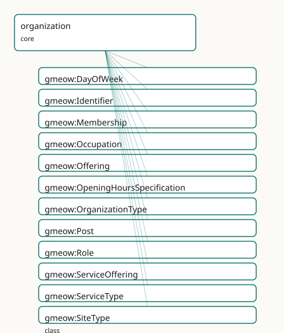

<!-- GENERATED by gmeow ontology-docs. DO NOT EDIT. Source hash: c99d8d50c0344040. -->

# GMEOW Organization Module

- **IRI:** <https://blackcatinformatics.ca/gmeow/slices/organization>
- **Tier:** core
- **[`Group`](../reference/classes/gmeow-Group.md):** core

## What This Slice Covers

This slice owns 67 terms and contributes 128 mapping or projection rows. Use it when its terms match the native fact you want to preserve; use the linkage tables to see how those facts leave GMEOW for consumer vocabularies.

## Dependencies

- [`gmeow:slices/entities`](entities.md)
- [`gmeow:slices/events`](events.md)
- [`gmeow:slices/kernel`](kernel.md)
- [`gmeow:slices/places`](places.md)

## Consumers

- Employers, publishers, registrars across slices; posts and roles; the W3C-ORG projection.

## Local Map



## Examples

### Post And Membership

- **Source:** [`slices/core/organization/examples/post-and-membership.ttl`](https://github.com/Blackcat-Informatics/gmeow-ontology/blob/main/slices/core/organization/examples/post-and-membership.ttl)
- **GMEOW terms:** [`gmeow:Membership`](../reference/classes/gmeow-Membership.md), [`gmeow:Organization`](../reference/classes/gmeow-Organization.md), [`gmeow:Person`](../reference/classes/gmeow-Person.md), [`gmeow:Post`](../reference/classes/gmeow-Post.md), [`gmeow:fillsPost`](../reference/properties/gmeow-fillsPost.md), [`gmeow:membershipMember`](../reference/properties/gmeow-membershipMember.md), [`gmeow:membershipOrganization`](../reference/properties/gmeow-membershipOrganization.md), [`gmeow:name`](../reference/properties/gmeow-name.md), [`gmeow:organizationType`](../reference/properties/gmeow-organizationType.md), [`gmeow:organizationTypeCompany`](../reference/individuals/gmeow-organizationTypeCompany.md)

```turtle
# SPDX-FileCopyrightText: 2026 Blackcat Informatics® Inc. <paudley@blackcatinformatics.ca>
# SPDX-License-Identifier: CC-BY-4.0
#
# Worked example: the seat is not the sitter . GMEOW de-conflates the two
# things surface vocabularies collapse into "CFO": the gmeow:Post (the seat, a
# RoleMixin that exists whether or not anyone fills it) and the gmeow:Membership
# (a person's tenure occupying it). The membership gmeow:fillsPost the post, so a
# vacancy (a Post with no Membership) and a succession (two Memberships filling
# one Post) are both expressible. organizationType is an open VALUE (a company is
# a company by value, not by subclass), and subOrganizationOf decomposes the org
# structurally — distinct from "is a member of".
@prefix gmeow: <https://blackcatinformatics.ca/gmeow/> .
@prefix ex:    <https://blackcatinformatics.ca/gmeow/examples/organization/> .
@prefix rdfs:  <http://www.w3.org/2000/01/rdf-schema#> .

# --- The company and a structural sub-organization.
ex:acme a gmeow:Organization ;
    gmeow:name "Acme Robotics Inc."@en ;
    gmeow:organizationType gmeow:organizationTypeCompany .

ex:engineering a gmeow:Organization ;
    gmeow:name "Engineering Division"@en ;
    gmeow:organizationType gmeow:organizationTypeCompany ;
    gmeow:subOrganizationOf ex:acme .

# --- The CFO Post: the seat, defined independently of who holds it.
ex:cfoPost a gmeow:Post ;
    rdfs:label "Chief Financial Officer"@en ;
    gmeow:postIn ex:acme .

# --- The person, and the Membership that fills the seat — the sitter, distinct
#     from the chair. A later tenure would be ANOTHER Membership filling the same
#     Post; a vacancy would leave the Post with no Membership at all.
ex:dana a gmeow:Person ;
    gmeow:name "Dana Reyes"@en .

ex:danaTenure a gmeow:Membership ;
    gmeow:membershipMember ex:dana ;
    gmeow:membershipOrganization ex:acme ;
    gmeow:fillsPost ex:cfoPost .
```

## Terms

### Classes

| Term | Label | Definition |
|---|---|---|
| [`gmeow:DayOfWeek`](../reference/classes/gmeow-DayOfWeek.md) | Day Of Week | A day of the week — a VALUE vocabulary (the seven ISO-8601 days as individuals); projects to [schema:dayOfWeek.](https://schema.org/dayOfWeek.) |
| [`gmeow:Identifier`](../reference/classes/gmeow-Identifier.md) | Identifier | A reified external-identifier record bundling a scheme-local value with its scheme, and optionally the authority URL that resolves it and a human-readable name... |
| [`gmeow:Membership`](../reference/classes/gmeow-Membership.md) | Membership | The reified relationship by which an agent is a member of an organization, optionally playing a role over a period of time. |
| [`gmeow:Occupation`](../reference/classes/gmeow-Occupation.md) | Occupation | A kind of work or profession, such as those classified by ESCO, SOC, or O*NET. Classifications are carried as open code values ([`gmeow:occupationClassification`](../reference/properties/gmeow-occupationClassification.md))... |
| [`gmeow:Offering`](../reference/classes/gmeow-Offering.md) | Offering | A commercial offer to provide some item — a product, a service, an engagement — by an agent. Projects to [schema:Offer.](https://schema.org/Offer.) The item is named by [`gmeow:itemOffered`](../reference/properties/gmeow-itemOffered.md);... |
| [`gmeow:OpeningHoursSpecification`](../reference/classes/gmeow-OpeningHoursSpecification.md) | Opening Hours Specification | A reified opening-hours window — a day (or set of days), an opening time and a closing time. Projects to [schema:OpeningHoursSpecification.](https://schema.org/OpeningHoursSpecification.) Reification keeps ea... |
| [`gmeow:OrganizationType`](../reference/classes/gmeow-OrganizationType.md) | Organization Type | The kind of an organization — a VALUE, never an Organization subclass. The set is open; a kind not among the seed individuals is a FRESH [`gmeow:OrganizationType`](../reference/classes/gmeow-OrganizationType.md)... |
| [`gmeow:Post`](../reference/classes/gmeow-Post.md) | Post | A seat or position that exists independently of who currently holds it — the CFO chair is not the person now in it. A Post bundles a [`gmeow:Role`](../reference/classes/gmeow-Role.md) within a specif... |
| [`gmeow:Role`](../reference/classes/gmeow-Role.md) | Role | A function or position an agent plays in some context, such as a job title or organizational role. |
| [`gmeow:ServiceOffering`](../reference/classes/gmeow-ServiceOffering.md) | Service Offering | A service an agent provides — consulting, support, hosting. Distinct from [`gmeow:Service`](../reference/classes/gmeow-Service.md) (the documents-slice creative-work sense); this is the commercia... |
| [`gmeow:ServiceType`](../reference/classes/gmeow-ServiceType.md) | Service Type | The kind of a service offering — a VALUE vocabulary (individuals, never subclasses); open set (consulting, hosting, support, …). |
| [`gmeow:SiteType`](../reference/classes/gmeow-SiteType.md) | Site Type | The purpose of an organization's site — headquarters, branch, registered office, etc. A value, not a subclass. |

### Properties

| Term | Label | Definition |
|---|---|---|
| [`gmeow:acceptsCurrency`](../reference/properties/gmeow-acceptsCurrency.md) | accepts currency | Relates an organization to a currency it accepts for payment — a currency reference frame (a member of [`gmeow:frameRealmCurrency`](../reference/individuals/gmeow-frameRealmCurrency.md), e.g. [`gmeow:referenceFrameUSD`](../reference/individuals/gmeow-referenceFrameUSD.md)),... |
| [`gmeow:acceptsPaymentMethod`](../reference/properties/gmeow-acceptsPaymentMethod.md) | accepts payment method | Relates an organization to a payment method it accepts — reusing the finance-slice [`gmeow:PaymentMethod`](../reference/classes/gmeow-PaymentMethod.md) individuals (cash, credit card, bank transfer, cryptocur... |
| [`gmeow:alumniOf`](../reference/properties/gmeow-alumniOf.md) | alumnus of | An organization — typically educational — a person is an alumnus/alumna of ([schema:alumniOf](https://schema.org/alumniOf); the inverse projects to [schema:alumni](https://schema.org/alumni)). A past-affiliation relatio... |
| [`gmeow:areaServed`](../reference/properties/gmeow-areaServed.md) | area served | The geographic area an offering or service serves — a [`gmeow:Location`](../reference/classes/gmeow-Location.md). Non-functional. Projects to [schema:areaServed.](https://schema.org/areaServed.) |
| [`gmeow:closesAt`](../reference/properties/gmeow-closesAt.md) | closes at | The closing time of an opening-hours window. Projects to [schema:closes.](https://schema.org/closes.) |
| [`gmeow:fillsPost`](../reference/properties/gmeow-fillsPost.md) | fills post | Relates a membership to the post (seat) the member occupies. The sitter is the member via [`gmeow:membershipMember`](../reference/properties/gmeow-membershipMember.md); the seat is the Post. Non-functional: a joint... |
| [`gmeow:foundedBy`](../reference/properties/gmeow-foundedBy.md) | founded by | Relates an organization to an agent who founded it. Non-functional: several co-founders coexist, and competing standpoint-indexed founding claims coexist (P9).... |
| [`gmeow:founderOf`](../reference/properties/gmeow-founderOf.md) | founder of | Relates an agent to an organization it founded. Inverse of [`gmeow:foundedBy`](../reference/properties/gmeow-foundedBy.md). |
| [`gmeow:hasIdentifier`](../reference/properties/gmeow-hasIdentifier.md) | has identifier | Relates an entity to a reified external-identifier record (an ORCID, geni id, nip05, LEI, industry code, …). Domain is [`gmeow:Entity`](../reference/classes/gmeow-Entity.md): persons, organizations, wo... |
| [`gmeow:hasMember`](../reference/properties/gmeow-hasMember.md) | has member | Relates an organization to one of its member agents; the inverse of memberOf. |
| [`gmeow:hasOpeningHours`](../reference/properties/gmeow-hasOpeningHours.md) | has opening hours | Relates an offering (or the org/place behind it) to an opening-hours window. Non-functional: several windows coexist. |
| [`gmeow:hasRole`](../reference/properties/gmeow-hasRole.md) | has role | Relates a membership to the role the member plays. |
| [`gmeow:hasSite`](../reference/properties/gmeow-hasSite.md) | has site | Relates an organization to a location it occupies or operates from — a headquarters, branch, or registered office. Reuses the places module's [`gmeow:Location`](../reference/classes/gmeow-Location.md). N... |
| [`gmeow:identifierScheme`](../reference/properties/gmeow-identifierScheme.md) | identifier scheme | The scheme of an identifier — e.g. 'lei', 'ror', 'naics', 'isicV4', 'companyRegistration', 'wikidata'. Declared on the Identifier node, not the Organization, t... |
| [`gmeow:identifierUrl`](../reference/properties/gmeow-identifierUrl.md) | identifier url | The authority URL that resolves an identifier record — e.g. the geni profile page, the ORCID record URL, the ROR landing page. The resolvable counterpart of th... |
| [`gmeow:identifierValue`](../reference/properties/gmeow-identifierValue.md) | identifier value | The literal value of an identifier — e.g. '529900T8BM49AURSDO55' or '541511'. |
| [`gmeow:industryClassification`](../reference/properties/gmeow-industryClassification.md) | industry classification | Relates an organization to an industry-classification identifier — a NAICS, ISIC, or schema.org industry code. The scheme is declared via gmeow:identifierSchem... |
| [`gmeow:itemOffered`](../reference/properties/gmeow-itemOffered.md) | item offered | The item an offering provides — a [`gmeow:ServiceOffering`](../reference/classes/gmeow-ServiceOffering.md), a product, or any entity. Projects to [schema:itemOffered.](https://schema.org/itemOffered.) |
| [`gmeow:jurisdiction`](../reference/properties/gmeow-jurisdiction.md) | jurisdiction | The legal or regulatory jurisdiction of a specific identifier (e.g., company registration jurisdiction) — a country, state, province, or other [`gmeow:Location`](../reference/classes/gmeow-Location.md).... |
| [`gmeow:legalIdentifier`](../reference/properties/gmeow-legalIdentifier.md) | legal identifier | Relates an organization to a legal identifier — a LEI, ROR ID, company-registration number, or other scheme-specific code. The scheme is declared via gmeow:ide... |
| [`gmeow:makesOffer`](../reference/properties/gmeow-makesOffer.md) | makes offer | Relates an agent to an offering it makes. Non-functional. Projects to [schema:makesOffer.](https://schema.org/makesOffer.) |
| [`gmeow:memberOf`](../reference/properties/gmeow-memberOf.md) | member of | Relates an agent to an organization it belongs to. |
| [`gmeow:membershipMember`](../reference/properties/gmeow-membershipMember.md) | membership member | The agent whose membership a [`gmeow:Membership`](../reference/classes/gmeow-Membership.md) reifies. Functional — a membership concerns one member (the relator's member role); the flat [`gmeow:memberOf`](../reference/properties/gmeow-memberOf.md) is th... |
| [`gmeow:membershipOrganization`](../reference/properties/gmeow-membershipOrganization.md) | membership organization | The organization a [`gmeow:Membership`](../reference/classes/gmeow-Membership.md) is in. Functional — a membership concerns one organization (which may be a department, i.e. a [`gmeow:subOrganizationOf`](../reference/properties/gmeow-subOrganizationOf.md) a lar... |
| [`gmeow:offeringProvider`](../reference/properties/gmeow-offeringProvider.md) | offering provider | The agent that provides an offering or service. Projects to [schema:provider.](https://schema.org/provider.) |
| [`gmeow:openingDay`](../reference/properties/gmeow-openingDay.md) | opening day | A day this opening-hours window applies to — a [`gmeow:DayOfWeek`](../reference/classes/gmeow-DayOfWeek.md) value. Non-functional (a window may span several days). Projects to [schema:dayOfWeek.](https://schema.org/dayOfWeek.) |
| [`gmeow:opensAt`](../reference/properties/gmeow-opensAt.md) | opens at | The opening time of an opening-hours window. Projects to [schema:opens.](https://schema.org/opens.) |
| [`gmeow:organizationPurpose`](../reference/properties/gmeow-organizationPurpose.md) | organization purpose | A free-text statement of an organization's purpose, mission, or objective. |
| [`gmeow:organizationType`](../reference/properties/gmeow-organizationType.md) | organization type | The kind(s) of an organization (one or more [`gmeow:OrganizationType`](../reference/classes/gmeow-OrganizationType.md) individuals). Non-functional: a single organization may be both a company and an educational... |
| [`gmeow:ownedBy`](../reference/properties/gmeow-ownedBy.md) | owned by | Relates something to an agent that owns it. Inverse of [`gmeow:ownerOf`](../reference/properties/gmeow-ownerOf.md). |
| [`gmeow:ownerOf`](../reference/properties/gmeow-ownerOf.md) | owner of | Relates an agent to something it owns — an organization, an asset, a work. Non-functional and standpoint-indexable (contested ownership coexists, P9). The flat... |
| [`gmeow:postIn`](../reference/properties/gmeow-postIn.md) | post in | The organization a post belongs to. Functional — a post concerns exactly one organization. |
| [`gmeow:predecessorOrganization`](../reference/properties/gmeow-predecessorOrganization.md) | predecessor organization | An organization that ceases or transforms in a multi-organization change event — a merger, split, spin-off, acquisition, or rename. Non-functional: a merger ha... |
| [`gmeow:priceRange`](../reference/properties/gmeow-priceRange.md) | price range | A coarse, human-readable indication of a business's price level — e.g. '$$', '$$$', or '$10–$50'. A presentational summary, deliberately NOT a structured price... |
| [`gmeow:serviceType`](../reference/properties/gmeow-serviceType.md) | service type | The kind(s) of a service offering — open [`gmeow:ServiceType`](../reference/classes/gmeow-ServiceType.md) values. Non-functional. Projects to [schema:serviceType.](https://schema.org/serviceType.) |
| [`gmeow:siteType`](../reference/properties/gmeow-siteType.md) | site type | The purpose of a location when used as an organizational site — headquarters, branch, registered office. Non-functional: a single location may serve multiple p... |
| [`gmeow:slogan`](../reference/properties/gmeow-slogan.md) | slogan | A promotional tagline or motto an agent presents itself by — the short marketing phrase of an organization (or person/brand). A flat, displayable literal (lang... |
| [`gmeow:subOrganizationOf`](../reference/properties/gmeow-subOrganizationOf.md) | sub-organization of | Relates an organization to a larger organization it is part of — a department or division within a company, a team within a department. Transitive (a team is p... |
| [`gmeow:successorOrganization`](../reference/properties/gmeow-successorOrganization.md) | successor organization | An organization that begins or results from a multi-organization change event. Non-functional: a split has several successors, and competing standpoint-indexed... |

### Individuals

| Term | Label | Definition |
|---|---|---|
| [`gmeow:dayFriday`](../reference/individuals/gmeow-dayFriday.md) | Friday | Friday. |
| [`gmeow:dayMonday`](../reference/individuals/gmeow-dayMonday.md) | Monday | Monday. |
| [`gmeow:daySaturday`](../reference/individuals/gmeow-daySaturday.md) | Saturday | Saturday. |
| [`gmeow:daySunday`](../reference/individuals/gmeow-daySunday.md) | Sunday | Sunday. |
| [`gmeow:dayThursday`](../reference/individuals/gmeow-dayThursday.md) | Thursday | Thursday. |
| [`gmeow:dayTuesday`](../reference/individuals/gmeow-dayTuesday.md) | Tuesday | Tuesday. |
| [`gmeow:dayWednesday`](../reference/individuals/gmeow-dayWednesday.md) | Wednesday | Wednesday. |
| [`gmeow:organizationTypeAssociation`](../reference/individuals/gmeow-organizationTypeAssociation.md) | association | An association, society, or union of members. |
| [`gmeow:organizationTypeCollaboration`](../reference/individuals/gmeow-organizationTypeCollaboration.md) | collaboration | A cross-organization collaboration — a consortium, joint venture, standards body, or temporary multi-party arrangement. |
| [`gmeow:organizationTypeCompany`](../reference/individuals/gmeow-organizationTypeCompany.md) | company | A for-profit business entity. |
| [`gmeow:organizationTypeEducationalInstitution`](../reference/individuals/gmeow-organizationTypeEducationalInstitution.md) | educational institution | A school, university, college, or other educational body. |
| [`gmeow:organizationTypeGovernmentBody`](../reference/individuals/gmeow-organizationTypeGovernmentBody.md) | government body | A governmental or public-sector organization. |
| [`gmeow:organizationTypeNonprofit`](../reference/individuals/gmeow-organizationTypeNonprofit.md) | nonprofit | A not-for-profit organization. |
| [`gmeow:siteTypeBranch`](../reference/individuals/gmeow-siteTypeBranch.md) | branch | A branch office or subsidiary location of an organization. |
| [`gmeow:siteTypeHeadquarters`](../reference/individuals/gmeow-siteTypeHeadquarters.md) | headquarters | The principal office or headquarters of an organization. |
| [`gmeow:siteTypeRegistered`](../reference/individuals/gmeow-siteTypeRegistered.md) | registered | The registered or legal office of an organization. |

## Linkages

- **Rows:** 128
- **Projection profiles:** `org`, `resume`, `schema-org`, `vcard`
- **External vocabularies:** `esco`, `org`, `rdf`, `schema`, `vcard`, `wd`

| Source | Kind | Profile | Predicate/Relation | Target | Evidence |
|---|---|---|---|---|---|
| [`gmeow:Identifier`](../reference/classes/gmeow-Identifier.md) | equivalence | `-` | [skos:closeMatch](http://www.w3.org/2004/02/skos/core#closeMatch) | [schema:PropertyValue](https://schema.org/PropertyValue) | `gmeow-classes.sssom.tsv`; `gmeow:eqClasses055`; confidence 0.85 |
| [`gmeow:Membership`](../reference/classes/gmeow-Membership.md) | equivalence | `-` | [owl:equivalentClass](http://www.w3.org/2002/07/owl#equivalentClass) | [org:Membership](http://www.w3.org/ns/org#Membership) | `gmeow-classes.sssom.tsv`; `gmeow:eqClasses012`; confidence 1 |
| [`gmeow:Occupation`](../reference/classes/gmeow-Occupation.md) | equivalence | `-` | [owl:equivalentClass](http://www.w3.org/2002/07/owl#equivalentClass) | [esco:Occupation](http://data.europa.eu/esco/model#Occupation) | `gmeow-classes.sssom.tsv`; `gmeow:eqClasses053`; confidence 0.9 |
| [`gmeow:Occupation`](../reference/classes/gmeow-Occupation.md) | equivalence | `-` | [owl:equivalentClass](http://www.w3.org/2002/07/owl#equivalentClass) | [schema:Occupation](https://schema.org/Occupation) | `gmeow-classes.sssom.tsv`; `gmeow:eqClasses043`; confidence 1 |
| [`gmeow:Occupation`](../reference/classes/gmeow-Occupation.md) | equivalence | `-` | [skos:closeMatch](http://www.w3.org/2004/02/skos/core#closeMatch) | [wd:Q12737077](https://www.wikidata.org/wiki/Q12737077) | `gmeow-wikidata.sssom.tsv`; `gmeow:eqWikidata051`; confidence 0.85 |
| [`gmeow:Offering`](../reference/classes/gmeow-Offering.md) | equivalence | `-` | [skos:closeMatch](http://www.w3.org/2004/02/skos/core#closeMatch) | [schema:Offer](https://schema.org/Offer) | `gmeow-classes.sssom.tsv`; `gmeow:eqClasses057`; confidence 0.85 |
| [`gmeow:OpeningHoursSpecification`](../reference/classes/gmeow-OpeningHoursSpecification.md) | equivalence | `-` | [skos:closeMatch](http://www.w3.org/2004/02/skos/core#closeMatch) | [schema:OpeningHoursSpecification](https://schema.org/OpeningHoursSpecification) | `gmeow-classes.sssom.tsv`; `gmeow:eqClasses059`; confidence 0.9 |
| [`gmeow:Post`](../reference/classes/gmeow-Post.md) | equivalence | `-` | [owl:equivalentClass](http://www.w3.org/2002/07/owl#equivalentClass) | [org:Post](http://www.w3.org/ns/org#Post) | `gmeow-classes.sssom.tsv`; `gmeow:eqClasses048`; confidence 1 |
| [`gmeow:Role`](../reference/classes/gmeow-Role.md) | equivalence | `-` | [owl:equivalentClass](http://www.w3.org/2002/07/owl#equivalentClass) | [org:Role](http://www.w3.org/ns/org#Role) | `gmeow-classes.sssom.tsv`; `gmeow:eqClasses010`; confidence 1 |
| [`gmeow:Role`](../reference/classes/gmeow-Role.md) | equivalence | `-` | [rdfs:subClassOf](http://www.w3.org/2000/01/rdf-schema#subClassOf) | [schema:OrganizationRole](https://schema.org/OrganizationRole) | `gmeow-classes.sssom.tsv`; `gmeow:eqClasses011`; confidence 0.9 |
| [`gmeow:ServiceOffering`](../reference/classes/gmeow-ServiceOffering.md) | equivalence | `-` | [skos:closeMatch](http://www.w3.org/2004/02/skos/core#closeMatch) | [schema:Service](https://schema.org/Service) | `gmeow-classes.sssom.tsv`; `gmeow:eqClasses058`; confidence 0.85 |
| [`gmeow:areaServed`](../reference/properties/gmeow-areaServed.md) | equivalence | `-` | [skos:closeMatch](http://www.w3.org/2004/02/skos/core#closeMatch) | [schema:areaServed](https://schema.org/areaServed) | `gmeow-properties.sssom.tsv`; `gmeow:eqProperties087`; confidence 0.9 |
| [`gmeow:closesAt`](../reference/properties/gmeow-closesAt.md) | equivalence | `-` | [skos:closeMatch](http://www.w3.org/2004/02/skos/core#closeMatch) | [schema:closes](https://schema.org/closes) | `gmeow-properties.sssom.tsv`; `gmeow:eqProperties091`; confidence 0.9 |
| [`gmeow:dayFriday`](../reference/individuals/gmeow-dayFriday.md) | equivalence | `-` | [skos:exactMatch](http://www.w3.org/2004/02/skos/core#exactMatch) | [schema:Friday](https://schema.org/Friday) | `gmeow-classes.sssom.tsv`; `gmeow:eqClasses064`; confidence 1 |
| [`gmeow:dayMonday`](../reference/individuals/gmeow-dayMonday.md) | equivalence | `-` | [skos:exactMatch](http://www.w3.org/2004/02/skos/core#exactMatch) | [schema:Monday](https://schema.org/Monday) | `gmeow-classes.sssom.tsv`; `gmeow:eqClasses060`; confidence 1 |
| [`gmeow:daySaturday`](../reference/individuals/gmeow-daySaturday.md) | equivalence | `-` | [skos:exactMatch](http://www.w3.org/2004/02/skos/core#exactMatch) | [schema:Saturday](https://schema.org/Saturday) | `gmeow-classes.sssom.tsv`; `gmeow:eqClasses065`; confidence 1 |
| [`gmeow:daySunday`](../reference/individuals/gmeow-daySunday.md) | equivalence | `-` | [skos:exactMatch](http://www.w3.org/2004/02/skos/core#exactMatch) | [schema:Sunday](https://schema.org/Sunday) | `gmeow-classes.sssom.tsv`; `gmeow:eqClasses066`; confidence 1 |
| [`gmeow:dayThursday`](../reference/individuals/gmeow-dayThursday.md) | equivalence | `-` | [skos:exactMatch](http://www.w3.org/2004/02/skos/core#exactMatch) | [schema:Thursday](https://schema.org/Thursday) | `gmeow-classes.sssom.tsv`; `gmeow:eqClasses063`; confidence 1 |
| [`gmeow:dayTuesday`](../reference/individuals/gmeow-dayTuesday.md) | equivalence | `-` | [skos:exactMatch](http://www.w3.org/2004/02/skos/core#exactMatch) | [schema:Tuesday](https://schema.org/Tuesday) | `gmeow-classes.sssom.tsv`; `gmeow:eqClasses061`; confidence 1 |
| [`gmeow:dayWednesday`](../reference/individuals/gmeow-dayWednesday.md) | equivalence | `-` | [skos:exactMatch](http://www.w3.org/2004/02/skos/core#exactMatch) | [schema:Wednesday](https://schema.org/Wednesday) | `gmeow-classes.sssom.tsv`; `gmeow:eqClasses062`; confidence 1 |
| [`gmeow:fillsPost`](../reference/properties/gmeow-fillsPost.md) | equivalence | `-` | [skos:closeMatch](http://www.w3.org/2004/02/skos/core#closeMatch) | [org:holds](http://www.w3.org/ns/org#holds) | `gmeow-properties.sssom.tsv`; `gmeow:eqProperties062`; confidence 0.8 |
| [`gmeow:hasMember`](../reference/properties/gmeow-hasMember.md) | equivalence | `-` | [skos:closeMatch](http://www.w3.org/2004/02/skos/core#closeMatch) | [org:member](http://www.w3.org/ns/org#member) | `gmeow-properties.sssom.tsv`; `gmeow:eqProperties019`; confidence 0.8 |
| [`gmeow:hasOpeningHours`](../reference/properties/gmeow-hasOpeningHours.md) | equivalence | `-` | [skos:closeMatch](http://www.w3.org/2004/02/skos/core#closeMatch) | [schema:openingHoursSpecification](https://schema.org/openingHoursSpecification) | `gmeow-properties.sssom.tsv`; `gmeow:eqProperties088`; confidence 0.9 |
| [`gmeow:hasRole`](../reference/properties/gmeow-hasRole.md) | equivalence | `-` | [skos:exactMatch](http://www.w3.org/2004/02/skos/core#exactMatch) | [org:role](http://www.w3.org/ns/org#role) | `gmeow-properties.sssom.tsv`; `gmeow:eqProperties076`; confidence 0.85 |
|... |... |... |... |... | 104 more rows |

## Guide

<!-- SPDX-FileCopyrightText: 2026 Blackcat Informatics® Inc. <paudley@blackcatinformatics.ca> -->
<!-- SPDX-License-Identifier: CC-BY-4.0 -->

# Organization — modelling & interoperability guide

GMEOW's organization slice is a **W3C [`Organization`](../reference/classes/gmeow-Organization.md) Ontology (ORG) superset** that
reuses the universal event, lifecycle, temporal, place, and standpoint machinery
rather than minting parallel mechanisms ([Principle 4](https://github.com/Blackcat-Informatics/gmeow-ontology/blob/main/CONSTITUTION.md#principle-4)). It de-conflates concepts
that surface vocabularies routinely collapse:

| Collapsed in surface vocab | GMEOW de-conflation |
|---|---|
| "CFO" = the person *and* the title | [`gmeow:Post`](../reference/classes/gmeow-Post.md) (seat) ⟂ [`gmeow:Membership`](../reference/classes/gmeow-Membership.md) (holder) |
| "department" = org type *and* sub-organization | [`gmeow:subOrganizationOf`](../reference/properties/gmeow-subOrganizationOf.md) (structural) + [`organizationType`](../reference/properties/gmeow-organizationType.md) (value) |
| "founding date" = flat date on org | [`hasCreationEvent`](../reference/properties/gmeow-hasCreationEvent.md) → universal [`Event`](../reference/classes/gmeow-Event.md) with time, place, roles, standpoint |
| "merged company" = single successor truth | Coexisting [`accordingTo`](../reference/properties/gmeow-accordingTo.md)-annotated [`successorOrganization`](../reference/properties/gmeow-successorOrganization.md) claims |

## Post — the seat independent of the holder

**[`gmeow:Post`](../reference/classes/gmeow-Post.md)** is a [`gufo:RoleMixin`](../external/terms.md#gufo-rolemixin) that represents a seat or position (the
CFO chair) independently of who currently holds it. A [`Post`](../reference/classes/gmeow-Post.md) is linked to exactly
one [`Organization`](../reference/classes/gmeow-Organization.md) via the functional property [`gmeow:postIn`](../reference/properties/gmeow-postIn.md). A [`gmeow:Membership`](../reference/classes/gmeow-Membership.md)
may [`gmeow:fillsPost`](../reference/properties/gmeow-fillsPost.md) the [`Post`](../reference/classes/gmeow-Post.md), making the distinction between the seat and the
sitter explicit.

This enables:

- **Vacant posts**: a [`Post`](../reference/classes/gmeow-Post.md) exists with no [`Membership`](../reference/classes/gmeow-Membership.md) filling it.
- **Succession in a post**: two Memberships (successive tenures) fill the same [`Post`](../reference/classes/gmeow-Post.md).
- **Org mismatch detection**: SHACL warns when a [`Membership`](../reference/classes/gmeow-Membership.md)'s [`membershipOrganization`](../reference/properties/gmeow-membershipOrganization.md)
 differs from the [`Post`](../reference/classes/gmeow-Post.md)'s [`postIn`](../reference/properties/gmeow-postIn.md) organization.

## Organization type — an open value vocabulary

[`gmeow:OrganizationType`](../reference/classes/gmeow-OrganizationType.md) is a [`gufo:QualityValue`](../external/terms.md#gufo-qualityvalue) vocabulary (individuals, never
subclasses — [Principle 9](https://github.com/Blackcat-Informatics/gmeow-ontology/blob/main/CONSTITUTION.md#principle-9)). The seed values are:

- `company` — for-profit business
- `nonprofit` — not-for-profit organization
- `governmentBody` — public-sector body
- `educationalInstitution` — school, university, college
- `association` — society, union, or membership body
- `collaboration` — consortium, joint venture, standards body

These mirror ORG's `FormalOrganization` / `OrganizationalUnit` /
`OrganizationalCollaboration` distinctions as **co-equal values**, not disjoint
subclasses. A single organization may carry several types (a university that is
also a nonprofit), and competing standpoint-indexed type claims coexist without
privileging one ([Principle 9](https://github.com/Blackcat-Informatics/gmeow-ontology/blob/main/CONSTITUTION.md#principle-9)).

## Site — organizational location

[`gmeow:hasSite`](../reference/properties/gmeow-hasSite.md) links an [`Organization`](../reference/classes/gmeow-Organization.md) to a [`gmeow:Location`](../reference/classes/gmeow-Location.md) (from the places
module), with [`gmeow:siteType`](../reference/properties/gmeow-siteType.md) marking the purpose:

- `headquarters` — principal office
- `branch` — subsidiary location
- `registered` — legal / registered office

Reusing the places module means a site is a first-class [`Place`](../reference/classes/gmeow-Place.md) with coordinates,
geometry, containment, and gazetteer coreference — not a flattened address string.

## Multi-organization change events

Creation and destruction of a single organization reuse the universal lifecycle
hooks ([`hasCreationEvent`](../reference/properties/gmeow-hasCreationEvent.md) / [`hasDestructionEvent`](../reference/properties/gmeow-hasDestructionEvent.md), with [`eventTypeCreation`](../reference/individuals/gmeow-eventTypeCreation.md) /
[`eventTypeDestruction`](../reference/individuals/gmeow-eventTypeDestruction.md)). **Do not duplicate them.**

Transitions that relate **two or more** organizations use the event module's
universal [`Event`](../reference/classes/gmeow-Event.md) with new [`EventType`](../reference/classes/gmeow-EventType.md) values:

- [`eventTypeMerger`](../reference/individuals/gmeow-eventTypeMerger.md) — two+ orgs combine
- [`eventTypeSplit`](../reference/individuals/gmeow-eventTypeSplit.md) — one org divides into two+
- [`eventTypeSpinOff`](../reference/individuals/gmeow-eventTypeSpinOff.md) — a part breaks away
- [`eventTypeAcquisition`](../reference/individuals/gmeow-eventTypeAcquisition.md) — one org acquires another
- [`eventTypeRename`](../reference/individuals/gmeow-eventTypeRename.md) — same entity, new name (reuses the names module)

[`gmeow:predecessorOrganization`](../reference/properties/gmeow-predecessorOrganization.md) and [`gmeow:successorOrganization`](../reference/properties/gmeow-successorOrganization.md) link the orgs
an event relates. A rename additionally uses the names module plus a temporal
tenure (Facebook → Meta).

### Contested succession

Post-merger or post-coup, rival successor claims coexist as **standpoint-indexed
statements** ([Principle 9](https://github.com/Blackcat-Informatics/gmeow-ontology/blob/main/CONSTITUTION.md#principle-9)). Two [`accordingTo`](../reference/properties/gmeow-accordingTo.md)-annotated [`successorOrganization`](../reference/properties/gmeow-successorOrganization.md)
claims on the same event are both retained — there is no `preferredSuccessor`.
Withdrawn claims stay with `displayable false`, never deletion ([Principle 10](https://github.com/Blackcat-Informatics/gmeow-ontology/blob/main/CONSTITUTION.md#principle-10)).

## Legal identity

[`gmeow:legalIdentifier`](../reference/properties/gmeow-legalIdentifier.md) and [`gmeow:industryClassification`](../reference/properties/gmeow-industryClassification.md) are **reified** via the
[`gmeow:Identifier`](../reference/classes/gmeow-Identifier.md) class to avoid conflation when an organization carries multiple
codes (e.g. LEI + ROR + NAICS). Each [`Identifier`](../reference/classes/gmeow-Identifier.md) node bundles [`gmeow:identifierValue`](../reference/properties/gmeow-identifierValue.md)
(the string) and [`gmeow:identifierScheme`](../reference/properties/gmeow-identifierScheme.md) (`lei`, `ror`, `naics`, `isicV4`, etc.).
Reification ensures SPARQL projections pair the correct value with its scheme.
Optional [`gmeow:jurisdiction`](../reference/properties/gmeow-jurisdiction.md) links to a [`gmeow:Location`](../reference/classes/gmeow-Location.md).

### [`gmeow:Identifier`](../reference/classes/gmeow-Identifier.md) as the universal external-identifier record

[`gmeow:Identifier`](../reference/classes/gmeow-Identifier.md) is **not** organization-only — it is the universal reified
external-identifier record. [`gmeow:hasIdentifier`](../reference/properties/gmeow-hasIdentifier.md) has domain [`gmeow:Entity`](../reference/classes/gmeow-Entity.md),
so a person carries an ORCID, a geni profile id, and a Nostr `nip05` the same way
an organization carries a LEI. It is the **structured sibling** of
[`gmeow:authorityLink`](../reference/properties/gmeow-authorityLink.md) (coreference): a flat [`authorityLink`](../reference/properties/gmeow-authorityLink.md) points at an external
record by IRI, while an [`Identifier`](../reference/classes/gmeow-Identifier.md) decomposes the scheme, the scheme-local value,
and the resolvable [`gmeow:identifierUrl`](../reference/properties/gmeow-identifierUrl.md) — exactly the parts [`schema:PropertyValue`](https://schema.org/PropertyValue)
(`propertyID`/`value`/`url`) and DataCite `relatedIdentifier` carry. The human
display caption ("Geni profile", "ORCID iD") is the record's own **[`rdfs:label`](http://www.w3.org/2000/01/rdf-schema#label)**,
not a bespoke `*Name` property: a *Name* in GMEOW is a reified [`gmeow:Appellation`](../reference/classes/gmeow-Appellation.md)
borne by an entity (the names slice), whereas this is a plain display label, so the
projection reads [`rdfs:label`](http://www.w3.org/2000/01/rdf-schema#label) → [`schema:name`](https://schema.org/name). [`gmeow:legalIdentifier`](../reference/properties/gmeow-legalIdentifier.md) /
[`gmeow:industryClassification`](../reference/properties/gmeow-industryClassification.md) / [`gmeow:jurisdiction`](../reference/properties/gmeow-jurisdiction.md) specialise it for the
organization case; the generic record serves every entity.

## Purpose

[`gmeow:organizationPurpose`](../reference/properties/gmeow-organizationPurpose.md) is free text. Hierarchical resolution and cross-scheme
mapping are **solver-side** computations ([Principle 12](https://github.com/Blackcat-Informatics/gmeow-ontology/blob/main/CONSTITUTION.md#principle-12)); the logical core stays
OWL 2 DL.

## Alignment by reference

The mapping layer extends the existing shared alignment files:

| GMEOW term | W3C ORG | schema.org |
|---|---|---|
| [`Post`](../reference/classes/gmeow-Post.md) | ≡ [`org:Post`](http://www.w3.org/ns/org#Post) | lossy → `OrganizationRole` |
| [`postIn`](../reference/properties/gmeow-postIn.md) | ≈ [`org:postIn`](http://www.w3.org/ns/org#postIn) | — |
| [`fillsPost`](../reference/properties/gmeow-fillsPost.md) | ≈ [`org:holds`](http://www.w3.org/ns/org#holds) | — |
| [`hasSite`](../reference/properties/gmeow-hasSite.md) | ≡ [`org:hasSite`](http://www.w3.org/ns/org#hasSite) | → [`schema:location`](https://schema.org/location) |
| [`organizationType`](../reference/properties/gmeow-organizationType.md) values | ≈ [`org:FormalOrganization`](http://www.w3.org/ns/org#FormalOrganization) etc. | → [`schema:Corporation`](https://schema.org/Corporation) etc. |
| [`predecessorOrganization`](../reference/properties/gmeow-predecessorOrganization.md) | ≈ [`org:originalOrganization`](http://www.w3.org/ns/org#originalOrganization) | — |
| [`successorOrganization`](../reference/properties/gmeow-successorOrganization.md) | ≈ [`org:resultingOrganization`](http://www.w3.org/ns/org#resultingOrganization) | — |
| [`organizationPurpose`](../reference/properties/gmeow-organizationPurpose.md) | ≡ [`org:purpose`](http://www.w3.org/ns/org#purpose) | — |
| [`industryClassification`](../reference/properties/gmeow-industryClassification.md) | ≈ [`org:classification`](http://www.w3.org/ns/org#classification) | → [`schema:naics`](https://schema.org/naics) / [`schema:isicV4`](https://schema.org/isicV4) |
| [`legalIdentifier`](../reference/properties/gmeow-legalIdentifier.md) (lei) | — | → [`schema:leiCode`](https://schema.org/leiCode) |
| [`hasIdentifier`](../reference/properties/gmeow-hasIdentifier.md) (generic) | — | scheme-dependent |

All alignments are by reference (SSSOM / EDOAL / SPARQL projection) — never
axiom copying ([Principle 5](https://github.com/Blackcat-Informatics/gmeow-ontology/blob/main/CONSTITUTION.md#principle-5)).

## Founding, ownership, and offerings

### [`gmeow:foundedBy`](../reference/properties/gmeow-foundedBy.md) · [`gmeow:ownerOf`](../reference/properties/gmeow-ownerOf.md)

Flat founding and ownership edges (P4 reify-on-demand): [`gmeow:foundedBy`](../reference/properties/gmeow-foundedBy.md) /
[`gmeow:founderOf`](../reference/properties/gmeow-founderOf.md) and [`gmeow:ownerOf`](../reference/properties/gmeow-ownerOf.md) / [`gmeow:ownedBy`](../reference/properties/gmeow-ownedBy.md). Non-functional and
standpoint-indexable (contested founding/ownership coexist, P9); promote to an [`Event`](../reference/classes/gmeow-Event.md) /
ownership relator when date, share, or jurisdiction matter. [`Project`](../reference/classes/gmeow-Project.md) to [`schema:founder`](https://schema.org/founder)
/ [`schema:owns`](https://schema.org/owns).

### [`gmeow:Offering`](../reference/classes/gmeow-Offering.md) · [`gmeow:ServiceOffering`](../reference/classes/gmeow-ServiceOffering.md) · [`gmeow:OpeningHoursSpecification`](../reference/classes/gmeow-OpeningHoursSpecification.md)

The minimal commercial-offerings surface (P15 consumer: the bii profile). An
agent [`gmeow:makesOffer`](../reference/properties/gmeow-makesOffer.md) an [`gmeow:Offering`](../reference/classes/gmeow-Offering.md) of some [`gmeow:itemOffered`](../reference/properties/gmeow-itemOffered.md) (a
[`gmeow:ServiceOffering`](../reference/classes/gmeow-ServiceOffering.md) or any entity), provided by [`gmeow:offeringProvider`](../reference/properties/gmeow-offeringProvider.md). A service
carries an open [`gmeow:serviceType`](../reference/properties/gmeow-serviceType.md) and a [`gmeow:areaServed`](../reference/properties/gmeow-areaServed.md); opening hours are a
reified [`gmeow:OpeningHoursSpecification`](../reference/classes/gmeow-OpeningHoursSpecification.md) ([`gmeow:openingDay`](../reference/properties/gmeow-openingDay.md) from the open
[`gmeow:DayOfWeek`](../reference/classes/gmeow-DayOfWeek.md) vocab, [`gmeow:opensAt`](../reference/properties/gmeow-opensAt.md) / [`gmeow:closesAt`](../reference/properties/gmeow-closesAt.md)). [`gmeow:ServiceOffering`](../reference/classes/gmeow-ServiceOffering.md) is
distinct from the documents-slice [`gmeow:Service`](../reference/classes/gmeow-Service.md) (a creative work). Projects to
[`schema:Offer`](https://schema.org/Offer) / [`Service`](../reference/classes/gmeow-Service.md) / [`makesOffer`](../reference/properties/gmeow-makesOffer.md) / [`itemOffered`](../reference/properties/gmeow-itemOffered.md) / `provider` / [`serviceType`](../reference/properties/gmeow-serviceType.md) /
[`areaServed`](../reference/properties/gmeow-areaServed.md) / [`OpeningHoursSpecification`](../reference/classes/gmeow-OpeningHoursSpecification.md) / `dayOfWeek` / `opens` / `closes`.
