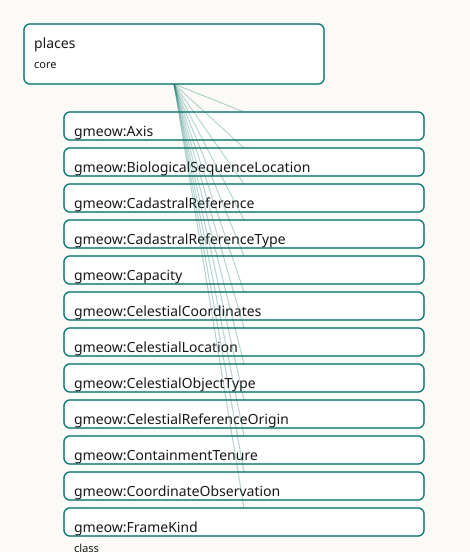

<!-- GENERATED by gmeow ontology-docs. DO NOT EDIT. -->

# GMEOW Locations Module

- **IRI:** <https://blackcatinformatics.ca/gmeow/slices/places>
- **Tier:** core
- **[`Group`](../reference/classes/gmeow-Group.md):** core

## What This Slice Covers

This slice owns 496 terms and contributes 369 mapping or projection rows. Use it when its terms match the native fact you want to preserve; use the linkage tables to see how those facts leave GMEOW for consumer vocabularies.

## Dependencies

- [`gmeow:slices/coreference`](coreference.md)
- [`gmeow:slices/documents`](documents.md)
- [`gmeow:slices/kernel`](kernel.md)
- [`gmeow:slices/lifecycle`](lifecycle.md)
- [`gmeow:slices/observations`](observations.md)
- [`gmeow:slices/rights`](rights.md)
- [`gmeow:slices/temporal`](temporal.md)

## Consumers

- Every located fact: contacts, events, the mail corpus, jurisdiction tenures; the GeoSPARQL projection.

## Local Map



## Examples

### Located Place

- **Source:** [`slices/core/places/examples/located-place.ttl`](https://github.com/Blackcat-Informatics/gmeow-ontology/blob/main/slices/core/places/examples/located-place.ttl)
- **GMEOW terms:** [`gmeow:CoordinateObservation`](../reference/classes/gmeow-CoordinateObservation.md), [`gmeow:GeoCoordinates`](../reference/classes/gmeow-GeoCoordinates.md), [`gmeow:Organization`](../reference/classes/gmeow-Organization.md), [`gmeow:Place`](../reference/classes/gmeow-Place.md), [`gmeow:assertedAt`](../reference/properties/gmeow-assertedAt.md), [`gmeow:authorityLink`](../reference/properties/gmeow-authorityLink.md), [`gmeow:confidence`](../reference/properties/gmeow-confidence.md), [`gmeow:containedInPlace`](../reference/properties/gmeow-containedInPlace.md), [`gmeow:coordinateObservationOf`](../reference/properties/gmeow-coordinateObservationOf.md), [`gmeow:coordinateResult`](../reference/properties/gmeow-coordinateResult.md)
- **External prefixes:** `owl`, `skos`, `wd`, `xsd`

```turtle
# SPDX-FileCopyrightText: 2026 Blackcat Informatics® Inc. <paudley@blackcatinformatics.ca>
# SPDX-License-Identifier: CC-BY-4.0
#
# Worked example: places as first-class located things, not address strings
#. A containment hierarchy (country ⊃ region ⊃ city ⊃ site) carries
# placeType, gazetteer coreference (authorityLink + skos:exactMatch, never
# owl:sameAs — P5), and coordinates two ways: the flat gmeow:hasCoordinates for
# the 80% case, and a reified gmeow:CoordinateObservation that makes the Principle
# 11 reference frame EXPLICIT (a latitude is meaningless without the frame it is
# expressed in) and carries the measurement's vantage, method, and confidence.
@prefix gmeow: <https://blackcatinformatics.ca/gmeow/> .
@prefix ex:    <https://blackcatinformatics.ca/gmeow/examples/places/> .
@prefix wd:    <http://www.wikidata.org/entity/> .
@prefix skos:  <http://www.w3.org/2004/02/skos/core#> .
@prefix xsd:   <http://www.w3.org/2001/XMLSchema#> .

# --- The containment spine: each place is a first-class Place, related by
#     gmeow:containedInPlace, with gazetteer alignment by reference.
ex:canada a gmeow:Place ;
    gmeow:name "Canada"@en ;
    gmeow:placeType gmeow:placeTypeCountry ;
    gmeow:authorityLink wd:Q16 ;
    skos:exactMatch wd:Q16 .

ex:alberta a gmeow:Place ;
    gmeow:name "Alberta"@en ;
    gmeow:placeType gmeow:placeTypeRegion ;
    gmeow:containedInPlace ex:canada ;
    gmeow:authorityLink wd:Q1951 ;
    skos:exactMatch wd:Q1951 .

ex:edmonton a gmeow:Place ;
    gmeow:name "Edmonton"@en ;
    gmeow:placeType gmeow:placeTypeCity ;
    gmeow:containedInPlace ex:alberta ;
    gmeow:authorityLink wd:Q2096 ;
    skos:exactMatch wd:Q2096 ;
    # The flat coordinate shortcut: a GeoCoordinates point, no provenance needed.
    gmeow:hasCoordinates ex:edmontonCoords .

ex:edmontonCoords a gmeow:GeoCoordinates ;
    gmeow:latitude "53.5461"^^xsd:decimal ;
    gmeow:longitude "-113.4938"^^xsd:decimal .

# --- A surveyed site, with the reified observation form: the SAME place can
#     carry competing measurements (different vantage/method/confidence), each in
#     its explicit reference frame; none is privileged (P9).
ex:officeSite a gmeow:Place ;
    gmeow:name "Blackcat office site"@en ;
    gmeow:placeType gmeow:placeTypeSite ;
    gmeow:containedInPlace ex:edmonton .

ex:surveyTeam a gmeow:Organization ;
    gmeow:name "Precision Survey Co."@en .

ex:officeGpsFix a gmeow:CoordinateObservation ;
    gmeow:coordinateObservationOf ex:officeSite ;
    gmeow:vantage ex:surveyTeam ;
    gmeow:observationMethod gmeow:methodGPS ;
    gmeow:coordinateResult ex:officeCoords ;
    gmeow:hasReferenceFrame gmeow:referenceFrameWGS84 ;
    gmeow:confidence 0.95 ;
    gmeow:assertedAt "2026-03-10T00:00:00Z"^^xsd:dateTime .

ex:officeCoords a gmeow:GeoCoordinates ;
    gmeow:latitude "53.5443"^^xsd:decimal ;
    gmeow:longitude "-113.4909"^^xsd:decimal ;
    gmeow:elevation "645.0"^^xsd:decimal .
```

## Terms

### Classes

| Term | Label | Definition |
|---|---|---|
| [`gmeow:Axis`](../reference/classes/gmeow-Axis.md) | Axis | A coordinate axis or dimension of a reference frame (e.g. X, Y, Z, latitude, longitude, elevation, time). |
| [`gmeow:BiologicalSequenceLocation`](../reference/classes/gmeow-BiologicalSequenceLocation.md) | Biological Sequence Location | A sequence-level container locus — a chromosome, contig, scaffold, or the sequence itself — that hosts SequenceFeature annotations via [`gmeow:hasSequenceFeature`](../reference/properties/gmeow-hasSequenceFeature.md)... |
| [`gmeow:CadastralReference`](../reference/classes/gmeow-CadastralReference.md) | Cadastral Reference | A structured identifier for a land-administration record — a parcel number, folio identifier, title number, lot reference, or survey plan reference issued by a... |
| [`gmeow:CadastralReferenceType`](../reference/classes/gmeow-CadastralReferenceType.md) | Cadastral Reference Type | The kind of a cadastral reference (parcel identifier, folio number, title number, lot number, survey plan reference, etc.). A value, not a subclass: the set is... |
| [`gmeow:Capacity`](../reference/classes/gmeow-Capacity.md) | Capacity | A measurement of the maximum number of entities a location can hold. The location is the observedFeature; the result is a ScalarQuantity. The entity kind being... |
| [`gmeow:CelestialCoordinates`](../reference/classes/gmeow-CelestialCoordinates.md) | Celestial Coordinates | A point on the celestial sphere expressed as right ascension, declination, and an optional epoch — frame-relative per [Principle 11](https://github.com/Blackcat-Informatics/gmeow-ontology/blob/main/CONSTITUTION.md#principle-11). The reference frame (ICRS,... |
| [`gmeow:CelestialLocation`](../reference/classes/gmeow-CelestialLocation.md) | Celestial Location | An astronomical location — a position on the celestial sphere, a solar-system body, a spacecraft, or a deep-sky object. The specific kind is given by gmeow:cel... |
| [`gmeow:CelestialObjectType`](../reference/classes/gmeow-CelestialObjectType.md) | Celestial Object Type | The kind of an astronomical object (star, galaxy, nebula, planet, asteroid, spacecraft, etc.). A value, not a CelestialLocation subclass: the set is open-ended... |
| [`gmeow:CelestialReferenceOrigin`](../reference/classes/gmeow-CelestialReferenceOrigin.md) | Celestial Reference Origin | The origin of a celestial coordinate system (topocentric, geocentric, barycentric, heliocentric, etc.). A value vocabulary aligned to IVOA refposition. |
| [`gmeow:ContainmentTenure`](../reference/classes/gmeow-ContainmentTenure.md) | Containment Tenure | The reified, time-scoped fact that a place was contained in a larger place over an interval — for boundary changes, re-organisations, and disputed parallel par... |
| [`gmeow:CoordinateObservation`](../reference/classes/gmeow-CoordinateObservation.md) | Coordinate Observation | A spatial measurement that assigns geographic coordinates or geometry to a place. Reifies the act of coordinate assignment so that multiple surveys (GPS 2023,... |
| [`gmeow:FrameKind`](../reference/classes/gmeow-FrameKind.md) | Frame Kind | The structural type of a reference frame (e.g. geodetic, Cartesian, polar, grid, narrative). |
| [`gmeow:FrameRealm`](../reference/classes/gmeow-FrameRealm.md) | Frame Realm | The physical, virtual, or conceptual domain of a reference frame (e.g. terrestrial, indoor, celestial, virtual, measurement, currency, temporal, colourspace, l... |
| [`gmeow:GeoCoordinates`](../reference/classes/gmeow-GeoCoordinates.md) | Geo Coordinates | A geographic point expressed as latitude, longitude, and optional elevation. |
| [`gmeow:Geocode`](../reference/classes/gmeow-Geocode.md) | Geocode | A geographic location code expressed in an alternative geocoding reference frame — a Plus Code, what3words address, geohash, MGRS grid reference, UN/LOCODE, or... |
| [`gmeow:Geometry`](../reference/classes/gmeow-Geometry.md) | Geometry | The spatial extent of a place — a point, line, or polygon — carrying a Well-Known Text (WKT) serialization for shapes richer than a single point (the GeoSPARQL... |
| [`gmeow:GeometryType`](../reference/classes/gmeow-GeometryType.md) | Geometry Type | The structural kind of a geometry (point, line, polygon, multipoint, multilinestring, multipolygon). A value vocabulary (individuals, never subclasses) aligned... |
| [`gmeow:JurisdictionTenure`](../reference/classes/gmeow-JurisdictionTenure.md) | Jurisdiction Tenure | The reified, time-scoped fact that a place was governed by a particular polity over an interval — a sovereignty or administrative jurisdiction claim. Non-funct... |
| [`gmeow:LandTenure`](../reference/classes/gmeow-LandTenure.md) | Land Tenure | The reified, time-scoped fact that a party holds rights over a place — ownership, lease, easement, mortgage, usufruct, or another property right. Bridges the l... |
| [`gmeow:LandTenureType`](../reference/classes/gmeow-LandTenureType.md) | Land Tenure Type | The kind of a land tenure (ownership, leasehold, easement, mortgage, usufruct, freehold, crown lease, etc.). A value, not a subclass: the set is open-ended and... |
| [`gmeow:Location`](../reference/classes/gmeow-Location.md) | Location | A locus where an entity can be situated, reside, or occur — a geographic place, an online (virtual) location, a digital storage location, or an astronomical/ce... |
| [`gmeow:LocationState`](../reference/classes/gmeow-LocationState.md) | Location State | The state of a moving entity at a specific point or period in time, including its location, velocity, and pose (position + orientation). |
| [`gmeow:MetricKind`](../reference/classes/gmeow-MetricKind.md) | Metric Kind | The computational method by which distance or dissimilarity is measured in a reference frame — geodesic (curved surface), Euclidean (straight-line in Cartesian... |
| [`gmeow:NetworkAddress`](../reference/classes/gmeow-NetworkAddress.md) | Network Address | A network-layer address or locator expressed as a coordinate in a network reference frame — an IP address, MAC address, DNS name, URL, port number, or BGP auto... |
| [`gmeow:NetworkAddressType`](../reference/classes/gmeow-NetworkAddressType.md) | Network Address Type | The kind of a network address (IPv4, IPv6, MAC, DNS, URL, port, BGP-AS). A value, not a subclass: the set is open-ended and they share all of NetworkAddress's... |
| [`gmeow:Occupancy`](../reference/classes/gmeow-Occupancy.md) | Occupancy | A measurement of the current number of entities located at or within a location. The location is the observedFeature; the result is a ScalarQuantity. Typically... |
| [`gmeow:Orientation`](../reference/classes/gmeow-Orientation.md) | Orientation | The rotational component of a pose, expressed as co-equal optional facets: quaternion (x, y, z, w), Euler angles (yaw, pitch, roll plus order), or compass angl... |
| [`gmeow:Place`](../reference/classes/gmeow-Place.md) | Place | A geographic location at any granularity — a country, region, city, thoroughfare, site, building, floor, or room. The specific kind is given by [`gmeow:placeType`](../reference/properties/gmeow-placeType.md)... |
| [`gmeow:PlaceType`](../reference/classes/gmeow-PlaceType.md) | Place Type | The kind of a geographic place (country, region, city, building, room, …). Modelled as a value, not a Place subclass: the set of kinds is open-ended (GeoNames... |
| [`gmeow:Pose`](../reference/classes/gmeow-Pose.md) | Pose | A frame-relative position and orientation of an object — a 6-DOF pose. A pose consists of a position (spatial coordinates in a reference frame) and an orientat... |
| [`gmeow:ProximityMeasurement`](../reference/classes/gmeow-ProximityMeasurement.md) | Proximity Measurement | A measurement of distance, dissimilarity, or proximity between two entities, expressed as a scalar quantity in a reference frame that declares its metric kind.... |
| [`gmeow:ReferenceFrame`](../reference/classes/gmeow-ReferenceFrame.md) | Reference Frame | A reference system (such as a coordinate system, datum, grid, or platform space) relative to which locations, coordinates, or measurements are expressed. |
| [`gmeow:RegulatoryOverlay`](../reference/classes/gmeow-RegulatoryOverlay.md) | Regulatory Overlay | The reified, time-scoped fact that a specific regulation applies over a place — imposed by an authority. Covers zoning, protected areas, restricted airspace, s... |
| [`gmeow:RegulatoryOverlayType`](../reference/classes/gmeow-RegulatoryOverlayType.md) | Regulatory Overlay Type | The kind of a regulatory overlay (zoning, protected area, restricted airspace, sanctions, tax district, electoral district, postal zone, civil-time zone, …). A... |
| [`gmeow:SequenceCoordinates`](../reference/classes/gmeow-SequenceCoordinates.md) | Sequence Coordinates | Frame-relative coordinates on a biological sequence: a start position, an end position, and a strand orientation, all expressed relative to an explicit referen... |
| [`gmeow:SequenceFeature`](../reference/classes/gmeow-SequenceFeature.md) | Sequence Feature | A feature or annotation on a biological sequence — a range with start, end, strand, and type, expressed in a reference assembly frame. The first-class entity t... |
| [`gmeow:SequenceFeatureType`](../reference/classes/gmeow-SequenceFeatureType.md) | Sequence Feature Type | The kind of a sequence feature (gene, exon, intron, CDS, SNP, chromosome, etc.). A value, not a subclass: the set is open-ended (Sequence Ontology lists ~2000... |
| [`gmeow:SpatialCoordinates`](../reference/classes/gmeow-SpatialCoordinates.md) | Spatial Coordinates | A set of coordinate values representing a position in a specific coordinate reference frame. |
| [`gmeow:SpatialMeasurement`](../reference/classes/gmeow-SpatialMeasurement.md) | Spatial Measurement | A measurement that assigns a spatial property — coordinates, geometry, pose, or spatial extent — to a feature of interest. The parent of CoordinateObservation... |
| [`gmeow:StorageLocation`](../reference/classes/gmeow-StorageLocation.md) | Storage Location | A locus where digital objects reside — a cloud-storage folder, an object-store bucket, a filesystem path, a content-addressed store, or a physical disk. Its me... |
| [`gmeow:StorageMedium`](../reference/classes/gmeow-StorageMedium.md) | Storage Medium | The kind of medium a storage location uses (cloud service, local filesystem, object store, content-addressed store, physical disk, removable media). A value, n... |
| [`gmeow:StrandOrientation`](../reference/classes/gmeow-StrandOrientation.md) | Strand Orientation | The strand direction of a feature on a double-stranded biological sequence (forward / Watson, reverse / Crick, or both). A value, not a subclass: the set is cl... |
| [`gmeow:Trajectory`](../reference/classes/gmeow-Trajectory.md) | Trajectory | A continuous path of motion representing the space-time history of a moving entity. |
| [`gmeow:Utilization`](../reference/classes/gmeow-Utilization.md) | Utilization | A measurement of the ratio of current occupancy to maximum capacity at a location, typically expressed as a ratio (0–1) or percentage. The location is the obse... |
| [`gmeow:VirtualLocation`](../reference/classes/gmeow-VirtualLocation.md) | Virtual Location | A non-geographic location reachable online — a video-conference room, chat space, metaverse room, website, or social media page. The specific kind is given by... |
| [`gmeow:VirtualLocationType`](../reference/classes/gmeow-VirtualLocationType.md) | Virtual Location Type | The kind of a virtual location (video conference, chat space, metaverse room, website, social media page, …). A value, not a subclass: the set is open-ended an... |

### Properties

| Term | Label | Definition |
|---|---|---|
| [`gmeow:accessUrl`](../reference/properties/gmeow-accessUrl.md) | access URL | The join/access URL of a virtual location. |
| [`gmeow:adjacentTo`](../reference/properties/gmeow-adjacentTo.md) | adjacent to | Relates a location to another location it is adjacent to. |
| [`gmeow:asGeoJSON`](../reference/properties/gmeow-asGeoJSON.md) | as GeoJSON | A GeoJSON serialization of a geometry. The range is [rdfs:Literal](http://www.w3.org/2000/01/rdf-schema#Literal) (not [geo:geoJSONLiteral](http://www.opengis.net/ont/geosparql#geoJSONLiteral)) to stay within the OWL 2 DL datatype map; data may still tag the lite... |
| [`gmeow:asWKT`](../reference/properties/gmeow-asWKT.md) | as WKT | A Well-Known Text (WKT) serialization of a geometry. The range is [rdfs:Literal](http://www.w3.org/2000/01/rdf-schema#Literal) (not [geo:wktLiteral](http://www.opengis.net/ont/geosparql#wktLiteral)) to stay within the OWL 2 DL datatype map; data may still ta... |
| [`gmeow:bearing`](../reference/properties/gmeow-bearing.md) | bearing | The angle between an entity's forward direction and a reference direction (typically north), in degrees. |
| [`gmeow:capacityOf`](../reference/properties/gmeow-capacityOf.md) | capacity of | The location whose capacity is measured. Functional: a capacity measurement concerns exactly one location (constitutive of the measurement's identity). |
| [`gmeow:celestialEpoch`](../reference/properties/gmeow-celestialEpoch.md) | celestial epoch | The epoch (Julian year, e.g. 2000.0) for which the coordinates are expressed. Required for proper-motion propagation; frame-relative per [Principle 11](https://github.com/Blackcat-Informatics/gmeow-ontology/blob/main/CONSTITUTION.md#principle-11). |
| [`gmeow:celestialObjectType`](../reference/properties/gmeow-celestialObjectType.md) | celestial object type | The kind(s) of a celestial location (one or more [`gmeow:CelestialObjectType`](../reference/classes/gmeow-CelestialObjectType.md) individuals). Non-functional: multi-source classifications may differ (e.g. a source... |
| [`gmeow:containedInLocation`](../reference/properties/gmeow-containedInLocation.md) | contained in location | Relates a location to a larger location that contains it; transitive. A spatial/topological specialization of the universal [`gmeow:partOf`](../reference/properties/gmeow-partOf.md) spine. |
| [`gmeow:containedInPlace`](../reference/properties/gmeow-containedInPlace.md) | contained in place | Relates a place to a larger place that geographically contains it; transitive. Chains the nested granularity (room ⊂ building ⊂ city ⊂ region ⊂ country), each... |
| [`gmeow:containmentChild`](../reference/properties/gmeow-containmentChild.md) | containment child | The contained (child) place in this containment tenure. Functional: a tenure concerns exactly one child place. |
| [`gmeow:containmentParent`](../reference/properties/gmeow-containmentParent.md) | containment parent | The containing (parent) place in this containment tenure. Functional: a single tenure has exactly one parent place. |
| [`gmeow:containsPlace`](../reference/properties/gmeow-containsPlace.md) | contains place | The inverse of [`gmeow:containedInPlace`](../reference/properties/gmeow-containedInPlace.md) — a place that geographically contains another place. Under OWL 2 semantics, transitivity is entailed because containedIn... |
| [`gmeow:coordinateFrame`](../reference/properties/gmeow-coordinateFrame.md) | coordinate frame | Relates a set of coordinates to the reference frame they are expressed in. |
| [`gmeow:coordinateObservationOf`](../reference/properties/gmeow-coordinateObservationOf.md) | coordinate observation of | The place whose coordinates or geometry are being observed — the observedFeature of a coordinate observation. Subproperty of [`gmeow:spatialMeasurementOf`](../reference/properties/gmeow-spatialMeasurementOf.md) (itself... |
| [`gmeow:coordinateResult`](../reference/properties/gmeow-coordinateResult.md) | coordinate result | The GeoCoordinates result of a coordinate observation — a point expressed as latitude, longitude, and optional elevation. The reference frame in which the coor... |
| [`gmeow:currencyCode`](../reference/properties/gmeow-currencyCode.md) | currency code | The canonical short code of a currency reference frame (a member of [`gmeow:frameRealmCurrency`](../reference/individuals/gmeow-frameRealmCurrency.md)) — the ISO 4217 alphabetic code for fiat currencies (USD, EUR, CAD... |
| [`gmeow:declination`](../reference/properties/gmeow-declination.md) | declination | Declination in degrees (−90 to +90). Frame-relative: the meaning depends on the coordinateFrame. |
| [`gmeow:determinacyModel`](../reference/properties/gmeow-determinacyModel.md) | determinacy model | Relates a reference frame to its default determinacy model. |
| [`gmeow:dimensionCount`](../reference/properties/gmeow-dimensionCount.md) | dimension count | The number of dimensions spanned by a reference frame. |
| [`gmeow:elevation`](../reference/properties/gmeow-elevation.md) | elevation | Elevation above sea level in metres. |
| [`gmeow:eulerOrder`](../reference/properties/gmeow-eulerOrder.md) | Euler order | The order of rotations for the Euler-angle representation (e.g., 'XYZ', 'ZYX', 'ZXZ'). |
| [`gmeow:frameKind`](../reference/properties/gmeow-frameKind.md) | frame kind | Relates a reference frame to its structural frame kind. |
| [`gmeow:frameRealm`](../reference/properties/gmeow-frameRealm.md) | frame realm | Relates a reference frame to the realm it describes. |
| [`gmeow:frameSolver`](../reference/properties/gmeow-frameSolver.md) | frame solver | Identifies the external solver or transformation method to resolve coordinates in this frame. |
| [`gmeow:geocodeFrame`](../reference/properties/gmeow-geocodeFrame.md) | geocode frame | The geocoding reference frame in which this code is expressed. Functional: a geocode is expressed in exactly one frame. |
| [`gmeow:geocodeValue`](../reference/properties/gmeow-geocodeValue.md) | geocode value | The string value of a geocode in its reference frame — the canonical literal carrier. Per-system properties (plusCode, what3words, …) are convenience accessors... |
| [`gmeow:geohash`](../reference/properties/gmeow-geohash.md) | geohash | A geohash string — a hierarchical spatial indexing system encoding latitude and longitude into a base32 string (e.g. 'u4pruydqqvj'). |
| [`gmeow:geometryDeterminacy`](../reference/properties/gmeow-geometryDeterminacy.md) | geometry determinacy | The ontic determinacy model of a geometry's boundary — crisp (surveyed), vague (approximate), fuzzy (probabilistic), or disputed. Non-functional: competing sou... |
| [`gmeow:geometryResult`](../reference/properties/gmeow-geometryResult.md) | geometry result | The Geometry result of a coordinate observation — a point, line, or polygon expressed as WKT or GeoJSON. The reference frame is carried on the observation and... |
| [`gmeow:geometryType`](../reference/properties/gmeow-geometryType.md) | geometry type | The structural kind of a geometry (a [`gmeow:GeometryType`](../reference/classes/gmeow-GeometryType.md) individual). Non-functional: competing source classifications may differ (e.g. polygon vs multipolygon)... |
| [`gmeow:hasAxis`](../reference/properties/gmeow-hasAxis.md) | has axis | Relates a reference frame to one of its coordinate axes. |
| [`gmeow:hasCadastralReference`](../reference/properties/gmeow-hasCadastralReference.md) | has cadastral reference | Relates a place (typically a parcel, lot, or spatial unit) to a structured cadastral reference issued by a registry. |
| [`gmeow:hasCapacity`](../reference/properties/gmeow-hasCapacity.md) | has capacity | Links a location to a capacity measurement describing the maximum number of entities it can hold. Flat form for the common case; promote to full reified Capaci... |
| [`gmeow:hasCelestialCoordinates`](../reference/properties/gmeow-hasCelestialCoordinates.md) | has celestial coordinates | Relates a celestial location to its equatorial or other sky coordinates. |
| [`gmeow:hasCentroid`](../reference/properties/gmeow-hasCentroid.md) | has centroid | The geometric centroid of a place — a flat shortcut for the common case. The full relator form is a SpatialAggregation with aggregationFunction aggCentroid, ca... |
| [`gmeow:hasCoordinateMatrix`](../reference/properties/gmeow-hasCoordinateMatrix.md) | has coordinate matrix | Specifies a transformation or projection matrix associated with a coordinate axis, a homogeneous 4×4 pose matrix combining translation and rotation, a general... |
| [`gmeow:hasCoordinateObservation`](../reference/properties/gmeow-hasCoordinateObservation.md) | has coordinate observation | Links a place to a coordinate observation that assigned coordinates or geometry to it. Non-functional: multiple surveys (GPS, LiDAR, total station) may coexist... |
| [`gmeow:hasCoordinates`](../reference/properties/gmeow-hasCoordinates.md) | has coordinates | Relates a place to its geographic point coordinates. Flat shortcut for the common case; the full relator form is a CoordinateObservation linking the place to a... |
| [`gmeow:hasGeocode`](../reference/properties/gmeow-hasGeocode.md) | has geocode | Relates a place to an alternative geocoding identifier expressed in a specific reference frame. Non-functional: a place may have multiple geocodes in different... |
| [`gmeow:hasGeometry`](../reference/properties/gmeow-hasGeometry.md) | has geometry | Relates a place to its spatial geometry (point, line, or polygon). Flat shortcut for the common case; the full relator form is a CoordinateObservation linking... |
| [`gmeow:hasMetricKind`](../reference/properties/gmeow-hasMetricKind.md) | has metric kind | The distance or dissimilarity metric declared by this reference frame. Functional: a frame uses exactly one metric kind for all proximity computations expresse... |
| [`gmeow:hasNetworkAddress`](../reference/properties/gmeow-hasNetworkAddress.md) | has network address | Relates a virtual location to a network address that locates it within a network topology. |
| [`gmeow:hasOccupancy`](../reference/properties/gmeow-hasOccupancy.md) | has occupancy | Links a location to an occupancy measurement describing the current number of entities located at it. Flat form for the common case; promote to full reified Oc... |
| [`gmeow:hasPose`](../reference/properties/gmeow-hasPose.md) | has pose | Associates an entity with a frame-relative pose (position + orientation). |
| [`gmeow:hasPoseOrientation`](../reference/properties/gmeow-hasPoseOrientation.md) | has pose orientation | The rotational component of a pose. |
| [`gmeow:hasPosePosition`](../reference/properties/gmeow-hasPosePosition.md) | has pose position | The translational component of a pose, expressed as spatial coordinates in the pose frame. |
| [`gmeow:hasReferenceFrame`](../reference/properties/gmeow-hasReferenceFrame.md) | has reference frame | Relates an entity or value to the reference frame in which it is expressed. |
| [`gmeow:hasReferencePosition`](../reference/properties/gmeow-hasReferencePosition.md) | has reference position | The origin position of a celestial reference frame (topocentric, geocentric, barycentric, heliocentric). Functional: a frame has exactly one reference position. |
| [`gmeow:hasSequenceCoordinates`](../reference/properties/gmeow-hasSequenceCoordinates.md) | has sequence coordinates | Links a sequence feature to its frame-relative coordinates. Non-functional: competing coordinate claims from different assemblies or alignment methods coexist... |
| [`gmeow:hasSequenceFeature`](../reference/properties/gmeow-hasSequenceFeature.md) | has sequence feature | Links a biological sequence location to a feature annotation on that sequence. Non-functional: a single location may carry multiple features (overlapping genes... |
| [`gmeow:hasSpatialMeasurement`](../reference/properties/gmeow-hasSpatialMeasurement.md) | has spatial measurement | Links an entity to a spatial measurement describing its coordinates, geometry, pose, or spatial extent. Flat form for the common case; promote to full reified... |
| [`gmeow:hasTimeScale`](../reference/properties/gmeow-hasTimeScale.md) | has time scale | The time standard associated with a celestial reference frame. Functional: a frame uses exactly one time scale. |
| [`gmeow:hasTrajectorySample`](../reference/properties/gmeow-hasTrajectorySample.md) | has trajectory sample | A discrete location-state sample composing this trajectory. Non-functional: a trajectory typically has many samples, and multiple sampling strategies (e.g. GPS... |
| [`gmeow:hasUtilization`](../reference/properties/gmeow-hasUtilization.md) | has utilization | Links a location to a utilization measurement describing the ratio of occupancy to capacity. Flat form for the common case; promote to full reified Utilization... |
| [`gmeow:heading`](../reference/properties/gmeow-heading.md) | heading | The compass direction an entity is facing, typically clockwise from north, in degrees. |
| [`gmeow:inReferenceAssembly`](../reference/properties/gmeow-inReferenceAssembly.md) | in reference assembly | The reference assembly (e.g. GRCh38) in which these sequence coordinates are expressed. Functional: a coordinate tuple is expressed in exactly one assembly; co... |
| [`gmeow:isHostedBy`](../reference/properties/gmeow-isHostedBy.md) | is hosted by | Relates a reference frame to the entity that hosts it — the entity whose existence bounds the frame's existence. A local grid is hosted by its building; a robo... |
| [`gmeow:jurisdictionDeterminacy`](../reference/properties/gmeow-jurisdictionDeterminacy.md) | jurisdiction determinacy | The ontic determinacy model of this jurisdiction claim — crisp (well-defined border), vague (approximate boundary), fuzzy (probabilistic membership), or disput... |
| [`gmeow:jurisdictionPlace`](../reference/properties/gmeow-jurisdictionPlace.md) | jurisdiction place | The place whose governance is recorded by this JurisdictionTenure. Functional: a tenure concerns exactly one place (constitutive of the situation's identity). |
| [`gmeow:jurisdictionPolity`](../reference/properties/gmeow-jurisdictionPolity.md) | jurisdiction polity | The governing polity (state, administrative body, or organization) that held jurisdiction over the place during this tenure. Functional: a single tenure has ex... |
| [`gmeow:latitude`](../reference/properties/gmeow-latitude.md) | latitude | The latitude of a geographic point in decimal degrees. |
| [`gmeow:locatedAt`](../reference/properties/gmeow-locatedAt.md) | located at | Relates an entity to a location it is situated at, resides in, or occurs at — geographic, virtual, or storage. |
| [`gmeow:longitude`](../reference/properties/gmeow-longitude.md) | longitude | The longitude of a geographic point in decimal degrees. |
| [`gmeow:mgrs`](../reference/properties/gmeow-mgrs.md) | MGRS | A Military Grid Reference System coordinate — a geocoordinate standard used by NATO militaries (e.g. '33TWN00020001'). |
| [`gmeow:mileMarker`](../reference/properties/gmeow-mileMarker.md) | mile marker | A linear-referencing mile-marker or chainage — a distance-along-a-line coordinate on a linear feature such as a road, railway, or pipeline (e.g. '42.3'). The u... |
| [`gmeow:networkAddressFrame`](../reference/properties/gmeow-networkAddressFrame.md) | network address frame | The network reference frame in which this address is expressed. Functional: an address is expressed in exactly one frame. |
| [`gmeow:networkAddressType`](../reference/properties/gmeow-networkAddressType.md) | network address type | The kind of a network address (a [`gmeow:NetworkAddressType`](../reference/classes/gmeow-NetworkAddressType.md) individual). Non-functional: competing classifications coexist ([Principle 9](https://github.com/Blackcat-Informatics/gmeow-ontology/blob/main/CONSTITUTION.md#principle-9)). |
| [`gmeow:networkAddressValue`](../reference/properties/gmeow-networkAddressValue.md) | network address value | The literal string value of a network address (e.g. '192.0.2.1', '00:1B:44:11:3A:B7', 'example.com', '443'). Functional: an address has exactly one value strin... |
| [`gmeow:occupancyOf`](../reference/properties/gmeow-occupancyOf.md) | occupancy of | The location whose occupancy is measured. Functional: an occupancy measurement concerns exactly one location (constitutive of the measurement's identity). |
| [`gmeow:overlayAuthority`](../reference/properties/gmeow-overlayAuthority.md) | overlay authority | The authority (government body, international organization, regulatory agency, or indigenous council) that imposed this regulatory overlay. Functional: a singl... |
| [`gmeow:overlayDesignator`](../reference/properties/gmeow-overlayDesignator.md) | overlay designator | The code or designator assigned to this regulatory overlay by its authority — an ICAO airspace identifier, a NOTAM number, a fisheries zone code, etc. Function... |
| [`gmeow:overlayDeterminacy`](../reference/properties/gmeow-overlayDeterminacy.md) | overlay determinacy | The ontic determinacy model of this regulatory overlay's boundary — crisp (surveyed), vague (approximate), fuzzy (probabilistic), or disputed. Non-functional:... |
| [`gmeow:overlayLowerBound`](../reference/properties/gmeow-overlayLowerBound.md) | overlay lower bound | The lower bound of this regulatory overlay in a vertical dimension (altitude, depth, elevation), expressed as a ScalarQuantity with unit (QUDT) and reference f... |
| [`gmeow:overlayPlace`](../reference/properties/gmeow-overlayPlace.md) | overlay place | The place over which this regulatory overlay applies. Functional: an overlay concerns exactly one place (constitutive of the situation's identity). The place c... |
| [`gmeow:overlayRegulation`](../reference/properties/gmeow-overlayRegulation.md) | overlay regulation | The machine-readable rights statement (permissions, prohibitions, duties) that governs activity within this overlay. Links to the rights facility rights facili... |
| [`gmeow:overlayType`](../reference/properties/gmeow-overlayType.md) | overlay type | The kind(s) of regulatory overlay (a [`gmeow:RegulatoryOverlayType`](../reference/classes/gmeow-RegulatoryOverlayType.md) individual). Non-functional: a single overlay may be classified by multiple sources as differe... |
| [`gmeow:overlayUpperBound`](../reference/properties/gmeow-overlayUpperBound.md) | overlay upper bound | The upper bound of this regulatory overlay in a vertical dimension (altitude, depth, elevation), expressed as a ScalarQuantity with unit (QUDT) and reference f... |
| [`gmeow:parentFrame`](../reference/properties/gmeow-parentFrame.md) | parent frame | Relates a reference frame to its parent frame in a hierarchy. |
| [`gmeow:physicalPlace`](../reference/properties/gmeow-physicalPlace.md) | physical place | The geographic place where a storage location's device physically sits (e.g. the room holding a disk). Absent for purely cloud storage. |
| [`gmeow:pitch`](../reference/properties/gmeow-pitch.md) | pitch | Rotation about the lateral (typically y) axis, in degrees or radians as indicated by the reference frame. |
| [`gmeow:placeDeterminacy`](../reference/properties/gmeow-placeDeterminacy.md) | place determinacy | The ontic determinacy model of a place's existence or boundary — crisp, vague, fuzzy, probabilistic, or disputed. Non-functional: in a multi-source merge, sour... |
| [`gmeow:placeSupersededBy`](../reference/properties/gmeow-placeSupersededBy.md) | place superseded by | Links a place to the place that replaced it — Constantinople placeSupersededBy Istanbul, a merged municipality placeSupersededBy its successor. Directional. Th... |
| [`gmeow:placeSupersedes`](../reference/properties/gmeow-placeSupersedes.md) | place supersedes | Links a newer place to a prior one it supersedes. Inverse of [`gmeow:placeSupersededBy`](../reference/properties/gmeow-placeSupersededBy.md). Non-functional: one successor may consolidate several predecessors. |
| [`gmeow:placeType`](../reference/properties/gmeow-placeType.md) | place type | The kind(s) of a place (one or more [`gmeow:PlaceType`](../reference/classes/gmeow-PlaceType.md) individuals). Non-functional: multi-source classifications may differ (a place that is both 'city' and 'adm... |
| [`gmeow:plusCode`](../reference/properties/gmeow-plusCode.md) | Plus Code | An Open Location Code (Plus Code) — a geocoding system using alphanumeric codes to identify any location on Earth (e.g. '9F4W9C8C+W4'). |
| [`gmeow:poseFrame`](../reference/properties/gmeow-poseFrame.md) | pose frame | The coordinate reference frame in which the pose position and orientation are expressed. |
| [`gmeow:proximity`](../reference/properties/gmeow-proximity.md) | proximity | Links an entity to a proximity measurement describing its distance or dissimilarity to another entity. The measurement carries the scalar value (via observatio... |
| [`gmeow:proximityTo`](../reference/properties/gmeow-proximityTo.md) | proximity to | The target entity to which proximity is measured. Functional: a different target entity is a different proximity measurement (constitutive of the relator's ide... |
| [`gmeow:quaternionW`](../reference/properties/gmeow-quaternionW.md) | quaternion W | The w (scalar) component of a unit quaternion representing orientation. |
| [`gmeow:quaternionX`](../reference/properties/gmeow-quaternionX.md) | quaternion X | The x component of a unit quaternion representing orientation. |
| [`gmeow:quaternionY`](../reference/properties/gmeow-quaternionY.md) | quaternion Y | The y component of a unit quaternion representing orientation. |
| [`gmeow:quaternionZ`](../reference/properties/gmeow-quaternionZ.md) | quaternion Z | The z component of a unit quaternion representing orientation. |
| [`gmeow:rcc8dc`](../reference/properties/gmeow-rcc8dc.md) | rcc8 dc | RCC-8: Disconnected (DC) — regions are disjoint and do not share any point. |
| [`gmeow:rcc8ec`](../reference/properties/gmeow-rcc8ec.md) | rcc8 ec | RCC-8: Externally Connected (EC) — regions share only boundary points. |
| [`gmeow:rcc8eq`](../reference/properties/gmeow-rcc8eq.md) | rcc8 eq | RCC-8: Equal (EQ) — regions are identical. |
| [`gmeow:rcc8ntpp`](../reference/properties/gmeow-rcc8ntpp.md) | rcc8 ntpp | RCC-8: Non-Tangential Proper Part (NTPP) — region is a proper part of another, entirely within its interior. |
| [`gmeow:rcc8ntppi`](../reference/properties/gmeow-rcc8ntppi.md) | rcc8 ntppi | RCC-8: Non-Tangential Proper Part Inverse (NTPPi) — inverse of NTPP. |
| [`gmeow:rcc8po`](../reference/properties/gmeow-rcc8po.md) | rcc8 po | RCC-8: Partial Overlap (PO) — regions overlap but neither is part of the other. |
| [`gmeow:rcc8tpp`](../reference/properties/gmeow-rcc8tpp.md) | rcc8 tpp | RCC-8: Tangential Proper Part (TPP) — region is a proper part of another, sharing part of its boundary. |
| [`gmeow:rcc8tppi`](../reference/properties/gmeow-rcc8tppi.md) | rcc8 tppi | RCC-8: Tangential Proper Part Inverse (TPPi) — inverse of TPP. |
| [`gmeow:referenceAuthority`](../reference/properties/gmeow-referenceAuthority.md) | reference authority | The cadastral registry, land titles office, or surveying authority that issued this reference. Functional: a single reference has exactly one issuing authority. |
| [`gmeow:referenceJurisdiction`](../reference/properties/gmeow-referenceJurisdiction.md) | reference jurisdiction | The jurisdiction (country, state, province, or territory) under whose legal framework this cadastral reference is valid. Functional: a single reference has exa... |
| [`gmeow:referenceType`](../reference/properties/gmeow-referenceType.md) | reference type | The kind of cadastral reference (parcel ID, folio number, title number, lot number, survey plan reference, etc.). Non-functional: a single reference may be cla... |
| [`gmeow:referenceValue`](../reference/properties/gmeow-referenceValue.md) | reference value | Exactly one identifier string of the cadastral reference (e.g. 'Lot 42, Plan 12345', 'Folio 67890', 'Title No. ABCD-1234'). Functional: a single CadastralRefer... |
| [`gmeow:requiresHost`](../reference/properties/gmeow-requiresHost.md) | requires host | Asserts whether a reference frame requires a hosting entity to exist. |
| [`gmeow:rightAscension`](../reference/properties/gmeow-rightAscension.md) | right ascension | Right ascension in degrees (0–360). Frame-relative: the meaning depends on the coordinateFrame (ICRS, FK5, etc.). |
| [`gmeow:roll`](../reference/properties/gmeow-roll.md) | roll | Rotation about the longitudinal (typically x) axis, in degrees or radians as indicated by the reference frame. |
| [`gmeow:sequenceEnd`](../reference/properties/gmeow-sequenceEnd.md) | sequence end | The 1-based inclusive end position of a feature on a biological sequence. Frame-relative: the meaning depends on the inReferenceAssembly ([Principle 11](https://github.com/Blackcat-Informatics/gmeow-ontology/blob/main/CONSTITUTION.md#principle-11)). |
| [`gmeow:sequenceFeatureType`](../reference/properties/gmeow-sequenceFeatureType.md) | sequence feature type | The kind(s) of a sequence feature (one or more [`gmeow:SequenceFeatureType`](../reference/classes/gmeow-SequenceFeatureType.md) individuals). Non-functional: multi-source classifications may differ (a feature class... |
| [`gmeow:sequenceStart`](../reference/properties/gmeow-sequenceStart.md) | sequence start | The 1-based inclusive start position of a feature on a biological sequence. Frame-relative: the meaning depends on the inReferenceAssembly ([Principle 11](https://github.com/Blackcat-Informatics/gmeow-ontology/blob/main/CONSTITUTION.md#principle-11)). |
| [`gmeow:sequenceStrand`](../reference/properties/gmeow-sequenceStrand.md) | sequence strand | The strand orientation of a feature on a double-stranded biological sequence. |
| [`gmeow:spatialCoverage`](../reference/properties/gmeow-spatialCoverage.md) | spatial coverage | The spatial extent or scope of a creative work. |
| [`gmeow:spatialMeasurementOf`](../reference/properties/gmeow-spatialMeasurementOf.md) | spatial measurement of | The entity whose spatial property is being measured — the observedFeature of a spatial measurement. Subproperty of [`gmeow:observedFeature`](../reference/properties/gmeow-observedFeature.md) so generic consumers c... |
| [`gmeow:spatiallyConnectsTo`](../reference/properties/gmeow-spatiallyConnectsTo.md) | spatially connects to | Relates a location to another location it is spatially or topologically traversable to — a road segment, a network link, a portal, or a transit stop connection... |
| [`gmeow:stateAtInstant`](../reference/properties/gmeow-stateAtInstant.md) | state at instant | The instant at which this point-like location state holds. For interval-scoped states, use [`gmeow:stateDuringInterval`](../reference/properties/gmeow-stateDuringInterval.md) instead. |
| [`gmeow:stateDuringInterval`](../reference/properties/gmeow-stateDuringInterval.md) | state during interval | The time interval over which this location state holds. For point-like states (a single instant), use [`gmeow:stateAtInstant`](../reference/properties/gmeow-stateAtInstant.md) instead. |
| [`gmeow:stateHasAngularVelocity`](../reference/properties/gmeow-stateHasAngularVelocity.md) | state has angular velocity | The angular velocity of the entity at this location state, expressed as a scalar quantity (value + unit) in the state's reference frame. Non-functional: compet... |
| [`gmeow:stateHasVelocity`](../reference/properties/gmeow-stateHasVelocity.md) | state has velocity | The linear velocity of the entity at this location state, expressed as a scalar quantity (value + unit) in the state's reference frame. Non-functional: competi... |
| [`gmeow:stateOf`](../reference/properties/gmeow-stateOf.md) | state of | The entity whose location state this is — the moving feature whose presence, pose, and velocity are described by this state. Functional: a state belongs to exa... |
| [`gmeow:stateReferenceFrame`](../reference/properties/gmeow-stateReferenceFrame.md) | state reference frame | The coordinate reference frame in which this location state's pose and velocity are expressed. Functional: a state is expressed in exactly one frame; nested-fr... |
| [`gmeow:storageMedium`](../reference/properties/gmeow-storageMedium.md) | storage medium | The medium of a storage location (a [`gmeow:StorageMedium`](../reference/classes/gmeow-StorageMedium.md) individual). Functional: the medium is constitutive of the storage location (a different medium is a di... |
| [`gmeow:storagePath`](../reference/properties/gmeow-storagePath.md) | storage path | The path, key, or URI of a storage location within its service. |
| [`gmeow:storageService`](../reference/properties/gmeow-storageService.md) | storage service | The service or system hosting a storage location (e.g. "Google Drive", "AWS S3", "local"). |
| [`gmeow:storedIn`](../reference/properties/gmeow-storedIn.md) | stored in | Relates a digital object (e.g. a document or import source) to the storage location where its bytes reside — the structured form of a source's location. |
| [`gmeow:tenureDeterminacy`](../reference/properties/gmeow-tenureDeterminacy.md) | tenure determinacy | The ontic determinacy model of this land tenure's boundary or claim — crisp (surveyed), vague (approximate), fuzzy (probabilistic), or disputed. Non-functional... |
| [`gmeow:tenureParty`](../reference/properties/gmeow-tenureParty.md) | tenure party | The party (person, corporation, indigenous community, or other agent) that holds the rights recorded by this LandTenure. Functional: a single tenure has exactl... |
| [`gmeow:tenurePlace`](../reference/properties/gmeow-tenurePlace.md) | tenure place | The place (parcel, lot, or spatial unit) over which the rights of this LandTenure apply. Functional: a tenure concerns exactly one place (constitutive of the s... |
| [`gmeow:tenureRights`](../reference/properties/gmeow-tenureRights.md) | tenure rights | The machine-readable rights statement (permissions, prohibitions, duties) that governs this land tenure. Links to the rights facility rights facility by refere... |
| [`gmeow:tenureType`](../reference/properties/gmeow-tenureType.md) | tenure type | The kind(s) of land tenure (a [`gmeow:LandTenureType`](../reference/classes/gmeow-LandTenureType.md) individual). Non-functional: a single tenure may be classified by multiple sources as different types, and t... |
| [`gmeow:timezone`](../reference/properties/gmeow-timezone.md) | timezone | An IANA time-zone identifier for a location (e.g. "America/Edmonton"). Non-functional: a large place may span several zones. |
| [`gmeow:trajectoryOf`](../reference/properties/gmeow-trajectoryOf.md) | trajectory of | The entity whose space-time path this trajectory describes. Functional: a trajectory belongs to exactly one entity. |
| [`gmeow:trajectoryReferenceFrame`](../reference/properties/gmeow-trajectoryReferenceFrame.md) | trajectory reference frame | The coordinate reference frame in which this trajectory's samples are expressed. Functional: a trajectory is expressed in exactly one frame; frame transformati... |
| [`gmeow:transformsTo`](../reference/properties/gmeow-transformsTo.md) | transforms to | Relates a reference frame to another frame it can be mathematically transformed to. |
| [`gmeow:unLocode`](../reference/properties/gmeow-unLocode.md) | UN/LOCODE | A UN/LOCODE — a five-character code identifying transport-related locations (ports, airports, rail terminals) worldwide (e.g. 'GBLHR'). |
| [`gmeow:utilizationOf`](../reference/properties/gmeow-utilizationOf.md) | utilization of | The location whose utilization is measured. Functional: a utilization measurement concerns exactly one location (constitutive of the measurement's identity). |
| [`gmeow:virtualLocationType`](../reference/properties/gmeow-virtualLocationType.md) | virtual location type | The kind(s) of a virtual location (one or more [`gmeow:VirtualLocationType`](../reference/classes/gmeow-VirtualLocationType.md) individuals). Non-functional: multi-source classifications may differ and must coexist... |
| [`gmeow:virtualPlatform`](../reference/properties/gmeow-virtualPlatform.md) | virtual platform | The platform hosting a virtual location (Zoom, Meet, a chat service, …). |
| [`gmeow:what3words`](../reference/properties/gmeow-what3words.md) | what3words | A what3words address — three words that identify a 3m×3m square on Earth (e.g. 'filled.county.limes'). |
| [`gmeow:yaw`](../reference/properties/gmeow-yaw.md) | yaw | Rotation about the vertical (typically z) axis, in degrees or radians as indicated by the reference frame. |

### Individuals

| Term | Label | Definition |
|---|---|---|
| [`gmeow:axisAddressLocality`](../reference/individuals/gmeow-axisAddressLocality.md) | address locality axis | The address locality axis of a reference frame — a coordinate axis used by a reference frame to name one dimension of a value space. |
| [`gmeow:axisAddressRegion`](../reference/individuals/gmeow-axisAddressRegion.md) | address region axis | The address region axis of a reference frame — a coordinate axis used by a reference frame to name one dimension of a value space. |
| [`gmeow:axisAllocentricX`](../reference/individuals/gmeow-axisAllocentricX.md) | allocentric X | The X axis of an allocentric (world-centred) cognitive map. |
| [`gmeow:axisAllocentricY`](../reference/individuals/gmeow-axisAllocentricY.md) | allocentric Y | The Y axis of an allocentric (world-centred) cognitive map. |
| [`gmeow:axisAltitude`](../reference/individuals/gmeow-axisAltitude.md) | altitude | The vertical axis above a reference datum — mean sea level, ground level, or another vertical reference surface. Used for aviation and terrestrial elevation bo... |
| [`gmeow:axisAngularVelocityX`](../reference/individuals/gmeow-axisAngularVelocityX.md) | angular velocity X axis | The angular velocity x axis of a reference frame — a coordinate axis used by a reference frame to name one dimension of a value space. |
| [`gmeow:axisAngularVelocityY`](../reference/individuals/gmeow-axisAngularVelocityY.md) | angular velocity Y axis | The angular velocity y axis of a reference frame — a coordinate axis used by a reference frame to name one dimension of a value space. |
| [`gmeow:axisAngularVelocityZ`](../reference/individuals/gmeow-axisAngularVelocityZ.md) | angular velocity Z axis | The angular velocity z axis of a reference frame — a coordinate axis used by a reference frame to name one dimension of a value space. |
| [`gmeow:axisArousal`](../reference/individuals/gmeow-axisArousal.md) | arousal | The activation-deactivation dimension of affect (Russell circumplex). |
| [`gmeow:axisAstar`](../reference/individuals/gmeow-axisAstar.md) | CIE a* red-green | The astar axis of a reference frame — a coordinate axis used by a reference frame to name one dimension of a value space. |
| [`gmeow:axisBGPAS`](../reference/individuals/gmeow-axisBGPAS.md) | BGP autonomous system axis | The bgpas axis of a reference frame — a coordinate axis used by a reference frame to name one dimension of a value space. |
| [`gmeow:axisBearing`](../reference/individuals/gmeow-axisBearing.md) | bearing axis | The bearing axis of a reference frame — a coordinate axis used by a reference frame to name one dimension of a value space. |
| [`gmeow:axisBlue`](../reference/individuals/gmeow-axisBlue.md) | blue channel | The blue axis of a reference frame — a coordinate axis used by a reference frame to name one dimension of a value space. |
| [`gmeow:axisBstar`](../reference/individuals/gmeow-axisBstar.md) | CIE b* blue-yellow | The bstar axis of a reference frame — a coordinate axis used by a reference frame to name one dimension of a value space. |
| [`gmeow:axisConceptualSimilarity`](../reference/individuals/gmeow-axisConceptualSimilarity.md) | conceptual similarity | The similarity or distance between concepts in a Gärdenfors-style conceptual space. |
| [`gmeow:axisConfigurationVector`](../reference/individuals/gmeow-axisConfigurationVector.md) | configuration vector axis | A generic n-dimensional configuration vector axis for variable-DOF robots. The actual dimensionality is pushed to the solver layer via CoordinateMatrix.matrixS... |
| [`gmeow:axisCountryCode`](../reference/individuals/gmeow-axisCountryCode.md) | country code axis | The country code axis of a reference frame — a coordinate axis used by a reference frame to name one dimension of a value space. |
| [`gmeow:axisCyan`](../reference/individuals/gmeow-axisCyan.md) | cyan channel | The cyan axis of a reference frame — a coordinate axis used by a reference frame to name one dimension of a value space. |
| [`gmeow:axisDNSName`](../reference/individuals/gmeow-axisDNSName.md) | DNS name axis | The dns name axis of a reference frame — a coordinate axis used by a reference frame to name one dimension of a value space. |
| [`gmeow:axisDay`](../reference/individuals/gmeow-axisDay.md) | day | The day axis of a reference frame — a coordinate axis used by a reference frame to name one dimension of a value space. |
| [`gmeow:axisDayOfWeek`](../reference/individuals/gmeow-axisDayOfWeek.md) | day of week | The day-of-week axis (ISO 8601 weekday 1=Monday–7=Sunday) of a week-date reference frame — a coordinate axis used by a reference frame to name one dimension of... |
| [`gmeow:axisDeclination`](../reference/individuals/gmeow-axisDeclination.md) | declination | The declination axis of a reference frame — a coordinate axis used by a reference frame to name one dimension of a value space. |
| [`gmeow:axisDepth`](../reference/individuals/gmeow-axisDepth.md) | depth | The vertical axis below a reference datum — mean sea level, chart datum, or another vertical reference surface. Used for maritime depth bounds and bathymetry. |
| [`gmeow:axisEgocentricForward`](../reference/individuals/gmeow-axisEgocentricForward.md) | egocentric forward | The forward/backward axis of an egocentric cognitive map, relative to the agent's facing direction. |
| [`gmeow:axisEgocentricLateral`](../reference/individuals/gmeow-axisEgocentricLateral.md) | egocentric lateral | The left/right axis of an egocentric cognitive map, relative to the agent's facing direction. |
| [`gmeow:axisElevation`](../reference/individuals/gmeow-axisElevation.md) | elevation | The elevation axis of a reference frame — a coordinate axis used by a reference frame to name one dimension of a value space. |
| [`gmeow:axisExtendedAddress`](../reference/individuals/gmeow-axisExtendedAddress.md) | extended address axis | The extended address axis of a reference frame — a coordinate axis used by a reference frame to name one dimension of a value space. |
| [`gmeow:axisFlightLevel`](../reference/individuals/gmeow-axisFlightLevel.md) | flight level | The pressure-altitude axis expressed as ICAO flight level (standard atmosphere 1013.25 hPa). Independent of local QNH; used for en-route airspace bounds. |
| [`gmeow:axisFrequency`](../reference/individuals/gmeow-axisFrequency.md) | frequency | The frequency axis of a reference frame — a coordinate axis used by a reference frame to name one dimension of a value space. |
| [`gmeow:axisGalacticLatitude`](../reference/individuals/gmeow-axisGalacticLatitude.md) | galactic latitude | The galactic latitude axis of a reference frame — a coordinate axis used by a reference frame to name one dimension of a value space. |
| [`gmeow:axisGalacticLongitude`](../reference/individuals/gmeow-axisGalacticLongitude.md) | galactic longitude | The galactic longitude axis of a reference frame — a coordinate axis used by a reference frame to name one dimension of a value space. |
| [`gmeow:axisGeneralizedCoordinate`](../reference/individuals/gmeow-axisGeneralizedCoordinate.md) | generalized coordinate | A generalized position coordinate qᵢ in a Lagrangian or Hamiltonian formulation. |
| [`gmeow:axisGeneralizedMomentum`](../reference/individuals/gmeow-axisGeneralizedMomentum.md) | generalized momentum | The conjugate momentum pᵢ = ∂L/∂q̇ᵢ corresponding to a generalized coordinate qᵢ. |
| [`gmeow:axisGeohash`](../reference/individuals/gmeow-axisGeohash.md) | geohash string | The geohash axis of a reference frame — a coordinate axis used by a reference frame to name one dimension of a value space. |
| [`gmeow:axisGreen`](../reference/individuals/gmeow-axisGreen.md) | green channel | The green axis of a reference frame — a coordinate axis used by a reference frame to name one dimension of a value space. |
| [`gmeow:axisHeading`](../reference/individuals/gmeow-axisHeading.md) | heading axis | The heading axis of a reference frame — a coordinate axis used by a reference frame to name one dimension of a value space. |
| [`gmeow:axisHilbertState`](../reference/individuals/gmeow-axisHilbertState.md) | Hilbert state vector | A single axis representing the state vector in a Hilbert space. The actual infinite-dimensional structure is a solver-layer attribute ([Principle 12](https://github.com/Blackcat-Informatics/gmeow-ontology/blob/main/CONSTITUTION.md#principle-12)). |
| [`gmeow:axisHour`](../reference/individuals/gmeow-axisHour.md) | hour | The hour axis of a reference frame — a coordinate axis used by a reference frame to name one dimension of a value space. |
| [`gmeow:axisIPv4Address`](../reference/individuals/gmeow-axisIPv4Address.md) | IPv4 address axis | The i pv 4 address axis of a reference frame — a coordinate axis used by a reference frame to name one dimension of a value space. |
| [`gmeow:axisIPv6Address`](../reference/individuals/gmeow-axisIPv6Address.md) | IPv6 address axis | The i pv 6 address axis of a reference frame — a coordinate axis used by a reference frame to name one dimension of a value space. |
| [`gmeow:axisImaginedSpaceX`](../reference/individuals/gmeow-axisImaginedSpaceX.md) | imagined space X | The X axis of an imagined or dream space (memory palace, dream landscape). |
| [`gmeow:axisImaginedSpaceY`](../reference/individuals/gmeow-axisImaginedSpaceY.md) | imagined space Y | The Y axis of an imagined or dream space (memory palace, dream landscape). |
| [`gmeow:axisImaginedSpaceZ`](../reference/individuals/gmeow-axisImaginedSpaceZ.md) | imagined space Z | The Z axis of an imagined or dream space (memory palace, dream landscape). |
| [`gmeow:axisJointAngle1`](../reference/individuals/gmeow-axisJointAngle1.md) | joint angle 1 | The joint angle 1 axis of a reference frame — a coordinate axis used by a reference frame to name one dimension of a value space. |
| [`gmeow:axisJointAngle2`](../reference/individuals/gmeow-axisJointAngle2.md) | joint angle 2 | The joint angle 2 axis of a reference frame — a coordinate axis used by a reference frame to name one dimension of a value space. |
| [`gmeow:axisJointAngle3`](../reference/individuals/gmeow-axisJointAngle3.md) | joint angle 3 | The joint angle 3 axis of a reference frame — a coordinate axis used by a reference frame to name one dimension of a value space. |
| [`gmeow:axisJointAngle4`](../reference/individuals/gmeow-axisJointAngle4.md) | joint angle 4 | The joint angle 4 axis of a reference frame — a coordinate axis used by a reference frame to name one dimension of a value space. |
| [`gmeow:axisJointAngle5`](../reference/individuals/gmeow-axisJointAngle5.md) | joint angle 5 | The joint angle 5 axis of a reference frame — a coordinate axis used by a reference frame to name one dimension of a value space. |
| [`gmeow:axisJointAngle6`](../reference/individuals/gmeow-axisJointAngle6.md) | joint angle 6 | The joint angle 6 axis of a reference frame — a coordinate axis used by a reference frame to name one dimension of a value space. |
| [`gmeow:axisKey`](../reference/individuals/gmeow-axisKey.md) | key (black) channel | The key axis of a reference frame — a coordinate axis used by a reference frame to name one dimension of a value space. |
| [`gmeow:axisLatentVector`](../reference/individuals/gmeow-axisLatentVector.md) | latent vector | A single axis representing a point in a learned latent vector space. The embedding dimension is a solver-layer attribute ([Principle 12](https://github.com/Blackcat-Informatics/gmeow-ontology/blob/main/CONSTITUTION.md#principle-12)). |
| [`gmeow:axisLatitude`](../reference/individuals/gmeow-axisLatitude.md) | latitude | The latitude axis of a reference frame — a coordinate axis used by a reference frame to name one dimension of a value space. |
| [`gmeow:axisLightness`](../reference/individuals/gmeow-axisLightness.md) | CIE L* lightness | The lightness axis of a reference frame — a coordinate axis used by a reference frame to name one dimension of a value space. |
| [`gmeow:axisLinearVelocityX`](../reference/individuals/gmeow-axisLinearVelocityX.md) | linear velocity X axis | The linear velocity x axis of a reference frame — a coordinate axis used by a reference frame to name one dimension of a value space. |
| [`gmeow:axisLinearVelocityY`](../reference/individuals/gmeow-axisLinearVelocityY.md) | linear velocity Y axis | The linear velocity y axis of a reference frame — a coordinate axis used by a reference frame to name one dimension of a value space. |
| [`gmeow:axisLinearVelocityZ`](../reference/individuals/gmeow-axisLinearVelocityZ.md) | linear velocity Z axis | The linear velocity z axis of a reference frame — a coordinate axis used by a reference frame to name one dimension of a value space. |
| [`gmeow:axisLongitude`](../reference/individuals/gmeow-axisLongitude.md) | longitude | The longitude axis of a reference frame — a coordinate axis used by a reference frame to name one dimension of a value space. |
| [`gmeow:axisMACAddress`](../reference/individuals/gmeow-axisMACAddress.md) | MAC address axis | The mac address axis of a reference frame — a coordinate axis used by a reference frame to name one dimension of a value space. |
| [`gmeow:axisMGRS`](../reference/individuals/gmeow-axisMGRS.md) | MGRS grid reference | The mgrs axis of a reference frame — a coordinate axis used by a reference frame to name one dimension of a value space. |
| [`gmeow:axisMagenta`](../reference/individuals/gmeow-axisMagenta.md) | magenta channel | The magenta axis of a reference frame — a coordinate axis used by a reference frame to name one dimension of a value space. |
| [`gmeow:axisMagnitude`](../reference/individuals/gmeow-axisMagnitude.md) | magnitude | The magnitude axis of a reference frame — a coordinate axis used by a reference frame to name one dimension of a value space. |
| [`gmeow:axisMileMarker`](../reference/individuals/gmeow-axisMileMarker.md) | mile marker / chainage | The mile marker axis of a reference frame — a coordinate axis used by a reference frame to name one dimension of a value space. |
| [`gmeow:axisMinute`](../reference/individuals/gmeow-axisMinute.md) | minute | The minute axis of a reference frame — a coordinate axis used by a reference frame to name one dimension of a value space. |
| [`gmeow:axisMomentumX`](../reference/individuals/gmeow-axisMomentumX.md) | momentum X | The momentum x axis of a reference frame — a coordinate axis used by a reference frame to name one dimension of a value space. |
| [`gmeow:axisMomentumY`](../reference/individuals/gmeow-axisMomentumY.md) | momentum Y | The momentum y axis of a reference frame — a coordinate axis used by a reference frame to name one dimension of a value space. |
| [`gmeow:axisMomentumZ`](../reference/individuals/gmeow-axisMomentumZ.md) | momentum Z | The momentum z axis of a reference frame — a coordinate axis used by a reference frame to name one dimension of a value space. |
| [`gmeow:axisMonth`](../reference/individuals/gmeow-axisMonth.md) | month | The month axis of a reference frame — a coordinate axis used by a reference frame to name one dimension of a value space. |
| [`gmeow:axisPitch`](../reference/individuals/gmeow-axisPitch.md) | pitch axis | The pitch axis of a reference frame — a coordinate axis used by a reference frame to name one dimension of a value space. |
| [`gmeow:axisPlusCode`](../reference/individuals/gmeow-axisPlusCode.md) | Plus Code cell | The plus code axis of a reference frame — a coordinate axis used by a reference frame to name one dimension of a value space. |
| [`gmeow:axisPortNumber`](../reference/individuals/gmeow-axisPortNumber.md) | port number axis | The port number axis of a reference frame — a coordinate axis used by a reference frame to name one dimension of a value space. |
| [`gmeow:axisPostOfficeBox`](../reference/individuals/gmeow-axisPostOfficeBox.md) | post office box axis | The post office box axis of a reference frame — a coordinate axis used by a reference frame to name one dimension of a value space. |
| [`gmeow:axisPostalCode`](../reference/individuals/gmeow-axisPostalCode.md) | postal code axis | The postal code axis of a reference frame — a coordinate axis used by a reference frame to name one dimension of a value space. |
| [`gmeow:axisPredictedMeanVote`](../reference/individuals/gmeow-axisPredictedMeanVote.md) | predicted mean vote (PMV) | The predicted mean vote axis of a reference frame — a coordinate axis used by a reference frame to name one dimension of a value space. |
| [`gmeow:axisPredictedPercentageDissatisfied`](../reference/individuals/gmeow-axisPredictedPercentageDissatisfied.md) | predicted percentage dissatisfied (PPD) | The predicted percentage dissatisfied axis of a reference frame — a coordinate axis used by a reference frame to name one dimension of a value space. |
| [`gmeow:axisQuaternionW`](../reference/individuals/gmeow-axisQuaternionW.md) | quaternion W axis | The quaternion w axis of a reference frame — a coordinate axis used by a reference frame to name one dimension of a value space. |
| [`gmeow:axisQuaternionX`](../reference/individuals/gmeow-axisQuaternionX.md) | quaternion X axis | The quaternion x axis of a reference frame — a coordinate axis used by a reference frame to name one dimension of a value space. |
| [`gmeow:axisQuaternionY`](../reference/individuals/gmeow-axisQuaternionY.md) | quaternion Y axis | The quaternion y axis of a reference frame — a coordinate axis used by a reference frame to name one dimension of a value space. |
| [`gmeow:axisQuaternionZ`](../reference/individuals/gmeow-axisQuaternionZ.md) | quaternion Z axis | The quaternion z axis of a reference frame — a coordinate axis used by a reference frame to name one dimension of a value space. |
| [`gmeow:axisRed`](../reference/individuals/gmeow-axisRed.md) | red channel | The red axis of a reference frame — a coordinate axis used by a reference frame to name one dimension of a value space. |
| [`gmeow:axisRightAscension`](../reference/individuals/gmeow-axisRightAscension.md) | right ascension | The right ascension axis of a reference frame — a coordinate axis used by a reference frame to name one dimension of a value space. |
| [`gmeow:axisRoll`](../reference/individuals/gmeow-axisRoll.md) | roll axis | The roll axis of a reference frame — a coordinate axis used by a reference frame to name one dimension of a value space. |
| [`gmeow:axisScalar`](../reference/individuals/gmeow-axisScalar.md) | scalar axis | The scalar axis of a reference frame — a coordinate axis used by a reference frame to name one dimension of a value space. |
| [`gmeow:axisSecond`](../reference/individuals/gmeow-axisSecond.md) | second | The second axis of a reference frame — a coordinate axis used by a reference frame to name one dimension of a value space. |
| [`gmeow:axisSequencePosition`](../reference/individuals/gmeow-axisSequencePosition.md) | sequence position | The linear position axis along a biological sequence (DNA, RNA, protein), measured in base pairs or amino-acid residues from a sequence origin. |
| [`gmeow:axisStreetAddress`](../reference/individuals/gmeow-axisStreetAddress.md) | street address axis | The street address axis of a reference frame — a coordinate axis used by a reference frame to name one dimension of a value space. |
| [`gmeow:axisTime`](../reference/individuals/gmeow-axisTime.md) | musical time axis | The musical time axis of a reference frame — a one-dimensional rational-position axis used by musical-time reference frames. |
| [`gmeow:axisTristimulusX`](../reference/individuals/gmeow-axisTristimulusX.md) | CIE X tristimulus | The tristimulus x axis of a reference frame — a coordinate axis used by a reference frame to name one dimension of a value space. |
| [`gmeow:axisTristimulusY`](../reference/individuals/gmeow-axisTristimulusY.md) | CIE Y tristimulus | The tristimulus y axis of a reference frame — a coordinate axis used by a reference frame to name one dimension of a value space. |
| [`gmeow:axisTristimulusZ`](../reference/individuals/gmeow-axisTristimulusZ.md) | CIE Z tristimulus | The tristimulus z axis of a reference frame — a coordinate axis used by a reference frame to name one dimension of a value space. |
| [`gmeow:axisUNLocode`](../reference/individuals/gmeow-axisUNLocode.md) | UN/LOCODE code | The un locode axis of a reference frame — a coordinate axis used by a reference frame to name one dimension of a value space. |
| [`gmeow:axisURL`](../reference/individuals/gmeow-axisURL.md) | URL axis | The url axis of a reference frame — a coordinate axis used by a reference frame to name one dimension of a value space. |
| [`gmeow:axisValence`](../reference/individuals/gmeow-axisValence.md) | valence | The pleasure-displeasure dimension of affect (Russell circumplex). |
| [`gmeow:axisVirtualAddress`](../reference/individuals/gmeow-axisVirtualAddress.md) | virtual address axis | The virtual address axis of a reference frame — a coordinate axis used by a reference frame to name one dimension of a value space. |
| [`gmeow:axisWeek`](../reference/individuals/gmeow-axisWeek.md) | week | The week-number axis (ISO 8601 week 1–53) of a week-date reference frame — a coordinate axis used by a reference frame to name one dimension of a value space. |
| [`gmeow:axisWhat3Words`](../reference/individuals/gmeow-axisWhat3Words.md) | what3words word triple | The what 3 words axis of a reference frame — a coordinate axis used by a reference frame to name one dimension of a value space. |
| [`gmeow:axisX`](../reference/individuals/gmeow-axisX.md) | X axis | The x axis of a reference frame — a coordinate axis used by a reference frame to name one dimension of a value space. |
| [`gmeow:axisY`](../reference/individuals/gmeow-axisY.md) | Y axis | The y axis of a reference frame — a coordinate axis used by a reference frame to name one dimension of a value space. |
| [`gmeow:axisYaw`](../reference/individuals/gmeow-axisYaw.md) | yaw axis | The yaw axis of a reference frame — a coordinate axis used by a reference frame to name one dimension of a value space. |
| [`gmeow:axisYear`](../reference/individuals/gmeow-axisYear.md) | year | The year axis of a reference frame — a coordinate axis used by a reference frame to name one dimension of a value space. |
| [`gmeow:axisYellow`](../reference/individuals/gmeow-axisYellow.md) | yellow channel | The yellow axis of a reference frame — a coordinate axis used by a reference frame to name one dimension of a value space. |
| [`gmeow:axisZ`](../reference/individuals/gmeow-axisZ.md) | Z axis | The z axis of a reference frame — a coordinate axis used by a reference frame to name one dimension of a value space. |
| [`gmeow:celestialObjectTypeAsteroid`](../reference/individuals/gmeow-celestialObjectTypeAsteroid.md) | asteroid | The asteroid celestial object type — a category of astronomical entity by its physical nature or scale. |
| [`gmeow:celestialObjectTypeCluster`](../reference/individuals/gmeow-celestialObjectTypeCluster.md) | star cluster | The cluster celestial object type — a category of astronomical entity by its physical nature or scale. |
| [`gmeow:celestialObjectTypeComet`](../reference/individuals/gmeow-celestialObjectTypeComet.md) | comet | The comet celestial object type — a category of astronomical entity by its physical nature or scale. |
| [`gmeow:celestialObjectTypeGalaxy`](../reference/individuals/gmeow-celestialObjectTypeGalaxy.md) | galaxy | The galaxy celestial object type — a category of astronomical entity by its physical nature or scale. |
| [`gmeow:celestialObjectTypeNebula`](../reference/individuals/gmeow-celestialObjectTypeNebula.md) | nebula | The nebula celestial object type — a category of astronomical entity by its physical nature or scale. |
| [`gmeow:celestialObjectTypePlanet`](../reference/individuals/gmeow-celestialObjectTypePlanet.md) | planet | The planet celestial object type — a category of astronomical entity by its physical nature or scale. |
| [`gmeow:celestialObjectTypeSpacecraft`](../reference/individuals/gmeow-celestialObjectTypeSpacecraft.md) | spacecraft / artificial satellite | The spacecraft celestial object type — a category of astronomical entity by its physical nature or scale. |
| [`gmeow:celestialObjectTypeStar`](../reference/individuals/gmeow-celestialObjectTypeStar.md) | star | The star celestial object type — a category of astronomical entity by its physical nature or scale. |
| [`gmeow:frameKindCartesian`](../reference/individuals/gmeow-frameKindCartesian.md) | cartesian | The cartesian frame kind — a mathematical or representational shape of a reference frame. |
| [`gmeow:frameKindConfigurationSpace`](../reference/individuals/gmeow-frameKindConfigurationSpace.md) | configuration space | A smooth manifold representing the set of all possible configurations of a robot mechanism, with joint-limit boundaries constraining valid regions. Distance is... |
| [`gmeow:frameKindCylindrical`](../reference/individuals/gmeow-frameKindCylindrical.md) | cylindrical | The cylindrical frame kind — a mathematical or representational shape of a reference frame. |
| [`gmeow:frameKindGeocoding`](../reference/individuals/gmeow-frameKindGeocoding.md) | geocoding / discrete location code | A frame whose structure is defined by a discrete location-coding scheme (Plus Code, what3words, geohash, MGRS) that partitions the Earth's surface into named c... |
| [`gmeow:frameKindGeodetic`](../reference/individuals/gmeow-frameKindGeodetic.md) | geodetic | The geodetic frame kind — a mathematical or representational shape of a reference frame. |
| [`gmeow:frameKindGrid`](../reference/individuals/gmeow-frameKindGrid.md) | grid | The grid frame kind — a mathematical or representational shape of a reference frame. |
| [`gmeow:frameKindHilbert`](../reference/individuals/gmeow-frameKindHilbert.md) | Hilbert space | An inner-product space that is complete with respect to the norm induced by the inner product; may be infinite-dimensional. The ontology models this with dimen... |
| [`gmeow:frameKindLatentSpace`](../reference/individuals/gmeow-frameKindLatentSpace.md) | latent vector space | A compressed, lower-dimensional representation space learned by a neural network or other statistical model. Similarity is measured by cosine or Euclidean metr... |
| [`gmeow:frameKindLinear`](../reference/individuals/gmeow-frameKindLinear.md) | linear referencing / distance-along | A one-dimensional frame defined by distance along a linear feature (road, railway, pipeline). The coordinate is a scalar chainage or mile-marker; conversion to... |
| [`gmeow:frameKindLinearSequence`](../reference/individuals/gmeow-frameKindLinearSequence.md) | linear sequence | A one-dimensional coordinate system along a linear biological sequence (DNA, RNA, protein). Positions are integer offsets from a sequence origin; distance is m... |
| [`gmeow:frameKindManifold`](../reference/individuals/gmeow-frameKindManifold.md) | manifold | A topological space that locally resembles Euclidean space. Coordinate charts and tangent spaces are solver-layer constructs ([Principle 12](https://github.com/Blackcat-Informatics/gmeow-ontology/blob/main/CONSTITUTION.md#principle-12)), not asserted as OW... |
| [`gmeow:frameKindNarrative`](../reference/individuals/gmeow-frameKindNarrative.md) | narrative | A frame whose structure is defined by canon, continuity, and narrative topology rather than geometric coordinates. Distance is measured in narrative proximity... |
| [`gmeow:frameKindPhaseSpace`](../reference/individuals/gmeow-frameKindPhaseSpace.md) | phase space | A space in which all possible states of a dynamical system are represented, with each state corresponding to one unique point. Typically 2n-dimensional for n d... |
| [`gmeow:frameKindPolar`](../reference/individuals/gmeow-frameKindPolar.md) | polar | The polar frame kind — a mathematical or representational shape of a reference frame. |
| [`gmeow:frameKindScalar`](../reference/individuals/gmeow-frameKindScalar.md) | scalar | The scalar frame kind — a mathematical or representational shape of a reference frame. |
| [`gmeow:frameKindTemporal`](../reference/individuals/gmeow-frameKindTemporal.md) | temporal | The temporal frame kind — a mathematical or representational shape of a reference frame. |
| [`gmeow:frameKindTopological`](../reference/individuals/gmeow-frameKindTopological.md) | topological | A frame whose structure is defined by containment, adjacency, or graph connectivity rather than geometric coordinates. Distance is measured in hops or nesting... |
| [`gmeow:frameRealmBiological`](../reference/individuals/gmeow-frameRealmBiological.md) | biological / genomic sequence | A biological sequence domain (DNA, RNA, protein) in which positions and features are expressed relative to a reference assembly or sequence. |
| [`gmeow:frameRealmCelestial`](../reference/individuals/gmeow-frameRealmCelestial.md) | celestial / astronomical | The celestial frame realm — a domain of discourse that defines what kind of value a reference frame measures or locates. |
| [`gmeow:frameRealmColourspace`](../reference/individuals/gmeow-frameRealmColourspace.md) | colourspace | The colourspace frame realm — a domain of discourse that defines what kind of value a reference frame measures or locates. |
| [`gmeow:frameRealmCurrency`](../reference/individuals/gmeow-frameRealmCurrency.md) | currency | The currency frame realm — a domain of discourse that defines what kind of value a reference frame measures or locates. |
| [`gmeow:frameRealmIndoor`](../reference/individuals/gmeow-frameRealmIndoor.md) | indoor | The indoor frame realm — a domain of discourse that defines what kind of value a reference frame measures or locates. |
| [`gmeow:frameRealmLinguistic`](../reference/individuals/gmeow-frameRealmLinguistic.md) | linguistic | The linguistic frame realm — a domain of discourse that defines what kind of value a reference frame measures or locates. |
| [`gmeow:frameRealmMathematical`](../reference/individuals/gmeow-frameRealmMathematical.md) | mathematical / n-D | The mathematical frame realm — a domain of discourse that defines what kind of value a reference frame measures or locates. |
| [`gmeow:frameRealmMeasurement`](../reference/individuals/gmeow-frameRealmMeasurement.md) | measurement | The measurement frame realm — a domain of discourse that defines what kind of value a reference frame measures or locates. |
| [`gmeow:frameRealmMusicalPitch`](../reference/individuals/gmeow-frameRealmMusicalPitch.md) | musical pitch | A frame realm for musical pitch values — frequencies, frequency ratios, scale degrees, and note-name projections expressed relative to an explicit tuning syste... |
| [`gmeow:frameRealmMusicalTime`](../reference/individuals/gmeow-frameRealmMusicalTime.md) | musical time | A frame realm for musical time values — beats, durations, meter assignments, tempo maps, and time mappings expressed relative to an explicit musical-time frame. |
| [`gmeow:frameRealmNarrative`](../reference/individuals/gmeow-frameRealmNarrative.md) | narrative / fictional | A fictional, literary, or narrative domain in which in-universe claims hold relative to a canon or continuity frame. |
| [`gmeow:frameRealmPerceptual`](../reference/individuals/gmeow-frameRealmPerceptual.md) | perceptual | A perceptual or subjective domain in which values are expressed relative to a perceiver's sensory frame (e.g. thermal comfort, olfactory quality, subjective lo... |
| [`gmeow:frameRealmPsychological`](../reference/individuals/gmeow-frameRealmPsychological.md) | psychological / cognitive | A psychological or cognitive domain in which values are expressed relative to a mind's internal representational frame — conceptual spaces, affective states, c... |
| [`gmeow:frameRealmRobotic`](../reference/individuals/gmeow-frameRealmRobotic.md) | robotic | The robotic frame realm — a domain of discourse that defines what kind of value a reference frame measures or locates. |
| [`gmeow:frameRealmTemporal`](../reference/individuals/gmeow-frameRealmTemporal.md) | temporal | The temporal frame realm — a domain of discourse that defines what kind of value a reference frame measures or locates. |
| [`gmeow:frameRealmTerrestrial`](../reference/individuals/gmeow-frameRealmTerrestrial.md) | terrestrial | The terrestrial frame realm — a domain of discourse that defines what kind of value a reference frame measures or locates. |
| [`gmeow:frameRealmVirtual`](../reference/individuals/gmeow-frameRealmVirtual.md) | virtual / network | The virtual frame realm — a domain of discourse that defines what kind of value a reference frame measures or locates. |
| [`gmeow:geometryTypeLineString`](../reference/individuals/gmeow-geometryTypeLineString.md) | line string | The line string geometry type — a Simple Features shape class used to represent a spatial extent. |
| [`gmeow:geometryTypeMultiLineString`](../reference/individuals/gmeow-geometryTypeMultiLineString.md) | multi-line string | The multi line string geometry type — a Simple Features shape class used to represent a spatial extent. |
| [`gmeow:geometryTypeMultiPoint`](../reference/individuals/gmeow-geometryTypeMultiPoint.md) | multi-point | The multi point geometry type — a Simple Features shape class used to represent a spatial extent. |
| [`gmeow:geometryTypeMultiPolygon`](../reference/individuals/gmeow-geometryTypeMultiPolygon.md) | multi-polygon | The multi polygon geometry type — a Simple Features shape class used to represent a spatial extent. |
| [`gmeow:geometryTypePoint`](../reference/individuals/gmeow-geometryTypePoint.md) | point | The point geometry type — a Simple Features shape class used to represent a spatial extent. |
| [`gmeow:geometryTypePolygon`](../reference/individuals/gmeow-geometryTypePolygon.md) | polygon | The polygon geometry type — a Simple Features shape class used to represent a spatial extent. |
| [`gmeow:granularityAddress`](../reference/individuals/gmeow-granularityAddress.md) | address level | The address granularity level — a resolution at which a value may be disclosed or coarsened ([Principle 10](https://github.com/Blackcat-Informatics/gmeow-ontology/blob/main/CONSTITUTION.md#principle-10)). |
| [`gmeow:granularityCity`](../reference/individuals/gmeow-granularityCity.md) | city level | The city granularity level — a resolution at which a value may be disclosed or coarsened ([Principle 10](https://github.com/Blackcat-Informatics/gmeow-ontology/blob/main/CONSTITUTION.md#principle-10)). |
| [`gmeow:granularityCountry`](../reference/individuals/gmeow-granularityCountry.md) | country level | The country granularity level — a resolution at which a value may be disclosed or coarsened ([Principle 10](https://github.com/Blackcat-Informatics/gmeow-ontology/blob/main/CONSTITUTION.md#principle-10)). |
| [`gmeow:granularityPoint`](../reference/individuals/gmeow-granularityPoint.md) | point / exact coordinate level | The point granularity level — a resolution at which a value may be disclosed or coarsened ([Principle 10](https://github.com/Blackcat-Informatics/gmeow-ontology/blob/main/CONSTITUTION.md#principle-10)). |
| [`gmeow:granularityRegion`](../reference/individuals/gmeow-granularityRegion.md) | region level | The region granularity level — a resolution at which a value may be disclosed or coarsened ([Principle 10](https://github.com/Blackcat-Informatics/gmeow-ontology/blob/main/CONSTITUTION.md#principle-10)). |
| [`gmeow:methodGNSSRTK`](../reference/individuals/gmeow-methodGNSSRTK.md) | GNSS RTK survey | Coordinate assignment via real-time kinematic GNSS with centimetre-level precision. |
| [`gmeow:methodGPS`](../reference/individuals/gmeow-methodGPS.md) | GPS survey | Coordinate assignment via Global Positioning System satellite ranging. |
| [`gmeow:methodLiDAR`](../reference/individuals/gmeow-methodLiDAR.md) | LiDAR survey | Coordinate assignment via light detection and ranging (airborne or terrestrial laser scanning). |
| [`gmeow:methodPhotogrammetry`](../reference/individuals/gmeow-methodPhotogrammetry.md) | photogrammetry | Coordinate assignment via stereo-photographic image triangulation. |
| [`gmeow:methodTotalStation`](../reference/individuals/gmeow-methodTotalStation.md) | total station survey | Coordinate assignment via electronic theodolite integrated with electronic distance measurement. |
| [`gmeow:metricCosine`](../reference/individuals/gmeow-metricCosine.md) | cosine similarity | Angular proximity in a latent vector space (1 − cosine distance). |
| [`gmeow:metricEditDistance`](../reference/individuals/gmeow-metricEditDistance.md) | edit distance | String or sequence dissimilarity (Levenshtein, Hamming, Damerau-Levenshtein, etc.). |
| [`gmeow:metricEuclidean`](../reference/individuals/gmeow-metricEuclidean.md) | Euclidean | Straight-line distance in a Cartesian or flat space. |
| [`gmeow:metricGeodesic`](../reference/individuals/gmeow-metricGeodesic.md) | geodesic | Shortest path along a curved surface (e.g. great-circle on a spheroid). |
| [`gmeow:metricGraphHops`](../reference/individuals/gmeow-metricGraphHops.md) | graph hops | Shortest-path edge count in a network or graph. |
| [`gmeow:metricPositionalDistance`](../reference/individuals/gmeow-metricPositionalDistance.md) | positional distance | Absolute difference between coordinates on a linear 1-D frame (base pairs, amino-acid residues, sequence indices). Interval length (\|end - start\| + 1 for inclu... |
| [`gmeow:metricSymplectic`](../reference/individuals/gmeow-metricSymplectic.md) | phase-space Euclidean | Standard Euclidean distance metric on a finite-dimensional Hamiltonian phase space, treating the concatenated (q,p) state vector as a point in ℝ²ⁿ. |
| [`gmeow:networkAddressTypeBGP`](../reference/individuals/gmeow-networkAddressTypeBGP.md) | BGP autonomous system | The bgp network address type — a scheme for locating or identifying a node or resource on a network. |
| [`gmeow:networkAddressTypeDNS`](../reference/individuals/gmeow-networkAddressTypeDNS.md) | DNS name | The dns network address type — a scheme for locating or identifying a node or resource on a network. |
| [`gmeow:networkAddressTypeIPv4`](../reference/individuals/gmeow-networkAddressTypeIPv4.md) | IPv4 address | The i pv 4 network address type — a scheme for locating or identifying a node or resource on a network. |
| [`gmeow:networkAddressTypeIPv6`](../reference/individuals/gmeow-networkAddressTypeIPv6.md) | IPv6 address | The i pv 6 network address type — a scheme for locating or identifying a node or resource on a network. |
| [`gmeow:networkAddressTypeMAC`](../reference/individuals/gmeow-networkAddressTypeMAC.md) | MAC address | The mac network address type — a scheme for locating or identifying a node or resource on a network. |
| [`gmeow:networkAddressTypePort`](../reference/individuals/gmeow-networkAddressTypePort.md) | port number | The port network address type — a scheme for locating or identifying a node or resource on a network. |
| [`gmeow:networkAddressTypeURL`](../reference/individuals/gmeow-networkAddressTypeURL.md) | URL | The url network address type — a scheme for locating or identifying a node or resource on a network. |
| [`gmeow:overlayTypeAerodromeTrafficZone`](../reference/individuals/gmeow-overlayTypeAerodromeTrafficZone.md) | aerodrome traffic zone (ATZ) | An area of protected airspace established around an aerodrome for the protection of aerodrome traffic. |
| [`gmeow:overlayTypeAirway`](../reference/individuals/gmeow-overlayTypeAirway.md) | airway | A control area or portion thereof established in the form of a corridor equipped with navigation aids, designated by ICAO for channelling the flow of traffic. |
| [`gmeow:overlayTypeAlertArea`](../reference/individuals/gmeow-overlayTypeAlertArea.md) | alert area | Airspace which may contain a high volume of pilot training or an unusual type of aerial activity, neither of which is hazardous to aircraft. |
| [`gmeow:overlayTypeCivilTimeZone`](../reference/individuals/gmeow-overlayTypeCivilTimeZone.md) | civil time zone | A geographic area sharing the same standard civil time, typically following political boundaries and designated by an IANA time-zone identifier. The authority... |
| [`gmeow:overlayTypeContiguousZone`](../reference/individuals/gmeow-overlayTypeContiguousZone.md) | contiguous zone | A band of water extending from the outer edge of the territorial sea to up to 24 nautical miles from the baseline, in which the coastal state may exercise cont... |
| [`gmeow:overlayTypeContinentalShelf`](../reference/individuals/gmeow-overlayTypeContinentalShelf.md) | continental shelf | The seabed and subsoil of the submarine areas that extend beyond the territorial sea to the outer edge of the continental margin, or to 200 nautical miles from... |
| [`gmeow:overlayTypeControlZone`](../reference/individuals/gmeow-overlayTypeControlZone.md) | control zone (CTR) | A controlled airspace extending upwards from the surface of the earth to a specified upper limit, established around an aerodrome (ICAO). |
| [`gmeow:overlayTypeCustomsZone`](../reference/individuals/gmeow-overlayTypeCustomsZone.md) | customs zone | A customs territory, free-trade zone, bonded warehouse area, or other zone with special customs/tariff regulations. |
| [`gmeow:overlayTypeElectoralDistrict`](../reference/individuals/gmeow-overlayTypeElectoralDistrict.md) | electoral district | A constituency or voting district defining the geographic boundary for an election. |
| [`gmeow:overlayTypeFishingZone`](../reference/individuals/gmeow-overlayTypeFishingZone.md) | fishing zone / EEZ | An exclusive economic zone (EEZ), fisheries management zone, or other maritime area subject to resource-extraction regulation under UNCLOS or bilateral agreeme... |
| [`gmeow:overlayTypeFlightInformationRegion`](../reference/individuals/gmeow-overlayTypeFlightInformationRegion.md) | flight information region (FIR) | An airspace of defined dimensions within which flight information service and alerting service are provided (ICAO). |
| [`gmeow:overlayTypeHighSeas`](../reference/individuals/gmeow-overlayTypeHighSeas.md) | high seas | All parts of the sea that are not included in the exclusive economic zone, territorial sea, or internal waters of a state (UNCLOS Article 86). |
| [`gmeow:overlayTypeMarineProtectedArea`](../reference/individuals/gmeow-overlayTypeMarineProtectedArea.md) | marine protected area | A clearly defined geographical space in the marine environment recognised, dedicated and managed through legal or other effective means to achieve the long-ter... |
| [`gmeow:overlayTypeMilitaryOperationsArea`](../reference/individuals/gmeow-overlayTypeMilitaryOperationsArea.md) | military operations area (MOA) | Airspace established outside controlled airspace to segregate certain military activities from IFR traffic and to identify for VFR traffic where these activiti... |
| [`gmeow:overlayTypeNOTAM`](../reference/individuals/gmeow-overlayTypeNOTAM.md) | notice to air missions (NOTAM) | A temporary, dynamic regulatory overlay issued to notify pilots of potential hazards or changes to aeronautical facilities, services, or procedures. Typically... |
| [`gmeow:overlayTypePostalZone`](../reference/individuals/gmeow-overlayTypePostalZone.md) | postal zone | A postal code or ZIP delivery area — a zone designated for mail sorting and delivery by a postal authority. |
| [`gmeow:overlayTypeProtectedArea`](../reference/individuals/gmeow-overlayTypeProtectedArea.md) | protected area | A legally-designated protected area such as a national park, wildlife reserve, marine protected area, or wilderness area. Management categories (IUCN Ia–VI) ar... |
| [`gmeow:overlayTypeRestrictedAirspace`](../reference/individuals/gmeow-overlayTypeRestrictedAirspace.md) | restricted airspace | An airspace restriction including prohibited areas, restricted areas, danger areas, temporary reserved airspace (TRA), temporary segregated airspace (TSA), and... |
| [`gmeow:overlayTypeSanctions`](../reference/individuals/gmeow-overlayTypeSanctions.md) | sanctions / embargo | A territory subject to international or unilateral sanctions, embargoes, or trade restrictions imposed by one or more authorities. |
| [`gmeow:overlayTypeTaxDistrict`](../reference/individuals/gmeow-overlayTypeTaxDistrict.md) | tax district | An administrative area designated for tax assessment, collection, or rate-setting purposes. |
| [`gmeow:overlayTypeTerminalControlArea`](../reference/individuals/gmeow-overlayTypeTerminalControlArea.md) | terminal control area (TMA/TCA) | A controlled airspace normally established at the confluence of ATS routes in the vicinity of one or more major aerodromes (ICAO). |
| [`gmeow:overlayTypeTerritorialSea`](../reference/individuals/gmeow-overlayTypeTerritorialSea.md) | territorial sea | A belt of coastal waters extending up to 12 nautical miles from the baseline of a coastal state, over which the state exercises sovereignty (UNCLOS Article 3). |
| [`gmeow:overlayTypeWarningArea`](../reference/individuals/gmeow-overlayTypeWarningArea.md) | warning area | Airspace of defined dimensions, extending from 3 NM outward from the coast of the United States, that contains activity which may be hazardous to non-participa... |
| [`gmeow:overlayTypeZoning`](../reference/individuals/gmeow-overlayTypeZoning.md) | zoning / land-use regulation | A land-use zoning overlay designating permitted uses (residential, commercial, industrial, agricultural, mixed-use) within a geographic area. |
| [`gmeow:placeTypeAdministrativeArea`](../reference/individuals/gmeow-placeTypeAdministrativeArea.md) | administrative area | The administrative area place type — a classification of a location by its function or form in human geography. |
| [`gmeow:placeTypeBuilding`](../reference/individuals/gmeow-placeTypeBuilding.md) | building | The building place type — a classification of a location by its function or form in human geography. |
| [`gmeow:placeTypeCity`](../reference/individuals/gmeow-placeTypeCity.md) | city / populated place | The city place type — a classification of a location by its function or form in human geography. |
| [`gmeow:placeTypeCountry`](../reference/individuals/gmeow-placeTypeCountry.md) | country | The country place type — a classification of a location by its function or form in human geography. |
| [`gmeow:placeTypeFloor`](../reference/individuals/gmeow-placeTypeFloor.md) | floor / level | The floor place type — a classification of a location by its function or form in human geography. |
| [`gmeow:placeTypeNaturalFeature`](../reference/individuals/gmeow-placeTypeNaturalFeature.md) | natural feature | The natural feature place type — a classification of a location by its function or form in human geography. |
| [`gmeow:placeTypeNeighborhood`](../reference/individuals/gmeow-placeTypeNeighborhood.md) | neighborhood | The neighborhood place type — a classification of a location by its function or form in human geography. |
| [`gmeow:placeTypeParcel`](../reference/individuals/gmeow-placeTypeParcel.md) | parcel / lot | The parcel place type — a classification of a location by its function or form in human geography. |
| [`gmeow:placeTypePointOfInterest`](../reference/individuals/gmeow-placeTypePointOfInterest.md) | point of interest | The point of interest place type — a classification of a location by its function or form in human geography. |
| [`gmeow:placeTypePremises`](../reference/individuals/gmeow-placeTypePremises.md) | premises / address point | The premises place type — a classification of a location by its function or form in human geography. |
| [`gmeow:placeTypeRegion`](../reference/individuals/gmeow-placeTypeRegion.md) | region / state / province | The region place type — a classification of a location by its function or form in human geography. |
| [`gmeow:placeTypeRoom`](../reference/individuals/gmeow-placeTypeRoom.md) | room | The room place type — a classification of a location by its function or form in human geography. |
| [`gmeow:placeTypeSite`](../reference/individuals/gmeow-placeTypeSite.md) | site / campus | The site place type — a classification of a location by its function or form in human geography. |
| [`gmeow:placeTypeThoroughfare`](../reference/individuals/gmeow-placeTypeThoroughfare.md) | thoroughfare / street | The thoroughfare place type — a classification of a location by its function or form in human geography. |
| [`gmeow:refOriginBarycentric`](../reference/individuals/gmeow-refOriginBarycentric.md) | barycentric (solar system) | The barycentric celestial reference origin — a geometric origin point relative to which celestial coordinates are expressed. |
| [`gmeow:refOriginGeocentric`](../reference/individuals/gmeow-refOriginGeocentric.md) | geocentric | The geocentric celestial reference origin — a geometric origin point relative to which celestial coordinates are expressed. |
| [`gmeow:refOriginHeliocentric`](../reference/individuals/gmeow-refOriginHeliocentric.md) | heliocentric | The heliocentric celestial reference origin — a geometric origin point relative to which celestial coordinates are expressed. |
| [`gmeow:refOriginTopocentric`](../reference/individuals/gmeow-refOriginTopocentric.md) | topocentric (observatory site) | The topocentric celestial reference origin — a geometric origin point relative to which celestial coordinates are expressed. |
| [`gmeow:referenceFrameAUD`](../reference/individuals/gmeow-referenceFrameAUD.md) | Australian Dollar Currency Reference Frame | The aud reference frame — a named coordinate system or value space together with its axes, origin, and transformation rules ([Principle 11](https://github.com/Blackcat-Informatics/gmeow-ontology/blob/main/CONSTITUTION.md#principle-11)). |
| [`gmeow:referenceFrameAltitudeAGL`](../reference/individuals/gmeow-referenceFrameAltitudeAGL.md) | Altitude Above Ground Level Reference Frame | The altitude agl reference frame — a named coordinate system or value space together with its axes, origin, and transformation rules ([Principle 11](https://github.com/Blackcat-Informatics/gmeow-ontology/blob/main/CONSTITUTION.md#principle-11)). |
| [`gmeow:referenceFrameAltitudeMSL`](../reference/individuals/gmeow-referenceFrameAltitudeMSL.md) | Altitude Above Mean Sea Level Reference Frame | The altitude msl reference frame — a named coordinate system or value space together with its axes, origin, and transformation rules ([Principle 11](https://github.com/Blackcat-Informatics/gmeow-ontology/blob/main/CONSTITUTION.md#principle-11)). |
| [`gmeow:referenceFrameBGP`](../reference/individuals/gmeow-referenceFrameBGP.md) | BGP Autonomous System Reference Frame | The bgp reference frame — a named coordinate system or value space together with its axes, origin, and transformation rules ([Principle 11](https://github.com/Blackcat-Informatics/gmeow-ontology/blob/main/CONSTITUTION.md#principle-11)). |
| [`gmeow:referenceFrameBTC`](../reference/individuals/gmeow-referenceFrameBTC.md) | Bitcoin Currency Reference Frame | The btc reference frame — a named coordinate system or value space together with its axes, origin, and transformation rules ([Principle 11](https://github.com/Blackcat-Informatics/gmeow-ontology/blob/main/CONSTITUTION.md#principle-11)). |
| [`gmeow:referenceFrameCAD`](../reference/individuals/gmeow-referenceFrameCAD.md) | Canadian Dollar Currency Reference Frame | The cad reference frame — a named coordinate system or value space together with its axes, origin, and transformation rules ([Principle 11](https://github.com/Blackcat-Informatics/gmeow-ontology/blob/main/CONSTITUTION.md#principle-11)). |
| [`gmeow:referenceFrameCHF`](../reference/individuals/gmeow-referenceFrameCHF.md) | Swiss Franc Currency Reference Frame | The chf reference frame — a named coordinate system or value space together with its axes, origin, and transformation rules ([Principle 11](https://github.com/Blackcat-Informatics/gmeow-ontology/blob/main/CONSTITUTION.md#principle-11)). |
| [`gmeow:referenceFrameCMYK`](../reference/individuals/gmeow-referenceFrameCMYK.md) | CMYK Colourspace Reference Frame | The cmyk reference frame — a named coordinate system or value space together with its axes, origin, and transformation rules ([Principle 11](https://github.com/Blackcat-Informatics/gmeow-ontology/blob/main/CONSTITUTION.md#principle-11)). |
| [`gmeow:referenceFrameCNY`](../reference/individuals/gmeow-referenceFrameCNY.md) | Chinese Yuan Currency Reference Frame | The cny reference frame — a named coordinate system or value space together with its axes, origin, and transformation rules ([Principle 11](https://github.com/Blackcat-Informatics/gmeow-ontology/blob/main/CONSTITUTION.md#principle-11)). |
| [`gmeow:referenceFrameCelestialEquatorial`](../reference/individuals/gmeow-referenceFrameCelestialEquatorial.md) | Celestial Equatorial Reference Frame | The celestial equatorial reference frame — a named coordinate system or value space together with its axes, origin, and transformation rules ([Principle 11](https://github.com/Blackcat-Informatics/gmeow-ontology/blob/main/CONSTITUTION.md#principle-11)). |
| [`gmeow:referenceFrameConfigurationSpace`](../reference/individuals/gmeow-referenceFrameConfigurationSpace.md) | Robot Configuration-Space Reference Frame | A robot configuration space (C-space): a single configuration-vector axis whose dimensionality (the DOF) is carried by the coordinate-matrix shape, not by N ax... |
| [`gmeow:referenceFrameDNS`](../reference/individuals/gmeow-referenceFrameDNS.md) | DNS Name Space Reference Frame | The dns reference frame — a named coordinate system or value space together with its axes, origin, and transformation rules ([Principle 11](https://github.com/Blackcat-Informatics/gmeow-ontology/blob/main/CONSTITUTION.md#principle-11)). |
| [`gmeow:referenceFrameDepthBelowChartDatum`](../reference/individuals/gmeow-referenceFrameDepthBelowChartDatum.md) | Depth Below Chart Datum Reference Frame | The depth below chart datum reference frame — a named coordinate system or value space together with its axes, origin, and transformation rules ([Principle 11](https://github.com/Blackcat-Informatics/gmeow-ontology/blob/main/CONSTITUTION.md#principle-11)). |
| [`gmeow:referenceFrameDepthBelowSeaLevel`](../reference/individuals/gmeow-referenceFrameDepthBelowSeaLevel.md) | Depth Below Mean Sea Level Reference Frame | The depth below sea level reference frame — a named coordinate system or value space together with its axes, origin, and transformation rules ([Principle 11](https://github.com/Blackcat-Informatics/gmeow-ontology/blob/main/CONSTITUTION.md#principle-11)). |
| [`gmeow:referenceFrameETH`](../reference/individuals/gmeow-referenceFrameETH.md) | Ethereum Currency Reference Frame | The eth reference frame — a named coordinate system or value space together with its axes, origin, and transformation rules ([Principle 11](https://github.com/Blackcat-Informatics/gmeow-ontology/blob/main/CONSTITUTION.md#principle-11)). |
| [`gmeow:referenceFrameEUR`](../reference/individuals/gmeow-referenceFrameEUR.md) | Euro Currency Reference Frame | The eur reference frame — a named coordinate system or value space together with its axes, origin, and transformation rules ([Principle 11](https://github.com/Blackcat-Informatics/gmeow-ontology/blob/main/CONSTITUTION.md#principle-11)). |
| [`gmeow:referenceFrameEnglish`](../reference/individuals/gmeow-referenceFrameEnglish.md) | English Language Reference Frame | The english reference frame — a named coordinate system or value space together with its axes, origin, and transformation rules ([Principle 11](https://github.com/Blackcat-Informatics/gmeow-ontology/blob/main/CONSTITUTION.md#principle-11)). |
| [`gmeow:referenceFrameFK5`](../reference/individuals/gmeow-referenceFrameFK5.md) | FK5 Equatorial Reference Frame | The fk 5 reference frame — a named coordinate system or value space together with its axes, origin, and transformation rules ([Principle 11](https://github.com/Blackcat-Informatics/gmeow-ontology/blob/main/CONSTITUTION.md#principle-11)). |
| [`gmeow:referenceFrameFlightLevel`](../reference/individuals/gmeow-referenceFrameFlightLevel.md) | ICAO Flight Level Reference Frame | The flight level reference frame — a named coordinate system or value space together with its axes, origin, and transformation rules ([Principle 11](https://github.com/Blackcat-Informatics/gmeow-ontology/blob/main/CONSTITUTION.md#principle-11)). |
| [`gmeow:referenceFrameGBP`](../reference/individuals/gmeow-referenceFrameGBP.md) | British Pound Currency Reference Frame | The gbp reference frame — a named coordinate system or value space together with its axes, origin, and transformation rules ([Principle 11](https://github.com/Blackcat-Informatics/gmeow-ontology/blob/main/CONSTITUTION.md#principle-11)). |
| [`gmeow:referenceFrameGRCh38`](../reference/individuals/gmeow-referenceFrameGRCh38.md) | GRCh38 Human Reference Assembly | The gr ch 38 reference frame — a named coordinate system or value space together with its axes, origin, and transformation rules ([Principle 11](https://github.com/Blackcat-Informatics/gmeow-ontology/blob/main/CONSTITUTION.md#principle-11)). |
| [`gmeow:referenceFrameGalactic`](../reference/individuals/gmeow-referenceFrameGalactic.md) | Galactic Coordinate Reference Frame | The galactic reference frame — a named coordinate system or value space together with its axes, origin, and transformation rules ([Principle 11](https://github.com/Blackcat-Informatics/gmeow-ontology/blob/main/CONSTITUTION.md#principle-11)). |
| [`gmeow:referenceFrameGeohash`](../reference/individuals/gmeow-referenceFrameGeohash.md) | Geohash Reference Frame | The geohash reference frame — a named coordinate system or value space together with its axes, origin, and transformation rules ([Principle 11](https://github.com/Blackcat-Informatics/gmeow-ontology/blob/main/CONSTITUTION.md#principle-11)). |
| [`gmeow:referenceFrameGregorian`](../reference/individuals/gmeow-referenceFrameGregorian.md) | Gregorian Calendar Reference Frame | The gregorian reference frame — a named coordinate system or value space together with its axes, origin, and transformation rules ([Principle 11](https://github.com/Blackcat-Informatics/gmeow-ontology/blob/main/CONSTITUTION.md#principle-11)). |
| [`gmeow:referenceFrameHilbertSpace`](../reference/individuals/gmeow-referenceFrameHilbertSpace.md) | Hilbert Space Reference Frame | The hilbert space reference frame — a named coordinate system or value space together with its axes, origin, and transformation rules ([Principle 11](https://github.com/Blackcat-Informatics/gmeow-ontology/blob/main/CONSTITUTION.md#principle-11)). |
| [`gmeow:referenceFrameICRS`](../reference/individuals/gmeow-referenceFrameICRS.md) | ICRS Celestial Reference Frame | The icrs reference frame — a named coordinate system or value space together with its axes, origin, and transformation rules ([Principle 11](https://github.com/Blackcat-Informatics/gmeow-ontology/blob/main/CONSTITUTION.md#principle-11)). |
| [`gmeow:referenceFrameIPv4`](../reference/individuals/gmeow-referenceFrameIPv4.md) | IPv4 Address Space Reference Frame | The i pv 4 reference frame — a named coordinate system or value space together with its axes, origin, and transformation rules ([Principle 11](https://github.com/Blackcat-Informatics/gmeow-ontology/blob/main/CONSTITUTION.md#principle-11)). |
| [`gmeow:referenceFrameIPv6`](../reference/individuals/gmeow-referenceFrameIPv6.md) | IPv6 Address Space Reference Frame | The i pv 6 reference frame — a named coordinate system or value space together with its axes, origin, and transformation rules ([Principle 11](https://github.com/Blackcat-Informatics/gmeow-ontology/blob/main/CONSTITUTION.md#principle-11)). |
| [`gmeow:referenceFrameInternet`](../reference/individuals/gmeow-referenceFrameInternet.md) | Internet Topology Reference Frame | The internet reference frame — a named coordinate system or value space together with its axes, origin, and transformation rules ([Principle 11](https://github.com/Blackcat-Informatics/gmeow-ontology/blob/main/CONSTITUTION.md#principle-11)). |
| [`gmeow:referenceFrameJPY`](../reference/individuals/gmeow-referenceFrameJPY.md) | Japanese Yen Currency Reference Frame | The jpy reference frame — a named coordinate system or value space together with its axes, origin, and transformation rules ([Principle 11](https://github.com/Blackcat-Informatics/gmeow-ontology/blob/main/CONSTITUTION.md#principle-11)). |
| [`gmeow:referenceFrameLatentVectorSpace`](../reference/individuals/gmeow-referenceFrameLatentVectorSpace.md) | Latent Vector Space Reference Frame | The latent vector space reference frame — a named coordinate system or value space together with its axes, origin, and transformation rules ([Principle 11](https://github.com/Blackcat-Informatics/gmeow-ontology/blob/main/CONSTITUTION.md#principle-11)). |
| [`gmeow:referenceFrameLocalGrid`](../reference/individuals/gmeow-referenceFrameLocalGrid.md) | Local Grid Cartesian Reference Frame | The local grid reference frame — a named coordinate system or value space together with its axes, origin, and transformation rules ([Principle 11](https://github.com/Blackcat-Informatics/gmeow-ontology/blob/main/CONSTITUTION.md#principle-11)). |
| [`gmeow:referenceFrameMAC`](../reference/individuals/gmeow-referenceFrameMAC.md) | MAC Address Space Reference Frame | The mac reference frame — a named coordinate system or value space together with its axes, origin, and transformation rules ([Principle 11](https://github.com/Blackcat-Informatics/gmeow-ontology/blob/main/CONSTITUTION.md#principle-11)). |
| [`gmeow:referenceFrameMGRS`](../reference/individuals/gmeow-referenceFrameMGRS.md) | MGRS Reference Frame | The mgrs reference frame — a named coordinate system or value space together with its axes, origin, and transformation rules ([Principle 11](https://github.com/Blackcat-Informatics/gmeow-ontology/blob/main/CONSTITUTION.md#principle-11)). |
| [`gmeow:referenceFrameMileMarker`](../reference/individuals/gmeow-referenceFrameMileMarker.md) | Linear Referencing (Mile Marker) Reference Frame | The mile marker reference frame — a named coordinate system or value space together with its axes, origin, and transformation rules ([Principle 11](https://github.com/Blackcat-Informatics/gmeow-ontology/blob/main/CONSTITUTION.md#principle-11)). |
| [`gmeow:referenceFrameMusicalTime`](../reference/individuals/gmeow-referenceFrameMusicalTime.md) | Musical-Time Reference Frame (metrical beats) | Metrical musical time measured in beats; placement is FUZZY (rubato, expressive timing) rather than crisp clock time. |
| [`gmeow:referenceFrameNarrativeSpace`](../reference/individuals/gmeow-referenceFrameNarrativeSpace.md) | Narrative / Fictional Reference Frame | A narrative / fictional frame positioned along story sequence; placements are interpretively DISPUTED rather than crisp. |
| [`gmeow:referenceFrameNavigationCylindrical`](../reference/individuals/gmeow-referenceFrameNavigationCylindrical.md) | Cylindrical Navigation Reference Frame | A cylindrical navigation frame: heading and bearing angles about a vertical elevation axis. |
| [`gmeow:referenceFrameOrientationQuaternion`](../reference/individuals/gmeow-referenceFrameOrientationQuaternion.md) | Unit-Quaternion Orientation Reference Frame | Rigid-body orientation as a unit quaternion (w, x, y, z) — points on the S³ manifold of unit quaternions. |
| [`gmeow:referenceFramePhaseSpace`](../reference/individuals/gmeow-referenceFramePhaseSpace.md) | Hamiltonian Phase-Space Reference Frame (3-DOF) | A 3-DOF Hamiltonian phase space: paired position (x, y, z) and conjugate-momentum (p_x, p_y, p_z) axes under the symplectic metric. |
| [`gmeow:referenceFramePhaseSpace3DOF`](../reference/individuals/gmeow-referenceFramePhaseSpace3DOF.md) | Abstract Phase Space Reference Frame (q,p axes) | The phase space 3 dof reference frame — a named coordinate system or value space together with its axes, origin, and transformation rules ([Principle 11](https://github.com/Blackcat-Informatics/gmeow-ontology/blob/main/CONSTITUTION.md#principle-11)). |
| [`gmeow:referenceFramePlusCode`](../reference/individuals/gmeow-referenceFramePlusCode.md) | Plus Code (Open Location Code) Reference Frame | The plus code reference frame — a named coordinate system or value space together with its axes, origin, and transformation rules ([Principle 11](https://github.com/Blackcat-Informatics/gmeow-ontology/blob/main/CONSTITUTION.md#principle-11)). |
| [`gmeow:referenceFramePort`](../reference/individuals/gmeow-referenceFramePort.md) | Port Number Space Reference Frame | The port reference frame — a named coordinate system or value space together with its axes, origin, and transformation rules ([Principle 11](https://github.com/Blackcat-Informatics/gmeow-ontology/blob/main/CONSTITUTION.md#principle-11)). |
| [`gmeow:referenceFramePostalAddress`](../reference/individuals/gmeow-referenceFramePostalAddress.md) | Postal Address Reference Frame | The postal address reference frame — a named coordinate system or value space together with its axes, origin, and transformation rules ([Principle 11](https://github.com/Blackcat-Informatics/gmeow-ontology/blob/main/CONSTITUTION.md#principle-11)). |
| [`gmeow:referenceFrameRobotArm6DOF`](../reference/individuals/gmeow-referenceFrameRobotArm6DOF.md) | 6-DOF Robot Arm Configuration Space | The robot arm 6 dof reference frame — a named coordinate system or value space together with its axes, origin, and transformation rules ([Principle 11](https://github.com/Blackcat-Informatics/gmeow-ontology/blob/main/CONSTITUTION.md#principle-11)). |
| [`gmeow:referenceFrameRobotBase`](../reference/individuals/gmeow-referenceFrameRobotBase.md) | Robot Base Cartesian Reference Frame | The robot base reference frame — a named coordinate system or value space together with its axes, origin, and transformation rules ([Principle 11](https://github.com/Blackcat-Informatics/gmeow-ontology/blob/main/CONSTITUTION.md#principle-11)). |
| [`gmeow:referenceFrameRobotCspace6DOF`](../reference/individuals/gmeow-referenceFrameRobotCspace6DOF.md) | 6-DOF Robot Configuration Space Reference Frame | The robot cspace 6 dof reference frame — a named coordinate system or value space together with its axes, origin, and transformation rules ([Principle 11](https://github.com/Blackcat-Informatics/gmeow-ontology/blob/main/CONSTITUTION.md#principle-11)). |
| [`gmeow:referenceFrameRobotSLAM`](../reference/individuals/gmeow-referenceFrameRobotSLAM.md) | Robot SLAM Occupancy Grid Reference Frame | The robot slam reference frame — a named coordinate system or value space together with its axes, origin, and transformation rules ([Principle 11](https://github.com/Blackcat-Informatics/gmeow-ontology/blob/main/CONSTITUTION.md#principle-11)). |
| [`gmeow:referenceFrameRobotTaskSpace`](../reference/individuals/gmeow-referenceFrameRobotTaskSpace.md) | Robot End-Effector Task Space Reference Frame | The robot task space reference frame — a named coordinate system or value space together with its axes, origin, and transformation rules ([Principle 11](https://github.com/Blackcat-Informatics/gmeow-ontology/blob/main/CONSTITUTION.md#principle-11)). |
| [`gmeow:referenceFrameRobotVelocity`](../reference/individuals/gmeow-referenceFrameRobotVelocity.md) | Robot Velocity Reference Frame | The robot velocity reference frame — a named coordinate system or value space together with its axes, origin, and transformation rules ([Principle 11](https://github.com/Blackcat-Informatics/gmeow-ontology/blob/main/CONSTITUTION.md#principle-11)). |
| [`gmeow:referenceFrameSI`](../reference/individuals/gmeow-referenceFrameSI.md) | SI Measurement Reference Frame | The si reference frame — a named coordinate system or value space together with its axes, origin, and transformation rules ([Principle 11](https://github.com/Blackcat-Informatics/gmeow-ontology/blob/main/CONSTITUTION.md#principle-11)). |
| [`gmeow:referenceFrameSRGB`](../reference/individuals/gmeow-referenceFrameSRGB.md) | sRGB Colourspace Reference Frame | The s rgb reference frame — a named coordinate system or value space together with its axes, origin, and transformation rules ([Principle 11](https://github.com/Blackcat-Informatics/gmeow-ontology/blob/main/CONSTITUTION.md#principle-11)). |
| [`gmeow:referenceFrameStringEditSpace`](../reference/individuals/gmeow-referenceFrameStringEditSpace.md) | String Edit-Distance Reference Frame | A discrete string space whose distance is the Levenshtein edit distance over sequence positions. |
| [`gmeow:referenceFrameUNLocode`](../reference/individuals/gmeow-referenceFrameUNLocode.md) | UN/LOCODE Reference Frame | The un locode reference frame — a named coordinate system or value space together with its axes, origin, and transformation rules ([Principle 11](https://github.com/Blackcat-Informatics/gmeow-ontology/blob/main/CONSTITUTION.md#principle-11)). |
| [`gmeow:referenceFrameURL`](../reference/individuals/gmeow-referenceFrameURL.md) | URL Space Reference Frame | The url reference frame — a named coordinate system or value space together with its axes, origin, and transformation rules ([Principle 11](https://github.com/Blackcat-Informatics/gmeow-ontology/blob/main/CONSTITUTION.md#principle-11)). |
| [`gmeow:referenceFrameUSD`](../reference/individuals/gmeow-referenceFrameUSD.md) | US Dollar Currency Reference Frame | The usd reference frame — a named coordinate system or value space together with its axes, origin, and transformation rules ([Principle 11](https://github.com/Blackcat-Informatics/gmeow-ontology/blob/main/CONSTITUTION.md#principle-11)). |
| [`gmeow:referenceFrameUnixEpoch`](../reference/individuals/gmeow-referenceFrameUnixEpoch.md) | Unix Epoch Timestamp Reference Frame | The unix epoch reference frame — a named coordinate system or value space together with its axes, origin, and transformation rules ([Principle 11](https://github.com/Blackcat-Informatics/gmeow-ontology/blob/main/CONSTITUTION.md#principle-11)). |
| [`gmeow:referenceFrameVirtualPlatform`](../reference/individuals/gmeow-referenceFrameVirtualPlatform.md) | Virtual Platform Reference Frame | The virtual platform reference frame — a named coordinate system or value space together with its axes, origin, and transformation rules ([Principle 11](https://github.com/Blackcat-Informatics/gmeow-ontology/blob/main/CONSTITUTION.md#principle-11)). |
| [`gmeow:referenceFrameWGS84`](../reference/individuals/gmeow-referenceFrameWGS84.md) | WGS 84 Geodetic Reference Frame | The wgs 84 reference frame — a named coordinate system or value space together with its axes, origin, and transformation rules ([Principle 11](https://github.com/Blackcat-Informatics/gmeow-ontology/blob/main/CONSTITUTION.md#principle-11)). |
| [`gmeow:referenceFrameWhat3Words`](../reference/individuals/gmeow-referenceFrameWhat3Words.md) | what3words Reference Frame | The what 3 words reference frame — a named coordinate system or value space together with its axes, origin, and transformation rules ([Principle 11](https://github.com/Blackcat-Informatics/gmeow-ontology/blob/main/CONSTITUTION.md#principle-11)). |
| [`gmeow:referenceTypeFolio`](../reference/individuals/gmeow-referenceTypeFolio.md) | folio number | A folio number — an identifier used in land-title registers, especially in Commonwealth jurisdictions. |
| [`gmeow:referenceTypeLot`](../reference/individuals/gmeow-referenceTypeLot.md) | lot number | A lot number — an identifier for a subdivided lot within a larger plan or survey. |
| [`gmeow:referenceTypeParcelId`](../reference/individuals/gmeow-referenceTypeParcelId.md) | parcel identifier | A parcel identifier — the primary identifier assigned to a cadastral parcel by a registry. |
| [`gmeow:referenceTypeSurveyPlan`](../reference/individuals/gmeow-referenceTypeSurveyPlan.md) | survey plan reference | A survey plan reference — an identifier for the official survey plan that defines a parcel's boundaries. |
| [`gmeow:referenceTypeTitle`](../reference/individuals/gmeow-referenceTypeTitle.md) | title number | A title number — an identifier for a registered title or deed in a land titles system. |
| [`gmeow:sequenceFeatureTypeCDS`](../reference/individuals/gmeow-sequenceFeatureTypeCDS.md) | coding sequence (CDS) | The cds sequence feature type — a kind of biological feature identified along a genetic or molecular sequence. |
| [`gmeow:sequenceFeatureTypeChromosome`](../reference/individuals/gmeow-sequenceFeatureTypeChromosome.md) | chromosome | The chromosome sequence feature type — a kind of biological feature identified along a genetic or molecular sequence. |
| [`gmeow:sequenceFeatureTypeExon`](../reference/individuals/gmeow-sequenceFeatureTypeExon.md) | exon | The exon sequence feature type — a kind of biological feature identified along a genetic or molecular sequence. |
| [`gmeow:sequenceFeatureTypeGene`](../reference/individuals/gmeow-sequenceFeatureTypeGene.md) | gene | The gene sequence feature type — a kind of biological feature identified along a genetic or molecular sequence. |
| [`gmeow:sequenceFeatureTypeIntron`](../reference/individuals/gmeow-sequenceFeatureTypeIntron.md) | intron | The intron sequence feature type — a kind of biological feature identified along a genetic or molecular sequence. |
| [`gmeow:sequenceFeatureTypeSNP`](../reference/individuals/gmeow-sequenceFeatureTypeSNP.md) | single nucleotide polymorphism (SNP) | The snp sequence feature type — a kind of biological feature identified along a genetic or molecular sequence. |
| [`gmeow:storageMediumCloudService`](../reference/individuals/gmeow-storageMediumCloudService.md) | cloud service | The cloud service storage medium — a technology or service used to persist digital information. |
| [`gmeow:storageMediumContentAddressed`](../reference/individuals/gmeow-storageMediumContentAddressed.md) | content-addressed store | The content addressed storage medium — a technology or service used to persist digital information. |
| [`gmeow:storageMediumLocalFilesystem`](../reference/individuals/gmeow-storageMediumLocalFilesystem.md) | local filesystem | The local filesystem storage medium — a technology or service used to persist digital information. |
| [`gmeow:storageMediumObjectStore`](../reference/individuals/gmeow-storageMediumObjectStore.md) | object store | The object store storage medium — a technology or service used to persist digital information. |
| [`gmeow:storageMediumPhysicalDisk`](../reference/individuals/gmeow-storageMediumPhysicalDisk.md) | physical disk | The physical disk storage medium — a technology or service used to persist digital information. |
| [`gmeow:storageMediumRemovableMedia`](../reference/individuals/gmeow-storageMediumRemovableMedia.md) | removable media | The removable media storage medium — a technology or service used to persist digital information. |
| [`gmeow:strandBoth`](../reference/individuals/gmeow-strandBoth.md) | both strands | Applies to both strands, e.g. some regulatory regions. |
| [`gmeow:strandForward`](../reference/individuals/gmeow-strandForward.md) | forward / Watson strand | The forward strand orientation — a directionality of a nucleic-acid strand relative to its counterpart. |
| [`gmeow:strandReverse`](../reference/individuals/gmeow-strandReverse.md) | reverse / Crick strand | The reverse strand orientation — a directionality of a nucleic-acid strand relative to its counterpart. |
| [`gmeow:tenureTypeCrownLease`](../reference/individuals/gmeow-tenureTypeCrownLease.md) | crown lease | A lease from the Crown or state — land held under a lease agreement with the sovereign or government, common in Commonwealth jurisdictions. |
| [`gmeow:tenureTypeEasement`](../reference/individuals/gmeow-tenureTypeEasement.md) | easement | An easement — a non-possessory right to use land owned by another party for a specific purpose (e.g. right of way, utility corridor). |
| [`gmeow:tenureTypeFreehold`](../reference/individuals/gmeow-tenureTypeFreehold.md) | freehold | A freehold estate — ownership of land for an unlimited duration, subject only to the powers of the Crown or state (allodial title). |
| [`gmeow:tenureTypeLeasehold`](../reference/individuals/gmeow-tenureTypeLeasehold.md) | leasehold | A leasehold interest — the right to occupy and use land for a specified term under a lease agreement with the owner. |
| [`gmeow:tenureTypeMortgage`](../reference/individuals/gmeow-tenureTypeMortgage.md) | mortgage | A mortgage or charge — a security interest in land granted to a lender as collateral for a debt. |
| [`gmeow:tenureTypeOwnership`](../reference/individuals/gmeow-tenureTypeOwnership.md) | ownership | Full ownership of the land — the right to possess, use, enjoy, and dispose of the property, subject to applicable law. |
| [`gmeow:tenureTypeUsufruct`](../reference/individuals/gmeow-tenureTypeUsufruct.md) | usufruct | A usufruct — the right to use and derive income from land belonging to another, without impairing its substance. |
| [`gmeow:virtualLocationTypeChatSpace`](../reference/individuals/gmeow-virtualLocationTypeChatSpace.md) | chat space | The chat space virtual location type — a kind of online or digital venue where an entity can be reached. |
| [`gmeow:virtualLocationTypeMetaverseRoom`](../reference/individuals/gmeow-virtualLocationTypeMetaverseRoom.md) | metaverse room | The metaverse room virtual location type — a kind of online or digital venue where an entity can be reached. |
| [`gmeow:virtualLocationTypeOnlineForum`](../reference/individuals/gmeow-virtualLocationTypeOnlineForum.md) | online forum | The online forum virtual location type — a kind of online or digital venue where an entity can be reached. |
| [`gmeow:virtualLocationTypeSocialMediaPage`](../reference/individuals/gmeow-virtualLocationTypeSocialMediaPage.md) | social media page | The social media page virtual location type — a kind of online or digital venue where an entity can be reached. |
| [`gmeow:virtualLocationTypeStreamingChannel`](../reference/individuals/gmeow-virtualLocationTypeStreamingChannel.md) | streaming channel | The streaming channel virtual location type — a kind of online or digital venue where an entity can be reached. |
| [`gmeow:virtualLocationTypeVideoConference`](../reference/individuals/gmeow-virtualLocationTypeVideoConference.md) | video conference | The video conference virtual location type — a kind of online or digital venue where an entity can be reached. |
| [`gmeow:virtualLocationTypeVirtualEventSpace`](../reference/individuals/gmeow-virtualLocationTypeVirtualEventSpace.md) | virtual event space | The virtual event space virtual location type — a kind of online or digital venue where an entity can be reached. |
| [`gmeow:virtualLocationTypeWebsite`](../reference/individuals/gmeow-virtualLocationTypeWebsite.md) | website | The website virtual location type — a kind of online or digital venue where an entity can be reached. |

## Linkages

- **Rows:** 369
- **Projection profiles:** `bot`, `dcterms`, `foaf`, `geosparql`, `ivoa`, `oai_dc`, `schema-org`, `vcard`
- **External vocabularies:** `bfo`, `bot`, `brick`, `cora`, `cp`, `crm`, `crmarc`, `crmgeo`, `dc`, `dcterms`, `faldo`, `fibo-fnd-acc-cur`, `fibo-iso4217`, `foaf`, `geo`, `gn`, `gvp`, `ifc`, `iso19156`, `ivoa`, `knowrob`, `ladm`, `lgdo`, `lvont`, `mf`, `mrg`, `obscore`, `pleiades`, `pos`, `qudt`, `rdf`, `schema`, `sf`, `so`, `soma`, `sosa`, `sta`, `time`, `vcard`, `wd`, `wdt`, `wgs84`, `whg`

| Source | Kind | Profile | Predicate/Relation | Target | Evidence |
|---|---|---|---|---|---|
| [`gmeow:Axis`](../reference/classes/gmeow-Axis.md) | equivalence | `-` | [skos:closeMatch](http://www.w3.org/2004/02/skos/core#closeMatch) | [qudt:QuantityKind](http://qudt.org/schema/qudt/QuantityKind) | `gmeow-qudt.sssom.tsv`; `gmeow:eqQudt003`; confidence 0.75 |
| [`gmeow:BiologicalSequenceLocation`](../reference/classes/gmeow-BiologicalSequenceLocation.md) | equivalence | `-` | [skos:closeMatch](http://www.w3.org/2004/02/skos/core#closeMatch) | [wd:Q106227](https://www.wikidata.org/wiki/Q106227) | `gmeow-places.sssom.tsv`; `gmeow:eqPlaces181`; confidence 0.85 |
| [`gmeow:CadastralReference`](../reference/classes/gmeow-CadastralReference.md) | equivalence | `-` | [skos:closeMatch](http://www.w3.org/2004/02/skos/core#closeMatch) | [cp:nationalCadastralReference](http://inspire.ec.europa.eu/ont/cp#nationalCadastralReference) | `gmeow-places.sssom.tsv`; `gmeow:eqPlaces209`; confidence 0.85 |
| [`gmeow:Capacity`](../reference/classes/gmeow-Capacity.md) | equivalence | `-` | [skos:closeMatch](http://www.w3.org/2004/02/skos/core#closeMatch) | [brick:Capacity](https://brickschema.org/schema/Brick#Capacity) | `gmeow-places.sssom.tsv`; `gmeow:eqPlaces089`; confidence 0.8 |
| [`gmeow:CelestialLocation`](../reference/classes/gmeow-CelestialLocation.md) | equivalence | `-` | [skos:closeMatch](http://www.w3.org/2004/02/skos/core#closeMatch) | [ivoa:uat](http://www.ivoa.net/rdf/uat)#astronomical-objects | `gmeow-places.sssom.tsv`; `gmeow:eqPlaces148`; confidence 0.8 |
| [`gmeow:ContainmentTenure`](../reference/classes/gmeow-ContainmentTenure.md) | equivalence | `-` | [skos:closeMatch](http://www.w3.org/2004/02/skos/core#closeMatch) | [wdt:P131](https://www.wikidata.org/wiki/Property:P131) | `gmeow-places.sssom.tsv`; `gmeow:eqPlaces084`; confidence 0.7 |
| [`gmeow:CoordinateObservation`](../reference/classes/gmeow-CoordinateObservation.md) | equivalence | `-` | [skos:closeMatch](http://www.w3.org/2004/02/skos/core#closeMatch) | [crmarc:S4_Observation](http://www.cidoc-crm.org/crmarchaeo/S4_Observation) | `gmeow-observations.sssom.tsv`; `gmeow:eqObs039`; confidence 0.75 |
| [`gmeow:CoordinateObservation`](../reference/classes/gmeow-CoordinateObservation.md) | equivalence | `-` | [skos:relatedMatch](http://www.w3.org/2004/02/skos/core#relatedMatch) | [geo:Feature](http://www.opengis.net/ont/geosparql#Feature) | `gmeow-places.sssom.tsv`; `gmeow:eqPlaces196`; confidence 0.65 |
| [`gmeow:CoordinateObservation`](../reference/classes/gmeow-CoordinateObservation.md) | equivalence | `-` | [skos:closeMatch](http://www.w3.org/2004/02/skos/core#closeMatch) | [iso19156:OM_GeometryObservation](http://www.isotc211.org/iso19156/OM_GeometryObservation) | `gmeow-observations.sssom.tsv`; `gmeow:eqObs038`; confidence 0.85 |
| [`gmeow:CoordinateObservation`](../reference/classes/gmeow-CoordinateObservation.md) | equivalence | `-` | [skos:closeMatch](http://www.w3.org/2004/02/skos/core#closeMatch) | [sosa:Observation](http://www.w3.org/ns/sosa/Observation) | `gmeow-observations.sssom.tsv`; `gmeow:eqObs034`; confidence 0.9 |
| [`gmeow:GeoCoordinates`](../reference/classes/gmeow-GeoCoordinates.md) | equivalence | `-` | [owl:equivalentClass](http://www.w3.org/2002/07/owl#equivalentClass) | [schema:GeoCoordinates](https://schema.org/GeoCoordinates) | `gmeow-classes.sssom.tsv`; `gmeow:eqClasses038`; confidence 1 |
| [`gmeow:Geocode`](../reference/classes/gmeow-Geocode.md) | equivalence | `-` | [skos:closeMatch](http://www.w3.org/2004/02/skos/core#closeMatch) | [wd:Q283821](https://www.wikidata.org/wiki/Q283821) | `gmeow-places.sssom.tsv`; `gmeow:eqPlaces186`; confidence 0.8 |
| [`gmeow:Geometry`](../reference/classes/gmeow-Geometry.md) | equivalence | `-` | [skos:relatedMatch](http://www.w3.org/2004/02/skos/core#relatedMatch) | [cp:CadastralBoundary](http://inspire.ec.europa.eu/ont/cp#CadastralBoundary) | `gmeow-places.sssom.tsv`; `gmeow:eqPlaces205`; confidence 0.8 |
| [`gmeow:Geometry`](../reference/classes/gmeow-Geometry.md) | equivalence | `-` | [skos:closeMatch](http://www.w3.org/2004/02/skos/core#closeMatch) | [geo:Geometry](http://www.opengis.net/ont/geosparql#Geometry) | `gmeow-classes.sssom.tsv`; `gmeow:eqClasses039`; confidence 0.9 |
| [`gmeow:Geometry`](../reference/classes/gmeow-Geometry.md) | equivalence | `-` | [skos:closeMatch](http://www.w3.org/2004/02/skos/core#closeMatch) | [geo:Geometry](http://www.opengis.net/ont/geosparql#Geometry) | `gmeow-places.sssom.tsv`; `gmeow:eqPlaces002`; confidence 0.9 |
| [`gmeow:Geometry`](../reference/classes/gmeow-Geometry.md) | equivalence | `-` | [skos:relatedMatch](http://www.w3.org/2004/02/skos/core#relatedMatch) | [ladm:LA_BoundaryFace](http://www.opengis.net/ont/ladm#LA_BoundaryFace) | `gmeow-places.sssom.tsv`; `gmeow:eqPlaces206`; confidence 0.8 |
| [`gmeow:JurisdictionTenure`](../reference/classes/gmeow-JurisdictionTenure.md) | equivalence | `-` | [skos:closeMatch](http://www.w3.org/2004/02/skos/core#closeMatch) | [crm:E4_Period](http://www.cidoc-crm.org/cidoc-crm/E4_Period) | `gmeow-places.sssom.tsv`; `gmeow:eqPlaces069`; confidence 0.75 |
| [`gmeow:JurisdictionTenure`](../reference/classes/gmeow-JurisdictionTenure.md) | equivalence | `-` | [skos:closeMatch](http://www.w3.org/2004/02/skos/core#closeMatch) | [wd:Q19517](https://www.wikidata.org/wiki/Q19517) | `gmeow-places.sssom.tsv`; `gmeow:eqPlaces083`; confidence 0.75 |
| [`gmeow:LandTenure`](../reference/classes/gmeow-LandTenure.md) | equivalence | `-` | [skos:closeMatch](http://www.w3.org/2004/02/skos/core#closeMatch) | [cp:BasicPropertyUnit](http://inspire.ec.europa.eu/ont/cp#BasicPropertyUnit) | `gmeow-places.sssom.tsv`; `gmeow:eqPlaces203`; confidence 0.8 |
| [`gmeow:LandTenure`](../reference/classes/gmeow-LandTenure.md) | equivalence | `-` | [skos:closeMatch](http://www.w3.org/2004/02/skos/core#closeMatch) | [ladm:LA_RRR](http://www.opengis.net/ont/ladm#LA_RRR) | `gmeow-places.sssom.tsv`; `gmeow:eqPlaces202`; confidence 0.85 |
| [`gmeow:Location`](../reference/classes/gmeow-Location.md) | equivalence | `-` | [skos:closeMatch](http://www.w3.org/2004/02/skos/core#closeMatch) | [bfo:BFO_0000006](http://purl.obolibrary.org/obo/BFO_0000006) | `gmeow-places.sssom.tsv`; `gmeow:eqPlaces049`; confidence 0.8 |
| [`gmeow:Location`](../reference/classes/gmeow-Location.md) | equivalence | `-` | [skos:closeMatch](http://www.w3.org/2004/02/skos/core#closeMatch) | [bfo:BFO_0000029](http://purl.obolibrary.org/obo/BFO_0000029) | `gmeow-places.sssom.tsv`; `gmeow:eqPlaces048`; confidence 0.8 |
| [`gmeow:Location`](../reference/classes/gmeow-Location.md) | equivalence | `-` | [skos:closeMatch](http://www.w3.org/2004/02/skos/core#closeMatch) | [crm:E53_Place](http://www.cidoc-crm.org/cidoc-crm/E53_Place) | `gmeow-places.sssom.tsv`; `gmeow:eqPlaces047`; confidence 0.85 |
| [`gmeow:LocationState`](../reference/classes/gmeow-LocationState.md) | equivalence | `-` | [skos:closeMatch](http://www.w3.org/2004/02/skos/core#closeMatch) | [crm:E92_Spacetime_Volume](http://www.cidoc-crm.org/cidoc-crm/E92_Spacetime_Volume) | `gmeow-places.sssom.tsv`; `gmeow:eqPlaces112`; confidence 0.75 |
|... |... |... |... |... | 345 more rows |

## Guide

<!-- SPDX-FileCopyrightText: 2026 Blackcat Informatics® Inc. <paudley@blackcatinformatics.ca> -->
<!-- SPDX-License-Identifier: CC-BY-4.0 -->

# Places — every locus names its frame

> **Slice:** `https://blackcatinformatics.ca/gmeow/slices/places` · **tier: core**
> The Location-as-reference-frame engine: one frame discipline from latitude to chromosome, currency to C-space.

A coordinate without its frame is a bare number, and GMEOW forbids bare numbers
([Principle 11](https://github.com/Blackcat-Informatics/gmeow-ontology/blob/main/CONSTITUTION.md#principle-11)). This slice carries that discipline to its logical end: **the reference frame
is the universal abstraction for "where"**. Geographic places, virtual venues, storage
buckets, celestial positions, robot poses, latent embeddings, and biological-sequence loci
are all positions in explicit [`gmeow:ReferenceFrame`](../reference/classes/gmeow-ReferenceFrame.md)s, distinguished by open realm, kind,
and metric vocabularies rather than parallel class hierarchies. Granularity is a *value*,
never a subclass: country, room, star, and SNP are all first-class, QID-bearing entities
chained by containment.

Contested geography gets the standpoint treatment, not a dispute mechanism:
a Crimea-class sovereignty conflict is two [`gmeow:accordingTo`](../reference/properties/gmeow-accordingTo.md)-annotated
[`gmeow:containedInPlace`](../reference/properties/gmeow-containedInPlace.md) statements; an endonym/exonym conflict is two co-equal place
namings. There is **no `preferredJurisdiction` and no `primaryName`** — competing claims
coexist, none privileged ([Principle 9](https://github.com/Blackcat-Informatics/gmeow-ontology/blob/main/CONSTITUTION.md#principle-9)), and superseded ones are suppressed via
[`gmeow:displayable`](../reference/properties/gmeow-displayable.md) false, never deleted ([Principle 10](https://github.com/Blackcat-Informatics/gmeow-ontology/blob/main/CONSTITUTION.md#principle-10)). Everything computational — CIDR
containment, calendar/assembly liftover, geodesic distance, transform-tree math, RCC8
closure — is solver-layer ([Principle 12](https://github.com/Blackcat-Informatics/gmeow-ontology/blob/main/CONSTITUTION.md#principle-12)): the slice models structure, [`gmeow:frameSolver`](../reference/properties/gmeow-frameSolver.md)
names the engine.

## The location umbrella

### [`gmeow:Location`](../reference/classes/gmeow-Location.md)

The umbrella Kind: a locus where an entity can be situated, reside, or occur. Structural
SubKinds exist only where the *structure* differs (network addresses vs coordinates vs
storage paths); everything else is a type value.

### [`gmeow:Place`](../reference/classes/gmeow-Place.md) · [`gmeow:placeType`](../reference/properties/gmeow-placeType.md)

A geographic location at any granularity; the kind (country … room, ~600 GeoNames feature
codes) is the open [`gmeow:placeType`](../reference/properties/gmeow-placeType.md) value, non-functional because multi-source
classifications coexist as evidence.

### [`gmeow:VirtualLocation`](../reference/classes/gmeow-VirtualLocation.md) · [`gmeow:StorageLocation`](../reference/classes/gmeow-StorageLocation.md)

The online venue (video conference, website, metaverse room — open
[`gmeow:virtualLocationType`](../reference/properties/gmeow-virtualLocationType.md)) and the byte locus (bucket, filesystem path, content-addressed
store — [`gmeow:storageMedium`](../reference/properties/gmeow-storageMedium.md), functional because the medium is constitutive). A storage
device may sit at a geographic [`gmeow:physicalPlace`](../reference/properties/gmeow-physicalPlace.md); a virtual location has
[`gmeow:accessUrl`](../reference/properties/gmeow-accessUrl.md) as its flat shortcut.

### [`gmeow:CelestialLocation`](../reference/classes/gmeow-CelestialLocation.md)

Astronomical loci from spacecraft to galaxy cluster ([`gmeow:celestialObjectType`](../reference/properties/gmeow-celestialObjectType.md)), carrying
[`gmeow:CelestialCoordinates`](../reference/classes/gmeow-CelestialCoordinates.md) (right ascension, declination, epoch) in explicit sky frames —
ICRS, FK5, Galactic — per [Principle 11](https://github.com/Blackcat-Informatics/gmeow-ontology/blob/main/CONSTITUTION.md#principle-11).

### [`gmeow:BiologicalSequenceLocation`](../reference/classes/gmeow-BiologicalSequenceLocation.md)

biological-sequence design: a sequence feature (gene, exon, SNP, CDS) is a locus in a versioned reference
assembly treated as a linear 1-D frame. It bears [`gmeow:SequenceCoordinates`](../reference/classes/gmeow-SequenceCoordinates.md) with explicit
start, end, and strand; the kind is the open [`gmeow:sequenceFeatureType`](../reference/properties/gmeow-sequenceFeatureType.md) (aligned by
reference to Sequence Ontology). FALDO positions map directly; liftover between assemblies is
[`gmeow:transformsTo`](../reference/properties/gmeow-transformsTo.md) executed by an external solver ([Principle 12](https://github.com/Blackcat-Informatics/gmeow-ontology/blob/main/CONSTITUTION.md#principle-12)).

## The reference-frame engine ([Principle 11](https://github.com/Blackcat-Informatics/gmeow-ontology/blob/main/CONSTITUTION.md#principle-11))

### [`gmeow:ReferenceFrame`](../reference/classes/gmeow-ReferenceFrame.md)

The universal "where" abstraction: a system relative to which coordinates and measurements
are expressed. Frames carry a [`gmeow:frameRealm`](../reference/properties/gmeow-frameRealm.md), a [`gmeow:frameKind`](../reference/properties/gmeow-frameKind.md), a [`gmeow:hasMetricKind`](../reference/properties/gmeow-hasMetricKind.md),
and axes; they nest via [`gmeow:parentFrame`](../reference/properties/gmeow-parentFrame.md) and convert via [`gmeow:transformsTo`](../reference/properties/gmeow-transformsTo.md). The slice
ships ~60 seeded frames — [`gmeow:referenceFrameWGS84`](../reference/individuals/gmeow-referenceFrameWGS84.md), [`referenceFrameICRS`](../reference/individuals/gmeow-referenceFrameICRS.md),
[`referenceFrameGRCh38`](../reference/individuals/gmeow-referenceFrameGRCh38.md), [`referenceFrameInternet`](../reference/individuals/gmeow-referenceFrameInternet.md), [`referenceFrameSRGB`](../reference/individuals/gmeow-referenceFrameSRGB.md), currencies, calendars
— so most facts pick a frame rather than mint one.

### [`gmeow:FrameRealm`](../reference/classes/gmeow-FrameRealm.md) · [`gmeow:FrameKind`](../reference/classes/gmeow-FrameKind.md) · [`gmeow:MetricKind`](../reference/classes/gmeow-MetricKind.md)

Three open value vocabularies ([Principle 9](https://github.com/Blackcat-Informatics/gmeow-ontology/blob/main/CONSTITUTION.md#principle-9)). The realm is the domain
([`gmeow:frameRealmTerrestrial`](../reference/individuals/gmeow-frameRealmTerrestrial.md), [`frameRealmCelestial`](../reference/individuals/gmeow-frameRealmCelestial.md), [`frameRealmVirtual`](../reference/individuals/gmeow-frameRealmVirtual.md),
[`frameRealmMathematical`](../reference/individuals/gmeow-frameRealmMathematical.md), [`frameRealmRobotic`](../reference/individuals/gmeow-frameRealmRobotic.md), [`frameRealmBiological`](../reference/individuals/gmeow-frameRealmBiological.md), and the
[`gmeow:frameRealmNarrative`](../reference/individuals/gmeow-frameRealmNarrative.md) the narrative extension builds on). The kind is the structure
(geodetic, Cartesian, topological, linear-sequence). The metric is how distance is computed
([`gmeow:metricGeodesic`](../reference/individuals/gmeow-metricGeodesic.md), [`metricEuclidean`](../reference/individuals/gmeow-metricEuclidean.md), [`metricCosine`](../reference/individuals/gmeow-metricCosine.md), [`metricEditDistance`](../reference/individuals/gmeow-metricEditDistance.md),
[`metricGraphHops`](../reference/individuals/gmeow-metricGraphHops.md)) — the computation itself is solver-layer.

### [`gmeow:SpatialCoordinates`](../reference/classes/gmeow-SpatialCoordinates.md) · [`gmeow:coordinateFrame`](../reference/properties/gmeow-coordinateFrame.md) · [`gmeow:Axis`](../reference/classes/gmeow-Axis.md)

A position in a frame. [`gmeow:coordinateFrame`](../reference/properties/gmeow-coordinateFrame.md) names that frame (a [`gmeow:requiresFrame`](../reference/properties/gmeow-requiresFrame.md)
warning fires on a frameless coordinate); [`gmeow:hasAxis`](../reference/properties/gmeow-hasAxis.md) enumerates the frame's
[`gmeow:Axis`](../reference/classes/gmeow-Axis.md) individuals. The slice seeds ~150 axes (latitude, IPv6, valence, joint angles,
sequence position). High-dimensional and ∞-D spaces use one axis plus a
[`gmeow:hasCoordinateMatrix`](../reference/properties/gmeow-hasCoordinateMatrix.md) shape, not n axis individuals — the ontology carries structure,
the solver carries cardinality ([Principle 12](https://github.com/Blackcat-Informatics/gmeow-ontology/blob/main/CONSTITUTION.md#principle-12)).

## The geographic 80% and its promotions

### [`gmeow:hasCoordinates`](../reference/properties/gmeow-hasCoordinates.md) · [`gmeow:hasGeometry`](../reference/properties/gmeow-hasGeometry.md)

Flat shortcuts to a point ([`gmeow:GeoCoordinates`](../reference/classes/gmeow-GeoCoordinates.md): [`gmeow:latitude`](../reference/properties/gmeow-latitude.md)/[`gmeow:longitude`](../reference/properties/gmeow-longitude.md)/
[`gmeow:elevation`](../reference/properties/gmeow-elevation.md)) and a shape ([`gmeow:Geometry`](../reference/classes/gmeow-Geometry.md): [`gmeow:asWKT`](../reference/properties/gmeow-asWKT.md)/[`gmeow:asGeoJSON`](../reference/properties/gmeow-asGeoJSON.md)). Both are
[`coarsenGuarded`](../reference/properties/gmeow-coarsenGuarded.md) and resolve by property chain to the reified [`gmeow:CoordinateObservation`](../reference/classes/gmeow-CoordinateObservation.md)
(via [`gmeow:coordinateResult`](../reference/properties/gmeow-coordinateResult.md) / [`gmeow:geometryResult`](../reference/properties/gmeow-geometryResult.md)), which carries provenance, frame,
confidence, and standpoint when the bare value is not enough ([Principle 3](https://github.com/Blackcat-Informatics/gmeow-ontology/blob/main/CONSTITUTION.md#principle-3)).

### [`gmeow:containedInPlace`](../reference/properties/gmeow-containedInPlace.md) · [`gmeow:Geocode`](../reference/classes/gmeow-Geocode.md)

[`gmeow:containedInPlace`](../reference/properties/gmeow-containedInPlace.md) is the transitive nesting spine (room ⊂ building ⊂ city ⊂ country),
inverse [`gmeow:containsPlace`](../reference/properties/gmeow-containsPlace.md); closure is solver work, not asserted triples. Alternative
geocodes (geocoding design — Plus Code, what3words, geohash, MGRS, UN/LOCODE, mile-marker) are
[`gmeow:Geocode`](../reference/classes/gmeow-Geocode.md) strings in an explicit [`gmeow:geocodeFrame`](../reference/properties/gmeow-geocodeFrame.md) attached by [`gmeow:hasGeocode`](../reference/properties/gmeow-hasGeocode.md);
conversion to WGS84 is solver-layer.

## Time-scoped and contested situations

### [`gmeow:JurisdictionTenure`](../reference/classes/gmeow-JurisdictionTenure.md) · [`gmeow:ContainmentTenure`](../reference/classes/gmeow-ContainmentTenure.md)

The flat transitive containment is the 80% case; promote to these [`gmeow:TimeScopedRelation`](../reference/classes/gmeow-TimeScopedRelation.md)
SubKinds (time-scoped place design) when period, standpoint, or contestation matters. Contested sovereignty is
multiple co-existing, confidence-weighted, standpoint-indexed JurisdictionTenures, never a
single winner ([Principle 9](https://github.com/Blackcat-Informatics/gmeow-ontology/blob/main/CONSTITUTION.md#principle-9)). Both carry their interval via [`gmeow:duringInterval`](../reference/properties/gmeow-duringInterval.md) (temporal
slice).

### [`gmeow:RegulatoryOverlay`](../reference/classes/gmeow-RegulatoryOverlay.md) · [`gmeow:overlayType`](../reference/properties/gmeow-overlayType.md)

Legal overlays beyond sovereignty (regulatory-overlay design/vertical/maritime/aviation-zone design) — zoning, protected areas, restricted airspace,
maritime and aviation zones, NOTAMs — as reified situations binding a place
([`gmeow:overlayPlace`](../reference/properties/gmeow-overlayPlace.md)), an authority ([`gmeow:overlayAuthority`](../reference/properties/gmeow-overlayAuthority.md)), an open [`gmeow:overlayType`](../reference/properties/gmeow-overlayType.md),
and an optional [`gmeow:overlayRegulation`](../reference/properties/gmeow-overlayRegulation.md) [`RightsStatement`](../reference/classes/gmeow-RightsStatement.md) for the deontic rules. 3D bounds are
frame-relative ScalarQuantities in explicit vertical frames; contested overlays coexist.

### [`gmeow:LandTenure`](../reference/classes/gmeow-LandTenure.md) · [`gmeow:CadastralReference`](../reference/classes/gmeow-CadastralReference.md)

The cadastral realm (cadastral design, LADM/INSPIRE): ownership, lease, easement, mortgage, usufruct as
[`gmeow:LandTenure`](../reference/classes/gmeow-LandTenure.md) situations binding a place, a party, a rights statement, and an open
[`gmeow:tenureType`](../reference/properties/gmeow-tenureType.md); structured identifiers (folio, title, lot, parcel ID) as
[`gmeow:CadastralReference`](../reference/classes/gmeow-CadastralReference.md). Contested titles coexist; lapsed tenures keep their record with
[`gmeow:displayable`](../reference/properties/gmeow-displayable.md) false ([Principle 10](https://github.com/Blackcat-Informatics/gmeow-ontology/blob/main/CONSTITUTION.md#principle-10)).

## Solver layer & alignment

The slice carries structure; the solver carries computation ([Principle 12](https://github.com/Blackcat-Informatics/gmeow-ontology/blob/main/CONSTITUTION.md#principle-12)). The RCC-8 region
relations ([`gmeow:rcc8dc`](../reference/properties/gmeow-rcc8dc.md) … [`gmeow:rcc8eq`](../reference/properties/gmeow-rcc8eq.md)) are pairwise-disjoint by axiom, but their
exhaustiveness and composition are solver work; CIDR/DNS resolution, coordinate liftover,
transitive closure, area and intersection math, and frame transforms all live below the OWL
core. Alignment is by reference across a deliberate superset — schema.org, GeoSPARQL,
GeoNames, Getty TGN, Wikidata, WGS84, BOT, ifcOWL, IVOA, UAT, SWEET, FALDO, Sequence Ontology,
ISO 19152 LADM, INSPIRE — projected through profile mappings (SSSOM rows at the alignment
window). GMEOW's addition is that every frame is first-class and self-describing rather than
an opaque IRI.

## Dependencies

Depends on `kernel`, `coreference`, `documents`, `lifecycle`, `observations`, `rights`, and
`temporal` (tenure intervals). Consumed by every located fact — contacts, events, the mail
corpus, jurisdiction tenures, the GeoSPARQL projection — and by the narrative extension, whose
narrative frames live in the [`gmeow:frameRealmNarrative`](../reference/individuals/gmeow-frameRealmNarrative.md) defined here.
