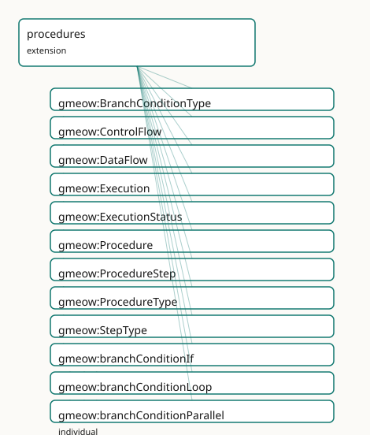

<!-- GENERATED by gmeow ontology-docs. DO NOT EDIT. Source hash: c99d8d50c0344040. -->

# GMEOW Procedures Module

- **IRI:** <https://blackcatinformatics.ca/gmeow/slices/procedures>
- **Tier:** extension
- **[`Group`](../reference/classes/gmeow-Group.md):** extensions

## What This Slice Covers

This slice owns 72 terms and contributes 38 mapping or projection rows. Use it when its terms match the native fact you want to preserve; use the linkage tables to see how those facts leave GMEOW for consumer vocabularies.

## Dependencies

- [`gmeow:slices/events`](events.md)
- [`gmeow:slices/kernel`](kernel.md)

## Consumers

- The universal process/procedure/plan generalization for workflows and recipes.

## Local Map

## Terms

### Classes

| Term | Label | Definition |
|---|---|---|
| [`gmeow:BranchConditionType`](../reference/classes/gmeow-BranchConditionType.md) | Branch Condition Type | The kind of guard condition on a control-flow edge — a VALUE, never a subclass. Evaluated solver-side ([Principle 12](https://github.com/Blackcat-Informatics/gmeow-ontology/blob/main/CONSTITUTION.md#principle-12)). The set is open; new condition kinds are... |
| [`gmeow:ControlFlow`](../reference/classes/gmeow-ControlFlow.md) | Control Flow | A reified relator that connects two ProcedureSteps in a control-flow relationship — sequencing, branching, or looping. Reuses the Participation idiom: mediates... |
| [`gmeow:DataFlow`](../reference/classes/gmeow-DataFlow.md) | Data Flow | A reified relator that connects a ProcedureStep's output to another ProcedureStep's input. Mediates a source step, a target step, and the data entity that flow... |
| [`gmeow:Execution`](../reference/classes/gmeow-Execution.md) | Execution | An event that enacts a Procedure or one of its ProcedureSteps. The execution side of the plan ⟂ execution de-conflation: an occurrence that realises a prescrip... |
| [`gmeow:ExecutionStatus`](../reference/classes/gmeow-ExecutionStatus.md) | Execution Status | The status of an Execution occurrence — a VALUE, never a subclass. The set is open; new statuses are fresh individuals. |
| [`gmeow:Procedure`](../reference/classes/gmeow-Procedure.md) | Procedure | A prescriptive specification — a template, recipe, protocol, blueprint, workflow definition, or pipeline spec. The plan side of the plan ⟂ execution de-conflat... |
| [`gmeow:ProcedureStep`](../reference/classes/gmeow-ProcedureStep.md) | Procedure Step | An atomic step within a Procedure. Carries inputs, outputs, and parameters. May itself reference a subprocess Procedure via [`gmeow:stepEnactsProcedure`](../reference/properties/gmeow-stepEnactsProcedure.md). The kind... |
| [`gmeow:ProcedureType`](../reference/classes/gmeow-ProcedureType.md) | Procedure Type | The kind of a procedure — a VALUE, never a Procedure subclass. The set is open; a kind not among the seed individuals is a FRESH [`gmeow:ProcedureType`](../reference/classes/gmeow-ProcedureType.md) individual... |
| [`gmeow:StepType`](../reference/classes/gmeow-StepType.md) | Step Type | The kind of a procedure step — a VALUE, never a ProcedureStep subclass. The set is open; a kind not among the seed individuals is a FRESH [`gmeow:StepType`](../reference/classes/gmeow-StepType.md) indivi... |

### Properties

| Term | Label | Definition |
|---|---|---|
| [`gmeow:dataFlowEntity`](../reference/properties/gmeow-dataFlowEntity.md) | data flow entity | The data entity that flows from the source step to the target step via a data-flow relator. Non-functional: multiple entities may flow on the same edge, and co... |
| [`gmeow:dataFlowSource`](../reference/properties/gmeow-dataFlowSource.md) | data flow source | The producing ProcedureStep of a data-flow relator. Functional: one source per data-flow edge. |
| [`gmeow:dataFlowTarget`](../reference/properties/gmeow-dataFlowTarget.md) | data flow target | The consuming ProcedureStep of a data-flow relator. Functional: one target per data-flow edge. |
| [`gmeow:executesProcedure`](../reference/properties/gmeow-executesProcedure.md) | executes procedure | Relates an Execution to the Procedure it enacts. Non-functional: an execution may enact multiple procedures (a combined run), and competing enactment claims co... |
| [`gmeow:executesStep`](../reference/properties/gmeow-executesStep.md) | executes step | Relates an Execution to the specific ProcedureStep it enacts. Non-functional: an execution may enact multiple steps (a batch run), and competing enactment clai... |
| [`gmeow:executionParticipant`](../reference/properties/gmeow-executionParticipant.md) | execution participant | An agent that took part in an execution — the flat 80%-case shortcut. Non-functional. Promote to a [`gmeow:Participation`](../reference/classes/gmeow-Participation.md) node when the role, period, confidence,... |
| [`gmeow:executionStatus`](../reference/properties/gmeow-executionStatus.md) | execution status | The status of an execution occurrence, drawn from the open [`gmeow:ExecutionStatus`](../reference/classes/gmeow-ExecutionStatus.md) value vocabulary. Non-functional: competing assessments from different monitor... |
| [`gmeow:flowGuard`](../reference/properties/gmeow-flowGuard.md) | flow guard | The guard condition type on a control-flow edge. The actual truth evaluation (the condition expression, variable bindings, etc.) is solver-side ([Principle 12](https://github.com/Blackcat-Informatics/gmeow-ontology/blob/main/CONSTITUTION.md#principle-12));... |
| [`gmeow:flowOrder`](../reference/properties/gmeow-flowOrder.md) | flow order | An explicit ordering index on a control-flow edge, used when the graph structure alone is insufficient to determine sequence (e.g. linear pipelines). Optional;... |
| [`gmeow:flowSource`](../reference/properties/gmeow-flowSource.md) | flow source | The source ProcedureStep of a control-flow relator. Functional: one source per control-flow edge. |
| [`gmeow:flowTarget`](../reference/properties/gmeow-flowTarget.md) | flow target | The target ProcedureStep of a control-flow relator. Functional: one target per control-flow edge. |
| [`gmeow:hasProcedureStep`](../reference/properties/gmeow-hasProcedureStep.md) | has procedure step | Relates a Procedure to a step it contains. Specialisation of the universal [`gmeow:hasPart`](../reference/properties/gmeow-hasPart.md) spine. |
| [`gmeow:hasSubProcedure`](../reference/properties/gmeow-hasSubProcedure.md) | has sub-procedure | Relates a Procedure to a constituent subprocess Procedure; the transitive inverse of [`gmeow:subProcedureOf`](../reference/properties/gmeow-subProcedureOf.md). |
| [`gmeow:inquiryPriority`](../reference/properties/gmeow-inquiryPriority.md) | inquiry priority | The priority of a research inquiry, on a 1–10 scale. Applies to Procedures of type researchPlan. |
| [`gmeow:inquirySource`](../reference/properties/gmeow-inquirySource.md) | inquiry source | The source that prompted the research inquiry — a document, observation, or tip. Applies to Procedures of type researchPlan. Reuses the sources module. |
| [`gmeow:inquiryStatus`](../reference/properties/gmeow-inquiryStatus.md) | inquiry status | The status of a research inquiry, drawn from the [`gmeow:ExecutionStatus`](../reference/classes/gmeow-ExecutionStatus.md) value vocabulary. Applies to Procedures of type researchPlan. Non-functional: competing... |
| [`gmeow:inquiryTheme`](../reference/properties/gmeow-inquiryTheme.md) | inquiry theme | The thematic area or topic of a research inquiry. Applies to Procedures of type researchPlan. Open vocabulary — any literal is valid. |
| [`gmeow:procedureStepOf`](../reference/properties/gmeow-procedureStepOf.md) | procedure step of | Relates a ProcedureStep to the Procedure it is part of; the inverse of [`gmeow:hasProcedureStep`](../reference/properties/gmeow-hasProcedureStep.md). |
| [`gmeow:procedureStepType`](../reference/properties/gmeow-procedureStepType.md) | procedure step type | The kind(s) of a procedure step, drawn from the open [`gmeow:StepType`](../reference/classes/gmeow-StepType.md) value vocabulary. Non-functional: a step may serve several purposes, and competing standpoi... |
| [`gmeow:procedureType`](../reference/properties/gmeow-procedureType.md) | procedure type | The kind(s) of a procedure, drawn from the open [`gmeow:ProcedureType`](../reference/classes/gmeow-ProcedureType.md) value vocabulary. Non-functional: a procedure may serve several purposes (a research plan t... |
| [`gmeow:resolvedByArtifact`](../reference/properties/gmeow-resolvedByArtifact.md) | resolved by artifact | The artifact — document, observation, claim, or other entity — that resolves the research inquiry. Applies to Procedures of type researchPlan. Non-functional:... |
| [`gmeow:stepEnactsProcedure`](../reference/properties/gmeow-stepEnactsProcedure.md) | step enacts procedure | Relates a ProcedureStep to the subprocess Procedure it enacts. Used when a step is a subprocess ([`gmeow:stepTypeSubprocess`](../reference/individuals/gmeow-stepTypeSubprocess.md)): the step references the Procedure t... |
| [`gmeow:stepInput`](../reference/properties/gmeow-stepInput.md) | step input | An entity consumed by a procedure step — a dataset, ingredient, document, tool, or any other resource. Range is [owl:Thing](http://www.w3.org/2002/07/owl#Thing) to admit any input type. Non-function... |
| [`gmeow:stepOutput`](../reference/properties/gmeow-stepOutput.md) | step output | An entity produced by a procedure step — a derived dataset, claim, event, observation, or artifact. Range is [owl:Thing.](http://www.w3.org/2002/07/owl#Thing.) Non-functional: a step may have multipl... |
| [`gmeow:stepParameter`](../reference/properties/gmeow-stepParameter.md) | step parameter | A configurable parameter of a procedure step — a setting, threshold, or variable that governs the step's behaviour without being consumed as input. Range is ow... |
| [`gmeow:subProcedureOf`](../reference/properties/gmeow-subProcedureOf.md) | sub-procedure of | Relates a Procedure to a larger Procedure it is part of — subprocess composition. Transitive: a part of a part is a part. Specialisation of the universal gmeow... |

### Individuals

| Term | Label | Definition |
|---|---|---|
| [`gmeow:branchConditionIf`](../reference/individuals/gmeow-branchConditionIf.md) | if | A conditional if-then branch. |
| [`gmeow:branchConditionLoop`](../reference/individuals/gmeow-branchConditionLoop.md) | loop | An iterative loop-back branch. |
| [`gmeow:branchConditionParallel`](../reference/individuals/gmeow-branchConditionParallel.md) | parallel | A parallel split or join branch. |
| [`gmeow:branchConditionSwitch`](../reference/individuals/gmeow-branchConditionSwitch.md) | switch | A multi-way switch branch. |
| [`gmeow:executionStatusCancelled`](../reference/individuals/gmeow-executionStatusCancelled.md) | cancelled | The execution was cancelled before completion. |
| [`gmeow:executionStatusFailed`](../reference/individuals/gmeow-executionStatusFailed.md) | failed | The execution failed or aborted. |
| [`gmeow:executionStatusPending`](../reference/individuals/gmeow-executionStatusPending.md) | pending | The execution is scheduled but has not started. |
| [`gmeow:executionStatusRunning`](../reference/individuals/gmeow-executionStatusRunning.md) | running | The execution is currently in progress. |
| [`gmeow:executionStatusSkipped`](../reference/individuals/gmeow-executionStatusSkipped.md) | skipped | The execution was skipped (e.g. by a branch guard). |
| [`gmeow:executionStatusSucceeded`](../reference/individuals/gmeow-executionStatusSucceeded.md) | succeeded | The execution completed successfully. |
| [`gmeow:flowIngestion1`](../reference/individuals/gmeow-flowIngestion1.md) | ingestion 1 | The ingestion 1 control flow — a named stage or pattern in a procedural or data-ingestion pipeline. |
| [`gmeow:flowIngestion2`](../reference/individuals/gmeow-flowIngestion2.md) | ingestion 2 | The ingestion 2 control flow — a named stage or pattern in a procedural or data-ingestion pipeline. |
| [`gmeow:flowIngestion3`](../reference/individuals/gmeow-flowIngestion3.md) | ingestion 3 | The ingestion 3 control flow — a named stage or pattern in a procedural or data-ingestion pipeline. |
| [`gmeow:flowIngestion4`](../reference/individuals/gmeow-flowIngestion4.md) | ingestion 4 | The ingestion 4 control flow — a named stage or pattern in a procedural or data-ingestion pipeline. |
| [`gmeow:flowIngestion5`](../reference/individuals/gmeow-flowIngestion5.md) | ingestion 5 | The ingestion 5 control flow — a named stage or pattern in a procedural or data-ingestion pipeline. |
| [`gmeow:procedureIngestionCanonical`](../reference/individuals/gmeow-procedureIngestionCanonical.md) | Canonical Ingestion Procedure | A worked-example ingestion procedure that supersedes the 'source-packet bundle' idea. Six sequential steps from raw-root acquisition to privacy-posture assessm... |
| [`gmeow:procedureIngestionRawRoot`](../reference/individuals/gmeow-procedureIngestionRawRoot.md) | raw root data source | The raw root data source produced by the ingestion procedure. |
| [`gmeow:procedureTypeAgentFlow`](../reference/individuals/gmeow-procedureTypeAgentFlow.md) | agent flow | An LLM or software-agent orchestration flow. |
| [`gmeow:procedureTypeBusinessProcess`](../reference/individuals/gmeow-procedureTypeBusinessProcess.md) | business process | A business process or workflow (BPMN). |
| [`gmeow:procedureTypeCiBuild`](../reference/individuals/gmeow-procedureTypeCiBuild.md) | CI build | A continuous-integration or build pipeline. |
| [`gmeow:procedureTypeDataPipeline`](../reference/individuals/gmeow-procedureTypeDataPipeline.md) | data pipeline | A data-ingestion, ETL, or transformation pipeline. |
| [`gmeow:procedureTypeIngestion`](../reference/individuals/gmeow-procedureTypeIngestion.md) | ingestion | A source-packet ingestion or import procedure. |
| [`gmeow:procedureTypeLabProtocol`](../reference/individuals/gmeow-procedureTypeLabProtocol.md) | lab protocol | A laboratory protocol or experimental procedure (OBI). |
| [`gmeow:procedureTypeRecipe`](../reference/individuals/gmeow-procedureTypeRecipe.md) | recipe | A cooking recipe or culinary procedure. |
| [`gmeow:procedureTypeResearchPlan`](../reference/individuals/gmeow-procedureTypeResearchPlan.md) | research plan | A planned inquiry, open lead, or research question. |
| [`gmeow:stepIngestionDerivedClaims`](../reference/individuals/gmeow-stepIngestionDerivedClaims.md) | derived claims / events generation | Generate derived claims and events from extracted text. |
| [`gmeow:stepIngestionFileCopy`](../reference/individuals/gmeow-stepIngestionFileCopy.md) | file copy / staging | Copy and stage files from the raw root. |
| [`gmeow:stepIngestionOcrExtract`](../reference/individuals/gmeow-stepIngestionOcrExtract.md) | OCR / text extraction | Perform OCR and extract text from staged files. |
| [`gmeow:stepIngestionPrivacyPosture`](../reference/individuals/gmeow-stepIngestionPrivacyPosture.md) | privacy posture assessment | Assess the privacy posture of the ingested data and derived claims. |
| [`gmeow:stepIngestionRawRoot`](../reference/individuals/gmeow-stepIngestionRawRoot.md) | raw root acquisition | Acquire the raw root data source. |
| [`gmeow:stepIngestionUnresolvedLeads`](../reference/individuals/gmeow-stepIngestionUnresolvedLeads.md) | unresolved leads identification | Identify unresolved leads from the generated claims. |
| [`gmeow:stepTypeAtomic`](../reference/individuals/gmeow-stepTypeAtomic.md) | atomic step | An atomic, indivisible action step. |
| [`gmeow:stepTypeBranch`](../reference/individuals/gmeow-stepTypeBranch.md) | branch step | A guarded decision point (BPMN gateway). Must be the source of at least two ControlFlow relators. |
| [`gmeow:stepTypeEnd`](../reference/individuals/gmeow-stepTypeEnd.md) | end step | The terminal point of a procedure. |
| [`gmeow:stepTypeParallel`](../reference/individuals/gmeow-stepTypeParallel.md) | parallel step | A fork or join point for parallel execution. |
| [`gmeow:stepTypeStart`](../reference/individuals/gmeow-stepTypeStart.md) | start step | The entry point of a procedure. |
| [`gmeow:stepTypeSubprocess`](../reference/individuals/gmeow-stepTypeSubprocess.md) | subprocess step | A step that is itself a Procedure, enacted via [`gmeow:stepEnactsProcedure`](../reference/properties/gmeow-stepEnactsProcedure.md). |

## Linkages

- **Rows:** 38
- **Projection profiles:** `schema-org`
- **External vocabularies:** `bpmn`, `obi`, `opmw`, `pplan`, `prov`, `rdf`, `ro_crate`, `schema`

| Source | Kind | Profile | Predicate/Relation | Target | Evidence |
|---|---|---|---|---|---|
| [`gmeow:ControlFlow`](../reference/classes/gmeow-ControlFlow.md) | equivalence | `-` | [skos:relatedMatch](http://www.w3.org/2004/02/skos/core#relatedMatch) | [bpmn:sequenceFlow](http://www.omg.org/spec/BPMN/20100524/MODEL#sequenceFlow) | `gmeow-procedures.sssom.tsv`; `gmeow:eqProc024`; confidence 0.7 |
| [`gmeow:ControlFlow`](../reference/classes/gmeow-ControlFlow.md) | equivalence | `-` | [skos:relatedMatch](http://www.w3.org/2004/02/skos/core#relatedMatch) | [pplan:precededBy](http://purl.org/net/p-plan#precededBy) | `gmeow-procedures.sssom.tsv`; `gmeow:eqProc006`; confidence 0.6 |
| [`gmeow:DataFlow`](../reference/classes/gmeow-DataFlow.md) | equivalence | `-` | [skos:relatedMatch](http://www.w3.org/2004/02/skos/core#relatedMatch) | [bpmn:dataAssociation](http://www.omg.org/spec/BPMN/20100524/MODEL#dataAssociation) | `gmeow-procedures.sssom.tsv`; `gmeow:eqProc025`; confidence 0.6 |
| [`gmeow:Execution`](../reference/classes/gmeow-Execution.md) | equivalence | `-` | [skos:closeMatch](http://www.w3.org/2004/02/skos/core#closeMatch) | obi:0000011 | `gmeow-procedures.sssom.tsv`; `gmeow:eqProc022`; confidence 0.8 |
| [`gmeow:Execution`](../reference/classes/gmeow-Execution.md) | equivalence | `-` | [skos:closeMatch](http://www.w3.org/2004/02/skos/core#closeMatch) | [opmw:WorkflowExecution](https://www.opmw.org/ontology/WorkflowExecution) | `gmeow-procedures.sssom.tsv`; `gmeow:eqProc019`; confidence 0.8 |
| [`gmeow:Execution`](../reference/classes/gmeow-Execution.md) | equivalence | `-` | [skos:closeMatch](http://www.w3.org/2004/02/skos/core#closeMatch) | [pplan:Activity](http://purl.org/net/p-plan#Activity) | `gmeow-procedures.sssom.tsv`; `gmeow:eqProc003`; confidence 0.8 |
| [`gmeow:Execution`](../reference/classes/gmeow-Execution.md) | equivalence | `-` | [skos:closeMatch](http://www.w3.org/2004/02/skos/core#closeMatch) | [prov:Activity](http://www.w3.org/ns/prov#Activity) | `gmeow-procedures.sssom.tsv`; `gmeow:eqProc008`; confidence 0.85 |
| [`gmeow:Execution`](../reference/classes/gmeow-Execution.md) | equivalence | `-` | [skos:relatedMatch](http://www.w3.org/2004/02/skos/core#relatedMatch) | [ro_crate:CreateAction](https://w3id.org/ro/crate/#CreateAction) | `gmeow-procedures.sssom.tsv`; `gmeow:eqProc026`; confidence 0.7 |
| [`gmeow:Procedure`](../reference/classes/gmeow-Procedure.md) | equivalence | `-` | [skos:closeMatch](http://www.w3.org/2004/02/skos/core#closeMatch) | obi:0000272 | `gmeow-procedures.sssom.tsv`; `gmeow:eqProc021`; confidence 0.85 |
| [`gmeow:Procedure`](../reference/classes/gmeow-Procedure.md) | equivalence | `-` | [skos:closeMatch](http://www.w3.org/2004/02/skos/core#closeMatch) | [opmw:WorkflowTemplate](https://www.opmw.org/ontology/WorkflowTemplate) | `gmeow-procedures.sssom.tsv`; `gmeow:eqProc018`; confidence 0.8 |
| [`gmeow:Procedure`](../reference/classes/gmeow-Procedure.md) | equivalence | `-` | [skos:closeMatch](http://www.w3.org/2004/02/skos/core#closeMatch) | [pplan:Plan](http://purl.org/net/p-plan#Plan) | `gmeow-procedures.sssom.tsv`; `gmeow:eqProc001`; confidence 0.85 |
| [`gmeow:Procedure`](../reference/classes/gmeow-Procedure.md) | equivalence | `-` | [skos:closeMatch](http://www.w3.org/2004/02/skos/core#closeMatch) | [prov:Plan](http://www.w3.org/ns/prov#Plan) | `gmeow-procedures.sssom.tsv`; `gmeow:eqProc007`; confidence 0.8 |
| [`gmeow:Procedure`](../reference/classes/gmeow-Procedure.md) | equivalence | `-` | [skos:closeMatch](http://www.w3.org/2004/02/skos/core#closeMatch) | [schema:HowTo](https://schema.org/HowTo) | `gmeow-procedures.sssom.tsv`; `gmeow:eqProc011`; confidence 0.85 |
| [`gmeow:Procedure`](../reference/classes/gmeow-Procedure.md) | equivalence | `-` | [skos:closeMatch](http://www.w3.org/2004/02/skos/core#closeMatch) | [schema:Recipe](https://schema.org/Recipe) | `gmeow-procedures.sssom.tsv`; `gmeow:eqProc012`; confidence 0.9 |
| [`gmeow:ProcedureStep`](../reference/classes/gmeow-ProcedureStep.md) | equivalence | `-` | [skos:closeMatch](http://www.w3.org/2004/02/skos/core#closeMatch) | [opmw:WorkflowTemplateProcess](https://www.opmw.org/ontology/WorkflowTemplateProcess) | `gmeow-procedures.sssom.tsv`; `gmeow:eqProc020`; confidence 0.75 |
| [`gmeow:ProcedureStep`](../reference/classes/gmeow-ProcedureStep.md) | equivalence | `-` | [skos:closeMatch](http://www.w3.org/2004/02/skos/core#closeMatch) | [pplan:Step](http://purl.org/net/p-plan#Step) | `gmeow-procedures.sssom.tsv`; `gmeow:eqProc002`; confidence 0.85 |
| [`gmeow:ProcedureStep`](../reference/classes/gmeow-ProcedureStep.md) | equivalence | `-` | [skos:closeMatch](http://www.w3.org/2004/02/skos/core#closeMatch) | [schema:HowToStep](https://schema.org/HowToStep) | `gmeow-procedures.sssom.tsv`; `gmeow:eqProc013`; confidence 0.85 |
| [`gmeow:hasProcedureStep`](../reference/properties/gmeow-hasProcedureStep.md) | equivalence | `-` | [skos:closeMatch](http://www.w3.org/2004/02/skos/core#closeMatch) | [schema:step](https://schema.org/step) | `gmeow-procedures.sssom.tsv`; `gmeow:eqProc017`; confidence 0.85 |
| [`gmeow:stepInput`](../reference/properties/gmeow-stepInput.md) | equivalence | `-` | [skos:closeMatch](http://www.w3.org/2004/02/skos/core#closeMatch) | [pplan:Input](http://purl.org/net/p-plan#Input) | `gmeow-procedures.sssom.tsv`; `gmeow:eqProc004`; confidence 0.8 |
| [`gmeow:stepInput`](../reference/properties/gmeow-stepInput.md) | equivalence | `-` | [skos:closeMatch](http://www.w3.org/2004/02/skos/core#closeMatch) | [prov:used](http://www.w3.org/ns/prov#used) | `gmeow-procedures.sssom.tsv`; `gmeow:eqProc009`; confidence 0.7 |
| [`gmeow:stepInput`](../reference/properties/gmeow-stepInput.md) | equivalence | `-` | [skos:closeMatch](http://www.w3.org/2004/02/skos/core#closeMatch) | [schema:supply](https://schema.org/supply) | `gmeow-procedures.sssom.tsv`; `gmeow:eqProc014`; confidence 0.7 |
| [`gmeow:stepInput`](../reference/properties/gmeow-stepInput.md) | equivalence | `-` | [skos:closeMatch](http://www.w3.org/2004/02/skos/core#closeMatch) | [schema:tool](https://schema.org/tool) | `gmeow-procedures.sssom.tsv`; `gmeow:eqProc015`; confidence 0.7 |
| [`gmeow:stepOutput`](../reference/properties/gmeow-stepOutput.md) | equivalence | `-` | [skos:closeMatch](http://www.w3.org/2004/02/skos/core#closeMatch) | [pplan:Output](http://purl.org/net/p-plan#Output) | `gmeow-procedures.sssom.tsv`; `gmeow:eqProc005`; confidence 0.8 |
| [`gmeow:stepOutput`](../reference/properties/gmeow-stepOutput.md) | equivalence | `-` | [skos:closeMatch](http://www.w3.org/2004/02/skos/core#closeMatch) | [prov:wasGeneratedBy](http://www.w3.org/ns/prov#wasGeneratedBy) | `gmeow-procedures.sssom.tsv`; `gmeow:eqProc010`; confidence 0.7 |
|... |... |... |... |... | 14 more rows |

## Guide

<!-- SPDX-FileCopyrightText: 2026 Blackcat Informatics® Inc. <paudley@blackcatinformatics.ca> -->
<!-- SPDX-License-Identifier: CC-BY-4.0 -->

# Procedures — alignment & projection reference

The alignment and projection companion to the procedures module
(`ontology/modules/procedures.ttl`). Everything here is **authored once** in
`mapping-dsl/` and generated by `gmeow compile-mappings` ([Principle 4](https://github.com/Blackcat-Informatics/gmeow-ontology/blob/main/CONSTITUTION.md#principle-4)); nothing in
`mappings/`, `projections/`, or `queries/projections/` is hand-edited.

## The plan ⟂ execution de-conflation

GMEOW models occurrences richly — [`gmeow:Event`](../reference/classes/gmeow-Event.md), [`gmeow:Participation`](../reference/classes/gmeow-Participation.md),
[`gmeow:Activity`](../reference/classes/gmeow-Activity.md), the Allen interval relations — but until now it had no
prescriptive layer. This slice introduces the **plan ⟂ execution** split:

| Plan (prescriptive) | Execution (occurrence) |
|---|---|
| [`gmeow:Procedure`](../reference/classes/gmeow-Procedure.md) (⊑ [`InformationObject`](../reference/classes/gmeow-InformationObject.md)) | [`gmeow:Execution`](../reference/classes/gmeow-Execution.md) (⊑ [`Event`](../reference/classes/gmeow-Event.md)) |
| [`gmeow:ProcedureStep`](../reference/classes/gmeow-ProcedureStep.md) (⊑ [`InformationObject`](../reference/classes/gmeow-InformationObject.md)) | enacted by an [`Execution`](../reference/classes/gmeow-Execution.md) |
| [`gmeow:ControlFlow`](../reference/classes/gmeow-ControlFlow.md) / [`gmeow:DataFlow`](../reference/classes/gmeow-DataFlow.md) (relators) | temporal ordering via Allen relations |

One recipe, many prepared meals; one protocol, many runs; one pipeline spec, many
ingestions. The plan side stays in the OWL 2 DL TBox as structure; the execution
side reuses the existing event + participation machinery.

## Terms

| Term | Kind | Role |
|---|---|---|
| [`gmeow:Procedure`](../reference/classes/gmeow-Procedure.md) | class ([`gufo:Kind`](../external/terms.md#gufo-kind) ⊑ [`gmeow:InformationObject`](../reference/classes/gmeow-InformationObject.md)) | the prescriptive spec (template / recipe / protocol / blueprint / workflow definition) |
| [`gmeow:ProcedureStep`](../reference/classes/gmeow-ProcedureStep.md) | class ([`gufo:Kind`](../external/terms.md#gufo-kind) ⊑ [`gmeow:InformationObject`](../reference/classes/gmeow-InformationObject.md)) | an atomic step within a procedure |
| [`gmeow:Execution`](../reference/classes/gmeow-Execution.md) | class ([`gufo:EventType`](../external/terms.md#gufo-eventtype) ⊑ [`gmeow:Event`](../reference/classes/gmeow-Event.md)) | an event that enacts a Procedure or Step |
| [`gmeow:ControlFlow`](../reference/classes/gmeow-ControlFlow.md) | class ([`gufo:Kind`](../external/terms.md#gufo-kind) ⊑ [`gufo:Relator`](../external/terms.md#gufo-relator)) | reified relator connecting two steps in control-flow order |
| [`gmeow:DataFlow`](../reference/classes/gmeow-DataFlow.md) | class ([`gufo:Kind`](../external/terms.md#gufo-kind) ⊑ [`gufo:Relator`](../external/terms.md#gufo-relator)) | reified relator connecting a step's output to another step's input |
| [`gmeow:ProcedureType`](../reference/classes/gmeow-ProcedureType.md) / [`StepType`](../reference/classes/gmeow-StepType.md) / [`BranchConditionType`](../reference/classes/gmeow-BranchConditionType.md) / [`ExecutionStatus`](../reference/classes/gmeow-ExecutionStatus.md) | value vocabularies ([`gufo:QualityValue`](../external/terms.md#gufo-qualityvalue)) | open type/kind/status values ([Principle 9](https://github.com/Blackcat-Informatics/gmeow-ontology/blob/main/CONSTITUTION.md#principle-9)) |
| [`gmeow:hasProcedureStep`](../reference/properties/gmeow-hasProcedureStep.md) / [`procedureStepOf`](../reference/properties/gmeow-procedureStepOf.md) | object properties (not transitive) | procedure-step mereology |
| [`gmeow:subProcedureOf`](../reference/properties/gmeow-subProcedureOf.md) / [`hasSubProcedure`](../reference/properties/gmeow-hasSubProcedure.md) | transitive object properties | recursive subprocess composition |
| [`gmeow:stepInput`](../reference/properties/gmeow-stepInput.md) / [`stepOutput`](../reference/properties/gmeow-stepOutput.md) / [`stepParameter`](../reference/properties/gmeow-stepParameter.md) | object properties | step inputs, outputs, and parameters |
| [`gmeow:executesProcedure`](../reference/properties/gmeow-executesProcedure.md) / [`executesStep`](../reference/properties/gmeow-executesStep.md) | object properties | links an Execution to the plan it enacts |
| [`gmeow:flowSource`](../reference/properties/gmeow-flowSource.md) / [`flowTarget`](../reference/properties/gmeow-flowTarget.md) / [`flowGuard`](../reference/properties/gmeow-flowGuard.md) / [`flowOrder`](../reference/properties/gmeow-flowOrder.md) | properties on [`ControlFlow`](../reference/classes/gmeow-ControlFlow.md) | control-flow relator structure |
| [`gmeow:dataFlowSource`](../reference/properties/gmeow-dataFlowSource.md) / [`dataFlowTarget`](../reference/properties/gmeow-dataFlowTarget.md) / [`dataFlowEntity`](../reference/properties/gmeow-dataFlowEntity.md) | properties on [`DataFlow`](../reference/classes/gmeow-DataFlow.md) | data-flow relator structure |
| [`gmeow:executionParticipant`](../reference/properties/gmeow-executionParticipant.md) | object property | flat shortcut for agent/tool assignment to an Execution |
| [`gmeow:inquiryPriority`](../reference/properties/gmeow-inquiryPriority.md) / [`inquiryTheme`](../reference/properties/gmeow-inquiryTheme.md) / [`inquirySource`](../reference/properties/gmeow-inquirySource.md) / [`inquiryStatus`](../reference/properties/gmeow-inquiryStatus.md) / [`resolvedByArtifact`](../reference/properties/gmeow-resolvedByArtifact.md) | properties on [`Procedure`](../reference/classes/gmeow-Procedure.md) | research-inquiry profile extensions |

## SSSOM alignments (`mapping-dsl/equivalences/procedures.ttl`)

All by reference ([Principle 5](https://github.com/Blackcat-Informatics/gmeow-ontology/blob/main/CONSTITUTION.md#principle-5)) — GMEOW never imports an external axiom. Compiled to
`mappings/gmeow-procedures.sssom.tsv` (26 rows).

| GMEOW | predicate | external target |
|---|---|---|
| [`gmeow:Procedure`](../reference/classes/gmeow-Procedure.md) | closeMatch | [`pplan:Plan`](http://purl.org/net/p-plan#Plan), [`prov:Plan`](http://www.w3.org/ns/prov#Plan), [`schema:HowTo`](https://schema.org/HowTo), [`schema:Recipe`](https://schema.org/Recipe), [`opmw:WorkflowTemplate`](https://www.opmw.org/ontology/WorkflowTemplate), [`obi:OBI_0000272`](http://purl.obolibrary.org/obo/OBI_OBI_0000272) (protocol) |
| [`gmeow:ProcedureStep`](../reference/classes/gmeow-ProcedureStep.md) | closeMatch | [`pplan:Step`](http://purl.org/net/p-plan#Step), [`schema:HowToStep`](https://schema.org/HowToStep), [`opmw:WorkflowTemplateProcess`](https://www.opmw.org/ontology/WorkflowTemplateProcess) |
| [`gmeow:Execution`](../reference/classes/gmeow-Execution.md) | closeMatch | [`pplan:Activity`](http://purl.org/net/p-plan#Activity), [`prov:Activity`](http://www.w3.org/ns/prov#Activity), [`opmw:WorkflowExecution`](https://www.opmw.org/ontology/WorkflowExecution), [`obi:OBI_0000011`](http://purl.obolibrary.org/obo/OBI_OBI_0000011) (planned process) |
| [`gmeow:stepInput`](../reference/properties/gmeow-stepInput.md) | closeMatch | [`pplan:Input`](http://purl.org/net/p-plan#Input), [`prov:used`](http://www.w3.org/ns/prov#used), [`schema:supply`](https://schema.org/supply), [`schema:tool`](https://schema.org/tool) |
| [`gmeow:stepOutput`](../reference/properties/gmeow-stepOutput.md) | closeMatch | [`pplan:Output`](http://purl.org/net/p-plan#Output), [`prov:wasGeneratedBy`](http://www.w3.org/ns/prov#wasGeneratedBy), [`schema:result`](https://schema.org/result) |
| [`gmeow:ControlFlow`](../reference/classes/gmeow-ControlFlow.md) | relatedMatch | [`pplan:precededBy`](http://purl.org/net/p-plan#precededBy), [`bpmn:sequenceFlow`](http://www.omg.org/spec/BPMN/20100524/MODEL#sequenceFlow) |
| [`gmeow:DataFlow`](../reference/classes/gmeow-DataFlow.md) | relatedMatch | [`bpmn:dataAssociation`](http://www.omg.org/spec/BPMN/20100524/MODEL#dataAssociation) |
| [`gmeow:hasProcedureStep`](../reference/properties/gmeow-hasProcedureStep.md) | closeMatch | [`schema:step`](https://schema.org/step) |
| [`gmeow:stepTypeBranch`](../reference/individuals/gmeow-stepTypeBranch.md) | relatedMatch | [`bpmn:gateway`](http://www.omg.org/spec/BPMN/20100524/MODEL#gateway) |
| [`gmeow:Execution`](../reference/classes/gmeow-Execution.md) | relatedMatch | `ro-crate:CreateAction` (Workflow-Run profile) |

### Standards bridged

- **[P-Plan](../external/ontologies.md#target-pplan)** ([`pplan:`](http://purl.org/net/p-plan#)) — the closest peer model: `Plan`, `Step`, [`Activity`](../reference/classes/gmeow-Activity.md), `Input`, `Output`, `Variable`, `precededBy`.
- **[PROV-O](../external/ontologies.md#target-prov)** ([`prov:`](http://www.w3.org/ns/prov#)) — `Plan`, [`Activity`](../reference/classes/gmeow-Activity.md), `used`, [`wasGeneratedBy`](../reference/properties/gmeow-wasGeneratedBy.md).
- **schema.org** ([`schema:`](https://schema.org/)) — `HowTo`, `HowToStep`, `HowToTool`, `HowToSupply`, `Recipe`, `Action`.
- **OPMW** ([`opmw:`](https://www.opmw.org/ontology/)) — `WorkflowTemplate`, `WorkflowExecution`, `WorkflowTemplateProcess`.
- **OBI** ([`obi:`](http://purl.obolibrary.org/obo/OBI_)) — `protocol` (OBI:0000272), `planned process` (OBI:0000011).
- **BPMN** ([`bpmn:`](http://www.omg.org/spec/BPMN/20100524/MODEL#)) — conceptual alignment to `gateway`, `sequenceFlow`, `dataAssociation`.
- **RO-Crate Workflow-Run** — `CreateAction` for reproducibility.

## Projections (`mapping-dsl/projections/schema-org-procedures.ttl`)

Compiled into `projections/schema-org.edoal.ttl` and
`queries/projections/schema-org.rq` (the procedure branch is emitted alongside
all other schema-org projections).

| GMEOW | schema.org target | lossiness |
|---|---|---|
| [`Procedure`](../reference/classes/gmeow-Procedure.md) (default) | [`schema:HowTo`](https://schema.org/HowTo) | — |
| [`Procedure`](../reference/classes/gmeow-Procedure.md) (type = recipe) | [`schema:Recipe`](https://schema.org/Recipe) | type-driven dispatch |
| [`ProcedureStep`](../reference/classes/gmeow-ProcedureStep.md) | [`schema:HowToStep`](https://schema.org/HowToStep) | — |
| [`hasProcedureStep`](../reference/properties/gmeow-hasProcedureStep.md) | [`schema:step`](https://schema.org/step) | — |
| [`stepInput`](../reference/properties/gmeow-stepInput.md) | [`schema:supply`](https://schema.org/supply) / [`schema:tool`](https://schema.org/tool) | typed collapse |
| [`stepOutput`](../reference/properties/gmeow-stepOutput.md) | [`schema:result`](https://schema.org/result) | — |
| [`Execution`](../reference/classes/gmeow-Execution.md) | [`schema:Action`](https://schema.org/Action) | plan/execution split flattened |

## Seed profiles

Two worked-example profiles demonstrate the generalisation:

### Ingestion-process profile

Supersedes the "source-packet bundle" idea. A [`Procedure`](../reference/classes/gmeow-Procedure.md) of type `ingestion` with
six sequential steps connected by [`ControlFlow`](../reference/classes/gmeow-ControlFlow.md) relators:

1. raw root acquisition
2. file copy / staging
3. OCR / text extraction
4. derived claims / events generation
5. unresolved leads identification
6. privacy posture assessment

### Research-inquiry profile

Supersedes the flat research-queue. A [`Procedure`](../reference/classes/gmeow-Procedure.md) of type `researchPlan` with
profile-specific properties:

- [`inquiryPriority`](../reference/properties/gmeow-inquiryPriority.md) — 1–10 scale
- [`inquiryTheme`](../reference/properties/gmeow-inquiryTheme.md) — thematic area (open vocab)
- [`inquirySource`](../reference/properties/gmeow-inquirySource.md) — the source that prompted the inquiry
- [`inquiryStatus`](../reference/properties/gmeow-inquiryStatus.md) — pending / running / succeeded / failed / …
- [`resolvedByArtifact`](../reference/properties/gmeow-resolvedByArtifact.md) — the artifact that resolves the inquiry

## Solver-side concerns ([Principle 12](https://github.com/Blackcat-Informatics/gmeow-ontology/blob/main/CONSTITUTION.md#principle-12))

The OWL 2 DL core holds structure only. The following are computed, not asserted:

- **[`Branch`](../reference/classes/gmeow-Branch.md) guard evaluation** — the [`flowGuard`](../reference/properties/gmeow-flowGuard.md) records the condition type; the
 actual truth evaluation (expression, variable bindings) is solver-side.
- **Data-type compatibility** — a [`DataFlow`](../reference/classes/gmeow-DataFlow.md) whose source-step output type mismatches
 the consumer-step input type produces a warning in the SHACL / solver layer, not
 an OWL inconsistency.
- **Step scheduling / ordering** — [`flowOrder`](../reference/properties/gmeow-flowOrder.md) provides an explicit index when needed;
 the default ordering is the [`ControlFlow`](../reference/classes/gmeow-ControlFlow.md) graph structure plus Allen relations at
 the [`Execution`](../reference/classes/gmeow-Execution.md) level.
