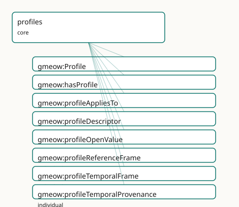

<!-- GENERATED by gmeow ontology-docs. DO NOT EDIT. -->

# GMEOW Profile Meta-pattern Module

- **IRI:** <https://blackcatinformatics.ca/gmeow/slices/profiles>
- **Tier:** core
- **[`Group`](../reference/classes/gmeow-Group.md):** core

## What This Slice Covers

This slice owns 8 terms and contributes 1 mapping or projection rows. Use it when its terms match the native fact you want to preserve; use the linkage tables to see how those facts leave GMEOW for consumer vocabularies.

## Dependencies

- [`gmeow:slices/kernel`](kernel.md)
- [`gmeow:slices/places`](places.md)
- [`gmeow:slices/temporal`](temporal.md)

## Consumers

- The [`Profile`](../reference/classes/gmeow-Profile.md) pattern under every reference frame: temporal, spatial, currency, and tuning frames (pitch frames).

## Local Map



## Examples

### Named Profile Membership

- **Source:** [`slices/core/profiles/examples/named-profile-membership.ttl`](https://github.com/Blackcat-Informatics/gmeow-ontology/blob/main/slices/core/profiles/examples/named-profile-membership.ttl)
- **GMEOW terms:** [`gmeow:CreativeWork`](../reference/classes/gmeow-CreativeWork.md), [`gmeow:Person`](../reference/classes/gmeow-Person.md), [`gmeow:Profile`](../reference/classes/gmeow-Profile.md), [`gmeow:Tag`](../reference/classes/gmeow-Tag.md), [`gmeow:TagScheme`](../reference/classes/gmeow-TagScheme.md), [`gmeow:Tagging`](../reference/classes/gmeow-Tagging.md), [`gmeow:hasProfile`](../reference/properties/gmeow-hasProfile.md), [`gmeow:name`](../reference/properties/gmeow-name.md), [`gmeow:profileAppliesTo`](../reference/properties/gmeow-profileAppliesTo.md), [`gmeow:profileDescriptor`](../reference/properties/gmeow-profileDescriptor.md)
- **External prefixes:** `skos`

```turtle
# SPDX-FileCopyrightText: 2026 Blackcat Informatics® Inc. <paudley@blackcatinformatics.ca>
# SPDX-License-Identifier: CC-BY-4.0
#
# Worked example — the Profile meta-pattern in use: a closed descriptor schema
# over an open value vocabulary, and an instance that claims conformance to it.
#
# A consumer declares a self-describing facet for a TAGGING (the reified
# tagger × tagged × tag × scheme relator) WITHOUT minting per-tag subclasses.
# It mints one gmeow:Profile that names (a) the class it applies to (the existing
# gmeow:Tagging), (b) the descriptor properties that constitute the facet, and
# (c) the open value vocabulary those descriptors draw from (the existing
# gmeow:Tag, whose members are individuals, never subclasses — P9). Extension
# happens by adding Tag INDIVIDUALS — each referenced as the value of the
# gmeow:taggingTag descriptor — never by altering the closed descriptor set. A
# concrete Tagging points at the Profile with gmeow:hasProfile, so a consumer
# holding only the data can dereference the Profile and learn the complete
# schema — the self-description that makes "extensible by construction" a
# structure, not a slogan. The example mints no classes of its own (it reuses
# gmeow:Tagging / gmeow:Tag / gmeow:TagScheme), and asserts no Expression-typed
# value, so no P11 frame is required.

@prefix gmeow: <https://blackcatinformatics.ca/gmeow/> .
@prefix ex:    <https://blackcatinformatics.ca/gmeow/examples/profiles/> .
@prefix rdfs:  <http://www.w3.org/2000/01/rdf-schema#> .
@prefix skos:  <http://www.w3.org/2004/02/skos/core#> .

# --- The Profile: a closed descriptor schema for a tagging. It SELF-DESCRIBES —
#     naming the class it governs (profileAppliesTo gmeow:Tagging), the
#     descriptor properties (profileDescriptor), and the open value class
#     (profileOpenValue gmeow:Tag) — so tooling reads the graph, not code. A
#     Profile MUST carry a skos:definition.
ex:profileTagging a gmeow:Profile ;
    rdfs:label "Tagging Profile"@en ;
    skos:definition "The closed descriptor schema for a reified tagging: the entity tagged, the tag applied (drawn from the open gmeow:Tag vocabulary), the agent who applied it, and the scheme it belongs to. New tags extend the facet as data added to the open value class, with this descriptor set unchanged."@en ;
    gmeow:profileAppliesTo gmeow:Tagging ;
    gmeow:profileDescriptor
        gmeow:taggingTagged ,
        gmeow:taggingTag ,
        gmeow:taggingTagger ,
        gmeow:taggingScheme ;
    gmeow:profileOpenValue gmeow:Tag .

# --- The OPEN value vocabulary in use: gmeow:Tag individuals, referenced below
#     as the value of the gmeow:taggingTag descriptor. New tags are added HERE,
#     as data — the descriptor schema above is never touched.
ex:scheme a gmeow:TagScheme ; rdfs:label "Research topic keywords"@en .
ex:tagML a gmeow:Tag ;
    rdfs:label "machine-learning"@en ;
    gmeow:tagInScheme ex:scheme .

ex:alice a gmeow:Person ; gmeow:name "Alice"@en .
ex:paper a gmeow:CreativeWork ;
    gmeow:title "A Survey of Transformer Architectures"@en .

# --- A concrete Tagging that CLAIMS CONFORMANCE: it carries gmeow:hasProfile
#     pointing at the Profile whose descriptor schema governs it, and supplies
#     descriptor values — including the open-vocabulary tag as the value of
#     gmeow:taggingTag. A consumer can now validate this tagging's shape by
#     dereferencing the Profile alone.
ex:taggingML a gmeow:Tagging ;
    gmeow:hasProfile ex:profileTagging ;
    gmeow:taggingTagged ex:paper ;
    gmeow:taggingTag    ex:tagML ;
    gmeow:taggingTagger ex:alice ;
    gmeow:taggingScheme ex:scheme .
```

## Terms

### Classes

| Term | Label | Definition |
|---|---|---|
| [`gmeow:Profile`](../reference/classes/gmeow-Profile.md) | Profile | A closed descriptor schema for an open-but-structured facet. A Profile self-describes the properties that constitute the facet and the open value vocabularies... |

### Properties

| Term | Label | Definition |
|---|---|---|
| [`gmeow:hasProfile`](../reference/properties/gmeow-hasProfile.md) | has profile | Links an entity, value or frame to the Profile that governs its structure. |
| [`gmeow:profileAppliesTo`](../reference/properties/gmeow-profileAppliesTo.md) | profile applies to | The class of entities to which this Profile applies. |
| [`gmeow:profileDescriptor`](../reference/properties/gmeow-profileDescriptor.md) | profile descriptor | A property that is part of this Profile's closed descriptor schema. |
| [`gmeow:profileOpenValue`](../reference/properties/gmeow-profileOpenValue.md) | profile open value | An open value-vocabulary class (instances are individuals, never subclasses) used by this Profile. |

### Individuals

| Term | Label | Definition |
|---|---|---|
| [`gmeow:profileReferenceFrame`](../reference/individuals/gmeow-profileReferenceFrame.md) | Reference Frame Profile | The closed descriptor schema for [`gmeow:ReferenceFrame`](../reference/classes/gmeow-ReferenceFrame.md) instances: realm, axes, dimensionality, kind, host-dependence, determinacy, metric, and transform descrip... |
| [`gmeow:profileTemporalFrame`](../reference/individuals/gmeow-profileTemporalFrame.md) | Temporal Frame Profile | The closed descriptor schema for [`gmeow:TemporalFrame`](../reference/classes/gmeow-TemporalFrame.md) instances: the reference-frame spine plus time scale, calendar system, and reference position. |
| [`gmeow:profileTemporalProvenance`](../reference/individuals/gmeow-profileTemporalProvenance.md) | Temporal Provenance Profile (four clocks) | The closed descriptor schema for statement-level temporal provenance: valid-from, valid-until, asserted-at, and recorded-no-later-than. Applies to statements,... |

## Linkages

- **Rows:** 1
- **Projection profiles:** -
- **External vocabularies:** `prof`

| Source | Kind | Profile | Predicate/Relation | Target | Evidence |
|---|---|---|---|---|---|
| [`gmeow:Profile`](../reference/classes/gmeow-Profile.md) | equivalence | `-` | [skos:relatedMatch](http://www.w3.org/2004/02/skos/core#relatedMatch) | [prof:Profile](http://www.w3.org/ns/dx/prof/Profile) | `gmeow-classes.sssom.tsv`; `gmeow:eqClasses047`; confidence 0.8 |

## Guide

<!-- SPDX-FileCopyrightText: 2026 Blackcat Informatics® Inc. <paudley@blackcatinformatics.ca> -->
<!-- SPDX-License-Identifier: CC-BY-4.0 -->

# Profiles — closed descriptor schemas over open value vocabularies

> **Slice:** `https://blackcatinformatics.ca/gmeow/slices/profiles` · **tier: core**
> The meta-pattern that makes "extensible by construction" a structure, not a slogan.

Most vocabularies face a false choice: close a facet down (an enum — dead on arrival,
[Principle 9](https://github.com/Blackcat-Informatics/gmeow-ontology/blob/main/CONSTITUTION.md#principle-9) forbids it) or leave it a free-for-all (anything goes, nothing is checkable).
The [`Profile`](../reference/classes/gmeow-Profile.md) meta-pattern is GMEOW's third way: a **closed descriptor schema** (the fixed
set of properties that constitute a facet) over **open value vocabularies** (the
individuals those properties draw from — extended by minting data, never by schema
change). A [`Profile`](../reference/classes/gmeow-Profile.md) *self-describes*: it is an [`InformationObject`](../reference/classes/gmeow-InformationObject.md) in the graph that names
its own descriptors and value classes, so tooling can validate, render, and extend a
facet by reading the graph rather than reading code.

This is the load-bearing pattern beneath [Principle 11](https://github.com/Blackcat-Informatics/gmeow-ontology/blob/main/CONSTITUTION.md#principle-11) (frame-relativity): every
[`ReferenceFrame`](../reference/classes/gmeow-ReferenceFrame.md) — temporal, spatial, currency, even instrument-tuning frames (pitch frames) —
is governed by a [`Profile`](../reference/classes/gmeow-Profile.md), which is what makes "a value asserted without its
self-describing frame is ill-formed" enforceable by construction (the kernel's
[`gmeow:requiresFrame`](../reference/properties/gmeow-requiresFrame.md) generates the shapes; this slice supplies the schema they check).

## The meta-pattern

### [`gmeow:Profile`](../reference/classes/gmeow-Profile.md)

A closed descriptor schema for an open-but-structured facet — a [`gufo:Kind`](../external/terms.md#gufo-kind) under
[`InformationObject`](../reference/classes/gmeow-InformationObject.md). A [`Profile`](../reference/classes/gmeow-Profile.md) instance bundles: the class it applies to, the properties
that constitute the facet, and the open value vocabularies those properties draw from.
Mint one whenever a new family of self-describing things (a new frame realm, a new
descriptor cluster) enters the ontology; never mint per-value subclasses instead.

### [`gmeow:hasProfile`](../reference/properties/gmeow-hasProfile.md)

Links an entity, value, or frame to the [`Profile`](../reference/classes/gmeow-Profile.md) that governs its structure. The instance
side of self-description: a consumer holding only the data can dereference the [`Profile`](../reference/classes/gmeow-Profile.md)
and learn the complete descriptor schema without any out-of-band documentation.

### [`gmeow:profileAppliesTo`](../reference/properties/gmeow-profileAppliesTo.md)

The class of entities this [`Profile`](../reference/classes/gmeow-Profile.md) governs (e.g. [`profileReferenceFrame`](../reference/individuals/gmeow-profileReferenceFrame.md) applies to
[`gmeow:ReferenceFrame`](../reference/classes/gmeow-ReferenceFrame.md)). The hook validation tooling uses to find which instances a
[`Profile`](../reference/classes/gmeow-Profile.md)'s schema constrains.

### [`gmeow:profileDescriptor`](../reference/properties/gmeow-profileDescriptor.md)

A property belonging to this [`Profile`](../reference/classes/gmeow-Profile.md)'s *closed* descriptor schema. An
[`owl:AnnotationProperty`](http://www.w3.org/2002/07/owl#AnnotationProperty) deliberately: it points at properties (metamodelling), and the
annotation form keeps the ontology in OWL 2 DL ([Principle 3](https://github.com/Blackcat-Informatics/gmeow-ontology/blob/main/CONSTITUTION.md#principle-3)). Closure of the descriptor
set is documentation-and-SHACL discipline, not an OWL axiom.

### [`gmeow:profileOpenValue`](../reference/properties/gmeow-profileOpenValue.md)

An open value-vocabulary class used by this [`Profile`](../reference/classes/gmeow-Profile.md) — a class whose instances are
individuals, never subclasses ([Principle 9](https://github.com/Blackcat-Informatics/gmeow-ontology/blob/main/CONSTITUTION.md#principle-9)). This is where the openness lives: adding a
new calendar, axis, or metric kind is data added to a [`profileOpenValue`](../reference/properties/gmeow-profileOpenValue.md) class, with the
descriptor schema unchanged.

## The seed profiles — worked examples

### [`gmeow:profileReferenceFrame`](../reference/individuals/gmeow-profileReferenceFrame.md) · [`gmeow:profileTemporalFrame`](../reference/individuals/gmeow-profileTemporalFrame.md) · [`gmeow:profileTemporalProvenance`](../reference/individuals/gmeow-profileTemporalProvenance.md)

Three seeds prove the pattern at three scales. [`profileReferenceFrame`](../reference/individuals/gmeow-profileReferenceFrame.md) is the spine:
realm, axes, dimensionality, kind, host-dependence, determinacy model, parent frame,
transforms, solver, and metric kind — the full self-description of any
[`gmeow:ReferenceFrame`](../reference/classes/gmeow-ReferenceFrame.md). [`profileTemporalFrame`](../reference/individuals/gmeow-profileTemporalFrame.md) shows *specialization*: the same spine
plus the temporal descriptors ([`frameTimeScale`](../reference/properties/gmeow-frameTimeScale.md), [`frameCalendarSystem`](../reference/properties/gmeow-frameCalendarSystem.md),
[`frameReferencePosition`](../reference/properties/gmeow-frameReferencePosition.md)) and their open vocabularies. [`profileTemporalProvenance`](../reference/individuals/gmeow-profileTemporalProvenance.md) shows
the pattern applied to *statements* rather than frames: the four clocks ([`validFrom`](../reference/properties/gmeow-validFrom.md) /
[`validUntil`](../reference/properties/gmeow-validUntil.md) / [`assertedAt`](../reference/properties/gmeow-assertedAt.md) / [`recordedNoLaterThan`](../reference/properties/gmeow-recordedNoLaterThan.md)) as a closed descriptor schema with
no [`profileAppliesTo`](../reference/properties/gmeow-profileAppliesTo.md) — it governs annotations on any reified statement, not instances
of one class.

## Boundaries

Frame *transformation* — converting between frames a [`Profile`](../reference/classes/gmeow-Profile.md) describes — is solver-layer
computation ([Principle 12](https://github.com/Blackcat-Informatics/gmeow-ontology/blob/main/CONSTITUTION.md#principle-12)): [`transformsTo`](../reference/properties/gmeow-transformsTo.md) and [`frameSolver`](../reference/properties/gmeow-frameSolver.md) are descriptors naming the
relationship and the engine, never axioms performing it. The pattern has no good external
alignment target (DCAT application profiles and SHACL node shapes are adjacent but
neither self-describes open value vocabularies); it stays unaligned rather than forcing a
weak match ([Principle 5](https://github.com/Blackcat-Informatics/gmeow-ontology/blob/main/CONSTITUTION.md#principle-5)). Depends on kernel, places, and temporal — the slices whose
frames the seed profiles describe; consumed by every reference frame in the system.
