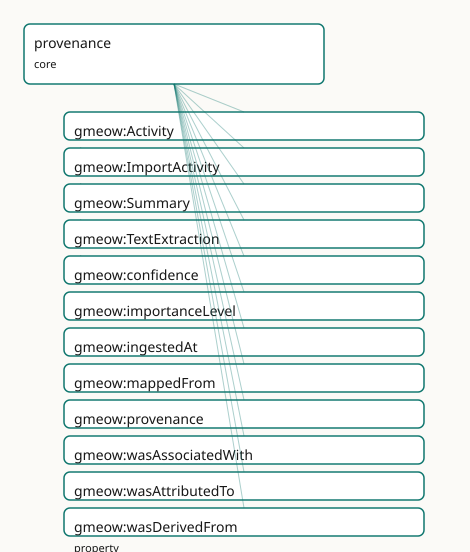

<!-- GENERATED by gmeow ontology-docs. DO NOT EDIT. Source hash: c99d8d50c0344040. -->

# GMEOW Provenance Module

- **IRI:** <https://blackcatinformatics.ca/gmeow/slices/provenance>
- **Tier:** core
- **[`Group`](../reference/classes/gmeow-Group.md):** core

## What This Slice Covers

This slice owns 13 terms and contributes 25 mapping or projection rows. Use it when its terms match the native fact you want to preserve; use the linkage tables to see how those facts leave GMEOW for consumer vocabularies.

## Dependencies

- [`gmeow:slices/documents`](documents.md)
- [`gmeow:slices/events`](events.md)
- [`gmeow:slices/kernel`](kernel.md)

## Consumers

- Every attributed fact (P9): statement-layer attribution, import activities, GTS chain-of-custody.

## Local Map



## Examples

### Import Lineage

- **Source:** [`slices/core/provenance/examples/import-lineage.ttl`](https://github.com/Blackcat-Informatics/gmeow-ontology/blob/main/slices/core/provenance/examples/import-lineage.ttl)
- **GMEOW terms:** [`gmeow:CreativeWork`](../reference/classes/gmeow-CreativeWork.md), [`gmeow:ImportActivity`](../reference/classes/gmeow-ImportActivity.md), [`gmeow:SoftwareAgent`](../reference/classes/gmeow-SoftwareAgent.md), [`gmeow:Summary`](../reference/classes/gmeow-Summary.md), [`gmeow:confidence`](../reference/properties/gmeow-confidence.md), [`gmeow:contentDigest`](../reference/properties/gmeow-contentDigest.md), [`gmeow:ingestedAt`](../reference/properties/gmeow-ingestedAt.md), [`gmeow:name`](../reference/properties/gmeow-name.md), [`gmeow:sourceLocation`](../reference/properties/gmeow-sourceLocation.md), [`gmeow:sourceModifiedAt`](../reference/properties/gmeow-sourceModifiedAt.md)
- **External prefixes:** `xsd`

```turtle
# SPDX-FileCopyrightText: 2026 Blackcat Informatics® Inc. <paudley@blackcatinformatics.ca>
# SPDX-License-Identifier: CC-BY-4.0
#
# Worked example: ingest lineage on the PROV triad . A machine-generated
# summary records WHERE it came from (gmeow:wasDerivedFrom → the source), HOW it
# was produced (gmeow:wasGeneratedBy → an Activity), and WHO ran it
# (gmeow:wasAttributedTo → an Agent). The importer is a gmeow:SoftwareAgent that
# self-records its own run — the producer of the provenance is inside it.
# (How much to trust the derivation is gmeow:confidence — an annotation on the
# derivation STATEMENT, carried in the RDF-1.2 statement layer rather than as an
# A-box property on the individual, so it is out of scope for this flat example.)
@prefix gmeow: <https://blackcatinformatics.ca/gmeow/> .
@prefix ex:    <https://blackcatinformatics.ca/gmeow/examples/provenance/> .
@prefix xsd:   <http://www.w3.org/2001/XMLSchema#> .

# --- The source: an imported work, pinned by location + content digest.
ex:sourcePaper a gmeow:CreativeWork ;
    gmeow:sourceLocation  "/imports/papers/smith-2020-erosion.pdf" ;
    gmeow:sourceModifiedAt "2020-07-11T00:00:00Z"^^xsd:dateTime ;
    gmeow:contentDigest   "blake3:9f86d081884c7d659a2feaa0c55ad015a3bf4f1b2b0b822cd15d6c15b0f00a08" .

# --- The activity and the agent that performed it (the importer self-records).
ex:import a gmeow:ImportActivity ;
    gmeow:ingestedAt       "2026-06-14T09:30:00Z"^^xsd:dateTime ;
    gmeow:wasAssociatedWith ex:importer .

ex:importer a gmeow:SoftwareAgent ;
    gmeow:name "gmeow PDF summariser"@en .

# --- The derived artefact: WHERE from, HOW made, and WHO by.
ex:abstract a gmeow:Summary ;
    gmeow:wasDerivedFrom  ex:sourcePaper ;
    gmeow:wasGeneratedBy  ex:import ;
    gmeow:wasAttributedTo ex:importer .
```

## Terms

### Classes

| Term | Label | Definition |
|---|---|---|
| [`gmeow:Activity`](../reference/classes/gmeow-Activity.md) | Activity | Something that occurs over a period of time and acts upon or with entities — creating, transforming, using, or attributing them. |
| [`gmeow:ImportActivity`](../reference/classes/gmeow-ImportActivity.md) | Import Activity | An activity that ingested an external source artifact (an import envelope such as a vCard file) and recorded the claims it carried. Carries the ingestion (tran... |
| [`gmeow:Summary`](../reference/classes/gmeow-Summary.md) | Summary | A condensed account derived from a source information object (often machine-generated), linked to its source by [`gmeow:wasDerivedFrom`](../reference/properties/gmeow-wasDerivedFrom.md). |
| [`gmeow:TextExtraction`](../reference/classes/gmeow-TextExtraction.md) | Text Extraction | The text content extracted from a source object (e.g. a PDF attachment), linked to its source by [`gmeow:wasDerivedFrom`](../reference/properties/gmeow-wasDerivedFrom.md). |

### Properties

| Term | Label | Definition |
|---|---|---|
| [`gmeow:confidence`](../reference/properties/gmeow-confidence.md) | confidence | Confidence in a claim, in the closed interval [0,1], attached to the statement it qualifies. |
| [`gmeow:importanceLevel`](../reference/properties/gmeow-importanceLevel.md) | importance level | Relative import/source importance of a claim on a 0–10 scale; projection takes the maximum across imports. |
| [`gmeow:ingestedAt`](../reference/properties/gmeow-ingestedAt.md) | ingested at | When an import activity recorded its claims into the system — the transaction time. Distinct from [`gmeow:assertedAt`](../reference/properties/gmeow-assertedAt.md) (observation) and gmeow:validFrom/validUntil... |
| [`gmeow:mappedFrom`](../reference/properties/gmeow-mappedFrom.md) | mapped from | The source property a claim was derived from during ingestion, recorded for mapping-step audit. |
| [`gmeow:provenance`](../reference/properties/gmeow-provenance.md) | provenance | A statement of any changes in ownership and custody of a resource since its creation that are significant for its authenticity, integrity, and interpretation. |
| [`gmeow:wasAssociatedWith`](../reference/properties/gmeow-wasAssociatedWith.md) | was associated with | Relates an activity to an agent associated with carrying it out — e.g. the software agent that ran an import. (Activity→Agent; the counterpart of gmeow:wasAttr... |
| [`gmeow:wasAttributedTo`](../reference/properties/gmeow-wasAttributedTo.md) | was attributed to | Ascribes responsibility for an entity to an agent. |
| [`gmeow:wasDerivedFrom`](../reference/properties/gmeow-wasDerivedFrom.md) | was derived from | Relates a derived thing to the thing it was derived from — e.g. a text extraction, summary, or embedding to its source; a commit to its parent commit; a trajec... |
| [`gmeow:wasGeneratedBy`](../reference/properties/gmeow-wasGeneratedBy.md) | was generated by | Relates an entity to the activity that produced it. |

## Linkages

- **Rows:** 25
- **Projection profiles:** `dcat`, `dcterms`, `oai_dc`, `web-annotation`
- **External vocabularies:** `dc`, `dcterms`, `oa`, `prov`, `rdf`, `wd`

| Source | Kind | Profile | Predicate/Relation | Target | Evidence |
|---|---|---|---|---|---|
| [`gmeow:Activity`](../reference/classes/gmeow-Activity.md) | equivalence | `-` | [owl:equivalentClass](http://www.w3.org/2002/07/owl#equivalentClass) | [prov:Activity](http://www.w3.org/ns/prov#Activity) | `gmeow-classes.sssom.tsv`; `gmeow:eqClasses045`; confidence 1 |
| [`gmeow:Activity`](../reference/classes/gmeow-Activity.md) | equivalence | `-` | [skos:closeMatch](http://www.w3.org/2004/02/skos/core#closeMatch) | [prov:Activity](http://www.w3.org/ns/prov#Activity) | `gmeow-provenance.sssom.tsv`; `gmeow:eqProvenance001`; confidence 0.9 |
| [`gmeow:Activity`](../reference/classes/gmeow-Activity.md) | equivalence | `-` | [skos:closeMatch](http://www.w3.org/2004/02/skos/core#closeMatch) | [wd:Q1914636](https://www.wikidata.org/wiki/Q1914636) | `gmeow-wikidata.sssom.tsv`; `gmeow:eqWikidata055`; confidence 0.75 |
| [`gmeow:ImportActivity`](../reference/classes/gmeow-ImportActivity.md) | equivalence | `-` | [skos:closeMatch](http://www.w3.org/2004/02/skos/core#closeMatch) | [prov:Activity](http://www.w3.org/ns/prov#Activity) | `gmeow-provenance.sssom.tsv`; `gmeow:eqProvenance007`; confidence 0.8 |
| [`gmeow:ingestedAt`](../reference/properties/gmeow-ingestedAt.md) | equivalence | `-` | [skos:closeMatch](http://www.w3.org/2004/02/skos/core#closeMatch) | [prov:endedAtTime](http://www.w3.org/ns/prov#endedAtTime) | `gmeow-provenance.sssom.tsv`; `gmeow:eqProvenance008`; confidence 0.85 |
| [`gmeow:provenance`](../reference/properties/gmeow-provenance.md) | equivalence | `-` | [skos:closeMatch](http://www.w3.org/2004/02/skos/core#closeMatch) | [dcterms:provenance](http://purl.org/dc/terms/provenance) | `gmeow-dublin-core.sssom.tsv`; `gmeow:eqDcTerms030`; confidence 0.75 |
| [`gmeow:wasAssociatedWith`](../reference/properties/gmeow-wasAssociatedWith.md) | equivalence | `-` | [skos:closeMatch](http://www.w3.org/2004/02/skos/core#closeMatch) | [prov:wasAssociatedWith](http://www.w3.org/ns/prov#wasAssociatedWith) | `gmeow-provenance.sssom.tsv`; `gmeow:eqProvenance005`; confidence 0.9 |
| [`gmeow:wasAttributedTo`](../reference/properties/gmeow-wasAttributedTo.md) | equivalence | `-` | [skos:exactMatch](http://www.w3.org/2004/02/skos/core#exactMatch) | [prov:wasAttributedTo](http://www.w3.org/ns/prov#wasAttributedTo) | `gmeow-attestation.sssom.tsv`; `gmeow:eqAttestation007`; confidence 0.95 |
| [`gmeow:wasAttributedTo`](../reference/properties/gmeow-wasAttributedTo.md) | equivalence | `-` | [owl:equivalentProperty](http://www.w3.org/2002/07/owl#equivalentProperty) | [prov:wasAttributedTo](http://www.w3.org/ns/prov#wasAttributedTo) | `gmeow-properties.sssom.tsv`; `gmeow:eqProperties034`; confidence 1 |
| [`gmeow:wasAttributedTo`](../reference/properties/gmeow-wasAttributedTo.md) | equivalence | `-` | [skos:closeMatch](http://www.w3.org/2004/02/skos/core#closeMatch) | [prov:wasAttributedTo](http://www.w3.org/ns/prov#wasAttributedTo) | `gmeow-provenance.sssom.tsv`; `gmeow:eqProvenance004`; confidence 0.9 |
| [`gmeow:wasDerivedFrom`](../reference/properties/gmeow-wasDerivedFrom.md) | equivalence | `-` | [skos:exactMatch](http://www.w3.org/2004/02/skos/core#exactMatch) | [prov:wasDerivedFrom](http://www.w3.org/ns/prov#wasDerivedFrom) | `gmeow-attestation.sssom.tsv`; `gmeow:eqAttestation006`; confidence 0.95 |
| [`gmeow:wasDerivedFrom`](../reference/properties/gmeow-wasDerivedFrom.md) | equivalence | `-` | [skos:closeMatch](http://www.w3.org/2004/02/skos/core#closeMatch) | [prov:wasDerivedFrom](http://www.w3.org/ns/prov#wasDerivedFrom) | `gmeow-provenance.sssom.tsv`; `gmeow:eqProvenance002`; confidence 0.9 |
| [`gmeow:wasDerivedFrom`](../reference/properties/gmeow-wasDerivedFrom.md) | equivalence | `-` | [owl:equivalentProperty](http://www.w3.org/2002/07/owl#equivalentProperty) | [prov:wasDerivedFrom](http://www.w3.org/ns/prov#wasDerivedFrom) | `gmeow-provenance.sssom.tsv`; `gmeow:eqProvenance014`; confidence 1 |
| [`gmeow:wasGeneratedBy`](../reference/properties/gmeow-wasGeneratedBy.md) | equivalence | `-` | [skos:exactMatch](http://www.w3.org/2004/02/skos/core#exactMatch) | [prov:wasGeneratedBy](http://www.w3.org/ns/prov#wasGeneratedBy) | `gmeow-attestation.sssom.tsv`; `gmeow:eqAttestation005`; confidence 0.95 |
| [`gmeow:wasGeneratedBy`](../reference/properties/gmeow-wasGeneratedBy.md) | equivalence | `-` | [owl:equivalentProperty](http://www.w3.org/2002/07/owl#equivalentProperty) | [prov:wasGeneratedBy](http://www.w3.org/ns/prov#wasGeneratedBy) | `gmeow-properties.sssom.tsv`; `gmeow:eqProperties035`; confidence 1 |
| [`gmeow:wasGeneratedBy`](../reference/properties/gmeow-wasGeneratedBy.md) | equivalence | `-` | [skos:closeMatch](http://www.w3.org/2004/02/skos/core#closeMatch) | [prov:wasGeneratedBy](http://www.w3.org/ns/prov#wasGeneratedBy) | `gmeow-provenance.sssom.tsv`; `gmeow:eqProvenance003`; confidence 0.9 |
| [`gmeow:ImportActivity`](../reference/classes/gmeow-ImportActivity.md) | projection | `dcat` | projects to / <= | [prov:Activity](http://www.w3.org/ns/prov#Activity), [prov:endedAtTime](http://www.w3.org/ns/prov#endedAtTime), [rdf:type](http://www.w3.org/1999/02/22-rdf-syntax-ns#type) | `gmeow:mapDcatImportActivity`; confidence 0.9; lossy: transaction time flattens to [prov:endedAtTime](http://www.w3.org/ns/prov#endedAtTime); the assertion/validity clocks are dropped |
| [`gmeow:ingestedAt`](../reference/properties/gmeow-ingestedAt.md) | projection | `dcat` | projects to / <= | [prov:Activity](http://www.w3.org/ns/prov#Activity), [prov:endedAtTime](http://www.w3.org/ns/prov#endedAtTime), [rdf:type](http://www.w3.org/1999/02/22-rdf-syntax-ns#type) | `gmeow:mapDcatImportActivity`; confidence 0.9; lossy: transaction time flattens to [prov:endedAtTime](http://www.w3.org/ns/prov#endedAtTime); the assertion/validity clocks are dropped |
| [`gmeow:provenance`](../reference/properties/gmeow-provenance.md) | projection | `dcterms` | projects to / = | [dcterms:provenance](http://purl.org/dc/terms/provenance) | `gmeow:mapDctermsProvenance`; confidence 0.75 |
| [`gmeow:provenance`](../reference/properties/gmeow-provenance.md) | projection | `oai_dc` | projects to / <= | [dc:source](http://purl.org/dc/elements/1.1/source) | `gmeow:mapOaiDcProvenance`; confidence 0.5; lossy: provenance falls to [dc:source](http://purl.org/dc/elements/1.1/source) in the 15-element dumb-down |
| [`gmeow:wasAssociatedWith`](../reference/properties/gmeow-wasAssociatedWith.md) | projection | `oai_dc` | projects to / <= | [dc:publisher](http://purl.org/dc/elements/1.1/publisher) | `gmeow:mapOaiDcPublisher`; confidence 0.5; lossy: GMEOW has no flat publisher property; the projection traverses wasGeneratedBy→wasAssociatedWith and is lossy |
| [`gmeow:wasAttributedTo`](../reference/properties/gmeow-wasAttributedTo.md) | projection | `dcat` | projects to / = | [prov:wasAttributedTo](http://www.w3.org/ns/prov#wasAttributedTo) | `gmeow:mapDcatWasAttributedTo`; confidence 0.95 |
| [`gmeow:wasAttributedTo`](../reference/properties/gmeow-wasAttributedTo.md) | projection | `web-annotation` | projects to / <= | [oa:Annotation](http://www.w3.org/ns/oa#Annotation), [oa:hasBody](http://www.w3.org/ns/oa#hasBody), [oa:hasTarget](http://www.w3.org/ns/oa#hasTarget), [oa:motivatedBy](http://www.w3.org/ns/oa#motivatedBy), [oa:tagging](http://www.w3.org/ns/oa#tagging), [rdf:type](http://www.w3.org/1999/02/22-rdf-syntax-ns#type) | `gmeow:mapWebAnnotationTagging`; confidence 0.8; lossy: confidence, temporal scope (taggingInterval), scheme dropped; tagger and attribution omitted (not projected); transform `gmeow:fnTaggingToAnnotation` |
| [`gmeow:wasGeneratedBy`](../reference/properties/gmeow-wasGeneratedBy.md) | projection | `dcat` | projects to / = | [prov:wasGeneratedBy](http://www.w3.org/ns/prov#wasGeneratedBy) | `gmeow:mapDcatWasGeneratedBy`; confidence 0.95 |
|... |... |... |... |... | 1 more rows |

## Guide

<!-- SPDX-FileCopyrightText: 2026 Blackcat Informatics® Inc. <paudley@blackcatinformatics.ca> -->
<!-- SPDX-License-Identifier: CC-BY-4.0 -->

# Provenance — activities, attribution, and the statement clocks' epistemic siblings

> **Slice:** `https://blackcatinformatics.ca/gmeow/slices/provenance` · **tier: core**
> The [PROV-O](../external/ontologies.md#target-prov) superset layer: who made it, what produced it, and how sure we are — on every statement in every slice.

A claim without provenance is the failure mode this ontology was written against
([Principle 14](https://github.com/Blackcat-Informatics/gmeow-ontology/blob/main/CONSTITUTION.md#principle-14): an LLM output is a claim, not a truth). This slice supplies the two halves
of the answer. The **individual** half is a compact PROV-O-aligned activity model
([Principle 5](https://github.com/Blackcat-Informatics/gmeow-ontology/blob/main/CONSTITUTION.md#principle-5)): activities that generate entities, agents that are attributed or
associated, derivation chains from source to extraction to summary. The **statement** half
is a set of cross-cutting annotation properties (`confidence`, [`importanceLevel`](../reference/properties/gmeow-importanceLevel.md),
[`mappedFrom`](../reference/properties/gmeow-mappedFrom.md)) that ride on the RDF-1.2 reified-statement layer (Principles 2–3), so any
fact in any slice carries its epistemic weight without a single new relator.

On the claim spine (Source → [`Chunk`](../reference/classes/gmeow-Chunk.md) → [`EvidenceSpan`](../reference/classes/gmeow-EvidenceSpan.md) → Claim, [Principle 14](https://github.com/Blackcat-Informatics/gmeow-ontology/blob/main/CONSTITUTION.md#principle-14)) this slice is the
*chain of custody*: the [`ImportActivity`](../reference/classes/gmeow-ImportActivity.md) that ingested the Source, the [`wasDerivedFrom`](../reference/properties/gmeow-wasDerivedFrom.md)
chain from Source to [`Chunk`](../reference/classes/gmeow-Chunk.md) to extraction, and the `confidence` annotation on the final
Claim. The three epistemic axes never bridge ([Principle 9](https://github.com/Blackcat-Informatics/gmeow-ontology/blob/main/CONSTITUTION.md#principle-9)): [`gmeow:accordingTo`](../reference/properties/gmeow-accordingTo.md) says whose
frame holds a claim, the [`wasDerivedFrom`](../reference/properties/gmeow-wasDerivedFrom.md) chain back through its [`ImportActivity`](../reference/classes/gmeow-ImportActivity.md) says
which source recorded it, and [`gmeow:confidence`](../reference/properties/gmeow-confidence.md) says how sure we are — a neutral archive
can record a partisan claim, and a claim can be high-confidence yet from a frame we
dispute. ([`gmeow:wasAttributedTo`](../reference/properties/gmeow-wasAttributedTo.md) plays a different role entirely: it ascribes
responsibility for an *entity* to an *agent* — see below.)

## Activities

### [`gmeow:Activity`](../reference/classes/gmeow-Activity.md)

Something that occurs over time and acts upon entities — creating, transforming, using,
attributing. A [`gufo:EventType`](../external/terms.md#gufo-eventtype) under [`gmeow:Event`](../reference/classes/gmeow-Event.md), so the temporal slice's clocks and
the events slice's participation machinery apply unchanged ([Principle 4](https://github.com/Blackcat-Informatics/gmeow-ontology/blob/main/CONSTITUTION.md#principle-4): one canonical
event model).

### [`gmeow:ImportActivity`](../reference/classes/gmeow-ImportActivity.md)

The ingestion act: an activity that consumed an external envelope (a vCard file, a mail
archive, a GTS package) and recorded the claims it carried. Carries [`gmeow:ingestedAt`](../reference/properties/gmeow-ingestedAt.md) —
the *transaction* clock: when the system learned the claims, held strictly apart from
[`assertedAt`](../reference/properties/gmeow-assertedAt.md) (when someone claimed them) and [`validFrom`](../reference/properties/gmeow-validFrom.md)/[`validUntil`](../reference/properties/gmeow-validUntil.md) (when they hold).
Three clocks, never collapsed.

### [`gmeow:wasGeneratedBy`](../reference/properties/gmeow-wasGeneratedBy.md)

[`Entity`](../reference/classes/gmeow-Entity.md) → [`Activity`](../reference/classes/gmeow-Activity.md): the activity that produced an entity. The provenance leg every derived
artifact (extraction, summary, embedding, reasoned graph) must carry; pairs with
[`gmeow:observationEvent`](../reference/properties/gmeow-observationEvent.md) in the observations slice, which gives the *event* perspective
(when) rather than the *generation* perspective (by what process).

### [`gmeow:wasAttributedTo`](../reference/properties/gmeow-wasAttributedTo.md) · [`gmeow:wasAssociatedWith`](../reference/properties/gmeow-wasAssociatedWith.md)

The two attribution directions: [`wasAttributedTo`](../reference/properties/gmeow-wasAttributedTo.md) ascribes an endurant [`Entity`](../reference/classes/gmeow-Entity.md) to a
responsible [`Agent`](../reference/classes/gmeow-Agent.md); [`wasAssociatedWith`](../reference/properties/gmeow-wasAssociatedWith.md) relates an [`Activity`](../reference/classes/gmeow-Activity.md) to the agent carrying it out
(e.g. the software agent that ran an import). Keep them straight — attributing the
*output* and crewing the *process* are different facts.

### [`gmeow:wasDerivedFrom`](../reference/properties/gmeow-wasDerivedFrom.md)

The derivation backbone, deliberately domain-free so events, endurants, and information
objects all participate: a [`TextExtraction`](../reference/classes/gmeow-TextExtraction.md) from its PDF, a [`Summary`](../reference/classes/gmeow-Summary.md) from its source, an
embedding from its chunk, a commit from its parent, a trajectory from its sample stream.
Confidence and generating agent ride alongside via [`gmeow:confidence`](../reference/properties/gmeow-confidence.md) and
[`gmeow:wasGeneratedBy`](../reference/properties/gmeow-wasGeneratedBy.md) — a derivation is itself a claim about lineage.

### [`gmeow:Summary`](../reference/classes/gmeow-Summary.md) · [`gmeow:TextExtraction`](../reference/classes/gmeow-TextExtraction.md)

The two canonical derived information objects: a condensed (often machine-generated)
account, and the text content pulled from a source artifact. Both link back with
[`wasDerivedFrom`](../reference/properties/gmeow-wasDerivedFrom.md); both are claims about their source, not replacements for it — the
source stays, suppression never erasure ([Principle 10](https://github.com/Blackcat-Informatics/gmeow-ontology/blob/main/CONSTITUTION.md#principle-10)).

## The statement-level annotations

### [`gmeow:confidence`](../reference/properties/gmeow-confidence.md)

Epistemic confidence in a claim, in [0,1], attached to the statement it qualifies. An
annotation property so the OWL downcast stays DL-clean ([Principle 3](https://github.com/Blackcat-Informatics/gmeow-ontology/blob/main/CONSTITUTION.md#principle-3)). Confidence is
orthogonal to standpoint and to source (the three-axis doctrine) — it answers
"how sure", never "who says" or "who recorded".

### [`gmeow:importanceLevel`](../reference/properties/gmeow-importanceLevel.md) · [`gmeow:mappedFrom`](../reference/properties/gmeow-mappedFrom.md)

The remaining statement-level audit pair: relative importance on a 0–10 scale (projection
takes the maximum across imports — a solver-layer fold, [Principle 12](https://github.com/Blackcat-Informatics/gmeow-ontology/blob/main/CONSTITUTION.md#principle-12)), and the source
property a claim was mapped from during ingestion, recorded so every mapping step is
auditable end to end ([Principle 7](https://github.com/Blackcat-Informatics/gmeow-ontology/blob/main/CONSTITUTION.md#principle-7): verified by construction).

### [`gmeow:provenance`](../reference/properties/gmeow-provenance.md)

The Dublin Core custody statement (a free-text account of ownership and
custody changes significant for authenticity and interpretation. The human-readable
complement to the structured activity chain, not a substitute for it.

## Solver boundary & alignment

Trust-weighted aggregation, confidence combination across sources, and transitive
derivation closure are computations, never assertions ([Principle 12](https://github.com/Blackcat-Informatics/gmeow-ontology/blob/main/CONSTITUTION.md#principle-12)): the slice records
the inputs (activities, attributions, per-statement confidence); ranking and fusing them
is projection policy. Aligned by reference to **[PROV-O](../external/ontologies.md#target-prov)** ([`prov:Activity`](http://www.w3.org/ns/prov#Activity),
[`prov:wasGeneratedBy`](http://www.w3.org/ns/prov#wasGeneratedBy), [`prov:wasAttributedTo`](http://www.w3.org/ns/prov#wasAttributedTo), [`prov:wasAssociatedWith`](http://www.w3.org/ns/prov#wasAssociatedWith),
[`prov:wasDerivedFrom`](http://www.w3.org/ns/prov#wasDerivedFrom)) — GMEOW's superset adds the statement-level annotation axis and
the transaction clock.

## Dependencies

Depends on `kernel`, `documents`, and `events`. Consumed by every attributed fact in the
graph: the statement-layer attribution axes, import pipelines, and the GTS package
chain-of-custody ([Principle 14](https://github.com/Blackcat-Informatics/gmeow-ontology/blob/main/CONSTITUTION.md#principle-14)).
