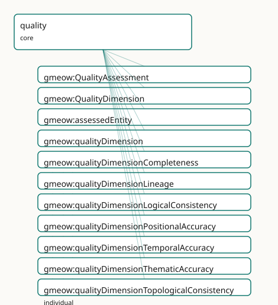

<!-- GENERATED by gmeow ontology-docs. DO NOT EDIT. -->

# GMEOW Data Quality Module

- **IRI:** <https://blackcatinformatics.ca/gmeow/slices/quality>
- **Tier:** core
- **[`Group`](../reference/classes/gmeow-Group.md):** core

## What This Slice Covers

This slice owns 11 terms and contributes 10 mapping or projection rows. Use it when its terms match the native fact you want to preserve; use the linkage tables to see how those facts leave GMEOW for consumer vocabularies.

## Dependencies

- [`gmeow:slices/kernel`](kernel.md)
- [`gmeow:slices/observations`](observations.md)

## Consumers

- Data-quality claims (DQV/ISO 19157) over any slice's instance data; the coverage gates.

## Local Map



## Examples

### Dataset Completeness

- **Source:** [`slices/core/quality/examples/dataset-completeness.ttl`](https://github.com/Blackcat-Informatics/gmeow-ontology/blob/main/slices/core/quality/examples/dataset-completeness.ttl)
- **GMEOW terms:** [`gmeow:Dataset`](../reference/classes/gmeow-Dataset.md), [`gmeow:Observation`](../reference/classes/gmeow-Observation.md), [`gmeow:Organization`](../reference/classes/gmeow-Organization.md), [`gmeow:QualityAssessment`](../reference/classes/gmeow-QualityAssessment.md), [`gmeow:ScalarQuantity`](../reference/classes/gmeow-ScalarQuantity.md), [`gmeow:assessedEntity`](../reference/properties/gmeow-assessedEntity.md), [`gmeow:hasUnit`](../reference/properties/gmeow-hasUnit.md), [`gmeow:methodComputationalModel`](../reference/individuals/gmeow-methodComputationalModel.md), [`gmeow:name`](../reference/properties/gmeow-name.md), [`gmeow:observationMethod`](../reference/properties/gmeow-observationMethod.md)
- **External prefixes:** `xsd`

```turtle
# SPDX-FileCopyrightText: 2026 Blackcat Informatics® Inc. <paudley@blackcatinformatics.ca>
# SPDX-License-Identifier: CC-BY-4.0
#
# Worked example: data quality IS a measurement. A gmeow:QualityAssessment
# is a gmeow:Observation subclass, so a completeness assessment carries the SAME
# bundle as any other measurement: gmeow:assessedEntity (the feature, a sub-
# property of observedFeature), a gmeow:qualityDimension naming WHICH quality, a
# gmeow:observationMethod, a gmeow:vantage (who assessed), and an entity-valued
# gmeow:ScalarQuantity result (98.5% with its unit) rather than a bare number.
# Quality is not a special boolean flag — it is an observation like temperature.
@prefix gmeow: <https://blackcatinformatics.ca/gmeow/> .
@prefix ex:    <https://blackcatinformatics.ca/gmeow/examples/quality/> .
@prefix xsd:   <http://www.w3.org/2001/XMLSchema#> .

ex:dataset a gmeow:Dataset ; gmeow:title "Coastal Bird Survey 2026"@en .
ex:auditor a gmeow:Organization ; gmeow:name "Data Quality Audit Ltd."@en .

# --- The assessment: which entity, which dimension, by what method, from whom.
ex:assessment a gmeow:QualityAssessment ;
    gmeow:assessedEntity    ex:dataset ;
    gmeow:qualityDimension  gmeow:qualityDimensionCompleteness ;
    gmeow:observationMethod gmeow:methodComputationalModel ;
    gmeow:vantage           ex:auditor ;
    gmeow:observationResult ex:completeness .

# --- The result: a scalar percentage, unit-bundled like any measurement.
ex:completeness a gmeow:ScalarQuantity ;
    gmeow:quantityValue "98.5"^^xsd:decimal ;
    gmeow:hasUnit       <http://qudt.org/vocab/unit/PERCENT> .
```

## Terms

### Classes

| Term | Label | Definition |
|---|---|---|
| [`gmeow:QualityAssessment`](../reference/classes/gmeow-QualityAssessment.md) | Quality Assessment | A reified assessment of the quality of an entity or dataset, expressed as an observation about one or more quality dimensions. The result is typically a scalar... |
| [`gmeow:QualityDimension`](../reference/classes/gmeow-QualityDimension.md) | Quality Dimension | An ISO 19157 data-quality dimension or lineage category — an open value vocabulary of individuals (never subclasses). New dimensions (e.g. a domain-specific 's... |

### Properties

| Term | Label | Definition |
|---|---|---|
| [`gmeow:assessedEntity`](../reference/properties/gmeow-assessedEntity.md) | assessed entity | The entity whose data quality is being assessed — the feature of interest of the quality observation. Sub-property of [`gmeow:observedFeature`](../reference/properties/gmeow-observedFeature.md) so generic consumer... |
| [`gmeow:qualityDimension`](../reference/properties/gmeow-qualityDimension.md) | quality dimension | The quality dimension under which this assessment is made. Non-functional: a single assessment may cover several dimensions (e.g. a report that evaluates both... |

### Individuals

| Term | Label | Definition |
|---|---|---|
| [`gmeow:qualityDimensionCompleteness`](../reference/individuals/gmeow-qualityDimensionCompleteness.md) | completeness | Presence or absence of features and their attributes, including commission (excess data) and omission (missing data) (ISO 19157). |
| [`gmeow:qualityDimensionLineage`](../reference/individuals/gmeow-qualityDimensionLineage.md) | lineage | The history, source, and process steps that produced a dataset or entity — the provenance of the data viewed through a quality lens. In GMEOW the structural li... |
| [`gmeow:qualityDimensionLogicalConsistency`](../reference/individuals/gmeow-qualityDimensionLogicalConsistency.md) | logical consistency | Degree of adherence to logical rules of data structure, attribution, and relationships, including domain consistency, format consistency, and topological consi... |
| [`gmeow:qualityDimensionPositionalAccuracy`](../reference/individuals/gmeow-qualityDimensionPositionalAccuracy.md) | positional accuracy | Closeness of the spatial position of a feature to its true position, including absolute accuracy, relative accuracy, and gridded data positional accuracy (ISO... |
| [`gmeow:qualityDimensionTemporalAccuracy`](../reference/individuals/gmeow-qualityDimensionTemporalAccuracy.md) | temporal accuracy | Correctness of the temporal references of a feature (e.g. date, time, period) relative to the true temporal value (ISO 19157). |
| [`gmeow:qualityDimensionThematicAccuracy`](../reference/individuals/gmeow-qualityDimensionThematicAccuracy.md) | thematic accuracy | Accuracy of quantitative and qualitative attribute values, including classification correctness and non-quantitative attribute correctness (ISO 19157). |
| [`gmeow:qualityDimensionTopologicalConsistency`](../reference/individuals/gmeow-qualityDimensionTopologicalConsistency.md) | topological consistency | Correctness of the explicitly encoded topological characteristics of a dataset, typically expressed as error counts or conformance to a topological rule set (I... |

## Linkages

- **Rows:** 10
- **Projection profiles:** -
- **External vocabularies:** `dqv`, `oa`, `prov`, `wd`

| Source | Kind | Profile | Predicate/Relation | Target | Evidence |
|---|---|---|---|---|---|
| [`gmeow:QualityAssessment`](../reference/classes/gmeow-QualityAssessment.md) | equivalence | `-` | [skos:relatedMatch](http://www.w3.org/2004/02/skos/core#relatedMatch) | [dqv:QualityAnnotation](http://www.w3.org/ns/dqv#QualityAnnotation) | `gmeow-quality.sssom.tsv`; `gmeow:eqQuality005`; confidence 0.75 |
| [`gmeow:QualityAssessment`](../reference/classes/gmeow-QualityAssessment.md) | equivalence | `-` | [skos:closeMatch](http://www.w3.org/2004/02/skos/core#closeMatch) | [dqv:QualityMeasurement](http://www.w3.org/ns/dqv#QualityMeasurement) | `gmeow-quality.sssom.tsv`; `gmeow:eqQuality001`; confidence 0.9 |
| [`gmeow:QualityAssessment`](../reference/classes/gmeow-QualityAssessment.md) | equivalence | `-` | [skos:relatedMatch](http://www.w3.org/2004/02/skos/core#relatedMatch) | [oa:Annotation](http://www.w3.org/ns/oa#Annotation) | `gmeow-quality.sssom.tsv`; `gmeow:eqQuality006`; confidence 0.7 |
| [`gmeow:QualityDimension`](../reference/classes/gmeow-QualityDimension.md) | equivalence | `-` | [skos:closeMatch](http://www.w3.org/2004/02/skos/core#closeMatch) | [dqv:Dimension](http://www.w3.org/ns/dqv#Dimension) | `gmeow-quality.sssom.tsv`; `gmeow:eqQuality002`; confidence 0.9 |
| [`gmeow:assessedEntity`](../reference/properties/gmeow-assessedEntity.md) | equivalence | `-` | [skos:closeMatch](http://www.w3.org/2004/02/skos/core#closeMatch) | [dqv:computedOn](http://www.w3.org/ns/dqv#computedOn) | `gmeow-quality.sssom.tsv`; `gmeow:eqQuality003`; confidence 0.85 |
| [`gmeow:qualityDimension`](../reference/properties/gmeow-qualityDimension.md) | equivalence | `-` | [skos:closeMatch](http://www.w3.org/2004/02/skos/core#closeMatch) | [dqv:isMeasurementOf](http://www.w3.org/ns/dqv#isMeasurementOf) | `gmeow-quality.sssom.tsv`; `gmeow:eqQuality004`; confidence 0.8 |
| [`gmeow:qualityDimensionCompleteness`](../reference/individuals/gmeow-qualityDimensionCompleteness.md) | equivalence | `-` | [skos:closeMatch](http://www.w3.org/2004/02/skos/core#closeMatch) | [wd:Q194041](https://www.wikidata.org/wiki/Q194041) | `gmeow-quality.sssom.tsv`; `gmeow:eqQuality009`; confidence 0.85 |
| [`gmeow:qualityDimensionLineage`](../reference/individuals/gmeow-qualityDimensionLineage.md) | equivalence | `-` | [skos:relatedMatch](http://www.w3.org/2004/02/skos/core#relatedMatch) | [prov:wasDerivedFrom](http://www.w3.org/ns/prov#wasDerivedFrom) | `gmeow-quality.sssom.tsv`; `gmeow:eqQuality007`; confidence 0.8 |
| [`gmeow:qualityDimensionLineage`](../reference/individuals/gmeow-qualityDimensionLineage.md) | equivalence | `-` | [skos:closeMatch](http://www.w3.org/2004/02/skos/core#closeMatch) | [wd:Q13411553](https://www.wikidata.org/wiki/Q13411553) | `gmeow-quality.sssom.tsv`; `gmeow:eqQuality010`; confidence 0.8 |
| [`gmeow:qualityDimensionPositionalAccuracy`](../reference/individuals/gmeow-qualityDimensionPositionalAccuracy.md) | equivalence | `-` | [skos:closeMatch](http://www.w3.org/2004/02/skos/core#closeMatch) | [wd:Q2401740](https://www.wikidata.org/wiki/Q2401740) | `gmeow-quality.sssom.tsv`; `gmeow:eqQuality008`; confidence 0.85 |

## Guide

<!-- SPDX-FileCopyrightText: 2026 Blackcat Informatics® Inc. <paudley@blackcatinformatics.ca> -->
<!-- SPDX-License-Identifier: CC-BY-4.0 -->

# Quality — data-quality claims as ordinary observations

> **Slice:** `https://blackcatinformatics.ca/gmeow/slices/quality` · **tier: core**
> The ISO 19157 dimensions, riding the universal [`Observation`](../reference/classes/gmeow-Observation.md) stack — quality is a claim like any other.

Data quality is usually bolted on as a separate report format. GMEOW refuses the bolt-on:
a quality assessment is a *reified observation about an entity*, and so it reuses the
universal [`Observation`](../reference/classes/gmeow-Observation.md) stack wholesale — the assessed entity is the [`observedFeature`](../reference/properties/gmeow-observedFeature.md), the
quality result is the [`observationResult`](../reference/properties/gmeow-observationResult.md) (typically a [`ScalarQuantity`](../reference/classes/gmeow-ScalarQuantity.md)), and the
assessment protocol is the [`observationMethod`](../reference/properties/gmeow-observationMethod.md). The result therefore carries unit,
reference frame, determinacy, and provenance in the same bundle as every other GMEOW
measurement ([Principle 11](https://github.com/Blackcat-Informatics/gmeow-ontology/blob/main/CONSTITUTION.md#principle-11)), and the quality layer stays thin: one SubKind, two
properties, one open dimension vocabulary.

The dimensions themselves are ISO 19157's — positional accuracy, temporal accuracy,
thematic accuracy, completeness, logical consistency, topological consistency — plus
lineage. W3C DQV and GeoDCAT-AP are aligned by reference ([Principle 5](https://github.com/Blackcat-Informatics/gmeow-ontology/blob/main/CONSTITUTION.md#principle-5)); computing any
quality metric is solver-layer work ([Principle 12](https://github.com/Blackcat-Informatics/gmeow-ontology/blob/main/CONSTITUTION.md#principle-12)).

## The core construct

### [`gmeow:QualityAssessment`](../reference/classes/gmeow-QualityAssessment.md)

A reified assessment of the quality of an entity or dataset — a [`gufo:SubKind`](../external/terms.md#gufo-subkind) of
[`gmeow:Observation`](../reference/classes/gmeow-Observation.md), so everything the observations slice provides (vantage, method,
result, frames) applies unchanged. The result is typically a scalar quantity (accuracy in
metres, completeness as a percentage) or a categorical conformance statement. The
EL-visible axiom guarantees every assessment assesses *at least one* entity; closed-world
cardinality is SHACL's concern, never OWL's.

### [`gmeow:assessedEntity`](../reference/properties/gmeow-assessedEntity.md)

The entity whose data quality is assessed — the feature of interest of the quality
observation, declared [`rdfs:subPropertyOf gmeow:observedFeature`](http://www.w3.org/2000/01/rdf-schema#subPropertyOf gmeow:observedFeature). That subsumption is the
load-bearing move: a generic consumer can query "all observations about Alice" and get
names, coordinates, *and* quality assessments without knowing this slice exists.

### [`gmeow:qualityDimension`](../reference/properties/gmeow-qualityDimension.md)

The dimension under which the assessment is made. Non-functional twice over: one report
may evaluate several dimensions, and competing dimension classifications coexist rather
than collapse ([Principle 9](https://github.com/Blackcat-Informatics/gmeow-ontology/blob/main/CONSTITUTION.md#principle-9)).

## The dimension vocabulary

### [`gmeow:QualityDimension`](../reference/classes/gmeow-QualityDimension.md)

An open value vocabulary of individuals — never subclasses ([Principle 9](https://github.com/Blackcat-Informatics/gmeow-ontology/blob/main/CONSTITUTION.md#principle-9)). The seeds are
the ISO 19157 set ([`qualityDimensionPositionalAccuracy`](../reference/individuals/gmeow-qualityDimensionPositionalAccuracy.md), [`qualityDimensionTemporalAccuracy`](../reference/individuals/gmeow-qualityDimensionTemporalAccuracy.md),
[`qualityDimensionThematicAccuracy`](../reference/individuals/gmeow-qualityDimensionThematicAccuracy.md), [`qualityDimensionCompleteness`](../reference/individuals/gmeow-qualityDimensionCompleteness.md),
[`qualityDimensionLogicalConsistency`](../reference/individuals/gmeow-qualityDimensionLogicalConsistency.md), [`qualityDimensionTopologicalConsistency`](../reference/individuals/gmeow-qualityDimensionTopologicalConsistency.md)) plus
lineage; a domain-specific "semantic consistency" or "usability" is added by minting a
fresh individual, not a class.

### [`gmeow:qualityDimensionLineage`](../reference/individuals/gmeow-qualityDimensionLineage.md)

The one seed that deserves its own note, because it is a *bridge*, not a duplicate:
structural lineage already lives in the provenance module ([`wasGeneratedBy`](../reference/properties/gmeow-wasGeneratedBy.md),
[`wasDerivedFrom`](../reference/properties/gmeow-wasDerivedFrom.md), [`ImportActivity`](../reference/classes/gmeow-ImportActivity.md)). This dimension value marks an assessment that
*evaluates* lineage completeness or correctness — provenance viewed through a quality
lens, with the provenance graph itself untouched ([Principle 4](https://github.com/Blackcat-Informatics/gmeow-ontology/blob/main/CONSTITUTION.md#principle-4): one canonical source).

## Reuse, not redefinition

The module mints no properties for axes that already exist — [`observationResult`](../reference/properties/gmeow-observationResult.md),
[`observationMethod`](../reference/properties/gmeow-observationMethod.md), and `vantage` come from observations; `confidence` and
[`wasGeneratedBy`](../reference/properties/gmeow-wasGeneratedBy.md) from provenance; [`hasDeterminacy`](../reference/properties/gmeow-hasDeterminacy.md) and [`hasUnit`](../reference/properties/gmeow-hasUnit.md) from the kernel;
[`hasReferenceFrame`](../reference/properties/gmeow-hasReferenceFrame.md) from places; [`validFrom`](../reference/properties/gmeow-validFrom.md)/[`validUntil`](../reference/properties/gmeow-validUntil.md) from temporal. The reuse
declaration in `module.ttl` is documentation of that fact, and the discipline is
constitutional ([Principle 4](https://github.com/Blackcat-Informatics/gmeow-ontology/blob/main/CONSTITUTION.md#principle-4)): a quality assessment's confidence is the *same* confidence
every other claim carries, queryable the same way.

## Boundaries

The slice records quality *claims*; it computes nothing. Conformance evaluation,
accuracy statistics, completeness ratios, and the coverage gates that consume these
assessments are solver-layer machinery ([Principle 12](https://github.com/Blackcat-Informatics/gmeow-ontology/blob/main/CONSTITUTION.md#principle-12)). Alignment to W3C DQV
([`dqv:QualityMeasurement`](http://www.w3.org/ns/dqv#QualityMeasurement), [`dqv:Dimension`](http://www.w3.org/ns/dqv#Dimension)) and GeoDCAT-AP is by reference and lossy
projection — DQV has no standpoint, no determinacy, and no frame on its measurements,
which is precisely what the [`Observation`](../reference/classes/gmeow-Observation.md) stack adds. Depends on kernel and observations;
consumed by data-quality claims over any slice's instance data.
