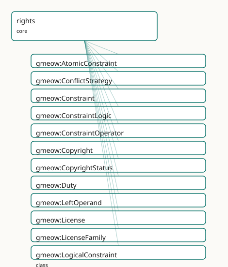

<!-- GENERATED by gmeow ontology-docs. DO NOT EDIT. -->

# GMEOW Rights & IP Module

- **IRI:** <https://blackcatinformatics.ca/gmeow/slices/rights>
- **Tier:** core
- **[`Group`](../reference/classes/gmeow-Group.md):** core

## What This Slice Covers

This slice owns 204 terms and contributes 319 mapping or projection rows. Use it when its terms match the native fact you want to preserve; use the linkage tables to see how those facts leave GMEOW for consumer vocabularies.

## Dependencies

- [`gmeow:slices/agreements`](agreements.md)
- [`gmeow:slices/kernel`](kernel.md)
- [`gmeow:slices/observations`](observations.md)
- [`gmeow:slices/provenance`](provenance.md)

## Consumers

- Licensing of every artifact: the ontology's own dual licence, images, software, the mail corpus.

## Local Map



## Examples

### Licensed Dataset

- **Source:** [`slices/core/rights/examples/licensed-dataset.ttl`](https://github.com/Blackcat-Informatics/gmeow-ontology/blob/main/slices/core/rights/examples/licensed-dataset.ttl)
- **GMEOW terms:** [`gmeow:Copyright`](../reference/classes/gmeow-Copyright.md), [`gmeow:Dataset`](../reference/classes/gmeow-Dataset.md), [`gmeow:Duty`](../reference/classes/gmeow-Duty.md), [`gmeow:License`](../reference/classes/gmeow-License.md), [`gmeow:Permission`](../reference/classes/gmeow-Permission.md), [`gmeow:Person`](../reference/classes/gmeow-Person.md), [`gmeow:Prohibition`](../reference/classes/gmeow-Prohibition.md), [`gmeow:RightsAction`](../reference/classes/gmeow-RightsAction.md), [`gmeow:RightsStatement`](../reference/classes/gmeow-RightsStatement.md), [`gmeow:actionAttribute`](../reference/individuals/gmeow-actionAttribute.md)
- **External prefixes:** `owl`, `xsd`

```turtle
# SPDX-FileCopyrightText: 2026 Blackcat Informatics® Inc. <paudley@blackcatinformatics.ca>
# SPDX-License-Identifier: CC-BY-4.0
#
# Worked example: rights are flat-first, promoted on demand (, P4). The
# common case is a single gmeow:hasLicense + gmeow:hasCopyright edge — no relator
# needed. Only when the deontic RULES matter (who may do what, under which duty,
# what is forbidden) is the flat form PROMOTED to a gmeow:RightsStatement bearing
# the ODRL-superset trio: gmeow:Permission / gmeow:Prohibition / gmeow:Duty, each
# over an open gmeow:RightsAction value. A licence is itself an Agreement, aligned
# to CC/ODRL by reference (spdxLicenseId, licenseFamily) — never owl:sameAs (P5).
@prefix gmeow: <https://blackcatinformatics.ca/gmeow/> .
@prefix ex:    <https://blackcatinformatics.ca/gmeow/examples/rights/> .
@prefix rdfs:  <http://www.w3.org/2000/01/rdf-schema#> .
@prefix xsd:   <http://www.w3.org/2001/XMLSchema#> .

ex:researcher a gmeow:Person ; gmeow:name "Dr. Mara Okafor"@en .

# --- The asset, with the FLAT-first rights edges (the common case) plus a
#     promoted RightsStatement because permissions/prohibitions/duties are needed.
ex:dataset a gmeow:Dataset ;
    gmeow:title "Coastal Bird Survey 2026"@en ;
    gmeow:hasCopyright       ex:copyright ;
    gmeow:hasLicense         ex:ccbync ;
    gmeow:hasRightsStatement ex:rights .

# --- Flat copyright fact.
ex:copyright a gmeow:Copyright ;
    gmeow:copyrightWork   ex:dataset ;
    gmeow:copyrightHolder ex:researcher ;
    gmeow:copyrightYear   "2026"^^xsd:gYear ;
    gmeow:copyrightStatus gmeow:copyrightStatusInCopyright .

# --- The licence: an Agreement, aligned to CC by REFERENCE (P5), not equated.
ex:ccbync a gmeow:License ;
    rdfs:label          "CC BY-NC 4.0"@en ;
    gmeow:licensor      ex:researcher ;
    gmeow:licensedWork  ex:dataset ;
    gmeow:licenseFamily gmeow:licenseFamilyCC ;
    gmeow:spdxLicenseId "CC-BY-NC-4.0" .

# --- Promoted form: the deontic rules the flat edge cannot carry.
ex:rights a gmeow:RightsStatement ;
    gmeow:statementAbout ex:dataset ;
    gmeow:hasPermission  ex:permReproduce ;
    gmeow:hasProhibition ex:prohCommercial .

# --- Permission to reproduce, but only if the attribution DUTY is discharged.
ex:permReproduce a gmeow:Permission ;
    gmeow:ruleAction gmeow:actionReproduce ;
    gmeow:hasDuty    ex:dutyAttribute .

ex:dutyAttribute a gmeow:Duty ;
    gmeow:ruleAction gmeow:actionAttribute .

# --- Prohibition: no commercial use (the NC of CC BY-NC).
ex:prohCommercial a gmeow:Prohibition ;
    gmeow:ruleAction gmeow:actionCommercialize .
```

## Terms

### Classes

| Term | Label | Definition |
|---|---|---|
| [`gmeow:AtomicConstraint`](../reference/classes/gmeow-AtomicConstraint.md) | Atomic Constraint | A single ODRL constraint comparison: a [`gmeow:leftOperand`](../reference/properties/gmeow-leftOperand.md) (the dimension tested), a [`gmeow:constraintOperator`](../reference/properties/gmeow-constraintOperator.md) (the comparison), and a [`gmeow:rightOperand`](../reference/properties/gmeow-rightOperand.md) (the val... |
| [`gmeow:ConflictStrategy`](../reference/classes/gmeow-ConflictStrategy.md) | Conflict Strategy | A policy conflict-resolution strategy — the ODRL conflict values perm / prohibit / invalid. |
| [`gmeow:Constraint`](../reference/classes/gmeow-Constraint.md) | Constraint | The abstract base of a condition on a rights rule ([odrl:Constraint](http://www.w3.org/ns/odrl/2/Constraint)) — specialised by [`gmeow:AtomicConstraint`](../reference/classes/gmeow-AtomicConstraint.md) (a leftOperand / operator / rightOperand comparison... |
| [`gmeow:ConstraintLogic`](../reference/classes/gmeow-ConstraintLogic.md) | Constraint Logic | The boolean operator of a logical constraint — [odrl:and](http://www.w3.org/ns/odrl/2/and) / [odrl:or](http://www.w3.org/ns/odrl/2/or) / [odrl:xone](http://www.w3.org/ns/odrl/2/xone) (exactly one) / [odrl:andSequence](http://www.w3.org/ns/odrl/2/andSequence) (ordered conjunction). |
| [`gmeow:ConstraintOperator`](../reference/classes/gmeow-ConstraintOperator.md) | Constraint Operator | The comparison operator of an atomic constraint — the ODRL operator vocabulary (eq, neq, lt, lteq, gt, gteq, isPartOf, isA, isAnyOf, …). |
| [`gmeow:Copyright`](../reference/classes/gmeow-Copyright.md) | Copyright | The reified copyright over a work — binding the work, its holder(s), the copyright year and the human-readable notice. Its status (in-copyright, public-domain,... |
| [`gmeow:CopyrightStatus`](../reference/classes/gmeow-CopyrightStatus.md) | Copyright Status | The copyright standing of a work — a VALUE aligned to the RightsStatements.org standardized statements and PREMIS copyright status. Open: a finer-grained state... |
| [`gmeow:Duty`](../reference/classes/gmeow-Duty.md) | Duty | A rule that obliges the discharge of a [`gmeow:RightsAction`](../reference/classes/gmeow-RightsAction.md) (e.g. attribute, share-alike, obtain-consent) as a condition of a permission ([odrl:Duty](http://www.w3.org/ns/odrl/2/Duty) / [odrl:obliga...](http://www.w3.org/ns/odrl/2/obliga...) |
| [`gmeow:LeftOperand`](../reference/classes/gmeow-LeftOperand.md) | Left Operand | The dimension an atomic constraint tests — an OPEN value vocabulary mirroring the ODRL leftOperand vocabulary (dateTime, spatial, count, purpose, recipient, in... |
| [`gmeow:License`](../reference/classes/gmeow-License.md) | License | A licence granting rights in a work — modelled as a [`gmeow:Agreement`](../reference/classes/gmeow-Agreement.md) (it binds licensor and licensee and creates permissions / duties). The canonical superset o... |
| [`gmeow:LicenseFamily`](../reference/classes/gmeow-LicenseFamily.md) | License Family | The family of a licence — public-domain, Creative Commons, permissive, copyleft, proprietary, or dual. An OPEN value vocabulary; the ontology-side reflection o... |
| [`gmeow:LogicalConstraint`](../reference/classes/gmeow-LogicalConstraint.md) | Logical Constraint | A boolean combination of constraints under a [`gmeow:constraintLogic`](../reference/properties/gmeow-constraintLogic.md) operator ([odrl:and](http://www.w3.org/ns/odrl/2/and) / [odrl:or](http://www.w3.org/ns/odrl/2/or) / [odrl:xone](http://www.w3.org/ns/odrl/2/xone) / [odrl:andSequence](http://www.w3.org/ns/odrl/2/andSequence)) over its gmeow:logicConstraintM... |
| [`gmeow:Mark`](../reference/classes/gmeow-Mark.md) | Mark | A brand / sign / name / logo that can be trademarked — the thing a [`gmeow:Trademark`](../reference/classes/gmeow-Trademark.md) protects ([schema:Brand](https://schema.org/Brand)). An information object: it may itself bear a gmeow:R... |
| [`gmeow:Permission`](../reference/classes/gmeow-Permission.md) | Permission | A rule that grants the ability to exercise a [`gmeow:RightsAction`](../reference/classes/gmeow-RightsAction.md) over the governed asset ([odrl:Permission](http://www.w3.org/ns/odrl/2/Permission)). Its required duties ride [`gmeow:hasDuty`](../reference/properties/gmeow-hasDuty.md). |
| [`gmeow:PrivacyNotice`](../reference/classes/gmeow-PrivacyNotice.md) | Privacy Notice | A human- or machine-readable privacy notice informing data subjects about the processing of their personal data — the information-object counterpart of a [dpv:P...](https://w3id.org/dpv#P...) |
| [`gmeow:Prohibition`](../reference/classes/gmeow-Prohibition.md) | Prohibition | A rule that forbids the exercise of a [`gmeow:RightsAction`](../reference/classes/gmeow-RightsAction.md) over the governed asset ([odrl:Prohibition](http://www.w3.org/ns/odrl/2/Prohibition)). |
| [`gmeow:RightsAction`](../reference/classes/gmeow-RightsAction.md) | Rights Action | The kind of action a rights rule regulates — a VALUE, never a rule subclass. The set is open (ODRL's action vocabulary + CC REL); an action not among the seed... |
| [`gmeow:RightsStatement`](../reference/classes/gmeow-RightsStatement.md) | Rights Statement | A reified, machine-readable statement of the rights situation of an entity — an observation in the universal claim stack. Who may do what with it, under... |
| [`gmeow:RightsType`](../reference/classes/gmeow-RightsType.md) | Rights Type | A kind of intellectual-property right — an OPEN value vocabulary (copyright, trademark, patent, industrial design, trade secret, related rights, moral rights,... |
| [`gmeow:Rule`](../reference/classes/gmeow-Rule.md) | Rule | The abstract base of a deontic rule in a rights statement — it binds a regulated [`gmeow:RightsAction`](../reference/classes/gmeow-RightsAction.md) to an optional target asset and assignee. Specialised by gm... |
| [`gmeow:Trademark`](../reference/classes/gmeow-Trademark.md) | Trademark | The reified trademark right over a mark — binding the mark, its holder, the registration number and the ™/®/status value. Aligned (by reference) to [schema:Bran...](https://schema.org/Bran...) |
| [`gmeow:TrademarkStatus`](../reference/classes/gmeow-TrademarkStatus.md) | Trademark Status | The registration status of a trademark — a VALUE: unregistered (™), registered (®), pending, expired, or cancelled. Open vocabulary. |

### Properties

| Term | Label | Definition |
|---|---|---|
| [`gmeow:acquireLicensePage`](../reference/properties/gmeow-acquireLicensePage.md) | acquire license page | A page where a licence to use the asset may be acquired ([schema:acquireLicensePage](https://schema.org/acquireLicensePage)). |
| [`gmeow:attributionText`](../reference/properties/gmeow-attributionText.md) | attribution text | The credit line to display when reusing the asset ([schema:creditText](https://schema.org/creditText); [cc:attributionName](http://creativecommons.org/ns#attributionName)) — e.g. "Photo by Jane Doe / CC BY 4.0". The structured holder is gmeo... |
| [`gmeow:attributionUrl`](../reference/properties/gmeow-attributionUrl.md) | attribution url | The URL the attribution credit should link to when reusing the asset ([cc:attributionURL](http://creativecommons.org/ns#attributionURL)). |
| [`gmeow:conditionsOfAccess`](../reference/properties/gmeow-conditionsOfAccess.md) | conditions of access | Human-readable conditions under which the asset may be accessed ([schema:conditionsOfAccess](https://schema.org/conditionsOfAccess)), e.g. "on-site access only". |
| [`gmeow:conflictStrategy`](../reference/properties/gmeow-conflictStrategy.md) | conflict strategy | How a rights statement resolves a permission/prohibition conflict over the same action ([odrl:conflict](http://www.w3.org/ns/odrl/2/conflict)): [`gmeow:conflictPerm`](../reference/individuals/gmeow-conflictPerm.md) (permission wins), gmeow:conflictPro... |
| [`gmeow:constraintLogic`](../reference/properties/gmeow-constraintLogic.md) | constraint logic | The boolean operator combining a logical constraint's members — one of the [`gmeow:ConstraintLogic`](../reference/classes/gmeow-ConstraintLogic.md) values ([odrl:and](http://www.w3.org/ns/odrl/2/and) / or / xone / andSequence). Functional. |
| [`gmeow:constraintOperator`](../reference/properties/gmeow-constraintOperator.md) | constraint operator | The comparison operator of an atomic constraint — one of the [`gmeow:ConstraintOperator`](../reference/classes/gmeow-ConstraintOperator.md) values ([odrl:operator](http://www.w3.org/ns/odrl/2/operator)). Functional. |
| [`gmeow:copyrightHolder`](../reference/properties/gmeow-copyrightHolder.md) | copyright holder | The agent that holds a copyright ([schema:copyrightHolder](https://schema.org/copyrightHolder); [dcterms:rightsHolder](http://purl.org/dc/terms/rightsHolder)). A specialisation of [`gmeow:wasAttributedTo`](../reference/properties/gmeow-wasAttributedTo.md) — the canonical rights-holder attrib... |
| [`gmeow:copyrightNotice`](../reference/properties/gmeow-copyrightNotice.md) | copyright notice | The human-readable copyright notice ([schema:copyrightNotice](https://schema.org/copyrightNotice)), e.g. "© 2026 Blackcat Informatics Inc." |
| [`gmeow:copyrightStatus`](../reference/properties/gmeow-copyrightStatus.md) | copyright status | The copyright status of a work — one of the [`gmeow:CopyrightStatus`](../reference/classes/gmeow-CopyrightStatus.md) values (in-copyright / public-domain / no-known-copyright / not-evaluated), aligned to Rights... |
| [`gmeow:copyrightWork`](../reference/properties/gmeow-copyrightWork.md) | copyright work | The work a copyright protects. Functional: one copyright relator is about one work. |
| [`gmeow:copyrightYear`](../reference/properties/gmeow-copyrightYear.md) | copyright year | The year copyright was asserted ([schema:copyrightYear](https://schema.org/copyrightYear)). Typed [rdfs:Literal](http://www.w3.org/2000/01/rdf-schema#Literal) in the TBox to stay OWL 2 DL ([xsd:gYear](http://www.w3.org/2001/XMLSchema#gYear) is not an OWL 2 datatype); data carries an x... |
| [`gmeow:hasCopyright`](../reference/properties/gmeow-hasCopyright.md) | has copyright | Relates a work to its reified copyright. |
| [`gmeow:hasDataController`](../reference/properties/gmeow-hasDataController.md) | has data controller | The data controller responsible for processing personal data under a rights statement — the agent that determines the purposes and means of processing. |
| [`gmeow:hasDataSubject`](../reference/properties/gmeow-hasDataSubject.md) | has data subject | The data subject whose personal data is governed by a rights statement — the individual about whom personal data is processed. Not a subproperty of gmeow:hasPa... |
| [`gmeow:hasDuty`](../reference/properties/gmeow-hasDuty.md) | has duty | Relates a rights statement (or a permission) to a duty / obligation that must be discharged (an [odrl:duty](http://www.w3.org/ns/odrl/2/duty) / [odrl:obligation](http://www.w3.org/ns/odrl/2/obligation) rule). The domain is the union of g... |
| [`gmeow:hasLicense`](../reference/properties/gmeow-hasLicense.md) | has license | Relates an entity (a work, dataset, software project, …) to a licence granting rights in it ([dcterms:license](http://purl.org/dc/terms/license); [schema:license](https://schema.org/license)). Named [`gmeow:hasLicense`](../reference/properties/gmeow-hasLicense.md) — gmeow:l... |
| [`gmeow:hasPermission`](../reference/properties/gmeow-hasPermission.md) | has permission | Relates a rights statement to a permission it grants (an [odrl:permission](http://www.w3.org/ns/odrl/2/permission) rule). |
| [`gmeow:hasPrivacyNotice`](../reference/properties/gmeow-hasPrivacyNotice.md) | has privacy notice | Relates an entity or rights statement to its privacy notice. Domain-free: a notice may be attached to a RightsStatement, a Licence, or directly to the governed... |
| [`gmeow:hasProhibition`](../reference/properties/gmeow-hasProhibition.md) | has prohibition | Relates a rights statement to a prohibition it imposes (an [odrl:prohibition](http://www.w3.org/ns/odrl/2/prohibition) rule). |
| [`gmeow:hasRightsStatement`](../reference/properties/gmeow-hasRightsStatement.md) | has rights statement | Relates an entity (typically a [`gmeow:CreativeWork`](../reference/classes/gmeow-CreativeWork.md) or [`gmeow:InformationObject`](../reference/classes/gmeow-InformationObject.md)) to a machine-readable rights statement that governs it — the GMEOW analogue of od... |
| [`gmeow:hasTrademark`](../reference/properties/gmeow-hasTrademark.md) | has trademark | Relates an entity (a mark, product or organization) to a trademark right over it. |
| [`gmeow:isAccessibleForFree`](../reference/properties/gmeow-isAccessibleForFree.md) | is accessible for free | Whether the asset is accessible without payment ([schema:isAccessibleForFree](https://schema.org/isAccessibleForFree)). |
| [`gmeow:isOsiApproved`](../reference/properties/gmeow-isOsiApproved.md) | is OSI approved | Whether the licence is approved by the Open Source Initiative ([spdx:isOsiApproved](http://spdx.org/rdf/terms#isOsiApproved)). |
| [`gmeow:leftOperand`](../reference/properties/gmeow-leftOperand.md) | left operand | The dimension an atomic constraint tests — one of the [`gmeow:LeftOperand`](../reference/classes/gmeow-LeftOperand.md) values ([odrl:leftOperand](http://www.w3.org/ns/odrl/2/leftOperand)). Functional. |
| [`gmeow:licenseFamily`](../reference/properties/gmeow-licenseFamily.md) | license family | The family a licence belongs to — one of the [`gmeow:LicenseFamily`](../reference/classes/gmeow-LicenseFamily.md) values. Functional. |
| [`gmeow:licenseText`](../reference/properties/gmeow-licenseText.md) | license text | The full legal text of a licence ([spdx:licenseText](http://spdx.org/rdf/terms#licenseText)). |
| [`gmeow:licensedWork`](../reference/properties/gmeow-licensedWork.md) | licensed work | The work a licence grants rights in. Functional. |
| [`gmeow:licensee`](../reference/properties/gmeow-licensee.md) | licensee | The party receiving a licence ([odrl:assignee](http://www.w3.org/ns/odrl/2/assignee)). A specialisation of [`gmeow:hasParty`](../reference/properties/gmeow-hasParty.md). Absent on an open / public licence offered to everyone. |
| [`gmeow:licensor`](../reference/properties/gmeow-licensor.md) | licensor | The party granting a licence ([odrl:assigner](http://www.w3.org/ns/odrl/2/assigner)). A specialisation of [`gmeow:hasParty`](../reference/properties/gmeow-hasParty.md). Non-functional: a licence may be granted jointly. |
| [`gmeow:logicConstraintMember`](../reference/properties/gmeow-logicConstraintMember.md) | logic constraint member | A member constraint combined by a logical constraint ([odrl:operand](http://www.w3.org/ns/odrl/2/operand)). Non-functional: a logical constraint combines two or more. |
| [`gmeow:markText`](../reference/properties/gmeow-markText.md) | mark text | The textual form of a mark (the brand name / word mark), e.g. "Blackcat Informatics". |
| [`gmeow:registrationNumber`](../reference/properties/gmeow-registrationNumber.md) | registration number | The registry registration number of a trademark (e.g. a CIPO / USPTO / WIPO number). |
| [`gmeow:rightOperand`](../reference/properties/gmeow-rightOperand.md) | right operand | The value an atomic constraint tests against ([odrl:rightOperand](http://www.w3.org/ns/odrl/2/rightOperand)), e.g. "2030-01-01", "EU", "5". For an IRI-valued operand use [`gmeow:rightOperandReference`](../reference/properties/gmeow-rightOperandReference.md). |
| [`gmeow:rightOperandReference`](../reference/properties/gmeow-rightOperandReference.md) | right operand reference | An IRI-valued right operand ([odrl:rightOperandReference](http://www.w3.org/ns/odrl/2/rightOperandReference)) — e.g. a place, party, or vocabulary individual the constraint tests against. |
| [`gmeow:rightsType`](../reference/properties/gmeow-rightsType.md) | rights type | The kind(s) of intellectual-property right a statement concerns — one of the open [`gmeow:RightsType`](../reference/classes/gmeow-RightsType.md) values (copyright, trademark, patent, industrial design, tra... |
| [`gmeow:ruleAction`](../reference/properties/gmeow-ruleAction.md) | rule action | The regulated action of a rule — one of the open [`gmeow:RightsAction`](../reference/classes/gmeow-RightsAction.md) values ([odrl:action](http://www.w3.org/ns/odrl/2/action)). Functional: a rule regulates exactly one action; several actions are... |
| [`gmeow:ruleAssignee`](../reference/properties/gmeow-ruleAssignee.md) | rule assignee | The party a rule applies to ([odrl:assignee](http://www.w3.org/ns/odrl/2/assignee)). Absent means the rule applies to everyone (an open offer to the public). |
| [`gmeow:ruleConsequence`](../reference/properties/gmeow-ruleConsequence.md) | rule consequence | A duty triggered when a rule is unfulfilled or violated — the ODRL consequence (on a duty) / remedy (on a prohibition). The deontic chaining that makes a polic... |
| [`gmeow:ruleConstraint`](../reference/properties/gmeow-ruleConstraint.md) | rule constraint | Relates a rule to a constraint that conditions it ([odrl:constraint](http://www.w3.org/ns/odrl/2/constraint)). A permission/prohibition/duty holds only when all its constraints are satisfied. |
| [`gmeow:ruleTarget`](../reference/properties/gmeow-ruleTarget.md) | rule target | The asset a rule regulates ([odrl:target](http://www.w3.org/ns/odrl/2/target)). Optional; absent when the rule inherits its target from the enclosing rights statement's [`gmeow:statementAbout`](../reference/properties/gmeow-statementAbout.md). |
| [`gmeow:spdxLicenseId`](../reference/properties/gmeow-spdxLicenseId.md) | SPDX license id | The SPDX License List short identifier of a licence — the canonical machine-readable licence id (e.g. "MIT", "Apache-2.0", "CC-BY-4.0", "GPL-3.0-only"). The br... |
| [`gmeow:spdxLicenseName`](../reference/properties/gmeow-spdxLicenseName.md) | SPDX license name | The full SPDX License List name of a licence ([spdx:name](http://spdx.org/rdf/terms#name)), e.g. "Apache License 2.0". |
| [`gmeow:statementAbout`](../reference/properties/gmeow-statementAbout.md) | statement about | The asset a rights statement governs — the ODRL target. Usually the inverse of [`gmeow:hasRightsStatement`](../reference/properties/gmeow-hasRightsStatement.md); asserted on the relator so the statement is self-conta... |
| [`gmeow:trademarkHolder`](../reference/properties/gmeow-trademarkHolder.md) | trademark holder | The agent that holds a trademark (the proprietor). A specialisation of [`gmeow:wasAttributedTo`](../reference/properties/gmeow-wasAttributedTo.md). Non-functional: a mark may be jointly held. |
| [`gmeow:trademarkMark`](../reference/properties/gmeow-trademarkMark.md) | trademark mark | The mark a trademark protects. Functional. |
| [`gmeow:trademarkStatus`](../reference/properties/gmeow-trademarkStatus.md) | trademark status | The status of a trademark — one of the [`gmeow:TrademarkStatus`](../reference/classes/gmeow-TrademarkStatus.md) values (unregistered ™ / registered ® / pending / expired / cancelled). Functional. |
| [`gmeow:usageInfo`](../reference/properties/gmeow-usageInfo.md) | usage info | Human-readable supplementary usage / licensing information ([schema:usageInfo](https://schema.org/usageInfo)). |

### Individuals

| Term | Label | Definition |
|---|---|---|
| [`gmeow:actionAcceptTracking`](../reference/individuals/gmeow-actionAcceptTracking.md) | accept tracking | Accept that use of the asset may be tracked ([odrl:acceptTracking](http://www.w3.org/ns/odrl/2/acceptTracking)). |
| [`gmeow:actionAggregate`](../reference/individuals/gmeow-actionAggregate.md) | aggregate | Use the asset within an aggregation with other assets ([odrl:aggregate](http://www.w3.org/ns/odrl/2/aggregate)). |
| [`gmeow:actionAnnotate`](../reference/individuals/gmeow-actionAnnotate.md) | annotate | Add explanatory notations to the asset ([odrl:annotate](http://www.w3.org/ns/odrl/2/annotate)). |
| [`gmeow:actionAnonymize`](../reference/individuals/gmeow-actionAnonymize.md) | anonymize | Anonymise identifying information in the asset ([odrl:anonymize](http://www.w3.org/ns/odrl/2/anonymize)). |
| [`gmeow:actionArchive`](../reference/individuals/gmeow-actionArchive.md) | archive | Store the asset for long-term preservation ([odrl:archive](http://www.w3.org/ns/odrl/2/archive)). |
| [`gmeow:actionAttribute`](../reference/individuals/gmeow-actionAttribute.md) | attribute | Credit the rights holder ([odrl:attribute](http://www.w3.org/ns/odrl/2/attribute); [cc:Attribution](http://creativecommons.org/ns#Attribution)) — typically the action of an attribution duty. |
| [`gmeow:actionCommercialize`](../reference/individuals/gmeow-actionCommercialize.md) | commercialize | Use the asset for commercial advantage ([odrl:commercialize](http://www.w3.org/ns/odrl/2/commercialize); [cc:CommercialUse](http://creativecommons.org/ns#CommercialUse)). |
| [`gmeow:actionCompensate`](../reference/individuals/gmeow-actionCompensate.md) | compensate | Compensate the assigner by payment ([odrl:compensate](http://www.w3.org/ns/odrl/2/compensate)) — typically a duty. |
| [`gmeow:actionConcurrentUse`](../reference/individuals/gmeow-actionConcurrentUse.md) | concurrent use | Permit a limited number of concurrent uses ([odrl:concurrentUse](http://www.w3.org/ns/odrl/2/concurrentUse)). |
| [`gmeow:actionDelete`](../reference/individuals/gmeow-actionDelete.md) | delete | Permanently remove all copies of the asset ([odrl:delete](http://www.w3.org/ns/odrl/2/delete)). |
| [`gmeow:actionDerive`](../reference/individuals/gmeow-actionDerive.md) | derive / modify | Create derivative / adapted works from the asset ([odrl:derive](http://www.w3.org/ns/odrl/2/derive); [cc:DerivativeWorks](http://creativecommons.org/ns#DerivativeWorks)). |
| [`gmeow:actionDigitize`](../reference/individuals/gmeow-actionDigitize.md) | digitize | Produce a digital copy of a physical asset ([odrl:digitize](http://www.w3.org/ns/odrl/2/digitize)). |
| [`gmeow:actionDisplay`](../reference/individuals/gmeow-actionDisplay.md) | display | Display the asset, e.g. on screen ([odrl:display](http://www.w3.org/ns/odrl/2/display)). |
| [`gmeow:actionDistribute`](../reference/individuals/gmeow-actionDistribute.md) | distribute | Distribute / publish copies of the asset ([odrl:distribute](http://www.w3.org/ns/odrl/2/distribute); [cc:Distribution](http://creativecommons.org/ns#Distribution)). |
| [`gmeow:actionEnsureExclusivity`](../reference/individuals/gmeow-actionEnsureExclusivity.md) | ensure exclusivity | Guarantee exclusivity of the granted rights ([odrl:ensureExclusivity](http://www.w3.org/ns/odrl/2/ensureExclusivity)) — a duty. |
| [`gmeow:actionExecute`](../reference/individuals/gmeow-actionExecute.md) | execute | Run / execute the asset (e.g. software) ([odrl:execute](http://www.w3.org/ns/odrl/2/execute)). |
| [`gmeow:actionExtract`](../reference/individuals/gmeow-actionExtract.md) | extract | Extract part of the asset ([odrl:extract](http://www.w3.org/ns/odrl/2/extract)) — e.g. for text/data mining. |
| [`gmeow:actionGive`](../reference/individuals/gmeow-actionGive.md) | give | Transfer ownership of the asset to another party without compensation ([odrl:give](http://www.w3.org/ns/odrl/2/give)). |
| [`gmeow:actionGrantUse`](../reference/individuals/gmeow-actionGrantUse.md) | grant use | Grant the use of the asset to third parties ([odrl:grantUse](http://www.w3.org/ns/odrl/2/grantUse)). |
| [`gmeow:actionInclude`](../reference/individuals/gmeow-actionInclude.md) | include | Include other related assets in the asset ([odrl:include](http://www.w3.org/ns/odrl/2/include)). |
| [`gmeow:actionIndex`](../reference/individuals/gmeow-actionIndex.md) | index | Record the asset in an index ([odrl:index](http://www.w3.org/ns/odrl/2/index)). |
| [`gmeow:actionInform`](../reference/individuals/gmeow-actionInform.md) | inform | Inform a party that an action has occurred ([odrl:inform](http://www.w3.org/ns/odrl/2/inform)) — a duty. |
| [`gmeow:actionInstall`](../reference/individuals/gmeow-actionInstall.md) | install | Install the asset on a device ([odrl:install](http://www.w3.org/ns/odrl/2/install)). |
| [`gmeow:actionLease`](../reference/individuals/gmeow-actionLease.md) | lease | Make the asset available for use for a period in return for payment ([odrl:lease](http://www.w3.org/ns/odrl/2/lease)). |
| [`gmeow:actionLend`](../reference/individuals/gmeow-actionLend.md) | lend | Make the asset available for temporary use without transferring ownership ([odrl:lend](http://www.w3.org/ns/odrl/2/lend)). |
| [`gmeow:actionModify`](../reference/individuals/gmeow-actionModify.md) | modify | Change existing content of the asset ([odrl:modify](http://www.w3.org/ns/odrl/2/modify)). |
| [`gmeow:actionMove`](../reference/individuals/gmeow-actionMove.md) | move | Move the asset from one digital location to another, deleting the original ([odrl:move](http://www.w3.org/ns/odrl/2/move)). |
| [`gmeow:actionNextPolicy`](../reference/individuals/gmeow-actionNextPolicy.md) | next policy | Apply a subsequent policy to a re-distributed asset ([odrl:nextPolicy](http://www.w3.org/ns/odrl/2/nextPolicy)). |
| [`gmeow:actionObtainConsent`](../reference/individuals/gmeow-actionObtainConsent.md) | obtain consent | Obtain the holder's prior consent before exercising a permission ([odrl:obtainConsent](http://www.w3.org/ns/odrl/2/obtainConsent)). |
| [`gmeow:actionPlay`](../reference/individuals/gmeow-actionPlay.md) | play | Render the asset as audio/video ([odrl:play](http://www.w3.org/ns/odrl/2/play)). |
| [`gmeow:actionPresent`](../reference/individuals/gmeow-actionPresent.md) | present / display | Publicly present, perform or display the asset ([odrl:present](http://www.w3.org/ns/odrl/2/present)). |
| [`gmeow:actionPrint`](../reference/individuals/gmeow-actionPrint.md) | print | Create a hard-copy rendition of the asset ([odrl:print](http://www.w3.org/ns/odrl/2/print)). |
| [`gmeow:actionProcessPersonalData`](../reference/individuals/gmeow-actionProcessPersonalData.md) | process personal data | Process personal data about a data subject — the privacy-regulated action (aligned to [dpv:Processing](https://w3id.org/dpv#Processing) and [odrl:use](http://www.w3.org/ns/odrl/2/use)). |
| [`gmeow:actionRead`](../reference/individuals/gmeow-actionRead.md) | read | Obtain data from the asset ([odrl:read](http://www.w3.org/ns/odrl/2/read)). |
| [`gmeow:actionReproduce`](../reference/individuals/gmeow-actionReproduce.md) | reproduce | Make copies of the asset ([odrl:reproduce](http://www.w3.org/ns/odrl/2/reproduce); [cc:Reproduction](http://creativecommons.org/ns#Reproduction)). |
| [`gmeow:actionRetainNotice`](../reference/individuals/gmeow-actionRetainNotice.md) | retain notice | Preserve copyright / licence notices ([cc:Notice](http://creativecommons.org/ns#Notice)) — typically the action of a notice duty. |
| [`gmeow:actionReviewPolicy`](../reference/individuals/gmeow-actionReviewPolicy.md) | review policy | Review the policy applicable to the asset ([odrl:reviewPolicy](http://www.w3.org/ns/odrl/2/reviewPolicy)) — a duty. |
| [`gmeow:actionSell`](../reference/individuals/gmeow-actionSell.md) | sell | Transfer ownership of the asset in return for payment ([odrl:sell](http://www.w3.org/ns/odrl/2/sell)). |
| [`gmeow:actionShareAlike`](../reference/individuals/gmeow-actionShareAlike.md) | share alike | Distribute derivatives under the same licence ([odrl:shareAlike](http://www.w3.org/ns/odrl/2/shareAlike); [cc:ShareAlike](http://creativecommons.org/ns#ShareAlike)) — typically the action of a share-alike duty. |
| [`gmeow:actionStream`](../reference/individuals/gmeow-actionStream.md) | stream | Deliver the asset as a real-time stream ([odrl:stream](http://www.w3.org/ns/odrl/2/stream)). |
| [`gmeow:actionSynchronize`](../reference/individuals/gmeow-actionSynchronize.md) | synchronize | Use the asset in timed relation with another asset ([odrl:synchronize](http://www.w3.org/ns/odrl/2/synchronize)). |
| [`gmeow:actionTextToSpeech`](../reference/individuals/gmeow-actionTextToSpeech.md) | text to speech | Render text of the asset as synthesized speech ([odrl:textToSpeech](http://www.w3.org/ns/odrl/2/textToSpeech)). |
| [`gmeow:actionTransfer`](../reference/individuals/gmeow-actionTransfer.md) | transfer | Transfer ownership of the asset to another party ([odrl:transfer](http://www.w3.org/ns/odrl/2/transfer)). |
| [`gmeow:actionTransform`](../reference/individuals/gmeow-actionTransform.md) | transform | Convert the asset into a different format ([odrl:transform](http://www.w3.org/ns/odrl/2/transform)). |
| [`gmeow:actionTranslate`](../reference/individuals/gmeow-actionTranslate.md) | translate | Translate the asset into another language ([odrl:translate](http://www.w3.org/ns/odrl/2/translate)). |
| [`gmeow:actionUninstall`](../reference/individuals/gmeow-actionUninstall.md) | uninstall | Remove an installed asset from a device ([odrl:uninstall](http://www.w3.org/ns/odrl/2/uninstall)). |
| [`gmeow:actionUse`](../reference/individuals/gmeow-actionUse.md) | use | Use the asset (the broad [odrl:use](http://www.w3.org/ns/odrl/2/use) action). |
| [`gmeow:actionWatermark`](../reference/individuals/gmeow-actionWatermark.md) | watermark | Apply a watermark to the asset ([odrl:watermark](http://www.w3.org/ns/odrl/2/watermark)) — a duty. |
| [`gmeow:conflictInvalid`](../reference/individuals/gmeow-conflictInvalid.md) | policy void on conflict | The ODRL invalid conflict-resolution strategy ([odrl:invalid](http://www.w3.org/ns/odrl/2/invalid)). |
| [`gmeow:conflictPerm`](../reference/individuals/gmeow-conflictPerm.md) | permission wins | The ODRL perm conflict-resolution strategy ([odrl:perm](http://www.w3.org/ns/odrl/2/perm)). |
| [`gmeow:conflictProhibit`](../reference/individuals/gmeow-conflictProhibit.md) | prohibition wins | The ODRL prohibit conflict-resolution strategy ([odrl:prohibit](http://www.w3.org/ns/odrl/2/prohibit)). |
| [`gmeow:copyrightStatusInCopyright`](../reference/individuals/gmeow-copyrightStatusInCopyright.md) | in copyright | The work is protected by copyright (RightsStatements.org InC). |
| [`gmeow:copyrightStatusInCopyrightEducationalUse`](../reference/individuals/gmeow-copyrightStatusInCopyrightEducationalUse.md) | in copyright — educational use permitted | In copyright, educational use permitted (RightsStatements.org InC-EDU). |
| [`gmeow:copyrightStatusInCopyrightEuOrphanWork`](../reference/individuals/gmeow-copyrightStatusInCopyrightEuOrphanWork.md) | in copyright — EU orphan work | In copyright, an EU orphan work (RightsStatements.org InC-OW-EU). |
| [`gmeow:copyrightStatusInCopyrightNonCommercialUse`](../reference/individuals/gmeow-copyrightStatusInCopyrightNonCommercialUse.md) | in copyright — non-commercial use permitted | In copyright, non-commercial use permitted (RightsStatements.org InC-NC). |
| [`gmeow:copyrightStatusInCopyrightRightsholderUnlocatable`](../reference/individuals/gmeow-copyrightStatusInCopyrightRightsholderUnlocatable.md) | in copyright — rights-holder unlocatable | In copyright, rights-holder(s) unlocatable or unidentifiable (RightsStatements.org InC-RUU). |
| [`gmeow:copyrightStatusNoCopyrightContractualRestrictions`](../reference/individuals/gmeow-copyrightStatusNoCopyrightContractualRestrictions.md) | no copyright — contractual restrictions | No copyright, contractual restrictions apply (RightsStatements.org NoC-CR). |
| [`gmeow:copyrightStatusNoCopyrightNonCommercialOnly`](../reference/individuals/gmeow-copyrightStatusNoCopyrightNonCommercialOnly.md) | no copyright — non-commercial use only | No copyright, non-commercial use only (RightsStatements.org NoC-NC). |
| [`gmeow:copyrightStatusNoCopyrightOtherLegalRestrictions`](../reference/individuals/gmeow-copyrightStatusNoCopyrightOtherLegalRestrictions.md) | no copyright — other known legal restrictions | No copyright, other known legal restrictions (RightsStatements.org NoC-OKLR). |
| [`gmeow:copyrightStatusNoCopyrightUnitedStates`](../reference/individuals/gmeow-copyrightStatusNoCopyrightUnitedStates.md) | no copyright — United States | No copyright in the United States (RightsStatements.org NoC-US). |
| [`gmeow:copyrightStatusNoKnownCopyright`](../reference/individuals/gmeow-copyrightStatusNoKnownCopyright.md) | no known copyright | No copyright is known to subsist, after evaluation (RightsStatements.org NKC). |
| [`gmeow:copyrightStatusNotEvaluated`](../reference/individuals/gmeow-copyrightStatusNotEvaluated.md) | copyright not evaluated | The copyright status has not been evaluated (RightsStatements.org CNE). |
| [`gmeow:copyrightStatusPublicDomain`](../reference/individuals/gmeow-copyrightStatusPublicDomain.md) | public domain | The work is in the public domain (the CC public-domain mark; RightsStatements.org NoC-related). |
| [`gmeow:copyrightStatusUndetermined`](../reference/individuals/gmeow-copyrightStatusUndetermined.md) | copyright undetermined | Copyright undetermined (RightsStatements.org UND). |
| [`gmeow:leftOpAbsolutePosition`](../reference/individuals/gmeow-leftOpAbsolutePosition.md) | absolute position | The ODRL absolutePosition constraint dimension ([odrl:absolutePosition](http://www.w3.org/ns/odrl/2/absolutePosition)). |
| [`gmeow:leftOpAbsoluteSize`](../reference/individuals/gmeow-leftOpAbsoluteSize.md) | absolute size | The ODRL absoluteSize constraint dimension ([odrl:absoluteSize](http://www.w3.org/ns/odrl/2/absoluteSize)). |
| [`gmeow:leftOpAbsoluteSpatialPosition`](../reference/individuals/gmeow-leftOpAbsoluteSpatialPosition.md) | absolute spatial position | The ODRL absoluteSpatialPosition constraint dimension ([odrl:absoluteSpatialPosition](http://www.w3.org/ns/odrl/2/absoluteSpatialPosition)). |
| [`gmeow:leftOpAbsoluteTemporalPosition`](../reference/individuals/gmeow-leftOpAbsoluteTemporalPosition.md) | absolute temporal position | The ODRL absoluteTemporalPosition constraint dimension ([odrl:absoluteTemporalPosition](http://www.w3.org/ns/odrl/2/absoluteTemporalPosition)). |
| [`gmeow:leftOpCount`](../reference/individuals/gmeow-leftOpCount.md) | use count | The ODRL count constraint dimension ([odrl:count](http://www.w3.org/ns/odrl/2/count)). |
| [`gmeow:leftOpDateTime`](../reference/individuals/gmeow-leftOpDateTime.md) | date/time | The ODRL dateTime constraint dimension ([odrl:dateTime](http://www.w3.org/ns/odrl/2/dateTime)). |
| [`gmeow:leftOpDelayPeriod`](../reference/individuals/gmeow-leftOpDelayPeriod.md) | delay period | The ODRL delayPeriod constraint dimension ([odrl:delayPeriod](http://www.w3.org/ns/odrl/2/delayPeriod)). |
| [`gmeow:leftOpDeliveryChannel`](../reference/individuals/gmeow-leftOpDeliveryChannel.md) | delivery channel | The ODRL deliveryChannel constraint dimension ([odrl:deliveryChannel](http://www.w3.org/ns/odrl/2/deliveryChannel)). |
| [`gmeow:leftOpDevice`](../reference/individuals/gmeow-leftOpDevice.md) | device | The ODRL device constraint dimension ([odrl:device](http://www.w3.org/ns/odrl/2/device)). |
| [`gmeow:leftOpElapsedTime`](../reference/individuals/gmeow-leftOpElapsedTime.md) | elapsed time | The ODRL elapsedTime constraint dimension ([odrl:elapsedTime](http://www.w3.org/ns/odrl/2/elapsedTime)). |
| [`gmeow:leftOpEvent`](../reference/individuals/gmeow-leftOpEvent.md) | event | The ODRL event constraint dimension ([odrl:event](http://www.w3.org/ns/odrl/2/event)). |
| [`gmeow:leftOpFileFormat`](../reference/individuals/gmeow-leftOpFileFormat.md) | file format | The ODRL fileFormat constraint dimension ([odrl:fileFormat](http://www.w3.org/ns/odrl/2/fileFormat)). |
| [`gmeow:leftOpIndustry`](../reference/individuals/gmeow-leftOpIndustry.md) | industry | The ODRL industry constraint dimension ([odrl:industry](http://www.w3.org/ns/odrl/2/industry)). |
| [`gmeow:leftOpLanguage`](../reference/individuals/gmeow-leftOpLanguage.md) | language | The ODRL language constraint dimension ([odrl:language](http://www.w3.org/ns/odrl/2/language)). |
| [`gmeow:leftOpMedia`](../reference/individuals/gmeow-leftOpMedia.md) | media context | The ODRL media constraint dimension ([odrl:media](http://www.w3.org/ns/odrl/2/media)). |
| [`gmeow:leftOpMeteredTime`](../reference/individuals/gmeow-leftOpMeteredTime.md) | metered time | The ODRL meteredTime constraint dimension ([odrl:meteredTime](http://www.w3.org/ns/odrl/2/meteredTime)). |
| [`gmeow:leftOpPayAmount`](../reference/individuals/gmeow-leftOpPayAmount.md) | pay amount | The ODRL payAmount constraint dimension ([odrl:payAmount](http://www.w3.org/ns/odrl/2/payAmount)). |
| [`gmeow:leftOpPercentage`](../reference/individuals/gmeow-leftOpPercentage.md) | percentage | The ODRL percentage constraint dimension ([odrl:percentage](http://www.w3.org/ns/odrl/2/percentage)). |
| [`gmeow:leftOpProduct`](../reference/individuals/gmeow-leftOpProduct.md) | product context | The ODRL product constraint dimension ([odrl:product](http://www.w3.org/ns/odrl/2/product)). |
| [`gmeow:leftOpPurpose`](../reference/individuals/gmeow-leftOpPurpose.md) | purpose | The ODRL purpose constraint dimension ([odrl:purpose](http://www.w3.org/ns/odrl/2/purpose)). |
| [`gmeow:leftOpRecipient`](../reference/individuals/gmeow-leftOpRecipient.md) | recipient | The ODRL recipient constraint dimension ([odrl:recipient](http://www.w3.org/ns/odrl/2/recipient)). |
| [`gmeow:leftOpRelativePosition`](../reference/individuals/gmeow-leftOpRelativePosition.md) | relative position | The ODRL relativePosition constraint dimension ([odrl:relativePosition](http://www.w3.org/ns/odrl/2/relativePosition)). |
| [`gmeow:leftOpRelativeSize`](../reference/individuals/gmeow-leftOpRelativeSize.md) | relative size | The ODRL relativeSize constraint dimension ([odrl:relativeSize](http://www.w3.org/ns/odrl/2/relativeSize)). |
| [`gmeow:leftOpRelativeSpatialPosition`](../reference/individuals/gmeow-leftOpRelativeSpatialPosition.md) | relative spatial position | The ODRL relativeSpatialPosition constraint dimension ([odrl:relativeSpatialPosition](http://www.w3.org/ns/odrl/2/relativeSpatialPosition)). |
| [`gmeow:leftOpRelativeTemporalPosition`](../reference/individuals/gmeow-leftOpRelativeTemporalPosition.md) | relative temporal position | The ODRL relativeTemporalPosition constraint dimension ([odrl:relativeTemporalPosition](http://www.w3.org/ns/odrl/2/relativeTemporalPosition)). |
| [`gmeow:leftOpResolution`](../reference/individuals/gmeow-leftOpResolution.md) | rendition resolution | The ODRL resolution constraint dimension ([odrl:resolution](http://www.w3.org/ns/odrl/2/resolution)). |
| [`gmeow:leftOpSpatial`](../reference/individuals/gmeow-leftOpSpatial.md) | spatial region | The ODRL spatial constraint dimension ([odrl:spatial](http://www.w3.org/ns/odrl/2/spatial)). |
| [`gmeow:leftOpSpatialCoordinates`](../reference/individuals/gmeow-leftOpSpatialCoordinates.md) | spatial coordinates | The ODRL spatialCoordinates constraint dimension ([odrl:spatialCoordinates](http://www.w3.org/ns/odrl/2/spatialCoordinates)). |
| [`gmeow:leftOpSystem`](../reference/individuals/gmeow-leftOpSystem.md) | system | The ODRL system constraint dimension ([odrl:system](http://www.w3.org/ns/odrl/2/system)). |
| [`gmeow:leftOpSystemDevice`](../reference/individuals/gmeow-leftOpSystemDevice.md) | system device | The ODRL systemDevice constraint dimension ([odrl:systemDevice](http://www.w3.org/ns/odrl/2/systemDevice)). |
| [`gmeow:leftOpTimeInterval`](../reference/individuals/gmeow-leftOpTimeInterval.md) | recurring time interval | The ODRL timeInterval constraint dimension ([odrl:timeInterval](http://www.w3.org/ns/odrl/2/timeInterval)). |
| [`gmeow:leftOpUnitOfCount`](../reference/individuals/gmeow-leftOpUnitOfCount.md) | unit of count | The ODRL unitOfCount constraint dimension ([odrl:unitOfCount](http://www.w3.org/ns/odrl/2/unitOfCount)). |
| [`gmeow:leftOpVersion`](../reference/individuals/gmeow-leftOpVersion.md) | asset version | The ODRL version constraint dimension ([odrl:version](http://www.w3.org/ns/odrl/2/version)). |
| [`gmeow:leftOpVirtualLocation`](../reference/individuals/gmeow-leftOpVirtualLocation.md) | virtual location | The ODRL virtualLocation constraint dimension ([odrl:virtualLocation](http://www.w3.org/ns/odrl/2/virtualLocation)). |
| [`gmeow:licenseFamilyCC`](../reference/individuals/gmeow-licenseFamilyCC.md) | Creative Commons | A Creative Commons licence (CC BY, CC BY-SA, CC BY-NC, …). |
| [`gmeow:licenseFamilyCopyleft`](../reference/individuals/gmeow-licenseFamilyCopyleft.md) | copyleft | A copyleft / share-alike licence (the GPL family, EUPL, CC BY-SA, ODbL). |
| [`gmeow:licenseFamilyDual`](../reference/individuals/gmeow-licenseFamilyDual.md) | dual-licensed | Offered under more than one licence at the recipient's choice (e.g. open plus commercial). |
| [`gmeow:licenseFamilyPermissive`](../reference/individuals/gmeow-licenseFamilyPermissive.md) | permissive | A permissive software/data licence (MIT, BSD, Apache-2.0, ODC-BY). |
| [`gmeow:licenseFamilyProprietary`](../reference/individuals/gmeow-licenseFamilyProprietary.md) | proprietary | A proprietary / all-rights-reserved licence. |
| [`gmeow:licenseFamilyPublicDomain`](../reference/individuals/gmeow-licenseFamilyPublicDomain.md) | public domain | A public-domain dedication / mark (CC0, the public-domain mark). |
| [`gmeow:logicAnd`](../reference/individuals/gmeow-logicAnd.md) | and (all) | The ODRL and logical-constraint operator ([odrl:and](http://www.w3.org/ns/odrl/2/and)). |
| [`gmeow:logicAndSequence`](../reference/individuals/gmeow-logicAndSequence.md) | and (ordered) | The ODRL andSequence logical-constraint operator ([odrl:andSequence](http://www.w3.org/ns/odrl/2/andSequence)). |
| [`gmeow:logicOr`](../reference/individuals/gmeow-logicOr.md) | or (any) | The ODRL or logical-constraint operator ([odrl:or](http://www.w3.org/ns/odrl/2/or)). |
| [`gmeow:logicXone`](../reference/individuals/gmeow-logicXone.md) | exactly one | The ODRL xone logical-constraint operator ([odrl:xone](http://www.w3.org/ns/odrl/2/xone)). |
| [`gmeow:operatorEq`](../reference/individuals/gmeow-operatorEq.md) | equal to | The ODRL eq comparison operator ([odrl:eq](http://www.w3.org/ns/odrl/2/eq)). |
| [`gmeow:operatorGt`](../reference/individuals/gmeow-operatorGt.md) | greater than | The ODRL gt comparison operator ([odrl:gt](http://www.w3.org/ns/odrl/2/gt)). |
| [`gmeow:operatorGteq`](../reference/individuals/gmeow-operatorGteq.md) | greater than or equal to | The ODRL gteq comparison operator ([odrl:gteq](http://www.w3.org/ns/odrl/2/gteq)). |
| [`gmeow:operatorHasPart`](../reference/individuals/gmeow-operatorHasPart.md) | has part | The ODRL hasPart comparison operator ([odrl:hasPart](http://www.w3.org/ns/odrl/2/hasPart)). |
| [`gmeow:operatorIsA`](../reference/individuals/gmeow-operatorIsA.md) | is a | The ODRL isA comparison operator ([odrl:isA](http://www.w3.org/ns/odrl/2/isA)). |
| [`gmeow:operatorIsAllOf`](../reference/individuals/gmeow-operatorIsAllOf.md) | is all of | The ODRL isAllOf comparison operator ([odrl:isAllOf](http://www.w3.org/ns/odrl/2/isAllOf)). |
| [`gmeow:operatorIsAnyOf`](../reference/individuals/gmeow-operatorIsAnyOf.md) | is any of | The ODRL isAnyOf comparison operator ([odrl:isAnyOf](http://www.w3.org/ns/odrl/2/isAnyOf)). |
| [`gmeow:operatorIsNoneOf`](../reference/individuals/gmeow-operatorIsNoneOf.md) | is none of | The ODRL isNoneOf comparison operator ([odrl:isNoneOf](http://www.w3.org/ns/odrl/2/isNoneOf)). |
| [`gmeow:operatorIsPartOf`](../reference/individuals/gmeow-operatorIsPartOf.md) | is part of | The ODRL isPartOf comparison operator ([odrl:isPartOf](http://www.w3.org/ns/odrl/2/isPartOf)). |
| [`gmeow:operatorLt`](../reference/individuals/gmeow-operatorLt.md) | less than | The ODRL lt comparison operator ([odrl:lt](http://www.w3.org/ns/odrl/2/lt)). |
| [`gmeow:operatorLteq`](../reference/individuals/gmeow-operatorLteq.md) | less than or equal to | The ODRL lteq comparison operator ([odrl:lteq](http://www.w3.org/ns/odrl/2/lteq)). |
| [`gmeow:operatorNeq`](../reference/individuals/gmeow-operatorNeq.md) | not equal to | The ODRL neq comparison operator ([odrl:neq](http://www.w3.org/ns/odrl/2/neq)). |
| [`gmeow:rightsTypeCopyright`](../reference/individuals/gmeow-rightsTypeCopyright.md) | copyright | The copyright kind of intellectual-property right ([wd:Q1297822](https://www.wikidata.org/wiki/Q1297822)). |
| [`gmeow:rightsTypeDatabaseRight`](../reference/individuals/gmeow-rightsTypeDatabaseRight.md) | database right | The database right kind of intellectual-property right ([wd:Q688416](https://www.wikidata.org/wiki/Q688416)). |
| [`gmeow:rightsTypeIndustrialDesign`](../reference/individuals/gmeow-rightsTypeIndustrialDesign.md) | industrial design right | The industrial design right kind of intellectual-property right ([wd:Q252799](https://www.wikidata.org/wiki/Q252799)). |
| [`gmeow:rightsTypeMoralRights`](../reference/individuals/gmeow-rightsTypeMoralRights.md) | moral rights | The moral rights kind of intellectual-property right ([wd:Q1057599](https://www.wikidata.org/wiki/Q1057599)). |
| [`gmeow:rightsTypePatent`](../reference/individuals/gmeow-rightsTypePatent.md) | patent | The patent kind of intellectual-property right ([wd:Q253623](https://www.wikidata.org/wiki/Q253623)). |
| [`gmeow:rightsTypePlantBreedersRights`](../reference/individuals/gmeow-rightsTypePlantBreedersRights.md) | plant breeders' rights | The plant breeders' rights kind of intellectual-property right ([wd:Q695112](https://www.wikidata.org/wiki/Q695112)). |
| [`gmeow:rightsTypeRelatedRights`](../reference/individuals/gmeow-rightsTypeRelatedRights.md) | related rights | The related rights kind of intellectual-property right ([wd:Q489344](https://www.wikidata.org/wiki/Q489344)). |
| [`gmeow:rightsTypeTradeSecret`](../reference/individuals/gmeow-rightsTypeTradeSecret.md) | trade secret | The trade secret kind of intellectual-property right ([wd:Q602938](https://www.wikidata.org/wiki/Q602938)). |
| [`gmeow:rightsTypeTrademark`](../reference/individuals/gmeow-rightsTypeTrademark.md) | trademark | The trademark kind of intellectual-property right ([wd:Q167270](https://www.wikidata.org/wiki/Q167270)). |
| [`gmeow:trademarkStatusCancelled`](../reference/individuals/gmeow-trademarkStatusCancelled.md) | cancelled | A registration that has been cancelled / invalidated. |
| [`gmeow:trademarkStatusExpired`](../reference/individuals/gmeow-trademarkStatusExpired.md) | expired | A registration that has lapsed / expired (retained, not deleted — [Principle 10](https://github.com/Blackcat-Informatics/gmeow-ontology/blob/main/CONSTITUTION.md#principle-10); [`gmeow:validUntil`](../reference/properties/gmeow-validUntil.md) records when). |
| [`gmeow:trademarkStatusPending`](../reference/individuals/gmeow-trademarkStatusPending.md) | pending | A trademark application pending registration. |
| [`gmeow:trademarkStatusRegistered`](../reference/individuals/gmeow-trademarkStatusRegistered.md) | registered (®) | A registered trademark, asserted with the ® symbol. |
| [`gmeow:trademarkStatusUnregistered`](../reference/individuals/gmeow-trademarkStatusUnregistered.md) | unregistered (™) | An unregistered common-law trademark, asserted with the ™ symbol. |

## Linkages

- **Rows:** 319
- **Projection profiles:** `cc`, `dcat`, `dcterms`, `oai_dc`, `odrl`, `schema-org`, `spdx`
- **External vocabularies:** `cc`, `ccpd`, `dc`, `dcterms`, `dpv`, `ladm`, `ma`, `odrl`, `premis`, `rdf`, `rstmt`, `schema`, `sosa`, `spdx`, `wd`

| Source | Kind | Profile | Predicate/Relation | Target | Evidence |
|---|---|---|---|---|---|
| [`gmeow:Constraint`](../reference/classes/gmeow-Constraint.md) | equivalence | `-` | [skos:closeMatch](http://www.w3.org/2004/02/skos/core#closeMatch) | [odrl:Constraint](http://www.w3.org/ns/odrl/2/Constraint) | `gmeow-rights.sssom.tsv`; `gmeow:eqRights069`; confidence 0.85 |
| [`gmeow:Constraint`](../reference/classes/gmeow-Constraint.md) | equivalence | `-` | [skos:relatedMatch](http://www.w3.org/2004/02/skos/core#relatedMatch) | [premis:restriction](http://www.loc.gov/premis/rdf/v3/restriction) | `gmeow-rights.sssom.tsv`; `gmeow:eqRights197`; confidence 0.5 |
| [`gmeow:Copyright`](../reference/classes/gmeow-Copyright.md) | equivalence | `-` | [skos:closeMatch](http://www.w3.org/2004/02/skos/core#closeMatch) | [premis:Copyright](http://www.loc.gov/premis/rdf/v3/Copyright) | `gmeow-rights.sssom.tsv`; `gmeow:eqRights192`; confidence 0.7 |
| [`gmeow:Copyright`](../reference/classes/gmeow-Copyright.md) | equivalence | `-` | [skos:closeMatch](http://www.w3.org/2004/02/skos/core#closeMatch) | [wd:Q1297822](https://www.wikidata.org/wiki/Q1297822) | `gmeow-wikidata.sssom.tsv`; `gmeow:eqWikidata006`; confidence 0.8 |
| [`gmeow:Duty`](../reference/classes/gmeow-Duty.md) | equivalence | `-` | [skos:closeMatch](http://www.w3.org/2004/02/skos/core#closeMatch) | [odrl:Duty](http://www.w3.org/ns/odrl/2/Duty) | `gmeow-rights.sssom.tsv`; `gmeow:eqRights013`; confidence 0.85 |
| [`gmeow:License`](../reference/classes/gmeow-License.md) | equivalence | `-` | [skos:closeMatch](http://www.w3.org/2004/02/skos/core#closeMatch) | [cc:License](http://creativecommons.org/ns#License) | `gmeow-rights.sssom.tsv`; `gmeow:eqRights038`; confidence 0.8 |
| [`gmeow:License`](../reference/classes/gmeow-License.md) | equivalence | `-` | [skos:closeMatch](http://www.w3.org/2004/02/skos/core#closeMatch) | [dcterms:LicenseDocument](http://purl.org/dc/terms/LicenseDocument) | `gmeow-rights.sssom.tsv`; `gmeow:eqRights020`; confidence 0.8 |
| [`gmeow:License`](../reference/classes/gmeow-License.md) | equivalence | `-` | [skos:closeMatch](http://www.w3.org/2004/02/skos/core#closeMatch) | [odrl:Offer](http://www.w3.org/ns/odrl/2/Offer) | `gmeow-rights.sssom.tsv`; `gmeow:eqRights016`; confidence 0.6 |
| [`gmeow:License`](../reference/classes/gmeow-License.md) | equivalence | `-` | [skos:closeMatch](http://www.w3.org/2004/02/skos/core#closeMatch) | [premis:License](http://www.loc.gov/premis/rdf/v3/License) | `gmeow-rights.sssom.tsv`; `gmeow:eqRights193`; confidence 0.7 |
| [`gmeow:License`](../reference/classes/gmeow-License.md) | equivalence | `-` | [skos:closeMatch](http://www.w3.org/2004/02/skos/core#closeMatch) | [spdx:License](http://spdx.org/rdf/terms#License) | `gmeow-rights.sssom.tsv`; `gmeow:eqRights061`; confidence 0.8 |
| [`gmeow:License`](../reference/classes/gmeow-License.md) | equivalence | `-` | [skos:closeMatch](http://www.w3.org/2004/02/skos/core#closeMatch) | [spdx:ListedLicense](http://spdx.org/rdf/terms#ListedLicense) | `gmeow-rights.sssom.tsv`; `gmeow:eqRights188`; confidence 0.7 |
| [`gmeow:License`](../reference/classes/gmeow-License.md) | equivalence | `-` | [skos:closeMatch](http://www.w3.org/2004/02/skos/core#closeMatch) | [wd:Q79719](https://www.wikidata.org/wiki/Q79719) | `gmeow-wikidata.sssom.tsv`; `gmeow:eqWikidata008`; confidence 0.8 |
| [`gmeow:LogicalConstraint`](../reference/classes/gmeow-LogicalConstraint.md) | equivalence | `-` | [skos:closeMatch](http://www.w3.org/2004/02/skos/core#closeMatch) | [odrl:LogicalConstraint](http://www.w3.org/ns/odrl/2/LogicalConstraint) | `gmeow-rights.sssom.tsv`; `gmeow:eqRights070`; confidence 0.85 |
| [`gmeow:Mark`](../reference/classes/gmeow-Mark.md) | equivalence | `-` | [skos:closeMatch](http://www.w3.org/2004/02/skos/core#closeMatch) | [schema:Brand](https://schema.org/Brand) | `gmeow-rights.sssom.tsv`; `gmeow:eqRights033`; confidence 0.8 |
| [`gmeow:Mark`](../reference/classes/gmeow-Mark.md) | equivalence | `-` | [skos:closeMatch](http://www.w3.org/2004/02/skos/core#closeMatch) | [wd:Q431289](https://www.wikidata.org/wiki/Q431289) | `gmeow-wikidata.sssom.tsv`; `gmeow:eqWikidata009`; confidence 0.75 |
| [`gmeow:Permission`](../reference/classes/gmeow-Permission.md) | equivalence | `-` | [skos:closeMatch](http://www.w3.org/2004/02/skos/core#closeMatch) | [odrl:Permission](http://www.w3.org/ns/odrl/2/Permission) | `gmeow-rights.sssom.tsv`; `gmeow:eqRights011`; confidence 0.85 |
| [`gmeow:Permission`](../reference/classes/gmeow-Permission.md) | equivalence | `-` | [skos:relatedMatch](http://www.w3.org/2004/02/skos/core#relatedMatch) | [premis:allows](http://www.loc.gov/premis/rdf/v3/allows) | `gmeow-rights.sssom.tsv`; `gmeow:eqRights195`; confidence 0.55 |
| [`gmeow:Permission`](../reference/classes/gmeow-Permission.md) | equivalence | `-` | [skos:relatedMatch](http://www.w3.org/2004/02/skos/core#relatedMatch) | [schema:DigitalDocumentPermission](https://schema.org/DigitalDocumentPermission) | `gmeow-rights.sssom.tsv`; `gmeow:eqRights186`; confidence 0.5 |
| [`gmeow:PrivacyNotice`](../reference/classes/gmeow-PrivacyNotice.md) | equivalence | `-` | [skos:closeMatch](http://www.w3.org/2004/02/skos/core#closeMatch) | [dpv:PrivacyNotice](https://w3id.org/dpv#PrivacyNotice) | `gmeow-privacy.sssom.tsv`; `gmeow:eqPrivacy009`; confidence 0.85 |
| [`gmeow:PrivacyNotice`](../reference/classes/gmeow-PrivacyNotice.md) | equivalence | `-` | [skos:closeMatch](http://www.w3.org/2004/02/skos/core#closeMatch) | [schema:PrivacyPolicy](https://schema.org/PrivacyPolicy) | `gmeow-privacy.sssom.tsv`; `gmeow:eqPrivacy010`; confidence 0.8 |
| [`gmeow:Prohibition`](../reference/classes/gmeow-Prohibition.md) | equivalence | `-` | [skos:closeMatch](http://www.w3.org/2004/02/skos/core#closeMatch) | [odrl:Prohibition](http://www.w3.org/ns/odrl/2/Prohibition) | `gmeow-rights.sssom.tsv`; `gmeow:eqRights012`; confidence 0.85 |
| [`gmeow:Prohibition`](../reference/classes/gmeow-Prohibition.md) | equivalence | `-` | [skos:relatedMatch](http://www.w3.org/2004/02/skos/core#relatedMatch) | [premis:restriction](http://www.loc.gov/premis/rdf/v3/restriction) | `gmeow-rights.sssom.tsv`; `gmeow:eqRights196`; confidence 0.55 |
| [`gmeow:RightsStatement`](../reference/classes/gmeow-RightsStatement.md) | equivalence | `-` | [skos:relatedMatch](http://www.w3.org/2004/02/skos/core#relatedMatch) | [dcterms:RightsStatement](http://purl.org/dc/terms/RightsStatement) | `gmeow-rights.sssom.tsv`; `gmeow:eqRights022`; confidence 0.6 |
| [`gmeow:RightsStatement`](../reference/classes/gmeow-RightsStatement.md) | equivalence | `-` | [skos:closeMatch](http://www.w3.org/2004/02/skos/core#closeMatch) | [ladm:LA_RRR](http://www.opengis.net/ont/ladm#LA_RRR) | `gmeow-places.sssom.tsv`; `gmeow:eqPlaces204`; confidence 0.85 |
|... |... |... |... |... | 295 more rows |

## Guide

<!-- SPDX-FileCopyrightText: 2026 Blackcat Informatics® Inc. <paudley@blackcatinformatics.ca> -->
<!-- SPDX-License-Identifier: CC-BY-4.0 -->

# Rights — alignment & projection reference

The alignment and projection companion to the [rights doctrine](rights.md).
Everything here is **authored once** in `mapping-dsl/` and generated by
`gmeow compile-mappings` ([Principle 4](https://github.com/Blackcat-Informatics/gmeow-ontology/blob/main/CONSTITUTION.md#principle-4)); nothing in `mappings/`, `projections/`, or
`queries/projections/` is hand-edited.

## Terms

| Term | Kind | Role |
|---|---|---|
| [`gmeow:RightsStatement`](../reference/classes/gmeow-RightsStatement.md) | class ([`gufo:Relator`](../external/terms.md#gufo-relator)) | the machine-readable rights situation of an asset (the ODRL Policy idea) |
| [`gmeow:Copyright`](../reference/classes/gmeow-Copyright.md) | class ([`gufo:Relator`](../external/terms.md#gufo-relator)) | copyright (work × holder × year × notice × status) |
| [`gmeow:License`](../reference/classes/gmeow-License.md) | class ([`gufo:SubKind`](../external/terms.md#gufo-subkind) ⊑ [`gmeow:Agreement`](../reference/classes/gmeow-Agreement.md)) | a licence as an agreement |
| [`gmeow:Trademark`](../reference/classes/gmeow-Trademark.md) / [`gmeow:Mark`](../reference/classes/gmeow-Mark.md) | class ([`gufo:Relator`](../external/terms.md#gufo-relator)) / class (⊑ [`gmeow:InformationObject`](../reference/classes/gmeow-InformationObject.md)) | the trademark right / the mark it protects |
| [`gmeow:Rule`](../reference/classes/gmeow-Rule.md) → [`gmeow:Permission`](../reference/classes/gmeow-Permission.md) / [`gmeow:Prohibition`](../reference/classes/gmeow-Prohibition.md) / [`gmeow:Duty`](../reference/classes/gmeow-Duty.md) | classes ([`gufo:Relator`](../external/terms.md#gufo-relator)) | the ODRL deontic rule trio |
| [`gmeow:RightsAction`](../reference/classes/gmeow-RightsAction.md) | value vocabulary ([`gufo:QualityValue`](../external/terms.md#gufo-qualityvalue)) | the regulated action (reproduce, distribute, derive, …) |
| [`gmeow:LicenseFamily`](../reference/classes/gmeow-LicenseFamily.md) / [`gmeow:TrademarkStatus`](../reference/classes/gmeow-TrademarkStatus.md) / [`gmeow:CopyrightStatus`](../reference/classes/gmeow-CopyrightStatus.md) | value vocabularies | open status / family values |
| [`gmeow:hasLicense`](../reference/properties/gmeow-hasLicense.md) / [`gmeow:hasCopyright`](../reference/properties/gmeow-hasCopyright.md) / [`gmeow:hasTrademark`](../reference/properties/gmeow-hasTrademark.md) / [`gmeow:hasRightsStatement`](../reference/properties/gmeow-hasRightsStatement.md) | object properties | flat-first attach points |
| [`gmeow:copyrightHolder`](../reference/properties/gmeow-copyrightHolder.md) / [`gmeow:trademarkHolder`](../reference/properties/gmeow-trademarkHolder.md) | object properties (⊑ [`gmeow:wasAttributedTo`](../reference/properties/gmeow-wasAttributedTo.md)) | holder attribution |
| [`gmeow:licensor`](../reference/properties/gmeow-licensor.md) / [`gmeow:licensee`](../reference/properties/gmeow-licensee.md) | object properties (⊑ [`gmeow:hasParty`](../reference/properties/gmeow-hasParty.md)) | licence parties |
| [`gmeow:spdxLicenseId`](../reference/properties/gmeow-spdxLicenseId.md) | datatype property | the SPDX License List short identifier |
| [`gmeow:attributionText`](../reference/properties/gmeow-attributionText.md) | datatype property | the credit line ([schema:creditText](https://schema.org/creditText) / [cc:attributionName](http://creativecommons.org/ns#attributionName)) |

## SSSOM alignments (`mapping-dsl/equivalences/rights.ttl`)

All by reference ([Principle 5](https://github.com/Blackcat-Informatics/gmeow-ontology/blob/main/CONSTITUTION.md#principle-5)) — GMEOW never imports an external axiom. Compiled to
`mappings/gmeow-rights.sssom.tsv` (68 rows). Wikidata rights links live in
`mapping-dsl/equivalences/wikidata.ttl` (compiled to `gmeow-wikidata.sssom.tsv`);
every QID/PID is curl-validated against the live Wikidata API before merge.

| GMEOW | predicate | external target |
|---|---|---|
| [`gmeow:RightsStatement`](../reference/classes/gmeow-RightsStatement.md) | closeMatch / relatedMatch | [`odrl:Policy`](http://www.w3.org/ns/odrl/2/Policy), [`odrl:Set`](http://www.w3.org/ns/odrl/2/Set), [`dcterms:RightsStatement`](http://purl.org/dc/terms/RightsStatement), [`premis:RightsStatement`](http://www.loc.gov/premis/rdf/v3/RightsStatement) |
| [`gmeow:hasRightsStatement`](../reference/properties/gmeow-hasRightsStatement.md) | closeMatch | [`odrl:hasPolicy`](http://www.w3.org/ns/odrl/2/hasPolicy) |
| [`gmeow:Permission`](../reference/classes/gmeow-Permission.md) / [`Prohibition`](../reference/classes/gmeow-Prohibition.md) / [`Duty`](../reference/classes/gmeow-Duty.md) | closeMatch | [`odrl:Permission`](http://www.w3.org/ns/odrl/2/Permission) / [`odrl:Prohibition`](http://www.w3.org/ns/odrl/2/Prohibition) / [`odrl:Duty`](http://www.w3.org/ns/odrl/2/Duty) |
| [`gmeow:hasPermission`](../reference/properties/gmeow-hasPermission.md) / [`hasProhibition`](../reference/properties/gmeow-hasProhibition.md) / [`hasDuty`](../reference/properties/gmeow-hasDuty.md) | closeMatch / relatedMatch | [`odrl:permission`](http://www.w3.org/ns/odrl/2/permission) / [`odrl:prohibition`](http://www.w3.org/ns/odrl/2/prohibition) / [`odrl:obligation`](http://www.w3.org/ns/odrl/2/obligation); [`cc:permits`](http://creativecommons.org/ns#permits) / [`cc:prohibits`](http://creativecommons.org/ns#prohibits) / [`cc:requires`](http://creativecommons.org/ns#requires) |
| [`gmeow:ruleAction`](../reference/properties/gmeow-ruleAction.md) | closeMatch | [`odrl:action`](http://www.w3.org/ns/odrl/2/action) |
| [`gmeow:statementAbout`](../reference/properties/gmeow-statementAbout.md) / [`gmeow:ruleTarget`](../reference/properties/gmeow-ruleTarget.md) | closeMatch | [`odrl:target`](http://www.w3.org/ns/odrl/2/target) |
| [`gmeow:ruleAssignee`](../reference/properties/gmeow-ruleAssignee.md) / [`gmeow:licensee`](../reference/properties/gmeow-licensee.md) | closeMatch | [`odrl:assignee`](http://www.w3.org/ns/odrl/2/assignee) |
| [`gmeow:licensor`](../reference/properties/gmeow-licensor.md) | closeMatch | [`odrl:assigner`](http://www.w3.org/ns/odrl/2/assigner) |
| [`gmeow:License`](../reference/classes/gmeow-License.md) | closeMatch | [`odrl:Offer`](http://www.w3.org/ns/odrl/2/Offer), [`cc:License`](http://creativecommons.org/ns#License), [`dcterms:LicenseDocument`](http://purl.org/dc/terms/LicenseDocument), [`spdx:License`](http://spdx.org/rdf/terms#License), [`wd:Q79719`](https://www.wikidata.org/wiki/Q79719) |
| [`gmeow:hasLicense`](../reference/properties/gmeow-hasLicense.md) | exactMatch / closeMatch / relatedMatch | [`dcterms:license`](http://purl.org/dc/terms/license), [`schema:license`](https://schema.org/license), [`cc:license`](http://creativecommons.org/ns#license), [`spdx:licenseDeclared`](http://spdx.org/rdf/terms#licenseDeclared) / [`spdx:licenseConcluded`](http://spdx.org/rdf/terms#licenseConcluded), [`wd:P275`](https://www.wikidata.org/wiki/Property:P275) |
| [`gmeow:spdxLicenseId`](../reference/properties/gmeow-spdxLicenseId.md) | closeMatch | [`spdx:licenseId`](http://spdx.org/rdf/terms#licenseId) |
| [`gmeow:copyrightHolder`](../reference/properties/gmeow-copyrightHolder.md) | exactMatch / closeMatch | [`dcterms:rightsHolder`](http://purl.org/dc/terms/rightsHolder), [`schema:copyrightHolder`](https://schema.org/copyrightHolder), [`wd:P3931`](https://www.wikidata.org/wiki/Property:P3931) |
| [`gmeow:copyrightYear`](../reference/properties/gmeow-copyrightYear.md) / [`gmeow:copyrightNotice`](../reference/properties/gmeow-copyrightNotice.md) | exactMatch | [`schema:copyrightYear`](https://schema.org/copyrightYear) / [`schema:copyrightNotice`](https://schema.org/copyrightNotice) |
| [`gmeow:attributionText`](../reference/properties/gmeow-attributionText.md) | closeMatch | [`schema:creditText`](https://schema.org/creditText), [`cc:attributionName`](http://creativecommons.org/ns#attributionName) |
| [`gmeow:Copyright`](../reference/classes/gmeow-Copyright.md) / [`gmeow:Trademark`](../reference/classes/gmeow-Trademark.md) / [`gmeow:Mark`](../reference/classes/gmeow-Mark.md) | closeMatch | [`wd:Q1297822`](https://www.wikidata.org/wiki/Q1297822) / [`wd:Q167270`](https://www.wikidata.org/wiki/Q167270) / [`wd:Q431289`](https://www.wikidata.org/wiki/Q431289); [`gmeow:Mark`](../reference/classes/gmeow-Mark.md) closeMatch [`schema:Brand`](https://schema.org/Brand) |
| [`gmeow:copyrightStatus`](../reference/properties/gmeow-copyrightStatus.md) values | closeMatch | `<rightsstatements.org/vocab/InC,NKC,CNE>`, CC public-domain mark, [`wd:Q19652`](https://www.wikidata.org/wiki/Q19652) |
| [`gmeow:licenseFamily`](../reference/properties/gmeow-licenseFamily.md)* values | closeMatch | [`wd:Q284742`](https://www.wikidata.org/wiki/Q284742) (CC), [`wd:Q1139274`](https://www.wikidata.org/wiki/Q1139274) (copyleft), [`wd:Q3238057`](https://www.wikidata.org/wiki/Q3238057) (proprietary), [`wd:Q1437937`](https://www.wikidata.org/wiki/Q1437937) (permissive) |
| [`gmeow:RightsAction`](../reference/classes/gmeow-RightsAction.md) values | exactMatch / closeMatch | [`odrl:reproduce`](http://www.w3.org/ns/odrl/2/reproduce) / `distribute` / `derive` / `commercialize` / `present` / `use` / `extract` / `attribute` / `shareAlike` / `obtainConsent`; [`cc:Reproduction`](http://creativecommons.org/ns#Reproduction) / [`Distribution`](../reference/classes/gmeow-Distribution.md) / `DerivativeWorks` / `CommercialUse` / `Attribution` / `ShareAlike` / `Notice` |

**WIPO** trademark concepts are reached via Wikidata ([`wd:Q167270`](https://www.wikidata.org/wiki/Q167270) trademark,
[`wd:P1716`](https://www.wikidata.org/wiki/Property:P1716) brand) rather than a fabricated `wipo:` namespace IRI.

### Standards bridged (the full target set)

- **ODRL 2.2** — the deontic policy model: the Policy/Set/Offer, the [`Permission`](../reference/classes/gmeow-Permission.md)/
 [`Prohibition`](../reference/classes/gmeow-Prohibition.md)/Duty rule trio, the **complete action vocabulary** (≈47 actions), the
 **constraint algebra** (≈34 left operands, 12 operators), the **logical-constraint**
 operators (and/or/xone/andSequence), and the **conflict-resolution** strategy.
- **CC REL** — [`cc:License`](http://creativecommons.org/ns#License), [`cc:license`](http://creativecommons.org/ns#license), `permits`/`requires`/`prohibits`, the
 permission/requirement/prohibition value classes, [`cc:attributionName`](http://creativecommons.org/ns#attributionName) /
 [`cc:attributionURL`](http://creativecommons.org/ns#attributionURL) / [`cc:morePermissions`](http://creativecommons.org/ns#morePermissions) / [`cc:legalcode`](http://creativecommons.org/ns#legalcode) / [`cc:Work`](http://creativecommons.org/ns#Work).
- **Dublin Core** — [`dcterms:license`](http://purl.org/dc/terms/license), `LicenseDocument`, `rightsHolder`, `rights`,
 `accessRights`, `dateCopyrighted`, and [`dc:rights`](http://purl.org/dc/elements/1.1/rights) (elements 1.1).
- **schema.org** — [`copyrightHolder`](../reference/properties/gmeow-copyrightHolder.md) / [`copyrightYear`](../reference/properties/gmeow-copyrightYear.md) / [`copyrightNotice`](../reference/properties/gmeow-copyrightNotice.md) /
 `license` / `creditText` / [`acquireLicensePage`](../reference/properties/gmeow-acquireLicensePage.md) / [`usageInfo`](../reference/properties/gmeow-usageInfo.md) /
 [`isAccessibleForFree`](../reference/properties/gmeow-isAccessibleForFree.md) / [`conditionsOfAccess`](../reference/properties/gmeow-conditionsOfAccess.md) / `Brand` /
 `DigitalDocumentPermission`.
- **SPDX** — [`spdx:License`](http://spdx.org/rdf/terms#License) / `ListedLicense` / `licenseId` / `name` / [`licenseText`](../reference/properties/gmeow-licenseText.md)
 / [`isOsiApproved`](../reference/properties/gmeow-isOsiApproved.md) / `licenseDeclared` / `licenseConcluded`.
- **RightsStatements.org** — all **twelve** standardized statements (InC, InC-OW-EU,
 InC-EDU, InC-NC, InC-RUU, NoC-CR, NoC-NC, NoC-OKLR, NoC-US, NKC, CNE, UND) +
 the CC public-domain mark.
- **PREMIS 3** — [`premis:Copyright`](http://www.loc.gov/premis/rdf/v3/Copyright) / [`License`](../reference/classes/gmeow-License.md) / `RightsStatus` / `act` / `allows`
 / `restriction` (the preservation rights basis; IRIs verified against the LOC
 ontology — PREMIS 3 has no [`RightsStatement`](../reference/classes/gmeow-RightsStatement.md) class).
- **W3C Ontology for Media Resources** (`ma-ont`) — [`ma:copyright`](http://www.w3.org/ns/ma-ont#copyright) /
 `isCopyrightedBy` / `hasPolicy` / `hasPermissions`.
- **Wikidata / WIPO** — copyright, trademark, licence, the licence families, and the
 IP-right types (patent, industrial design, trade secret, related rights, moral
 rights, database right, plant breeders' rights), plus the Rights [`Expression`](../reference/classes/gmeow-Expression.md)
 [`Language`](../reference/classes/gmeow-Language.md) ([`wd:Q3935748`](https://www.wikidata.org/wiki/Q3935748)) and **MPEG-21** ([`wd:Q930582`](https://www.wikidata.org/wiki/Q930582)) standards. Every QID/PID
 is curl-validated against the live Wikidata API.

**IPROnto** (the UPF Intellectual Property Rights Ontology) and the **MPEG-21 / ISO/IEC
21000** REL/RDD are conceptual antecedents of this facility. IPROnto has no maintained
dereferenceable namespace and no Wikidata item, and MPEG-21 REL is XML-schema-based
with no canonical RDF namespace; GMEOW therefore bridges that IPR-ontology / REL lineage
**by reference** through ODRL, the Rights [`Expression`](../reference/classes/gmeow-Expression.md) [`Language`](../reference/classes/gmeow-Language.md) Wikidata item, and the
MPEG-21 Wikidata item rather than fabricating IRIs ([Principle 5](https://github.com/Blackcat-Informatics/gmeow-ontology/blob/main/CONSTITUTION.md#principle-5); verify-don't-fabricate).

## Generated projections

Lossy, directional consumable views ([Principle 4](https://github.com/Blackcat-Informatics/gmeow-ontology/blob/main/CONSTITUTION.md#principle-4)) — never the canonical model.

| Profile | File | What it emits |
|---|---|---|
| **ODRL** | `queries/projections/odrl.rq` | [`gmeow:RightsStatement`](../reference/classes/gmeow-RightsStatement.md) → [`odrl:Set`](http://www.w3.org/ns/odrl/2/Set) with [`odrl:permission`](http://www.w3.org/ns/odrl/2/permission) / [`odrl:prohibition`](http://www.w3.org/ns/odrl/2/prohibition) / [`odrl:obligation`](http://www.w3.org/ns/odrl/2/obligation) rules (each [`odrl:action`](http://www.w3.org/ns/odrl/2/action) / [`odrl:target`](http://www.w3.org/ns/odrl/2/target) / [`odrl:assignee`](http://www.w3.org/ns/odrl/2/assignee)); [`gmeow:License`](../reference/classes/gmeow-License.md) → [`odrl:Offer`](http://www.w3.org/ns/odrl/2/Offer) + [`odrl:assigner`](http://www.w3.org/ns/odrl/2/assigner). Action IRIs are the GMEOW values, `exactMatch` the ODRL action vocabulary in the SSSOM layer. |
| **CC REL** | `queries/projections/cc.rq` | [`gmeow:hasLicense`](../reference/properties/gmeow-hasLicense.md) → [`cc:license`](http://creativecommons.org/ns#license); [`gmeow:License`](../reference/classes/gmeow-License.md) → [`cc:License`](http://creativecommons.org/ns#License); [`gmeow:attributionText`](../reference/properties/gmeow-attributionText.md) → [`cc:attributionName`](http://creativecommons.org/ns#attributionName). CC's `permits`/`requires`/`prohibits` describe CC's own licence resources, linked by reference; the full deontic detail goes to ODRL. |
| **schema.org** | `queries/projections/schema-org.rq` | the Copyright relator flattens to [`schema:copyrightHolder`](https://schema.org/copyrightHolder) / [`copyrightYear`](../reference/properties/gmeow-copyrightYear.md) / [`copyrightNotice`](../reference/properties/gmeow-copyrightNotice.md); [`gmeow:hasLicense`](../reference/properties/gmeow-hasLicense.md) → [`schema:license`](https://schema.org/license); [`gmeow:attributionText`](../reference/properties/gmeow-attributionText.md) → [`schema:creditText`](https://schema.org/creditText); [`gmeow:Mark`](../reference/classes/gmeow-Mark.md) → [`schema:Brand`](https://schema.org/Brand); plus [`schema:isAccessibleForFree`](https://schema.org/isAccessibleForFree) / [`acquireLicensePage`](../reference/properties/gmeow-acquireLicensePage.md) / [`usageInfo`](../reference/properties/gmeow-usageInfo.md). |
| **Dublin Core** | `queries/projections/dcterms.rq` | [`gmeow:hasLicense`](../reference/properties/gmeow-hasLicense.md) → [`dcterms:license`](http://purl.org/dc/terms/license); the Copyright relator flattens to [`dcterms:rightsHolder`](http://purl.org/dc/terms/rightsHolder) + a free-text [`dcterms:rights`](http://purl.org/dc/terms/rights) notice + [`dcterms:dateCopyrighted`](http://purl.org/dc/terms/dateCopyrighted) — the flat DC / DCAT rights view GMEOW already states about *itself* on the root ontology, generated for arbitrary instances. |
| **SPDX** | `queries/projections/spdx.rq` | [`gmeow:License`](../reference/classes/gmeow-License.md) → [`spdx:License`](http://spdx.org/rdf/terms#License) with [`spdx:licenseId`](http://spdx.org/rdf/terms#licenseId) / [`spdx:name`](http://spdx.org/rdf/terms#name) / [`spdx:licenseText`](http://spdx.org/rdf/terms#licenseText) / [`spdx:isOsiApproved`](http://spdx.org/rdf/terms#isOsiApproved) — the SBOM / package-manager identifier view. |

The ODRL projection also emits the full **constraint algebra** ([`odrl:constraint`](http://www.w3.org/ns/odrl/2/constraint) →
[`odrl:Constraint`](http://www.w3.org/ns/odrl/2/Constraint) with [`odrl:leftOperand`](http://www.w3.org/ns/odrl/2/leftOperand) / [`odrl:operator`](http://www.w3.org/ns/odrl/2/operator) / [`odrl:rightOperand`](http://www.w3.org/ns/odrl/2/rightOperand)),
the **conflict-resolution strategy** ([`odrl:conflict`](http://www.w3.org/ns/odrl/2/conflict)), duty **consequence /
remedy** chaining ([`odrl:consequence`](http://www.w3.org/ns/odrl/2/consequence)), and [`odrl:Asset`](http://www.w3.org/ns/odrl/2/Asset) / [`odrl:Party`](http://www.w3.org/ns/odrl/2/Party) typing —
the ODRL *deontic logic*, not just its structure ([Principle 1](https://github.com/Blackcat-Informatics/gmeow-ontology/blob/main/CONSTITUTION.md#principle-1)). A licence's temporal
bound is modelled as an [`odrl:dateTime`](http://www.w3.org/ns/odrl/2/dateTime) constraint; lightweight statement validity
rides [`gmeow:validFrom`](../reference/properties/gmeow-validFrom.md) / [`gmeow:validUntil`](../reference/properties/gmeow-validUntil.md) (the temporal module), and rights
provenance/confidence/standpoint ride the RDF-1.2 statement layer
(`statement-dsl/rights.ttl`).

The structural ODRL / CC `templateAtoms` cells carry no EDOAL cell of their own, so
the no-drift gate (`projection_spec_drift`) verifies every emitted [`odrl:`](http://www.w3.org/ns/odrl/2/) / [`cc:`](http://creativecommons.org/ns#)
term against the SSSOM linkage layer — the two layers validate each other.

## SHACL shapes (`shapes/gmeow-shapes.ttl`)

| Shape | Severity | Enforces |
|---|---|---|
| `gmeow:RightsStatementShape` | Violation | exactly one [`gmeow:statementAbout`](../reference/properties/gmeow-statementAbout.md) |
| `gmeow:RuleHasActionShape` | Violation | exactly one [`gmeow:ruleAction`](../reference/properties/gmeow-ruleAction.md) per rule |
| `gmeow:CopyrightShape` | Violation | one [`copyrightWork`](../reference/properties/gmeow-copyrightWork.md) + ≥1 [`copyrightHolder`](../reference/properties/gmeow-copyrightHolder.md) |
| `gmeow:LicenseShape` | Violation | ≥1 [`gmeow:licensor`](../reference/properties/gmeow-licensor.md) |
| `gmeow:TrademarkShape` | Violation | one [`trademarkMark`](../reference/properties/gmeow-trademarkMark.md) + ≥1 [`trademarkHolder`](../reference/properties/gmeow-trademarkHolder.md) |
| `gmeow:ExpiredTrademarkSuppressionShape` | Warning | expired / cancelled trademark sets [`gmeow:displayable`](../reference/properties/gmeow-displayable.md) false ([Principle 10](https://github.com/Blackcat-Informatics/gmeow-ontology/blob/main/CONSTITUTION.md#principle-10)) |
| `gmeow:NoPreferredClaimShape` (generic) | Violation | no preferred / primary right ([Principle 9](https://github.com/Blackcat-Informatics/gmeow-ontology/blob/main/CONSTITUTION.md#principle-9)) |
