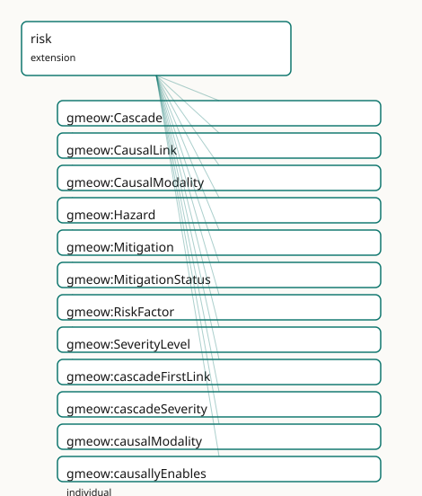

<!-- GENERATED by gmeow ontology-docs. DO NOT EDIT. Source hash: c99d8d50c0344040. -->

# GMEOW Risk Module

- **IRI:** <https://blackcatinformatics.ca/gmeow/slices/risk>
- **Tier:** extension
- **[`Group`](../reference/classes/gmeow-Group.md):** extensions

## What This Slice Covers

This slice owns 38 terms and contributes 0 mapping or projection rows. Use it when its terms match the native fact you want to preserve; use the linkage tables to see how those facts leave GMEOW for consumer vocabularies.

## Dependencies

- [`gmeow:slices/events`](events.md)
- [`gmeow:slices/kernel`](kernel.md)

## Consumers

- The lbox principia importer (EPIC: failure_cascades — Trust Collapse and five siblings as named, graded, type-level chains) and threat-model worked examples (D3FEND countermeasures ↔ [`Mitigation`](../reference/classes/gmeow-Mitigation.md); bowtie barriers ↔ [`mitigationCounters`](../reference/properties/gmeow-mitigationCounters.md) on CausalLinks). The norms and procedures extensions plug in through [`Mitigation`](../reference/classes/gmeow-Mitigation.md)'s deliberately open measure range — no extension→extension dependency exists or may exist (P16 DAG rule).

## Local Map



## Examples

### Trust Collapse

- **Source:** [`slices/extensions/risk/examples/trust-collapse.ttl`](https://github.com/Blackcat-Informatics/gmeow-ontology/blob/main/slices/extensions/risk/examples/trust-collapse.ttl)
- **GMEOW terms:** [`gmeow:Cascade`](../reference/classes/gmeow-Cascade.md), [`gmeow:CausalLink`](../reference/classes/gmeow-CausalLink.md), [`gmeow:EventType`](../reference/classes/gmeow-EventType.md), [`gmeow:Hazard`](../reference/classes/gmeow-Hazard.md), [`gmeow:Mitigation`](../reference/classes/gmeow-Mitigation.md), [`gmeow:SocialObject`](../reference/classes/gmeow-SocialObject.md), [`gmeow:cascadeFirstLink`](../reference/properties/gmeow-cascadeFirstLink.md), [`gmeow:cascadeSeverity`](../reference/properties/gmeow-cascadeSeverity.md), [`gmeow:causalModality`](../reference/properties/gmeow-causalModality.md), [`gmeow:causallyNecessitates`](../reference/individuals/gmeow-causallyNecessitates.md)

```turtle
# SPDX-FileCopyrightText: 2026 Blackcat Informatics® Inc. <paudley@blackcatinformatics.ca>
# SPDX-License-Identifier: CC-BY-4.0
# Worked example (, the named P15 consumer's flagship case): the
# principia "Trust Collapse" failure cascade as a named, graded, type-level
# chain — betrayal dissolves the bond, bond dissolution kills the will to
# survive. NOTHING HERE OCCURRED: every node is an EventType, and the
# no-occurrence gate keeps it that way. A norm-shaped mitigation (the oath)
# bars the first link's antecedent by open-range reference.

@prefix gmeow: <https://blackcatinformatics.ca/gmeow/> .
@prefix ex:    <https://blackcatinformatics.ca/gmeow/examples/> .
@prefix rdfs:  <http://www.w3.org/2000/01/rdf-schema#> .

# The three feared kinds — types, never instances.
ex:etBetrayal a gmeow:EventType ; rdfs:label "trust betrayal (Shattered Oath)"@en .
ex:etBondDissolution a gmeow:EventType ; rdfs:label "bond dissolution (Severed Thread)"@en .
ex:etWillCollapse a gmeow:EventType ; rdfs:label "loss of the will to survive (Quiet Surrender)"@en .

# Flat 80% claims.
ex:etBetrayal gmeow:typeCauses ex:etBondDissolution .

# Reified where modality and mechanism matter.
ex:linkBetrayalToDissolution a gmeow:CausalLink ;
    gmeow:linkAntecedent ex:etBetrayal ;
    gmeow:linkConsequent ex:etBondDissolution ;
    gmeow:causalModality gmeow:causallyNecessitates ;
    gmeow:linkMechanism "The bond is constituted by the oath; betrayal does not damage it, it unmakes it."@en ;
    gmeow:linkNext ex:linkDissolutionToCollapse .

ex:linkDissolutionToCollapse a gmeow:CausalLink ;
    gmeow:linkAntecedent ex:etBondDissolution ;
    gmeow:linkConsequent ex:etWillCollapse ;
    gmeow:causalModality gmeow:causallyPromotes .

ex:trustCollapse a gmeow:Cascade ;
    rdfs:label "Trust Collapse"@en ;
    gmeow:cascadeFirstLink ex:linkBetrayalToDissolution ;
    gmeow:cascadeSeverity gmeow:severityCatastrophic .

# The hazard at the source, and the norm-shaped barrier on the first link.
ex:duoBond a gmeow:SocialObject ; rdfs:label "the bonded partnership"@en .
ex:betrayalHazard a gmeow:Hazard ;
    rdfs:label "betrayal exposure"@en ;
    gmeow:hazardBearer ex:duoBond ;
    gmeow:manifestedAsType ex:etBetrayal ;
    gmeow:hazardSeverity gmeow:severityCatastrophic .

# Open-range measure: the oath norm (norms extension) plugs in with no
# extension→extension axiom — the IRI is reference, not dependency.
ex:oathMitigation a gmeow:Mitigation ;
    gmeow:mitigationMeasure ex:oathNorm ;
    gmeow:mitigationCounters ex:linkBetrayalToDissolution , ex:betrayalHazard ;
    gmeow:mitigationStatus gmeow:mitigationActive .
```

## Terms

### Classes

| Term | Label | Definition |
|---|---|---|
| [`gmeow:Cascade`](../reference/classes/gmeow-Cascade.md) | Cascade | A NAMED chain of causal links — 'Trust Collapse: betrayal dissolves the bond, bond dissolution kills the will to survive.' A social object: the cascade exists... |
| [`gmeow:CausalLink`](../reference/classes/gmeow-CausalLink.md) | Causal Link | A reified type-level causal claim — antecedent kind × consequent kind × modality, with optional mechanism prose and solver-input strength. Mint one when HOW th... |
| [`gmeow:CausalModality`](../reference/classes/gmeow-CausalModality.md) | Causal Modality | The force of a causal link — an OPEN value vocabulary seeded with necessitates (the antecedent suffices), promotes (raises likelihood), enables (makes possible... |
| [`gmeow:Hazard`](../reference/classes/gmeow-Hazard.md) | Hazard | A bearer's disposition toward harm — manifested, when it manifests at all, as events of a feared type ([`gmeow:manifestedAsType`](../reference/properties/gmeow-manifestedAsType.md)). A hazard that never manifests i... |
| [`gmeow:Mitigation`](../reference/classes/gmeow-Mitigation.md) | Mitigation | A reified countermeasure binding: a measure — a [`gmeow:Norm`](../reference/classes/gmeow-Norm.md) (norms extension) or a Procedure (procedures extension) — set against a causal link or hazard it cou... |
| [`gmeow:MitigationStatus`](../reference/classes/gmeow-MitigationStatus.md) | Mitigation Status | The lifecycle status of a mitigation — an OPEN value vocabulary seeded with proposed, active, retired. Retirement is suppression-shaped: a retired mitigation i... |
| [`gmeow:RiskFactor`](../reference/classes/gmeow-RiskFactor.md) | Risk Factor | The umbrella category of things a mitigation can be set against — causal links (a bowtie barrier on the chain) and hazards (a control at the source). Exists as... |
| [`gmeow:SeverityLevel`](../reference/classes/gmeow-SeverityLevel.md) | Severity Level | The graded severity of a cascade or hazard — an OPEN, ordered value vocabulary (catastrophic ≻ severe ≻ moderate ≻ minor; deployments add grades — negligible,... |

### Properties

| Term | Label | Definition |
|---|---|---|
| [`gmeow:cascadeFirstLink`](../reference/properties/gmeow-cascadeFirstLink.md) | cascade first link | The entry link of this cascade. Functional and mandatory (SHACL). |
| [`gmeow:cascadeSeverity`](../reference/properties/gmeow-cascadeSeverity.md) | cascade severity | The cascade's graded severity — according to whoever grades it (statement-layer indexed). NOT functional (review): grading is evaluative and source-var... |
| [`gmeow:causalModality`](../reference/properties/gmeow-causalModality.md) | causal modality | The force this link claims. Functional and mandatory (SHACL): if you reified, you had a reason — the modality is it. Open vocabulary (sh:nodeKind sh:IRI, never... |
| [`gmeow:hazardBearer`](../reference/properties/gmeow-hazardBearer.md) | hazard bearer | The entity in which this hazard inheres. Functional and mandatory (SHACL): a disposition has exactly one bearer ([gUFO](../external/ontologies.md#target-gufo) inherence, asserted with GMEOW's own prop... |
| [`gmeow:hazardSeverity`](../reference/properties/gmeow-hazardSeverity.md) | hazard severity | The hazard's graded severity, when graded standalone (a hazard feeding a cascade usually inherits attention from the cascade's grade). NOT functional (... |
| [`gmeow:linkAntecedent`](../reference/properties/gmeow-linkAntecedent.md) | link antecedent | The causing kind. Functional and mandatory (SHACL); distinct from the consequent (SHACL — nothing type-causes itself). |
| [`gmeow:linkConsequent`](../reference/properties/gmeow-linkConsequent.md) | link consequent | The caused kind. Functional and mandatory (SHACL). |
| [`gmeow:linkMechanism`](../reference/properties/gmeow-linkMechanism.md) | link mechanism | How the causation works — prose. NOT functional and range-open (localizable prose, the lesson): one mechanism account per language tag. |
| [`gmeow:linkNext`](../reference/properties/gmeow-linkNext.md) | link next | The next link in a cascade walk. NOT functional (a link may feed branches; a branching failure tree is one cascade entry with diverging walks) and NOT transiti... |
| [`gmeow:linkStrength`](../reference/properties/gmeow-linkStrength.md) | link strength | A solver-INPUT weight for this link, on whatever scale the consuming analysis declares. Never a solver output written back as assertion ([Principle 12](https://github.com/Blackcat-Informatics/gmeow-ontology/blob/main/CONSTITUTION.md#principle-12)). NOT fun... |
| [`gmeow:manifestedAsType`](../reference/properties/gmeow-manifestedAsType.md) | manifested as type | The feared kind of event — what this hazard's manifestation would BE, were it to occur. Range is [`gmeow:EventType`](../reference/classes/gmeow-EventType.md), never [`gmeow:Event`](../reference/classes/gmeow-Event.md): the type level is where co... |
| [`gmeow:mitigationCounters`](../reference/properties/gmeow-mitigationCounters.md) | mitigation counters | What the measure is set against — a [`gmeow:RiskFactor`](../reference/classes/gmeow-RiskFactor.md): a CausalLink (a bowtie barrier on the chain) or a Hazard (a control at the source). NOT functional, at le... |
| [`gmeow:mitigationMeasure`](../reference/properties/gmeow-mitigationMeasure.md) | mitigation measure | The countermeasure — a norm that forbids the antecedent conduct, a procedure that interrupts the chain, a design control. Range intentionally open across exten... |
| [`gmeow:mitigationStatus`](../reference/properties/gmeow-mitigationStatus.md) | mitigation status | The mitigation's lifecycle status. NOT functional (review): lifecycle is mutable and source-variable — status-over-time rides validFrom/validUntil on t... |
| [`gmeow:moreSevereThan`](../reference/properties/gmeow-moreSevereThan.md) | more severe than | Orders severity levels. Transitive ON LEVELS ONLY (the [`gmeow:coarserThan`](../reference/properties/gmeow-coarserThan.md) / [`gmeow:strongerThan`](../reference/properties/gmeow-strongerThan.md) pattern) — cascades themselves are never ordered transitively. |
| [`gmeow:typeCauses`](../reference/properties/gmeow-typeCauses.md) | type causes | Flat type-level causal claim: events of the subject kind bring about events of the object kind — according to whoever asserts it (statement-layer indexed, Prin... |
| [`gmeow:typeEnables`](../reference/properties/gmeow-typeEnables.md) | type enables | Flat type-level enablement: events of the subject kind make events of the object kind possible without bringing them about. NOT transitive; promote to gmeow:Ca... |
| [`gmeow:typeMitigates`](../reference/properties/gmeow-typeMitigates.md) | type mitigates | Flat type-level mitigation: events of the subject kind reduce the severity or likelihood of events of the object kind without fully preventing them. NOT transi... |
| [`gmeow:typePrevents`](../reference/properties/gmeow-typePrevents.md) | type prevents | Flat type-level prevention: events of the subject kind block events of the object kind. NOT transitive. Grounds sumo:prevents at alignment time; the D3FEND cou... |

### Individuals

| Term | Label | Definition |
|---|---|---|
| [`gmeow:causallyEnables`](../reference/individuals/gmeow-causallyEnables.md) | enables | The antecedent kind makes the consequent kind possible. |
| [`gmeow:causallyNecessitates`](../reference/individuals/gmeow-causallyNecessitates.md) | necessitates | The antecedent kind suffices for the consequent kind. |
| [`gmeow:causallyPrevents`](../reference/individuals/gmeow-causallyPrevents.md) | prevents | The antecedent kind blocks the consequent kind — the inhibitory reading, reified. |
| [`gmeow:causallyPromotes`](../reference/individuals/gmeow-causallyPromotes.md) | promotes | The antecedent kind raises the likelihood of the consequent kind. |
| [`gmeow:mitigationActive`](../reference/individuals/gmeow-mitigationActive.md) | active | The mitigation is in force. |
| [`gmeow:mitigationProposed`](../reference/individuals/gmeow-mitigationProposed.md) | proposed | The mitigation is proposed, not yet in force. |
| [`gmeow:mitigationRetired`](../reference/individuals/gmeow-mitigationRetired.md) | retired | The mitigation has been withdrawn — kept with this status, never deleted ([Principle 10](https://github.com/Blackcat-Informatics/gmeow-ontology/blob/main/CONSTITUTION.md#principle-10)). |
| [`gmeow:severityCatastrophic`](../reference/individuals/gmeow-severityCatastrophic.md) | catastrophic | The catastrophic severity level — the failure that ends the system it grades. |
| [`gmeow:severityMinor`](../reference/individuals/gmeow-severityMinor.md) | minor | The minor severity level. |
| [`gmeow:severityModerate`](../reference/individuals/gmeow-severityModerate.md) | moderate | The moderate severity level. |
| [`gmeow:severitySevere`](../reference/individuals/gmeow-severitySevere.md) | severe | The severe severity level. |

## Guide

<!-- SPDX-FileCopyrightText: 2026 Blackcat Informatics® Inc. <paudley@blackcatinformatics.ca> -->
<!-- SPDX-License-Identifier: CC-BY-4.0 -->

# risk

> **Slice:** `https://blackcatinformatics.ca/gmeow/slices/risk` · **tier: extension**

Hazards, type-level causation, cascades, and mitigations (EPIC) —
counterfactual causal structure **without counterfactual machinery**.

## The type-level move

Cascades relate event **types**, never event instances: nothing in this
slice asserts that anything occurred, and the no-occurrence gate makes that
executable (the test suite asserts the full fixture set entails zero
[`gmeow:Event`](../reference/classes/gmeow-Event.md) instances from this slice's terms). [PROV](../external/ontologies.md#target-prov) lineage and [CRM](../external/ontologies.md#target-crm)
influence are token-level; OBO RO is the rare type-level causation
vocabulary — that asymmetry is why this slice exists.

## Shape of the model

- **[`Hazard`](../reference/classes/gmeow-Hazard.md) ⊑ [`gufo:Disposition`](../external/terms.md#gufo-disposition)** (first Disposition use in GMEOW): a
 bearer's disposition toward harm, [`manifestedAsType`](../reference/properties/gmeow-manifestedAsType.md) → the feared
 [`EventType`](../reference/classes/gmeow-EventType.md)(s). A hazard that never manifests is fully real.
- **Flat type-level links** [`typeCauses`](../reference/properties/gmeow-typeCauses.md) / [`typeEnables`](../reference/properties/gmeow-typeEnables.md) / [`typePrevents`](../reference/properties/gmeow-typePrevents.md) /
 [`typeMitigates`](../reference/properties/gmeow-typeMitigates.md) ([`EventType`](../reference/classes/gmeow-EventType.md) → [`EventType`](../reference/classes/gmeow-EventType.md), never transitive — chain
 composition is solver work, P12) → promote to **[`CausalLink`](../reference/classes/gmeow-CausalLink.md)**
 (antecedent × consequent × mandatory [`causalModality`](../reference/properties/gmeow-causalModality.md)
 [necessitates / promotes / enables / prevents, open] × localizable
 mechanism prose × solver-input [`linkStrength`](../reference/properties/gmeow-linkStrength.md)). Causal links are claims:
 standpoint-indexed, confidence-bearing; two analysts' divergent links
 coexist (P9).
- **[`Cascade`](../reference/classes/gmeow-Cascade.md) ⊑ [`SocialObject`](../reference/classes/gmeow-SocialObject.md)** — a *named* failure narrative ("Trust
 Collapse"), entered at [`cascadeFirstLink`](../reference/properties/gmeow-cascadeFirstLink.md), walked by [`linkNext`](../reference/properties/gmeow-linkNext.md)
 (non-functional → branching failure trees; SHACL-acyclic), graded by the
 ordered **[`SeverityLevel`](../reference/classes/gmeow-SeverityLevel.md)** vocabulary ([`GranularityLevel`](../reference/classes/gmeow-GranularityLevel.md) pattern, fourth
 use; ISO 31000 / IEC 60812 anchor terminology only).
- **[`Mitigation`](../reference/classes/gmeow-Mitigation.md)** binds a measure to a **[`RiskFactor`](../reference/classes/gmeow-RiskFactor.md)** (the named umbrella
 over [`CausalLink`](../reference/classes/gmeow-CausalLink.md) + [`Hazard`](../reference/classes/gmeow-Hazard.md) — generator-visible range, relator-arity
 visible end). The *measure* range is deliberately **open** (the
 [`tenurePosition`](../reference/properties/gmeow-tenurePosition.md) precedent, fourth use): a [`gmeow:Norm`](../reference/classes/gmeow-Norm.md) or a [`Procedure`](../reference/classes/gmeow-Procedure.md)
 plugs in without extension→extension dependency (P16). Whether a
 mitigation *worked* is a vantage-indexed claim, never an entailment.

## Deferred to the compiler-arc window

OBO RO rows (linkage-only, BFO lineage), MITRE D3FEND
(countermeasure ↔ [`Mitigation`](../reference/classes/gmeow-Mitigation.md)), STIX 2.1/ATT&CK, UCO, [ConceptNet/ATOMIC](../external/ontologies.md#target-conceptnet);
projections to bowtie JSON (near-structural; drops [`causalModality`](../reference/properties/gmeow-causalModality.md) — declared),
FMEA CSV (drops chain order — declared), STIX bundles. Target list fixed in.
