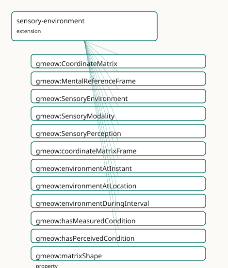

<!-- GENERATED by gmeow ontology-docs. DO NOT EDIT. -->

# GMEOW Sensory Environment Module

- **IRI:** <https://blackcatinformatics.ca/gmeow/slices/sensory-environment>
- **Tier:** extension
- **[`Group`](../reference/classes/gmeow-Group.md):** extensions

## What This Slice Covers

This slice owns 32 terms and contributes 9 mapping or projection rows. Use it when its terms match the native fact you want to preserve; use the linkage tables to see how those facts leave GMEOW for consumer vocabularies.

## Dependencies

- [`gmeow:slices/kernel`](kernel.md)
- [`gmeow:slices/observations`](observations.md)
- [`gmeow:slices/places`](places.md)
- [`gmeow:slices/temporal`](temporal.md)

## Consumers

- Environmental sensing context for sensory observations.

## Local Map



## Examples

### Measured Vs Perceived

- **Source:** [`slices/extensions/sensory-environment/examples/measured-vs-perceived.ttl`](https://github.com/Blackcat-Informatics/gmeow-ontology/blob/main/slices/extensions/sensory-environment/examples/measured-vs-perceived.ttl)
- **GMEOW terms:** [`gmeow:CoordinateMatrix`](../reference/classes/gmeow-CoordinateMatrix.md), [`gmeow:Instant`](../reference/classes/gmeow-Instant.md), [`gmeow:Person`](../reference/classes/gmeow-Person.md), [`gmeow:Place`](../reference/classes/gmeow-Place.md), [`gmeow:SensoryEnvironment`](../reference/classes/gmeow-SensoryEnvironment.md), [`gmeow:SensoryPerception`](../reference/classes/gmeow-SensoryPerception.md), [`gmeow:coordinateMatrixFrame`](../reference/properties/gmeow-coordinateMatrixFrame.md), [`gmeow:environmentAtInstant`](../reference/properties/gmeow-environmentAtInstant.md), [`gmeow:environmentAtLocation`](../reference/properties/gmeow-environmentAtLocation.md), [`gmeow:hasMeasuredCondition`](../reference/properties/gmeow-hasMeasuredCondition.md)
- **External prefixes:** `xsd`

```turtle
# SPDX-FileCopyrightText: 2026 Blackcat Informatics® Inc. <paudley@blackcatinformatics.ca>
# SPDX-License-Identifier: CC-BY-4.0
#
# Worked example: measured ≠ perceived (, P11/P12). A gmeow:SensoryEnvironment
# at a location and instant carries TWO kinds of condition that GMEOW refuses to
# conflate: a gmeow:hasMeasuredCondition (a gmeow:CoordinateMatrix — instrument
# data, every value in an explicit reference frame) and a gmeow:hasPerceivedCondition
# (a gmeow:SensoryPerception — how an observer experienced it, per
# gmeow:perceptionModality). "23.5 °C on the grid" and "it felt warm" are
# different claims about the same room: one objective and framed, one subjective.
@prefix gmeow: <https://blackcatinformatics.ca/gmeow/> .
@prefix ex:    <https://blackcatinformatics.ca/gmeow/examples/sensory-environment/> .
@prefix rdfs:  <http://www.w3.org/2000/01/rdf-schema#> .
@prefix xsd:   <http://www.w3.org/2001/XMLSchema#> .

ex:room a gmeow:Place ; gmeow:name "Tasting room"@en .

ex:noon a gmeow:Instant ;
    gmeow:instantValue    "2026-06-12T12:00:00Z"^^xsd:dateTime ;
    gmeow:inTemporalFrame gmeow:temporalFrameUTCGregorian .

# --- The environment: same room and instant, two kinds of condition.
ex:env a gmeow:SensoryEnvironment ;
    gmeow:environmentAtLocation  ex:room ;
    gmeow:environmentAtInstant   ex:noon ;
    gmeow:sensoryModality        gmeow:sensoryModalityThermal ;
    gmeow:hasMeasuredCondition   ex:thermalGrid ;
    gmeow:hasPerceivedCondition  ex:feltWarm .

# --- Objective: a grid of temperature readings, framed (P11).
ex:thermalGrid a gmeow:CoordinateMatrix ;
    gmeow:coordinateMatrixFrame gmeow:referenceFrameLocalGrid ;
    gmeow:matrixShape           "1" ;
    gmeow:matrixValue           "23.5" .

# --- Subjective: how it was experienced — the thermal modality, but a perception.
#     A SensoryPerception is a core Observation, so it records WHO perceived it
#     (vantage) and HOW (observationMethod) — the qualia are a standpoint's, not
#     a frame-free fact.
ex:taster a gmeow:Person ; gmeow:name "Visiting taster"@en .

ex:feltWarm a gmeow:SensoryPerception ;
    gmeow:perceptionModality gmeow:sensoryModalityThermal ;
    gmeow:vantage            ex:taster ;
    gmeow:observationMethod  gmeow:methodDirectObservation .
```

## Terms

### Classes

| Term | Label | Definition |
|---|---|---|
| [`gmeow:CoordinateMatrix`](../reference/classes/gmeow-CoordinateMatrix.md) | Coordinate Matrix | A multi-dimensional numeric value expressed as a coordinate matrix or vector — the generalisation of ScalarQuantity to vector, matrix, and tensor results. Carr... |
| [`gmeow:MentalReferenceFrame`](../reference/classes/gmeow-MentalReferenceFrame.md) | Mental Reference Frame | A subjective or internal reference frame in which standpoint-indexed values are expressed — e.g. a thermal comfort scale, an olfactory quality space, a subject... |
| [`gmeow:SensoryEnvironment`](../reference/classes/gmeow-SensoryEnvironment.md) | Sensory Environment | Ambient perceivable conditions at a specific location and time — the ensemble of physical properties that can be measured by instruments or perceived by observ... |
| [`gmeow:SensoryModality`](../reference/classes/gmeow-SensoryModality.md) | Sensory Modality | The sensory channel or domain through which an environment property is measured or perceived — a value vocabulary (individuals, never subclasses). Distinguishe... |
| [`gmeow:SensoryPerception`](../reference/classes/gmeow-SensoryPerception.md) | Sensory Perception | A standpoint-indexed perceived value about a SensoryEnvironment — a subjective claim made by a perceiver (vantage) about ambient conditions (observedFeature),... |

### Properties

| Term | Label | Definition |
|---|---|---|
| [`gmeow:coordinateMatrixFrame`](../reference/properties/gmeow-coordinateMatrixFrame.md) | coordinate matrix frame | The reference frame in which this CoordinateMatrix is expressed. Functional: a matrix is expressed in exactly one frame; frame transformation is a solver conce... |
| [`gmeow:environmentAtInstant`](../reference/properties/gmeow-environmentAtInstant.md) | environment at instant | The instant at which this point-like SensoryEnvironment holds. For interval-scoped environments, use [`gmeow:environmentDuringInterval`](../reference/properties/gmeow-environmentDuringInterval.md) instead. |
| [`gmeow:environmentAtLocation`](../reference/properties/gmeow-environmentAtLocation.md) | environment at location | The location whose ambient conditions this SensoryEnvironment describes. Functional: a SensoryEnvironment concerns exactly one location (constitutive of its id... |
| [`gmeow:environmentDuringInterval`](../reference/properties/gmeow-environmentDuringInterval.md) | environment during interval | The time interval over which this SensoryEnvironment holds. For point-like environments, use [`gmeow:environmentAtInstant`](../reference/properties/gmeow-environmentAtInstant.md) instead. |
| [`gmeow:hasMeasuredCondition`](../reference/properties/gmeow-hasMeasuredCondition.md) | has measured condition | An objective measurement of the ambient conditions, expressed as a CoordinateMatrix in a measurement reference frame. Non-functional: multiple instruments may... |
| [`gmeow:hasPerceivedCondition`](../reference/properties/gmeow-hasPerceivedCondition.md) | has perceived condition | A standpoint-indexed perceived value about the ambient conditions, expressed as a SensoryPerception in a MentalReferenceFrame. Non-functional: multiple perceiv... |
| [`gmeow:matrixShape`](../reference/properties/gmeow-matrixShape.md) | matrix shape | The shape descriptor of a CoordinateMatrix (e.g. '4×1' for a colourspace tuple, '256×1' for a spectral vector, '640×480×3' for a thermal image). Enables the so... |
| [`gmeow:matrixValue`](../reference/properties/gmeow-matrixValue.md) | matrix value | The serialised numeric content of a CoordinateMatrix — a vector, matrix, or tensor expressed as a literal (e.g. a JSON array, a WKT-like tuple string, or a bas... |
| [`gmeow:perceptionEnvironment`](../reference/properties/gmeow-perceptionEnvironment.md) | perception environment | The SensoryEnvironment that a SensoryPerception is about — the observedFeature of the claim. Domain is [`gmeow:Observation`](../reference/classes/gmeow-Observation.md) so it applies to any observation subcl... |
| [`gmeow:perceptionModality`](../reference/properties/gmeow-perceptionModality.md) | perception modality | The sensory modality of a SensoryPerception — the channel through which the perception was made. |
| [`gmeow:sensoryModality`](../reference/properties/gmeow-sensoryModality.md) | sensory modality | The sensory channel(s) through which this environment is measured or perceived. Non-functional: a single environment may span multiple modalities (e.g. a space... |

### Individuals

| Term | Label | Definition |
|---|---|---|
| [`gmeow:referenceFrameAffectiveCircumplex`](../reference/individuals/gmeow-referenceFrameAffectiveCircumplex.md) | Russell Affective Circumplex Reference Frame | The affective circumplex mental reference frame — a coordinate system for describing cognitive, affective, or perceptual states. |
| [`gmeow:referenceFrameAudioSpectrum`](../reference/individuals/gmeow-referenceFrameAudioSpectrum.md) | Audio Spectrum Reference Frame | The audio spectrum reference frame — a named coordinate system or value space together with its axes, origin, and transformation rules ([Principle 11](https://github.com/Blackcat-Informatics/gmeow-ontology/blob/main/CONSTITUTION.md#principle-11)). |
| [`gmeow:referenceFrameCIELAB`](../reference/individuals/gmeow-referenceFrameCIELAB.md) | CIE L*a*b* Perceptually-Uniform Reference Frame | The cie lab reference frame — a named coordinate system or value space together with its axes, origin, and transformation rules ([Principle 11](https://github.com/Blackcat-Informatics/gmeow-ontology/blob/main/CONSTITUTION.md#principle-11)). |
| [`gmeow:referenceFrameCIEXYZ`](../reference/individuals/gmeow-referenceFrameCIEXYZ.md) | CIE 1931 XYZ Tristimulus Reference Frame | The cie xyz reference frame — a named coordinate system or value space together with its axes, origin, and transformation rules ([Principle 11](https://github.com/Blackcat-Informatics/gmeow-ontology/blob/main/CONSTITUTION.md#principle-11)). |
| [`gmeow:referenceFrameCognitiveMapAllocentric`](../reference/individuals/gmeow-referenceFrameCognitiveMapAllocentric.md) | Allocentric Cognitive Map Reference Frame | The cognitive map allocentric mental reference frame — a coordinate system for describing cognitive, affective, or perceptual states. |
| [`gmeow:referenceFrameCognitiveMapEgocentric`](../reference/individuals/gmeow-referenceFrameCognitiveMapEgocentric.md) | Egocentric Cognitive Map Reference Frame | The cognitive map egocentric mental reference frame — a coordinate system for describing cognitive, affective, or perceptual states. |
| [`gmeow:referenceFrameConceptualSpace`](../reference/individuals/gmeow-referenceFrameConceptualSpace.md) | Gärdenfors Conceptual Space Reference Frame | A generic conceptual space frame after Gärdenfors — domains are convex regions in a similarity metric space. The actual domain-specific axes (colour, taste, sh... |
| [`gmeow:referenceFrameImaginedSpace`](../reference/individuals/gmeow-referenceFrameImaginedSpace.md) | Imagined Space Reference Frame | An imagined or dream-space reference frame — e.g. a memory palace, a dream landscape, or a fictional world. Coordinates are relative to the imaginer's internal... |
| [`gmeow:referenceFrameThermalComfort`](../reference/individuals/gmeow-referenceFrameThermalComfort.md) | ASHRAE Thermal Comfort Reference Frame | The thermal comfort mental reference frame — a coordinate system for describing cognitive, affective, or perceptual states. |
| [`gmeow:sensoryModalityAirQuality`](../reference/individuals/gmeow-sensoryModalityAirQuality.md) | air quality | The air-quality/chemical-composition sensory channel. |
| [`gmeow:sensoryModalityAuditory`](../reference/individuals/gmeow-sensoryModalityAuditory.md) | auditory | The auditory/sound sensory channel. |
| [`gmeow:sensoryModalityGustatory`](../reference/individuals/gmeow-sensoryModalityGustatory.md) | gustatory | The gustatory/taste sensory channel. |
| [`gmeow:sensoryModalityOlfactory`](../reference/individuals/gmeow-sensoryModalityOlfactory.md) | olfactory | The olfactory/smell sensory channel. |
| [`gmeow:sensoryModalityTactile`](../reference/individuals/gmeow-sensoryModalityTactile.md) | tactile | The tactile/touch sensory channel. |
| [`gmeow:sensoryModalityThermal`](../reference/individuals/gmeow-sensoryModalityThermal.md) | thermal | The thermal/temperature sensory channel. |
| [`gmeow:sensoryModalityVisual`](../reference/individuals/gmeow-sensoryModalityVisual.md) | visual | The visual/light sensory channel. |

## Linkages

- **Rows:** 9
- **Projection profiles:** -
- **External vocabularies:** `bfo`, `mls`, `sosa`

| Source | Kind | Profile | Predicate/Relation | Target | Evidence |
|---|---|---|---|---|---|
| [`gmeow:CoordinateMatrix`](../reference/classes/gmeow-CoordinateMatrix.md) | equivalence | `-` | [skos:closeMatch](http://www.w3.org/2004/02/skos/core#closeMatch) | [mls:Feature](http://www.w3.org/ns/mls#Feature) | `gmeow-places.sssom.tsv`; `gmeow:eqPlaces158`; confidence 0.8 |
| [`gmeow:CoordinateMatrix`](../reference/classes/gmeow-CoordinateMatrix.md) | equivalence | `-` | [skos:closeMatch](http://www.w3.org/2004/02/skos/core#closeMatch) | [sosa:Result](http://www.w3.org/ns/sosa/Result) | `gmeow-sensory-environment.sssom.tsv`; `gmeow:eqSenv003`; confidence 0.75 |
| [`gmeow:MentalReferenceFrame`](../reference/classes/gmeow-MentalReferenceFrame.md) | equivalence | `-` | [skos:relatedMatch](http://www.w3.org/2004/02/skos/core#relatedMatch) | [bfo:MF_0000020](http://purl.obolibrary.org/obo/MF_0000020) | `gmeow-sensory-environment.sssom.tsv`; `gmeow:eqSenv006`; confidence 0.7 |
| [`gmeow:SensoryEnvironment`](../reference/classes/gmeow-SensoryEnvironment.md) | equivalence | `-` | [skos:closeMatch](http://www.w3.org/2004/02/skos/core#closeMatch) | [sosa:FeatureOfInterest](http://www.w3.org/ns/sosa/FeatureOfInterest) | `gmeow-sensory-environment.sssom.tsv`; `gmeow:eqSenv002`; confidence 0.85 |
| [`gmeow:SensoryPerception`](../reference/classes/gmeow-SensoryPerception.md) | equivalence | `-` | [skos:broadMatch](http://www.w3.org/2004/02/skos/core#broadMatch) | [bfo:MF_0000019](http://purl.obolibrary.org/obo/MF_0000019) | `gmeow-sensory-environment.sssom.tsv`; `gmeow:eqSenv007`; confidence 0.8 |
| [`gmeow:SensoryPerception`](../reference/classes/gmeow-SensoryPerception.md) | equivalence | `-` | [skos:closeMatch](http://www.w3.org/2004/02/skos/core#closeMatch) | [sosa:Observation](http://www.w3.org/ns/sosa/Observation) | `gmeow-sensory-environment.sssom.tsv`; `gmeow:eqSenv005`; confidence 0.9 |
| [`gmeow:hasMeasuredCondition`](../reference/properties/gmeow-hasMeasuredCondition.md) | equivalence | `-` | [skos:closeMatch](http://www.w3.org/2004/02/skos/core#closeMatch) | [sosa:hasResult](http://www.w3.org/ns/sosa/hasResult) | `gmeow-sensory-environment.sssom.tsv`; `gmeow:eqSenv004`; confidence 0.8 |
| [`gmeow:referenceFrameAffectiveCircumplex`](../reference/individuals/gmeow-referenceFrameAffectiveCircumplex.md) | equivalence | `-` | [skos:relatedMatch](http://www.w3.org/2004/02/skos/core#relatedMatch) | [bfo:MFOEM_000001](http://purl.obolibrary.org/obo/MFOEM_000001) | `gmeow-sensory-environment.sssom.tsv`; `gmeow:eqSenv009`; confidence 0.7 |
| [`gmeow:referenceFrameAffectiveCircumplex`](../reference/individuals/gmeow-referenceFrameAffectiveCircumplex.md) | equivalence | `-` | [skos:relatedMatch](http://www.w3.org/2004/02/skos/core#relatedMatch) | [bfo:MFOEM_000195](http://purl.obolibrary.org/obo/MFOEM_000195) | `gmeow-sensory-environment.sssom.tsv`; `gmeow:eqSenv008`; confidence 0.75 |

## Guide

<!-- SPDX-FileCopyrightText: 2026 Blackcat Informatics® Inc. <paudley@blackcatinformatics.ca> -->
<!-- SPDX-License-Identifier: CC-BY-4.0 -->

# Sensory Environment — ambient conditions, measured and felt

> **Slice:** `https://blackcatinformatics.ca/gmeow/slices/sensory-environment` · **tier: extension**
> What a room is like at 3 p.m. — to the instruments, and to each person in it.

"The room is 22 °C" and "the room feels stuffy" are different *kinds* of claim, and this
slice refuses to flatten them into one field. Ambient perceivable conditions at a
[`Location`](../reference/classes/gmeow-Location.md)×time are reified as a first-class [`SensoryEnvironment`](../reference/classes/gmeow-SensoryEnvironment.md) (not a property bag), so
that everything said about it carries provenance, confidence, temporal scope, and
standpoint. **Measured** conditions are [`CoordinateMatrix`](../reference/classes/gmeow-CoordinateMatrix.md) values in measurement reference
frames — colourspace, audio spectrum, thermal, air-quality. **Perceived** conditions are
standpoint-indexed values in [`MentalReferenceFrame`](../reference/classes/gmeow-MentalReferenceFrame.md)s: every perception is read in the
perceiver's own frame ([Principle 11](https://github.com/Blackcat-Informatics/gmeow-ontology/blob/main/CONSTITUTION.md#principle-11) — frames are first-class and self-describing, and a
mental frame *requires a host*; two hosts may map the same stimulus to different
coordinates). The two facets are co-equal, with no privileged representation
([Principle 9](https://github.com/Blackcat-Informatics/gmeow-ontology/blob/main/CONSTITUTION.md#principle-9)). Part of the the design Location-as-reference-frame design; the Principle-15
consumer is **environmental sensing context for sensory observations** — the sensory
slice's stack gains its where-and-what-it-was-like setting here.

## The environment and its facets

### [`gmeow:SensoryEnvironment`](../reference/classes/gmeow-SensoryEnvironment.md)

The ensemble of physical properties perceivable at one location and time. Anchored by
[`gmeow:environmentAtLocation`](../reference/properties/gmeow-environmentAtLocation.md) (functional — one location is constitutive of identity) and
scoped by [`gmeow:environmentAtInstant`](../reference/properties/gmeow-environmentAtInstant.md) (point-like) or [`gmeow:environmentDuringInterval`](../reference/properties/gmeow-environmentDuringInterval.md)
(spans) — pick one, never both for the same scope.

### [`gmeow:hasMeasuredCondition`](../reference/properties/gmeow-hasMeasuredCondition.md)

The objective facet: an instrument's reading as a [`CoordinateMatrix`](../reference/classes/gmeow-CoordinateMatrix.md) in a measurement
frame. Non-functional by doctrine — multiple instruments produce competing measurements
that coexist rather than collapse ([Principle 9](https://github.com/Blackcat-Informatics/gmeow-ontology/blob/main/CONSTITUTION.md#principle-9)).

### [`gmeow:hasPerceivedCondition`](../reference/properties/gmeow-hasPerceivedCondition.md)

The subjective facet: a perceiver's [`SensoryPerception`](../reference/classes/gmeow-SensoryPerception.md) in a [`MentalReferenceFrame`](../reference/classes/gmeow-MentalReferenceFrame.md).
Equally non-functional, and equally first-class — the felt temperature is not a degraded
version of the measured one.

### [`gmeow:sensoryModality`](../reference/properties/gmeow-sensoryModality.md)

The channel(s) through which the environment is characterised — values from
[`gmeow:SensoryModality`](../reference/classes/gmeow-SensoryModality.md), an open vocabulary (visual, auditory, olfactory, gustatory,
tactile, thermal, air quality). Non-functional: one space may be both thermally and
acoustically characterised.

## The measured side

### [`gmeow:CoordinateMatrix`](../reference/classes/gmeow-CoordinateMatrix.md)

The generalisation of [`ScalarQuantity`](../reference/classes/gmeow-ScalarQuantity.md) to vectors, matrices, and tensors: a serialised
[`gmeow:matrixValue`](../reference/properties/gmeow-matrixValue.md) literal, a [`gmeow:matrixShape`](../reference/properties/gmeow-matrixShape.md) descriptor ("4×1", "256×1",
"640×480×3"), a unit, a determinacy, and exactly one frame via
[`gmeow:coordinateMatrixFrame`](../reference/properties/gmeow-coordinateMatrixFrame.md). Used for colourspace tuples, audio spectra, thermal images,
and compound air-quality readings. All matrix algebra — dot products, transforms,
decompositions — lives in the solver layer ([Principle 12](https://github.com/Blackcat-Informatics/gmeow-ontology/blob/main/CONSTITUTION.md#principle-12)).

### [`gmeow:coordinateMatrixFrame`](../reference/properties/gmeow-coordinateMatrixFrame.md)

Functional sub-property of [`gmeow:hasReferenceFrame`](../reference/properties/gmeow-hasReferenceFrame.md): a matrix is expressed in exactly one
frame, and frame transformation is a computation, never an assertion. Being a sub-property
means the frame-inheritance chain ([`isResultOf`](../reference/properties/gmeow-isResultOf.md) ∘ [`hasReferenceFrame`](../reference/properties/gmeow-hasReferenceFrame.md)) applies
automatically. Seed measurement frames ship with the slice: CIE 1931 XYZ, CIE L\*a\*b\*,
and an audio-spectrum frame.

## The perceived side

### [`gmeow:MentalReferenceFrame`](../reference/classes/gmeow-MentalReferenceFrame.md)

A [`ReferenceFrame`](../reference/classes/gmeow-ReferenceFrame.md) whose realm is perceptual or psychological: thermal comfort (ASHRAE
PMV/PPD), the Russell affective circumplex, Gärdenfors conceptual spaces, egocentric and
allocentric cognitive maps, imagined spaces (memory palaces, dreams). Axiomatised to
require a host ([`gmeow:isHostedBy`](../reference/properties/gmeow-isHostedBy.md) someValuesFrom [`gmeow:Entity`](../reference/classes/gmeow-Entity.md)); the frame deactivates
when its host ceases to exist. This is [Principle 11](https://github.com/Blackcat-Informatics/gmeow-ontology/blob/main/CONSTITUTION.md#principle-11) at full strength — subjective value
spaces get the same first-class frame machinery as CIE XYZ.

### [`gmeow:SensoryPerception`](../reference/classes/gmeow-SensoryPerception.md)

A [`StandpointClaim`](../reference/classes/gmeow-StandpointClaim.md) specialised to the sensory domain: vantage = perceiver, [`observedFeature`](../reference/properties/gmeow-observedFeature.md)
= the environment (via [`gmeow:perceptionEnvironment`](../reference/properties/gmeow-perceptionEnvironment.md), a sub-property of [`observedFeature`](../reference/properties/gmeow-observedFeature.md)),
result = the perceived value, channel = [`gmeow:perceptionModality`](../reference/properties/gmeow-perceptionModality.md). Competing perceptions
coexist without collapse ([Principle 9](https://github.com/Blackcat-Informatics/gmeow-ontology/blob/main/CONSTITUTION.md#principle-9)); superseded ones are suppressed, never deleted
([Principle 10](https://github.com/Blackcat-Informatics/gmeow-ontology/blob/main/CONSTITUTION.md#principle-10)).

## Solver layer & status

Colourspace conversion, spectral analysis, comfort-model evaluation, and matrix parsing
(shape-directed via [`matrixShape`](../reference/properties/gmeow-matrixShape.md)) are solver-layer concerns ([Principle 12](https://github.com/Blackcat-Informatics/gmeow-ontology/blob/main/CONSTITUTION.md#principle-12)) — the graph
states which frame a value is in; it never stores re-derived coordinates. The slice is
flagged **putative** in its module header: alignments beyond the in-house frame facility
(e.g. to SOSA observation context or W3C SSN-System) are deferred until the
Location-as-reference-frame design settles. Depends on `kernel`, `observations`,
`places`, and `temporal`.
