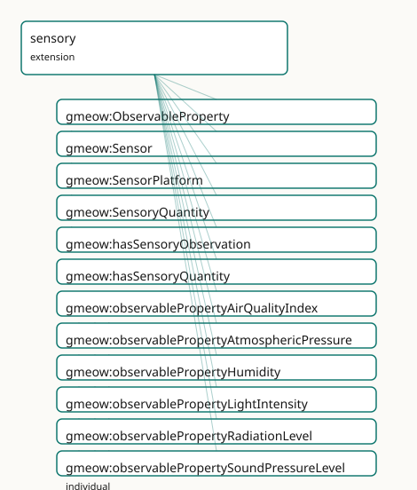

<!-- GENERATED by gmeow ontology-docs. DO NOT EDIT. Source hash: c99d8d50c0344040. -->

# GMEOW Sensory Module

- **IRI:** <https://blackcatinformatics.ca/gmeow/slices/sensory>
- **Tier:** extension
- **[`Group`](../reference/classes/gmeow-Group.md):** extensions

## What This Slice Covers

This slice owns 17 terms and contributes 23 mapping or projection rows. Use it when its terms match the native fact you want to preserve; use the linkage tables to see how those facts leave GMEOW for consumer vocabularies.

## Dependencies

- [`gmeow:slices/kernel`](kernel.md)
- [`gmeow:slices/observations`](observations.md)
- [`gmeow:slices/places`](places.md)

## Consumers

- Sensory perception observations (the unified stance applied to senses).

## Local Map



## Terms

### Classes

| Term | Label | Definition |
|---|---|---|
| [`gmeow:ObservableProperty`](../reference/classes/gmeow-ObservableProperty.md) | Observable Property | A physical, chemical, biological, or environmental property that can be observed or measured by a sensor. A value vocabulary (individuals, never subclasses) so... |
| [`gmeow:Sensor`](../reference/classes/gmeow-Sensor.md) | Sensor | An agent that produces observations by responding to a stimulus — a physical device, a software process, or a biological perceiver. The observer in a sensory o... |
| [`gmeow:SensorPlatform`](../reference/classes/gmeow-SensorPlatform.md) | Sensor Platform | A physical entity that hosts one or more sensors — a weather station, a satellite, a buoy, a drone, a vehicle, or a building-mounted instrument. The platform i... |
| [`gmeow:SensoryQuantity`](../reference/classes/gmeow-SensoryQuantity.md) | Sensory Quantity | The scalar numeric result of a sensory observation — a value with unit, determinacy, and granularity. Equivalent to [`gmeow:ScalarQuantity`](../reference/classes/gmeow-ScalarQuantity.md) (following the ali... |

### Properties

| Term | Label | Definition |
|---|---|---|
| [`gmeow:hasSensoryObservation`](../reference/properties/gmeow-hasSensoryObservation.md) | has sensory observation | Links an entity to a sensory observation that measured one of its properties. Non-functional: multiple sensors may observe the same property of the same entity... |
| [`gmeow:hasSensoryQuantity`](../reference/properties/gmeow-hasSensoryQuantity.md) | has sensory quantity | Flat shortcut linking an entity to the scalar quantity result of a sensory observation of its property. Derived via property chain from the reified observation... |
| [`gmeow:platformLocation`](../reference/properties/gmeow-platformLocation.md) | platform location | The geographic place where a sensor platform is situated. A platform typically has one location at a time; historical locations are modelled as past SensoryObs... |
| [`gmeow:sensoryObservationOf`](../reference/properties/gmeow-sensoryObservationOf.md) | sensory observation of | The entity whose property is being observed — the observedFeature of a sensory observation. Subproperty of [`gmeow:observedFeature`](../reference/properties/gmeow-observedFeature.md) so generic consumers can query... |
| [`gmeow:sensoryProperty`](../reference/properties/gmeow-sensoryProperty.md) | sensory property | The observable property that a sensory observation measures — temperature, humidity, light intensity, etc. Distinct from [`gmeow:observationMethod`](../reference/properties/gmeow-observationMethod.md) (the procedure... |
| [`gmeow:sensoryResult`](../reference/properties/gmeow-sensoryResult.md) | sensory result | The scalar quantity result of a sensory observation — a value with unit, determinacy, and granularity. Subproperty of [`gmeow:observationResult`](../reference/properties/gmeow-observationResult.md) so generic consum... |

### Individuals

| Term | Label | Definition |
|---|---|---|
| [`gmeow:observablePropertyAirQualityIndex`](../reference/individuals/gmeow-observablePropertyAirQualityIndex.md) | air quality index | The air quality index observable property — a physical or environmental quantity that can be measured by a sensor. |
| [`gmeow:observablePropertyAtmosphericPressure`](../reference/individuals/gmeow-observablePropertyAtmosphericPressure.md) | atmospheric pressure | The atmospheric pressure observable property — a physical or environmental quantity that can be measured by a sensor. |
| [`gmeow:observablePropertyHumidity`](../reference/individuals/gmeow-observablePropertyHumidity.md) | humidity | The humidity observable property — a physical or environmental quantity that can be measured by a sensor. |
| [`gmeow:observablePropertyLightIntensity`](../reference/individuals/gmeow-observablePropertyLightIntensity.md) | light intensity | The light intensity observable property — a physical or environmental quantity that can be measured by a sensor. |
| [`gmeow:observablePropertyRadiationLevel`](../reference/individuals/gmeow-observablePropertyRadiationLevel.md) | radiation level | The radiation level observable property — a physical or environmental quantity that can be measured by a sensor. |
| [`gmeow:observablePropertySoundPressureLevel`](../reference/individuals/gmeow-observablePropertySoundPressureLevel.md) | sound pressure level | The sound pressure level observable property — a physical or environmental quantity that can be measured by a sensor. |
| [`gmeow:observablePropertyTemperature`](../reference/individuals/gmeow-observablePropertyTemperature.md) | temperature | The temperature observable property — a physical or environmental quantity that can be measured by a sensor. |

## Linkages

- **Rows:** 23
- **Projection profiles:** `ivoa`, `loinc`, `sosa`
- **External vocabularies:** `geo`, `loinc`, `obi`, `oboe`, `obscore`, `pato`, `sosa`

| Source | Kind | Profile | Predicate/Relation | Target | Evidence |
|---|---|---|---|---|---|
| [`gmeow:ObservableProperty`](../reference/classes/gmeow-ObservableProperty.md) | equivalence | `-` | [skos:relatedMatch](http://www.w3.org/2004/02/skos/core#relatedMatch) | [loinc:Component](http://loinc.org/rdf/Component) | `gmeow-observations.sssom.tsv`; `gmeow:eqObs073`; confidence 0.75 |
| [`gmeow:ObservableProperty`](../reference/classes/gmeow-ObservableProperty.md) | equivalence | `-` | [skos:closeMatch](http://www.w3.org/2004/02/skos/core#closeMatch) | [oboe:Characteristic](http://ecoinformatics.org/oboe/oboe.1.2/oboe-core.owl#Characteristic) | `gmeow-observations.sssom.tsv`; `gmeow:eqObs048`; confidence 0.8 |
| [`gmeow:ObservableProperty`](../reference/classes/gmeow-ObservableProperty.md) | equivalence | `-` | [skos:closeMatch](http://www.w3.org/2004/02/skos/core#closeMatch) | pato:0000001 | `gmeow-observations.sssom.tsv`; `gmeow:eqObs051`; confidence 0.75 |
| [`gmeow:ObservableProperty`](../reference/classes/gmeow-ObservableProperty.md) | equivalence | `-` | [skos:closeMatch](http://www.w3.org/2004/02/skos/core#closeMatch) | [sosa:ObservableProperty](http://www.w3.org/ns/sosa/ObservableProperty) | `gmeow-observations.sssom.tsv`; `gmeow:eqObs044`; confidence 0.9 |
| [`gmeow:Sensor`](../reference/classes/gmeow-Sensor.md) | equivalence | `-` | [skos:closeMatch](http://www.w3.org/2004/02/skos/core#closeMatch) | obi:0000968 | `gmeow-observations.sssom.tsv`; `gmeow:eqObs052`; confidence 0.8 |
| [`gmeow:Sensor`](../reference/classes/gmeow-Sensor.md) | equivalence | `-` | [skos:relatedMatch](http://www.w3.org/2004/02/skos/core#relatedMatch) | [obscore:facility](http://www.ivoa.net/rdf/ObsCore#facility) | `gmeow-observations.sssom.tsv`; `gmeow:eqObs065`; confidence 0.75 |
| [`gmeow:Sensor`](../reference/classes/gmeow-Sensor.md) | equivalence | `-` | [skos:relatedMatch](http://www.w3.org/2004/02/skos/core#relatedMatch) | [obscore:instrument](http://www.ivoa.net/rdf/ObsCore#instrument) | `gmeow-observations.sssom.tsv`; `gmeow:eqObs066`; confidence 0.75 |
| [`gmeow:Sensor`](../reference/classes/gmeow-Sensor.md) | equivalence | `-` | [skos:closeMatch](http://www.w3.org/2004/02/skos/core#closeMatch) | [sosa:Sensor](http://www.w3.org/ns/sosa/Sensor) | `gmeow-observations.sssom.tsv`; `gmeow:eqObs042`; confidence 0.9 |
| [`gmeow:SensorPlatform`](../reference/classes/gmeow-SensorPlatform.md) | equivalence | `-` | [skos:closeMatch](http://www.w3.org/2004/02/skos/core#closeMatch) | [sosa:Platform](http://www.w3.org/ns/sosa/Platform) | `gmeow-observations.sssom.tsv`; `gmeow:eqObs043`; confidence 0.85 |
| [`gmeow:SensoryQuantity`](../reference/classes/gmeow-SensoryQuantity.md) | equivalence | `-` | [skos:closeMatch](http://www.w3.org/2004/02/skos/core#closeMatch) | [sosa:Result](http://www.w3.org/ns/sosa/Result) | `gmeow-observations.sssom.tsv`; `gmeow:eqObs045`; confidence 0.85 |
| [`gmeow:platformLocation`](../reference/properties/gmeow-platformLocation.md) | equivalence | `-` | [skos:closeMatch](http://www.w3.org/2004/02/skos/core#closeMatch) | [geo:location](http://www.opengis.net/ont/geosparql#location) | `gmeow-observations.sssom.tsv`; `gmeow:eqObs047`; confidence 0.8 |
| [`gmeow:sensoryProperty`](../reference/properties/gmeow-sensoryProperty.md) | equivalence | `-` | [skos:closeMatch](http://www.w3.org/2004/02/skos/core#closeMatch) | [sosa:observedProperty](http://www.w3.org/ns/sosa/observedProperty) | `gmeow-observations.sssom.tsv`; `gmeow:eqObs046`; confidence 0.9 |
| [`gmeow:ObservableProperty`](../reference/classes/gmeow-ObservableProperty.md) | projection | `loinc` | projects to / <= | [loinc:Component](http://loinc.org/rdf/Component) | `gmeow:mapLoincComponent`; confidence 0.75; lossy: the GMEOW observable-property profile is flattened to a LOINC component |
| [`gmeow:ObservableProperty`](../reference/classes/gmeow-ObservableProperty.md) | projection | `sosa` | projects to / <= | [sosa:ObservableProperty](http://www.w3.org/ns/sosa/ObservableProperty) | `gmeow:mapSosaObservableProperty`; lossy: the value-vocabulary individual identity and any external QID alignment are dropped; only the generic [sosa:ObservableProperty](http://www.w3.org/ns/sosa/ObservableProperty) class survives |
| [`gmeow:Sensor`](../reference/classes/gmeow-Sensor.md) | projection | `ivoa` | projects to / <= | [obscore:facility](http://www.ivoa.net/rdf/ObsCore#facility) | `gmeow:mapIvoaFacility`; confidence 0.75; lossy: the telescope/facility node is preserved, but agent roles and platform location are dropped |
| [`gmeow:Sensor`](../reference/classes/gmeow-Sensor.md) | projection | `ivoa` | projects to / <= | [obscore:instrument](http://www.ivoa.net/rdf/ObsCore#instrument) | `gmeow:mapIvoaInstrument`; confidence 0.75; lossy: the instrument node is preserved, but agent roles and platform location are dropped |
| [`gmeow:Sensor`](../reference/classes/gmeow-Sensor.md) | projection | `sosa` | projects to / <= | [sosa:Sensor](http://www.w3.org/ns/sosa/Sensor) | `gmeow:mapSosaSensor`; lossy: the agent-specific properties (name, description, web page, role) and the platform-location context are dropped; only the generic [sosa:Sensor](http://www.w3.org/ns/sosa/Sensor) class survives |
| [`gmeow:Sensor`](../reference/classes/gmeow-Sensor.md) | projection | `sosa` | projects to / <= | [sosa:madeBySensor](http://www.w3.org/ns/sosa/madeBySensor) | `gmeow:mapSosaMadeBySensor`; confidence 0.85; lossy: only vantage instances that are typed as Sensor are projected to [sosa:madeBySensor](http://www.w3.org/ns/sosa/madeBySensor); other vantage types (person, organization, software agent) are dropped in the SOSA profile. Non-displayable observations are suppressed. |
| [`gmeow:SensorPlatform`](../reference/classes/gmeow-SensorPlatform.md) | projection | `sosa` | projects to / <= | [sosa:Platform](http://www.w3.org/ns/sosa/Platform) | `gmeow:mapSosaSensorPlatform`; lossy: the platform-specific properties (platformLocation) and any hosted-sensor structure are dropped; only the generic [sosa:Platform](http://www.w3.org/ns/sosa/Platform) class survives |
| [`gmeow:platformLocation`](../reference/properties/gmeow-platformLocation.md) | projection | `sosa` | projects to / <= | [geo:location](http://www.opengis.net/ont/geosparql#location) | `gmeow:mapSosaPlatformLocation`; confidence 0.8; lossy: SOSA core has no direct platform-location property; bridge via GeoSPARQL [geo:location](http://www.opengis.net/ont/geosparql#location) by reference. The place's coordinates, geometry, and granularity are projected separately via the GeoSPARQL projection. |
| [`gmeow:sensoryObservationOf`](../reference/properties/gmeow-sensoryObservationOf.md) | projection | `sosa` | projects to / <= | [sosa:hasFeatureOfInterest](http://www.w3.org/ns/sosa/hasFeatureOfInterest) | `gmeow:mapSosaFeatureOfInterest`; confidence 0.85; lossy: the subproperty distinction (sensoryObservationOf vs spatialMeasurementOf vs generic observedFeature) collapses to flat [sosa:hasFeatureOfInterest.](http://www.w3.org/ns/sosa/hasFeatureOfInterest.) Non-displayable observations are suppressed. |
| [`gmeow:sensoryProperty`](../reference/properties/gmeow-sensoryProperty.md) | projection | `sosa` | projects to / = | [sosa:observedProperty](http://www.w3.org/ns/sosa/observedProperty) | `gmeow:mapSosaObservedProperty`; confidence 0.9; lossy: the GMEOW value-vocabulary individual identity is preserved as the object node, but any QID alignment or external classification on the ObservableProperty is dropped if not re-typed |
| [`gmeow:sensoryResult`](../reference/properties/gmeow-sensoryResult.md) | projection | `sosa` | projects to / <= | [sosa:hasResult](http://www.w3.org/ns/sosa/hasResult) | `gmeow:mapSosaSensoryResult`; confidence 0.85; lossy: the unit, determinacy, granularity, reference frame, and standpoint on the result are dropped; only the scalar value node survives. Non-displayable/superseded observations are suppressed. |

## Guide

<!-- SPDX-FileCopyrightText: 2026 Blackcat Informatics® Inc. <paudley@blackcatinformatics.ca> -->
<!-- SPDX-License-Identifier: CC-BY-4.0 -->

# Sensory — sensors, platforms, and the observation stack applied to senses

> **Slice:** `https://blackcatinformatics.ca/gmeow/slices/sensory` · **tier: extension**
> A thermometer, a smartphone, and a nose are all observers; their readings are all claims.

GMEOW does not have one model for instrument data and another for perception. This slice
deepens the [`SensoryObservation`](../reference/classes/gmeow-SensoryObservation.md) stub from the observations slice into a full sensor
stack, and in doing so applies the unified claim stance to the senses themselves: every
reading is an observation **from a vantage** ([Principle 11](https://github.com/Blackcat-Informatics/gmeow-ontology/blob/main/CONSTITUTION.md#principle-11) — values are
perceiver-relative; the vantage may be a device, a person, or an organization), and
multiple sensors observing the same property of the same entity produce **co-equal
readings that coexist without collapse** ([Principle 9](https://github.com/Blackcat-Informatics/gmeow-ontology/blob/main/CONSTITUTION.md#principle-9) — no sensor is "the primary
observer"). The Principle-15 consumer is exactly that: **sensory perception observations —
the unified stance applied to senses**. SOSA/SSN is bridged by reference, never imported
([Principle 5](https://github.com/Blackcat-Informatics/gmeow-ontology/blob/main/CONSTITUTION.md#principle-5)): [`Sensor`](../reference/classes/gmeow-Sensor.md) ↔ [`sosa:Sensor`](http://www.w3.org/ns/sosa/Sensor), [`SensorPlatform`](../reference/classes/gmeow-SensorPlatform.md) ↔ [`sosa:Platform`](http://www.w3.org/ns/sosa/Platform),
[`ObservableProperty`](../reference/classes/gmeow-ObservableProperty.md) ↔ [`sosa:ObservableProperty`](http://www.w3.org/ns/sosa/ObservableProperty).

## The observers

### [`gmeow:Sensor`](../reference/classes/gmeow-Sensor.md)

An agent that produces observations by responding to a stimulus — a physical device, a
software process, or a biological perceiver. A [`gufo:RoleMixin`](../external/terms.md#gufo-rolemixin) under [`gmeow:Agent`](../reference/classes/gmeow-Agent.md): being
a sensor is a role, not an essence. The vantage of a [`SensoryObservation`](../reference/classes/gmeow-SensoryObservation.md) may be a [`Sensor`](../reference/classes/gmeow-Sensor.md),
a person, or an organization; none is privileged ([Principle 9](https://github.com/Blackcat-Informatics/gmeow-ontology/blob/main/CONSTITUTION.md#principle-9)).

### [`gmeow:SensorPlatform`](../reference/classes/gmeow-SensorPlatform.md)

The physical carrier of sensors — a weather station, satellite, buoy, drone, or vehicle.
Deliberately distinct from both the [`Sensor`](../reference/classes/gmeow-Sensor.md) (the observing agent it hosts) and the [`Place`](../reference/classes/gmeow-Place.md)
(where it sits, via [`gmeow:platformLocation`](../reference/properties/gmeow-platformLocation.md)). Historical locations are modelled as past
observations or location states, never by mutating [`platformLocation`](../reference/properties/gmeow-platformLocation.md) ([Principle 9](https://github.com/Blackcat-Informatics/gmeow-ontology/blob/main/CONSTITUTION.md#principle-9)).

## What is measured

### [`gmeow:ObservableProperty`](../reference/classes/gmeow-ObservableProperty.md)

The open value vocabulary ([Principle 9](https://github.com/Blackcat-Informatics/gmeow-ontology/blob/main/CONSTITUTION.md#principle-9) — individuals, never subclasses) of measurable
properties: temperature, humidity, light intensity, sound pressure level, atmospheric
pressure, air quality index, radiation level, and whatever comes next — a new property is
data, not a schema change.

### [`gmeow:SensoryQuantity`](../reference/classes/gmeow-SensoryQuantity.md)

The scalar result of a sensory observation — value × unit × determinacy × granularity.
Declared [`owl:equivalentClass gmeow:ScalarQuantity`](http://www.w3.org/2002/07/owl#equivalentClass gmeow:ScalarQuantity) following the alias
precedent: the same construct under its domain-specific name, so the sensor stack reads
naturally without forking the quantity facility.

## The observation itself

### [`gmeow:sensoryProperty`](../reference/properties/gmeow-sensoryProperty.md)

Names the [`ObservableProperty`](../reference/classes/gmeow-ObservableProperty.md) a [`SensoryObservation`](../reference/classes/gmeow-SensoryObservation.md) measures. Distinct from
[`observationMethod`](../reference/properties/gmeow-observationMethod.md) (the procedure); one property per observation — multiple properties
mean multiple observations ([Principle 9](https://github.com/Blackcat-Informatics/gmeow-ontology/blob/main/CONSTITUTION.md#principle-9)). EL-axiomatised: every [`SensoryObservation`](../reference/classes/gmeow-SensoryObservation.md)
mediates a vantage, an observed feature, a property, and a result.

### [`gmeow:sensoryObservationOf`](../reference/properties/gmeow-sensoryObservationOf.md)

The entity whose property is being observed — a subproperty of [`gmeow:observedFeature`](../reference/properties/gmeow-observedFeature.md),
so generic consumers query all observations without knowing the domain. Its inverse,
[`gmeow:hasSensoryObservation`](../reference/properties/gmeow-hasSensoryObservation.md), is non-functional by doctrine: competing readings coexist.

### [`gmeow:sensoryResult`](../reference/properties/gmeow-sensoryResult.md)

The scalar outcome, a subproperty of [`gmeow:observationResult`](../reference/properties/gmeow-observationResult.md) ranging over
[`SensoryQuantity`](../reference/classes/gmeow-SensoryQuantity.md). The reference frame is carried on the observation via
[`gmeow:hasReferenceFrame`](../reference/properties/gmeow-hasReferenceFrame.md) and propagates to the result through the existing
[`isResultOf`](../reference/properties/gmeow-isResultOf.md) ∘ [`hasReferenceFrame`](../reference/properties/gmeow-hasReferenceFrame.md) chain — frame inheritance is axiomatic, not convention.

### [`gmeow:hasSensoryQuantity`](../reference/properties/gmeow-hasSensoryQuantity.md)

The flat shortcut from entity straight to quantity, **derived** by property chain:

```turtle
gmeow:hasSensoryQuantity owl:propertyChainAxiom
    ( gmeow:hasSensoryObservation gmeow:sensoryResult ) .
```

The chain keeps the property non-simple, so it is excluded from all cardinality axioms
(OWL 2 DL regularity preserved). Assert the reified path; the shortcut materialises.

## Solver layer & alignment

Unit conversion, sensor calibration, aggregation, and time-series analytics are
solver-layer concerns ([Principle 12](https://github.com/Blackcat-Informatics/gmeow-ontology/blob/main/CONSTITUTION.md#principle-12)) — the graph records readings and their frames, never
recomputed derivatives. Alignment to SOSA/SSN remains by reference ([Principle 5](https://github.com/Blackcat-Informatics/gmeow-ontology/blob/main/CONSTITUTION.md#principle-5)); the
pre-existing [`gmeow:Agent`](../reference/classes/gmeow-Agent.md) → [`sosa:Sensor`](http://www.w3.org/ns/sosa/Sensor) broadMatch becomes precise here, with
[`gmeow:Sensor`](../reference/classes/gmeow-Sensor.md) as the exact counterpart. Depends on `kernel`, `observations` (the claim
stack and [`SensoryObservation`](../reference/classes/gmeow-SensoryObservation.md) stub it deepens), and `places` (platform locations). The
sensory-environment slice consumes this stack for ambient [`Location`](../reference/classes/gmeow-Location.md)×time conditions.
