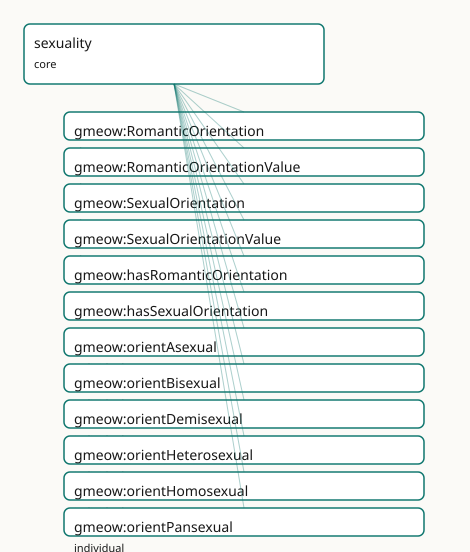

<!-- GENERATED by gmeow ontology-docs. DO NOT EDIT. -->

# GMEOW Sexuality Module

- **IRI:** <https://blackcatinformatics.ca/gmeow/slices/sexuality>
- **Tier:** core
- **[`Group`](../reference/classes/gmeow-Group.md):** core

## What This Slice Covers

This slice owns 24 terms and contributes 19 mapping or projection rows. Use it when its terms match the native fact you want to preserve; use the linkage tables to see how those facts leave GMEOW for consumer vocabularies.

## Dependencies

- [`gmeow:slices/entities`](entities.md)
- [`gmeow:slices/gender`](gender.md)

## Consumers

- Identity facets on persons (P16: core by commitment); the 7-axis orthogonality matrix.

## Local Map



## Examples

### Split Attraction

- **Source:** [`slices/core/sexuality/examples/split-attraction.ttl`](https://github.com/Blackcat-Informatics/gmeow-ontology/blob/main/slices/core/sexuality/examples/split-attraction.ttl)
- **GMEOW terms:** [`gmeow:IdentityFacet`](../reference/classes/gmeow-IdentityFacet.md), [`gmeow:Person`](../reference/classes/gmeow-Person.md), [`gmeow:RomanticOrientation`](../reference/classes/gmeow-RomanticOrientation.md), [`gmeow:SexualOrientation`](../reference/classes/gmeow-SexualOrientation.md), [`gmeow:facetSubject`](../reference/properties/gmeow-facetSubject.md), [`gmeow:facetVantage`](../reference/properties/gmeow-facetVantage.md), [`gmeow:hasRomanticOrientation`](../reference/properties/gmeow-hasRomanticOrientation.md), [`gmeow:hasSexualOrientation`](../reference/properties/gmeow-hasSexualOrientation.md), [`gmeow:name`](../reference/properties/gmeow-name.md), [`gmeow:orientAsexual`](../reference/individuals/gmeow-orientAsexual.md)

```turtle
# SPDX-FileCopyrightText: 2026 Blackcat Informatics® Inc. <paudley@blackcatinformatics.ca>
# SPDX-License-Identifier: CC-BY-4.0
#
# Worked example: the split-attraction model ( P9). Sexual orientation and
# romantic orientation are SEPARATE, mutually independent axes — each a reified,
# self-asserted gmeow:IdentityFacet on the shared base. Because the axes never
# collapse into one another, an asexual-biromantic person is directly expressible:
# asexual sexual attraction AND biromantic romantic attraction, neither inferred
# from the other nor from gender, expression, sex-assigned-at-birth, or address.
# Values are open vocabularies of individuals; both facets are co-equal with no
# preferred orientation, and self-assertion is the top authority.
@prefix gmeow: <https://blackcatinformatics.ca/gmeow/> .
@prefix ex:    <https://blackcatinformatics.ca/gmeow/examples/sexuality/> .

ex:robin a gmeow:Person ;
    gmeow:name "Robin"@en ;
    gmeow:hasSexualOrientation   ex:sexual ;
    gmeow:hasRomanticOrientation ex:romantic .

# A facet is an Observation: gmeow:facetSubject is whose facet it is, and for a
# self-asserted facet the gmeow:facetVantage is the person themselves (P9).

# --- Sexual orientation axis: asexual.
ex:sexual a gmeow:SexualOrientation ;
    gmeow:facetSubject           ex:robin ;
    gmeow:facetVantage           ex:robin ;
    gmeow:sexualOrientationValue gmeow:orientAsexual ;
    gmeow:selfAsserted           true .

# --- Romantic orientation axis: biromantic — independent of the sexual axis.
ex:romantic a gmeow:RomanticOrientation ;
    gmeow:facetSubject             ex:robin ;
    gmeow:facetVantage             ex:robin ;
    gmeow:romanticOrientationValue gmeow:romanticBiromantic ;
    gmeow:selfAsserted             true .
```

## Terms

### Classes

| Term | Label | Definition |
|---|---|---|
| [`gmeow:RomanticOrientation`](../reference/classes/gmeow-RomanticOrientation.md) | Romantic Orientation | A person's SELF-ASSERTED romantic orientation — the pattern of their romantic attraction — as a reified facet pointing (via [`gmeow:romanticOrientationValue`](../reference/properties/gmeow-romanticOrientationValue.md)) to... |
| [`gmeow:RomanticOrientationValue`](../reference/classes/gmeow-RomanticOrientationValue.md) | Romantic Orientation Value | A pattern of romantic attraction — a VALUE pointed at by [`gmeow:romanticOrientationValue`](../reference/properties/gmeow-romanticOrientationValue.md), never a subclass. Kept separate from sexual orientation (split-attract... |
| [`gmeow:SexualOrientation`](../reference/classes/gmeow-SexualOrientation.md) | Sexual Orientation | A person's SELF-ASSERTED sexual orientation — the pattern of their sexual attraction — as a reified facet pointing (via [`gmeow:sexualOrientationValue`](../reference/properties/gmeow-sexualOrientationValue.md)) to an ope... |
| [`gmeow:SexualOrientationValue`](../reference/classes/gmeow-SexualOrientationValue.md) | Sexual Orientation Value | A pattern of sexual attraction — a VALUE pointed at by [`gmeow:sexualOrientationValue`](../reference/properties/gmeow-sexualOrientationValue.md), never a subclass. Open: an orientation not seeded here is a fresh individu... |

### Properties

| Term | Label | Definition |
|---|---|---|
| [`gmeow:hasRomanticOrientation`](../reference/properties/gmeow-hasRomanticOrientation.md) | has romantic orientation | Relates a person to a self-asserted romantic-orientation facet. Non-functional and contextual; a superseded one is kept with [`gmeow:displayable`](../reference/properties/gmeow-displayable.md) false, never del... |
| [`gmeow:hasSexualOrientation`](../reference/properties/gmeow-hasSexualOrientation.md) | has sexual orientation | Relates a person to a self-asserted sexual-orientation facet. Non-functional and contextual; a superseded one is kept with [`gmeow:displayable`](../reference/properties/gmeow-displayable.md) false, never delet... |
| [`gmeow:romanticOrientationValue`](../reference/properties/gmeow-romanticOrientationValue.md) | romantic orientation value | The [`gmeow:RomanticOrientationValue`](../reference/classes/gmeow-RomanticOrientationValue.md) a romantic-orientation facet asserts (functional per facet). A predefined individual or a fresh one with [rdfs:label](http://www.w3.org/2000/01/rdf-schema#label); the sin... |
| [`gmeow:sexualOrientationValue`](../reference/properties/gmeow-sexualOrientationValue.md) | sexual orientation value | The [`gmeow:SexualOrientationValue`](../reference/classes/gmeow-SexualOrientationValue.md) a sexual-orientation facet asserts (functional per facet). A predefined individual or a fresh one with [rdfs:label](http://www.w3.org/2000/01/rdf-schema#label); the single... |

### Individuals

| Term | Label | Definition |
|---|---|---|
| [`gmeow:orientAsexual`](../reference/individuals/gmeow-orientAsexual.md) | asexual | The asexual sexual orientation value — a pattern of sexual attraction that an agent may experience. |
| [`gmeow:orientBisexual`](../reference/individuals/gmeow-orientBisexual.md) | bisexual | The bisexual sexual orientation value — a pattern of sexual attraction that an agent may experience. |
| [`gmeow:orientDemisexual`](../reference/individuals/gmeow-orientDemisexual.md) | demisexual | The demisexual sexual orientation value — a pattern of sexual attraction that an agent may experience. |
| [`gmeow:orientHeterosexual`](../reference/individuals/gmeow-orientHeterosexual.md) | heterosexual | The heterosexual sexual orientation value — a pattern of sexual attraction that an agent may experience. |
| [`gmeow:orientHomosexual`](../reference/individuals/gmeow-orientHomosexual.md) | homosexual / gay / lesbian | The homosexual sexual orientation value — a pattern of sexual attraction that an agent may experience. |
| [`gmeow:orientPansexual`](../reference/individuals/gmeow-orientPansexual.md) | pansexual | The pansexual sexual orientation value — a pattern of sexual attraction that an agent may experience. |
| [`gmeow:orientQueer`](../reference/individuals/gmeow-orientQueer.md) | queer | The queer sexual orientation value — a pattern of sexual attraction that an agent may experience. |
| [`gmeow:orientQuestioning`](../reference/individuals/gmeow-orientQuestioning.md) | questioning | The questioning sexual orientation value — a pattern of sexual attraction that an agent may experience. |
| [`gmeow:romanticAromantic`](../reference/individuals/gmeow-romanticAromantic.md) | aromantic | The aromantic romantic orientation value — a pattern of romantic attraction that an agent may experience. |
| [`gmeow:romanticBiromantic`](../reference/individuals/gmeow-romanticBiromantic.md) | biromantic | The biromantic romantic orientation value — a pattern of romantic attraction that an agent may experience. |
| [`gmeow:romanticDemiromantic`](../reference/individuals/gmeow-romanticDemiromantic.md) | demiromantic | The demiromantic romantic orientation value — a pattern of romantic attraction that an agent may experience. |
| [`gmeow:romanticHeteroromantic`](../reference/individuals/gmeow-romanticHeteroromantic.md) | heteroromantic | The heteroromantic romantic orientation value — a pattern of romantic attraction that an agent may experience. |
| [`gmeow:romanticHomoromantic`](../reference/individuals/gmeow-romanticHomoromantic.md) | homoromantic | The homoromantic romantic orientation value — a pattern of romantic attraction that an agent may experience. |
| [`gmeow:romanticPanromantic`](../reference/individuals/gmeow-romanticPanromantic.md) | panromantic | The panromantic romantic orientation value — a pattern of romantic attraction that an agent may experience. |
| [`gmeow:romanticQueerromantic`](../reference/individuals/gmeow-romanticQueerromantic.md) | queerplatonic / queer-romantic | The queerromantic romantic orientation value — a pattern of romantic attraction that an agent may experience. |
| [`gmeow:romanticQuestioning`](../reference/individuals/gmeow-romanticQuestioning.md) | questioning | The questioning romantic orientation value — a pattern of romantic attraction that an agent may experience. |

## Linkages

- **Rows:** 19
- **Projection profiles:** -
- **External vocabularies:** `gsso`, `homosaurus`, `wd`, `wdt`

| Source | Kind | Profile | Predicate/Relation | Target | Evidence |
|---|---|---|---|---|---|
| [`gmeow:orientAsexual`](../reference/individuals/gmeow-orientAsexual.md) | equivalence | `-` | [skos:closeMatch](http://www.w3.org/2004/02/skos/core#closeMatch) | [homosaurus:homoit0000004](https://homosaurus.org/v4/homoit0000004) | `gmeow-sexuality.sssom.tsv`; `gmeow:eqSexuality014`; confidence 0.9 |
| [`gmeow:orientAsexual`](../reference/individuals/gmeow-orientAsexual.md) | equivalence | `-` | [skos:closeMatch](http://www.w3.org/2004/02/skos/core#closeMatch) | [wd:Q724351](https://www.wikidata.org/wiki/Q724351) | `gmeow-sexuality.sssom.tsv`; `gmeow:eqSexuality013`; confidence 0.9 |
| [`gmeow:orientBisexual`](../reference/individuals/gmeow-orientBisexual.md) | equivalence | `-` | [skos:closeMatch](http://www.w3.org/2004/02/skos/core#closeMatch) | gsso:001590 | `gmeow-sexuality.sssom.tsv`; `gmeow:eqSexuality009`; confidence 0.85 |
| [`gmeow:orientBisexual`](../reference/individuals/gmeow-orientBisexual.md) | equivalence | `-` | [skos:closeMatch](http://www.w3.org/2004/02/skos/core#closeMatch) | [homosaurus:homoit0000170](https://homosaurus.org/v4/homoit0000170) | `gmeow-sexuality.sssom.tsv`; `gmeow:eqSexuality008`; confidence 0.85 |
| [`gmeow:orientBisexual`](../reference/individuals/gmeow-orientBisexual.md) | equivalence | `-` | [skos:closeMatch](http://www.w3.org/2004/02/skos/core#closeMatch) | [wd:Q43200](https://www.wikidata.org/wiki/Q43200) | `gmeow-sexuality.sssom.tsv`; `gmeow:eqSexuality007`; confidence 0.9 |
| [`gmeow:orientDemisexual`](../reference/individuals/gmeow-orientDemisexual.md) | equivalence | `-` | [skos:closeMatch](http://www.w3.org/2004/02/skos/core#closeMatch) | [homosaurus:homoit0000343](https://homosaurus.org/v4/homoit0000343) | `gmeow-sexuality.sssom.tsv`; `gmeow:eqSexuality016`; confidence 0.9 |
| [`gmeow:orientDemisexual`](../reference/individuals/gmeow-orientDemisexual.md) | equivalence | `-` | [skos:closeMatch](http://www.w3.org/2004/02/skos/core#closeMatch) | [wd:Q23912283](https://www.wikidata.org/wiki/Q23912283) | `gmeow-sexuality.sssom.tsv`; `gmeow:eqSexuality015`; confidence 0.9 |
| [`gmeow:orientHeterosexual`](../reference/individuals/gmeow-orientHeterosexual.md) | equivalence | `-` | [skos:closeMatch](http://www.w3.org/2004/02/skos/core#closeMatch) | gsso:001592 | `gmeow-sexuality.sssom.tsv`; `gmeow:eqSexuality004`; confidence 0.85 |
| [`gmeow:orientHeterosexual`](../reference/individuals/gmeow-orientHeterosexual.md) | equivalence | `-` | [skos:closeMatch](http://www.w3.org/2004/02/skos/core#closeMatch) | [homosaurus:homoit0000631](https://homosaurus.org/v4/homoit0000631) | `gmeow-sexuality.sssom.tsv`; `gmeow:eqSexuality003`; confidence 0.85 |
| [`gmeow:orientHeterosexual`](../reference/individuals/gmeow-orientHeterosexual.md) | equivalence | `-` | [skos:closeMatch](http://www.w3.org/2004/02/skos/core#closeMatch) | [wd:Q1035954](https://www.wikidata.org/wiki/Q1035954) | `gmeow-sexuality.sssom.tsv`; `gmeow:eqSexuality002`; confidence 0.85 |
| [`gmeow:orientHomosexual`](../reference/individuals/gmeow-orientHomosexual.md) | equivalence | `-` | [skos:closeMatch](http://www.w3.org/2004/02/skos/core#closeMatch) | [homosaurus:homoit0000647](https://homosaurus.org/v4/homoit0000647) | `gmeow-sexuality.sssom.tsv`; `gmeow:eqSexuality006`; confidence 0.85 |
| [`gmeow:orientHomosexual`](../reference/individuals/gmeow-orientHomosexual.md) | equivalence | `-` | [skos:closeMatch](http://www.w3.org/2004/02/skos/core#closeMatch) | [wd:Q6636](https://www.wikidata.org/wiki/Q6636) | `gmeow-sexuality.sssom.tsv`; `gmeow:eqSexuality005`; confidence 0.85 |
| [`gmeow:orientPansexual`](../reference/individuals/gmeow-orientPansexual.md) | equivalence | `-` | [skos:closeMatch](http://www.w3.org/2004/02/skos/core#closeMatch) | gsso:001593 | `gmeow-sexuality.sssom.tsv`; `gmeow:eqSexuality012`; confidence 0.85 |
| [`gmeow:orientPansexual`](../reference/individuals/gmeow-orientPansexual.md) | equivalence | `-` | [skos:closeMatch](http://www.w3.org/2004/02/skos/core#closeMatch) | [homosaurus:homoit0001073](https://homosaurus.org/v4/homoit0001073) | `gmeow-sexuality.sssom.tsv`; `gmeow:eqSexuality011`; confidence 0.85 |
| [`gmeow:orientPansexual`](../reference/individuals/gmeow-orientPansexual.md) | equivalence | `-` | [skos:closeMatch](http://www.w3.org/2004/02/skos/core#closeMatch) | [wd:Q271534](https://www.wikidata.org/wiki/Q271534) | `gmeow-sexuality.sssom.tsv`; `gmeow:eqSexuality010`; confidence 0.9 |
| [`gmeow:orientQueer`](../reference/individuals/gmeow-orientQueer.md) | equivalence | `-` | [skos:closeMatch](http://www.w3.org/2004/02/skos/core#closeMatch) | [homosaurus:homoit0001195](https://homosaurus.org/v4/homoit0001195) | `gmeow-sexuality.sssom.tsv`; `gmeow:eqSexuality018`; confidence 0.8 |
| [`gmeow:orientQueer`](../reference/individuals/gmeow-orientQueer.md) | equivalence | `-` | [skos:closeMatch](http://www.w3.org/2004/02/skos/core#closeMatch) | [wd:Q51415](https://www.wikidata.org/wiki/Q51415) | `gmeow-sexuality.sssom.tsv`; `gmeow:eqSexuality017`; confidence 0.85 |
| [`gmeow:romanticAromantic`](../reference/individuals/gmeow-romanticAromantic.md) | equivalence | `-` | [skos:closeMatch](http://www.w3.org/2004/02/skos/core#closeMatch) | [homosaurus:homoit0001644](https://homosaurus.org/v4/homoit0001644) | `gmeow-sexuality.sssom.tsv`; `gmeow:eqSexuality019`; confidence 0.9 |
| [`gmeow:sexualOrientationValue`](../reference/properties/gmeow-sexualOrientationValue.md) | equivalence | `-` | [skos:closeMatch](http://www.w3.org/2004/02/skos/core#closeMatch) | [wdt:P91](https://www.wikidata.org/wiki/Property:P91) | `gmeow-sexuality.sssom.tsv`; `gmeow:eqSexuality001`; confidence 0.8 |

## Guide

<!-- SPDX-FileCopyrightText: 2026 Blackcat Informatics® Inc. <paudley@blackcatinformatics.ca> -->
<!-- SPDX-License-Identifier: CC-BY-4.0 -->

# Sexuality — split-attraction orientation on the shared facet base

> **Slice:** `https://blackcatinformatics.ca/gmeow/slices/sexuality` · **tier: core**
> Sexual and romantic orientation as two separate, self-asserted, co-equal identity axes.

Where most models offer one `sexualOrientation` slot (if they offer anything), GMEOW applies
the **split-attraction model**: sexual orientation and romantic orientation are *separate,
mutually independent axes*, each a reified self-asserted facet on the gender slice's
[`gmeow:IdentityFacet`](../reference/classes/gmeow-IdentityFacet.md) base. Asexual-biromantic, aromantic-bisexual, and every other
combination are directly expressible because the axes never collapse into each other — and
neither is ever inferred from gender identity, gender expression, sex-assigned-at-birth,
pronouns, or honorifics. These two axes complete the **seven-axis orthogonality matrix**
(with gender's three and names' two), whose pairwise disjointness is a reasoner theorem
asserted in the gender module (relator-mediation doctrine) and whose bridge-absence is a closed-world lint
(`tests/test_identity_orthogonality.py`).

The governing tenets are exactly gender's, because the base is shared ([Principle 9](https://github.com/Blackcat-Informatics/gmeow-ontology/blob/main/CONSTITUTION.md#principle-9)):
**self-assertion is the top authority** ([`gmeow:selfAsserted`](../reference/properties/gmeow-selfAsserted.md)); facets are **co-equal** with
deliberately no preferred/primary orientation term; value spaces are **open vocabularies of
individuals**, never per-value subclasses, never a forced enum — inclusive without
overtyping. A superseded label is kept with [`gmeow:displayable`](../reference/properties/gmeow-displayable.md) false, **suppressed, never
erased** ([Principle 10](https://github.com/Blackcat-Informatics/gmeow-ontology/blob/main/CONSTITUTION.md#principle-10)). And like all identity slices, this one is **core by commitment**
([Principle 16](https://github.com/Blackcat-Informatics/gmeow-ontology/blob/main/CONSTITUTION.md#principle-16)): orientation modelling is not an opt-in extension.

## The two axes

### [`gmeow:SexualOrientation`](../reference/classes/gmeow-SexualOrientation.md)

A person's self-asserted pattern of *sexual* attraction, as a reified facet (a
[`gufo:Relator`](../external/terms.md#gufo-relator) and [`gmeow:Observation`](../reference/classes/gmeow-Observation.md), inheriting [`facetSubject`](../reference/properties/gmeow-facetSubject.md)/[`facetVantage`](../reference/properties/gmeow-facetVantage.md), the
validity clocks, and `displayable` from [`IdentityFacet`](../reference/classes/gmeow-IdentityFacet.md)). A separate axis from romantic
orientation and from every gender axis; nothing infers one from another.

### [`gmeow:hasSexualOrientation`](../reference/properties/gmeow-hasSexualOrientation.md)

The bearer property, [`Person`](../reference/classes/gmeow-Person.md) → facet. Non-functional and contextual: identities shift, and
multiple co-equal facets coexist — a superseded one is suppressed, never deleted. MUST NOT
be inferred from [`hasRomanticOrientation`](../reference/properties/gmeow-hasRomanticOrientation.md), [`hasGenderIdentity`](../reference/properties/gmeow-hasGenderIdentity.md), [`sexAssignedAtBirth`](../reference/properties/gmeow-sexAssignedAtBirth.md),
pronouns, or honorifics.

### [`gmeow:sexualOrientationValue`](../reference/properties/gmeow-sexualOrientationValue.md)

Functional **per facet** — one value each; multiplicity is expressed by more facets. The
**single path** to the value (no flat-literal shortcut exists, deliberately): a seeded
individual, or a fresh [`SexualOrientationValue`](../reference/classes/gmeow-SexualOrientationValue.md) individual with [`rdfs:label`](http://www.w3.org/2000/01/rdf-schema#label) when none fits.

### [`gmeow:RomanticOrientation`](../reference/classes/gmeow-RomanticOrientation.md)

A person's self-asserted pattern of *romantic* attraction — the other half of the
split-attraction model, structurally a twin of [`SexualOrientation`](../reference/classes/gmeow-SexualOrientation.md) but a fully independent
axis: asexual yet biromantic is two facets on two axes, no tension, no inference.

### [`gmeow:hasRomanticOrientation`](../reference/properties/gmeow-hasRomanticOrientation.md)

The romantic bearer property; same contract as its sexual sibling — non-functional,
contextual, suppression-not-deletion, and no inferential bridge to any other axis.

### [`gmeow:romanticOrientationValue`](../reference/properties/gmeow-romanticOrientationValue.md)

Functional per facet; the single path to an open [`RomanticOrientationValue`](../reference/classes/gmeow-RomanticOrientationValue.md).

## The value vocabularies

### [`gmeow:SexualOrientationValue`](../reference/classes/gmeow-SexualOrientationValue.md) · [`gmeow:RomanticOrientationValue`](../reference/classes/gmeow-RomanticOrientationValue.md)

Two **separate** open vocabularies under [`gufo:QualityValue`](../external/terms.md#gufo-qualityvalue), kept apart so the
split-attraction distinction is explicit in the data (asexual ≠ aromantic — they are
different individuals in different value spaces, and the spaces are disjoint by the matrix
axioms). Seeds: heterosexual / homosexual / bisexual / pansexual / asexual / demisexual /
queer / questioning, and their romantic counterparts plus queerplatonic. The seeds are
**anchors, not a fence**: mint a fresh individual with [`rdfs:label`](http://www.w3.org/2000/01/rdf-schema#label) for anything unseeded —
never a flat string, never a new subclass.

```turtle
ex:sam a gmeow:Person ;
    gmeow:hasSexualOrientation ex:samSexual ;
    gmeow:hasRomanticOrientation ex:samRomantic .

ex:samSexual a gmeow:SexualOrientation ;        # asexual …
    gmeow:sexualOrientationValue gmeow:orientAsexual ;
    gmeow:selfAsserted true .

ex:samRomantic a gmeow:RomanticOrientation ;    # … and biromantic, independently
    gmeow:romanticOrientationValue gmeow:romanticBiromantic ;
    gmeow:selfAsserted true .
```

The relator-mediation existentials (`someValuesFrom` the value classes) live here in EL form
for the reasoner; the closed-world "exactly one value per facet" is deliberately SHACL's job
(SHACL closure gate), keeping the logic small and decidable ([Principle 12](https://github.com/Blackcat-Informatics/gmeow-ontology/blob/main/CONSTITUTION.md#principle-12)'s boundary discipline).

## Alignment — and an honest lossy drop

GSSO, Homosaurus, and Wikidata alignments live in `mappings/gmeow-sexuality.sssom.tsv`.
schema.org and FOAF have **no orientation term at all**, so at the projection layer
orientation is a *documented lossy drop* ([Principle 4](https://github.com/Blackcat-Informatics/gmeow-ontology/blob/main/CONSTITUTION.md#principle-4)): the projection records what it
cannot carry rather than flattening it into a string somewhere it doesn't belong. The
reified, self-asserted, co-equal, split-attraction machinery is canonical and exists only
here ([Principle 5](https://github.com/Blackcat-Informatics/gmeow-ontology/blob/main/CONSTITUTION.md#principle-5): superset by reference, never dumbed down at the source).

## Dependencies

Depends on `entities` and `gender` (the [`IdentityFacet`](../reference/classes/gmeow-IdentityFacet.md) base, [`selfAsserted`](../reference/properties/gmeow-selfAsserted.md), and the matrix
axioms). Consumed wherever persons are: identity facets are core by commitment
([Principle 16](https://github.com/Blackcat-Informatics/gmeow-ontology/blob/main/CONSTITUTION.md#principle-16)), and the gender slice's matrix axioms reference these classes by name.
