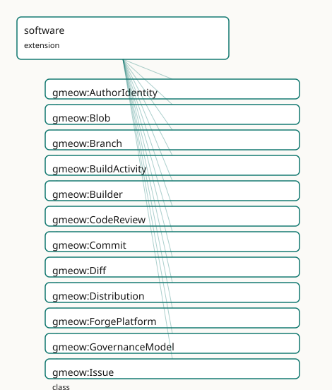

<!-- GENERATED by gmeow ontology-docs. DO NOT EDIT. -->

# GMEOW Software Module

- **IRI:** <https://blackcatinformatics.ca/gmeow/slices/software>
- **Tier:** extension
- **[`Group`](../reference/classes/gmeow-Group.md):** extensions

## What This Slice Covers

This slice owns 106 terms and contributes 99 mapping or projection rows. Use it when its terms match the native fact you want to preserve; use the linkage tables to see how those facts leave GMEOW for consumer vocabularies.

## Dependencies

- [`gmeow:slices/attestation`](attestation.md)
- [`gmeow:slices/creative-works`](creative-works.md)
- [`gmeow:slices/entities`](entities.md)
- [`gmeow:slices/events`](events.md)
- [`gmeow:slices/kernel`](kernel.md)
- [`gmeow:slices/language`](language.md)
- [`gmeow:slices/names`](names.md)
- [`gmeow:slices/provenance`](provenance.md)
- [`gmeow:slices/rights`](rights.md)
- [`gmeow:slices/tags`](tags.md)

## Consumers

- The five-facet software model: git-as-provenance, verifiable releases, this repo itself.

## Local Map

## Terms

### Classes

| Term | Label | Definition |
|---|---|---|
| [`gmeow:AuthorIdentity`](../reference/classes/gmeow-AuthorIdentity.md) | Author Identity | A recorded author or committer string in a version-control commit — the raw git bytes (Name <email>). This is the immutable historical assertion, independent o... |
| [`gmeow:Blob`](../reference/classes/gmeow-Blob.md) | Blob | A content-addressed blob of raw file content — the leaf of a Merkle source tree, independent of filename or path. Aligned to git blob objects and Software Heri... |
| [`gmeow:Branch`](../reference/classes/gmeow-Branch.md) | Branch | A mutable pointer to a line of development in a repository — a named reference that advances as new commits are added. An InformationObject, not an Event or En... |
| [`gmeow:BuildActivity`](../reference/classes/gmeow-BuildActivity.md) | Build Activity | A software build process that transforms source code into one or more distribution artifacts. The build activity consumes a commit or repository and produces a... |
| [`gmeow:Builder`](../reference/classes/gmeow-Builder.md) | Builder | The build system or agent that performs a BuildActivity — e.g. GitHub Actions, GitLab CI, Jenkins, Buildkite, or a local make invocation. A SoftwareAgent scope... |
| [`gmeow:CodeReview`](../reference/classes/gmeow-CodeReview.md) | Code Review | The event of reviewing code changes for quality, correctness, and policy compliance — an event (not an Activity, because reviewing is observation-like) with a... |
| [`gmeow:Commit`](../reference/classes/gmeow-Commit.md) | Commit | A version-control commit — a content-addressed provenance event that records a change to a repository's history. The history facet of the five-facet model; dis... |
| [`gmeow:Diff`](../reference/classes/gmeow-Diff.md) | Diff | A patch or diff — an information object describing the changes between two commits (or two trees). Carries textual diff content and references the from- and to... |
| [`gmeow:Distribution`](../reference/classes/gmeow-Distribution.md) | Distribution | A concrete distribution artifact of a software product — a tarball, wheel, binary, container image, or installer. The physical/bits facet of the release; ident... |
| [`gmeow:ForgePlatform`](../reference/classes/gmeow-ForgePlatform.md) | Forge Platform | A software forge or hosting platform — GitHub, GitLab, SourceHut, Codeberg, Gitea, etc. The platform as an entity, not any particular account or repository on... |
| [`gmeow:GovernanceModel`](../reference/classes/gmeow-GovernanceModel.md) | Governance Model | The governance model of a project — a VALUE vocabulary (individuals, never subclasses). Describes how decisions are made and who has authority. |
| [`gmeow:Issue`](../reference/classes/gmeow-Issue.md) | Issue | A tracked issue, ticket, or bug report in a software project — an InformationObject that may carry title, body, labels, and state. The event of its creation/cl... |
| [`gmeow:MaintenanceStatus`](../reference/classes/gmeow-MaintenanceStatus.md) | Maintenance Status | The maintenance status of a software project — a VALUE vocabulary (individuals, never subclasses). Answers the question 'is this maintained?' Standpoint-scoped... |
| [`gmeow:Merge`](../reference/classes/gmeow-Merge.md) | Merge | The event of merging one branch of development into another — an activity with a merge-base commit, a source branch or ref, a target branch, and a resulting me... |
| [`gmeow:MergeRequest`](../reference/classes/gmeow-MergeRequest.md) | Merge Request | A proposed merge of one branch into another — an InformationObject carrying title, description, source branch, target branch, and review state. Aligned to GitH... |
| [`gmeow:Package`](../reference/classes/gmeow-Package.md) | Package | A distributable software package — a named, versioned unit of software published through a package ecosystem (npm, PyPI, Cargo, Maven, etc.). The package descr... |
| [`gmeow:Project`](../reference/classes/gmeow-Project.md) | Project | A social object representing an endeavour — an activity with purpose, participants, and duration, independent of any product, repository, or codebase. A projec... |
| [`gmeow:Push`](../reference/classes/gmeow-Push.md) | Push | The event of pushing one or more commits to a remote repository — an activity with a target repository or ref, a pusher, and a timestamp. The event type is gme... |
| [`gmeow:Ref`](../reference/classes/gmeow-Ref.md) | Ref | A version-control reference — the generic superclass of Branch and any other named pointer into the commit graph. |
| [`gmeow:Release`](../reference/classes/gmeow-Release.md) | Release | A software release — an event that produces a versioned software product, typically associated with a tag, a DOI, and one or more distribution artifacts. The e... |
| [`gmeow:Repository`](../reference/classes/gmeow-Repository.md) | Repository | A version-control repository — the location/hosting facet of a software project. Holds source code history, branches, tags, and refs. Distinct from the project... |
| [`gmeow:RepositoryType`](../reference/classes/gmeow-RepositoryType.md) | Repository Type | The version-control system of a repository — a VALUE vocabulary (individuals, never subclasses). The set is open; a new VCS is a fresh individual, not a new cl... |
| [`gmeow:Review`](../reference/classes/gmeow-Review.md) | Review | A code review or peer review of a merge request or commit — an InformationObject carrying review text, approval state, and requested changes. The reviewing act... |
| [`gmeow:SLSALevel`](../reference/classes/gmeow-SLSALevel.md) | SLSA Level | The SLSA supply-chain level for build provenance — a VALUE vocabulary (individuals, never subclasses). Levels 1–4 correspond to the SLSA specification's increm... |
| [`gmeow:SoftwareName`](../reference/classes/gmeow-SoftwareName.md) | Software Name | An appellation borne by a software project or product — a project name, product name, codename, or package name. Carries its own [`gmeow:nameLanguage`](../reference/properties/gmeow-nameLanguage.md) and gmeow:n... |
| [`gmeow:SoftwareProduct`](../reference/classes/gmeow-SoftwareProduct.md) | Software Product | A software work as an intellectual creation — the design, functionality, and behaviour of a program, library, or application, independent of any particular sou... |
| [`gmeow:SoftwareProject`](../reference/classes/gmeow-SoftwareProject.md) | Software Project | A project whose endeavour is the collaborative development of software. The social object facet only — distinct from the software product, the source codebase,... |
| [`gmeow:SourceDirectory`](../reference/classes/gmeow-SourceDirectory.md) | Source Directory | A content-addressed subdirectory within a source tree — a named container of files and nested directories. A specialization of [`gmeow:SourceTree`](../reference/classes/gmeow-SourceTree.md) for nested stru... |
| [`gmeow:SourceFile`](../reference/classes/gmeow-SourceFile.md) | Source File | A content-addressed source file — a named blob of text or binary content within a source tree. Aligned to Software Heritage Content and git blob objects by ref... |
| [`gmeow:SourceNode`](../reference/classes/gmeow-SourceNode.md) | Source Node | A content-addressed node in a source graph — the common kind for all objects that participate in a versioned source tree (files, directories, and recursive tre... |
| [`gmeow:SourceTree`](../reference/classes/gmeow-SourceTree.md) | Source Tree | A content-addressed directory tree of source code — the recursive Merkle structure that represents a snapshot of a project's files and subdirectories at a poin... |
| [`gmeow:TreeEntry`](../reference/classes/gmeow-TreeEntry.md) | Tree Entry | A named pointer within a source tree — a file or directory entry carrying a name, a file mode, and a reference to a Blob or SourceTree. Corresponds to a single... |

### Properties

| Term | Label | Definition |
|---|---|---|
| [`gmeow:authorIdentityString`](../reference/properties/gmeow-authorIdentityString.md) | author identity string | The raw author or committer bytes as they appeared in the commit object, typically 'Name <email>'. |
| [`gmeow:authorTime`](../reference/properties/gmeow-authorTime.md) | author time | The timestamp at which the author created the patch ([xsd:dateTime](http://www.w3.org/2001/XMLSchema#dateTime)). Distinct from committer-time and push-time (the four-clocks pattern, temporal module). |
| [`gmeow:authoredBy`](../reference/properties/gmeow-authoredBy.md) | authored by | The agent who authored the changes in a commit — the creative origin of the patch. Distinct from the committer (who applied the commit to the repository). Auth... |
| [`gmeow:bugDatabase`](../reference/properties/gmeow-bugDatabase.md) | bug database | The issue/bug tracker of a software project — the [doap:bug-database.](http://usefulinc.com/ns/doap#bug-database.) Non-functional: a project may track issues in several places. Range open (an IRI). |
| [`gmeow:buildConfigUri`](../reference/properties/gmeow-buildConfigUri.md) | build config URI | The URI of the build configuration or workflow file that describes the build process — e.g. the URL of `.github/workflows/release.yml` or a Jenkinsfile. |
| [`gmeow:buildOutput`](../reference/properties/gmeow-buildOutput.md) | build output | The distribution artifact produced by a build activity. Non-functional: a build may produce multiple artifacts (tarball, wheel, binary, container image). |
| [`gmeow:buildSource`](../reference/properties/gmeow-buildSource.md) | build source | The source commit or repository that a build activity consumes. Non-functional: a build may consume multiple commits (monorepo) or a repository at a specific r... |
| [`gmeow:canonicalizedIdentity`](../reference/properties/gmeow-canonicalizedIdentity.md) | canonicalized identity | The current self-asserted agent to which a historical AuthorIdentity is understood to refer. Old and new identities coexist as co-equal standpoints, never merg... |
| [`gmeow:cloneUrl`](../reference/properties/gmeow-cloneUrl.md) | clone URL | A URL from which the repository can be cloned. Non-functional: multiple protocols (https, ssh, git) may be available. |
| [`gmeow:commitAncestor`](../reference/properties/gmeow-commitAncestor.md) | commit ancestor | The transitive closure of parentCommit — any ancestor commit in the DAG. Transitive, non-simple: kept out of all cardinality / functional axioms to preserve OW... |
| [`gmeow:commitAuthorIdentity`](../reference/properties/gmeow-commitAuthorIdentity.md) | commit author identity | The recorded author identity of a commit — the raw historical bytes. Distinct from [`gmeow:authoredBy`](../reference/properties/gmeow-authoredBy.md), which points to the canonical agent currently understood t... |
| [`gmeow:commitCommitterIdentity`](../reference/properties/gmeow-commitCommitterIdentity.md) | commit committer identity | The recorded committer identity of a commit — the raw historical bytes. Distinct from [`gmeow:committedBy`](../reference/properties/gmeow-committedBy.md), which points to the canonical agent currently understo... |
| [`gmeow:commitDescendant`](../reference/properties/gmeow-commitDescendant.md) | commit descendant | The transitive closure of the inverse of parentCommit — any descendant commit in the DAG. Transitive, non-simple: kept out of all cardinality / functional axio... |
| [`gmeow:commitInRepository`](../reference/properties/gmeow-commitInRepository.md) | commit in repository | The repository in which a commit occurred. Functional: a commit belongs to exactly one repository (forks are separate repositories with their own history). |
| [`gmeow:commitTree`](../reference/properties/gmeow-commitTree.md) | commit tree | The source tree (directory snapshot) that a commit records. Functional: a commit points to exactly one tree. |
| [`gmeow:committedBy`](../reference/properties/gmeow-committedBy.md) | committed by | The agent who committed the changes to the repository — the person or process that created the commit object. Distinct from the author (who wrote the patch). |
| [`gmeow:committerTime`](../reference/properties/gmeow-committerTime.md) | committer time | The timestamp at which the committer created the commit object ([xsd:dateTime](http://www.w3.org/2001/XMLSchema#dateTime)). Distinct from author-time and push-time. |
| [`gmeow:diffFrom`](../reference/properties/gmeow-diffFrom.md) | diff from | The base commit of a diff — the 'before' state. Functional: a diff has exactly one base commit. |
| [`gmeow:diffTo`](../reference/properties/gmeow-diffTo.md) | diff to | The target commit of a diff — the 'after' state. Functional: a diff has exactly one target commit. |
| [`gmeow:distributionFormat`](../reference/properties/gmeow-distributionFormat.md) | distribution format | The format of a distribution artifact — e.g. 'tar.gz', 'wheel', 'docker-image', 'exe'. |
| [`gmeow:downloadPage`](../reference/properties/gmeow-downloadPage.md) | download page | The download page of a software project — the [doap:download-page.](http://usefulinc.com/ns/doap#download-page.) Non-functional. Range open (an IRI). |
| [`gmeow:governanceModel`](../reference/properties/gmeow-governanceModel.md) | governance model | The governance model of a project — a value from the open [`gmeow:GovernanceModel`](../reference/classes/gmeow-GovernanceModel.md) vocabulary (BDFL, foundation, meritocracy, DAO, …). Non-functional: a project m... |
| [`gmeow:hasDistribution`](../reference/properties/gmeow-hasDistribution.md) | has distribution | Relates a package to one of its concrete distribution artifacts. Non-functional: a package may have multiple distributions (tarball, wheel, binary, container). |
| [`gmeow:hasRelease`](../reference/properties/gmeow-hasRelease.md) | has release | Relates a project to one of its releases. Non-functional: a project has many releases over time. |
| [`gmeow:hasRepository`](../reference/properties/gmeow-hasRepository.md) | has repository | Relates a project to a version-control repository that hosts its codebase. Non-functional: a project may have several repositories (monorepo, mirrors, forks). |
| [`gmeow:hasSLSALevel`](../reference/properties/gmeow-hasSLSALevel.md) | has SLSA level | The SLSA supply-chain integrity level (1–4) asserted by an attestation. Non-functional: competing assessments from different verifiers coexist ([Principle 9](https://github.com/Blackcat-Informatics/gmeow-ontology/blob/main/CONSTITUTION.md#principle-9)). |
| [`gmeow:hasSoftwareName`](../reference/properties/gmeow-hasSoftwareName.md) | has software name | Relates a project or product to a structured [`gmeow:SoftwareName`](../reference/classes/gmeow-SoftwareName.md) it bears; the software-scoped specialization of [`gmeow:hasAppellation`](../reference/properties/gmeow-hasAppellation.md). Non-functional — a projec... |
| [`gmeow:hostedAt`](../reference/properties/gmeow-hostedAt.md) | hosted at | The forge or hosting platform where a repository is hosted. Non-functional: a repository may be mirrored on multiple platforms. |
| [`gmeow:mailmapEntry`](../reference/properties/gmeow-mailmapEntry.md) | mailmap entry | The canonical.mailmap line for an agent — typically 'Canonical Name <canonical@example.com>'. This is the source value from which the.mailmap projection is g... |
| [`gmeow:maintenanceStatus`](../reference/properties/gmeow-maintenanceStatus.md) | maintenance status | The maintenance status of a project — a value from the open [`gmeow:MaintenanceStatus`](../reference/classes/gmeow-MaintenanceStatus.md) vocabulary. Non-functional: competing assessments coexist ([Principle 9](https://github.com/Blackcat-Informatics/gmeow-ontology/blob/main/CONSTITUTION.md#principle-9)). |
| [`gmeow:materializationDepth`](../reference/properties/gmeow-materializationDepth.md) | materialization depth | The number of levels of Merkle tree to materialise as triples for this repository. 0 = no tree materialisation (commits and refs only); 1 = root tree only; 2 =... |
| [`gmeow:mergeBase`](../reference/properties/gmeow-mergeBase.md) | merge base | The common ancestor commit from which a merge operation derives — the best common ancestor of the source and target branches. Non-functional: in complex merge... |
| [`gmeow:mergeSource`](../reference/properties/gmeow-mergeSource.md) | merge source | The source ref (branch or tag) being merged in a merge event. Non-functional: octopus merges may have multiple sources. |
| [`gmeow:mergeTarget`](../reference/properties/gmeow-mergeTarget.md) | merge target | The target ref (branch or tag) into which a merge event merges the source. Functional: a merge has exactly one target ref. |
| [`gmeow:packageOf`](../reference/properties/gmeow-packageOf.md) | package of | Relates a package to the software product it distributes. |
| [`gmeow:parentCommit`](../reference/properties/gmeow-parentCommit.md) | parent commit | A parent commit from which this commit was derived — the provenance spine of the commit DAG. Non-functional: a merge commit has multiple parents; the initial c... |
| [`gmeow:pointsToCommit`](../reference/properties/gmeow-pointsToCommit.md) | points to commit | The commit that a ref (branch, tag, or other pointer) currently points to. Non-functional: a ref may point to one commit at a time, but that commit changes as... |
| [`gmeow:programmingLanguage`](../reference/properties/gmeow-programmingLanguage.md) | programming language | A programming language a software project is implemented in — a [`gmeow:Language`](../reference/classes/gmeow-Language.md) (the language slice's ProgrammingLanguage). Non-functional: a project uses sever... |
| [`gmeow:projectHomepage`](../reference/properties/gmeow-projectHomepage.md) | project homepage | The homepage of a project — the [doap:homepage](http://usefulinc.com/ns/doap#homepage) / [schema:url](https://schema.org/url) of a software project. Functional; range open (an IRI). |
| [`gmeow:projectIdentifier`](../reference/properties/gmeow-projectIdentifier.md) | project identifier | An identifier for a project as an activity — typically a RAiD (ISO 23527). Distinct from product/release identifiers (DOI, ISO 26324). Non-functional: a projec... |
| [`gmeow:projectLicense`](../reference/properties/gmeow-projectLicense.md) | project license | The license under which a project releases its software. Non-functional: dual-licensing and license transitions over time are valid. |
| [`gmeow:pushTarget`](../reference/properties/gmeow-pushTarget.md) | push target | The repository or ref that a push event targets. Non-functional: a single push operation may target multiple refs in the same repository. |
| [`gmeow:releaseDoi`](../reference/properties/gmeow-releaseDoi.md) | release DOI | The Digital Object Identifier (DOI) assigned to a software release — typically minted through DataCite, Zenodo, or a similar PID registry. Non-functional: a re... |
| [`gmeow:releaseOf`](../reference/properties/gmeow-releaseOf.md) | release of | The project that a release belongs to. Functional: one project per release event. |
| [`gmeow:releaseTag`](../reference/properties/gmeow-releaseTag.md) | release tag | The tag associated with a release. Functional: a release is typically cut from exactly one tag. |
| [`gmeow:releaseVersion`](../reference/properties/gmeow-releaseVersion.md) | release version | The version designation of a release — e.g. 'v1.0.0', '2.1.0-beta.3'. Not functional: competing version schemes may coexist ([Principle 9](https://github.com/Blackcat-Informatics/gmeow-ontology/blob/main/CONSTITUTION.md#principle-9)). |
| [`gmeow:repositoryType`](../reference/properties/gmeow-repositoryType.md) | repository type | The version-control system of a repository — a value from the open [`gmeow:RepositoryType`](../reference/classes/gmeow-RepositoryType.md) vocabulary (git, hg, svn, fossil, …). Functional: a repository has exac... |
| [`gmeow:reviewCommit`](../reference/properties/gmeow-reviewCommit.md) | review commit | The specific commit under review in a code review event. Non-functional: a review may span multiple commits. |
| [`gmeow:reviewOf`](../reference/properties/gmeow-reviewOf.md) | review of | The merge request that a code review event is about. Non-functional: a review event may cover multiple related merge requests. |
| [`gmeow:treeEntryMode`](../reference/properties/gmeow-treeEntryMode.md) | tree entry mode | The git file mode of a tree entry — e.g. '100644' (regular file), '100755' (executable), '040000' (directory), '160000' (submodule), '120000' (symlink). Functi... |
| [`gmeow:treeEntryName`](../reference/properties/gmeow-treeEntryName.md) | tree entry name | The file or directory name of a tree entry — e.g. 'README.md', 'src'. Functional: one name per entry. |
| [`gmeow:treeEntryObject`](../reference/properties/gmeow-treeEntryObject.md) | tree entry object | The content-addressed object (Blob or SourceTree) that a tree entry points to. Functional: one object per entry. |
| [`gmeow:webUrl`](../reference/properties/gmeow-webUrl.md) | web URL | The human-readable web URL of the repository (e.g. the GitHub project page). |

### Individuals

| Term | Label | Definition |
|---|---|---|
| [`gmeow:eventTypeBuild`](../reference/individuals/gmeow-eventTypeBuild.md) | build | The event of building software from source into distribution artifacts. |
| [`gmeow:governanceBDFL`](../reference/individuals/gmeow-governanceBDFL.md) | BDFL | Benevolent dictator for life — a single individual has final decision authority. |
| [`gmeow:governanceCorporate`](../reference/individuals/gmeow-governanceCorporate.md) | corporate | Governed by a single company or corporate sponsor. |
| [`gmeow:governanceDAO`](../reference/individuals/gmeow-governanceDAO.md) | DAO | Decentralized autonomous organization — governance via on-chain voting and smart contracts. |
| [`gmeow:governanceFoundation`](../reference/individuals/gmeow-governanceFoundation.md) | foundation | Governed by a nonprofit foundation or consortium with formal bylaws. |
| [`gmeow:governanceMeritocracy`](../reference/individuals/gmeow-governanceMeritocracy.md) | meritocracy | Decisions are made by those who have demonstrated contribution and expertise. |
| [`gmeow:repoTypeFossil`](../reference/individuals/gmeow-repoTypeFossil.md) | fossil | The Fossil distributed version control system with built-in wiki and issue tracking. |
| [`gmeow:repoTypeGit`](../reference/individuals/gmeow-repoTypeGit.md) | git | The Git distributed version control system. |
| [`gmeow:repoTypeHg`](../reference/individuals/gmeow-repoTypeHg.md) | mercurial | The Mercurial distributed version control system. |
| [`gmeow:repoTypeJJ`](../reference/individuals/gmeow-repoTypeJJ.md) | jujutsu | The Jujutsu (jj) version control system. |
| [`gmeow:repoTypePijul`](../reference/individuals/gmeow-repoTypePijul.md) | pijul | The Pijul version control system based on patch theory. |
| [`gmeow:repoTypeSVN`](../reference/individuals/gmeow-repoTypeSVN.md) | subversion | The Apache Subversion centralized version control system. |
| [`gmeow:slsaLevel1`](../reference/individuals/gmeow-slsaLevel1.md) | SLSA Level 1 | Provenance exists — the build process is documented. |
| [`gmeow:slsaLevel2`](../reference/individuals/gmeow-slsaLevel2.md) | SLSA Level 2 | Signed provenance — the build runs in a hosted environment with signed output. |
| [`gmeow:slsaLevel3`](../reference/individuals/gmeow-slsaLevel3.md) | SLSA Level 3 | Hardened build — the build runs in a hardened, hermetic environment with reproducible steps. |
| [`gmeow:slsaLevel4`](../reference/individuals/gmeow-slsaLevel4.md) | SLSA Level 4 | Two-person review + hermetic, reproducible build with comprehensive audit trail. |
| [`gmeow:statusAbandoned`](../reference/individuals/gmeow-statusAbandoned.md) | abandoned | The project has been abandoned by its maintainers with no successor identified. |
| [`gmeow:statusActive`](../reference/individuals/gmeow-statusActive.md) | active | The project is under active development with frequent releases. |
| [`gmeow:statusDeprecated`](../reference/individuals/gmeow-statusDeprecated.md) | deprecated | The project is no longer recommended; users should migrate to a successor. |
| [`gmeow:statusEOL`](../reference/individuals/gmeow-statusEOL.md) | end of life | The project has reached end-of-life; no further updates of any kind are planned. |
| [`gmeow:statusMaintained`](../reference/individuals/gmeow-statusMaintained.md) | maintained | The project receives bug fixes and security updates but may not see new features. |

## Linkages

- **Rows:** 99
- **Projection profiles:** `codemeta`, `doap`, `foaf`, `mailmap`, `prov`, `schema-org`, `slsa`, `vcard`
- **External vocabularies:** `codemeta`, `dcmitype`, `doap`, `foaf`, `forgefed`, `https`, `prov`, `rdf`, `schema`, `spdx`, `swh`, `vcard`, `wd`

| Source | Kind | Profile | Predicate/Relation | Target | Evidence |
|---|---|---|---|---|---|
| [`gmeow:Blob`](../reference/classes/gmeow-Blob.md) | equivalence | `-` | [skos:closeMatch](http://www.w3.org/2004/02/skos/core#closeMatch) | [swh:Content](https://www.softwareheritage.org/data-model/Content) | `gmeow-software.sssom.tsv`; `gmeow:eqSw013`; confidence 0.9 |
| [`gmeow:Commit`](../reference/classes/gmeow-Commit.md) | equivalence | `-` | [skos:closeMatch](http://www.w3.org/2004/02/skos/core#closeMatch) | [forgefed:Commit](https://forgefed.org/ns#Commit) | `gmeow-software.sssom.tsv`; `gmeow:eqSw011`; confidence 0.85 |
| [`gmeow:Commit`](../reference/classes/gmeow-Commit.md) | equivalence | `-` | [skos:closeMatch](http://www.w3.org/2004/02/skos/core#closeMatch) | [swh:Revision](https://www.softwareheritage.org/data-model/Revision) | `gmeow-software.sssom.tsv`; `gmeow:eqSw016`; confidence 0.9 |
| [`gmeow:Issue`](../reference/classes/gmeow-Issue.md) | equivalence | `-` | [skos:closeMatch](http://www.w3.org/2004/02/skos/core#closeMatch) | [forgefed:Ticket](https://forgefed.org/ns#Ticket) | `gmeow-software.sssom.tsv`; `gmeow:eqSw012`; confidence 0.8 |
| [`gmeow:Package`](../reference/classes/gmeow-Package.md) | equivalence | `-` | [skos:closeMatch](http://www.w3.org/2004/02/skos/core#closeMatch) | [spdx:Package](http://spdx.org/rdf/terms#Package) | `gmeow-software.sssom.tsv`; `gmeow:eqSw007`; confidence 0.85 |
| [`gmeow:Release`](../reference/classes/gmeow-Release.md) | equivalence | `-` | [skos:closeMatch](http://www.w3.org/2004/02/skos/core#closeMatch) | [doap:Version](http://usefulinc.com/ns/doap#Version) | `gmeow-software.sssom.tsv`; `gmeow:eqSw003`; confidence 0.8 |
| [`gmeow:Release`](../reference/classes/gmeow-Release.md) | equivalence | `-` | [skos:closeMatch](http://www.w3.org/2004/02/skos/core#closeMatch) | [swh:Release](https://www.softwareheritage.org/data-model/Release) | `gmeow-software.sssom.tsv`; `gmeow:eqSw017`; confidence 0.9 |
| [`gmeow:Repository`](../reference/classes/gmeow-Repository.md) | equivalence | `-` | [rdfs:subClassOf](http://www.w3.org/2000/01/rdf-schema#subClassOf) | [doap:GitRepository](http://usefulinc.com/ns/doap#GitRepository) | `gmeow-classes.sssom.tsv`; `gmeow:eqClasses032`; confidence 1 |
| [`gmeow:Repository`](../reference/classes/gmeow-Repository.md) | equivalence | `-` | [skos:closeMatch](http://www.w3.org/2004/02/skos/core#closeMatch) | [doap:Repository](http://usefulinc.com/ns/doap#Repository) | `gmeow-software.sssom.tsv`; `gmeow:eqSw002`; confidence 0.85 |
| [`gmeow:Repository`](../reference/classes/gmeow-Repository.md) | equivalence | `-` | [skos:closeMatch](http://www.w3.org/2004/02/skos/core#closeMatch) | [forgefed:Repository](https://forgefed.org/ns#Repository) | `gmeow-software.sssom.tsv`; `gmeow:eqSw010`; confidence 0.85 |
| [`gmeow:Repository`](../reference/classes/gmeow-Repository.md) | equivalence | `-` | [skos:closeMatch](http://www.w3.org/2004/02/skos/core#closeMatch) | [schema:codeRepository](https://schema.org/codeRepository) | `gmeow-software.sssom.tsv`; `gmeow:eqSw006`; confidence 0.85 |
| [`gmeow:Repository`](../reference/classes/gmeow-Repository.md) | equivalence | `-` | [skos:closeMatch](http://www.w3.org/2004/02/skos/core#closeMatch) | [swh:Origin](https://www.softwareheritage.org/data-model/Origin) | `gmeow-software.sssom.tsv`; `gmeow:eqSw018`; confidence 0.85 |
| [`gmeow:SoftwareName`](../reference/classes/gmeow-SoftwareName.md) | equivalence | `-` | [skos:broadMatch](http://www.w3.org/2004/02/skos/core#broadMatch) | [schema:name](https://schema.org/name) | `gmeow-names.sssom.tsv`; `gmeow:eqNames053`; confidence 0.6 |
| [`gmeow:SoftwareProduct`](../reference/classes/gmeow-SoftwareProduct.md) | equivalence | `-` | [skos:closeMatch](http://www.w3.org/2004/02/skos/core#closeMatch) | [codemeta:SoftwareSourceCode](https://codemeta.github.io/terms/#SoftwareSourceCode) | `gmeow-software.sssom.tsv`; `gmeow:eqSw009`; confidence 0.8 |
| [`gmeow:SoftwareProduct`](../reference/classes/gmeow-SoftwareProduct.md) | equivalence | `-` | [skos:closeMatch](http://www.w3.org/2004/02/skos/core#closeMatch) | [schema:SoftwareApplication](https://schema.org/SoftwareApplication) | `gmeow-classes.sssom.tsv`; `gmeow:eqClasses031`; confidence 0.7 |
| [`gmeow:SoftwareProduct`](../reference/classes/gmeow-SoftwareProduct.md) | equivalence | `-` | [skos:closeMatch](http://www.w3.org/2004/02/skos/core#closeMatch) | [schema:SoftwareApplication](https://schema.org/SoftwareApplication) | `gmeow-software.sssom.tsv`; `gmeow:eqSw005`; confidence 0.8 |
| [`gmeow:SoftwareProduct`](../reference/classes/gmeow-SoftwareProduct.md) | equivalence | `-` | [skos:closeMatch](http://www.w3.org/2004/02/skos/core#closeMatch) | [schema:SoftwareSourceCode](https://schema.org/SoftwareSourceCode) | `gmeow-classes.sssom.tsv`; `gmeow:eqClasses030`; confidence 0.8 |
| [`gmeow:SoftwareProduct`](../reference/classes/gmeow-SoftwareProduct.md) | equivalence | `-` | [skos:closeMatch](http://www.w3.org/2004/02/skos/core#closeMatch) | [schema:SoftwareSourceCode](https://schema.org/SoftwareSourceCode) | `gmeow-software.sssom.tsv`; `gmeow:eqSw004`; confidence 0.8 |
| [`gmeow:SoftwareProject`](../reference/classes/gmeow-SoftwareProject.md) | equivalence | `-` | [skos:closeMatch](http://www.w3.org/2004/02/skos/core#closeMatch) | [dcmitype:Software](http://purl.org/dc/dcmitype/Software) | `gmeow-dublin-core.sssom.tsv`; `gmeow:eqDcType006`; confidence 0.85 |
| [`gmeow:SoftwareProject`](../reference/classes/gmeow-SoftwareProject.md) | equivalence | `-` | [skos:closeMatch](http://www.w3.org/2004/02/skos/core#closeMatch) | [doap:Project](http://usefulinc.com/ns/doap#Project) | `gmeow-classes.sssom.tsv`; `gmeow:eqClasses029`; confidence 0.7 |
| [`gmeow:SoftwareProject`](../reference/classes/gmeow-SoftwareProject.md) | equivalence | `-` | [skos:closeMatch](http://www.w3.org/2004/02/skos/core#closeMatch) | [doap:Project](http://usefulinc.com/ns/doap#Project) | `gmeow-software.sssom.tsv`; `gmeow:eqSw001`; confidence 0.75 |
| [`gmeow:SoftwareProject`](../reference/classes/gmeow-SoftwareProject.md) | equivalence | `-` | [skos:closeMatch](http://www.w3.org/2004/02/skos/core#closeMatch) | [wd:Q7397](https://www.wikidata.org/wiki/Q7397) | `gmeow-wikidata.sssom.tsv`; `gmeow:eqWikidata004`; confidence 0.7 |
| [`gmeow:SourceFile`](../reference/classes/gmeow-SourceFile.md) | equivalence | `-` | [skos:closeMatch](http://www.w3.org/2004/02/skos/core#closeMatch) | [spdx:File](http://spdx.org/rdf/terms#File) | `gmeow-software.sssom.tsv`; `gmeow:eqSw008`; confidence 0.9 |
| [`gmeow:SourceFile`](../reference/classes/gmeow-SourceFile.md) | equivalence | `-` | [skos:closeMatch](http://www.w3.org/2004/02/skos/core#closeMatch) | [swh:Content](https://www.softwareheritage.org/data-model/Content) | `gmeow-software.sssom.tsv`; `gmeow:eqSw014`; confidence 0.85 |
|... |... |... |... |... | 75 more rows |

## Guide

<!-- SPDX-FileCopyrightText: 2026 Blackcat Informatics® Inc. <paudley@blackcatinformatics.ca> -->
<!-- SPDX-License-Identifier: CC-BY-4.0 -->

# Software — the five-facet de-conflation of the project domain

> **Slice:** `https://blackcatinformatics.ca/gmeow/slices/software` · **tier: extension**
> [`Project`](../reference/classes/gmeow-Project.md) ≠ Product ≠ Codebase ≠ [`Repository`](../reference/classes/gmeow-Repository.md) ≠ History — five identities, never one class.

DOAP's original sin was collapsing the endeavour, the product, the repo, and the history
into one class. This slice corrects it: each facet is **separately identified, separately
classed, and never bridged by subclassing or equivalence**. DOAP is aligned by reference
as a lossy downcast, never imported ([Principle 5](https://github.com/Blackcat-Informatics/gmeow-ontology/blob/main/CONSTITUTION.md#principle-5)). The slice is aggressively reuse-first:
contribution comes from creative-works' [`Contribution`](../reference/classes/gmeow-Contribution.md) relator (the flat `gmeow:developer`
property is *removed* — [Principle 6](https://github.com/Blackcat-Informatics/gmeow-ontology/blob/main/CONSTITUTION.md#principle-6), greenfield: the inferior element does not survive its
replacement), events and provenance from their own slices, attestation and signatures from
the trust stack. The Principle-15 consumer is **the five-facet software model
(git-as-provenance, verifiable releases — and this repository itself**, which
the slice describes when GMEOW dogfoods its own citation and release chain.

## Facet 1 — the endeavour

### [`gmeow:Project`](../reference/classes/gmeow-Project.md)

A social object — purpose, participants, duration — independent of any product, repo, or
codebase. An *endurant*, not a process: it persists and bears identity (RAiD-style
[`gmeow:projectIdentifier`](../reference/properties/gmeow-projectIdentifier.md)) while being realised through events. Carries
[`gmeow:maintenanceStatus`](../reference/properties/gmeow-maintenanceStatus.md) and [`gmeow:governanceModel`](../reference/properties/gmeow-governanceModel.md) from open value vocabularies
([Principle 9](https://github.com/Blackcat-Informatics/gmeow-ontology/blob/main/CONSTITUTION.md#principle-9) — maintenance judgements are standpoint-scoped: one community's "abandoned"
is another's "stable"). [`gmeow:SoftwareProject`](../reference/classes/gmeow-SoftwareProject.md) is the software `SubKind`, re-parented
from [`Work`](../reference/classes/gmeow-Work.md) to [`Project`](../reference/classes/gmeow-Project.md) in the de-conflation.

## Facet 2 — the product

### [`gmeow:SoftwareProduct`](../reference/classes/gmeow-SoftwareProduct.md)

The software as intellectual creation — design, functionality, behaviour — a
specialization of [`gmeow:Work`](../reference/classes/gmeow-Work.md) on the WEMI spine, independent of any repository or
artifact. Distributed through [`gmeow:Package`](../reference/classes/gmeow-Package.md) (the named, versioned ecosystem unit) and
[`gmeow:Distribution`](../reference/classes/gmeow-Distribution.md) (the concrete tarball/wheel/image, identified by content digest).

## Facet 3 — the codebase

### [`gmeow:SourceNode`](../reference/classes/gmeow-SourceNode.md)

The common kind for content-addressed source objects, aligned by reference to the git
object model and the Software Heritage graph: [`gmeow:SourceTree`](../reference/classes/gmeow-SourceTree.md) (Merkle directory
snapshot), [`gmeow:SourceFile`](../reference/classes/gmeow-SourceFile.md), [`gmeow:SourceDirectory`](../reference/classes/gmeow-SourceDirectory.md), [`gmeow:Blob`](../reference/classes/gmeow-Blob.md) (bytes only — the
name lives in the [`gmeow:TreeEntry`](../reference/classes/gmeow-TreeEntry.md) that points to it, exactly as in git).
[`gmeow:materializationDepth`](../reference/properties/gmeow-materializationDepth.md) on a repository bounds how much Merkle tree becomes triples —
a projection boundary, not a deletion ([Principle 10](https://github.com/Blackcat-Informatics/gmeow-ontology/blob/main/CONSTITUTION.md#principle-10)); deep traversal stays in native git
or SWHID APIs.

## Facet 4 — the location

### [`gmeow:Repository`](../reference/classes/gmeow-Repository.md)

The hosting facet: history, branches, tags, refs. One [`gmeow:repositoryType`](../reference/properties/gmeow-repositoryType.md) (open VCS
vocabulary: git, hg, svn, fossil, jj, pijul), hosted at one or more [`gmeow:ForgePlatform`](../reference/classes/gmeow-ForgePlatform.md)s
(mirrors are non-functional), with [`cloneUrl`](../reference/properties/gmeow-cloneUrl.md)/[`webUrl`](../reference/properties/gmeow-webUrl.md) literals. Aligned by reference to
Software Heritage Origin and ForgeFed.

## Facet 5 — the history

### [`gmeow:Commit`](../reference/classes/gmeow-Commit.md)

A content-addressed provenance event ([`gmeow:Activity`](../reference/classes/gmeow-Activity.md)). [`gmeow:parentCommit`](../reference/properties/gmeow-parentCommit.md) (a
sub-property of [`wasDerivedFrom`](../reference/properties/gmeow-wasDerivedFrom.md)) is deliberately non-functional — merges have many
parents, the root has none; [`gmeow:commitAncestor`](../reference/properties/gmeow-commitAncestor.md)/[`commitDescendant`](../reference/properties/gmeow-commitDescendant.md) give transitive DAG
traversal and are kept non-simple, out of all cardinality axioms. Author and committer are
held apart twice over: [`authoredBy`](../reference/properties/gmeow-authoredBy.md) vs [`committedBy`](../reference/properties/gmeow-committedBy.md) (canonical agents) and [`authorTime`](../reference/properties/gmeow-authorTime.md)
vs [`committerTime`](../reference/properties/gmeow-committerTime.md) (the four-clocks pattern).

### [`gmeow:Release`](../reference/classes/gmeow-Release.md)

An *event* that produces a versioned product — never the product itself. Functional
[`gmeow:releaseOf`](../reference/properties/gmeow-releaseOf.md) ties it to its project; [`releaseVersion`](../reference/properties/gmeow-releaseVersion.md), [`releaseTag`](../reference/properties/gmeow-releaseTag.md), and
[`gmeow:releaseDoi`](../reference/properties/gmeow-releaseDoi.md) (non-functional — multiple registrars coexist, [Principle 9](https://github.com/Blackcat-Informatics/gmeow-ontology/blob/main/CONSTITUTION.md#principle-9)) identify
it. Collaboration events ([`gmeow:Push`](../reference/classes/gmeow-Push.md), [`gmeow:Merge`](../reference/classes/gmeow-Merge.md), [`gmeow:CodeReview`](../reference/classes/gmeow-CodeReview.md)) and artifacts
([`gmeow:Issue`](../reference/classes/gmeow-Issue.md), [`gmeow:MergeRequest`](../reference/classes/gmeow-MergeRequest.md), [`gmeow:Review`](../reference/classes/gmeow-Review.md), [`gmeow:Diff`](../reference/classes/gmeow-Diff.md)) follow the same
event-vs-information-object discipline: the [`Review`](../reference/classes/gmeow-Review.md) document is not the [`CodeReview`](../reference/classes/gmeow-CodeReview.md)
event that produced it.

### [`gmeow:BuildActivity`](../reference/classes/gmeow-BuildActivity.md)

The verifiable-release chain (a build consumes [`gmeow:buildSource`](../reference/properties/gmeow-buildSource.md) (commit or
repository) and produces [`gmeow:buildOutput`](../reference/properties/gmeow-buildOutput.md) distributions, performed by a [`gmeow:Builder`](../reference/classes/gmeow-Builder.md)
(a [`SoftwareAgent`](../reference/classes/gmeow-SoftwareAgent.md) — GitHub Actions, Jenkins, a local make). Integrity claims ride on
attestations via [`gmeow:hasSLSALevel`](../reference/properties/gmeow-hasSLSALevel.md) (open [`SLSALevel`](../reference/classes/gmeow-SLSALevel.md) vocabulary, levels 1–4);
signatures and transparency-log entries are reused from the attestation/trust slices,
never redeclared.

### [`gmeow:AuthorIdentity`](../reference/classes/gmeow-AuthorIdentity.md)

Immutable history vs current identity (the raw git bytes (`Name <email>`,
via [`gmeow:authorIdentityString`](../reference/properties/gmeow-authorIdentityString.md)) recorded by [`commitAuthorIdentity`](../reference/properties/gmeow-commitAuthorIdentity.md) /
[`commitCommitterIdentity`](../reference/properties/gmeow-commitCommitterIdentity.md), linked to the present self-asserted agent through
[`gmeow:canonicalizedIdentity`](../reference/properties/gmeow-canonicalizedIdentity.md). Old and new identities are co-equal standpoints, never
merged ([Principle 9](https://github.com/Blackcat-Informatics/gmeow-ontology/blob/main/CONSTITUTION.md#principle-9)); superseded ones carry [`gmeow:displayable`](../reference/properties/gmeow-displayable.md) false ([Principle 10](https://github.com/Blackcat-Informatics/gmeow-ontology/blob/main/CONSTITUTION.md#principle-10)). The
`.mailmap` file is a *generated projection* from [`gmeow:mailmapEntry`](../reference/properties/gmeow-mailmapEntry.md), not canonical
source ([Principle 4](https://github.com/Blackcat-Informatics/gmeow-ontology/blob/main/CONSTITUTION.md#principle-4)).

## Solver layer & alignment

DAG analytics beyond the asserted transitive closure — merge-base computation, blame,
diff derivation, Merkle re-hashing — belong to the solver layer ([Principle 12](https://github.com/Blackcat-Informatics/gmeow-ontology/blob/main/CONSTITUTION.md#principle-12)); the graph
records the objects and their digests. Alignments are all by reference ([Principle 5](https://github.com/Blackcat-Informatics/gmeow-ontology/blob/main/CONSTITUTION.md#principle-5)):
git object model, Software Heritage (Content/Directory/Revision/Origin), ForgeFed, SLSA,
[PROV-O](../external/ontologies.md#target-prov), and the DOAP downcast. Depends on `attestation`, `kernel`, `creative-works`,
`entities`, `events`, `language`, `names`, `provenance`, `rights`, and `tags`.

## Project homepage and language

### [`gmeow:projectHomepage`](../reference/properties/gmeow-projectHomepage.md) · [`gmeow:programmingLanguage`](../reference/properties/gmeow-programmingLanguage.md)

[`gmeow:projectHomepage`](../reference/properties/gmeow-projectHomepage.md) (functional) is the project's homepage →
[`doap:homepage`](http://usefulinc.com/ns/doap#homepage) / [`schema:url`](https://schema.org/url). [`gmeow:programmingLanguage`](../reference/properties/gmeow-programmingLanguage.md) points at a first-class
[`gmeow:Language`](../reference/classes/gmeow-Language.md) (the language slice's [`ProgrammingLanguage`](../reference/classes/gmeow-ProgrammingLanguage.md)), non-functional →
[`doap:programming-language`](http://usefulinc.com/ns/doap#programming-language) / [`schema:programmingLanguage`](https://schema.org/programmingLanguage).
