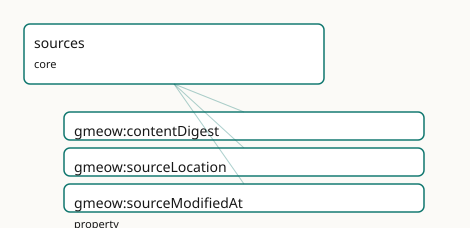

<!-- GENERATED by gmeow ontology-docs. DO NOT EDIT. Source hash: c99d8d50c0344040. -->

# GMEOW Sources Module

- **IRI:** <https://blackcatinformatics.ca/gmeow/slices/sources>
- **Tier:** core
- **[`Group`](../reference/classes/gmeow-Group.md):** core

## What This Slice Covers

This slice owns 3 terms and contributes 12 mapping or projection rows. Use it when its terms match the native fact you want to preserve; use the linkage tables to see how those facts leave GMEOW for consumer vocabularies.

## Dependencies

- [`gmeow:slices/documents`](documents.md)

## Consumers

- Content-addressed sources under the claim spine and the GTS packages (blake3 digests).

## Local Map

## Terms

### Properties

| Term | Label | Definition |
|---|---|---|
| [`gmeow:contentDigest`](../reference/properties/gmeow-contentDigest.md) | content digest | A content hash of an object's bytes (e.g. "blake3:…", "sha256:…", "git:…") — the reliable identity by content (two objects with the same bytes are the same obj... |
| [`gmeow:sourceLocation`](../reference/properties/gmeow-sourceLocation.md) | source location | Where the source artifact came from — a file path, original filename, or URL. Provenance/audit only; carries no reliable identity. |
| [`gmeow:sourceModifiedAt`](../reference/properties/gmeow-sourceModifiedAt.md) | source modified at | The last-modification time of the source artifact itself (e.g. a file mtime). A terminus-ante-quem on the recording of the claims this source carries — NOT val... |

## Linkages

- **Rows:** 12
- **Projection profiles:** `codemeta`, `dcat`, `dcterms`, `oai_dc`, `schema-org`, `sioc`
- **External vocabularies:** `codemeta`, `dc`, `dcat`, `dcterms`, `rdf`, `schema`, `sioc`, `spdx`

| Source | Kind | Profile | Predicate/Relation | Target | Evidence |
|---|---|---|---|---|---|
| [`gmeow:sourceLocation`](../reference/properties/gmeow-sourceLocation.md) | equivalence | `-` | [skos:closeMatch](http://www.w3.org/2004/02/skos/core#closeMatch) | [dcterms:source](http://purl.org/dc/terms/source) | `gmeow-dublin-core.sssom.tsv`; `gmeow:eqDcTerms006`; confidence 0.6 |
| [`gmeow:sourceLocation`](../reference/properties/gmeow-sourceLocation.md) | equivalence | `-` | [skos:closeMatch](http://www.w3.org/2004/02/skos/core#closeMatch) | [dcterms:source](http://purl.org/dc/terms/source) | `gmeow-provenance.sssom.tsv`; `gmeow:eqProvenance011`; confidence 0.6 |
| [`gmeow:sourceLocation`](../reference/properties/gmeow-sourceLocation.md) | equivalence | `-` | [skos:closeMatch](http://www.w3.org/2004/02/skos/core#closeMatch) | [schema:contentUrl](https://schema.org/contentUrl) | `gmeow-properties.sssom.tsv`; `gmeow:eqProperties079`; confidence 0.85 |
| [`gmeow:sourceModifiedAt`](../reference/properties/gmeow-sourceModifiedAt.md) | equivalence | `-` | [skos:closeMatch](http://www.w3.org/2004/02/skos/core#closeMatch) | [dcterms:modified](http://purl.org/dc/terms/modified) | `gmeow-provenance.sssom.tsv`; `gmeow:eqProvenance010`; confidence 0.9 |
| [`gmeow:contentDigest`](../reference/properties/gmeow-contentDigest.md) | projection | `codemeta` | projects to / = | [codemeta:identifier](https://codemeta.github.io/terms/#identifier) | `gmeow:mapCodeMetaIdentifier`; lossy: digest algorithm, multiple digests; only the string value survives |
| [`gmeow:contentDigest`](../reference/properties/gmeow-contentDigest.md) | projection | `dcat` | projects to / <= | [rdf:type](http://www.w3.org/1999/02/22-rdf-syntax-ns#type), [spdx:Checksum](http://spdx.org/rdf/terms#Checksum), [spdx:checksum](http://spdx.org/rdf/terms#checksum), [spdx:checksumValue](http://spdx.org/rdf/terms#checksumValue) | `gmeow:mapDcatChecksum`; confidence 0.85; lossy: the algorithm prefix stays inline in [spdx:checksumValue](http://spdx.org/rdf/terms#checksumValue) (no [spdx:algorithm](http://spdx.org/rdf/terms#algorithm) split) |
| [`gmeow:sourceLocation`](../reference/properties/gmeow-sourceLocation.md) | projection | `dcat` | projects to / <= | [dcat:Distribution](http://www.w3.org/ns/dcat#Distribution), [dcat:distribution](http://www.w3.org/ns/dcat#distribution), [dcat:downloadURL](http://www.w3.org/ns/dcat#downloadURL), [rdf:type](http://www.w3.org/1999/02/22-rdf-syntax-ns#type) | `gmeow:mapDcatDistribution`; confidence 0.85; lossy: the member document is REUSED as the [dcat:Distribution](http://www.w3.org/ns/dcat#Distribution) node (no manifestation split); its GMEOW typing is dropped |
| [`gmeow:sourceLocation`](../reference/properties/gmeow-sourceLocation.md) | projection | `dcat` | projects to / <= | [dcat:Distribution](http://www.w3.org/ns/dcat#Distribution), [dcat:distribution](http://www.w3.org/ns/dcat#distribution), [dcat:downloadURL](http://www.w3.org/ns/dcat#downloadURL), [rdf:type](http://www.w3.org/1999/02/22-rdf-syntax-ns#type) | `gmeow:mapDcatPartDistribution`; confidence 0.8; lossy: generic parthood narrows to the dataset-distribution reading; non-distribution parts are over-typed |
| [`gmeow:sourceLocation`](../reference/properties/gmeow-sourceLocation.md) | projection | `dcterms` | projects to / = | [dcterms:source](http://purl.org/dc/terms/source) | `gmeow:mapDctermsSource`; confidence 0.8 |
| [`gmeow:sourceLocation`](../reference/properties/gmeow-sourceLocation.md) | projection | `oai_dc` | projects to / = | [dc:source](http://purl.org/dc/elements/1.1/source) | `gmeow:mapOaiDcSource`; confidence 0.8 |
| [`gmeow:sourceLocation`](../reference/properties/gmeow-sourceLocation.md) | projection | `schema-org` | projects to / <= | [rdf:type](http://www.w3.org/1999/02/22-rdf-syntax-ns#type), [schema:DataDownload](https://schema.org/DataDownload), [schema:contentUrl](https://schema.org/contentUrl), [schema:distribution](https://schema.org/distribution), [schema:encodingFormat](https://schema.org/encodingFormat) | `gmeow:mapSchemaDataDownload`; confidence 0.85; lossy: the member document is REUSED as the [schema:DataDownload](https://schema.org/DataDownload) node; its GMEOW typing drops |
| [`gmeow:sourceLocation`](../reference/properties/gmeow-sourceLocation.md) | projection | `sioc` | projects to / <= | [sioc:link](http://rdfs.org/sioc/ns#link) | `gmeow:mapSiocLink`; confidence 0.85 |

## Guide

<!-- SPDX-FileCopyrightText: 2026 Blackcat Informatics® Inc. <paudley@blackcatinformatics.ca> -->
<!-- SPDX-License-Identifier: CC-BY-4.0 -->

# Sources — carrier metadata and content-addressed identity

> **Slice:** `https://blackcatinformatics.ca/gmeow/slices/sources` · **tier: core**
> What a source artifact *is* — its bytes, its location, its clock — held apart from the claims it carries.

There is no `gmeow:Source` class, and that is the doctrine. The refactor
retired the anti-rigid Source Kind: being-a-source is not what a thing *is* but a role it
plays in an act of citation — source-hood is mediated by [`CitationAct`](../reference/classes/gmeow-CitationAct.md) (citations slice)
or borne as a [`SourceRole`](../reference/classes/gmeow-SourceRole.md). Likewise the old Citation locator gave way to the
[`Selector`](../reference/classes/gmeow-Selector.md)/EvidenceSpan model (citations and evidence slices). What remains here is exactly
what *is* intrinsic to the artifact: carrier metadata — applied to the creative-works
[`Manifestation`](../reference/classes/gmeow-Manifestation.md)/Item tiers, never to the [`Work`](../reference/classes/gmeow-Work.md) — and the content-digest identity discipline.

This slice is the **Source** root of the claim spine (Source → [`Chunk`](../reference/classes/gmeow-Chunk.md) → [`EvidenceSpan`](../reference/classes/gmeow-EvidenceSpan.md) →
Claim, [Principle 14](https://github.com/Blackcat-Informatics/gmeow-ontology/blob/main/CONSTITUTION.md#principle-14)). The spine is content-addressed from the bottom: a source is
identified by what its bytes *are* ([`contentDigest`](../reference/properties/gmeow-contentDigest.md)), never by where they sit
([`sourceLocation`](../reference/properties/gmeow-sourceLocation.md)) or when the filesystem last touched them ([`sourceModifiedAt`](../reference/properties/gmeow-sourceModifiedAt.md)). The
same discipline carries the GTS packages — blake3 digests are the identity spine of the
signed, append-only memory format ([Principle 14](https://github.com/Blackcat-Informatics/gmeow-ontology/blob/main/CONSTITUTION.md#principle-14)).

## Carrier metadata

When a creative work is an import *envelope* — a file carrying a bundle of claims — these
properties describe the artifact itself, never the claims inside it. Keeping the two
apart is the whole point: an mtime says nothing about when a marriage happened or when a
census taker wrote it down.

### [`gmeow:contentDigest`](../reference/properties/gmeow-contentDigest.md)

A content hash of an object's bytes — `"blake3:…"`, `"sha256:…"`, `"git:…"` — the
*reliable* identity: two objects with the same bytes are the same object, regardless of
path, name, or mtime. Deliberately domain-free: creative works, source files, commits,
and distributions are all content-addressable ([Principle 4](https://github.com/Blackcat-Informatics/gmeow-ontology/blob/main/CONSTITUTION.md#principle-4): one identity mechanism, not
one per artifact kind). Not functional — an object may carry digests under several
algorithms, and they coexist.

### [`gmeow:sourceModifiedAt`](../reference/properties/gmeow-sourceModifiedAt.md)

The last-modification time of the source artifact itself (a file mtime): a
*terminus-ante-quem* on the **recording** of the claims it carries — the upper bound that
feeds [`gmeow:recordedNoLaterThan`](../reference/properties/gmeow-recordedNoLaterThan.md) in the temporal slice's four-clock model. It is NOT
valid-time and NOT observation-time; conflating the carrier's clock with the claims'
clocks is the classic provenance error this slice exists to forbid. Advisory and
resettable, hence not functional: copies of the same bytes legitimately report different
mtimes, and those reports coexist rather than force an inconsistency ([Principle 9](https://github.com/Blackcat-Informatics/gmeow-ontology/blob/main/CONSTITUTION.md#principle-9)) — the
reliable identity stays [`contentDigest`](../reference/properties/gmeow-contentDigest.md).

### [`gmeow:sourceLocation`](../reference/properties/gmeow-sourceLocation.md)

Where the artifact came from — a file path, original filename, or URL. Provenance and
audit only; it carries **no** identity. A file renamed is the same source; a path reused
is not the same source. Typically asserted on a [`Manifestation`](../reference/classes/gmeow-Manifestation.md) or [`Item`](../reference/classes/gmeow-Item.md) alongside the
digest.

## Bridges & solver boundary

The claims a source carries enter the graph through an [`ImportActivity`](../reference/classes/gmeow-ImportActivity.md) (provenance
slice), which stamps the transaction clock; the evidentiary reach *into* the source —
which span supports which claim, with what warrant — is the evidence and citations
slices' machinery. Digest computation, dedup-by-digest, and mtime-vs-digest conflict
resolution are solver-layer computations, never assertions ([Principle 12](https://github.com/Blackcat-Informatics/gmeow-ontology/blob/main/CONSTITUTION.md#principle-12)): the slice
records the digests and timestamps; deciding that two artifacts are byte-identical is a
projection-time join on [`contentDigest`](../reference/properties/gmeow-contentDigest.md).

## Dependencies

Depends on `documents` (the WEMI carrier tiers the metadata attaches to). Consumed by the
claim spine's content-addressed sources and by the GTS packages' blake3 identity spine
([Principle 14](https://github.com/Blackcat-Informatics/gmeow-ontology/blob/main/CONSTITUTION.md#principle-14)).
