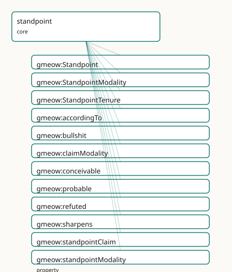

<!-- GENERATED by gmeow ontology-docs. DO NOT EDIT. -->

# GMEOW Standpoint Module

- **IRI:** <https://blackcatinformatics.ca/gmeow/slices/standpoint>
- **Tier:** core
- **[`Group`](../reference/classes/gmeow-Group.md):** core

## What This Slice Covers

This slice owns 16 terms and contributes 11 mapping or projection rows. Use it when its terms match the native fact you want to preserve; use the linkage tables to see how those facts leave GMEOW for consumer vocabularies.

## Dependencies

- [`gmeow:slices/kernel`](kernel.md)
- [`gmeow:slices/observations`](observations.md)
- [`gmeow:slices/temporal`](temporal.md)

## Consumers

- Every contested fact and every model disagreement (P9); the statement layer; the deception slice.

## Local Map



## Examples

### Contested Authorship

- **Source:** [`slices/core/standpoint/examples/contested-authorship.ttl`](https://github.com/Blackcat-Informatics/gmeow-ontology/blob/main/slices/core/standpoint/examples/contested-authorship.ttl)
- **GMEOW terms:** [`gmeow:CreativeWork`](../reference/classes/gmeow-CreativeWork.md), [`gmeow:Person`](../reference/classes/gmeow-Person.md), [`gmeow:Standpoint`](../reference/classes/gmeow-Standpoint.md), [`gmeow:StandpointClaim`](../reference/classes/gmeow-StandpointClaim.md), [`gmeow:claimModality`](../reference/properties/gmeow-claimModality.md), [`gmeow:methodComputationalModel`](../reference/individuals/gmeow-methodComputationalModel.md), [`gmeow:methodExpertJudgement`](../reference/individuals/gmeow-methodExpertJudgement.md), [`gmeow:name`](../reference/properties/gmeow-name.md), [`gmeow:observationMethod`](../reference/properties/gmeow-observationMethod.md), [`gmeow:observationResult`](../reference/properties/gmeow-observationResult.md)

```turtle
# SPDX-FileCopyrightText: 2026 Blackcat Informatics® Inc. <paudley@blackcatinformatics.ca>
# SPDX-License-Identifier: CC-BY-4.0
#
# Worked example: contested claims coexist, none privileged ( P9). Two
# scholars attribute the same play to different authors. Each attribution is a
# reified gmeow:StandpointClaim (a kind of Observation) carrying its own
# gmeow:vantage (whose standpoint), gmeow:observationResult (the claimed author),
# and gmeow:claimModality (HOW the standpoint holds it). A third standpoint does
# something flat models cannot express: it gmeow:refuted the Marlowe attribution
# — an explicit DENIAL, distinct from mere silence. There is no "preferred"
# author: the graph keeps every standpoint's stance side by side.
@prefix gmeow: <https://blackcatinformatics.ca/gmeow/> .
@prefix ex:    <https://blackcatinformatics.ca/gmeow/examples/standpoint/> .

ex:play a gmeow:CreativeWork ;
    gmeow:title "The Contested Tragedy"@en .

ex:marlowe a gmeow:Person ; gmeow:name "Christopher Marlowe"@en .
ex:shakespeare a gmeow:Person ; gmeow:name "William Shakespeare"@en .

# --- Standpoints: the scholarly positions from which each claim is held.
ex:revisionists a gmeow:Standpoint ; gmeow:sharpens gmeow:universalStandpoint .
ex:orthodoxy a gmeow:Standpoint ; gmeow:sharpens gmeow:universalStandpoint .
ex:forensicPanel a gmeow:Standpoint ; gmeow:sharpens gmeow:universalStandpoint .

# --- Claim 1: the revisionists hold (probably) that Marlowe wrote it.
ex:claimMarlowe a gmeow:StandpointClaim ;
    gmeow:vantage ex:revisionists ;
    gmeow:observedFeature ex:play ;
    gmeow:observationResult ex:marlowe ;
    gmeow:observationMethod gmeow:methodExpertJudgement ;
    gmeow:claimModality gmeow:probable .

# --- Claim 2: the orthodoxy holds (settled) that Shakespeare wrote it.
ex:claimShakespeare a gmeow:StandpointClaim ;
    gmeow:vantage ex:orthodoxy ;
    gmeow:observedFeature ex:play ;
    gmeow:observationResult ex:shakespeare ;
    gmeow:observationMethod gmeow:methodExpertJudgement ;
    gmeow:claimModality gmeow:unequivocal .

# --- Claim 3: a stylometric panel REFUTES the Marlowe attribution — settled
#     false, an explicit denial rather than silence. It coexists with claim 1.
ex:refuteMarlowe a gmeow:StandpointClaim ;
    gmeow:vantage ex:forensicPanel ;
    gmeow:observedFeature ex:play ;
    gmeow:observationResult ex:marlowe ;
    gmeow:observationMethod gmeow:methodComputationalModel ;
    gmeow:claimModality gmeow:refuted .
```

## Terms

### Classes

| Term | Label | Definition |
|---|---|---|
| [`gmeow:Standpoint`](../reference/classes/gmeow-Standpoint.md) | Standpoint | A named perspective / frame within which claims are held true — a state's official position, a community's usage, an editorial or historiographic point of view... |
| [`gmeow:StandpointModality`](../reference/classes/gmeow-StandpointModality.md) | Standpoint Modality | The belief value a standpoint assigns a proposition — a closed value vocabulary spanning the Standpoint-Logic □/◊ and the [CRMinf](../external/ontologies.md#target-crminf) belief value (true/false/proba... |
| [`gmeow:StandpointTenure`](../reference/classes/gmeow-StandpointTenure.md) | Standpoint Tenure | The reified, time-scoped fact that a standpoint held a particular position over an interval — recognition granted in 2008 and withdrawn in 2030 is an opened-th... |

### Properties

| Term | Label | Definition |
|---|---|---|
| [`gmeow:accordingTo`](../reference/properties/gmeow-accordingTo.md) | according to | The standpoint / frame within which the annotated statement is asserted true — *according to whom*. DISTINCT from [`gmeow:wasAttributedTo`](../reference/properties/gmeow-wasAttributedTo.md) (which source RECORDED... |
| [`gmeow:claimModality`](../reference/properties/gmeow-claimModality.md) | claim modality | The modality (unequivocal, probable, conceivable, refuted, bullshit) assigned to a StandpointClaim. Semantically equivalent to observationResult for Standpoint... |
| [`gmeow:sharpens`](../reference/properties/gmeow-sharpens.md) | sharpens | S1 sharpens S2: every precisification S1 admits is also admitted by S2, so S1 is the more specific frame (the standpoint ⊆ / refinement relation of Standpoint... |
| [`gmeow:standpointClaim`](../reference/properties/gmeow-standpointClaim.md) | standpoint claim | The StandpointClaim observation that a StandpointTenure generates — the reified observation of the tenure's time-scoped fact. The tenure is the time-scoped sit... |
| [`gmeow:standpointModality`](../reference/properties/gmeow-standpointModality.md) | standpoint modality | The belief value a standpoint assigns the annotated proposition — *how* the standpoint holds it, not merely *that* it holds it. This single axis is at least as... |
| [`gmeow:tenurePosition`](../reference/properties/gmeow-tenurePosition.md) | tenure position | The standpoint-indexed claim the tenure says the standpoint held over its interval — a reified statement (a gmeow:StatementMetadata cell in the statement DSL).... |
| [`gmeow:tenureStandpoint`](../reference/properties/gmeow-tenureStandpoint.md) | tenure standpoint | The standpoint whose position a standpoint-tenure records. When a StandpointTenure generates a StandpointClaim observation, the tenureStandpoint becomes the va... |

### Individuals

| Term | Label | Definition |
|---|---|---|
| [`gmeow:bullshit`](../reference/individuals/gmeow-bullshit.md) | bullshit (indifference to truth) | The standpoint asserts P with indifference to its truth-value — Frankfurt's bullshit modality. Distinct from lying (which cares about truth and asserts the opp... |
| [`gmeow:conceivable`](../reference/individuals/gmeow-conceivable.md) | conceivable (◊, possible) | ◊_S — possible according to the standpoint: the proposition holds in some precisification the standpoint admits, but is not settled ([CRMinf](../external/ontologies.md#target-crminf) belief value 'possi... |
| [`gmeow:probable`](../reference/individuals/gmeow-probable.md) | probable | Likely true according to the standpoint — held more strongly than merely possible, but short of settled ([CRMinf](../external/ontologies.md#target-crminf) belief value 'probable'). |
| [`gmeow:refuted`](../reference/individuals/gmeow-refuted.md) | refuted (□¬, false) | □¬_S — settled false according to the standpoint: the standpoint DENIES the proposition ([CRMinf](../external/ontologies.md#target-crminf) belief value 'false'). Distinct from silence (no claim) and fro... |
| [`gmeow:unequivocal`](../reference/individuals/gmeow-unequivocal.md) | unequivocal (□, true) | □_S — settled / necessary true according to the standpoint: the proposition holds in every precisification the standpoint admits ([CRMinf](../external/ontologies.md#target-crminf) belief value 'true').... |
| [`gmeow:universalStandpoint`](../reference/individuals/gmeow-universalStandpoint.md) | universal standpoint (*) | The universal standpoint * — the top of the poset, admitting every precisification: the uncontested global facts every standpoint shares. A statement with no g... |

## Linkages

- **Rows:** 11
- **Projection profiles:** -
- **External vocabularies:** `crminf`, `dul`, `iptc`, `prov`, `sosa`, `wd`

| Source | Kind | Profile | Predicate/Relation | Target | Evidence |
|---|---|---|---|---|---|
| [`gmeow:Standpoint`](../reference/classes/gmeow-Standpoint.md) | equivalence | `-` | [skos:relatedMatch](http://www.w3.org/2004/02/skos/core#relatedMatch) | [dul:Description](http://www.ontologydesignpatterns.org/ont/dul/DUL.owl#Description) | `gmeow-standpoint.sssom.tsv`; `gmeow:eqStandpoint012`; confidence 0.4 |
| [`gmeow:Standpoint`](../reference/classes/gmeow-Standpoint.md) | equivalence | `-` | [skos:relatedMatch](http://www.w3.org/2004/02/skos/core#relatedMatch) | [iptc:Assertor](http://iptc.org/std/NewsML-G2/Assertor) | `gmeow-standpoint.sssom.tsv`; `gmeow:eqStandpoint018`; confidence 0.5 |
| [`gmeow:Standpoint`](../reference/classes/gmeow-Standpoint.md) | equivalence | `-` | [skos:relatedMatch](http://www.w3.org/2004/02/skos/core#relatedMatch) | [prov:Agent](http://www.w3.org/ns/prov#Agent) | `gmeow-standpoint.sssom.tsv`; `gmeow:eqStandpoint010`; confidence 0.4 |
| [`gmeow:StandpointModality`](../reference/classes/gmeow-StandpointModality.md) | equivalence | `-` | [skos:closeMatch](http://www.w3.org/2004/02/skos/core#closeMatch) | [crminf:I6_Belief_Value](http://www.ics.forth.gr/isl/CRMinf/I6_Belief_Value) | `gmeow-deception.sssom.tsv`; `gmeow:eqDeception005`; confidence 0.6 |
| [`gmeow:StandpointTenure`](../reference/classes/gmeow-StandpointTenure.md) | equivalence | `-` | [skos:relatedMatch](http://www.w3.org/2004/02/skos/core#relatedMatch) | [crminf:I2_Belief](http://www.ics.forth.gr/isl/CRMinf/I2_Belief) | `gmeow-standpoint.sssom.tsv`; `gmeow:eqStandpoint004`; confidence 0.6 |
| [`gmeow:accordingTo`](../reference/properties/gmeow-accordingTo.md) | equivalence | `-` | [skos:relatedMatch](http://www.w3.org/2004/02/skos/core#relatedMatch) | [prov:wasAttributedTo](http://www.w3.org/ns/prov#wasAttributedTo) | `gmeow-standpoint.sssom.tsv`; `gmeow:eqStandpoint001`; confidence 0.4 |
| [`gmeow:accordingTo`](../reference/properties/gmeow-accordingTo.md) | equivalence | `-` | [skos:relatedMatch](http://www.w3.org/2004/02/skos/core#relatedMatch) | [wd:P3680](https://www.wikidata.org/wiki/Property:P3680) | `gmeow-standpoint.sssom.tsv`; `gmeow:eqStandpoint006`; confidence 0.55 |
| [`gmeow:bullshit`](../reference/individuals/gmeow-bullshit.md) | equivalence | `-` | [skos:relatedMatch](http://www.w3.org/2004/02/skos/core#relatedMatch) | [crminf:I6_Belief_Value](http://www.ics.forth.gr/isl/CRMinf/I6_Belief_Value) | `gmeow-standpoint.sssom.tsv`; `gmeow:eqStandpoint023`; confidence 0.5 |
| [`gmeow:claimModality`](../reference/properties/gmeow-claimModality.md) | equivalence | `-` | [skos:closeMatch](http://www.w3.org/2004/02/skos/core#closeMatch) | [crminf:J5_holds_to_be](http://www.ics.forth.gr/isl/CRMinf/J5_holds_to_be) | `gmeow-standpoint.sssom.tsv`; `gmeow:eqStandpoint017`; confidence 0.6 |
| [`gmeow:claimModality`](../reference/properties/gmeow-claimModality.md) | equivalence | `-` | [skos:closeMatch](http://www.w3.org/2004/02/skos/core#closeMatch) | [sosa:hasResult](http://www.w3.org/ns/sosa/hasResult) | `gmeow-observations.sssom.tsv`; `gmeow:eqObs041`; confidence 0.75 |
| [`gmeow:standpointModality`](../reference/properties/gmeow-standpointModality.md) | equivalence | `-` | [skos:relatedMatch](http://www.w3.org/2004/02/skos/core#relatedMatch) | [crminf:J5_holds_to_be](http://www.ics.forth.gr/isl/CRMinf/J5_holds_to_be) | `gmeow-standpoint.sssom.tsv`; `gmeow:eqStandpoint008`; confidence 0.6 |

## Guide

<!-- SPDX-FileCopyrightText: 2026 Blackcat Informatics® Inc. <paudley@blackcatinformatics.ca> -->
<!-- SPDX-License-Identifier: CC-BY-4.0 -->

# Standpoint — alignment & projection reference

The alignment and projection companion to the [standpoint doctrine](standpoints.md).
Everything here is **authored once** in `mapping-dsl/` and generated by
`gmeow compile-mappings` ([Principle 4](https://github.com/Blackcat-Informatics/gmeow-ontology/blob/main/CONSTITUTION.md#principle-4)); nothing in `mappings/`, `projections/`, or
`queries/projections/` is hand-edited.

## Terms

| Term | Kind | Role |
|---|---|---|
| [`gmeow:accordingTo`](../reference/properties/gmeow-accordingTo.md) | [`owl:AnnotationProperty`](http://www.w3.org/2002/07/owl#AnnotationProperty) | the standpoint axis — *according to whom* a statement holds |
| [`gmeow:standpointModality`](../reference/properties/gmeow-standpointModality.md) | [`owl:AnnotationProperty`](http://www.w3.org/2002/07/owl#AnnotationProperty) | the belief value: `unequivocal` (□/true), `probable`, `conceivable` (◊/possible), `refuted` (□¬/false) — spans Standpoint-Logic *and* [CRMinf](../external/ontologies.md#target-crminf) belief values |
| [`gmeow:Standpoint`](../reference/classes/gmeow-Standpoint.md) | class ([`gufo:Kind`](../external/terms.md#gufo-kind)) | a named perspective/frame (often a bare [`gmeow:Agent`](../reference/classes/gmeow-Agent.md) instead) |
| [`gmeow:sharpens`](../reference/properties/gmeow-sharpens.md) | transitive object property | the standpoint ⊆ / precisification order |
| [`gmeow:universalStandpoint`](../reference/individuals/gmeow-universalStandpoint.md) | individual | the universal standpoint `*` (the default for unindexed claims) |
| [`gmeow:StandpointTenure`](../reference/classes/gmeow-StandpointTenure.md) | class ([`gufo:Situation`](http://purl.org/nemo/gufo#Situation)) | reified standpoint-time (a position held over an interval) |

## Term anchors

### [`gmeow:Standpoint`](../reference/classes/gmeow-Standpoint.md) · [`gmeow:sharpens`](../reference/properties/gmeow-sharpens.md)

A named perspective/frame within which claims are held true — a state's official
position, a community's usage, an editorial point of view — minted only when the
frame needs its own identity (often a bare [`gmeow:Agent`](../reference/classes/gmeow-Agent.md) suffices). Standpoints
form a poset under `sharpens` (transitive, the standpoint ⊆ refinement relation),
topped by [`universalStandpoint`](../reference/individuals/gmeow-universalStandpoint.md).

### [`gmeow:StandpointModality`](../reference/classes/gmeow-StandpointModality.md) · [`gmeow:claimModality`](../reference/properties/gmeow-claimModality.md)

The belief value a standpoint assigns a proposition — the closed vocabulary
spanning Standpoint-Logic □/◊ and the [CRMinf](../external/ontologies.md#target-crminf) values plus the Frankfurt bullshit
modality (`unequivocal`, `probable`, `conceivable`, `refuted`, `bullshit`);
absence reads as unequivocal. [`claimModality`](../reference/properties/gmeow-claimModality.md) carries it on a [`StandpointClaim`](../reference/classes/gmeow-StandpointClaim.md)
and flattens to [`standpointModality`](../reference/properties/gmeow-standpointModality.md) on an annotated statement.

### [`gmeow:StandpointTenure`](../reference/classes/gmeow-StandpointTenure.md) · [`gmeow:tenureStandpoint`](../reference/properties/gmeow-tenureStandpoint.md) · [`gmeow:tenurePosition`](../reference/properties/gmeow-tenurePosition.md) · [`gmeow:standpointClaim`](../reference/properties/gmeow-standpointClaim.md)

The reified, time-scoped fact that a standpoint held a position over an interval —
recognition granted in 2008 and withdrawn in 2030 is an opened-then-closed tenure,
never a deletion ([Principle 10](https://github.com/Blackcat-Informatics/gmeow-ontology/blob/main/CONSTITUTION.md#principle-10)). [`tenureStandpoint`](../reference/properties/gmeow-tenureStandpoint.md) is the holding standpoint,
[`tenurePosition`](../reference/properties/gmeow-tenurePosition.md) the standpoint-indexed claim it held, and [`standpointClaim`](../reference/properties/gmeow-standpointClaim.md)
(functional) the one observation the tenure generates — the tenure being the
time-scoped fact, the claim its observation.

## SSSOM alignments (`mapping-dsl/equivalences/standpoint.ttl`)

All by reference ([Principle 5](https://github.com/Blackcat-Informatics/gmeow-ontology/blob/main/CONSTITUTION.md#principle-5)) — GMEOW never imports an external axiom. Compiled to
`mappings/gmeow-standpoint.sssom.tsv`.

| GMEOW | Predicate | Target | Note |
|---|---|---|---|
| [`gmeow:accordingTo`](../reference/properties/gmeow-accordingTo.md) | [`skos:relatedMatch`](http://www.w3.org/2004/02/skos/core#relatedMatch) | [`prov:wasAttributedTo`](http://www.w3.org/ns/prov#wasAttributedTo) | standpoint ≠ source — a neutral source can record a partisan claim |
| `gmeow:StatementMetadata` | [`skos:relatedMatch`](http://www.w3.org/2004/02/skos/core#relatedMatch) | [`np:Nanopublication`](http://www.nanopub.org/nschema#Nanopublication) | a reified statement-with-provenance is a nanopublication minus the PID |
| `gmeow:StatementMetadata` | [`skos:relatedMatch`](http://www.w3.org/2004/02/skos/core#relatedMatch) | [`crminf:I4_Proposition_Set`](http://www.ics.forth.gr/isl/CRMinf/I4_Proposition_Set) | the reified base triple is the proposition a belief is about |
| [`gmeow:StandpointTenure`](../reference/classes/gmeow-StandpointTenure.md) | [`skos:relatedMatch`](http://www.w3.org/2004/02/skos/core#relatedMatch) | [`crminf:I2_Belief`](http://www.ics.forth.gr/isl/CRMinf/I2_Belief) | a temporal belief held over an interval ([CRMinf](../external/ontologies.md#target-crminf) I2 is itself temporal) |
| [`gmeow:standpointModality`](../reference/properties/gmeow-standpointModality.md) | [`skos:relatedMatch`](http://www.w3.org/2004/02/skos/core#relatedMatch) | [`crminf:J5_holds_to_be`](http://www.ics.forth.gr/isl/CRMinf/J5_holds_to_be) | the belief value (true/probable/possible/false) |
| `gmeow:StatementMetadata` | [`skos:relatedMatch`](http://www.w3.org/2004/02/skos/core#relatedMatch) | [`wikibase:Statement`](http://wikiba.se/ontology#Statement) | GMEOW's reifier is Wikidata's statement node — but with no rank |
| [`gmeow:accordingTo`](../reference/properties/gmeow-accordingTo.md) | [`skos:relatedMatch`](http://www.w3.org/2004/02/skos/core#relatedMatch) | [`wd:P3680`](https://www.wikidata.org/wiki/Property:P3680) | Wikidata "statement supported by"; its inverse "disputed by" (P1310) is just another coexisting claim in GMEOW |
| `gmeow:StatementMetadata` | [`skos:relatedMatch`](http://www.w3.org/2004/02/skos/core#relatedMatch) | [`schema:Claim`](https://schema.org/Claim) | GMEOW refuses ClaimReview's single-verdict false-credibility |
| `gmeow:StatementMetadata` | [`skos:relatedMatch`](http://www.w3.org/2004/02/skos/core#relatedMatch) | [`prov:Entity`](http://www.w3.org/ns/prov#Entity) | a reified claim is a provenance entity attributed to its standpoint agent |
| [`gmeow:Standpoint`](../reference/classes/gmeow-Standpoint.md) | [`skos:relatedMatch`](http://www.w3.org/2004/02/skos/core#relatedMatch) | [`prov:Agent`](http://www.w3.org/ns/prov#Agent) | a standpoint is often (not always) the agent that bears an attribution |
| `gmeow:StatementMetadata` | [`skos:relatedMatch`](http://www.w3.org/2004/02/skos/core#relatedMatch) | [`oa:Annotation`](http://www.w3.org/ns/oa#Annotation) | body = the quoted triple, target = its subject, creator = the standpoint |
| [`gmeow:Standpoint`](../reference/classes/gmeow-Standpoint.md) | [`skos:relatedMatch`](http://www.w3.org/2004/02/skos/core#relatedMatch) | [`dul:Description`](http://www.ontologydesignpatterns.org/ont/dul/DUL.owl#Description) | a standpoint is a DnS Description — a perspective/conceptualization |
| `gmeow:StatementMetadata` | [`skos:relatedMatch`](http://www.w3.org/2004/02/skos/core#relatedMatch) | [`dul:Situation`](http://www.ontologydesignpatterns.org/ont/dul/DUL.owl#Situation) | the claim is the DnS Situation that satisfies the standpoint's Description |

**[CRMinf](../external/ontologies.md#target-crminf) parity.** GMEOW is *at least as expressive as* the [CIDOC-CRM](../external/ontologies.md#target-crm) Argumentation
model: the reified statement is an I4 [`Proposition`](../reference/classes/gmeow-Proposition.md) Set, a [`StandpointTenure`](../reference/classes/gmeow-StandpointTenure.md) is a
temporal `I2 Belief`, the standpoint is the actor of an `I1 Argumentation`, and
[`standpointModality`](../reference/properties/gmeow-standpointModality.md) spans `J5 holds to be` (true/probable/possible/**false**) — so a
denial is first-class, not an absence. Carried by the generated [CRMinf](../external/ontologies.md#target-crminf) projection.

**Formal grounding (set comment).** [`gmeow:accordingTo`](../reference/properties/gmeow-accordingTo.md) is the axiom-level standpoint
label of **[`Standpoint`](../reference/classes/gmeow-Standpoint.md) Logic** ([`Standpoint`](../reference/classes/gmeow-Standpoint.md) EL, IJCAI 2023; Standpoint-OWL 2,
arXiv:2305.00559; Monodic-S5 over OWL 2 DL, KR 2025); modality = the □/◊ operators
*plus* the [CRMinf](../external/ontologies.md#target-crminf) belief values; `sharpens` = the standpoint ⊆ relation;
[`universalStandpoint`](../reference/individuals/gmeow-universalStandpoint.md) = `*`. It also relates to CKR contexts, MVP-OWL multi-viewpoint
classes, and ClaiMaker source-anchored claims (documented in the set comment).

**The Wikidata refusal (set trailer).** GMEOW keeps Wikidata references/qualifiers as
relatedMatch targets but **refuses [`wikibase:rank`](http://wikiba.se/ontology#rank) / [`wikibase:PreferredRank`](http://wikiba.se/ontology#PreferredRank)** — a
preferred rank re-creates the single winning slot the edit war is fought over
([Principle 9](https://github.com/Blackcat-Informatics/gmeow-ontology/blob/main/CONSTITUTION.md#principle-9)). The refusal is recorded in the generated TSV, never emitted as a mapping.

## Projections — every standpoint preserved, never a winner

The governing rule is **no winner**: GMEOW ships **no** projection that selects a
single standpoint, because collapsing a contested fact to a chosen frame re-creates
the single winning slot the facility abolishes ([Principle 9](https://github.com/Blackcat-Informatics/gmeow-ontology/blob/main/CONSTITUTION.md#principle-9)). All five projections
below preserve *every* standpoint. Two are **lossless** (Standpoint-OWL 2, [CRMinf](../external/ontologies.md#target-crminf));
the [PROV-O](../external/ontologies.md#target-prov), Web [`Annotation`](../reference/classes/gmeow-Annotation.md), and schema.org ones are perspective-preserving but lossy
on the belief value (a documented drop, **not** a winner-pick — every standpoint still
appears). (`tests/test_standpoint.py` asserts no frame-selecting executor exists.)

### Standpoint-OWL 2 → `queries/projections/standpoint-owl2.rq`

Re-expresses every reified statement's [`accordingTo`](../reference/properties/gmeow-accordingTo.md) + [`standpointModality`](../reference/properties/gmeow-standpointModality.md) as the
**`standpointLabel`** encoding consumed by the reference translator
([`cl-tud/standpoint-owl2`](the Standpoint OWL2 implementation) → HermiT):
`Box` for settled (□), `Diamond` for possible/probable (◊), the standpoint IRI as the
[`Standpoint`](../reference/classes/gmeow-Standpoint.md) name (`*` for the universal standpoint). The property IRI is
`…/gmeow#standpointLabel` — the tool matches any property ending in `#standpointLabel`.
Because this encoding labels an *asserted* axiom, a `refuted` (denied) claim cannot be
represented here without asserting what the standpoint rejects, so denials are excluded
from this projection and carried by the [CRMinf](../external/ontologies.md#target-crminf) one below. A standpoint-aware reasoner
runs **per-standpoint and cross-standpoint** consistency over the full graph.

### [CRMinf](../external/ontologies.md#target-crminf) ([CIDOC-CRM](../external/ontologies.md#target-crm) Argumentation) → `queries/projections/standpoint-crminf.rq`

Re-expresses every reified statement as an `I1 Argumentation` (`P14 carried out by`
the standpoint) that `J2 concluded that` an `I2 Belief` `J4 that` an
I4 [`Proposition`](../reference/classes/gmeow-Proposition.md) Set, which `J5 holds to be` a belief value derived from
[`standpointModality`](../reference/properties/gmeow-standpointModality.md) — `true` / `probable` / `possible` / **`false`**. Because the
belief value is explicit, a **denial** (`refuted`) is carried faithfully and the
proposition is *referred to* (`P67 refers to`), never asserted as a fact. This is the
projection that makes GMEOW's *at-least-as-expressive-as-[CRMinf](../external/ontologies.md#target-crminf)* claim concrete.

### Web Annotation → `queries/projections/standpoint-oa.rq`

Re-expresses every reified statement as an [`oa:Annotation`](http://www.w3.org/ns/oa#Annotation): [`oa:hasBody`](http://www.w3.org/ns/oa#hasBody) the
(still-reified, never-asserted) quoted statement, [`oa:hasTarget`](http://www.w3.org/ns/oa#hasTarget) its subject,
[`dcterms:creator`](http://purl.org/dc/terms/creator) the standpoint, [`oa:motivatedBy oa:describing`](http://www.w3.org/ns/oa#motivatedBy oa:describing). Perspective-
preserving (every standpoint becomes an annotation by its frame); lossy on the belief
value and confidence, like the [PROV-O](../external/ontologies.md#target-prov) projection.

### schema.org Claim → `queries/projections/standpoint-schema.rq`

Re-expresses every **non-denied** reified statement as a [`schema:Claim`](https://schema.org/Claim) whose
[`schema:author`](https://schema.org/author) is the standpoint and whose [`schema:text`](https://schema.org/text) is the rendered proposition
(never the asserted base triple). Per-standpoint claims coexist — there is no single
[`schema:ClaimReview`](https://schema.org/ClaimReview) verdict, the false-credibility GMEOW refuses. A `refuted` (denied)
claim is **excluded** (a [`schema:author`](https://schema.org/author) would misread denial as authorship) and
carried by the [CRMinf](../external/ontologies.md#target-crminf) projection. For the web / fact-check ecosystem.

### [PROV-O](../external/ontologies.md#target-prov) → `queries/projections/standpoint-prov.rq`

Re-expresses every reified statement as a [`prov:Entity`](http://www.w3.org/ns/prov#Entity) (proposition kept reified,
never asserted) [`prov:wasAttributedTo`](http://www.w3.org/ns/prov#wasAttributedTo) its standpoint agent, with a
[`prov:qualifiedAttribution`](http://www.w3.org/ns/prov#qualifiedAttribution) node naming the [`prov:agent`](http://www.w3.org/ns/prov#agent). Every standpoint is
retained and none is privileged. It is the *provenance* lens: perspective-preserving
but **lossy** on the belief value ([`standpointModality`](../reference/properties/gmeow-standpointModality.md)) and `confidence` — those are
carried by the [CRMinf](../external/ontologies.md#target-crminf) and Standpoint-OWL 2 projections. Lossy-drop note (in the
generated header): *belief value (modality) and confidence dropped; attribution
preserved*. This is loss without winner-picking — every standpoint still appears.

## Verified by construction

- `gmeow compile-mappings --check` — no drift between `mapping-dsl/` and the generated
 artifacts (the Standpoint-OWL 2 executor included).
- `gmeow lint-alignment` — alignment-direction soundness over the SSSOM rows.
- `tests/test_standpoint.py` — no frame-selecting executor exists; the Standpoint-OWL 2
 projection emits tool-compatible `Box`/`Diamond` labels and preserves the base axioms.
