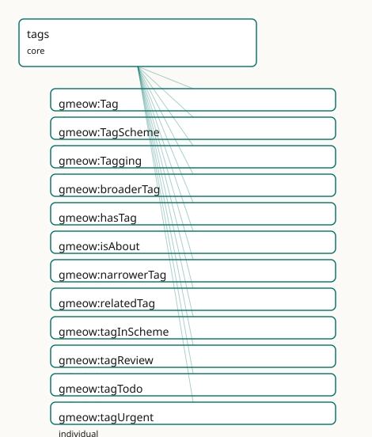

<!-- GENERATED by gmeow ontology-docs. DO NOT EDIT. -->

# GMEOW Tags Module

- **IRI:** <https://blackcatinformatics.ca/gmeow/slices/tags>
- **Tier:** core
- **[`Group`](../reference/classes/gmeow-Group.md):** core

## What This Slice Covers

This slice owns 17 terms and contributes 30 mapping or projection rows. Use it when its terms match the native fact you want to preserve; use the linkage tables to see how those facts leave GMEOW for consumer vocabularies.

## Dependencies

- [`gmeow:slices/kernel`](kernel.md)
- [`gmeow:slices/temporal`](temporal.md)

## Consumers

- Folksonomy tagging reused by images and software (forced core by dual extension use).

## Local Map

## Terms

### Classes

| Term | Label | Definition |
|---|---|---|
| [`gmeow:Tag`](../reference/classes/gmeow-Tag.md) | Tag | An open, user-minted tag — an information object whose identity is its IRI and whose surface form is carried by [rdfs:label.](http://www.w3.org/2000/01/rdf-schema#label.) Synonyms are multiple labels; homon... |
| [`gmeow:TagScheme`](../reference/classes/gmeow-TagScheme.md) | Tag Scheme | A namespaced set of tags — a project vocabulary, a personal tag bucket, or a controlled vocabulary. Multi-tenant: many schemes coexist, and a tag may belong to... |
| [`gmeow:Tagging`](../reference/classes/gmeow-Tagging.md) | Tagging | A reified tagging act — a [gufo:Relator](../external/terms.md#gufo-relator) mediating a tagged resource, a tag, a tagger, and optionally a scheme and time interval. Bears provenance (gmeow:wasAttr... |

### Properties

| Term | Label | Definition |
|---|---|---|
| [`gmeow:broaderTag`](../reference/properties/gmeow-broaderTag.md) | broader tag | A broader, more general tag. Transitive. Optional: folksonomy stays flat-first. |
| [`gmeow:hasTag`](../reference/properties/gmeow-hasTag.md) | has tag | Relates an entity to a user-minted tag — the 80% flat shortcut. Non-functional: an entity may carry many co-equal tags. Period, confidence, tagger and suppress... |
| [`gmeow:isAbout`](../reference/properties/gmeow-isAbout.md) | is about | Aboutness — a resource is about another resource. Distinct from typing ([rdf:type](http://www.w3.org/1999/02/22-rdf-syntax-ns#type)) and from tagging ([`gmeow:hasTag`](../reference/properties/gmeow-hasTag.md)): aboutness is a semantic subject-matter relat... |
| [`gmeow:narrowerTag`](../reference/properties/gmeow-narrowerTag.md) | narrower tag | A narrower, more specific tag. Inverse of [`gmeow:broaderTag`](../reference/properties/gmeow-broaderTag.md). Optional. |
| [`gmeow:relatedTag`](../reference/properties/gmeow-relatedTag.md) | related tag | A tag related to this tag by an associative link. Symmetric. Optional. |
| [`gmeow:tagInScheme`](../reference/properties/gmeow-tagInScheme.md) | tag in scheme | Relates a tag to a scheme it belongs to. Non-functional: a tag may reside in many schemes (cross-listing). |
| [`gmeow:taggingInterval`](../reference/properties/gmeow-taggingInterval.md) | tagging interval | The time interval over which the tagging act holds. A relator carries its period this way (matching [`gmeow:usageInterval`](../reference/properties/gmeow-usageInterval.md), [`gmeow:relationshipInterval`](../reference/properties/gmeow-relationshipInterval.md)) rather tha... |
| [`gmeow:taggingScheme`](../reference/properties/gmeow-taggingScheme.md) | tagging scheme | The tag scheme within which the tagging act is performed. Functional per relator: one scheme per Tagging (the tag itself may belong to multiple schemes). |
| [`gmeow:taggingTag`](../reference/properties/gmeow-taggingTag.md) | tagging tag | The tag applied in a tagging act. Functional per relator: one tag per Tagging. |
| [`gmeow:taggingTagged`](../reference/properties/gmeow-taggingTagged.md) | tagging tagged | The entity that is tagged in a tagging act. Functional per relator: one tagged entity per Tagging. |
| [`gmeow:taggingTagger`](../reference/properties/gmeow-taggingTagger.md) | tagging tagger | The agent who performed the tagging act. Non-functional: a tag may be co-asserted by multiple agents (e.g. a collaborative curation effort). |

### Individuals

| Term | Label | Definition |
|---|---|---|
| [`gmeow:tagReview`](../reference/individuals/gmeow-tagReview.md) | review | A tag indicating that the tagged entity should be examined, evaluated, or reassessed by a person or process. |
| [`gmeow:tagTodo`](../reference/individuals/gmeow-tagTodo.md) | todo | A tag marking the tagged entity as an action item or task yet to be completed. |
| [`gmeow:tagUrgent`](../reference/individuals/gmeow-tagUrgent.md) | urgent | A tag indicating that the tagged entity requires prompt attention or has high priority relative to other items. |

## Linkages

- **Rows:** 30
- **Projection profiles:** `dcterms`, `doap`, `oai_dc`, `schema-org`, `sioc`, `web-annotation`
- **External vocabularies:** `dc`, `dcterms`, `doap`, `foaf`, `moat`, `oa`, `rdf`, `schema`, `sioc`, `skos`, `tags`

| Source | Kind | Profile | Predicate/Relation | Target | Evidence |
|---|---|---|---|---|---|
| [`gmeow:Tag`](../reference/classes/gmeow-Tag.md) | equivalence | `-` | [skos:closeMatch](http://www.w3.org/2004/02/skos/core#closeMatch) | [moat:Tag](http://moat-project.org/ns#Tag) | `gmeow-tags.sssom.tsv`; `gmeow:eqTags016`; confidence 0.8 |
| [`gmeow:Tag`](../reference/classes/gmeow-Tag.md) | equivalence | `-` | [skos:closeMatch](http://www.w3.org/2004/02/skos/core#closeMatch) | [schema:DefinedTerm](https://schema.org/DefinedTerm) | `gmeow-tags.sssom.tsv`; `gmeow:eqTags006`; confidence 0.9 |
| [`gmeow:Tag`](../reference/classes/gmeow-Tag.md) | equivalence | `-` | [skos:closeMatch](http://www.w3.org/2004/02/skos/core#closeMatch) | [skos:Concept](http://www.w3.org/2004/02/skos/core#Concept) | `gmeow-tags.sssom.tsv`; `gmeow:eqTags001`; confidence 0.9 |
| [`gmeow:TagScheme`](../reference/classes/gmeow-TagScheme.md) | equivalence | `-` | [skos:closeMatch](http://www.w3.org/2004/02/skos/core#closeMatch) | [schema:DefinedTermSet](https://schema.org/DefinedTermSet) | `gmeow-tags.sssom.tsv`; `gmeow:eqTags007`; confidence 0.9 |
| [`gmeow:TagScheme`](../reference/classes/gmeow-TagScheme.md) | equivalence | `-` | [skos:closeMatch](http://www.w3.org/2004/02/skos/core#closeMatch) | [skos:ConceptScheme](http://www.w3.org/2004/02/skos/core#ConceptScheme) | `gmeow-tags.sssom.tsv`; `gmeow:eqTags002`; confidence 0.9 |
| [`gmeow:Tagging`](../reference/classes/gmeow-Tagging.md) | equivalence | `-` | [skos:closeMatch](http://www.w3.org/2004/02/skos/core#closeMatch) | [oa:Annotation](http://www.w3.org/ns/oa#Annotation) | `gmeow-tags.sssom.tsv`; `gmeow:eqTags012`; confidence 0.85 |
| [`gmeow:Tagging`](../reference/classes/gmeow-Tagging.md) | equivalence | `-` | [skos:closeMatch](http://www.w3.org/2004/02/skos/core#closeMatch) | [tags:Tagging](http://www.holygoat.co.uk/owl/redwood/0.1/tags/Tagging) | `gmeow-tags.sssom.tsv`; `gmeow:eqTags015`; confidence 0.85 |
| [`gmeow:broaderTag`](../reference/properties/gmeow-broaderTag.md) | equivalence | `-` | [skos:closeMatch](http://www.w3.org/2004/02/skos/core#closeMatch) | [skos:broader](http://www.w3.org/2004/02/skos/core#broader) | `gmeow-tags.sssom.tsv`; `gmeow:eqTags003`; confidence 0.95 |
| [`gmeow:hasTag`](../reference/properties/gmeow-hasTag.md) | equivalence | `-` | [skos:closeMatch](http://www.w3.org/2004/02/skos/core#closeMatch) | [schema:keywords](https://schema.org/keywords) | `gmeow-tags.sssom.tsv`; `gmeow:eqTags008`; confidence 0.8 |
| [`gmeow:isAbout`](../reference/properties/gmeow-isAbout.md) | equivalence | `-` | [skos:closeMatch](http://www.w3.org/2004/02/skos/core#closeMatch) | [dcterms:subject](http://purl.org/dc/terms/subject) | `gmeow-dublin-core.sssom.tsv`; `gmeow:eqDcTerms003`; confidence 0.9 |
| [`gmeow:isAbout`](../reference/properties/gmeow-isAbout.md) | equivalence | `-` | [skos:closeMatch](http://www.w3.org/2004/02/skos/core#closeMatch) | [dcterms:subject](http://purl.org/dc/terms/subject) | `gmeow-tags.sssom.tsv`; `gmeow:eqTags010`; confidence 0.9 |
| [`gmeow:isAbout`](../reference/properties/gmeow-isAbout.md) | equivalence | `-` | [skos:closeMatch](http://www.w3.org/2004/02/skos/core#closeMatch) | [foaf:topic](http://xmlns.com/foaf/0.1/topic) | `gmeow-tags.sssom.tsv`; `gmeow:eqTags011`; confidence 0.85 |
| [`gmeow:isAbout`](../reference/properties/gmeow-isAbout.md) | equivalence | `-` | [skos:closeMatch](http://www.w3.org/2004/02/skos/core#closeMatch) | [schema:about](https://schema.org/about) | `gmeow-tags.sssom.tsv`; `gmeow:eqTags009`; confidence 0.9 |
| [`gmeow:relatedTag`](../reference/properties/gmeow-relatedTag.md) | equivalence | `-` | [skos:closeMatch](http://www.w3.org/2004/02/skos/core#closeMatch) | [skos:related](http://www.w3.org/2004/02/skos/core#related) | `gmeow-tags.sssom.tsv`; `gmeow:eqTags004`; confidence 0.95 |
| [`gmeow:tagInScheme`](../reference/properties/gmeow-tagInScheme.md) | equivalence | `-` | [skos:closeMatch](http://www.w3.org/2004/02/skos/core#closeMatch) | [skos:inScheme](http://www.w3.org/2004/02/skos/core#inScheme) | `gmeow-tags.sssom.tsv`; `gmeow:eqTags005`; confidence 0.95 |
| [`gmeow:taggingTag`](../reference/properties/gmeow-taggingTag.md) | equivalence | `-` | [skos:closeMatch](http://www.w3.org/2004/02/skos/core#closeMatch) | [oa:hasBody](http://www.w3.org/ns/oa#hasBody) | `gmeow-tags.sssom.tsv`; `gmeow:eqTags014`; confidence 0.85 |
| [`gmeow:taggingTagged`](../reference/properties/gmeow-taggingTagged.md) | equivalence | `-` | [skos:closeMatch](http://www.w3.org/2004/02/skos/core#closeMatch) | [oa:hasTarget](http://www.w3.org/ns/oa#hasTarget) | `gmeow-tags.sssom.tsv`; `gmeow:eqTags013`; confidence 0.9 |
| [`gmeow:Tagging`](../reference/classes/gmeow-Tagging.md) | projection | `schema-org` | projects to / <= | [schema:keywords](https://schema.org/keywords) | `gmeow:mapSchemaTaggingKeyword`; confidence 0.7; lossy: tagger, scheme, interval, confidence, provenance dropped; only tag label survives; transform `gmeow:fnTagToKeyword` |
| [`gmeow:Tagging`](../reference/classes/gmeow-Tagging.md) | projection | `web-annotation` | projects to / <= | [oa:Annotation](http://www.w3.org/ns/oa#Annotation), [oa:hasBody](http://www.w3.org/ns/oa#hasBody), [oa:hasTarget](http://www.w3.org/ns/oa#hasTarget), [oa:motivatedBy](http://www.w3.org/ns/oa#motivatedBy), [oa:tagging](http://www.w3.org/ns/oa#tagging), [rdf:type](http://www.w3.org/1999/02/22-rdf-syntax-ns#type) | `gmeow:mapWebAnnotationTagging`; confidence 0.8; lossy: confidence, temporal scope (taggingInterval), scheme dropped; tagger and attribution omitted (not projected); transform `gmeow:fnTaggingToAnnotation` |
| [`gmeow:hasTag`](../reference/properties/gmeow-hasTag.md) | projection | `doap` | projects to / <= | [doap:category](http://usefulinc.com/ns/doap#category) | `gmeow:mapDoapCategory`; confidence 0.8; lossy: the tag node passes as the category resource; tagger, scheme, and interval drop |
| [`gmeow:hasTag`](../reference/properties/gmeow-hasTag.md) | projection | `schema-org` | projects to / <= | [schema:keywords](https://schema.org/keywords) | `gmeow:mapSchemaHasTag`; confidence 0.8; lossy: tag IRI lost; only label text emitted; displayable false tags suppressed; transform `gmeow:fnTagToKeyword` |
| [`gmeow:isAbout`](../reference/properties/gmeow-isAbout.md) | projection | `dcterms` | projects to / = | [dcterms:subject](http://purl.org/dc/terms/subject) | `gmeow:mapDctermsSubject`; confidence 0.9 |
| [`gmeow:isAbout`](../reference/properties/gmeow-isAbout.md) | projection | `oai_dc` | projects to / = | [dc:subject](http://purl.org/dc/elements/1.1/subject) | `gmeow:mapOaiDcSubject`; confidence 0.9 |
| [`gmeow:isAbout`](../reference/properties/gmeow-isAbout.md) | projection | `schema-org` | projects to / <= | [schema:subjectOf](https://schema.org/subjectOf) | `gmeow:mapSchemaSubjectOf`; confidence 0.85; lossy: the inverse reading: the topic gains subjectOf pointing back at the work |
|... |... |... |... |... | 6 more rows |

## Guide

<!-- SPDX-FileCopyrightText: 2026 Blackcat Informatics® Inc. <paudley@blackcatinformatics.ca> -->
<!-- SPDX-License-Identifier: CC-BY-4.0 -->

# Tags — open folksonomy, kept honest

> **Slice:** `https://blackcatinformatics.ca/gmeow/slices/tags` · **tier: core**
> The universal tagging building block: tag, scheme, and the reified act — three axes, never collapsed.

[`Tagging`](../reference/classes/gmeow-Tagging.md) systems rot when three different things get smeared into one: *typing* (what a
thing ontologically is), *aboutness* (what a resource is about), and *tagging* (what label
a user chose to stick on it). This slice keeps them as three distinct, property-level
disjoint axes ([Principle 9](https://github.com/Blackcat-Informatics/gmeow-ontology/blob/main/CONSTITUTION.md#principle-9)). A [`Tag`](../reference/classes/gmeow-Tag.md) is an information-object value — like a
[`skos:Concept`](http://www.w3.org/2004/02/skos/core#Concept), its identity is its IRI, its surface form is a label, and it carries no
inferential weight over [`rdf:type`](http://www.w3.org/1999/02/22-rdf-syntax-ns#type). A [`TagScheme`](../reference/classes/gmeow-TagScheme.md) is the namespace bucket that makes
folksonomy multi-tenant. And [`Tagging`](../reference/classes/gmeow-Tagging.md) is the reified act, a [`gufo:Relator`](../external/terms.md#gufo-relator) bearing
provenance, confidence, temporal scope, and retract-without-delete suppression
([Principle 10](https://github.com/Blackcat-Informatics/gmeow-ontology/blob/main/CONSTITUTION.md#principle-10)).

The slice is flat-first throughout: the [`hasTag`](../reference/properties/gmeow-hasTag.md) shortcut covers the 80 % case, tag
hierarchy is optional, and nothing forces a scheme. Forced into core by dual extension
use (images and software both tag).

## The three classes

### [`gmeow:Tag`](../reference/classes/gmeow-Tag.md)

An open, user-minted tag. Synonyms are multiple labels on one IRI; homonyms are different
IRIs; coreference is asserted in data, never by collapsing tags into one. A tag is NOT a
type and NOT a property bag — no datatype value property is asserted on it. Seed
individuals ([`tagUrgent`](../reference/individuals/gmeow-tagUrgent.md), [`tagTodo`](../reference/individuals/gmeow-tagTodo.md), [`tagReview`](../reference/individuals/gmeow-tagReview.md)) are illustrative anchors, not a fence.

### [`gmeow:TagScheme`](../reference/classes/gmeow-TagScheme.md)

A namespaced set of tags — a project vocabulary, a personal bucket, a controlled
vocabulary. Multi-tenant by design: many schemes coexist and a tag may sit in zero or
more of them via [`tagInScheme`](../reference/properties/gmeow-tagInScheme.md) (non-functional — cross-listing is normal). The
counterpart of [`skos:ConceptScheme`](http://www.w3.org/2004/02/skos/core#ConceptScheme) and [`schema:DefinedTermSet`](https://schema.org/DefinedTermSet).

### [`gmeow:Tagging`](../reference/classes/gmeow-Tagging.md)

The reified tagging act: a [`gufo:Relator`](../external/terms.md#gufo-relator) mediating tagged resource, tag, tagger, and
optionally scheme and interval. Bears [`wasAttributedTo`](../reference/properties/gmeow-wasAttributedTo.md), `confidence`, and
`displayable false` for retraction without deletion ([Principle 10](https://github.com/Blackcat-Informatics/gmeow-ontology/blob/main/CONSTITUTION.md#principle-10)). Structurally the
[`NameUsage`](../reference/classes/gmeow-NameUsage.md)/IdentityFacet idiom wearing a different hat — it inherits time-scoping,
confidence-weighting, and retract-without-delete for free. EL-visible mediation is
axiomatised: every [`Tagging`](../reference/classes/gmeow-Tagging.md) has some tagged entity, some tag, and some tagger.

## The flat shortcut and the aboutness boundary

### [`gmeow:hasTag`](../reference/properties/gmeow-hasTag.md)

The 80 % flat shortcut: entity → tag, non-functional, all tags co-equal. Period,
confidence, tagger, and suppression ride RDF-star statement annotations on the shortcut;
promote to a [`Tagging`](../reference/classes/gmeow-Tagging.md) relator when the act itself must be a node. The pairing is
machine-usable — [`gmeow:hasTag`](../reference/properties/gmeow-hasTag.md) [`gmeow:pairsWith`](../reference/properties/gmeow-pairsWith.md) [`gmeow:Tagging`](../reference/classes/gmeow-Tagging.md) is asserted in the module
, so `gmeow describe` renders the promotion path from structure.

### [`gmeow:isAbout`](../reference/properties/gmeow-isAbout.md)

Subject-matter aboutness: a resource is *about* another resource. Declared
[`owl:propertyDisjointWith gmeow:hasTag`](http://www.w3.org/2002/07/owl#propertyDisjointWith gmeow:hasTag) — the axis separation is an axiom, not a
convention. The third axis, [`rdf:type`](http://www.w3.org/1999/02/22-rdf-syntax-ns#type), cannot be made disjoint in OWL (it is not an
ObjectProperty in the ontology), so that leg of the trichotomy guard lives in SHACL and
the Python tests.

## The relator roles

### [`gmeow:taggingTagged`](../reference/properties/gmeow-taggingTagged.md) · [`gmeow:taggingTag`](../reference/properties/gmeow-taggingTag.md) · [`gmeow:taggingScheme`](../reference/properties/gmeow-taggingScheme.md)

The functional-per-relator roles: one tagged entity, one tag, and (at most) one scheme
per [`Tagging`](../reference/classes/gmeow-Tagging.md). Two acts applying two tags are two relators — which is exactly what lets
each carry its own provenance and confidence. The tag itself may still belong to many
schemes; functionality binds the *act*, not the tag.

### [`gmeow:taggingTagger`](../reference/properties/gmeow-taggingTagger.md)

The agent who performed the act. Deliberately non-functional: a tag may be co-asserted by
multiple agents (collaborative curation), and those co-assertions coexist ([Principle 9](https://github.com/Blackcat-Informatics/gmeow-ontology/blob/main/CONSTITUTION.md#principle-9)).

### [`gmeow:taggingInterval`](../reference/properties/gmeow-taggingInterval.md)

The interval over which the tagging holds — a relator carries its period this way
(matching [`usageInterval`](../reference/properties/gmeow-usageInterval.md), [`relationshipInterval`](../reference/properties/gmeow-relationshipInterval.md)), not via RDF-star annotations on the
relator node. Bridges to the temporal slice's [`TimeInterval`](../reference/classes/gmeow-TimeInterval.md).

## Optional structure

### [`gmeow:broaderTag`](../reference/properties/gmeow-broaderTag.md) · [`gmeow:narrowerTag`](../reference/properties/gmeow-narrowerTag.md) · [`gmeow:relatedTag`](../reference/properties/gmeow-relatedTag.md)

SKOS-shaped tag relations — transitive broader, its inverse, and a symmetric associative
link. Strictly optional: folksonomy stays flat-first, and hierarchy is something a scheme
*grows*, never something the model demands. Transitive closure over [`broaderTag`](../reference/properties/gmeow-broaderTag.md) is the
reasoner's job; any heavier tag analytics (co-occurrence, suggestion) is solver-layer
work ([Principle 12](https://github.com/Blackcat-Informatics/gmeow-ontology/blob/main/CONSTITUTION.md#principle-12)).

## Alignment & boundaries

Aligns lossily to SKOS ([`Tag`](../reference/classes/gmeow-Tag.md) ≈ [`skos:Concept`](http://www.w3.org/2004/02/skos/core#Concept)), schema.org (`DefinedTerm`), W3C Web
[`Annotation`](../reference/classes/gmeow-Annotation.md) (a [`Tagging`](../reference/classes/gmeow-Tagging.md) as an annotation with a tagging motivation), and MOAT — by
reference and projection, never import ([Principle 5](https://github.com/Blackcat-Informatics/gmeow-ontology/blob/main/CONSTITUTION.md#principle-5)); each target flattens away part of
the relator (most drop tagger or interval), which is why the canonical form lives here.
Depends on kernel and temporal; consumed by the images and software extensions and any
slice that lets users label things.
