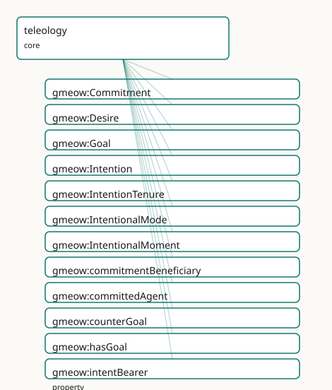

<!-- GENERATED by gmeow ontology-docs. DO NOT EDIT. Source hash: c99d8d50c0344040. -->

# GMEOW Teleology Module

- **IRI:** <https://blackcatinformatics.ca/gmeow/slices/teleology>
- **Tier:** core
- **[`Group`](../reference/classes/gmeow-Group.md):** core

## What This Slice Covers

This slice owns 17 terms and contributes 0 mapping or projection rows. Use it when its terms match the native fact you want to preserve; use the linkage tables to see how those facts leave GMEOW for consumer vocabularies.

## Dependencies

- [`gmeow:slices/events`](events.md)
- [`gmeow:slices/kernel`](kernel.md)
- [`gmeow:slices/temporal`](temporal.md)

## Consumers

- The agent-memory flagship (an agent recording its own goals across sessions — [Principle 14](https://github.com/Blackcat-Informatics/gmeow-ontology/blob/main/CONSTITUTION.md#principle-14)) and the lbox principia importer (EPIC: 21-goal hierarchy with counter-goals and tier tenure). The norms extension ranges [`prescribedConduct`](../reference/properties/gmeow-prescribedConduct.md) over [`Goal`](../reference/classes/gmeow-Goal.md).

## Local Map

## Terms

### Classes

| Term | Label | Definition |
|---|---|---|
| [`gmeow:Commitment`](../reference/classes/gmeow-Commitment.md) | Commitment | A social commitment — an agent committed toward at least one other agent to bring about a goal (UFO-C: social moment). A relator, not a mode: it mediates the c... |
| [`gmeow:Desire`](../reference/classes/gmeow-Desire.md) | Desire | An intentional mode of wanting without commitment — the agent would welcome the goal's satisfaction but has not committed to pursuing it (UFO-C: desire). Inher... |
| [`gmeow:Goal`](../reference/classes/gmeow-Goal.md) | Goal | A described state of affairs that an agent may want, intend, or commit to bring about — the propositional content of the intentional modes, existing by social... |
| [`gmeow:Intention`](../reference/classes/gmeow-Intention.md) | Intention | An intentional mode of internal commitment — the agent has settled on pursuing the goal (UFO-C: intention), though no other agent holds them to it. Inheres in... |
| [`gmeow:IntentionTenure`](../reference/classes/gmeow-IntentionTenure.md) | Intention Tenure | The reified, time-scoped fact that an agent held an intentional mode over an interval — a goal adopted in January and abandoned in June is an opened-then-close... |
| [`gmeow:IntentionalMode`](../reference/classes/gmeow-IntentionalMode.md) | Intentional Mode | The abstract category of intrinsic intentional moments — desires and intentions — that inhere in exactly one agent and aim at a goal. The intrinsic branch of g... |
| [`gmeow:IntentionalMoment`](../reference/classes/gmeow-IntentionalMoment.md) | Intentional Moment | The umbrella category of all goal-directed moments — UFO-C's intentional moment, spanning the intrinsic branch ([`gmeow:IntentionalMode`](../reference/classes/gmeow-IntentionalMode.md): desires and intentions i... |

### Properties

| Term | Label | Definition |
|---|---|---|
| [`gmeow:commitmentBeneficiary`](../reference/properties/gmeow-commitmentBeneficiary.md) | commitment beneficiary | An agent toward whom the commitment is made. NOT functional: a commitment may be made toward several beneficiaries at once. Must be distinct from the committed... |
| [`gmeow:committedAgent`](../reference/properties/gmeow-committedAgent.md) | committed agent | The agent bound by a commitment — the one who has committed. Functional: one commitment, one committed agent; mutual promises are two Commitments, one in each... |
| [`gmeow:counterGoal`](../reference/properties/gmeow-counterGoal.md) | counter-goal | Constitutive opposition between goals — the named shadow that partly defines what the goal means (an oath and its betrayal; a bond and its dissolution). Symmet... |
| [`gmeow:hasGoal`](../reference/properties/gmeow-hasGoal.md) | has goal | Flat shortcut: the agent holds this goal, commitment grade unspecified. The 80% case ([Principle 4](https://github.com/Blackcat-Informatics/gmeow-ontology/blob/main/CONSTITUTION.md#principle-4)); promote to a Desire / Intention / Commitment when the grade... |
| [`gmeow:intentBearer`](../reference/properties/gmeow-intentBearer.md) | intent bearer | The agent in whom a desire or intention inheres. Functional: an intrinsic mode has exactly one bearer ([gUFO](../external/ontologies.md#target-gufo) inherence, asserted with GMEOW's own property by Pr... |
| [`gmeow:intentionGoal`](../reference/properties/gmeow-intentionGoal.md) | intention goal | The goal at which a desire, intention, or commitment aims — its propositional content. Functional: one mode, one goal; an agent pursuing five goals bears five... |
| [`gmeow:motivates`](../reference/properties/gmeow-motivates.md) | motivates | Relates a desire, intention, or commitment to an event the agent undertook (at least in part) because of it — the teleological reading of action. NOT functiona... |
| [`gmeow:satisfiedBy`](../reference/properties/gmeow-satisfiedBy.md) | satisfied by | Relates a goal to a situation that counts as achieving it. NOT functional: many situations may satisfy one goal, and disputed satisfaction is several coexistin... |
| [`gmeow:tenureAgent`](../reference/properties/gmeow-tenureAgent.md) | tenure agent | The agent whose intentional mode an intention-tenure records. Functional: one tenure, one agent. |
| [`gmeow:tenureIntention`](../reference/properties/gmeow-tenureIntention.md) | tenure intention | The desire or intention the tenure records the agent as holding over its interval. Functional: one tenure, one mode. Commitment tenure is carried by the Commit... |

## Guide

<!-- SPDX-FileCopyrightText: 2026 Blackcat Informatics® Inc. <paudley@blackcatinformatics.ca> -->
<!-- SPDX-License-Identifier: CC-BY-4.0 -->

# teleology

> **Slice:** `https://blackcatinformatics.ca/gmeow/slices/teleology` · **tier: core**

Goals, desires, intentions, and commitments — the UFO-C intentional-moment
trichotomy surfaced as GMEOW core (EPIC). Core by [Principle 16](https://github.com/Blackcat-Informatics/gmeow-ontology/blob/main/CONSTITUTION.md#principle-16)
commitment: an agent recording *its own* goals across sessions is a question
every AI system will face about itself, alongside identity and deception
epistemics.

## The commitment-graded trichotomy

| Grade | Class | Grounding | Bound to |
|---|---|---|---|
| wanted | [`gmeow:Desire`](../reference/classes/gmeow-Desire.md) | [`gufo:IntrinsicMode`](../external/terms.md#gufo-intrinsicmode) | one agent ([`intentBearer`](../reference/properties/gmeow-intentBearer.md)) |
| internally committed | [`gmeow:Intention`](../reference/classes/gmeow-Intention.md) | [`gufo:IntrinsicMode`](../external/terms.md#gufo-intrinsicmode) | one agent ([`intentBearer`](../reference/properties/gmeow-intentBearer.md)) |
| socially committed | [`gmeow:Commitment`](../reference/classes/gmeow-Commitment.md) | [`gufo:Relator`](../external/terms.md#gufo-relator) | committed agent + distinct beneficiaries |

All three sit under the named umbrella **[`gmeow:IntentionalMoment`](../reference/classes/gmeow-IntentionalMoment.md)** (UFO-C's
intentional moment), which exists so [`intentionGoal`](../reference/properties/gmeow-intentionGoal.md) and [`motivates`](../reference/properties/gmeow-motivates.md) carry a
generator-visible domain — anonymous union domains vanish from the LinkML /
GraphQL / TypeScript surface (review). All three aim at exactly one
**[`gmeow:Goal`](../reference/classes/gmeow-Goal.md)** ([`intentionGoal`](../reference/properties/gmeow-intentionGoal.md)) — the
propositional content, a [`SocialObject`](../reference/classes/gmeow-SocialObject.md) describing a state of affairs,
satisfied by situations ([`satisfiedBy`](../reference/properties/gmeow-satisfiedBy.md), vantage-indexed satisfaction). DOLCE
DnS arrives at the same description-satisfied-by-situations shape
independently; [IAO](../external/ontologies.md#target-iao)'s *objective specification* is the BFO-world counterpart.
Both are alignment targets (linkage-grade, never imported axioms), deferred
with the rest of the alignment set to keep this landing pure-ontology — the
target list is fixed in: [PROV](../external/ontologies.md#target-prov) `Plan`/`hadPlan`, [P-Plan](../external/ontologies.md#target-pplan), [FIBO FND-GAO](../external/ontologies.md#target-fibo-fnd-pas-ps),
[IAO](../external/ontologies.md#target-iao), [SUMO](../external/ontologies.md#target-sumo) `desires`/`intends`, [CCO](../external/ontologies.md#target-cco) `Objective`, [CRM](../external/ontologies.md#target-crm) P20/P21,
[ConceptNet/ATOMIC](../external/ontologies.md#target-conceptnet); Wikidata goal **[Q4503831](https://www.wikidata.org/wiki/Q4503831)** (verified 2026-06-11).

## Doctrine highlights

- **[`counterGoal`](../reference/properties/gmeow-counterGoal.md) is constitutive, not lexical** — the named shadow that
 partly defines the goal (an oath ↔ its betrayal). Symmetric, irreflexive
 (SHACL). Use `cn:Antonym`-grade opposition elsewhere.
- **No global satisfaction verdicts** ([Principle 9](https://github.com/Blackcat-Informatics/gmeow-ontology/blob/main/CONSTITUTION.md#principle-9)): [`satisfiedBy`](../reference/properties/gmeow-satisfiedBy.md),
 [`motivates`](../reference/properties/gmeow-motivates.md), and goal-attribution all ride [`accordingTo`](../reference/properties/gmeow-accordingTo.md) on the statement.
 Avowed goals (agent's own vantage, top authority for its own standpoint)
 and attributed goals (observer vantage) coexist.
- **Flat-first** ([Principle 4](https://github.com/Blackcat-Informatics/gmeow-ontology/blob/main/CONSTITUTION.md#principle-4)): [`hasGoal`](../reference/properties/gmeow-hasGoal.md) for the 80% case →
 [`Desire`](../reference/classes/gmeow-Desire.md)/Intention/Commitment when grade matters → [`IntentionTenure`](../reference/classes/gmeow-IntentionTenure.md)
 (the [`StandpointTenure`](../reference/classes/gmeow-StandpointTenure.md) idiom) when adoption/revision over time is the fact
 of interest. Revision by suppression, never deletion ([Principle 10](https://github.com/Blackcat-Informatics/gmeow-ontology/blob/main/CONSTITUTION.md#principle-10)).
- **Solver boundary** ([Principle 12](https://github.com/Blackcat-Informatics/gmeow-ontology/blob/main/CONSTITUTION.md#principle-12)): goal decomposition, planning, and
 means–end reasoning are never triples.
- **Deontic force lives in the norms extension **, which ranges
 [`prescribedConduct`](../reference/properties/gmeow-prescribedConduct.md) over [`Goal`](../reference/classes/gmeow-Goal.md) — dependency points extension → core only.
