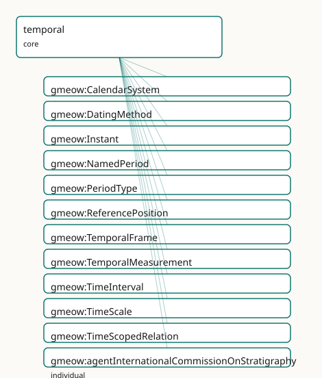

<!-- GENERATED by gmeow ontology-docs. DO NOT EDIT. -->

# GMEOW Temporal — intervals, instants, temporal frames, time-scoped relations

- **IRI:** <https://blackcatinformatics.ca/gmeow/slices/temporal>
- **Tier:** core
- **[`Group`](../reference/classes/gmeow-Group.md):** core

## What This Slice Covers

This slice owns 113 terms and contributes 92 mapping or projection rows. Use it when its terms match the native fact you want to preserve; use the linkage tables to see how those facts leave GMEOW for consumer vocabularies.

## Dependencies

- [`gmeow:slices/kernel`](kernel.md)
- [`gmeow:slices/profiles`](profiles.md)

## Consumers

- Every slice carrying time-scoped facts (tenures, residences, validity); the statement layer's [`validFrom`](../reference/properties/gmeow-validFrom.md)/validUntil; the calendar slice; the mail corpus.

## Local Map



## Examples

### Intervals And Frames

- **Source:** [`slices/core/temporal/examples/intervals-and-frames.ttl`](https://github.com/Blackcat-Informatics/gmeow-ontology/blob/main/slices/core/temporal/examples/intervals-and-frames.ttl)
- **GMEOW terms:** [`gmeow:Instant`](../reference/classes/gmeow-Instant.md), [`gmeow:TimeInterval`](../reference/classes/gmeow-TimeInterval.md), [`gmeow:hasEndInstant`](../reference/properties/gmeow-hasEndInstant.md), [`gmeow:hasStartInstant`](../reference/properties/gmeow-hasStartInstant.md), [`gmeow:hasTemporalFrame`](../reference/properties/gmeow-hasTemporalFrame.md), [`gmeow:inTemporalFrame`](../reference/properties/gmeow-inTemporalFrame.md), [`gmeow:instantValue`](../reference/properties/gmeow-instantValue.md), [`gmeow:intervalMeets`](../reference/properties/gmeow-intervalMeets.md), [`gmeow:temporalFrameUTCGregorian`](../reference/individuals/gmeow-temporalFrameUTCGregorian.md), [`gmeow:temporalFrameUTCHebrew`](../reference/individuals/gmeow-temporalFrameUTCHebrew.md)
- **External prefixes:** `xsd`

```turtle
# SPDX-FileCopyrightText: 2026 Blackcat Informatics® Inc. <paudley@blackcatinformatics.ca>
# SPDX-License-Identifier: CC-BY-4.0
#
# Worked example: time under explicit frames . Every crisp Instant is
# asserted relative to a TemporalFrame (Principle 11) — a bare "10:00:00Z" is
# ill-formed without saying which time scale and calendar interpret it. Two
# intervals (a conference talk and its Q&A) are built from begin/end Instants and
# related by an Allen relation (the talk is intervalBefore the Q&A). A third
# instant, the same wall-clock moment expressed in the Hebrew-calendar civil
# frame, shows that the frame — not the literal — carries the calendar.
@prefix gmeow: <https://blackcatinformatics.ca/gmeow/> .
@prefix ex:    <https://blackcatinformatics.ca/gmeow/examples/temporal/> .
@prefix xsd:   <http://www.w3.org/2001/XMLSchema#> .

# --- The talk interval: begin and end Instants, each in the UTC/Gregorian frame.
ex:talkStart a gmeow:Instant ;
    gmeow:instantValue "2026-09-14T13:00:00Z"^^xsd:dateTime ;
    gmeow:inTemporalFrame gmeow:temporalFrameUTCGregorian .

ex:talkEnd a gmeow:Instant ;
    gmeow:instantValue "2026-09-14T13:45:00Z"^^xsd:dateTime ;
    gmeow:inTemporalFrame gmeow:temporalFrameUTCGregorian .

ex:talkInterval a gmeow:TimeInterval ;
    gmeow:hasStartInstant ex:talkStart ;
    gmeow:hasEndInstant ex:talkEnd ;
    gmeow:hasTemporalFrame gmeow:temporalFrameUTCGregorian .

# --- The Q&A interval, immediately after.
ex:qaStart a gmeow:Instant ;
    gmeow:instantValue "2026-09-14T13:45:00Z"^^xsd:dateTime ;
    gmeow:inTemporalFrame gmeow:temporalFrameUTCGregorian .

ex:qaEnd a gmeow:Instant ;
    gmeow:instantValue "2026-09-14T14:00:00Z"^^xsd:dateTime ;
    gmeow:inTemporalFrame gmeow:temporalFrameUTCGregorian .

ex:qaInterval a gmeow:TimeInterval ;
    gmeow:hasStartInstant ex:qaStart ;
    gmeow:hasEndInstant ex:qaEnd ;
    gmeow:hasTemporalFrame gmeow:temporalFrameUTCGregorian .

# --- Allen relation: the talk's end instant is exactly the Q&A's start instant
#     (13:45:00Z), so they MEET — adjacency, not Allen "before" (which would need
#     a gap between them).
ex:talkInterval gmeow:intervalMeets ex:qaInterval .

# --- The SAME wall-clock moment as the talk's start, but read in the Hebrew
#     civil-time frame: identical instant value, different interpreting frame —
#     the frame, not the literal, names the calendar (P11).
ex:talkStartHebrew a gmeow:Instant ;
    gmeow:instantValue "2026-09-14T13:00:00Z"^^xsd:dateTime ;
    gmeow:inTemporalFrame gmeow:temporalFrameUTCHebrew .
```

## Terms

### Classes

| Term | Label | Definition |
|---|---|---|
| [`gmeow:CalendarSystem`](../reference/classes/gmeow-CalendarSystem.md) | Calendar System | The rules mapping a time scale to human-readable dates. Co-equal: Gregorian is one peer among Julian, Hebrew, Islamic, Chinese, Persian, Ethiopian, Coptic, ISO... |
| [`gmeow:DatingMethod`](../reference/classes/gmeow-DatingMethod.md) | Dating Method | The method used to derive a temporal measurement — radiocarbon, dendrochronology, thermoluminescence, etc. A value, never a subclass. Specialises gmeow:Observa... |
| [`gmeow:Instant`](../reference/classes/gmeow-Instant.md) | Instant | A zero-duration point in time, distinct from a TimeInterval. Carries a crisp instantValue ([xsd:dateTime](http://www.w3.org/2001/XMLSchema#dateTime)) and/or an edtfValue (EDTF literal) relative to a Tempo... |
| [`gmeow:NamedPeriod`](../reference/classes/gmeow-NamedPeriod.md) | Named Period | A named stretch of time with defined bounds — a geologic era, historical dynasty, artistic period, fiscal year, or any other culturally salient temporal divisi... |
| [`gmeow:PeriodType`](../reference/classes/gmeow-PeriodType.md) | Period Type | The kind of a named period (geologic eon, era, period, epoch, age; historical dynasty, era; fiscal year). A value, never a subclass. |
| [`gmeow:ReferencePosition`](../reference/classes/gmeow-ReferencePosition.md) | Reference Position | The spatial locus, observatory, timezone, or planetary body relative to which a time is expressed — e.g. an observatory longitude for local sidereal time, an I... |
| [`gmeow:TemporalFrame`](../reference/classes/gmeow-TemporalFrame.md) | Temporal Frame | A reference system for expressing time — the temporal counterpart of [`gmeow:ReferenceFrame`](../reference/classes/gmeow-ReferenceFrame.md). Decomposed into a TimeScale, an optional CalendarSystem, and an opti... |
| [`gmeow:TemporalMeasurement`](../reference/classes/gmeow-TemporalMeasurement.md) | Temporal Measurement | A measured assignment of a date or age to an entity or sample, carrying the method, uncertainty, and determinacy. Now a subclass of [`gmeow:Measurement`](../reference/classes/gmeow-Measurement.md) (and ther... |
| [`gmeow:TimeInterval`](../reference/classes/gmeow-TimeInterval.md) | Time Interval | A bounded stretch of time, optionally open-ended, delimited by a start and/or end instant. |
| [`gmeow:TimeScale`](../reference/classes/gmeow-TimeScale.md) | Time Scale | The atomic progression of time — TAI, TT, UTC, GPS, UT1, TDB, etc. A time scale is independent of any calendar or geographic reference position. |
| [`gmeow:TimeScopedRelation`](../reference/classes/gmeow-TimeScopedRelation.md) | Time-Scoped Relation | A reified relationship that holds only over a particular time interval — the base for residence, tenure, and membership-over-time situations. |

### Properties

| Term | Label | Definition |
|---|---|---|
| [`gmeow:assertedAt`](../reference/properties/gmeow-assertedAt.md) | asserted at | The instant an agent observed or asserted the annotated claim (e.g. an email Date header or a vCard REV) — a witness that the fact held at that instant. Distin... |
| [`gmeow:atTime`](../reference/properties/gmeow-atTime.md) | at time | The instant at which a point-like event or observation occurred. |
| [`gmeow:duringInterval`](../reference/properties/gmeow-duringInterval.md) | during interval | Relates a time-scoped relation to the interval over which it holds. |
| [`gmeow:edtfValue`](../reference/properties/gmeow-edtfValue.md) | EDTF value | An ISO 8601-2 (EDTF) expression of an instant or interval, stored as a plain literal. EDTF parsing and normalization are solver-layer concerns ([Principle 12](https://github.com/Blackcat-Informatics/gmeow-ontology/blob/main/CONSTITUTION.md#principle-12)). |
| [`gmeow:endedAtTime`](../reference/properties/gmeow-endedAtTime.md) | ended at time | The instant at which a time interval ends; absent if the interval is still open. |
| [`gmeow:frameCalendarSystem`](../reference/properties/gmeow-frameCalendarSystem.md) | frame calendar system | The calendar system of a temporal frame, when one is used. Optional: some frames (e.g. Julian Date) carry only a scale. |
| [`gmeow:frameReferencePosition`](../reference/properties/gmeow-frameReferencePosition.md) | frame reference position | The reference position of a temporal frame, when one is needed. Optional: TAI needs none; civil time needs a timezone. |
| [`gmeow:frameTimeScale`](../reference/properties/gmeow-frameTimeScale.md) | frame time scale | The time scale of a temporal frame (functional: a frame has exactly one scale). |
| [`gmeow:hasEndInstant`](../reference/properties/gmeow-hasEndInstant.md) | has end instant | The end instant of a time interval; absent if the interval is open-ended. |
| [`gmeow:hasStartInstant`](../reference/properties/gmeow-hasStartInstant.md) | has start instant | The start instant of a time interval. |
| [`gmeow:hasTemporalFrame`](../reference/properties/gmeow-hasTemporalFrame.md) | has temporal frame | Relates a time interval to the temporal frame in which its bounds are expressed. |
| [`gmeow:hasTemporalMeasurement`](../reference/properties/gmeow-hasTemporalMeasurement.md) | has temporal measurement | Relates an entity (event, artifact, place, sample) to a temporal measurement assigned to it. |
| [`gmeow:inTemporalFrame`](../reference/properties/gmeow-inTemporalFrame.md) | in temporal frame | Relates an instant to the temporal frame in which its value is expressed. |
| [`gmeow:instantValue`](../reference/properties/gmeow-instantValue.md) | instant value | The crisp instant as an [xsd:dateTime](http://www.w3.org/2001/XMLSchema#dateTime) literal in the associated temporal frame. |
| [`gmeow:intervalAfter`](../reference/properties/gmeow-intervalAfter.md) | interval after | Allen AFTER: this interval begins strictly after the related interval ends. Transitive inverse of [`gmeow:intervalBefore`](../reference/properties/gmeow-intervalBefore.md). (= [time:intervalAfter](http://www.w3.org/2006/time#intervalAfter)) |
| [`gmeow:intervalBefore`](../reference/properties/gmeow-intervalBefore.md) | interval before | Allen BEFORE: this interval ends strictly before the related interval begins. Transitive. Inverse of [`gmeow:intervalAfter`](../reference/properties/gmeow-intervalAfter.md). (= [time:intervalBefore](http://www.w3.org/2006/time#intervalBefore)) |
| [`gmeow:intervalCoincidesWith`](../reference/properties/gmeow-intervalCoincidesWith.md) | interval coincides with | Allen EQUALS: this interval and the related interval share the same temporal extent. Symmetric and transitive. TEMPORAL simultaneity only, never identity of th... |
| [`gmeow:intervalContains`](../reference/properties/gmeow-intervalContains.md) | interval contains | Allen CONTAINS: this interval's extent strictly contains the related interval's extent. Transitive inverse of [`gmeow:intervalDuring`](../reference/properties/gmeow-intervalDuring.md). (= [time:intervalContains](http://www.w3.org/2006/time#intervalContains)) |
| [`gmeow:intervalDuring`](../reference/properties/gmeow-intervalDuring.md) | interval during | Allen DURING: this interval's extent falls strictly within the related interval's extent. Transitive. Inverse of [`gmeow:intervalContains`](../reference/properties/gmeow-intervalContains.md). (= [time:intervalDuring](http://www.w3.org/2006/time#intervalDuring)) |
| [`gmeow:intervalFinishedBy`](../reference/properties/gmeow-intervalFinishedBy.md) | interval finished by | Allen FINISHED-BY: inverse of [`gmeow:intervalFinishes`](../reference/properties/gmeow-intervalFinishes.md). (= [time:intervalFinishedBy](http://www.w3.org/2006/time#intervalFinishedBy)) |
| [`gmeow:intervalFinishes`](../reference/properties/gmeow-intervalFinishes.md) | interval finishes | Allen FINISHES: this interval and the related interval end together, and this one began later. NOT transitive. Inverse of [`gmeow:intervalFinishedBy`](../reference/properties/gmeow-intervalFinishedBy.md). (= [time:int...](http://www.w3.org/2006/time#int...) |
| [`gmeow:intervalMeets`](../reference/properties/gmeow-intervalMeets.md) | interval meets | Allen MEETS: this interval ends exactly when the related interval begins. NOT transitive. Inverse of [`gmeow:intervalMetBy`](../reference/properties/gmeow-intervalMetBy.md). (= [time:intervalMeets](http://www.w3.org/2006/time#intervalMeets)) |
| [`gmeow:intervalMetBy`](../reference/properties/gmeow-intervalMetBy.md) | interval met by | Allen MET-BY: inverse of [`gmeow:intervalMeets`](../reference/properties/gmeow-intervalMeets.md). (= [time:intervalMetBy](http://www.w3.org/2006/time#intervalMetBy)) |
| [`gmeow:intervalOverlappedBy`](../reference/properties/gmeow-intervalOverlappedBy.md) | interval overlapped by | Allen OVERLAPPED-BY: inverse of [`gmeow:intervalOverlaps`](../reference/properties/gmeow-intervalOverlaps.md). (= [time:intervalOverlappedBy](http://www.w3.org/2006/time#intervalOverlappedBy)) |
| [`gmeow:intervalOverlaps`](../reference/properties/gmeow-intervalOverlaps.md) | interval overlaps | Allen OVERLAPS: this interval begins before and ends during the related interval. NOT transitive. Inverse of [`gmeow:intervalOverlappedBy`](../reference/properties/gmeow-intervalOverlappedBy.md). (= [time:intervalOverla...](http://www.w3.org/2006/time#intervalOverla...) |
| [`gmeow:intervalStartedBy`](../reference/properties/gmeow-intervalStartedBy.md) | interval started by | Allen STARTED-BY: inverse of [`gmeow:intervalStarts`](../reference/properties/gmeow-intervalStarts.md). (= [time:intervalStartedBy](http://www.w3.org/2006/time#intervalStartedBy)) |
| [`gmeow:intervalStarts`](../reference/properties/gmeow-intervalStarts.md) | interval starts | Allen STARTS: this interval and the related interval begin together, and this one ends first. NOT transitive. Inverse of [`gmeow:intervalStartedBy`](../reference/properties/gmeow-intervalStartedBy.md). (= [time:inter...](http://www.w3.org/2006/time#inter...) |
| [`gmeow:measuredAge`](../reference/properties/gmeow-measuredAge.md) | measured age | The numeric age yielded by a temporal measurement, in the unit given by [`gmeow:hasUnit`](../reference/properties/gmeow-hasUnit.md). |
| [`gmeow:measuredDate`](../reference/properties/gmeow-measuredDate.md) | measured date | The absolute date instant yielded by a temporal measurement. Semantically plays the observationResult role for TemporalMeasurement, but is NOT asserted as rdfs... |
| [`gmeow:measurementDeterminacy`](../reference/properties/gmeow-measurementDeterminacy.md) | measurement determinacy | The ontic determinacy model of a temporal measurement — crisp, vague, fuzzy, probabilistic, or disputed. Bridges to [`gmeow:hasDeterminacy`](../reference/properties/gmeow-hasDeterminacy.md) ([rdfs:subPropertyOf](http://www.w3.org/2000/01/rdf-schema#subPropertyOf)) s... |
| [`gmeow:measurementMethod`](../reference/properties/gmeow-measurementMethod.md) | measurement method | The dating method used for a temporal measurement. Bridges to [`gmeow:observationMethod`](../reference/properties/gmeow-observationMethod.md) ([rdfs:subPropertyOf](http://www.w3.org/2000/01/rdf-schema#subPropertyOf)) so generic consumers can query all observations by m... |
| [`gmeow:measurementUncertainty`](../reference/properties/gmeow-measurementUncertainty.md) | measurement uncertainty | The uncertainty (e.g. ±1 sigma) of a temporal measurement, in the same unit as the measured age. |
| [`gmeow:periodContainsPeriod`](../reference/properties/gmeow-periodContainsPeriod.md) | period contains period | The transitive inverse of [`gmeow:periodPartOf`](../reference/properties/gmeow-periodPartOf.md). |
| [`gmeow:periodEnd`](../reference/properties/gmeow-periodEnd.md) | period end | The instant at which a named period ends. |
| [`gmeow:periodPartOf`](../reference/properties/gmeow-periodPartOf.md) | period part of | Relates a named period to a larger named period that contains it (e.g. Holocene ⊂ Quaternary ⊂ Cenozoic). Transitive. |
| [`gmeow:periodStart`](../reference/properties/gmeow-periodStart.md) | period start | The instant at which a named period begins. Functional nature removed because the property chain below makes periodStart non-simple, and OWL 2 DL forbids non-s... |
| [`gmeow:periodType`](../reference/properties/gmeow-periodType.md) | period type | The kind(s) of a named period. Non-functional: competing classifications coexist. |
| [`gmeow:recordedNoLaterThan`](../reference/properties/gmeow-recordedNoLaterThan.md) | recorded no later than | A DERIVED upper bound (terminus ante quem) on when the annotated claim was committed to a record — typically taken from the modification time of its source car... |
| [`gmeow:startedAtTime`](../reference/properties/gmeow-startedAtTime.md) | started at time | The instant at which a time interval begins. |
| [`gmeow:validFrom`](../reference/properties/gmeow-validFrom.md) | valid from | The instant from which the annotated statement is asserted to hold. |
| [`gmeow:validUntil`](../reference/properties/gmeow-validUntil.md) | valid until | The instant until which the annotated statement is asserted to hold. |

### Individuals

| Term | Label | Definition |
|---|---|---|
| [`gmeow:agentInternationalCommissionOnStratigraphy`](../reference/individuals/gmeow-agentInternationalCommissionOnStratigraphy.md) | International Commission on Stratigraphy | The International Commission on Stratigraphy (ICS), the global scientific authority for definition and nomenclature of geologic time units. |
| [`gmeow:calendarChinese`](../reference/individuals/gmeow-calendarChinese.md) | Chinese calendar | The lunisolar Chinese calendar. |
| [`gmeow:calendarCoptic`](../reference/individuals/gmeow-calendarCoptic.md) | Coptic calendar | The Coptic calendar. |
| [`gmeow:calendarEthiopian`](../reference/individuals/gmeow-calendarEthiopian.md) | Ethiopian calendar | The Ethiopian calendar, similar to the Coptic. |
| [`gmeow:calendarGregorian`](../reference/individuals/gmeow-calendarGregorian.md) | Gregorian calendar | The Gregorian calendar, introduced 1582. |
| [`gmeow:calendarHebrew`](../reference/individuals/gmeow-calendarHebrew.md) | Hebrew calendar | The lunisolar Hebrew calendar. |
| [`gmeow:calendarISOWeek`](../reference/individuals/gmeow-calendarISOWeek.md) | ISO week date | The ISO 8601 week-numbering calendar. |
| [`gmeow:calendarIslamic`](../reference/individuals/gmeow-calendarIslamic.md) | Islamic (Hijri) calendar | The lunar Islamic calendar. |
| [`gmeow:calendarJulian`](../reference/individuals/gmeow-calendarJulian.md) | Julian calendar | The Julian calendar, predecessor to the Gregorian. |
| [`gmeow:calendarPersian`](../reference/individuals/gmeow-calendarPersian.md) | Persian (Solar Hijri) calendar | The solar Persian calendar. |
| [`gmeow:datingMethodAminoAcidRacemization`](../reference/individuals/gmeow-datingMethodAminoAcidRacemization.md) | amino acid racemization | The amino acid racemization dating method — a scientific technique used to estimate the age of an object, stratum, or event. |
| [`gmeow:datingMethodDendrochronology`](../reference/individuals/gmeow-datingMethodDendrochronology.md) | dendrochronology | The dendrochronology dating method — a scientific technique used to estimate the age of an object, stratum, or event. |
| [`gmeow:datingMethodElectronSpinResonance`](../reference/individuals/gmeow-datingMethodElectronSpinResonance.md) | electron spin resonance (ESR) | The electron spin resonance dating method — a scientific technique used to estimate the age of an object, stratum, or event. |
| [`gmeow:datingMethodOpticallyStimulatedLuminescence`](../reference/individuals/gmeow-datingMethodOpticallyStimulatedLuminescence.md) | optically stimulated luminescence (OSL) | The optically stimulated luminescence dating method — a scientific technique used to estimate the age of an object, stratum, or event. |
| [`gmeow:datingMethodPaleomagnetism`](../reference/individuals/gmeow-datingMethodPaleomagnetism.md) | paleomagnetism | The paleomagnetism dating method — a scientific technique used to estimate the age of an object, stratum, or event. |
| [`gmeow:datingMethodPotassiumArgon`](../reference/individuals/gmeow-datingMethodPotassiumArgon.md) | potassium-argon (K-Ar) | The potassium argon dating method — a scientific technique used to estimate the age of an object, stratum, or event. |
| [`gmeow:datingMethodRadiocarbon`](../reference/individuals/gmeow-datingMethodRadiocarbon.md) | radiocarbon dating (14C) | The radiocarbon dating method — a scientific technique used to estimate the age of an object, stratum, or event. |
| [`gmeow:datingMethodStratigraphicCorrelation`](../reference/individuals/gmeow-datingMethodStratigraphicCorrelation.md) | stratigraphic correlation | The stratigraphic correlation dating method — a scientific technique used to estimate the age of an object, stratum, or event. |
| [`gmeow:datingMethodThermoluminescence`](../reference/individuals/gmeow-datingMethodThermoluminescence.md) | thermoluminescence | The thermoluminescence dating method — a scientific technique used to estimate the age of an object, stratum, or event. |
| [`gmeow:datingMethodUraniumLead`](../reference/individuals/gmeow-datingMethodUraniumLead.md) | uranium-lead (U-Pb) | The uranium lead dating method — a scientific technique used to estimate the age of an object, stratum, or event. |
| [`gmeow:granularityCentury`](../reference/individuals/gmeow-granularityCentury.md) | century level | The century granularity level — a resolution at which a value may be disclosed or coarsened ([Principle 10](https://github.com/Blackcat-Informatics/gmeow-ontology/blob/main/CONSTITUTION.md#principle-10)). |
| [`gmeow:granularityDay`](../reference/individuals/gmeow-granularityDay.md) | day level | The day granularity level — a resolution at which a value may be disclosed or coarsened ([Principle 10](https://github.com/Blackcat-Informatics/gmeow-ontology/blob/main/CONSTITUTION.md#principle-10)). |
| [`gmeow:granularityDecade`](../reference/individuals/gmeow-granularityDecade.md) | decade level | The decade granularity level — a resolution at which a value may be disclosed or coarsened ([Principle 10](https://github.com/Blackcat-Informatics/gmeow-ontology/blob/main/CONSTITUTION.md#principle-10)). |
| [`gmeow:granularityMonth`](../reference/individuals/gmeow-granularityMonth.md) | month level | The month granularity level — a resolution at which a value may be disclosed or coarsened ([Principle 10](https://github.com/Blackcat-Informatics/gmeow-ontology/blob/main/CONSTITUTION.md#principle-10)). |
| [`gmeow:granularityYear`](../reference/individuals/gmeow-granularityYear.md) | year level | The year granularity level — a resolution at which a value may be disclosed or coarsened ([Principle 10](https://github.com/Blackcat-Informatics/gmeow-ontology/blob/main/CONSTITUTION.md#principle-10)). |
| [`gmeow:measurementCenozoicStart`](../reference/individuals/gmeow-measurementCenozoicStart.md) | Cenozoic start age | The cenozoic start temporal measurement — a measured boundary value expressed in a particular temporal reference frame. |
| [`gmeow:measurementHoloceneStart`](../reference/individuals/gmeow-measurementHoloceneStart.md) | Holocene start age | The holocene start temporal measurement — a measured boundary value expressed in a particular temporal reference frame. |
| [`gmeow:measurementPhanerozoicStart`](../reference/individuals/gmeow-measurementPhanerozoicStart.md) | Phanerozoic start age | The phanerozoic start temporal measurement — a measured boundary value expressed in a particular temporal reference frame. |
| [`gmeow:measurementQuaternaryStart`](../reference/individuals/gmeow-measurementQuaternaryStart.md) | Quaternary start age | The quaternary start temporal measurement — a measured boundary value expressed in a particular temporal reference frame. |
| [`gmeow:periodCenozoic`](../reference/individuals/gmeow-periodCenozoic.md) | Cenozoic Era | The cenozoic named period — a conventional geological, historical, or fiscal interval with defined boundaries. |
| [`gmeow:periodHolocene`](../reference/individuals/gmeow-periodHolocene.md) | Holocene Epoch | The holocene named period — a conventional geological, historical, or fiscal interval with defined boundaries. |
| [`gmeow:periodPhanerozoic`](../reference/individuals/gmeow-periodPhanerozoic.md) | Phanerozoic Eon | The phanerozoic named period — a conventional geological, historical, or fiscal interval with defined boundaries. |
| [`gmeow:periodQuaternary`](../reference/individuals/gmeow-periodQuaternary.md) | Quaternary Period | The quaternary named period — a conventional geological, historical, or fiscal interval with defined boundaries. |
| [`gmeow:periodTypeFiscalYear`](../reference/individuals/gmeow-periodTypeFiscalYear.md) | fiscal year | The fiscal year period type — a classification of a named or bounded interval by the domain that defines it. |
| [`gmeow:periodTypeGeologicAge`](../reference/individuals/gmeow-periodTypeGeologicAge.md) | geologic age | The geologic age period type — a classification of a named or bounded interval by the domain that defines it. |
| [`gmeow:periodTypeGeologicEon`](../reference/individuals/gmeow-periodTypeGeologicEon.md) | geologic eon | The geologic eon period type — a classification of a named or bounded interval by the domain that defines it. |
| [`gmeow:periodTypeGeologicEpoch`](../reference/individuals/gmeow-periodTypeGeologicEpoch.md) | geologic epoch | The geologic epoch period type — a classification of a named or bounded interval by the domain that defines it. |
| [`gmeow:periodTypeGeologicEra`](../reference/individuals/gmeow-periodTypeGeologicEra.md) | geologic era | The geologic era period type — a classification of a named or bounded interval by the domain that defines it. |
| [`gmeow:periodTypeGeologicPeriod`](../reference/individuals/gmeow-periodTypeGeologicPeriod.md) | geologic period | The geologic period period type — a classification of a named or bounded interval by the domain that defines it. |
| [`gmeow:periodTypeHistoricalDynasty`](../reference/individuals/gmeow-periodTypeHistoricalDynasty.md) | historical dynasty | The historical dynasty period type — a classification of a named or bounded interval by the domain that defines it. |
| [`gmeow:periodTypeHistoricalEra`](../reference/individuals/gmeow-periodTypeHistoricalEra.md) | historical era | The historical era period type — a classification of a named or bounded interval by the domain that defines it. |
| [`gmeow:temporalFrameGPSGregorian`](../reference/individuals/gmeow-temporalFrameGPSGregorian.md) | GPS Gregorian (satellite time) | The GPS time scale on the Gregorian calendar — satellite-system time, offset from TAI. |
| [`gmeow:temporalFrameTAI`](../reference/individuals/gmeow-temporalFrameTAI.md) | TAI (atomic, no calendar) | The tai temporal frame — a named combination of timescale and calendar used to interpret temporal coordinates. |
| [`gmeow:temporalFrameTDBGregorian`](../reference/individuals/gmeow-temporalFrameTDBGregorian.md) | TDB Gregorian (barycentric) | The tdb gregorian temporal frame — a named combination of timescale and calendar used to interpret temporal coordinates. |
| [`gmeow:temporalFrameTTGregorian`](../reference/individuals/gmeow-temporalFrameTTGregorian.md) | TT Gregorian (dynamical) | The tt gregorian temporal frame — a named combination of timescale and calendar used to interpret temporal coordinates. |
| [`gmeow:temporalFrameUT1Gregorian`](../reference/individuals/gmeow-temporalFrameUT1Gregorian.md) | UT1 Gregorian (Earth-rotation time) | The UT1 (Earth-rotation) time scale on the Gregorian calendar — the basis for civil solar alignment. |
| [`gmeow:temporalFrameUTCChinese`](../reference/individuals/gmeow-temporalFrameUTCChinese.md) | UTC Chinese (civil time, Chinese calendar) | Civil time on the lunisolar Chinese calendar, interpreted in the UTC time scale. |
| [`gmeow:temporalFrameUTCCoptic`](../reference/individuals/gmeow-temporalFrameUTCCoptic.md) | UTC Coptic (civil time, Coptic calendar) | Civil time on the Coptic calendar, interpreted in the UTC time scale. |
| [`gmeow:temporalFrameUTCEthiopian`](../reference/individuals/gmeow-temporalFrameUTCEthiopian.md) | UTC Ethiopian (civil time, Ethiopian calendar) | Civil time on the Ethiopian calendar, interpreted in the UTC time scale. |
| [`gmeow:temporalFrameUTCGregorian`](../reference/individuals/gmeow-temporalFrameUTCGregorian.md) | UTC Gregorian (civil time) | The utc gregorian temporal frame — a named combination of timescale and calendar used to interpret temporal coordinates. |
| [`gmeow:temporalFrameUTCHebrew`](../reference/individuals/gmeow-temporalFrameUTCHebrew.md) | UTC Hebrew (civil time, Hebrew calendar) | Civil time on the lunisolar Hebrew calendar, interpreted in the UTC time scale. |
| [`gmeow:temporalFrameUTCISOWeek`](../reference/individuals/gmeow-temporalFrameUTCISOWeek.md) | UTC ISO week date (civil time, ISO 8601 week numbering) | Civil time on the ISO 8601 week-numbering calendar, interpreted in the UTC time scale. |
| [`gmeow:temporalFrameUTCIslamic`](../reference/individuals/gmeow-temporalFrameUTCIslamic.md) | UTC Islamic (civil time, Hijri calendar) | Civil time on the lunar Islamic (Hijri) calendar, interpreted in the UTC time scale. |
| [`gmeow:temporalFrameUTCJulian`](../reference/individuals/gmeow-temporalFrameUTCJulian.md) | UTC Julian (civil time, Julian calendar) | Civil time on the Julian calendar, interpreted in the UTC time scale. |
| [`gmeow:temporalFrameUTCPersian`](../reference/individuals/gmeow-temporalFrameUTCPersian.md) | UTC Persian (civil time, Solar Hijri calendar) | Civil time on the solar Persian (Solar Hijri) calendar, interpreted in the UTC time scale. |
| [`gmeow:timeScaleGPS`](../reference/individuals/gmeow-timeScaleGPS.md) | GPS Time | Atomic time scale used by GPS, offset from TAI. |
| [`gmeow:timeScaleTAI`](../reference/individuals/gmeow-timeScaleTAI.md) | International Atomic Time (TAI) | Atomic time scale based on SI seconds. |
| [`gmeow:timeScaleTDB`](../reference/individuals/gmeow-timeScaleTDB.md) | Barycentric Dynamical Time (TDB) | Dynamical time scale for solar-system barycentric calculations. |
| [`gmeow:timeScaleTT`](../reference/individuals/gmeow-timeScaleTT.md) | Terrestrial Time (TT) | Dynamical time scale for Earth-surface geocentric coordinate time. |
| [`gmeow:timeScaleUT1`](../reference/individuals/gmeow-timeScaleUT1.md) | Universal Time 1 (UT1) | Earth-rotation-based time scale; the basis for civil-time solar alignment. |
| [`gmeow:timeScaleUTC`](../reference/individuals/gmeow-timeScaleUTC.md) | Coordinated Universal Time (UTC) | Civil atomic time scale with leap seconds. |

## Linkages

- **Rows:** 92
- **Projection profiles:** `ical`, `owl-time`, `resume`, `schema-org`, `schema-org-schedule`
- **External vocabularies:** `crm`, `crmgeo`, `dcterms`, `edtf`, `gts`, `ical`, `ivoa`, `periodo`, `prov`, `rdf`, `schema`, `time`, `wd`

| Source | Kind | Profile | Predicate/Relation | Target | Evidence |
|---|---|---|---|---|---|
| [`gmeow:CalendarSystem`](../reference/classes/gmeow-CalendarSystem.md) | equivalence | `-` | [skos:closeMatch](http://www.w3.org/2004/02/skos/core#closeMatch) | [time:CalendarSystem](http://www.w3.org/2006/time#CalendarSystem) | `gmeow-temporal.sssom.tsv`; `gmeow:eqTemporal005`; confidence 0.9 |
| [`gmeow:CalendarSystem`](../reference/classes/gmeow-CalendarSystem.md) | equivalence | `-` | [skos:closeMatch](http://www.w3.org/2004/02/skos/core#closeMatch) | [wd:Q4036](https://www.wikidata.org/wiki/Q4036) | `gmeow-wikidata.sssom.tsv`; `gmeow:eqWikidata049`; confidence 0.85 |
| [`gmeow:DatingMethod`](../reference/classes/gmeow-DatingMethod.md) | equivalence | `-` | [skos:closeMatch](http://www.w3.org/2004/02/skos/core#closeMatch) | [crm:P33_used_specific_technique](http://www.cidoc-crm.org/cidoc-crm/P33_used_specific_technique) | `gmeow-temporal.sssom.tsv`; `gmeow:eqTemporal025e`; confidence 0.75 |
| [`gmeow:DatingMethod`](../reference/classes/gmeow-DatingMethod.md) | equivalence | `-` | [skos:closeMatch](http://www.w3.org/2004/02/skos/core#closeMatch) | [dcterms:method](http://purl.org/dc/terms/method) | `gmeow-temporal.sssom.tsv`; `gmeow:eqTemporal025d`; confidence 0.7 |
| [`gmeow:Instant`](../reference/classes/gmeow-Instant.md) | equivalence | `-` | [skos:closeMatch](http://www.w3.org/2004/02/skos/core#closeMatch) | [crm:E61_Time_Primitive](http://www.cidoc-crm.org/cidoc-crm/E61_Time_Primitive) | `gmeow-temporal.sssom.tsv`; `gmeow:eqTemporal008`; confidence 0.8 |
| [`gmeow:Instant`](../reference/classes/gmeow-Instant.md) | equivalence | `-` | [skos:closeMatch](http://www.w3.org/2004/02/skos/core#closeMatch) | [time:Instant](http://www.w3.org/2006/time#Instant) | `gmeow-temporal.sssom.tsv`; `gmeow:eqTemporal007`; confidence 0.95 |
| [`gmeow:NamedPeriod`](../reference/classes/gmeow-NamedPeriod.md) | equivalence | `-` | [skos:closeMatch](http://www.w3.org/2004/02/skos/core#closeMatch) | [crm:E4_Period](http://www.cidoc-crm.org/cidoc-crm/E4_Period) | `gmeow-temporal.sssom.tsv`; `gmeow:eqTemporal013`; confidence 0.8 |
| [`gmeow:NamedPeriod`](../reference/classes/gmeow-NamedPeriod.md) | equivalence | `-` | [skos:relatedMatch](http://www.w3.org/2004/02/skos/core#relatedMatch) | [periodo:Period](http://n2t.net/ark:/99152/Period) | `gmeow-temporal.sssom.tsv`; `gmeow:eqTemporal014`; confidence 0.7 |
| [`gmeow:NamedPeriod`](../reference/classes/gmeow-NamedPeriod.md) | equivalence | `-` | [skos:closeMatch](http://www.w3.org/2004/02/skos/core#closeMatch) | [time:ProperInterval](http://www.w3.org/2006/time#ProperInterval) | `gmeow-temporal.sssom.tsv`; `gmeow:eqTemporal012`; confidence 0.85 |
| [`gmeow:ReferencePosition`](../reference/classes/gmeow-ReferencePosition.md) | equivalence | `-` | [skos:relatedMatch](http://www.w3.org/2004/02/skos/core#relatedMatch) | [time:TimeZone](http://www.w3.org/2006/time#TimeZone) | `gmeow-temporal.sssom.tsv`; `gmeow:eqTemporal006`; confidence 0.6 |
| [`gmeow:TemporalFrame`](../reference/classes/gmeow-TemporalFrame.md) | equivalence | `-` | [skos:relatedMatch](http://www.w3.org/2004/02/skos/core#relatedMatch) | [crm:E52_Time-Span](http://www.cidoc-crm.org/cidoc-crm/E52_Time-Span) | `gmeow-temporal.sssom.tsv`; `gmeow:eqTemporal002`; confidence 0.6 |
| [`gmeow:TemporalFrame`](../reference/classes/gmeow-TemporalFrame.md) | equivalence | `-` | [skos:closeMatch](http://www.w3.org/2004/02/skos/core#closeMatch) | [crmgeo:SP13_Temporal_Reference_System](http://www.ics.forth.gr/isl/CRMgeo/SP13_Temporal_Reference_System) | `gmeow-temporal.sssom.tsv`; `gmeow:eqTemporal003`; confidence 0.8 |
| [`gmeow:TemporalFrame`](../reference/classes/gmeow-TemporalFrame.md) | equivalence | `-` | [skos:closeMatch](http://www.w3.org/2004/02/skos/core#closeMatch) | [time:TemporalReferenceSystem](http://www.w3.org/2006/time#TemporalReferenceSystem) | `gmeow-temporal.sssom.tsv`; `gmeow:eqTemporal001`; confidence 0.85 |
| [`gmeow:TemporalMeasurement`](../reference/classes/gmeow-TemporalMeasurement.md) | equivalence | `-` | [skos:closeMatch](http://www.w3.org/2004/02/skos/core#closeMatch) | [crm:E16_Measurement](http://www.cidoc-crm.org/cidoc-crm/E16_Measurement) | `gmeow-temporal.sssom.tsv`; `gmeow:eqTemporal022`; confidence 0.8 |
| [`gmeow:TimeScale`](../reference/classes/gmeow-TimeScale.md) | equivalence | `-` | [skos:closeMatch](http://www.w3.org/2004/02/skos/core#closeMatch) | [time:TRS](http://www.w3.org/2006/time#TRS) | `gmeow-temporal.sssom.tsv`; `gmeow:eqTemporal004`; confidence 0.85 |
| [`gmeow:assertedAt`](../reference/properties/gmeow-assertedAt.md) | equivalence | `-` | [skos:closeMatch](http://www.w3.org/2004/02/skos/core#closeMatch) | [prov:generatedAtTime](http://www.w3.org/ns/prov#generatedAtTime) | `gmeow-provenance.sssom.tsv`; `gmeow:eqProvenance009`; confidence 0.85 |
| [`gmeow:calendarChinese`](../reference/individuals/gmeow-calendarChinese.md) | equivalence | `-` | [skos:exactMatch](http://www.w3.org/2004/02/skos/core#exactMatch) | [wd:Q1851](https://www.wikidata.org/wiki/Q1851) | `gmeow-temporal.sssom.tsv`; `gmeow:eqTemporal034`; confidence 0.95 |
| [`gmeow:calendarGregorian`](../reference/individuals/gmeow-calendarGregorian.md) | equivalence | `-` | [skos:exactMatch](http://www.w3.org/2004/02/skos/core#exactMatch) | [wd:Q12132](https://www.wikidata.org/wiki/Q12132) | `gmeow-temporal.sssom.tsv`; `gmeow:eqTemporal030`; confidence 0.95 |
| [`gmeow:calendarHebrew`](../reference/individuals/gmeow-calendarHebrew.md) | equivalence | `-` | [skos:exactMatch](http://www.w3.org/2004/02/skos/core#exactMatch) | [wd:Q5776](https://www.wikidata.org/wiki/Q5776) | `gmeow-temporal.sssom.tsv`; `gmeow:eqTemporal032`; confidence 0.95 |
| [`gmeow:calendarIslamic`](../reference/individuals/gmeow-calendarIslamic.md) | equivalence | `-` | [skos:exactMatch](http://www.w3.org/2004/02/skos/core#exactMatch) | [wd:Q13184](https://www.wikidata.org/wiki/Q13184) | `gmeow-temporal.sssom.tsv`; `gmeow:eqTemporal033`; confidence 0.95 |
| [`gmeow:calendarJulian`](../reference/individuals/gmeow-calendarJulian.md) | equivalence | `-` | [skos:exactMatch](http://www.w3.org/2004/02/skos/core#exactMatch) | [wd:Q1986](https://www.wikidata.org/wiki/Q1986) | `gmeow-temporal.sssom.tsv`; `gmeow:eqTemporal031`; confidence 0.95 |
| [`gmeow:calendarPersian`](../reference/individuals/gmeow-calendarPersian.md) | equivalence | `-` | [skos:exactMatch](http://www.w3.org/2004/02/skos/core#exactMatch) | [wd:Q181229](https://www.wikidata.org/wiki/Q181229) | `gmeow-temporal.sssom.tsv`; `gmeow:eqTemporal035`; confidence 0.95 |
| [`gmeow:datingMethodDendrochronology`](../reference/individuals/gmeow-datingMethodDendrochronology.md) | equivalence | `-` | [skos:exactMatch](http://www.w3.org/2004/02/skos/core#exactMatch) | [wd:Q180439](https://www.wikidata.org/wiki/Q180439) | `gmeow-temporal.sssom.tsv`; `gmeow:eqTemporal027`; confidence 0.95 |
| [`gmeow:datingMethodPotassiumArgon`](../reference/individuals/gmeow-datingMethodPotassiumArgon.md) | equivalence | `-` | [skos:exactMatch](http://www.w3.org/2004/02/skos/core#exactMatch) | [wd:Q899981](https://www.wikidata.org/wiki/Q899981) | `gmeow-temporal.sssom.tsv`; `gmeow:eqTemporal028`; confidence 0.95 |
|... |... |... |... |... | 68 more rows |

## Guide

<!-- SPDX-FileCopyrightText: 2026 Blackcat Informatics® Inc. <paudley@blackcatinformatics.ca> -->
<!-- SPDX-License-Identifier: CC-BY-4.0 -->

# Temporal — intervals, instants, frames, and time-scoped facts

> **Slice:** `https://blackcatinformatics.ca/gmeow/slices/temporal` · **tier: core**
> The cross-cutting temporal facility: every slice that says *when* says it here.

Most vocabularies treat time as a literal: `dateOfBirth "1972-03-01"`. GMEOW treats a
temporal value the way it treats every value — **frame-relative** ([Principle 11](https://github.com/Blackcat-Informatics/gmeow-ontology/blob/main/CONSTITUTION.md#principle-11): a date is
meaningless without its calendar and timescale), **attributed** (a date is usually a *claim*
about when something happened), and **structural** (intervals relate to each other by
topology — the Allen algebra — independent of any frame). This slice provides the four
layers that follow from that stance:

1. **Structure** — intervals and instants, related by Allen relations.
2. **Frame** — the [`TemporalFrame`](../reference/classes/gmeow-TemporalFrame.md) (calendar + timescale + reference position) every
 temporal value is read in.
3. **Claim** — temporal *measurements* (a dated claim with method, uncertainty, and
 determinacy — radiocarbon dates and "circa" both live here, honestly).
4. **Scope** — the statement-layer clocks ([`validFrom`](../reference/properties/gmeow-validFrom.md)/[`validUntil`](../reference/properties/gmeow-validUntil.md)/[`assertedAt`](../reference/properties/gmeow-assertedAt.md)/
 [`recordedNoLaterThan`](../reference/properties/gmeow-recordedNoLaterThan.md)) that any fact in any slice can carry.

Heavy computation — interval-algebra closure, calendar conversion — is the solver layer's
job ([Principle 12](https://github.com/Blackcat-Informatics/gmeow-ontology/blob/main/CONSTITUTION.md#principle-12)): the slice models the relations; `gmeow temporal` (TQL, the parameterized
queries in `queries/tql/`) evaluates them. See
[`docs/temporal-queries.md`](../../../docs/temporal-queries.md) for the TQL reference.

## The structural layer

### [`gmeow:TimeInterval`](../reference/classes/gmeow-TimeInterval.md)

A bounded stretch of time, optionally open-ended, delimited by [`gmeow:hasStartInstant`](../reference/properties/gmeow-hasStartInstant.md) /
[`gmeow:hasEndInstant`](../reference/properties/gmeow-hasEndInstant.md). Intervals are *frame-independent structure*: two intervals can be
ordered ([`gmeow:intervalBefore`](../reference/properties/gmeow-intervalBefore.md)) even when their instants are expressed in different
calendars.

### [`gmeow:Instant`](../reference/classes/gmeow-Instant.md)

A point on a timeline. Carries at least one of [`gmeow:instantValue`](../reference/properties/gmeow-instantValue.md) (an [`xsd:dateTime`](http://www.w3.org/2001/XMLSchema#dateTime)) or
[`gmeow:edtfValue`](../reference/properties/gmeow-edtfValue.md) (an EDTF literal — for the approximate, uncertain, and partial dates real
data is full of), and links to its frame with [`gmeow:inTemporalFrame`](../reference/properties/gmeow-inTemporalFrame.md) when the default frame
does not apply. *(Shape-enforced: an instant without any value is rejected — see
`shapes.ttl` and `queries/verify/no-instant-without-value.rq`.)*

### The Allen relations

[`gmeow:intervalBefore`](../reference/properties/gmeow-intervalBefore.md) / [`intervalAfter`](../reference/properties/gmeow-intervalAfter.md) / [`intervalMeets`](../reference/properties/gmeow-intervalMeets.md) / [`intervalMetBy`](../reference/properties/gmeow-intervalMetBy.md) /
[`intervalOverlaps`](../reference/properties/gmeow-intervalOverlaps.md) / [`intervalOverlappedBy`](../reference/properties/gmeow-intervalOverlappedBy.md) / [`intervalStarts`](../reference/properties/gmeow-intervalStarts.md) / [`intervalStartedBy`](../reference/properties/gmeow-intervalStartedBy.md) /
[`intervalDuring`](../reference/properties/gmeow-intervalDuring.md) / [`intervalContains`](../reference/properties/gmeow-intervalContains.md) / [`intervalFinishes`](../reference/properties/gmeow-intervalFinishes.md) / [`intervalFinishedBy`](../reference/properties/gmeow-intervalFinishedBy.md) /
[`intervalCoincidesWith`](../reference/properties/gmeow-intervalCoincidesWith.md) — the thirteen jointly-exhaustive, pairwise-disjoint interval
relations. JEPD is gate-checked on the reasoned graph
(`queries/verify/no-jepd-violation.rq`); relation *composition* is computed by the solver,
never asserted ([Principle 12](https://github.com/Blackcat-Informatics/gmeow-ontology/blob/main/CONSTITUTION.md#principle-12)).

### [`gmeow:TimeScopedRelation`](../reference/classes/gmeow-TimeScopedRelation.md)

The reified relator for facts that hold over a period — the *promoted* form of the
flat-first pattern. Use the [`validFrom`](../reference/properties/gmeow-validFrom.md)/[`validUntil`](../reference/properties/gmeow-validUntil.md) annotations for the 80 % case; promote
to a [`TimeScopedRelation`](../reference/classes/gmeow-TimeScopedRelation.md) (with [`gmeow:duringInterval`](../reference/properties/gmeow-duringInterval.md)) when the tenure itself needs
identity, provenance, or standpoint.

## The frame layer ([Principle 11](https://github.com/Blackcat-Informatics/gmeow-ontology/blob/main/CONSTITUTION.md#principle-11))

### [`gmeow:TemporalFrame`](../reference/classes/gmeow-TemporalFrame.md)

A reference frame for temporal values: exactly one [`gmeow:frameTimeScale`](../reference/properties/gmeow-frameTimeScale.md) (UTC, TAI, a
ship's log), an optional [`gmeow:frameCalendarSystem`](../reference/properties/gmeow-frameCalendarSystem.md) (Gregorian, Julian, a fictional
calendar), and an optional [`gmeow:frameReferencePosition`](../reference/properties/gmeow-frameReferencePosition.md). A non-default date *names its
frame*; conversion between frames is a computation, not an assertion. *(Shape-enforced:
exactly one timescale, realm, and kind.)*

### [`gmeow:TimeScale`](../reference/classes/gmeow-TimeScale.md) · [`gmeow:CalendarSystem`](../reference/classes/gmeow-CalendarSystem.md) · [`gmeow:ReferencePosition`](../reference/classes/gmeow-ReferencePosition.md)

Open value vocabularies ([Principle 9](https://github.com/Blackcat-Informatics/gmeow-ontology/blob/main/CONSTITUTION.md#principle-9) — never enums): a new calendar is data, not a schema
change. The calendar slice builds its scheduling machinery atop these.

### [`gmeow:NamedPeriod`](../reference/classes/gmeow-NamedPeriod.md)

A first-class named span — "the Bronze Age", "Q3 FY2026", "the Edo period" — with
[`gmeow:periodStart`](../reference/properties/gmeow-periodStart.md)/[`periodEnd`](../reference/properties/gmeow-periodEnd.md)/[`periodPartOf`](../reference/properties/gmeow-periodPartOf.md)/[`periodContainsPeriod`](../reference/properties/gmeow-periodContainsPeriod.md) structure and an open
[`gmeow:periodType`](../reference/properties/gmeow-periodType.md). Periods are *claims about spans* and are typically standpoint-indexed
(archaeological periodisations disagree; both coexist, [Principle 9](https://github.com/Blackcat-Informatics/gmeow-ontology/blob/main/CONSTITUTION.md#principle-9)).

## The claim layer

### [`gmeow:TemporalMeasurement`](../reference/classes/gmeow-TemporalMeasurement.md)

A dated claim: [`gmeow:measuredDate`](../reference/properties/gmeow-measuredDate.md) (or [`gmeow:measuredAge`](../reference/properties/gmeow-measuredAge.md)), a [`gmeow:measurementMethod`](../reference/properties/gmeow-measurementMethod.md)
([`gmeow:DatingMethod`](../reference/classes/gmeow-DatingMethod.md) — radiocarbon, dendrochronology, stratigraphy, archival), a
[`gmeow:measurementUncertainty`](../reference/properties/gmeow-measurementUncertainty.md), and a [`gmeow:measurementDeterminacy`](../reference/properties/gmeow-measurementDeterminacy.md) (ontic vagueness held
apart from epistemic confidence — "circa 1850" is *determinately vague*, not unconfident).
Attach with [`gmeow:hasTemporalMeasurement`](../reference/properties/gmeow-hasTemporalMeasurement.md); this is the unified observation stance applied
to time itself.

## The scope layer (the statement clocks)

### [`gmeow:validFrom`](../reference/properties/gmeow-validFrom.md) · [`gmeow:validUntil`](../reference/properties/gmeow-validUntil.md) · [`gmeow:assertedAt`](../reference/properties/gmeow-assertedAt.md) · [`gmeow:recordedNoLaterThan`](../reference/properties/gmeow-recordedNoLaterThan.md)

[`Annotation`](../reference/classes/gmeow-Annotation.md) properties (so the OWL downcast stays OWL 2 DL — Principles 2–3) carried by
reified statements in any slice: fact-time ([`validFrom`](../reference/properties/gmeow-validFrom.md)/[`validUntil`](../reference/properties/gmeow-validUntil.md)), assertion-time
([`assertedAt`](../reference/properties/gmeow-assertedAt.md)), and the archival bound ([`recordedNoLaterThan`](../reference/properties/gmeow-recordedNoLaterThan.md)). Together with standpoint
tenure these are the clocks that let a fact be true *then*, asserted *later*, recorded
*later still*, and disputed *now* — without collapsing any of those into another.

Convenience datatype properties for simple event timing ([`gmeow:atTime`](../reference/properties/gmeow-atTime.md),
[`gmeow:startedAtTime`](../reference/properties/gmeow-startedAtTime.md), [`gmeow:endedAtTime`](../reference/properties/gmeow-endedAtTime.md)) follow the flat-first pattern.

## Alignment & projection

Aligned by reference to **OWL-Time** ([`time:Instant`](http://www.w3.org/2006/time#Instant)/[`time:Interval`](http://www.w3.org/2006/time#Interval)/[`time:TRS`](http://www.w3.org/2006/time#TRS), the Allen
relations) and **EDTF**; projected to pure OWL-Time via the `owl-time` profile
(`mappings/owl-time.ttl` — compiled to EDOAL + the executable CONSTRUCT). The frame concept
maps to [`time:TRS`](http://www.w3.org/2006/time#TRS); GMEOW's addition is making the frame *first-class and self-describing*
(a [`Profile`](../reference/classes/gmeow-Profile.md), [Principle 11](https://github.com/Blackcat-Informatics/gmeow-ontology/blob/main/CONSTITUTION.md#principle-11)) rather than an opaque IRI.

## Dependencies

Depends on `core` (gufo grounding, base properties) and `profiles` (the reference-frame
[`Profile`](../reference/classes/gmeow-Profile.md) pattern). Depended on by nearly everything — events, places (tenures), calendar,
employment, lifecycle, and the statement layer's clocks.
