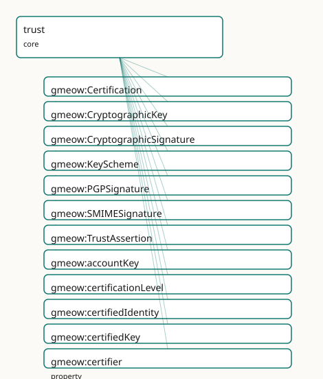

<!-- GENERATED by gmeow ontology-docs. DO NOT EDIT. Source hash: c99d8d50c0344040. -->

# GMEOW Trust Module

- **IRI:** <https://blackcatinformatics.ca/gmeow/slices/trust>
- **Tier:** core
- **[`Group`](../reference/classes/gmeow-Group.md):** core

## What This Slice Covers

This slice owns 34 terms and contributes 12 mapping or projection rows. Use it when its terms match the native fact you want to preserve; use the linkage tables to see how those facts leave GMEOW for consumer vocabularies.

## Dependencies

- [`gmeow:slices/accounts`](accounts.md)
- [`gmeow:slices/kernel`](kernel.md)

## Consumers

- Keys, certifications, and cryptographic signatures used by email wire-auth and attestation.

## Local Map



## Examples

### Web Of Trust

- **Source:** [`slices/core/trust/examples/web-of-trust.ttl`](https://github.com/Blackcat-Informatics/gmeow-ontology/blob/main/slices/core/trust/examples/web-of-trust.ttl)
- **GMEOW terms:** [`gmeow:Certification`](../reference/classes/gmeow-Certification.md), [`gmeow:CryptographicKey`](../reference/classes/gmeow-CryptographicKey.md), [`gmeow:Person`](../reference/classes/gmeow-Person.md), [`gmeow:TrustAssertion`](../reference/classes/gmeow-TrustAssertion.md), [`gmeow:certificationLevel`](../reference/properties/gmeow-certificationLevel.md), [`gmeow:certifiedIdentity`](../reference/properties/gmeow-certifiedIdentity.md), [`gmeow:certifiedKey`](../reference/properties/gmeow-certifiedKey.md), [`gmeow:certifier`](../reference/properties/gmeow-certifier.md), [`gmeow:endorses`](../reference/properties/gmeow-endorses.md), [`gmeow:fingerprint`](../reference/properties/gmeow-fingerprint.md)

```turtle
# SPDX-FileCopyrightText: 2026 Blackcat Informatics® Inc. <paudley@blackcatinformatics.ca>
# SPDX-License-Identifier: CC-BY-4.0
#
# Worked example: the PGP web of trust . Trust is decentralized and
# relational: agents gmeow:holdsKey cryptographic keys; one agent's
# gmeow:Certification signs another's key (a key-signing, binding key↔identity);
# and a gmeow:TrustAssertion records how much a trustor trusts a trustee AS AN
# INTRODUCER (gmeow:trustLevel + gmeow:introducerDepth — how far transitive trust
# may flow). gmeow:endorses is the lightweight, keyless vouch. No central
# authority: trust is asserted pairwise and composed.
@prefix gmeow: <https://blackcatinformatics.ca/gmeow/> .
@prefix ex:    <https://blackcatinformatics.ca/gmeow/examples/trust/> .

ex:alice a gmeow:Person ;
    gmeow:name     "Alice"@en ;
    gmeow:holdsKey ex:aliceKey ;
    gmeow:endorses ex:bob .

ex:bob a gmeow:Person ;
    gmeow:name     "Bob"@en ;
    gmeow:holdsKey ex:bobKey .

ex:aliceKey a gmeow:CryptographicKey ;
    gmeow:keyScheme    gmeow:keySchemePGP ;
    gmeow:keyAlgorithm "ed25519" ;
    gmeow:fingerprint  "ABCD 1234 EF56 7890 ABCD 1234 EF56 7890 ABCD 1234" ;
    gmeow:keyId        "0xEF567890" .

ex:bobKey a gmeow:CryptographicKey ;
    gmeow:keyScheme   gmeow:keySchemePGP ;
    gmeow:fingerprint "EF01 5678 ABCD 1234 EF01 5678 ABCD 1234 EF01 5678" .

# --- Alice signs Bob's key, certifying the key↔identity binding.
ex:cert a gmeow:Certification ;
    gmeow:certifier         ex:alice ;
    gmeow:certifiedKey      ex:bobKey ;
    gmeow:certifiedIdentity ex:bob ;
    gmeow:certificationLevel "positive" .

# --- Alice trusts Bob as a level-1 introducer (his certifications count for her).
ex:trust a gmeow:TrustAssertion ;
    gmeow:trustor         ex:alice ;
    gmeow:trustee         ex:bob ;
    gmeow:trustLevel      "full" ;
    gmeow:introducerDepth 1 .
```

## Terms

### Classes

| Term | Label | Definition |
|---|---|---|
| [`gmeow:Certification`](../reference/classes/gmeow-Certification.md) | Certification | A reified attestation that a cryptographic key belongs to a given identity, made by a certifying agent (a PGP key-signature / Web-of-Trust certification). Its... |
| [`gmeow:CryptographicKey`](../reference/classes/gmeow-CryptographicKey.md) | Cryptographic Key | A public key, certificate, or key material bound to an agent's identity — the thing a signature is made with and a certification vouches for. |
| [`gmeow:CryptographicSignature`](../reference/classes/gmeow-CryptographicSignature.md) | Cryptographic Signature | A cryptographic signature over a message or its headers, asserting origin and integrity. |
| [`gmeow:KeyScheme`](../reference/classes/gmeow-KeyScheme.md) | Key Scheme | The cryptographic scheme/format of a key (OpenPGP, X.509, SSH, Nostr, …). Modelled as a value, not a key subclass: the set of schemes is open-ended and they ca... |
| [`gmeow:PGPSignature`](../reference/classes/gmeow-PGPSignature.md) | PGP Signature | An OpenPGP signature (RFC 4880/9580, PGP-MIME RFC 3156) over a message, bound to a PGP key. |
| [`gmeow:SMIMESignature`](../reference/classes/gmeow-SMIMESignature.md) | S/MIME Signature | An S/MIME signature (RFC 8551) over a message, bound to an X.509 certificate. |
| [`gmeow:TrustAssertion`](../reference/classes/gmeow-TrustAssertion.md) | Trust Assertion | A reified, perspectival assertion that one agent (the trustor) trusts another (the trustee), optionally as an introducer to a given depth — the OpenPGP owner-t... |

### Properties

| Term | Label | Definition |
|---|---|---|
| [`gmeow:accountKey`](../reference/properties/gmeow-accountKey.md) | account key | Relates an online account to the cryptographic key that identifies it — the seam joining a decentralized-identity account (e.g. a Nostr account's nostrPubkey l... |
| [`gmeow:certificationLevel`](../reference/properties/gmeow-certificationLevel.md) | certification level | How carefully the binding was verified (OpenPGP certification level): generic, persona, casual, or positive. |
| [`gmeow:certifiedIdentity`](../reference/properties/gmeow-certifiedIdentity.md) | certified identity | The agent identity a certification binds the key to. |
| [`gmeow:certifiedKey`](../reference/properties/gmeow-certifiedKey.md) | certified key | The cryptographic key a certification vouches for. |
| [`gmeow:certifier`](../reference/properties/gmeow-certifier.md) | certifier | The agent that made a certification. |
| [`gmeow:endorses`](../reference/properties/gmeow-endorses.md) | endorses | A convenience shortcut recording that one agent vouches for another. Deliberately NOT symmetric (endorsement is directional) and NOT transitive (trust must not... |
| [`gmeow:fingerprint`](../reference/properties/gmeow-fingerprint.md) | fingerprint | A fingerprint (hash) identifying a key. Not functional: different sources may report differing or differently-formatted fingerprints for the same key. |
| [`gmeow:holdsKey`](../reference/properties/gmeow-holdsKey.md) | holds key | Relates an agent to a cryptographic key it holds. The period over which the agent held the key may be carried with gmeow:validFrom/validUntil on this statement. |
| [`gmeow:introducerAmount`](../reference/properties/gmeow-introducerAmount.md) | introducer amount | The trust-signature amount/weight the trustor assigns to the trustee as an introducer. |
| [`gmeow:introducerDepth`](../reference/properties/gmeow-introducerDepth.md) | introducer depth | The trust-signature depth: how many levels of indirect introducers the trustor is willing to follow (a trust-signature notion, not computed here). |
| [`gmeow:keyAlgorithm`](../reference/properties/gmeow-keyAlgorithm.md) | key algorithm | The key's algorithm (e.g. rsa, ed25519, secp256k1). Not functional (source-variable). |
| [`gmeow:keyExpiresAt`](../reference/properties/gmeow-keyExpiresAt.md) | key expires at | The instant a key is set to expire. Not functional (sources may report different expiry, and subkeys differ). |
| [`gmeow:keyId`](../reference/properties/gmeow-keyId.md) | key id | A short identifier for a key (e.g. a PGP long key id). Not functional (source-variable). |
| [`gmeow:keyMaterial`](../reference/properties/gmeow-keyMaterial.md) | key material | The public key material itself (armored or hex form). Not functional (encodings vary by source). |
| [`gmeow:keyScheme`](../reference/properties/gmeow-keyScheme.md) | key scheme | The scheme/format of a cryptographic key (one of the [`gmeow:KeyScheme`](../reference/classes/gmeow-KeyScheme.md) individuals). Functional: a key has exactly one scheme — a key of a different scheme is a... |
| [`gmeow:signatureAlgorithm`](../reference/properties/gmeow-signatureAlgorithm.md) | signature algorithm | The algorithm used for a signature (e.g. rsa-sha256, ed25519). |
| [`gmeow:signedBy`](../reference/properties/gmeow-signedBy.md) | signed by | The agent (or signing identity) that produced a signature. |
| [`gmeow:signingDomain`](../reference/properties/gmeow-signingDomain.md) | signing domain | The domain asserted by a signature (e.g. the DKIM d= tag). |
| [`gmeow:signingKey`](../reference/properties/gmeow-signingKey.md) | signing key | The cryptographic key that produced a signature (the trust module's CryptographicKey). Complements [`gmeow:signedBy`](../reference/properties/gmeow-signedBy.md): signedBy gives the identity, signingKey give... |
| [`gmeow:trustLevel`](../reference/properties/gmeow-trustLevel.md) | trust level | The degree of owner-trust expressed: ultimate, full, marginal, or none. |
| [`gmeow:trustee`](../reference/properties/gmeow-trustee.md) | trustee | The agent that is trusted by the trustor in a trust-assertion. |
| [`gmeow:trustor`](../reference/properties/gmeow-trustor.md) | trustor | The agent whose (subjective) trust a trust-assertion expresses — the perspective holder. |
| [`gmeow:verificationStatus`](../reference/properties/gmeow-verificationStatus.md) | verification status | The verification outcome of a signature: verified, failed, or unverified. |

### Individuals

| Term | Label | Definition |
|---|---|---|
| [`gmeow:keySchemeNostr`](../reference/individuals/gmeow-keySchemeNostr.md) | Nostr | The nostr key scheme — a cryptographic key format used to identify an agent or sign messages. |
| [`gmeow:keySchemePGP`](../reference/individuals/gmeow-keySchemePGP.md) | OpenPGP | The pgp key scheme — a cryptographic key format used to identify an agent or sign messages. |
| [`gmeow:keySchemeSSH`](../reference/individuals/gmeow-keySchemeSSH.md) | SSH | The ssh key scheme — a cryptographic key format used to identify an agent or sign messages. |
| [`gmeow:keySchemeX509`](../reference/individuals/gmeow-keySchemeX509.md) | X.509 | The x.509 key scheme — a cryptographic key format used to identify an agent or sign messages. |

## Linkages

- **Rows:** 12
- **Projection profiles:** `intoto`
- **External vocabularies:** `https`, `wd`, `wot`

| Source | Kind | Profile | Predicate/Relation | Target | Evidence |
|---|---|---|---|---|---|
| [`gmeow:Certification`](../reference/classes/gmeow-Certification.md) | equivalence | `-` | [skos:closeMatch](http://www.w3.org/2004/02/skos/core#closeMatch) | [wd:Q747527](https://www.wikidata.org/wiki/Q747527) | `gmeow-wikidata.sssom.tsv`; `gmeow:eqWikidata048`; confidence 0.8 |
| [`gmeow:Certification`](../reference/classes/gmeow-Certification.md) | equivalence | `-` | [skos:closeMatch](http://www.w3.org/2004/02/skos/core#closeMatch) | [wot:Endorsement](http://xmlns.com/wot/0.1/Endorsement) | `gmeow-trust.sssom.tsv`; `gmeow:eqTrust005`; confidence 0.8 |
| [`gmeow:CryptographicKey`](../reference/classes/gmeow-CryptographicKey.md) | equivalence | `-` | [skos:closeMatch](http://www.w3.org/2004/02/skos/core#closeMatch) | [wd:Q826762](https://www.wikidata.org/wiki/Q826762) | `gmeow-wikidata.sssom.tsv`; `gmeow:eqWikidata047`; confidence 0.85 |
| [`gmeow:CryptographicKey`](../reference/classes/gmeow-CryptographicKey.md) | equivalence | `-` | [skos:closeMatch](http://www.w3.org/2004/02/skos/core#closeMatch) | [wot:PubKey](http://xmlns.com/wot/0.1/PubKey) | `gmeow-trust.sssom.tsv`; `gmeow:eqTrust001`; confidence 0.9 |
| [`gmeow:certificationLevel`](../reference/properties/gmeow-certificationLevel.md) | equivalence | `-` | [skos:closeMatch](http://www.w3.org/2004/02/skos/core#closeMatch) | [wot:assurance](http://xmlns.com/wot/0.1/assurance) | `gmeow-trust.sssom.tsv`; `gmeow:eqTrust007`; confidence 0.7 |
| [`gmeow:certifier`](../reference/properties/gmeow-certifier.md) | equivalence | `-` | [skos:closeMatch](http://www.w3.org/2004/02/skos/core#closeMatch) | [wot:signer](http://xmlns.com/wot/0.1/signer) | `gmeow-trust.sssom.tsv`; `gmeow:eqTrust006`; confidence 0.8 |
| [`gmeow:fingerprint`](../reference/properties/gmeow-fingerprint.md) | equivalence | `-` | [skos:closeMatch](http://www.w3.org/2004/02/skos/core#closeMatch) | [wot:fingerprint](http://xmlns.com/wot/0.1/fingerprint) | `gmeow-trust.sssom.tsv`; `gmeow:eqTrust002`; confidence 0.95 |
| [`gmeow:holdsKey`](../reference/properties/gmeow-holdsKey.md) | equivalence | `-` | [skos:closeMatch](http://www.w3.org/2004/02/skos/core#closeMatch) | [wot:hasKey](http://xmlns.com/wot/0.1/hasKey) | `gmeow-trust.sssom.tsv`; `gmeow:eqTrust004`; confidence 0.9 |
| [`gmeow:keyId`](../reference/properties/gmeow-keyId.md) | equivalence | `-` | [skos:closeMatch](http://www.w3.org/2004/02/skos/core#closeMatch) | [wot:hex_id](http://xmlns.com/wot/0.1/hex_id) | `gmeow-trust.sssom.tsv`; `gmeow:eqTrust003`; confidence 0.9 |
| [`gmeow:CryptographicSignature`](../reference/classes/gmeow-CryptographicSignature.md) | projection | `intoto` | projects to / <= | https://in-toto.io/Statement/v1#signature | `gmeow:mapInTotoSignature`; confidence 0.6; lossy: signature bytes, algorithm, signed-by identity |
| [`gmeow:keyId`](../reference/properties/gmeow-keyId.md) | projection | `intoto` | projects to / <= | https://in-toto.io/Statement/v1#signature | `gmeow:mapInTotoSignature`; confidence 0.6; lossy: signature bytes, algorithm, signed-by identity |
| [`gmeow:signingKey`](../reference/properties/gmeow-signingKey.md) | projection | `intoto` | projects to / <= | https://in-toto.io/Statement/v1#signature | `gmeow:mapInTotoSignature`; confidence 0.6; lossy: signature bytes, algorithm, signed-by identity |

## Guide

<!-- SPDX-FileCopyrightText: 2026 Blackcat Informatics® Inc. <paudley@blackcatinformatics.ca> -->
<!-- SPDX-License-Identifier: CC-BY-4.0 -->

# Trust — keys, certifications, and perspectival owner-trust

> **Slice:** `https://blackcatinformatics.ca/gmeow/slices/trust` · **tier: core**
> The Web-of-Trust superset layer: who holds which key, who vouches for the binding, and who trusts whom — never computed, only recorded.

This is the cross-cutting trust facility — cryptographic keys, certifications
(key↔identity attestations), and owner-trust — the superset of OpenPGP (RFC 4880/9580),
X.509, SSH, and Nostr, aligned to the WOT schema by reference ([Principle 5](https://github.com/Blackcat-Informatics/gmeow-ontology/blob/main/CONSTITUTION.md#principle-5)). Its governing
refusal: trust here is **asserted and perspectival**; trust *metrics* (transitive validity
propagation) stay outside the logical core ([Principle 12](https://github.com/Blackcat-Informatics/gmeow-ontology/blob/main/CONSTITUTION.md#principle-12)). There is no global `trusts`
property, `endorses` is neither symmetric nor transitive, and no property chain ever makes
A trust C because A trusts B and B trusts C — bounding exactly that is what trust-signature
depth is *for*.

The slice exercises the standpoint doctrine that governs every contested-fact
slice: [`accordingTo`](../reference/properties/gmeow-accordingTo.md) (whose frame holds it) ⟂ [`wasAttributedTo`](../reference/properties/gmeow-wasAttributedTo.md) (which source recorded it)
⟂ `confidence` (how sure we are) — three axes that never bridge ([Principle 9](https://github.com/Blackcat-Informatics/gmeow-ontology/blob/main/CONSTITUTION.md#principle-9)). A
[`TrustAssertion`](../reference/classes/gmeow-TrustAssertion.md) is already perspectival (its trustor is the frame holder), but the
underlying [`Certification`](../reference/classes/gmeow-Certification.md) can *also* be disputed across standpoints — one holds the
binding unequivocal, another refutes it — through the cross-cutting facility
alone: no trust-specific dispute mechanism, no `primaryCertification`, no
`preferredTrust`. For the claim spine ([Principle 14](https://github.com/Blackcat-Informatics/gmeow-ontology/blob/main/CONSTITUTION.md#principle-14)), this slice is the attestation floor:
the keys and signatures that make a GTS memory package signed, append-only, and
model-attested are first-class individuals here.

## Keys

### [`gmeow:CryptographicKey`](../reference/classes/gmeow-CryptographicKey.md)

A public key, certificate, or key material bound to an agent's identity — the thing a
signature is made with and a certification vouches for. An [`InformationObject`](../reference/classes/gmeow-InformationObject.md). Carries
source-variable descriptors (`fingerprint`, [`keyId`](../reference/properties/gmeow-keyId.md), [`keyAlgorithm`](../reference/properties/gmeow-keyAlgorithm.md), [`keyMaterial`](../reference/properties/gmeow-keyMaterial.md),
[`keyExpiresAt`](../reference/properties/gmeow-keyExpiresAt.md)) — none functional, because different sources legitimately report
differing formats and values, and those reports coexist ([Principle 9](https://github.com/Blackcat-Informatics/gmeow-ontology/blob/main/CONSTITUTION.md#principle-9)).

### [`gmeow:KeyScheme`](../reference/classes/gmeow-KeyScheme.md)

The scheme/format of a key — [`keySchemePGP`](../reference/individuals/gmeow-keySchemePGP.md), [`keySchemeX509`](../reference/individuals/gmeow-keySchemeX509.md), [`keySchemeSSH`](../reference/individuals/gmeow-keySchemeSSH.md),
[`keySchemeNostr`](../reference/individuals/gmeow-keySchemeNostr.md) — a value vocabulary, never key subclasses: schemes are open-ended and
carry no distinct structure here, so a new scheme is a new individual (the standard
open-vocabulary move). [`gmeow:keyScheme`](../reference/properties/gmeow-keyScheme.md) is functional: a key of a different scheme is a
different key.

### [`gmeow:holdsKey`](../reference/properties/gmeow-holdsKey.md) · [`gmeow:accountKey`](../reference/properties/gmeow-accountKey.md)

The two possession seams: an [`Agent`](../reference/classes/gmeow-Agent.md) holds a key (tenure carried flat with
[`validFrom`](../reference/properties/gmeow-validFrom.md)/[`validUntil`](../reference/properties/gmeow-validUntil.md) on the statement — the flat-first pattern); an [`OnlineAccount`](../reference/classes/gmeow-OnlineAccount.md) is
identified by a key ([`accountKey`](../reference/properties/gmeow-accountKey.md) joins a decentralized-identity account, e.g. a Nostr
pubkey literal, to the key as a first-class entity).

## Certification — the WoT edge

### [`gmeow:Certification`](../reference/classes/gmeow-Certification.md)

A reified [`gufo:Relator`](../external/terms.md#gufo-relator): agent X attests that key K belongs to identity Y — the PGP
key-signature. EL-axiomatised to mediate a `certifier`, a [`certifiedKey`](../reference/properties/gmeow-certifiedKey.md), and a
[`certifiedIdentity`](../reference/properties/gmeow-certifiedIdentity.md) (all functional; closed-world cardinality is SHACL's, [Principle 7](https://github.com/Blackcat-Informatics/gmeow-ontology/blob/main/CONSTITUTION.md#principle-7)).
Certifications expire and are revoked, so the validity window rides on
[`validFrom`](../reference/properties/gmeow-validFrom.md)/[`validUntil`](../reference/properties/gmeow-validUntil.md) — revocation *sets* [`validUntil`](../reference/properties/gmeow-validUntil.md), it never deletes
([Principle 10](https://github.com/Blackcat-Informatics/gmeow-ontology/blob/main/CONSTITUTION.md#principle-10)).

### [`gmeow:certificationLevel`](../reference/properties/gmeow-certificationLevel.md)

How carefully the binding was verified — the OpenPGP ladder: generic, persona, casual,
positive. Recorded verbatim as input to downstream validity computation, never
interpreted by the reasoner.

## Owner-trust — perspectival by construction

### [`gmeow:TrustAssertion`](../reference/classes/gmeow-TrustAssertion.md)

The OpenPGP owner-trust notion, reified with an explicit `trustor` so one agent's
subjective trust never becomes a global fact: trustor, `trustee`, [`trustLevel`](../reference/properties/gmeow-trustLevel.md)
(ultimate / full / marginal / none), and a [`validFrom`](../reference/properties/gmeow-validFrom.md)/[`validUntil`](../reference/properties/gmeow-validUntil.md) window. The relator
*is* the standpoint — there is nothing to dispute about "S trusts T marginally" except
whether S really asserted it.

### [`gmeow:introducerDepth`](../reference/properties/gmeow-introducerDepth.md) · [`gmeow:introducerAmount`](../reference/properties/gmeow-introducerAmount.md)

The trust-signature parameters: how many levels of indirect introducers the trustor will
follow, and with what weight. These are *inputs* to a Web-of-Trust validity computation
that happens in the projection layer — represent inputs and outputs, never compute the
metric in OWL ([Principle 12](https://github.com/Blackcat-Informatics/gmeow-ontology/blob/main/CONSTITUTION.md#principle-12)).

### [`gmeow:endorses`](../reference/properties/gmeow-endorses.md)

The flat convenience shortcut for "vouches for" — deliberately directional (not
symmetric) and not transitive. Promote to a [`TrustAssertion`](../reference/classes/gmeow-TrustAssertion.md) when the trust needs a
level, a window, or its own identity: the flat↔reified pairing in its standard form.

## Signatures

### [`gmeow:CryptographicSignature`](../reference/classes/gmeow-CryptographicSignature.md)

A signature over any artifact — not only mail — asserting origin and integrity, with
subkinds [`PGPSignature`](../reference/classes/gmeow-PGPSignature.md) (RFC 4880/9580, PGP-MIME) and [`SMIMESignature`](../reference/classes/gmeow-SMIMESignature.md) (RFC 8551).
Re-homed beside the keys it references in the dependency surgery; the
email-wire half (DKIM, Authentication-Results, relay hops) lives in the email extension.

### [`gmeow:signedBy`](../reference/properties/gmeow-signedBy.md) · [`gmeow:signingKey`](../reference/properties/gmeow-signingKey.md)

The identity and the key — exactly the pair a [`Certification`](../reference/classes/gmeow-Certification.md) attests. [`signedBy`](../reference/properties/gmeow-signedBy.md) gives
the agent, [`signingKey`](../reference/properties/gmeow-signingKey.md) (functional) gives the [`CryptographicKey`](../reference/classes/gmeow-CryptographicKey.md); [`signatureAlgorithm`](../reference/properties/gmeow-signatureAlgorithm.md)
and [`signingDomain`](../reference/properties/gmeow-signingDomain.md) (the DKIM d= tag) describe the mechanism.

### [`gmeow:verificationStatus`](../reference/properties/gmeow-verificationStatus.md)

The recorded verification outcome — verified, failed, or unverified. A *report* of a
computation done outside the graph ([Principle 12](https://github.com/Blackcat-Informatics/gmeow-ontology/blob/main/CONSTITUTION.md#principle-12)), never an entailment: the reasoner
neither verifies signatures nor propagates their validity.

## Dependencies

Depends on `accounts` (the [`OnlineAccount`](../reference/classes/gmeow-OnlineAccount.md) seam) and `kernel`. Consumed wherever identity
must be vouched for: contacts, accounts, email wire-authentication, and the GTS packages'
COSE attestation chain ([Principle 14](https://github.com/Blackcat-Informatics/gmeow-ontology/blob/main/CONSTITUTION.md#principle-14)).
