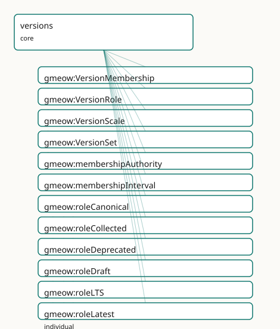

<!-- GENERATED by gmeow ontology-docs. DO NOT EDIT. Source hash: c99d8d50c0344040. -->

# GMEOW Versions Module

- **IRI:** <https://blackcatinformatics.ca/gmeow/slices/versions>
- **Tier:** core
- **[`Group`](../reference/classes/gmeow-Group.md):** core

## What This Slice Covers

This slice owns 26 terms and contributes 1 mapping or projection rows. Use it when its terms match the native fact you want to preserve; use the linkage tables to see how those facts leave GMEOW for consumer vocabularies.

## Dependencies

- [`gmeow:slices/kernel`](kernel.md)
- [`gmeow:slices/observations`](observations.md)
- [`gmeow:slices/temporal`](temporal.md)

## Consumers

- Version lineage for software, languages, creative works, and the ontology's own releases.

## Local Map



## Terms

### Classes

| Term | Label | Definition |
|---|---|---|
| [`gmeow:VersionMembership`](../reference/classes/gmeow-VersionMembership.md) | Version Membership | A reified, standpoint-scoped claim that a concrete entity belongs to a version set with a particular role and/or scale — an observation in the universal claim... |
| [`gmeow:VersionRole`](../reference/classes/gmeow-VersionRole.md) | Version Role | A role or status that an entity holds within a version set according to an authority — a VALUE, never an Entity subclass. Standpoint-scoped: 'latest' according... |
| [`gmeow:VersionScale`](../reference/classes/gmeow-VersionScale.md) | Version Scale | The magnitude scale of a version change — a VALUE, never an Entity subclass. Used for SemVer-style classification and analogous schemes in non-software domains. |
| [`gmeow:VersionSet`](../reference/classes/gmeow-VersionSet.md) | Version Set | A first-class information object representing a version family or release lineage — the set of all concrete artifacts that are versions of a common stable enti... |

### Properties

| Term | Label | Definition |
|---|---|---|
| [`gmeow:membershipAuthority`](../reference/properties/gmeow-membershipAuthority.md) | membership authority | The agent or standpoint that asserts this version membership and its role — a project maintainer, a package registry, a publisher, a curator, or a self-asserti... |
| [`gmeow:membershipInterval`](../reference/properties/gmeow-membershipInterval.md) | membership interval | The time interval over which this version membership / role claim holds. A relator carries its period this way (matching [`gmeow:usageInterval`](../reference/properties/gmeow-usageInterval.md), gmeow:taggingInte... |
| [`gmeow:versionFingerprint`](../reference/properties/gmeow-versionFingerprint.md) | version fingerprint | A content fingerprint of the versioned entity — a hash, SWHID, content digest, or semantic identifier. Broader than [`gmeow:contentDigest`](../reference/properties/gmeow-contentDigest.md) (which is byte-exact an... |
| [`gmeow:versionMember`](../reference/properties/gmeow-versionMember.md) | version member | The concrete entity that participates in a version set via this membership — a software release, a book edition, an email variant, a dataset snapshot. Function... |
| [`gmeow:versionRole`](../reference/properties/gmeow-versionRole.md) | version role | The role or status classification this membership asserts for the member within the set — canonical, variant, latest, stable, LTS, deprecated, yanked, draft, p... |
| [`gmeow:versionScale`](../reference/properties/gmeow-versionScale.md) | version scale | The scale classification of this membership — trivial, minor, major. NON-FUNCTIONAL: different authorities or schemes may classify the same change differently;... |
| [`gmeow:versionSet`](../reference/properties/gmeow-versionSet.md) | version set | The version set / lineage to which this membership belongs. Functional per relator: one set per VersionMembership. |

### Individuals

| Term | Label | Definition |
|---|---|---|
| [`gmeow:roleCanonical`](../reference/individuals/gmeow-roleCanonical.md) | canonical | The canonical version role — a status that a versioned artifact occupies in its release lifecycle. |
| [`gmeow:roleCollected`](../reference/individuals/gmeow-roleCollected.md) | collected | The collected version role — a status that a versioned artifact occupies in its release lifecycle. |
| [`gmeow:roleDeprecated`](../reference/individuals/gmeow-roleDeprecated.md) | deprecated | The deprecated version role — a status that a versioned artifact occupies in its release lifecycle. |
| [`gmeow:roleDraft`](../reference/individuals/gmeow-roleDraft.md) | draft | The draft version role — a status that a versioned artifact occupies in its release lifecycle. |
| [`gmeow:roleLTS`](../reference/individuals/gmeow-roleLTS.md) | long-term support (LTS) | The lts version role — a status that a versioned artifact occupies in its release lifecycle. |
| [`gmeow:roleLatest`](../reference/individuals/gmeow-roleLatest.md) | latest | The latest version role — a status that a versioned artifact occupies in its release lifecycle. |
| [`gmeow:rolePublished`](../reference/individuals/gmeow-rolePublished.md) | published | The published version role — a status that a versioned artifact occupies in its release lifecycle. |
| [`gmeow:roleRevised`](../reference/individuals/gmeow-roleRevised.md) | revised | The revised version role — a status that a versioned artifact occupies in its release lifecycle. |
| [`gmeow:roleStable`](../reference/individuals/gmeow-roleStable.md) | stable | The stable version role — a status that a versioned artifact occupies in its release lifecycle. |
| [`gmeow:roleVariant`](../reference/individuals/gmeow-roleVariant.md) | variant | The variant version role — a status that a versioned artifact occupies in its release lifecycle. |
| [`gmeow:roleWithdrawn`](../reference/individuals/gmeow-roleWithdrawn.md) | withdrawn | The withdrawn version role — a status that a versioned artifact occupies in its release lifecycle. |
| [`gmeow:roleYanked`](../reference/individuals/gmeow-roleYanked.md) | yanked | The yanked version role — a status that a versioned artifact occupies in its release lifecycle. |
| [`gmeow:scaleMajor`](../reference/individuals/gmeow-scaleMajor.md) | major | The major version scale — a magnitude category used to characterize the impact of a version change. |
| [`gmeow:scaleMinor`](../reference/individuals/gmeow-scaleMinor.md) | minor | The minor version scale — a magnitude category used to characterize the impact of a version change. |
| [`gmeow:scaleTrivial`](../reference/individuals/gmeow-scaleTrivial.md) | trivial | The trivial version scale — a magnitude category used to characterize the impact of a version change. |

## Linkages

- **Rows:** 1
- **Projection profiles:** -
- **External vocabularies:** `doap`

| Source | Kind | Profile | Predicate/Relation | Target | Evidence |
|---|---|---|---|---|---|
| [`gmeow:VersionSet`](../reference/classes/gmeow-VersionSet.md) | equivalence | `-` | [skos:closeMatch](http://www.w3.org/2004/02/skos/core#closeMatch) | [doap:Project](http://usefulinc.com/ns/doap#Project) | `gmeow-versions.sssom.tsv`; `gmeow:eqVersions003`; confidence 0.6 |

## Guide

<!-- SPDX-FileCopyrightText: 2026 Blackcat Informatics® Inc. <paudley@blackcatinformatics.ca> -->
<!-- SPDX-License-Identifier: CC-BY-4.0 -->

# Versions — modelling & interoperability guide

Most vocabularies model versions as ad-hoc attributes: [`schema:version`](https://schema.org/version) on a
[`CreativeWork`](../reference/classes/gmeow-CreativeWork.md), SemVer strings on a DOAP release, [`dcterms:isVersionOf`](http://purl.org/dc/terms/isVersionOf) between
dataset snapshots. Each domain reinvents its own taxonomy: `StableRelease`,
`YankedCrate`, `DefinitiveEdition`, `CanonicalEmail`.

GMEOW refuses this anti-pattern. **"Latest", "stable", "yanked", "canonical",
"definitive" are not intrinsic types** — they are standpoint-scoped claims
asserted by an authority (a registry, a publisher, a project, a curator). The
same artifact may be `latest` to npm and `deprecated` to a downstream mirror.
Both claims coexist without privilege ([Principle 9](https://github.com/Blackcat-Informatics/gmeow-ontology/blob/main/CONSTITUTION.md#principle-9)).

## Decision tree: which property to use?

| Situation | Use | Example |
|---|---|---|
| A concrete artifact belongs to a stable lineage | [`versionOf`](../reference/properties/gmeow-versionOf.md) | release-2.0.0 [`versionOf`](../reference/properties/gmeow-versionOf.md) my-library |
| A concrete edition of a creative work | [`editionOf`](../reference/properties/gmeow-editionOf.md) | annotated-edition [`editionOf`](../reference/properties/gmeow-editionOf.md) original-novel |
| One artifact replaces another | `supersedes` | `v2.0.0 supersedes v1.1.0` |
| Cross-frame correspondence without merge | [`counterpartOf`](../reference/properties/gmeow-counterpartOf.md) | robot-agent [`counterpartOf`](../reference/properties/gmeow-counterpartOf.md) person |
| Derivation/provenance chain | [`wasDerivedFrom`](../reference/properties/gmeow-wasDerivedFrom.md) | translation [`wasDerivedFrom`](../reference/properties/gmeow-wasDerivedFrom.md) original |
| Role/status within a version set (reified) | [`VersionMembership`](../reference/classes/gmeow-VersionMembership.md) | membership [`roleLatest`](../reference/individuals/gmeow-roleLatest.md) [`accordingTo`](../reference/properties/gmeow-accordingTo.md) registry |

The **thin spine** ([`versionOf`](../reference/properties/gmeow-versionOf.md), [`editionOf`](../reference/properties/gmeow-editionOf.md), `supersedes`, [`counterpartOf`](../reference/properties/gmeow-counterpartOf.md)) is
the 80 % flat shortcut. The **reified layer** ([`VersionMembership`](../reference/classes/gmeow-VersionMembership.md)) is promoted
when the role claim itself must carry authority, confidence, temporal scope, or
standpoint indexing.

## The reified layer: VersionMembership

A [`VersionMembership`](../reference/classes/gmeow-VersionMembership.md) is an [`Observation`](../reference/classes/gmeow-Observation.md) + `Relator` in the universal claim
stack. It mediates three things:

- **[`versionMember`](../reference/properties/gmeow-versionMember.md)** — the concrete artifact ([`observedFeature`](../reference/properties/gmeow-observedFeature.md))
- **[`versionSet`](../reference/properties/gmeow-versionSet.md)** — the lineage it belongs to
- **[`versionRole`](../reference/properties/gmeow-versionRole.md)** / **[`versionScale`](../reference/properties/gmeow-versionScale.md)** — the classification, as `QualityValue` individuals
- **[`membershipAuthority`](../reference/properties/gmeow-membershipAuthority.md)** (vantage) — who asserts this role
- **[`membershipInterval`](../reference/properties/gmeow-membershipInterval.md)** — when the claim holds

```turtle
@prefix gmeow: <https://blackcatinformatics.ca/gmeow/> .
@prefix ex:    <https://example.org/versions/> .

ex:myLibrary a gmeow:VersionSet ;
    gmeow:name "my-library"@en .

ex:v2_0 a gmeow:SoftwareAgent ;
    gmeow:versionOf ex:myLibrary ;
    gmeow:versionLabel "2.0.0" .

ex:memLatest a gmeow:VersionMembership ;
    gmeow:versionMember ex:v2_0 ;
    gmeow:versionSet ex:myLibrary ;
    gmeow:versionRole gmeow:roleLatest ;
    gmeow:membershipAuthority ex:npmRegistry .

ex:memLTS a gmeow:VersionMembership ;
    gmeow:versionMember ex:v2_0 ;
    gmeow:versionSet ex:myLibrary ;
    gmeow:versionRole gmeow:roleLTS ;
    gmeow:membershipAuthority ex:projectMaintainer .
```

`★` Two memberships on the same artifact, from two authorities, with two
roles — both are first-class and co-equal.

## Temporal scoping: never overwrite

When a release shifts from `latest` to `deprecated`, **do not overwrite the
old membership**. Preserve history by either:

1. **Closing the interval** — set an end date on [`membershipInterval`](../reference/properties/gmeow-membershipInterval.md).
2. **Minting a fresh membership** — create a new [`VersionMembership`](../reference/classes/gmeow-VersionMembership.md) for the
 new role, leaving the old one intact.

A deprecated or yanked release may carry [`gmeow:displayable`](../reference/properties/gmeow-displayable.md) false so it is
suppressed from consumer projections, but it is **never deleted** ([Principle 10](https://github.com/Blackcat-Informatics/gmeow-ontology/blob/main/CONSTITUTION.md#principle-10)).

```turtle
# Old membership retained
ex:memLatest a gmeow:VersionMembership ;
    gmeow:versionMember ex:v1_1 ;
    gmeow:versionSet ex:myLibrary ;
    gmeow:versionRole gmeow:roleLatest ;
    gmeow:membershipAuthority ex:npmRegistry .

# New membership for the deprecated state
ex:memDeprecated a gmeow:VersionMembership ;
    gmeow:versionMember ex:v1_1 ;
    gmeow:versionSet ex:myLibrary ;
    gmeow:versionRole gmeow:roleDeprecated ;
    gmeow:membershipAuthority ex:npmRegistry ;
    gmeow:displayable false .
```

## Separation from attestation layer

[`VersionMembership`](../reference/classes/gmeow-VersionMembership.md) records **what role is asserted** and **by whom**.
It does **not** embed the cryptographic or signed evidence for that assertion.

[`Attestation`](../reference/classes/gmeow-Attestation.md) evidence — release signatures, SLSA provenance, DOI/SWHID
assertions, yanked-release notices, registry attestations — belongs in the
future attestation layer and **composes with** [`VersionMembership`](../reference/classes/gmeow-VersionMembership.md) by
linking evidence to the same artifacts. A version role may be *attested by* a
registry, but the attestation is evidence **for** the role claim, not the role
itself.

```turtle
# : the role claim
ex:memLatest a gmeow:VersionMembership ;
    gmeow:versionRole gmeow:roleLatest ;
    gmeow:membershipAuthority ex:npmRegistry .

# : the attestation evidence
ex:sig a gmeow:AttestationArtifact ;
    gmeow:artifactMediaType "application/vnd.dsse+json" ;
    gmeow:hasSignature [ a gmeow:CryptographicSignature ] ;
    gmeow:wasAttributedTo ex:npmRegistry .
```

## Value vocabularies: open, not a fence

[`VersionRole`](../reference/classes/gmeow-VersionRole.md) and [`VersionScale`](../reference/classes/gmeow-VersionScale.md) are [`gufo:QualityValue`](../external/terms.md#gufo-qualityvalue) subclasses. The seed
list is an anchor, not a fence:

| Seed | Meaning |
|---|---|
| [`roleCanonical`](../reference/individuals/gmeow-roleCanonical.md) | The canonical/reference variant |
| [`roleVariant`](../reference/individuals/gmeow-roleVariant.md) | A non-canonical variant |
| [`roleLatest`](../reference/individuals/gmeow-roleLatest.md) | The most recent release |
| [`roleStable`](../reference/individuals/gmeow-roleStable.md) | Considered stable by the authority |
| [`roleLTS`](../reference/individuals/gmeow-roleLTS.md) | Long-term support commitment |
| [`roleDeprecated`](../reference/individuals/gmeow-roleDeprecated.md) | Discouraged but retained |
| [`roleYanked`](../reference/individuals/gmeow-roleYanked.md) | Withdrawn with urgency |
| [`roleDraft`](../reference/individuals/gmeow-roleDraft.md) | Unpublished / in-progress |
| [`rolePublished`](../reference/individuals/gmeow-rolePublished.md) | Publicly available |
| [`roleRevised`](../reference/individuals/gmeow-roleRevised.md) | A revised edition |
| [`roleCollected`](../reference/individuals/gmeow-roleCollected.md) | Part of a collected volume |
| [`roleWithdrawn`](../reference/individuals/gmeow-roleWithdrawn.md) | Formally withdrawn |
| [`scaleTrivial`](../reference/individuals/gmeow-scaleTrivial.md) | Patch-level change |
| [`scaleMinor`](../reference/individuals/gmeow-scaleMinor.md) | Backward-compatible change |
| [`scaleMajor`](../reference/individuals/gmeow-scaleMajor.md) | Breaking change |

Domain-specific values (e.g. `roleNightly`, `roleReleaseCandidate`) are minted
as fresh individuals carrying [`rdfs:label`](http://www.w3.org/2000/01/rdf-schema#label).

## Projections

The mapping compiler generates SSSOM/EDOAL/SPARQL projections from
`mapping-dsl/`. Cross-vocabulary mappings include:

| GMEOW | schema.org | DOAP | Wikidata |
|---|---|---|---|
| [`VersionSet`](../reference/classes/gmeow-VersionSet.md) | — | [`doap:Project`](http://usefulinc.com/ns/doap#Project) (lineage) | — |
| [`versionOf`](../reference/properties/gmeow-versionOf.md) | — | — | P548 (version type) |
| [`versionLabel`](../reference/properties/gmeow-versionLabel.md) | [`schema:version`](https://schema.org/version) | [`doap:revision`](http://usefulinc.com/ns/doap#revision) | — |
| [`versionRole`](../reference/properties/gmeow-versionRole.md) | — | — | P548 qualifier |
| `supersedes` | — | — | P1365 (replaces) |

`★` Projections are lossy by design. A "latest" selection rule lives in the
importer/solver, never as an OWL axiom ([Principle 12](https://github.com/Blackcat-Informatics/gmeow-ontology/blob/main/CONSTITUTION.md#principle-12)).
